# Gevorderde Algoritmen

## Puntenverdeling

* Niet-periodegebonden evaluatie
  * vaardigheidstest op PC (20 % van de eindscore) 
* Periodegebonden evaluatie: 
  * schriftelijk examen (50 % van de eindscore) en vaardigheidstest 
  * op PC (30% van de eindscore) 

Wanneer men minder dan 8/20 heeft voor het schriftelijk examen en/of voor het deelcijfer van • de vaardigheidstesten kan men niet meer slagen voor het geheel van het opleidingsonderdeel.


# ------------Grafen-----------

# Grafen deel 1


## Grafen

Een graaf bestaat uit:

* Een verzameling **knopen** $V_g$ (vertices)
* Een verzameling **takken** $E_g$ (edges)

### Definities

* De **incidentie** van een knoop $v$: $I(v)$, is de verzameling van alle takken die in die knoop toekomen
* De **graad** van een knoop $v$: $\delta (v) = \# I(v)$ is het aantal takken van de graaf die in $v$ toekomen
* De **omgeving** van een **knoop** $v$: $A(v)$, oftewel adjacency is de verzameling van alle buurknopen van $v$
* De **omgeving** van een **tak** $e$  is de verzameling van alle takken van de graaf die een knoop gemeenschappelijk hebben met $e$
* Een **tocht** is gewoon een sequentie van knopen die je overloopt, met mogelijks dezelfde knoop meermaals te bezoeken
* Een **pad** is een tocht waarbij geen enkele knoop herhaald wordt. De begin en eindknoop zijn dus ook verschillend.
* **Een cyclus** is een tocht waarbij de begin- en eindknoop hetzelfde zijn, en bovendien in de weg daartussen elke knoop maar één keer voorkomt.
* Twee knopen zijn **geconnecteerd** als er een pad tussen bestaat. Een graaf is geconnecteerd als dit geldt voor elk paar knopen van de graaf.

### Voorstelling

Een graaf kan je voorstellen op andere manieren dan een tekening, zodat de computer hem kan begrijpen. 

* Als een **opsomming** van knopen en takken
  * Dat ziet er dan zo uit:
  * $V = \{v_1,v_2,v_3\}$
  * $E=\{v_1v_2, v_2v_3\}$
* Aan de hand van **burenlijsten**
  * Voor elke knoop hou je een lijst bij met zijn buren:
  * $v_1: v_2$
  * $v_2: v_1,v_3$
  * $v_3:v_2$

Twee grafen worden **isomorf** als er een bijectie bestaat tussen hun knopenverzamelingen die een bijectie induceert tussen hun takkenverzamelingen. Dit betekent simpelweg dat ze dezelfde graaf zijn, maar anders getekend of met andere labels. Deze grafen zijn isomorf:

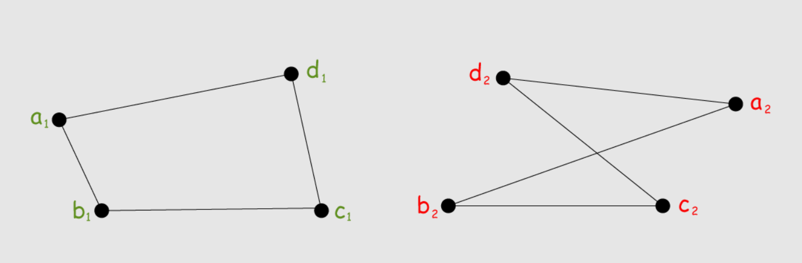


### Speciale grafen

Een **boom** is een geconnecteerde graaf die geen cycli bevat. Ik ga even niet uitleggen wat een boom is. 

:bulb: Eigenschap: Een boom met $p$ knopen heeft $p-1$ takken: $q = p-1$

<u>Bewijs met inductie</u>:

* Voor $p=1$ geldt de eigenschap ($1$ knoop en $0$ takken)
* We veronderstellen dat de eigenschap geldt voor alle bomen met orde $\leq k$. Dan moeten we nu bewijzen dat de eigenschap geldt voor een boom met orde $k+1$
* Neem één tak weg uit de boom met orde $k+1$
  * De boom valt altijd uit elkaar in twee bomen, want een boom bevat geen cycli.
  * We noemen deze resulterende bomen $p_1$ en $p_2$, ze hebben beide orde $\leq k$, dus geldt de eigenschap.  
  * Het aantal knopen van deze bomen samen is: $p_1+p_2 = p$
* Het totale aantal takken in de originele boom met orde $k+1$ is: $q = (p_1 - 1) + (p_2-1)+1$
  * De $+1$ is de tak die we daarnet hadden weggehaald
  * Voor de deelbomen mogen we de eigenschap gebruiken: $q_1 = p_1 -1$
  * Zelfde voor $q_2 = p_2 -1$
* Omdat $p_1+p_2 = p$
  * $q = (p_1 - 1) + (p_2-1)+1 = p-1$ en de eigenschap is bewezen.


#### Complete grafen

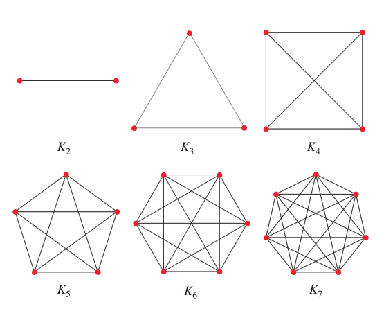

Een **complete graaf** is een graaf waarbij elke twee verschillende knopen met elkaar verbonden zijn. Voor elk aantal knopen $p$ is er één mogelijke complete graaf $K_p$.

Een complete graaf met $p$ knopen bevat $C_p^2 = \frac{p(p-1)} 2$ takken.


### Digrafen

Een gerichte graaf of **digraaf** bestaat uit:

* Een verzameling **knopen**: $V$
* Een verzameling **pijlen**: $A$. Een pijl is een koppel van knopen, waar de volgorde van belang is.

Zo kunnen twee knopen dubbel verbonden zijn, zolang hun pijlen in tegenovergestelde richting lopen.

* De **uit-incidentie** van een knoop $v$, genoteerd als $I(v)$, bevat de pijlen die uit $v$ vertrekken
* De **in-incidentie** $I'(v)$ bevat de pijlen die in $v$ toekomen.

Een **tocht** in een digraaf moet altijd de richting van de pijlen volgen. 

Een **diboom** is een digraaf zonder anti-parallelle pijlen waarvan de onderliggende graaf een boom is. Het is dan wel meestal niet mogelijk om van elke knoop een pad te vinden naar elke andere knoop, waardoor een diboom dus meestal **niet geconnecteerd** is. 

Een **complete digraaf** is een digraaf waarbij elke pijl een anti-parallelle pijl heeft en waarbij de onderliggende graaf een complete graaf vormt. 


## Systematisch zoeken in een graaf

Een diboom wordt een **gewortelde diboom** genoemd als er een knoop bestaat waaruit er naar elke andere knoop een pad bestaat. Deze knoop is dan de **wortel**. 

Een graaf $G'$ is een **opspannende subgraaf** van $G$ als:

* $G'$ is geconnecteerd
* $G$ en $G'$ hebben dezelfde knopenverzameling
* Alle takken van $G'$ behoren ook tot $G$

Als $G'$ ook een boom is, is $G'$ een **opspannende boom** van $G$. 

Een gewortelde diboom $T$ wordt een **opspannende gewortelde diboom** van een graaf $G$ genoemd als de onderliggende graaf van $T$ een opspannende boom van $G$ is. 


### Breedte-eerst zoeken

Bij breedte eerst zoeken, loop je alle knopen van een graaf af, beginnend bij een gekozen knoop. Vervolgens overloop je eerst alle buren van deze gekozen knoop af. Dan loop je van elk van de buren van de buren af. 

Iets concreter:

* Je hebt je graaf $G$ en je maakt een nieuwe diboom aan. Hieraan voeg je de wortelknoop $r$ (de beginknoop van je zoektocht) toe.
* Overloop alle buren $b_1, b_2, \dots$ van $r$ en voeg ze toe aan de diboom. 
* Herhaal de procedure voor $b_1$, vervolgens voor $b_2, \dots$
* Doe dit verder voor de buren van de buren

**Pros-and-cons**

* Eenvoudig te implementeren
* Het duurt lang voordat je de eerste bladknoop hebt bezocht, en is dus niet handig voor beslissingsproblemen
* Heeft meestal meer geheugenruimte nodig dan DFS, je zal alle gedeeltelijke oplossingen (de niet-bladknopen) moeten opslaan tijdens de uitvoer
* Kan gebruikt worden om de hop-count afstand te bepalen vanuit de wortelknoop. Ook gekend als het algoritme van Moore


### Diepte-eerst zoeken

Dit is het omgekeerde van breedte-eerst zoeken. Je gaat zo snel mogelijk in de diepte:

* Vertrek weer vanaf een gekozen wortel
* Neem zijn eerste buur
* Neem de eerste buur van deze buur
* Wanneer je vast komt te zitten, ga je één niveau omhoog, en neem je dus de volgende buur van de vorige knoop
* Herhaal

Je kan dit algoritme gebruiken om snel na te gaan of een graaf al dan niet geconnecteerd is.

**Pros-and-cons**

* Complexer om te te implementeren dan BFS, omdat je moet terugkrabbelen
* Nuttig voor beslissingsproblemen, omdat je snel bij een bladknoop (en dus een oplossing) komt
* Heeft meestal minder geheugenruimte nodig dan BFS, het volstaat meestal om de boomstructuur en de tot nu toe best gevonden oplossing bij te houden


### Toepassingen BFS en DFS

* BFS kan gebruikt worden om de hop-count tot alle knopen vanuit een bepaalde knoop te bepalen.
* Om in een netwerk een multicast te sturen kan men BFS of DFS gebruiken.
* Beide kunnen gebruikt worden om na te gaan of een graaf al dan niet geconnecteerd is.
* Beide kunnen ook worden gebruikt om een beslissingsboom te doorlopen.

## Minimale opspannende boom

We beginnen met enkele definities:

* Een **gewogen graaf** $G$ is een graaf waarbij elke tak een gewicht is toegekend. Het gewicht van deze graaf is de som van alle takgewichten
* Een **gewicht** $w(e)$ van een tak is een reëel getal dat aangeeft welke 'kost' wordt aangerekend voor het gebruik van deze tak

Een **minimale opspannende boom** van een graaf $G$ is een is een opspannende subgraaf $G'$ met minimaal gewicht. Dit is een optimalisatieprobleem en heeft altijd een opspannende boom als oplossing, zijnde $G'$. Zoals ik het begrijp is deze boom dus een subset van de graaf, die ervoor zorgt dat alles **lusloos** verbonden is, met een **zo laag mogelijk totaal gewicht**. 

:bulb:<u>Bewijs</u>

* We hebben een gewogen, geconnecteerde graaf $G$ met positieve takgewichten. 
* We tonen aan dat het probleem zeker een oplossing heeft:
  * $G$ heeft zeker één opspannende subgraaf: $G$ zelf.
  * $G$ heeft $2^q$ subgrafen met dezelfde knopenverzameling, sommige hiervan zijn opspannend.
  * Er zijn dus meer dan één en minder dan oneindig opspannende subgrafen. Er bestaat zeker een element uit deze verzameling met minimaal gewicht.
* We tonen aan dat minstens één opspannende subgraaf van $G$ met minimaal gewicht een opspannende boom is. Veronderstel dat dit element $G'$ bestaat.
  * Als $G'$ een boom is, dan is hij ook een opspannende boom, want hij is sowieso een opspannende subgraaf.
  * Als $G'$ geen boom is
    * Dan bevat $G'$ minstens één cyclus
    * We kunnen dus een tak wegnemen
      * Deze tak heeft altijd gewicht $0$ (want het gewicht van de graaf was minimaal)
    * Dit kunnen we herhalen totdat $G'$ geen cycli heeft en dus een boom is
* We hebben dus zeker minstens één minimale oplossing die ook een opspannende boom is, maar niet alle minimale oplossingen zijn opspannende bomen. 


Hoe kunnen we nu op een efficiënte manier zo'n minimale opspannende boom vinden op een graaf met positieve gewichten?

### Algoritme van Kruskal


Dit algoritme kan je gebruiken om de minimale opspannende boom van een graaf te vinden. Dit doe je als volgt:

* Neem je graaf zonder takken.
* Neem de kortste tak die twee componenten van je graaf verbindt. Je mag dus geen tak kiezen die delen aan elkaar verbindt die al verbonden zijn in een vorige stap. Voeg deze tak toe aan de graaf.
* Het algoritme is klaar als je geen tak meer vindt.
* Nu heb je de minimale opspannende boom gemaakt. Dit is ook de optimale oplossing.

Nog enkele leuke feitjes. Het algoritme van Kruskal is een gulzig algoritme, omdat we bij elke stap kortzichtig de schijnbaar beste optie nemen. Iemand heeft ook bewezen dat de tijdscomplexiteit van dit algoritme $O(q \log q)$ bedraagt, met $q=(\#E_G)$, zijnde het aantal takken in de graaf $G$.


## Kortste pad

### Afstand in een gewogen graaf

* De **lengte** van een pad in een gewogen graaf is de som van de gewichten van de takken langs dit pad
* De **afstand** tussen twee knopen van een gewogen graaf is de lengte van het kortste pad tussen deze twee knopen


### Algoritme van Dijkstra


Dit algoritme wordt gebruikt om het kortste pad tussen twee knopen $s$ en $q$ in een gewogen graaf te vinden, op voorwaarde dat de takken van de graaf enkel positieve gewichten hebben. Als bijgevolg van de uitvoering van dit algoritme worden ook alle kortste paden vanuit $p$ naar alle andere knopen berekend.

Je kan het algoritme implementeren als volgt. Eerst zullen we een paar variabelen moeten aanmaken

* Een permanente verzameling $P$: deze bevat alle knopen waarvan we al zeker weten dat we de kortste afstand ernaar hebben gevonden. 
* $T$: een verzameling tijdelijke knopen. Van deze knopen weten we nog niet zeker of we de kortste afstand ernaar gevonden hebben
* Voor elke knoop $v$ houden we een label $l(v)$ bij. Dit label bevat de tot nu toe gevonden afstand naar $v$

Dan voeren we het algoritme uit:

* Neem je startknoop $s$ en voeg deze toe aan $T$
* Vanaf hier herhalen
* Neem de knoop $q$ met de het kleinste label $l(q)$ uit $T$. Omdat dit het kleinste label van de knopen in $T$ is, weten we zeker dat dit een optimaal pad is. Steek $q$ dus in $P$, als deze er nog niet in zat.
* Voeg alle buren $b_1, \dots, b_n$ van $q$ toe aan $T$, en update hun labels als volgt $l(b_n) = l(q) + d(b_n, q)$, als deze afstand kleiner is dan het huidige label.
* Uiteindelijk loopt $T$ leeg en is je algoritme klaar

Als kleine optimalisatie kunnen we het algoritme vroegtijdig afbreken wanneer $q$ aan $T$ wordt toegevoegd.


:bulb:<u>Bewijs</u>: 

We willen bewijzen dat na uitvoering van het algoritme de labels de correcte afstand vanuit $s$ voorstellen.

We tonen eerst aan dat tijdens het uitvoeren, alle labels in de permanente verzameling de juiste afstand vanuit $s$ voorstellen
$$
\forall v \in P :l(v) = d(s,v)
$$
We moeten alleen aantonen dat de eigenschap geldt, vlak voordat $v$ aan de permanente verzameling werd toegevoegd, want hij verandert daarna toch niet meer. Dit gaat met inductie:

* Basisstap

  * We voegen de startknoop toe aan de permanente verzameling. $l(s)=0$. 
  * Dit is sowieso de correcte afstand

* Inductie 

  * We hebben nu zogezegd $x$ iteratiestappen doorlopen, we veronderstellen dat deze allemaal tot een geldige afstand hebben geleid.

  * Op stap $x+1$ voegen we knoop $w$ toe. We willen aantonen dat $l(w) = d(s,w)$

  * We splitsen deze stelling in twee, als we beide kunnen bewijzen hebben we de stelling ook bewezen:  

  * $l(w) \geq d(s,w)$ 

    * Als $l(w) = +\infty$ , zitten we sowieso goed.
    * Als $l(w) \leq +\infty$, dan is $l(w)$ de lengte van een pad. $d(s,w)$ is het kortste pad dus deze is zeker niet langer. 
    * Deze stelling is bewezen.

  * $l(w) \leq d(s,w)$

    * $$
      \begin{align}
      l(w) &= \min \{l(y) \space \vert \space y \in T \} &(1) \\
      &= \min \{ l(x) + c(\{x,y\}) \space \vert \space x \in P , y \in T  \} &(2)\\
      &= \min \{ d(s,x) + c(\{x,y\}) \space \vert \space x \in P , y \in T  \} &(3) \\
      &= \min \{ d(s,y) \space \vert \space y \in T \} &(4) \\
      &\leq d(s,w) &(5)
      \end{align}
      $$

    1. $l(w)$ is gelijk aan het kleinste label in de tijdelijke verzameling
    2. Is gelijk aan de kleinse som van een label in de permanente en een tak die aan die knoop hangt. 
    3. Door onze veronderstelling dat de regel al geldt voor de eerste $x$ stappen, is dit label sowieso de kortste afstand $d(s,x)$. 
    4. De kortste afstand van $s$ naar $x$ en de kleinste tak van $x$ naar $y$ zijn samen de kortste afstand van $s$ naar $y$.
    5. De afstand van de vorige stap kan sowieso niet groter zijn dan de afstand van $s$ naar $w$, want $\min \{ d(s,y) \space \vert \space y \in T \}$ is de van alle kortste afstanden in de tijdelijke verzameling de kortste. We hebben de stelling bewezen.


Het algoritme van Dijkstra heeft een tijdscomplexiteit van $O(p^2)$, met $p= \#V_G$ (het aantal knopen)


### Andere kortste-padalgoritmen

Hier een kleine opsomming:

* Het **algoritme van Moore** berekent een kortste-padboom van een knoop $s$ naar alle andere knopen in een **niet-gewogen** graaf, en kan uitgebreid worden voor niet-gewogen digrafen.
* Het **algoritme van Dijkstra** berekent een kortste-padboom van een knoop $s$ in een gewogen graaf naar alle andere knopen, maar mag alleen gebruikt worden als de graaf uitsluitend positieve gewichten bevat.
* Het **algoritme van Ford, Bellman en Moore** heeft hetzelfde doel als Dijkstra, maar negatieve gewichten zijn toegestaan.
* Als je alle kortste paden van en naar alle knopen wilt berekenen, is het **algoritme van Floyd** een betere aanpak dan de andere geziene algoritmen, om efficiëntieredenen.


### Begrippen

* De **excentriciteit** van een $v$ is de afstand van $v$ naar de knoop die het verst van $v$ gelegen is
* De **straal** van een gewogen graaf is de minimale excentriciteit van deze graaf
* De **diameter** is de maximale excentriciteit van een graaf


## Vlakke grafen


Een graaf $G$ is een **vlakke graaf** als je hem kan tekenen in een vlak, zonder dat de takken elkaar kruisen. Kennis over vlakke grafen is uitermate nuttig wij de constructie van wegen of spoorwegen, want je wil natuurlijk vaak kruisingen vermijden indien mogelijk.


//TODO sferische voorstelling (ik vond dit momenteel nog niet super belangrijk)


### Vlakke voorstelling van geconnecteerde grafen

* De gebieden, begrensd door de takken van de graaf, noemen we **interne gebieden**
* Het onbegrensd gebied buiten de graaf noemen we het **externe gebied**
* De takken die een gebied begrenzen, vormen samen een **maas (mesh)**. Er zijn dus ook interne en externe mazen. Het aantal mazen in een graaf is altijd gelijk aan het aantal gebieden, behalve bij een ringvormige graaf.

De tweede graaf hierboven bevat 3 interne gebieden en één extern gebied. Het aantal gebieden $g$ van de vlakke voorstelling van een geconnecteerde graaf kan berekend worden met:

* $g = q-p+2$, met $p$ het aantal knopen en $q$ het aantal takken


:bulb: <u>Bewijs met inductie</u>

* Basisgeval
  * Er is maar één mogelijke graaf met $q=0$. Deze bestaat uit één knoop.
  * $g = 0 - 1 +2 = 1 \xRightarrow{\quad}$  Er is één gebied, het externe gebied. De formule klopt.
* Inductie
  * We veronderstellen dat de formule geld voor $q=k$. Nu willen we bewijzen dat hij geldt voor $q = k+1$. We kunnen opsplitsen in twee gevallen (voor de graaf $G$ met $k+1$ takken):
  * $G$ is een boom
    * $q = p-1$ (geldt voor alle bomen)
    * Een boom heeft maar één gebied, het extern gebied: $g=1$
    * $g = (p-1) - p + 2 = 1$
    * Dit klopt, voor dit deel was inductie niet eens nodig.
  * $G$ is geen boom
    * Er bestaat een tak $e$ die op een cyclus ligt
    * We nemen de graaf $G'$ (dit is $G$ zonder $e$), een vlakke geconnecteerde graaf met $k$ takken
    * Volgens onze inductiehypothese heeft deze $g = q - p + 2$ gebieden
    * Als we $e$ toevoegen aan $G'$ krijgen we één gebied meer
    * $g = q - p + 2 + 1$
    * $g = (k+1) - p + 2$
    * De stelling is bewezen


### Vlakheidstest

Hoe kunnen we weten of een graaf dan nu een vlakke graaf is? En als we dan weten dat hij vlak is, hoe vinden we dan zijn vlakke voorstelling? Find out in the next episode of martijnsamenvattingen.

Godverdomme nu dacht ik dat we een coole uitleg gingen krijgen, maar ik ging naar de volgende pagina in de cursus en werd begroet met de volgende boodschap: *De precieze werking van dit algoritme ... valt buiten het kader van deze cursus*


## Kleuren van grafen


Een **knoopkleuring** (vertex coloring ... *de traumas van vorig semester komen weer boven*) van een graaf is is het toewijzen van een kleur aan elke knoop, waarbij twee buurknopen altijd een verschillende kleur hebben. Dit is bijvoorbeeld handig bij GSM-netwerken, waarbij aangrenzende masten geen overlappende frequenties mogen gebruiken.

We zijn natuurlijk meestal op zoek naar de optimale knoopkleuring, waarbij we de graaf kleuren met een **minimaal aantal kleuren**. Dit minimale aantal noemen we het **chromatisch getal**.


### Onder- en bovengrens chromatisch getal

We kunnen met onze big brains gemakkelijk afleiden dat we een knoop $v$ met met graad $\delta(v)$ en zijn buren altijd verschillend kunnen kleuren als we over $\delta(v) + 1$ kleuren beschikken. We weten dus dat het chromatisch getal ten hoogste één groter zal zijn dan de hoogste knoopgraad:
$$
\chi(G) \leq 1 + \delta_\text{max}
$$

* Een **kliek **is een complete subgraaf van $G$, die geen deel uitmaakt van een grotere complete subgraaf. Dit komt overeen met een groep mensen waarbij iedereen iedereen kent.
* Het aantal knopen in de grootste kliek in een graaf noemt met het **kliekgetal** $\omega(G)$

Alle knopen in een kliek moeten een verschillende kleur krijgen. Zo vormt het kliekgetal dus een ondergrens voor ons kleurenprobleem.
$$
\omega(G) \leq \chi(G)
$$


### Oplossingsmethode (sequentiële kleuring)

Dit algoritme is een heuristiek, en vindt niet altijd de optimale oplossing. Het is wel een gemakkelijke en efficiënte manier om dit probleem aan te pakken.

* Overloop sequentieel alle knopen $v_1, v_2, \dots ,v_n$
* Ken aan elke knoop $v$ het laagst mogelijke kleurnummer toe. Dit is dus de laagste kleur in je lijst die niet door één van de buurknopen van $v$ wordt gebruikt.


### Het vierkleurenprobleem

Is het mogelijk om met vier kleuren elke mogelijke landkaart in te kleuren zodat buurlanden nooit dezelfde kleur krijgen?

Als we van elk land een knoop maken, met een tak naar elk aangrenzend land, kan je dit probleem omvormen tot een grafenprobleem. Het antwoord op de vraag is 'Ja'. 


### Takkleuringen

Hetzelfde probleem, maar dit keer gaan we takken kleuren, en mogen takken aan dezelfde knoop niet dezelfde kleur krijgen. Je kan dit probleem eenvoudig omvormen naar een knoopkleuringsprobleem.

* Maak van elke tak een knoop
* Verbind alle knopen in de nieuwe graaf waarbij de overeenkomstige takken in de vorige graaf in dezelfde knoop uitkwamen.


## Koppelingen en toewijzingen

### Koppelingen

We hebben een graaf $G$. Een **koppel** zijn simpelweg twee gekozen knopen die met elkaar verbonden zijn. Een deelverzameling $K$ van $E_G$ (de takken van $G$) is een **koppeling** van $G$ als geen takken uit $K$ een knoop gemeenschappelijk hebben. Eén object kan dus niet tegelijkertijd tot meerdere koppels behoren. Het maximale aantal koppels die je kan maken in een graaf noem je de **maximumkoppeling**. Hoe vinden we deze? 

Eerst moeten we weten wat een **K-alternerend pad** nu precies is. Dit is een pad van een graaf met een koppeling $K$ waarvan de takken afwisselend wel en niet tot $K$ behoren. 

* Een koppeling $K$ in $G$ is een maximumkoppeling $\iff$ er bestaat geen groter K-alternerend pad

Een **vergrotend K-alternerend pad** is hetzelfde, maar de begin- en eindknoop vormen geen koppel. 

//TODO bewijs (niet te kennen)


### Toewijzingen

Een **tweedelige graaf** is een graaf waarvan je de knopenverzameling in twee verzamelingen $V_1$ en $V_2$ kan verdelen op zodanige wijze dat elke tak een knoop van $V_1$ met $V_2$ verbindt. De afbeelding maakt het iets duidelijker. De nummertjes en lettertjes zijn niet echt van belang, maar dit is het mooiste plaatje dat ik vond op google. (want onze prof zet om de één of andere vage reden zijn slides niet online)


Een koppeling in een tweedelige graaf noemt men een **toewijzing**. Dit wordt iets duidelijker als de de twee delen van de graaf ziet als objecten. Zo kunnen in de graaf hierboven de rode knopen werknemers voorstellen, en de blauwe pisbakken. Nu kunnen we pisbakken toewijzen aan elke werknemer.

In het geval van zo'n graaf is het makkelijker om een vergrotend K-alternerend pad te vinden. Dit doe je zo:

* Neem een niet-gekoppelde knoop $v$
* Construeer vanuit $v$ een boom met alle K-alternerende paden vanuit deze knoop
  * Dit kan met BFS of DFS
  * Je mag stoppen wanneer je een niet-gekoppelde knoop verschillend van je startknoop tegenkomt. Of als je je boom niet meer kan uitbreiden en dus alle uiteinden gekoppelde knopen zijn.
* Als je resulterende boom een uiteinde bevat dat niet gekoppeld is, hebben we een vergrotend K-alternerend pad gevonden. Is dit niet het geval, dan bestaat er geen vergrotend K-alternerend pad met $v$ als eindknoop.
* Herhaal deze procedure voor alle niet-gekoppelde knopen. Als we geen vergrotende K-alternerende paden vinden, dan weten we dat we al over een maximumkoppeling beschikken.

## Test Jezelf

> 1. Gegeven is een graaf $G = (V,E)$. Als je op willekeurige wijze een aantal ($> 1$) knopen kiest uit deze knopenverzameling ($V' < V$), en eveneens op willekeurige wijze een aantal takken kiest uit deze takkenverzameling ($E' < E$), is $ G' = (V',E") $dan zeker een subgraaf van $G$?

Nee, want een willekeurige subset van knopen en takken vormt niet altijd een geldige graaf. Als de graaf niet geldig is kan hij ook geen subgraaf zijn.


> 2. Een alternatieve definitie voor geconnecteerde knopen zou kunnen zijn : twee verschillende knopen $u$ en $v$ zijn geconnecteerd als en slechts als er een $u-v$ tocht bestaat. Is deze definitie equivalent met de in paragraaf 1.1 gegeven definitie (steunend op het begrip ‘pad” i.p.v. ‘tocht’ 7)

Ja, want een pad is een speciaal geval van een tocht. Als er een tocht bestaat tussen $u$ en $v$, bestaat er ook een pad en andersom.


> 3. In figuur 4 wordt slechts 1 boom getekend met $p = 3$. 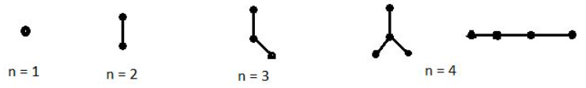
>
> Is onderstaande boom niet vergeten?
>
> 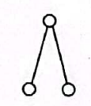

Nee, deze is isomorf aan $n=3$


> 4. In paragraaf 2.3 wordt opgemerkt dat men bij eenzelfde wortelknoop toch verschillende BFS-bomen kan bekomen indien de volgorde van de kinderen van een gegeven knoop gevarieerd wordt. Zijn de aldus bekomen verschillende BFS-bomen onderling isomorf of niet ? Zelfde vraag voor DFS-bomen.

Neem de volgende graaf als voorbeeld:

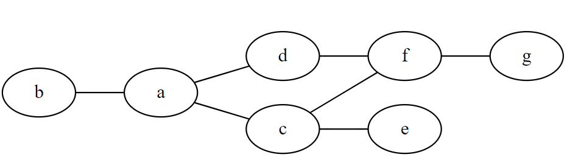

Mogelijke BFS bomen vanuit `f` zijn:

| 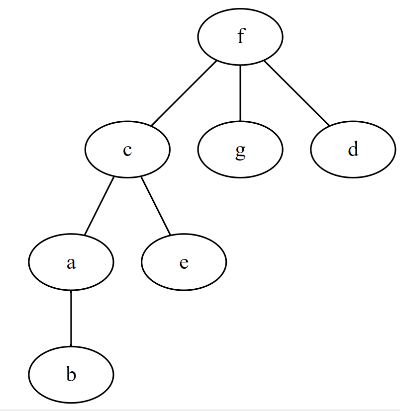 | 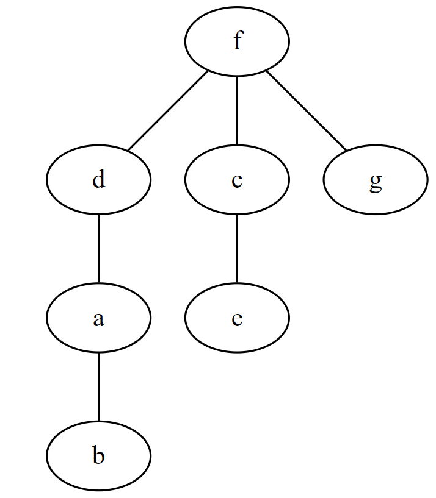 |
| ------------------------------------------------------------ | ------------------------------------------------------------ |

Deze zijn duidelijk niet isomorf.

Mogelijke DFS bomen vanuit `f` zijn;

| 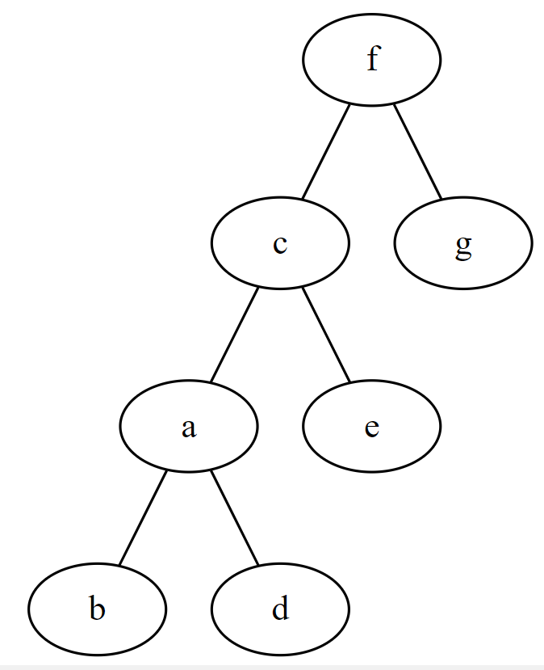 |  |
| ------------------------------------------------------------ | ------------------------------------------------------------ |

Deze zijn ook niet isomorf.


> 5. In geval van BFS werd opgemerkt dat dit algoritme het FIFO-principe hanteert : als knoop $a$ eerder wordt ontmoet dan knoop $b$, dan zullen ook de kinderen van $a$ eerder ontmoet worden dan de kinderen van $b$. Is dit ook het geval DFS? Hoe zou het principe dat daar gehanteerd wordt, kunnen genoemd worden ?

In DFS gebeurt er het omgekeerde. De kinderen van $b$ zullen eerder ontmoet worden dan de kinderen van $a$. We zouden dit het FILO-principe (first in last out) kunnen noemen.


> 6. In paragraaf 4.1 wordt vermeld dat een opspannende subgraaf $G’$ met minimaal gewicht (van een gegeven, gewogen, geconnecteerde graaf $G$ met positieve takgewichten) niet noodzakelijk een boom hoeft te zijn. Bedenk een voorbeeld ($G$ en $G'$).

| 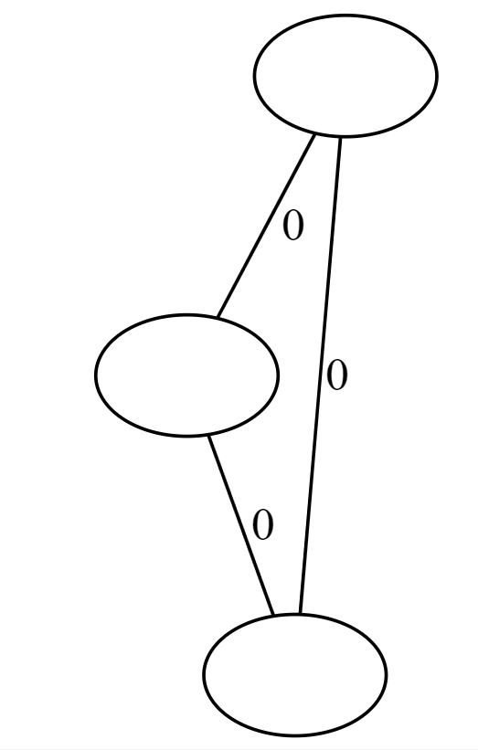 | 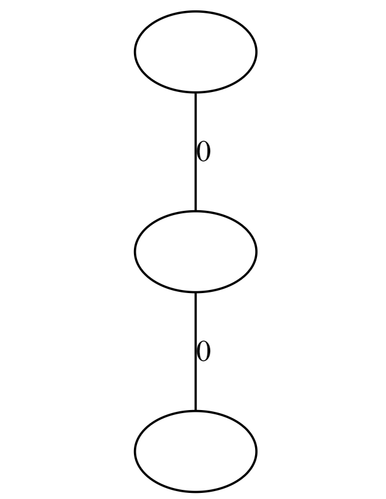 |
| ------------------------------------------------------------ | ------------------------------------------------------------ |
| $G = G'$                                                     | Minimale opspannende boom heeft even groot gewicht als $G'$  |


> 7. Werkt het algoritme van Dijkstra nog gegarandeerd correct als in de graaf takken met gewicht $0$ voorkomen?

Ja, per definitie moeten de gewichten groter dan of gelijk aan $0$ zijn. 


> 8. *Bedenk een voorbeeld van een graaf waarbij strikt negatieve takgewichten voorkomen en waar het algoritme van Dijkstra een fout resultaat oplevert.

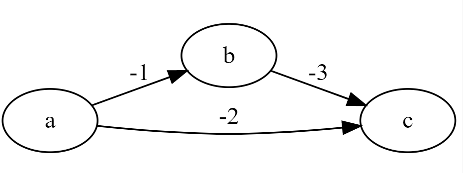

In deze graaf zal je met Dijkstra voor het kortste pad van $a$ naar $c$ als resultaat $-2$ bekomen, terwijl het $-4$ zou moeten zijn. 


> 9. In het Van Dale woordenboek wordt ‘excentriciteit’ omschreven als ‘ligging buiten het middelpunt’. Strookt deze betekenis met de definitie voor de ‘excentriciteit van een knoop uit de graaftheorie ?

De excentriciteit van een knoop $a$ is de afstand tot de verst gelegen knoop vanuit $a$. Knopen met een hoge excentriciteit zullen typisch wel verder uit het midden van de graaf liggen. 


> 10. Via stereografische projectie wordt een sferische voorstelling van een graaf omgezet in een vlakke voorstelling. Welk gebied in de sferische voorstelling wordt omgezet in het externe gebied van de vlakke graaf ? Neemt dit gebied
>     een speciale plaats in onder de verschillende gebieden van een sferische voorstelling? 

Het externe gebied is het gebied op het boloppervlak dat $a$ bevat. Volgens de projectie kan er deel van de graaf op $a$ liggen. Een knoop die oneindig dicht bij $a$ ligt, ligt oneindig ver van de andere knopen na stereografische projectie.


> 11. Is het aantal interne mazen van een graaf steeds groter dan of gelijk aan het aantal externe mazen ?

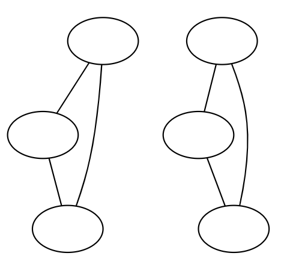
In dit voorbeeld beschouwen we een niet-samenhangende graaf. Er zijn twee externe mazen, maar geen interne, dus de stelling klopt niet.


> 12. De heuristiek voor een sequentiële knoopkleuring vertrekt van een willekeurige knoopkleuring. Hoe zou je deze willekeurige initiële situatie kunnen uitbuiten om (eventueel) betere knoopkleuringen te bekomen?

We zouden misschien kunnen vertrekken vanaf de knoop met de laagste kleur? Of misschien eerst de knopen sorteren en dan de knopen in volgorde verwerken. Ik weet het niet zeker.


> 13. Indien bij het Vierkleurenprobleem ook landen die slechts één punt gemeen hebben als buurlanden zouden worden beschouwd (en dus een verschillende kleur moeten hebben), zou de resulterende graaf dan nog steeds vlakke graaf zijn? Bepaal in dit geval het aantal kleuren nodig voor het inkleuren van de landkaart in figuur 19.

Hier is een tegenvoorbeeld waarbij het resultaat geen vlakke graaf meer is:

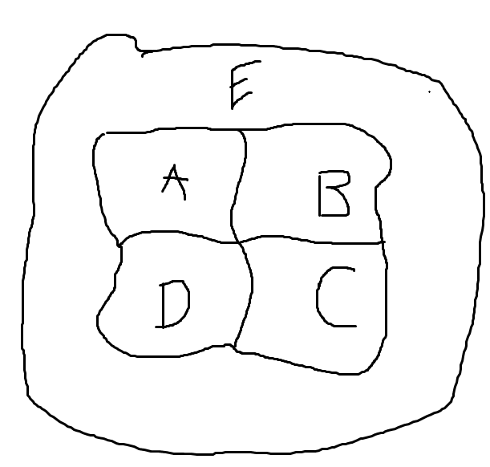

Je kan bij de graafvoorstelling van dit probleem geen vlakke voorstelling vinden:

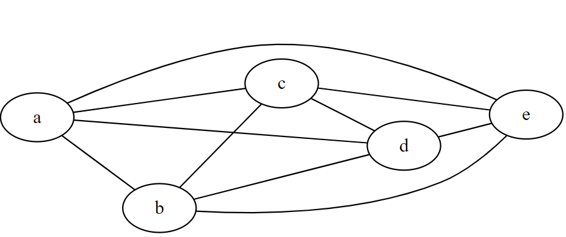

Bij figuur 19 in het boek zijn er even veel kleuren nodig.


> 14. Het begrip ‘tweedelige graaf' kan ook gedefinieerd worden a.d.h.v. knoopkleuringen. Bedenk zelf zo’n definitie.

Een tweedelige graaf is een graaf die je met twee kleuren kan inkleuren. 


## Oefeningen

> 1. Welk van de volgende grafen zijn isomorf?

| 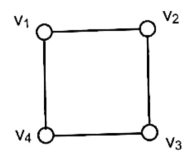 | 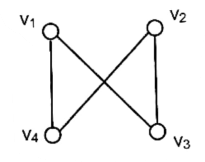 | Isomorf          |
| ------------------------------------------------------------ | ------------------------------------------------------------ | ---------------- |
| 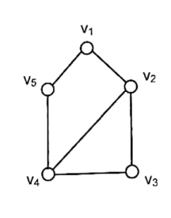 |  | **Niet isomorf** |
| 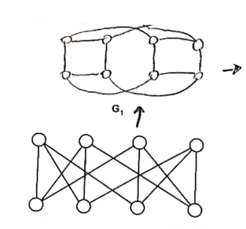 | 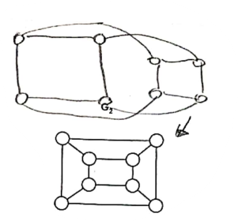 | **Isomorf**      |


> 2. Hoeveel niet-isomorfe subgrafen heeft $K_3$

| 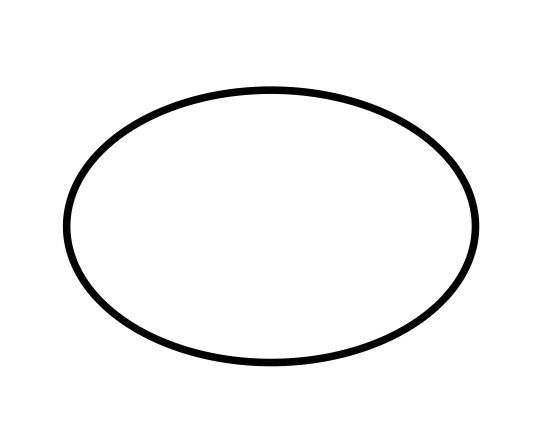 |  | 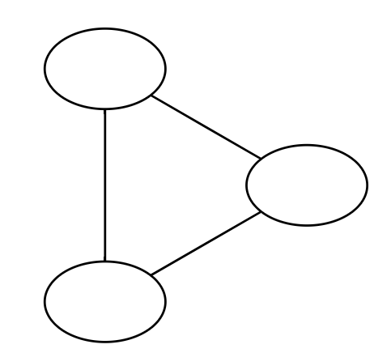 |
| ------------------------------------------------------------ | ------------------------------------------------------------ | ------------------------------------------------------------ |


> 3. Alle straten in een stad zijn tweerichtingsverkeer. Gezien de toenemende verkeersdrukte,
>    wordt beslist om in een nieuw mobiliteitsplan in alle straten éénrichtingsverkeer in te voeren.
>    Aan welke minimale voorwaarden moet zo’n éénrichlingsmobiliteitsplan redelijkerwijze
>    voldoen ? Druk deze voorwaarden uit op graaftheoretische wijze.

Voor elk knopenpaar $u$ en $v$ moet zowel een $u \mbox - v$ pad als een $v \mbox - u$ pad bestaan.


> 4. Construeer voor onderstaande grafen een BFS-boom vanuit $v_1$

| 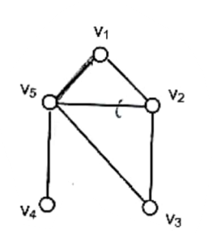 | 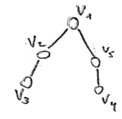 |
| ------------------------------------------------------------ | ------------------------------------------------------------ |
| 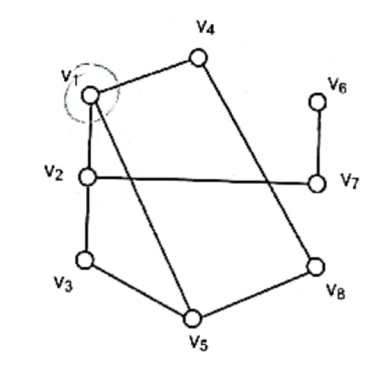 | 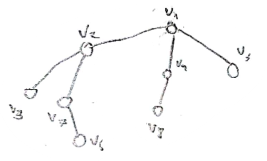 |


> 5. Zelfde opgave, maar voor DFS


> 6. Men gaat op zoek naar een DFS-boom in onderstaande graaf en vindt daarbij de
>    knoopvolgorde ($v_1$, $v_5$, $v_3$, $v_2$, $v_4$). Is dit een correcte volgorde of niet ?

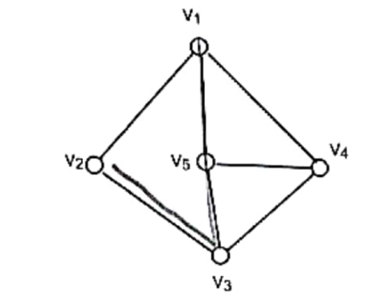

Ja dit klopt, de boom ziet er zo uit:

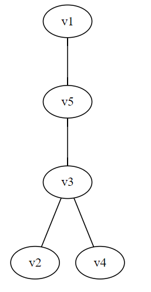

> 7. Indien je in opgave 4 steeds vertrekt vanuit $v_1$‚ hoeveel verschillende BFS-knoopvolgorden
>    kan je dan bekomen ? En DFS-knoopvolgorden ? Kan je daaruit iets besluiten omtrent het
>    aantal mogelijkheden bij BFS versus DFS ? 

a) 3 BFS-knoopvolgorden, 7 DFS-knoopvolgorden
b) 11 BFS-knoopvolgorden, 5 DFS-knoopvolgorden

Ik kan hier niks uit besluiten.


> 8. Een netwerk van autowegen verbindt een aantal grote steden (zie onderstaande figuur). Men
>    wenst deze autowegen te voorzien van een betalingssysteem, waarbij de weggebruiker voor
>    elke verbinding tussen twee steden eenzelfde prijs (10 Euro) aangerekend wordt. Wat is de
>    minimale kost om van knoop $v_1$ naar knoop $v_{10}$ te rijden ?

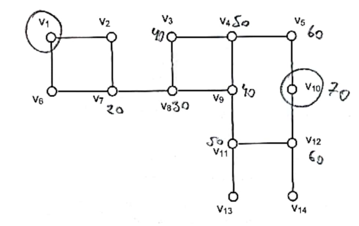

70 euro.


> 9. Een petroleumbedrijf wil 5 booreilanden ($b_1$, $b_2$, $b_3$, $b_4$, $b_5$) voor de Noorse kust verbinden met
>    een havenstad $h$ d.m.v. een netwerk van pijpleidingen op de oceaanbodem. De kost voor het
>    aanleggen van een dergelijke pijpleiding mag evenredig met de overbrugde lengte ondersteld
>    worden (300.000 Euro per km). Het vertakken van een pijpleiding kan enkel op de
>    booreilanden, niet op de oceaanbodem.
>    De coördinaten (in km) van deze booreilanden zijn : $b_1$ (-8,6) / $b_2$ (1,7) / $b_3$ (-8,3) / $b_4$ (-3,3) /
>    $b_5$ (4,3). De coördinaten van de haven zijn : $h$ (0,0)


> Bespreek een strategie om het algemene probleem op te lossen. Tot welk graafprobleem kan men dit probleem herleiden? 

Minimum spanning tree

> Bepaal voor bovenstaande probleeminstantie het optimale ontwerp van het pijpleidingennet. Hoeveel bedraagt de totale kost ?


€1.272.810,21

> Indien ook vertakkingen op de oceaanbodem (zonder meerkost) zouden mogelijk
> zijn, kan men dan nog gebruik maken van hetzelfde algoritme (voor het algemene
> probleem) ?

Nee


> 10. Gegeven is een stratenplan. Coca-Cola wil op sommige (maar niet alle) straathoeken een
>     automaat plaatsen. Na een grondige marketingstudie werden deze straathoeken optimaal
>     gekozen. Men wil al deze automaten via een netwerk van kabels met elkaar te verbinden.
>     Deze kabels dienen uiteraard steeds de straten te volgen. Dit kabelnetwerk dient zo
>     ontworpen te worden dat het aantal lopende meter straat of voetpad dat moet opengebroken
>     worden (voor het plaatsen van één of meer kabels tegelijk in de grond) minimaal is.
>     (Veronderstel ter benadering dat alle straten oneindig dunne lijnen zijn.)
>
>     Ingenieur 1 berekent de optimale layout van het kabelnetwerk als volgt : “Het probleem valt te
>
>     herleiden tot het zoeken van een minimale opspannende boom probleem, waarbij de graaf
>     gegeven wordt door : (i) elke Coca-Cola automaat wordt voorgesteld als een knoop van de
>     graaf (ii) de afstand tussen elke 2 Coca-Cola automaten wordt berekend (via het kortste-
>     padalgoritme van Dijkstra langs het Stratenplan) (iii) met elke combinatie van 2 verschillende
>     Coca-Cola automaten komt een tak overeen, met als gewicht de afstand tussen die 2 Coca-
>     Cola automaten via het stratenplan (hierboven berekend). In de resulterende graaf wordt de
>     minimale opspannende boom berekend ; dit correspondeert met de optimale layout van het
>     kabelnetwerk.”
>
>     Ingenieur 2 berekent de optimale layout van het kabelnetwerk als volgt : “Het probleem valt te
>     herleiden tot het zoeken van een minimale opspannende boom probleem, waarbij de graaf
>     gegeven wordt door het stratenplan (straathoek = knoop, straatsegment tussen 2 straathoeken =
>     tak) en waarbij via het algoritme van Kruskal het optimale kabelnetwerk wordt berekend die
>     de Coca-Cola automaten onderling verbindt.” Is de redenering van deze ingenieur correct of
>     niet? 
>
>     Welke van bovenstaande redeneringen is correct. Waarom (wel/niet) ? Indien correct:
>     motiveer waarom. Indien niet correct: geef een tegenvoorbeeld

Ik denk dat omdat er niet op elke straathoek een automaat staat, het niet echt te herleiden valt naar een minimaal opspannende boomprobleem. 


> 11. Gevraagd wordt om voor een gegeven graaf met positieve takgewichten de maximale
>     opspannende boom te bepalen. Bedenk een algemene methode om dit te doen.

Zoek het hoogste takgewicht $g_{max}$. Zet elk takgewicht $g$ om naar $g_{max} - g$ en bereken de minimaal opspannende boom.


> 12. Hieronder ziet u een onderdeel van het stratenplan van Gent (schaal 1:3000), waarop met 2
>     rode sterren de aula van de Universitcit Gent en de (ingang van de) stadshal werden
>     aangeduid. Bepaal de kortste route van de ingang van de stadshal naar de aula (te voet).
>     Hoeveel bedraagt de afstand ?

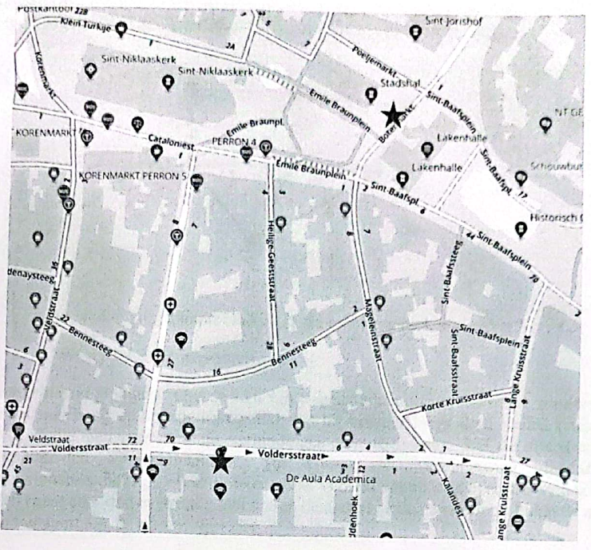

Veel plezier hiermee. Ik ga het niet doen.


> 13. Stel dat men opnieuw op zoek gaat naar de optimale route van de stadshal naar de aula. Onder
>     ‘optimaal’ verstaat men nu niet de kortste route qua afstand, maar de route waarlangs zoveel
>     mogelijk cafeetjes te vinden zijn (zonder 2 maal door dezelfde straat te passeren). Kan men
>     dit probleem modelleren als een kortste-pad probleem?

Nee, dit is eerder een langste pad probleem.


> 14. In een computernetwerk (zie onderstaande figuur) wenst men een videoverbinding op te zetten
>     tussen een server (s) en een gebruiker (g). Om de kwaliteit van het videobeeld te
>     optimaliseren, gaat men op zoek naar de route van s naar g waarop zoveel mogelijk
>     bandbreedte (in Mb/s) beschikbaar is. De beschikbare bandbreedte op elke link is
>     weergegeven in onderstaande figuur.

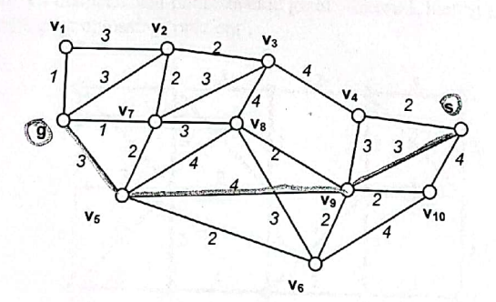

> Tot welk gekend grafenprobleem kan men dit probleem herleiden ?
> Bepaal de optimale route in het hierboven afgebeelde netwerk.

Dit lijkt me een max flow probleem. Ik vind dat een beetje vaag voor hoofdstuk 1 dus misschien ben ik mis.

//TODO

> 15. Zeven steden in Peru zijn enkel via aardewegen met elkaar verbonden (zie figuur hieronder :
>     knopen = steden, takken = aardewegen). Men wenst een asfaltwegennetwerk uit te bouwen
>     tussen deze steden, zodat elke stad bereikbaar is vanuit elke andere stad via asfaltwegen. Om
>     de kosten van graafwerken te beperken, komen enkel de routes van de aardewegen in
>     aanmerking voor asfaltering. Doel is om een zo goedkoop mogelijk asfaltwegennetwerk uit te 
>     bouwen (de kosten voor het asfalteren van een aardeweg zijn evenredig met de lengte van de
>     wegen, afgebeeld in de figuur hieronder, uitgedrukt in honderden km).

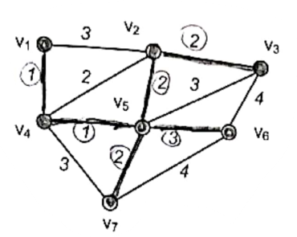

> Tot welk type grafenprobleem kan dit probleem herleid worden?

Minimaal opspannende boom

> Ontwerp het asfaltwegennetwerk.

De dikkere lijnen op de foto.

> In bovenstaand probleem werd de kost van wegenwerken geminimaliseerd, zonder rekening te
> houden met hoog oplopende transportkosten bij vervoer langs deze wegen (vanwege grote
> omwegen die men voor sommige verbindingen dient te maken). Stel dat men daarentegen de
> transportkosten wil minimaliseren (de kosten van wegennetwerk zijn slechts van
> verwaarloosbaar belang), Hierbij is er enkel verkeer vanuit de havenstad $v_1$‚ naar de andere
> steden (naar elke stad evenveel), niet tussen de andere steden onderling. Enkel de asfaltwegen
> laten transport toe, de aardewegen niet.

> Tot welk type grafenproblcem kan dit probleem herleid worden ? Motiveer.

Dit lijkt me een kortste pad probleem.

> Ontwerp het asfaltwegennetwerk.

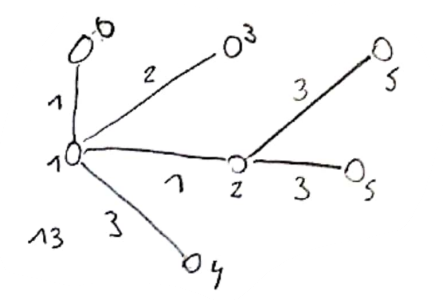

> Vergelijk de ontwerpen uit b) en d) qua kosten voor wegennetwerken en
> transportkosten. Verklaring?

De transportkosten van d zijn lager omdat we altijd het kortste pad nemen vanuit $v_1$

> Stel nu dat men bij het ontwerpen van het asfaltwegennetwerk wenst rekening te houden met 
> beide types kosten (kosten voor wegennetwerken en transportkosten). 
> Welk type grafenprobleem ontmoeten we hier ? Motiveer. 

Ik zou het echt niet weten //TODO


> 16. Bepaal straal en diameter van onderstaande graaf. Gebruik hierbij stap voor stap het geziene
>     algoritme, dus geen oplossing ‘op zicht’.

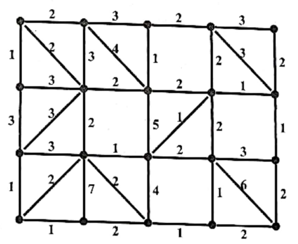


> 17. Welke van de volgende grafen zijn vlakke grafen ? (Indien het een vlakke graaf betreft, geef
>     dan een vlakke voorstelling.)

| 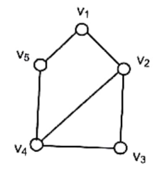 |                                                              | Vlak          |
| ------------------------------------------------------------ | ------------------------------------------------------------ | ------------- |
| 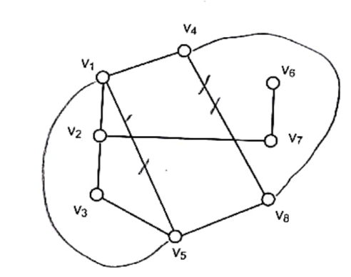 |                                                              | **Vlak**      |
| 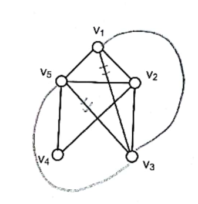 |                                                              | **Vlak**      |
| 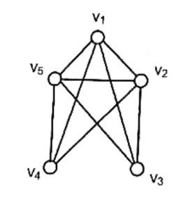 | 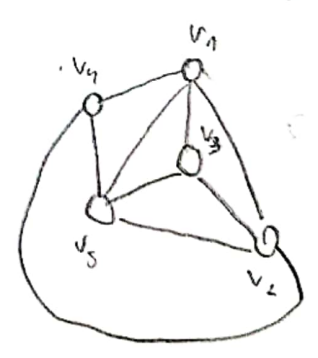 | **Vlak**      |
| 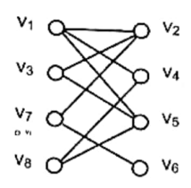 | 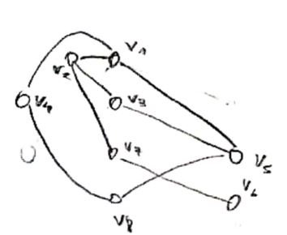 | **Vlak**      |
| 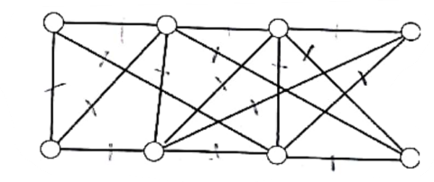 | 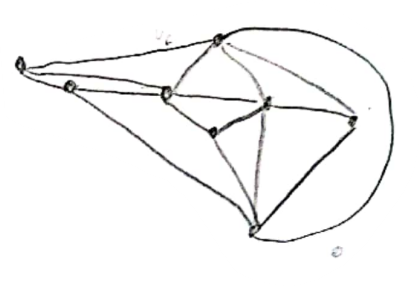 | **Vlak**      |
| $K_3,K_4,K_5,K_6, \dots$                                     | 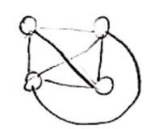 | Max tot $K_4$ |


> 18. Zeven poorten (1-7) van een elektronisch cireuit zouden als volgt verbonden moeten worden:
>     1 met 2 en 7; 2 met 5 en 6; 3 met 4, 6 en 7; 4 met 6 en 7; 5 met 6 (zie figuur hieronder ter
>     verduidelijking). Is dit mogelijk zodat alle verbindingen in hetzelfde vlak liggen en elkaar niet
>     snijden?

| 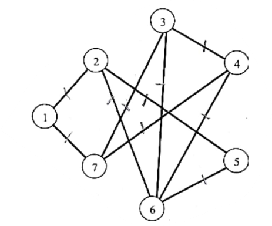 | 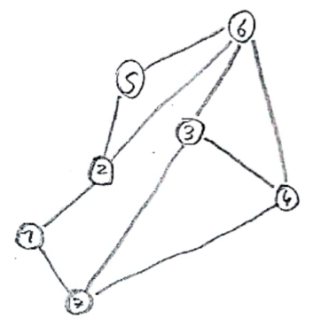 |
| ------------------------------------------------------------ | ------------------------------------------------------------ |


> 19. Bereken voor onderstaande grafen telkens de boven- en ondergrenzen voor het chromatisch
>     getal $\chi(G) : 1+ \delta_{max}$ en $\omega(G)$.


# Grafen deel 2

## Verband tussen 4 boom-constructie algoritmen

Dit deel van het boek is echt waardeloos. //TODO


### Algoritme van Prim

Het algoritme van Prim is simpel, moet het je op de test niet gelukt zijn, het gaat als volgt:

* Neem een willekeurige knoop $k$ en een op dit moment lege lijst kandidaattakken $L$ en ook nog lege lijsten met knopen $K$ en takken $T$. Deze zal de knopen bevatten die we toevoegen aan onze deelboom.
* Iteratie
  * Voeg alle takken van $k$ toe aan $L$
  * Neem de goedkoopste tak uit $L$ die onze deelboom verbindt met een knoop die er nog niet inzit.
    * Steek die tak in $T$
    * Vervang $k$ door de knoop aan het andere uiteinde van die tak en voeg hem toe aan $K$
  * Herhaal tot $L$ leeg is

Dit is hoe ik het heb gedaan op de test toch. In het boek wordt niet super specifiek ingegaan op wat je moet doen met die lijsten. Het kan waarschijnlijk ook anders of beter, maar Ben is niet zuinig geweest met de punten op mijn implementatie voor did deel, dus ik veronderstel dat het ermee door kan.


## Eulercircuits

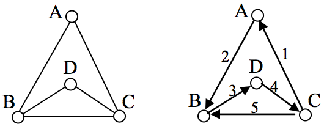

Gegeven een ongerichte of gerichte (multigraaf) $G$. Een Eulercircuit is een wandeling door $G$ die

* Elke tak in $G$ exact één keer gebruikt
* Eindigt op dezelfde knoop als hij begint

Merk op dat je dus wel meerdere keren langs dezelfde knoop mag passeren. We noemen een graaf een **Eulergraaf** als en slechts als hij een Eulercircuit bevat. Uit de definitie volgen twee stellingen:

* $G$ is een ongerichte Eulergraaf $\xLeftrightarrow{\quad}$ $G$ is geconnecteerd en al zijn knoopgraden zijn even
  * Het circuit zal elke knoop van $G$ even vaak binnengaan als verlaten
* $G$ is een gerichte Eulergraaf $\xLeftrightarrow{\quad}$ $G$ is sterk geconnecteerd en voor elke knoop is de ingraad gelijk aan de uitgraad
  * Als de in- en uitgraad verschillend zijn is een Eulercircuit niet mogelijk.

### Eulercircuit construeren

We bespreken nu het algoritme om een Eulercircuit te maken. Dit algoritme bewijst kennelijk ook de twee stellingen hierboven.

* Kies een wikkekeurige startknoop $s_1$
* Bepaal vanuit $s_1$ een wandeling die terugkomt in $s_1$
* Verwijder alle gebruikte takken uit $G$
* Herhaal zolang er nog ongebruikte takken overblijven:
  * Kies een bezochte knoop $s_i$ als startknoop
  * Bepaal vanuit $s_i$ een nieuwe wandeling
    * Omdat de knoopgraad altijd even is, kan je altijd een nieuwe wandeling vinden zolang er nog ongebruikte takken zijn
  * Voeg de wandeling toe aan de oplossing


## Gerichte lusloze grafen

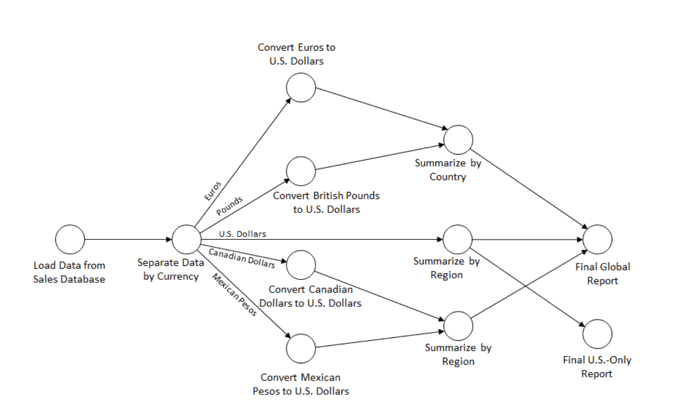

Een gerichte lusloze graaf is een gerichte graaf, al dan niet geconnecteerd, die geen cycli bevat. In de echte wereld zijn deze nuttig om bijvoorbeeld een sequentie van taken vast te leggen die niet in een bepaalde volgorde moeten uitgevoerd worden, maar waarbij een taak wel kan afhangen van een andere taak.


### Topologische rangschikking

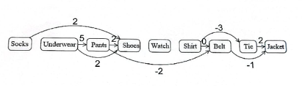

Als we alle knopen van deze graaf op een rijtje zetten, op zo een manier dat alle pijlen naar rechts wijzen, bekomen we een **topologische rangschikking**. Hier bestaat dan ook weer een algoritme voor:

* Zoek een knoop $v$ met ingraad $0$
* Zet $v$ helemaal links
* Verwijder $v$ en alle pijlen die uit $v$ vertrekken uit de originele graaf
* Herhaal tot er geen knopen meer zijn


Kunnen we altijd een knoop met ingraad $0$ vinden? Dit valt te bewijzen vanuit het ongerijmde. Stel dat er geen knoop met ingraad $0$ is. Dat betekent dat er voor elke knoop een binnenkomende pijl is. Die pijl moet ergens vandaan komen. Omdat $G$ eindig is betekent dit dus dat er zich sowieso een lus zal vormen. Hiermee is de stelling bewezen en bekomen we ook de volgende wederzijdse implicatie:

* $G$ is een gerichte lusloze graaf $\xLeftrightarrow{\quad}$ $G$ heeft een topologische rangschikking


### Kortste pad

Als we gewichten toekennen aan onze takken (al dan niet negatief), kunnen we het kortste pad tussen twee knopen zoeken. Dit is zeer gemakkelijk in een gerichte lusloze graaf.

* Bepaal de topologische rangschikking
* Ga telkens naar rechts en bepaal voor de huidige knoop de kortste afstand vanuit de startknoop
  * Deze vind je door de goedkoopste binnenkomende verbinding te kiezen
* Wanneer je de bestemming bereikt, heb ge automatisch ook de kortste afstand gevonden. Als je hebt bijgehouden welke takken tot die afstand lijden, heb je nu ook het kortste pad.


### Langste pad

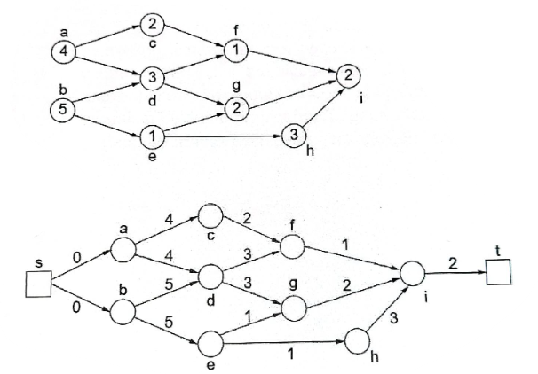

Het langste pad vinden in een gerichte lusloze graaf is een stuk interessanter. Je kan het in de echte wereld bijvoorbeeld gebruiken om de duur van een project met van elkaar afhankelijke deeltaken te bepalen. 

Hier doe je hetzelfde als bij het korste pad, maar geef je de knopen telkens een zo hoog mogelijk label. Als er meerdere start- en eindknopen zijn (knopen met in- of uitgraad $0$), voeg je een artificiële start- en eindknoop toe. 


# Grafen deel 3: network flow problems

## Terminologie

We willen een netwerk modelleren als een graaf. We zullen de volgende terminologie hanteren in de rest van de cursus:

* Een graaf $G = (V,E)$ bestaat uit
  * Vertices $V$
  * Edges $E$
    * Elke edge $e$ is een ongeordend paar van vertices $(u,v)$
* De **orde** van een graaf $p = \#V$, oftewel het aantal vertices
* De **grootte** van een graaf $q = \#E$ oftewel het aantal edges
* De **incidence** $I(v)$ van een vertex $v$ is de verzameling van edges die aan $v$ verbonden zijn
* De **adjecency** $A(v)$ van een vertex $v$ is de verzameling van vertices die aan $v$ verbonden zijn
* De **degree** $\delta(v)$ van een vertex $v$ is het aantal edges aan $v$
* Een **subgraaf** van $G = (V,E)$ is een graaf waarvan 
  * de vertex set een subset is van $V$
  * de edge set een subset is van $E$

Een graaf met orde $p$ een grootte $q$ noemen we een $(p,q)$-graaf. We veronderstellen hier bovendien altijd dat elke graaf geen parallelle edges heeft.


### Voorstelling

We kunnen een graaf op twee manieren voorstellen:

* *Incidence matrix*: een matrix met aantal kolommen voor de edges en rijen voor de vertices
  * Als we een waarde toekennen stelt deze een verbinding tussen een vertex en een edge voor
* *Incidence lists*: 
  * We houden voor elke vertex een lijst van edges bij


### Paden en cycli

* Een **walk** in een graaf is een sequentie van vertices die volgens de edges worden overlopen. Dezelfde edge of vertex mag meerdere keren in het pad voorkomen.
* Een **pad** in een graaf is een walk waarbij je nooit twee keer dezelfde vertex tegenkomt. 
* Een **cycle** is een walk waarbij je nooit twee keer dezelfde vertex tegenkomt, maar de begin- en -eindvertex hetzelfde zijn.


### Cut and cutset

Met het begrip cut bedoel ik in dit deel een **edge cut**

Neem een graaf $G$ en twee vertices $u$ en $v$ in $G$

* $u$ is geconnecteerd met $v$ als er een $u-v$ pad bestaat in $G$
* $G$ is geconnecteerd als elke $u$ en $v$ in $G$ geconnecteerd zijn

Een **cut** $C$ in $G$ is een subset van $E$, waarbij het verwijderen van alle edges in $C$ uit $G$, de graaf niet meer geconnecteerd is.

Een **cutset** is de kleinst mogelijke cut. Dit impliceert dat elke strikte subset van de cutset geen cut meer is. Een cut is alleen een cutset als de resulterende subgrafen geconnecteerd zijn. Dit valt makkelijk aan te tonen (maar laten ze weg in de cursus om ons te trollen). 

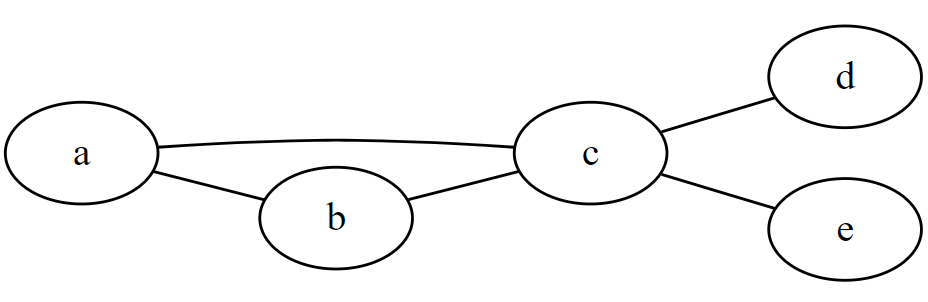

Eerst een voorbeeld. Als je in deze graaf een cut maakt die resulteert in `[a,b,c]` en `[d,e]`, is één van de twee resulterende subgrafen niet geconnecteerd. Het is namelijk ook geen cutset, want de grootte van een cutset van de graaf is duidelijk $1$ hier. 

Algemeen (bewijs uit contrapositie). We veronderstellen cutset van een graaf, waarvan één van de resulterende subgrafen niet geconnecteerd is. Het feit dat eentje niet geconnecteerd is impliceert dat we een kleinere cut zouden kunnen nemen van de originele graaf. Hier heb je de contradictie. 

Nu hebben we bewezen dat de twee resulterende subgrafen van een cutset beide geconnecteerd moeten zijn. 


De definities voor vertex cut en vertex cutset zijn analoog. Een **vertex cut** is een verzameling vertices die er voor zorgen dat de graaf niet meer geconnecteerd (of de *triviale graaf wordt*\*) is als je ze weghaalt. Een **vertex cutset** is de minimale vertex cut. 

*  \*: als je in deze graaf de vertex cutset neemt, is het resultaat de triviale graaf. Deze is wel geconnecteerd, dus daarom de uitbreiding op de definitie.


### Connectivity

De **edge connectivity** van $\lambda (G)$ van een graaf $G$ is de minimum kardinaliteit van een edge cutset van $G$. 

De **vertex connectivity** $\kappa(G)$ van een graaf $G$ is de minimum kardinaliteit van een vertex cutset van $G$. 

Ik denk dat het woord minimum hier zelfs overbodig is, aangezien een cutset altijd minimaal is.


Het valt te bewijzen dat $\kappa(G) \leq \lambda(G)$ (contrapositie):

* Stel dat een vertex cutset $V_c$ en een edge cutset $E_c$  van $G$ hebben
* $\kappa(G) = \lvert V_c\rvert = v_c$   en  $\lambda(G) = \lvert E_c \rvert = e_c$
* We veronderstellen nu dat $e_c < v_c$
* Koppel elke edge in de edge cutset $E_c$ aan één van zijn vertices (dit is altijd mogelijk)
  * Het verwijderen van $e_c$ edges resulteert per definitie in een graaf die niet geconnecteerd is
  * Aan onze edges hebben we $e_c$ vertices gekoppeld. Als we een vertex verwijderen, verwijderen we per definitie ook al zijn edges.
  * Dit betekent dus dat als we $e_c$ vertices verwijderen, de graaf ook niet meer geconnecteerd is. En dus dat $e_c$ groter dan of gelijk aan $v_c$ kan zijn. Hier heb je je contradictie en is er bewezen wat er te bewijzen viel.


### Digraph

Een **digraph** bestaat uit een **vertex set** en een **arc set**. Elke arc is een geordend paar vertices. 

De **orde** (order) van een digraph is het aantal vertices.

De **grootte** (size) van een digraph is het aantal arcs.


De **from-incidence** $I(v)$ van een vertex $v$ is de verzameling arcs die eruit vertrekken.

De **to-incidence** $I'(v)$ van een vertex $v$ is de verzameling arcs die erin toekomen.

De **out-degree** $\delta(v)$ van een vertex $v$ is het aantal arcs die eruit vertrekken.

De **in-degree** $\delta'(v)$ van een vertex $v$ is het aantal arcs die erin toekomen.

De **from-adjacency** $A(v)$ van een vertex $v$ is de verzameling vertices waarin een arc toekomt vanuit $v$

De **to-adjacency** $A'(v)$ van een vertex $v$ is de verzameling vertices die een arc hebben naar $v$ 


Je kan een digraph op twee manieren voorstellen, analoog aan gewone grafen: 

* **Incidence matrix**
* **Incidence lists**


Paths en cycles zijn ook hetzelfde als bij ongerichte grafen. Buiten dat je ook een **semipath**, een **semiwalk** en een **semicycle** kan hebben. Hier wordt de richting van de arcs niet speciaal gevolgd. Bij een gewone path, walk of cycle wel.


Een digraaf is **strongly connected** als er voor elk paar vertices een pad in beide richtingen bestaat.

Een digraaf is **weakly connected** als er voor elk paar vertices een pad in minstens één richting bestaat.


Als voor elk paar vertices $u$ en $v$ er een $(u,v)$-semipad bestaat, impliceert dit dan dat de graaf zwak geconnecteerd is? 

Nee, je kan makkelijk een tegenvoorbeeld vinden:


## Minimum spanning tree problem

Een **tree** $T=(V,F)$ is een geconnecteerde graaf die geen lussen bevat. Deze heeft als eigenschap dat voor elke twee vertices $s$ en $t$, de tree exact één $(s,t)$-pad bevat. 

Een subgraaf van een geconnecteerde graaf $G$ (met dezelfde vertex set) die een tree is, noemen we een **spanning tree** van $G$.


### Kruskal

Het algoritme van Kruskal beschrijft en manier om een **minimum spanning tree** te vinden. Dit is een spanning tree van $G$ met een zo laag mogelijk totaal gewicht. Het algoritme is heel simpel.

* Verwijder alle edges uit $G$
* Voeg telkens de kleinste edge terug toe die geen lus vormt.
* We zijn klaar als we alle vertices hebben verbonden


## Shortest path problem

### Unweighted (di)graph: Moore

In een ongewogen graaf is de afstand tussen twee vertices gelijk aan de kleinste hop-count. Je kan gemakkelijk de kortste afstanden vanuit één vertex bepalen door een breadth-first-search. 

* Zet de afstand van de startknoop op $0$
* De afstand van al zijn buren op $1$
* De afstand van alle buren van de buren (die nog geen afstand hebben) op $2$
* ...

### Weighted (di)graph: Dijkstra

Dit heb ik [hier](#Algoritme-van-Dijkstra) heel mooi uitgelegd. Het is belangrijk om te weten dat dit algoritme alleen werkt als onze graaf alleen positieve grwichten bevat.


### Weighted (di)graph with negative weights: Ford, Bellman and Moore

Het algoritme van Ford, Bellman en Moore is een *label correcting* algoritme. Dit betekent dat het algoritme alle labels met afstanden als tijdelijk beschouwt tot het einde, waar ze allemaal tegelijk permanent worden. 

* Maak een lege lijst $L$ en een set labels $l$
  * zet in $l$ de beginknoop op $0$ en de rest op $\infty$
  * Voeg de beginknoop toe in $L$
* Zolang $L$ niet leeg is, herhaal:
  * Neem het eerste element $v$ uit $L$
  * Doe voor elke buur $w$ van $v$
    * Update $l(w)$ naar $l(v) + c(vw)$ als die afstand korter is
    * Als $w$ nog niet in de lijst zat, steek hem erin


### All-pairs shortest path problem: Floyd

Om het kortste pad te kunnen vinden tussen alle combinaties van vertices, zouden we het algoritme van Dijkstra voor alle vertices kunnen draaien. Dit is misschien een beetje tijdverspilling, er bestaat een beter algoritme: Floyd.

* Maak een $n \times n$ matrix met $n$ het aantal vertices. Elk element stelt dan een combinatie tussen twee vertices voor.
* Zet de diagonaal op $0$, dit zijn de afstanden van een vertex naar zichzelf
* Stel alle rechtstreekse paden in
* Zet de rest op $\infty$
* //TODO

Omdat we in dit algoritme drie geneste for-loops hebben, krijgen we een complexiteit van $O(p^3)$.


## Maximum flow problem

### Network flow

We willen een soort abstract model maken van een netwerk. Hierbij gebruiken we de term **flow** om overdracht van gegevens in ons netwerk voor te stellen. We stellen het netwerk voor als een digraaf. 

* Elke pijl $a$ heeft een bepaalde **cost** $c(a)$. Dit kan dan bijvoorbeeld de kostprijs van het gebruik van een bepaalde link zijn.
* Elke pijl heeft bovendien een **capaciteit** $u(a)$. Dit kan je voorstellen als de bandbreedte van een link. 
* De **flow** is dus de hoeveelheid gegevens die doorheen de links van ons netwerk kan. 

Als resultaat modelleren we ons netwerk met een **gewogen, gecapactiteerde digraaf**. Hiervoor hanteren we vanaf nu de term **netwerk**. 


Flow is een functie $f(.): A \rightarrow \mathbb{Z}^+$of $\mathbb R$, onderhevig aan de volgende beperkingen:

* $\sum_{a \in I(v)} f(a) - \sum_{a \in I'(v)} = b(v), \forall v \in V$
  * **Flow conservation constraints**: de inflow min de outflow van $v$ moet gelijk zijn aan de supply-demand $b(v)$
  * Het komt erop neer dat in een node in ons netwerk de inflow en outflow gelijk moeten zijn, behalve als:
    * De node iets produceert (supply): $b(v)>0$
      * Typisch is dit de **source**, de beginnode
    * De node iets verbruikt (demand): $b(v)<0$
      * Typisch is dit de **sink**, de eindnode
* $0 \leq f(a) \leq u(a) \forall a \in A$
  * **Capacity constraints**: De flow in een node mag niet hoger zijn dan de capaciteit van die node 


### Maximum flow problem

We hebben een netwerk met een client op een bepaalde plek en een server op een andere. Als we willen wat de hoogste snelheid is waarmee we een pakketje van client naar server kunnen krijgen, hebben we een **maximum flow probleem**. We kunnen dit probleem als volgt formuleren.

Neem een gecapaciteerde digraaf $D = (V,A)$, waar de capaciteit van elke arc $a$ niet negatief is. Om het probleem te formuleren defineren we twee speciale vertices:

* De **source** $s$ 
* De **sink** $t$

We willen de maximum flow van $s$ naar $t$ vinden, rekening houdend met de beperkingen van ons netwerk. Noemenswaardig is dat we voor dit probleem geen rekening houden met de cost van de arcs. In de taal van de wiskundemensen formuleren we het zo:

* Maximaliseer $F$, onderhevig aan:

$$
\sum_{a \in I(v)} f(a) - \sum_{a \in I'(v)}f(a) = \begin{cases}
F& \text{ als } v = s \\
0& \forall v \in V \backslash \{s,t\} \\
-F&  \text{ als } v = t

\end{cases}
\\
0 \leq f(a) \leq u(a), \forall a \in A
$$

* We zoeken dus een zo hoog mogelijke $F$ die niet boven de capaciteit van ons netwerk gaat


### Residual network


In de cursus zijn ze abstract, maar ik ga het hier proberen uit te leggen aan de hand van een voorbeeld. We zitten in een scenario (bijvoorbeeld in het midden van een algoritme), waar we aan onze links al een bepaalde flow hebben toegewezen.

* Elke link heeft een flow $f\degree(ij)$ en een capaciteit $u(ij)$
* Er kan maar $u(ij) - f \degree (ij)$ extra flow door die link
* We kunnen ook $f \degree (ij)$ door de link $(ji)$ sturen, dit is eigenlijk gewoon de flow weghalen

Neem de bovenste link vanuit de source in het voorbeeld. Deze heeft flow $3$ en capaciteit $4$. Hiervoor voegen we in het residunetwerk twee pijlen toe:

* $1 \rightarrow 3$: Deze zetten we op $4-3 = 1$, en stelt voor hoeveel flow er nog bij zou kunnen
  * Dit is de **residual capacity** $r(ij)$
* $3 \rightarrow 1$: Deze zetten we op $3$, deze pijl volgen komt overeen met het weghalen van de huidige flow

Wanneer $r(ij) = 0$, laten we de pijl weg, want er kan toch niks meer bij.


### Flow augmenting path algorithm

We willen een manier vinden om de grootst mogelijke flow in ons netwerk te bepalen. Dit kan met het flow augmenting path algorithm. Een flow augmenting path is pad van de source naar de sink waarvoor de residual capacity $d$ positief is.

* De residual capacity $d$ van een augmenting path is het minimum alle $r(ij)$ op het pad. 

Het algoritme is simpel. Je begint van een netwerk waar alle flows op nul staan. Je zoekt een flow augmenting path en past het residunetwerk aan volgend dat pad. Nu ga je door tot je geen flow augmenting path meer vindt. 

* $f^*$ is een maximale flow $\xLeftrightarrow{\quad}$ het residunetwerk $N(f^*)$ bevat geen augmenterend pad

Relationship between original and residual network? //TODO of toch is bekijken


### Maximum-flow minimum-cut theorem


We kunnen ons maximum flow probleem herformuleren als een minimum-cut probleem.

* Van alle cuts in het netwerk die de source en sink scheiden, zoek de cut met de minimale capacity.

Neem een netwerk $N$ met source $s$ en sink $t$:

* De **maximum flow** van $s$ naar $t$ in een netwerk is gelijk aan de **minimum capaciteit** van alle $s$-$t$ cuts.

In essentie willen ze ons hier vertellen dat de flow in ons netwerk gelimiteerd is door de smalste bottleneck die je kan vinden in het netwerk. Het vinden van een minimum cut is in andere woorden het vinden van de bottleneck van het netwerk. In het plaatje hierboven is de minimum cut, alsook de maximum flow gelijk aan $8$.


### Edge connectivity

De edge-connectivity is de **kleinste hoeveelheid edges** die je moet **verwijderen** opdat de graaf **niet meer samenhangend** is. 

Van een graaf $G$ staat de edge-connectivity gedefiniëerd als:

* $\lambda(G) = \min \{ \lambda(v,w) \vert v,w \in V \}$
  * Met $\lambda(v,w)$ de minimum kardinatiteit van een $v,w$-edge-cutset (een edge-cutset die $v$ en $w$ ontkoppelt)

We kunnen de maximum-flow minimum cut gebruiken om $\lambda (G)$ te berekenen. 

* Als we alle capaciteiten van $G$ op $1$ zetten bekomen we $G'$
  * De minimum kardinaliteit van een $v$-$w$-edge cutset is gelijk aan de minimum cut van $G'$
* Nu weten we dankzij de vorige paragraaf dat de minimum cut hetzelfde is als de maximum flow. Als we nu elke edge in $G'$ vervangen door twee tegengestelde arcs, krijgen we $G''$
  * We berekenen de maximale flow $F(v,w)$ voor elk paar vertices $v,w$ van $G''$
  * De minimale waarde voor $F(v,w)$ is gelijk aan de edge-connectivity $\lambda(G)$


### Vertex connectivity

De vertex-connectivity is de **kleinste hoeveelheid** **vertices** die je moet **verwijderen** opdat de graaf **niet meer samenhangend** is. Je kan het algoritme voor het flow augmenting path ook gebruiken om de vertex connectivity $\kappa(G)$ van $G$ te berekenen. De werkwijze is ongeveer hetzelfde als hierboven, maar we gaan een stapje verder.

De minimum kardinaliteit van een $v$-$w$ vertex-cutset $\kappa(v,w)$ (die $v$ en $w$ niet bevat) is:

* $\kappa(G) = \min \{ \kappa(v,w) \vert v,w\in V \text{ en } vw \notin E\}$
  * Als we $v$ of $w$ in de cutset stoppen heeft het natuurlijk niet echt veel zin
  * $v$ en $w$ mogen ook niet rechtstreeks met elkaar verbonden zijn, want dan is het onmogelijk om een vertex weg te halen die ervoor zorgt dat ze niet meer verbonden zijn. Ze zijn namelijk al met een edge verbonden.


We kunnen bewijzen dat $\kappa(v,w)$ gelijk is aan het aantal pairwise vertex-disjoint $v$-$w$ paths. Dus het aantal mogelijke paden van $v$ naar $w$ die geen vertices gemeen hebben. Dit aantal kunnen we vinden door $G$ te trnasformeren en het flow augmenting path algorithm toe te passen.

* Maak van $G$ een gecapaciteerde graaf $G'$, met alle capaciteiten op $1$
* Maak daar een digraaf $G''$ van, waarbij elke edge van $G'$ vervangen wordt door twee tegenovergestelde arcs met capaciteit $1$
* Verander deze in een graaf $G'''$, waarbij je van elke vertex $v$ twee vertices $v'$ en $v''$ maakt
  * Elke arc naar $v$ in $G''$ wordt een arc naar $v'$
  * Elke arc vanuit $v$ in $G''$ wordt een arc vanuit $v''$
  * Maak een arc van elke $v'$ naar $v''$

De maximale flow tussen $v''$ en $w'$ is nu gelijk aan het aantal pairwise vertex-disjoint $v$-$w$ paden in de orginele graaf $G$


Ik vind het een beetje moeilijk om dit in mijn kop te krijgen, dus ik heb wat extra onderzoekwerk gedaan. Ik dacht voor de lol even de limieten van chatGPT op te zoeken en stelde hem de volgende vraag:

> Why is the maximum flow from v'' to w' in a modified graph where we change every link into two antiparallel links with capacity set to one and replace every vertex v by v' and v'' with every arc incident to v, made incident to v' and every arc incident from v, made incident from v'', also adding an arc from v' to v'' equal to the amount of pariwise vertex-disjoint v-w paths in the original graph?

Hij gaf mij een redelijk duidelijk antwoord. Ik parafraseer. 

Omdat de capaciteit van elke edge in het netwerk op $1$ staat, is de maximale flow gelijk aan het maximaal aantal edges dat kan gebruikt worden om flow te sturen van $v''$ naar $w'$. Elk pad in de originele graaf komt overeen met één eenheid flow in het netwerk. Elk van de edges in $G''$ komt overeen met een $v$-$w$ pad in $G$. 

Valt wel met een korrel zout te nemen. Misschien later nog is nakijken //TODO


## Minimum cost flow problem

We hebben een client en server die met elkaar verbonden zijn via een bepaald netwerk. We hebben een bepaalde hoeveelhaid data (algemeen een demand $d$) die we van de client naar de server willen sturen. We willen zo goedkoop mogelijk onze data van de client naar de server krijgen, rekeninghoudend met de maximale capaciteit van de links. Dit is een voorbeeld van een **minimum cost flow problem**. We zoeken een flow op de arcs van het netwerk die onze totale kost minimaliseert en een demand $d$ tussen $s$ en $t$ vervult. 

Dit valt te veralgemenen als het minimaliseren van de volgende betrekking:
$$
\sum_{a \in A}c(a)f(a)
$$
Oftewel de som van de flow $f(a)$ in elke link maal de kost $c(a)$ van die link. 

De demand is enkel verschillend van nul in de source en sink nodes::
$$
\sum_{a \in I(v)}f(a) - \sum_{a \in I'(v)} f(a) = \begin{cases}
d  &\text{ als } v=s \\
0   &\forall v \in V \backslash \{s,t\} \\
-d   &\text{ als } v=t

\end{cases}

\\ \\

0 \leq f(a) \leq u(a), \quad \forall a \in A
$$
En de flow mag niet hoger zijn dan de capaciteit van een link.


### Residual network


Hier breiden we het idee van een residunetwerk aan voor ons probleem. In essentie doen we exact hetzelfde als [hier](#residual-network), maar nemen we de cost mee. De toegevoegde arcs (in de tegenovergestelde richting) geven we de tegenovergestelde cost. 


### Busacker and Gowen

Het algoritme van Busacker en Gowen biedt een manier om de minimal cost flow $f$ in een netwerk $N$ van een source vertex $s$ naar een sink vertex $t$ met demand $d$ te bepalen. 

Het algoritme identificeert kortste augmenterende paden in het residunetwerk en voegt flow toe totdat de demand $d$ is vervuld en verloopt als volgt:

* We hebben een bepaalde demand $d$, de flow $f$ zetten we initieel op $0$
* Zolang $F<d$, herhaal:
  * Vind het kortste augmenterende pad $P$ van $s$ naar $t$ in $N(f)$
    * Met Ford-Bellman-Moore
    * $N(f)$ is ons residunetwerk met flow $f$
  * $\delta = \min \{ \min \{ r(ij):ij \in P \}, (d-F) \}$
    * De toe te voegen flow is het minimale residu in het pad
    * Als dit groter is dan de demand, dan moeten we alleen de resterende demand toevoegen
  * Verhoog de flow $f$ op het pad $P$ met $\delta$
  * Update het residunetwerk $N(f)$
  * Voeg de toegevoegde flow bij $F = F + \delta$ toe.


### Meerdere supply-demand vertices


Wat als we nu meerdere knopen hebben met een bepaalde supply/demand? De functie $b(v)$ stelt de supply/demand van een bepaalde vertex voor. We kunnen dit probleem herleiden naar ons vorige probleem door twee vertices toe te voegen.


* Een super-supply $s$: we verbinden deze met alle supply-vertices en geven hem een capaciteit gelijk aan $b(s_i)$ (de totale supply) en cost 0
* Een super-demand $t$: hiermee verbinden we alle demand-vertices en geven hem een capaciteit $-b(v_i)$ (de totale demand) en cost 0
* Nu kunnen we Busacker-Gowen toepassen tussen $s$ en $t$ met als $d = \sum_{i=1}^m b(s_i) = \sum_{i=1}^n -b(t_i)$, oftewel de totale demand.


### Multi-commodity flow problems

Tot nu toe was ons minimal cost flow probleem een **single-commodity** probleem. Dit komt bijvoorbeeld overeen met een netwerk oliepijpen. De olie is overal hetzelfde. Als we aan de andere kant een telefoonnetwerk beschouwen, hebben we een **multi-commodity** probleem, want niet elk telefoongesprek is hetzelfde. Je wilt niet dat als je iemand belt, je verbonden wordt met iemand anders. 

We kunnen dit probleem als volgt formuleren:

* Neem een netwerk $N=(V,A)$
* Een set commodities $K$
  * elke commodity $k$ wordt aangegeven door $b_k(v), \forall v\in V$
    * $b_k(v) > 0$ bij een supply vertex voor commodity $k$
    * $b_k(v) < 0$ bij een demand vertex voor commodity $k$
* Nu kunnen we in elke arc een flow voor een specifieke commodity $f^k(a)$ hebben.

De te minimaliseren functie is nu:
$$
\sum_{a \in A}c(a) \sum_{k\in K} f^k(a)
$$
Oftewel de som van de flow $f^k(a)$ in elke link voor elke commodity maal de kost $c(a)$ van die link. 

De ingaande min de uitgaande flow in een vertex voor een commodity is dan gelijk aan de demand voor die commodity in die vertex:
$$
\sum_{a \in I(v)}f^k(a) - \sum_{a \in I'(v)} f^k(a) = b_k(v), \quad \forall v \in V, \forall k\in K

\\ \\

0 \leq \sum_{k \in K} f^k(a) \leq u(a), \quad \forall a \in A
$$
En de flow voor alle commodities mag niet hoger zijn dan de capaciteit van een arc.

Er bestaan blijkbaar niet echt efficiënte oplossingen om problemen van deze aard op te lossen. Hier eindigt de cursus. Bedankt voor uw tijd. 


# ------------Strings------------

## Gegevensstructuren voor Strings


### Digitale zoekbomen


Een **digitale zoekboom** is een gegevensstructuur die je kan gebruiken om sleutels op te slaan. Hier zijn sleutels dan strings van sleutelelementen (bv. een bitstring) en komen altijd uit een eindig alfabet. De **sleutels** bevinden zich in de **knopen**.

|  |  |
| ------------------------------------------------------------ | ------------------------------------------------------------ |

Het voorbeeld hierboven maakt het wat duidelijker. Als eerste wordt `A` toegevoegd en komt dus in de wortelknoop. Wanneer we `S` toevoegen, wordt de 0-de bit van `S` beschouwd, deze is 1 en we moeten dus naar rechts. Daar was (toen) nog een vrije plaats, dus hebben we `S` daar neergezet. Hetzelfde voor `E`, maar dan naar links. Je moet dus in elke stap de plek in de sleutel beschouwen die overeenkomt met hoe diep je in de boom zit, en dan ook elke keer kijken of die sleutel overeenkomt met de sleutel van de knoop waar je je bevindt. 


### Binaire tries


Het verschil tussen een **binaire trie** en een digitale zoekboom is dat bij een binaire trie de **sleutels** enkel worden opgeslagen **in de bladeren**. Omdat er in de tussenliggende knopen geen sleutels zitten, moet je in totaal minder sleutelvergelijkingen doen.

Het basisprincipe lijkt op dat van digitale zoekbomen, bij 0 ga je naar links, en bij 1 naar rechts. Je sleutel is **gevonden** als je in een **bladknoop** komt. Als je vast komt te zitten, zit de sleutel niet in de trie.


Je kan deze gegevensstructuur lichtelijk optimaliseren door overbodige tussenliggende knopen weg te knippen, en enkel een nieuwe splitsing toe te voegen als dit echt nodig is. Dit zie je in de bovenstaande plaatjes. Dit spaart geheugenruimte, maar maakt toevoegen en verwijderen wat complexer. 


### Patriciatries


**Patriciatries** trachten de hierboven aangekaarte problemen te verhelpen. Blijkbaar staat Patricia voor 'Practical Algorithm to Retrieve Information Coded in Alphanumeric'. Cool.

* Elke knoop heeft een getal dat aangeeft met welke bit er vergeleken wordt. Deze index mag naarmate je dieper in de boom gaat nooit kleiner worden.
* Pointers kunnen naar boven wijzen. 
  * Tijdens het zoeken doen we geen sleutelvergelijkingen, pas als een pointer naar boven wordt gevolgd, vergelijken we de te zoeken sleutel met een knoop.

De boom hierboven is het resultaat van het toevoegen van de volgende sleutels:


Zoals je ziet, is er bijvoorbeeld bij `R` een pointer naar boven. Als de 0de bit 1 is en de 4de ook, is de enige optie `S`. Ik snap wel hoe dit werkt, maar niet hoe je deze boom algoritmisch zou moeten construeren. De slides schieten mij hier tekort. //TODO


### Meerwegstries


Een **meerwegstrie** is een uitbreiding van een gewone trie. Er zijn gewoon meer keuzes per niveau. Dit kan handig zijn, maar je moet wel op een paar dingen letten:

* Als je knopen veel nullpointers bevatten, kan je een gelinkte lijst gebruiken om de kinderen in bij te houden.
* Als we te veel interne knopen hebben, kunnen we symbolen van het alfabet samennemen.


### Ternaire zoekbomen


Bij een **ternaire zoekboom** heeft elke knoop drie deelbomen. Deze splitsen de zoekruimte op in kleiner, gelijk aan of groter dan de voordien bezochte knoop. 

* Belangrijk om te weten is dat als je verder gaat in de **linkse of rechtse** deelboom, je opnieuw **hetzelfde element** van de sleutel gebruikt. 
* Ga je verder in de **middelste** deelboom, gebruik je het **volgende** **element** van de sleutel. 


## Codes

Een **code** is een manier om data op te slaan in een bepaald formaat. Een voorbeeld van een code is ASCII. Er zijn verschillende soorten codes:

* Variabele lengte code
  * Niet elke letter krijgt evenveel bits
  * Dit maakt willekeurige toegang moeilijk
* Prefixcode
  * Geen enkel codewoord is de prefix van een ander codewoord
* Universele code
  * Kan je gebruiken, onafhankelijk van de brontekst die je wilt coderen

We gaan wat verder in op universele codes.


### Elias' Gammacode 


De Elias' $\Gamma$-code wordt volgens Wikipedia gebruikt om getallen te coderen waarvan de bovengrens onbekend is. Door een bepaald aantal 0-bits toe te voegen aan de binaire codering van een getal, kan je weten hoeveel bits je nog moet lezen om het getal correct te lezen.

Ik vind het niet goed uitgelegd in de slides. Het aantal nullen vooraan stellen eigenlijk gewoon de grootte-orde van het te lezen getal voor met een macht van 2. Als je 3 nullen leest, is de 1 die erop volgt gelijk aan $2^3$. 

Om te coderen zet je dus gewoon bij een getal van $n$ bits, $n-1$ nullen vooraan.


### Elias' Deltacode


De Elias' $\Delta$-code steunt eigenlijk verder op het vorige. 

* Neem de binaire representatie van je getal
* Het eerste getal is altijd een 1, deze kan je weglaten
* In plaats van de $n-1$ nullen vooraan te zetten, zet je nu de voorstelling van het getal $n-1$ in gammacode voor je getal
  * Dit is gewoon een kortere manier om $n$ aan te geven

Dan neem je uiteindelijk een klein beetje minder plaats in. 


### Fibonnaci-code


We kunnen elk natuurlijk getal voorstellen als een som van niet-opeenvolgende fibonaccigetallen. De i-de bit in de codering komt dan overeen met het i-de fibonaccigetal. Dit is vrij simpel als je kijkt naar een voorbeeld:

* $0*1+0*2+1*3+0*5+1*8+0*13+0*21+1*34=45$

Op het einde wordt telkens een 1 toegevoegd, want we hebben nooit twee opeenvolgende fibonnacigetallen nodig, dus weten we dat je code hier stopt.


### Huffmancode

Een voorbeeld van een prefixcode met variabele lengte is de **Huffmancode**. Om een bericht met deze code te encoderen moeten we de volgende stappen ondernemen:

We stellen een Huffmanboom op vanuit de tekst `BACADAEAFABBAAAGAH`

* Maak een frequentietabel van je tekst
* Merge in die tabel telkens de twee dingen met de laagste frequentie
* Dit wordt dan je boom


### Compressie


### Huffman


## Talen, grammatica's en automaten


### Talen

Talen worden opgebouwd aan de hand van een alfabet. Een **alfabet** $\Sigma$ is een verzameling van letters. Een **string** is een concatenatie van letters uit $\Sigma$. De lege string wordt genoteerd met een $\varepsilon$. 


Stel je voor dat we beschikken over twee strings $w = abab$ en $x = ba$.

* Het omgekeerde van $w$ is $w^R = baba$
* De concatenatie van $w$ en $x$ is $wx = ababba$ 
* $\Sigma^*$ bevat alle strings uit $\Sigma$ met eindige lengte
  * Het alfabet van onze twee strings is $\Sigma = {a,b}$
  * Dan is $\Sigma^* = \{\varepsilon,a,b,aa,ab,ba,bb,aaa, \dots\}$
* $\Sigma^+$ bevat dan alls strings met eindige lengte, behalve de lege string: $\Sigma^+ = \Sigma^* \backslash \{ \varepsilon \}$


Een **taal** $L$ is een deelverzameling van $\Sigma^*$ 

* Bijvoorbeeld: $ L = \{ a^nb^ n \in \Sigma ^* \vert n\geq0 \}$

We hebben hier ook nog enkele definities met cool wiskundige symbolen:

* Disjunctie: $L_1 \cup L_2 = \{ x \in \Sigma^* \vert x \in L_1 \text{ of } x \in L_2 \}$
  * Dit is de unie van $L_1$ en $L_2$
* Sluiting $L^* = \{\varepsilon\} \cup L \cup LL \cup LLL\cup \dots $
  * Een arbitrair aantal keren $L$
* Complement $\overline{L} = \Sigma^* \backslash L$
  * Alle strings volgens het alfabet $\Sigma$ die niet in $L$ zitten


### Grammatica's

Een **grammatica** is een set regels waarmee je strings binnen een bepaalde taal kan construeren. Een grammatica geeft ons een herschrijfsysteem met:

* Terminale symbolen zoals $a$
* Niet terminale symbolen zoals $<S>$
* Herschrijfregels voor niet-terminale symbolen zoals $<S> => a$
* Een startsymbool $<S>$

We kunnen de herschrijfregels herhaaldelijk toepassen totdat we beschikken over een eindpunt dat enkel terminale symbolen bevat. Hieronder een klein voorbeeldje vanuit de slides:

Neem de volgende taal: $ L = \{ a^nb^n \Sigma^* \vert n\leq0 \}$ 

// TODO ik ga verder ik heb effe geen zin om dit uit te typen 


### Automaten

Een **automaat** is een abstract model van een digitale computer. Deze heeft geheugen en bevat een controle-eenheid die zich in één van een eindig aantal toestanden kan bevinden. Een automaat verwerkt strings. Hij zet dus een invoerstring om in een uitvoerstring.


### Reguliere expressies

Ik ga je de verschillende symbolen die je kan gebruiken in een reguliere expressie besparen. Als je ze nog niet kent ondertussen ben je een loser. In dat geval verwijs ik je door naar de slides. 


### Reguliere automaten

 **Reguliere automaten** komen overeen met reguliere expressies. We behandelen **deterministische** en **niet-deterministische** automaten.

#### Deterministische automaten


Een deterministische automaat werkt over een alphabet $\Sigma$. Hij heeft een eindige verzameling van toestanden $S$ en kan zich op elk moment in één van deze toestanden bevinden. De begintoestand wordt genoteerd als $s$. De automaat bevat mogelijks ook een aantal eindtoestanden $f_0, f_1, \dots$ 

Verder bestaat er ook een overgangsfunctie $p$ die een combinatie van een huidig symbool en een toestand zal omzetten in een nieuwe toestand. Zo zal je in de automaat hierboven bij het lezen van het symbool $1$ in de starttoestand, overgaan naar de eindtoestand. Een deterministische automaat werkt als volgt:

* Start bij de starttoestand $s$
* Lees één voor één de invoersymbolen, volg telkens de pijl die overeenkomt met het gelezen symbool
* Kijk of je je in een eindtoestand bevindt. De invoerstring wordt enkel aanvaardt als de automaat zich na de inlezing in een eindtoestand bevindt.


#### Niet-deterministische automaten


Deterministische automaten kunnen vereenvoudigd worden tot **niet-deterministische** automaten. Deze werken op dezelfde manier. Het kenmerkende verschil zijnde de mogelijkheid om zich tezelfdertijd in meerdere toestanden te bevinden. Een niet-deterministische automaat kan dus simultaan meerdere overgangen maken.

Het voordeel van deze automaten is dat het veel gemakkelijker is om ze te construeren vanuit een reguliere expressie, alsook af te leiden welke reguliere expressie ze beschrijven.


#### Minimale automaten


Deze automaat is een voorstelling van de reguliere expressie: $L((a|b)^*a(a|b))$, maar één of meer knopen zijn overbodig. Als we deze overbodige knopen identificeren en verwijderen, bekomen we een **minimale automaat**. 

Als we twee knopen kunnen vinden die niet van elkaar te onderscheiden zijn, kunnen we ze samennemen tot één knoop:

* Maak een tabel van alle koppels knopen.
* Alle koppels die een niet-eindtoestand en een eindtoestand bevatten kunnen we al schrappen, deze verschillen sowieso van elkaar. Duid ze in je tabel aan met een ster.

| $(s,q_0)$  |              |              |              |
| ---------- | ------------ | ------------ | ------------ |
| $(s,q_1)$  | $(q_0,q_1)$  |              |              |
| $(s,f_0)*$ | $(q_0,f_0)*$ | $(q_1,f_0)*$ |              |
| $(s,f_1)*$ | $(q_0,f_1)*$ | $(q_1,f_1)*$ | $(f_0,f_1)*$ |

* Nu hebben we nog drie koppels over. We beschouwen $(q,q_0)$
  * Lezen we in $s$ een $a$, komen we uit bij $q_0$. Bij een $b$ in $q_1$. 
  * Lezen we in $q_0$ een $a$, komen we uit bij $f_0$, bij $b$ in $f_1$
  * Ze zijn dus verschilend en we kunnen $(s,q_0)$ schrappen
* Hetzelfde principe voor $(q_0,q_1)$, Onze tabel ziet er nu zo uit:

| $(s,q_0)*$ |              |              |              |
| ---------- | ------------ | ------------ | ------------ |
| $(s,q_1)$  | $(q_0,q_1)*$ |              |              |
| $(s,f_0)*$ | $(q_0,f_0)*$ | $(q_1,f_0)*$ |              |
| $(s,f_1)*$ | $(q_0,f_1)*$ | $(q_1,f_1)*$ | $(f_0,f_1)*$ |

* Nu proberen we $(s,q_1)$
  * Lezen we in $s$ een $a$, komen we uit bij $q_0$. Bij een $b$ in $q_1$. 
  * Lezen we in $q_1$ een $a$, komen we uit bij $q_0$. Bij een $b$ in $q_1$
  * We kunnen geen onderscheid maken tussen deze twee toestanden en kunnen ze bijgevolg samennemen.

* We nemen deze twee toestanden samen en krijgen het volgende resultaat:


#### Automaat opstellen uit een regexp


* Concatenatie
  *  
* Herhaling
  *  
* Of
  *  
  * Je kan ook de $\varepsilon$-overgangen skippen en gewoon twee parallelle overgangen schrijven


### Chomsky hiërarchie

Ik weet niet wat dit is, maar ik zet het erbij for future reference.

1. Regulier 
2. Context-vrij
3. Context-gevoelig
4. Recursief 
5. Recursief opsombaar


## Substring search

We hebben een patroon $P$ met lengte $p$ en een tekst $T$ met lengte $t$, met $t$ veel groter dan $p$. Hoe kunnen we alle voorkomens van $P$ in $T$ vinden? 


### Naïeve oplossing

Een naïeve oplossing zou $P$ op elke mogelijke positie in $T$ proberen te matchen. Je kan al snel raden dat dit geen goeie oplossing is. Dit wordt mooi aangetoond aan de hand van dit voorbeeld:

 

We overlopen telkens onze hele $P$, om dat telkens op het einde een mismatch te krijgen. Het zou nuttig zijn als we de informatie over de reeds gematchte karakters zouden kunnen hergebruiken. Dat gaan we ook doen.


### Knuth-Morris-Pratt

In het algoritme van Knuth-Morris-Pratt hergebruiken we de informatie over verleden matches om onze zoektocht efficiënter te maken. Dit doen we door voor ons patroon een deterministische reguliere automaat op te stellen. Dit doen we door het patroon met zichzelf te vergelijken, dit doen we aan de hand van een KMP-tabel. In dit voorbeeld maken we de tabel voor het patroon:

*  `A B A B A C`

De string is 6 karakters langs, dus onze automaat zal 6 toestanden hebben. Zet een marker op de `0`-de kolom, deze marker toont naar welke toestand we terug moeten gaan als we een mismatch tegenkomen voor het volgende karakter, maar we wel al een deel hebben gelezen dat nog kan matchen met ons patroon.  We hebben in dit geval 3 mogelijke karakters en stellen de tabel op als volgt: 

| Tabel                                                        | Stap                                                         |
| ------------------------------------------------------------ | ------------------------------------------------------------ |
|  | Lezen we `A`, dan mogen we naar toestand `1`.                |
|  | We kopiëren de kolom met de marker naar de eerstvolgende lege kolom. |
|  | Als we in kolom `1` een `B` lezen, moeten we naar `2`. In de kolom van de marker staat `B` op `0`, de marker mag blijven staan. |
|  | Kopiëer de kolom met de marker.                              |
|  | Als we een `A` tegenkomen mogen we naar de volgende toestand (`3`). |
|  | In de kolom van de marker staat `A` op $1$, we verplaatsen de marker naar kolom $1$. |
|  | Kopiëer de kolom van de marker.                              |
|  | Als we een `B` lezen gaan we naar toestand `4`.              |
|  | In de kolom van de marker wijst `B` naar `3`, verplaats dus de marker. |
|  | We kopiëren de kolom met de marker.                          |
|  | Als we een `A` lezen gaan we naar toestand `5`.              |
|  | In de kolom van de marker wijst `A` naar `3`, verplaats de marker. |
|  | Kopiëer de kolom van de marker.                              |
|  | Als we een `C` lezen, mogen we naar de eindtoestand en hebben we de string gevonden. |

 Ik durf voor een aanzienlijk bedrag te wedden dat we deze tabel moeten opstellen op het examen. 

Iets abstracter, kan je dit proces samenvatten met een paar regels:

* Initialiseer de tabel met even veel kolommen als karakters in de string

* Maak een rij voor elk uniek karakter

* Zet de marker op de `0`-de kolom

* Zet allemaal nullen in de eerste kolom, zet de rij van het eerste karakter op `1`.

* Herhaal voor elk karakter

  * Kopieer de kolom met de marker

  * Verander het cijfer van het karakter naar het volgende nummer 

  * Verplaats de marker naar het nummer van het karakter (in de kolom van de marker)


### Boyer-Moore

Dit algoritme is een verbetering op KMP. We proberen om in plaats van alle karakters van $T$ te lezen, zo veel mogelijk karakters over te slaan bij een mismatch. Dit doen we door te scannen **van rechts naar links**. 

Bij een mismatch kunnen we dan:

* `p` karakters verder gaan in `T` als de mismatch niet voorkomt in het patroon.  
* Als de mismatch wel voorkomt schuiven we door tot het meest rechtse voorkomen van de gemismatchte letter
  * Als de reeds gelezen letters van `T` dan niet voorkomen rechts van het meeste rechtse voorkomen van de gemismatchte letter, kan je weer `p` karakters doorschuiven.

Hiervoor moet je een tabel opstellen, maar daarover staat niks in de slides. Godzijdank.


### Rabin-Karp

Dit is een leuke manier om een substring te vinden. 

* We kiezen een hashfunctie en berekenen de hash van $P$.
* Dan berekenen we de hash van iedere substring met lengte $p$ van $T$. 
* Als er een hash overeenkomt met de hash van $P$, hebben we mogelijks een match en vergelijken we de karakters op die positie om zeker te zijn.

Deze bewerking is efficiënt omdat we een deel van de vorige hashwaarde kunnen hergebruiken.

 

//TODO voor mezelf: dit nog is nakijken


## Suffix arrays & suffix trees

Het doel van dit hoofstuk is om datastructuren te ontwerpen voor lange strings om bepaalde operaties efficienter te maken. We willen de volgende problemen oplossen:

* Zoeken naar de langste herhaalde deelstring
* Snel vinden op welke plaatsen een string voorkomt (in lineaire tijd)


### Suffix arrays


De **longest repeating substring** vinden aan de hand van een suffix array is gemakkelijk.

* Maak een array van de string en al zijn suffixen
* Sorteer de array
* Vergelijk de elementen twee per twee in volgorde
* De langste overlap tussen twee elementen is de longest repeating substring


Om een tekst te **indexeren** gebruiken we dezelfde techniek


* Maak een tabel van alle suffixen
* Sorteer de tabel, maar hou ook de oude indexen bij
* Hou voor elk element de lengte van de longest common substring met zijn voorganger bij
* Als je nu op zoek bent naar een substring kan je gewoon een binary search door de tabel doen, doordat we de oude posities van de array hebben bijgehouden, kan je nu ook de positie van de substring aflezen in de tabel

### Suffix trees 


Een **suffix tree** heeft hetzelfde doel als een suffix array, maar slaat de informatie efficiënter op. Elke afdaling vanuit de wortel tot aan een bladknoop stelt een geldige suffix van onze string voor. 

Een naïeve manier om deze boom te construeren zou zijn om alle suffixen van lang naar kort te overlopen. Dan voeg je ze één voor één toe aan de boom, door ze eraan te hangen waar ze de meeste knopen hergebruiken. Deze manier is sowieso $O(n^2)$


Er is ook een manier om de boom lineair op te bouwen.


We itereren over steeds langere prefixen. Voor elke prefix itereren we over steeds langere suffixen van deze prefix. We voegen ze in deze volgorde toe aan de lege suffixboom.

# Examenvragen


> Geef de Knuth-MorrisPratt-tabel voor de tekst BIMSALABIM.


> Ontwerp een eenvoudigere / snellere hashfunctie voor RK en pas ze toe bij het zoeken naar het patroon 2 6 5 3 5 in de tekst
> * 3 1 4 1 5 9 2 6 5 3 5 8 9 7 9 3


> The edge-connectivity of a graph can be found by simply searching for the minimum number of edges that must be removed to disconnect the graph. For which type of graphs is this method to be preferred? For which type of graphs will the maximum flow calculations be more efficient?

De edge-connectivity is de kleinste hoeveelheid edges die je moet verwijderen opdat de graaf niet meer samenhangend is. 

De eerste methode is efficiënter op een schaarse graaf. Door de kleine hoeveelheid verbindingen kan je snel het minimum aantal verbindingen vinden door de graaf te doorzoeken.

Bij een dichte graaf met meer verbindingen zal de techniek met de maximum flow efficiënter zijn. Deze techniek maakt gebruik van augmenterende paden en residunetwerken om iteratief een betere oplossing te vinden. In vergelijking met de eerste methode, die meer weg heeft van een brute-force techniek, zal de maximum-flow methode beter presteren bij een dichte graaf.


> Examen 2020-2021: Stel een automaat op over $\Sigma = \{a, b\}$ die alle strings met een even aantal `a`’s en een oneven aantal `b`’s aanvaardt. Geef uitleg bij het ontwerp en teken de automaat.


* Toestand `s`: Even aantal `b`'s en `a`'s
* Toestand `2`: Even aantal `a`'s en oneven aantal `b`'s, dit is de gewenste eindtoestand.
* Toestand `3`: Oneven aantal `a`'s en `b`'s
* Toestand `4`: Oneven aantal `a`'s en oneven aantal `b`'s

 

## Extra oefeningen automaten/strings

Dit zijn mijn eigen oplossingen want ze staan niet online. Ik zal iets laten weten als Pieter op mijn mail heeft geantwoord. 

Oké Pieter heeft ze verbeterd dus ze zouden goed moeten zijn.

> Vind een reguliere expressie voor:

> $L = \{ w \in \{0,1\}* | w \text{ heeft exact 1 paar opeenvolgende nullen} \}$


$$
(1\vert01)^*00(1\vert 10)^*
$$


> $L = \{ w \in \{0,1\}* | w \text{ bevat een even aantal nullen} \}$

$$
(1^*01^*01^*)^*
$$

Dit matcht volgens mij alle strings met een even aantal nullen behalve een string zonder nullen. Zou het volgende dan een betere oplossing zijn?
$$
(1^*01^*01^*)^*1^*
$$

> $L = \{ w \in \{0,1\}* | w \text{ bevat de deelstring 101 niet} \}$

Ik heb een automaat gemaakt die volgens mij dit doel bereikt.


Ik heb net in een diep gat van zoekopdrachten gezeten. Met de state elimination method heb ik geprobeerd om deze automaat om te zetten in een regex, maar ik krijg het niet opgelost door de toestand $u$. Volgens een persoon op StackOverflow is dit een mogelijke oplossing:
$$
0^*(1|00^ +)^*0^*
$$
Hoe kan ik hier aan geraken?

Niet-deterministische automaat maken volgens Pieter.


> $L = \{ a^nb^m | n\geq4, 3\geq m \}$

Hier zijn ze volgens mij vergeten te zeggen dat $m$ niet kleiner dan $0$ mag zijn.
$$
aaaa^+b^?b^?b^?
$$
Ik weet niet of dit legaal is, maar zo ziet het er mooier uit:
$$
a\{4,\}b\{0,3\}
$$

Deze is een goeie oplossing volgens Pieter:
$$
aaaaa^*(\varepsilon \vert b \vert bb \vert bbb)
$$


> $L = \{ w \in \{a,b,c\}* \vert \space a, b \text{ en } c \text{ komen alle minstens 1 keer voor in } w \}$

$$
(a\vert b\vert c)^*a(a\vert b\vert c)^*b(a\vert b\vert c)^*c(a\vert b\vert c)^*
$$

Dit matcht alle strings die ten minste $a$, $b$ en $c$ in volgorde bevatten. Zou ik dan al alle mogelijke permutaties van dit ding met een "$\vert$" aan elkaar moeten plakken? Of is er een betere oplossing?

Pieter zei dat dat oké zou zijn, ookal is het niet zo mooi. Zoiets zou hij ons niet aandoen op een examen.

## Verzonnen vragen

### Strings

> In de les hebben we geleerd dat we een non-deterministische automaat kunnen omzetten in een deterministische. Bewijs dat deze twee nog steeds logisch equivalent zijn.

Ik vond dit echt een super leuke vraag om aan chatGPT te stellen. Dit is wat hij zei:

Sure! Here is a proof that a deterministic finite automaton (DFA) is logically equivalent to the non-deterministic finite automaton (NFA) it was constructed from:

First, we need to define what it means for two automata to be logically equivalent. Two automata are logically equivalent if they accept the same language.

Now, let's say that we have an NFA $N$ and a DFA $D$ that was constructed from $N$. We want to prove that $N$ and $D$ are logically equivalent.

To do this, we will show that $N$ and $D$ have the same set of strings in their languages. We will do this by showing that (1) every string in the language of $N$ is also in the language of $D$, and (2) every string in the language of $D$ is also in the language of $N$.

1. Every string in the language of $N$ is also in the language of $D$:
   * Let's say that a string $s$ is in the language of $N$. This means that there exists at least one path in $N$ that leads from the start state to an accept state, such that the labels on the edges along the path spell out the string $s$.
   * Because the DFA $D$ was constructed from the NFA $N$, it contains all of the paths that are present in $N$. Therefore, there exists at least one path in $D$ that leads from the start state to an accept state, such that the labels on the edges along the path spell out the string $s$.
   * This means that the string $s$ is also in the language of $D$.
2. Every string in the language of $D$ is also in the language of N:
   * Let's say that a string $s$ is in the language of $D$. This means that there exists a path in $D$ that leads from the start state to an accept state, such that the labels on the edges along the path spell out the string $s$.
   * Because the DFA $D$ was constructed from the NFA $N$, it contains all of the paths that are present in $N$. Therefore, there exists at least one path in $N$ that leads from the start state to an accept state, such that the labels on the edges along the path spell out the string $s$.
   * This means that the string $s$ is also in the language of $N$.

Since we have shown that every string in the language of $N$ is also in the language of $D$, and every string in the language of $D$ is also in the language of $N$, we have proved that $N$ and $D$ are logically equivalent.

I hope this helps to prove that a DFA is logically equivalent to the NFA it was constructed from. Let me know if you have any other questions.


### Grafen


# ------------Labo--------------


## Graaf

Wat nuttige dingen bij het gebruik van de graafklassen:

```c++
for(const auto&[buur_nr,tak_nr]: graaf[knoop_nr]){
    cout << knoop_nr << " is met " << buur_nr << " verbonden via tak " << tak_nr << endl;
}
```


De functies `geefKnoopData()` en `geefTakData()` geven een pointer terug naar de data in een knoop of tak.


## Fietsknooppunten

Ik heb het labo uitgebreid met een functie voor DFS, deze wordt ook getoond op de kaart. (ja ik heb met die webserver zitten klooien, en ja ik ben een neurt)

https://github.ugent.be/mmeeldij/Fietsknooppunten/tree/master


## Regex

Voor de trouwe lezers heb ik ook een oefening gemaakt.

https://github.ugent.be/mmeeldij/Regexps/tree/master

Hier moet je zelf het minimaliseren van een deterministische automaat implementeren. Ik heb zelfs tests geschreven voor jullie. Je kan de oplossing bekijken op de 'oplossing' branch. Geniet ervan. Als dit op het examen komt moeten jullie mij allemaal een pint. 
