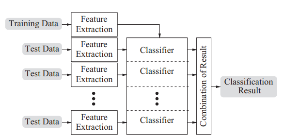

# Literature study

- [ ] Classification of reverberant audio signals using clustered ad hoc distributed microphones
- [x] Estimating Source Dominated Microphone Clusters in Ad-Hoc Microphone Arrays by Fuzzy Clustering in the Feature Space
- [x] Source separation by fuzzy-membership value aware beamforming and masking in ad hoc arrays
- [x] SOURCE SEPARATION BY FEATURE-BASED CLUSTERING OF MICROPHONES IN AD HOC ARRAYS
- [ ] Madhu phd thesis
- [ ] 2D Acoustic Source Localisation Using Decentralised Deep Neural Networks on Distributed Microphone Arrays
- [ ] A Coherence-based Clustering Method for Multichannel Speech Enhancement in Wireless Acoustic Sensor Networks
- [ ] ESTIMATION OF MICROPHONE CLUSTERS IN ACOUSTIC SENSOR NETWORKS USING UNSUPERVISED FEDERATED LEARNING
- [ ] Exploiting Temporal Context in CNN Based Multisource DOA Estimation
- [ ] Unsupervised Clustered Federated Learning in Complex Multi-source Acoustic Environments
- [ ] Neural_Networks_Using_Full-Band_and_Subband_Spatial_Features_for_Mask_Based_Source_Separation (cant open this file)

## Questions

* Q: Mel-frequency cepstrum?
* 

## Classification of reverberant audio signals using clustered ad hoc distributed microphones

This paper proposes an algorithm to provide a way of clustering ad hoc distributed microphones so that they can be divided in:

* Microphones where one of the sound sources is dominant
* Microphones containing mainly signal mixtures and reverb

Audio feature extraction is performed directly in each device of the WASN. The captured data is represented in a feature vector compactly, so there is no need to exchange audio signals.

Q: What is a feature vector?

We need a strategy to create compatibility between test and train data, while also exploiting the spatial distribution of the receivers. This can be done in three different domains:

* Signal domain
  * We don't know much about the receiver positions so strategies like beamforming are quite useless
* Feature domain
  * Combine-then-analyse (CTA)
  * The feature vectors are combined, after which they are used as a common test sample in the classification system
  * 
* Decision domain
  * Analyse-then-combine (ATC)
  * Here we classify the feature vectors from different devices independently, after which they are combined to result in one classification decision.
  * 

//TODO

## Estimating Source Dominated Microphone Clusters in Ad-Hoc Microphone Arrays by Fuzzy Clustering in the Feature Space

This paper proposes to cluster microphones in an ad-hoc microphone array by source, adding one cluster for noise. Audio features, extracted from the microphone signals are used for fuzzy clustering, after which their fussy membership value is used to assign them to either a source dominant or a background cluster.

**Fuzzy clustering**

Instead of hard clustering the microphones. We'll use fuzzy clustering. This means that each microphone won't be perfectly in one cluster, but rather get a Fuzzy Membership Value (FMV) that indicates how much a microphone belongs in a certain cluster. The microphone is then assigned to the cluster for which it has the highest FMV.

**Evaluation**

Two simulated setups were used, one where two sources were placed randomly, but each in one half of the room. In the second setup, the sources were put closer together.

Research was also conducted in an acoustic laboratory using 16 microphones and two sound sources. The sources were either music or a male and female speaker. 100 different combinations were used. 

**Results**

For all scenarios, the background cluster is detected correctly in at least 89.7% of the cases for the scenario with speech and music sources and in over 93% of the cases with a male and a female speech source. This method seems to work very well with two sound sources, but no research was done with more sources. 

## Source separation by fuzzy-membership value aware beamforming and masking in ad hoc arrays

Q: What does an impulse response from a source to a microphone mean?

**1. Introduction**

This paper focuses on audio signal enhancement with delay-and-sum beamforming and extends upon the previous paper's fuzzy clustering.  For each source cluster, relative time-differences-of-arrival (TDOA) are estimated. This is combined with the FMV in the beamforming stage.

In a second enhancement stage, cluster-related spectral masks are applied to the output of the beamformers.

Q: Cepstral mean normalization?

**2. Ad hoc clustering**

A FMV is calculated for each microphone and for any source, a subset of the microphones will be selected for further processing. In essence, we're selecting the most useful microphones for processing the sound from each source.

**3. FMV-aware signal enhancement**

In each cluster, a reference microphone is selected. Subsequently, a correlation analysis of all the other microphone signals in respect to the reference signal is performed. This allows for an estimation of the TDOAs, which can be used in the beamforming stage. 

**3.1 Initial source signal estimation**

As I understand it, this mask just indicates in which microphone the source signal is dominant.

Q: Is this correct?

Q: What is $B$ in the mask?

**3.2 Time-difference-of-arrival estimation**

Now the TDOAs are estimated with correlation analysis. This is realised as a time-domain cross-correlation, computed over segments of ∼ 4s in length, which is also the duration across which the audio features for the fuzzy clustering are computed. 

**3.3 Clustering-steered beamforming**
$$
\hat{s}_{n \text{, W-DSB}}(l) = \sum_{i_n}w_{n,i_n}x_{i_n}(l + D_{i_n})
$$

* $\hat{s}_{n \text{, W-DSB}}(l) $: Q: what exactly does this mean?
  * $l$ is the discrete time index
* $D_{i_n}$: relative TDOA's
* $w_{i_n}$: the weights allocated to each microphone $i_n$ of cluster $n$
  * These are proportional to the FMV

By using a weighted combination of the microphone signals, we can make a better DSB.

**3.4 Mask re-estimation for post-filtering**

The result of the previous stage should give an enhanced signal, which can now be used to compute a post-filtering mask.

Q: I don't understand very well how this mask is calculated.

This mask is then applied to the the signal, which was already processed by the fuzzy-membership value aware beamforming. 

This yields a final source signal estimate. 

The image below shows a schematic of the full algorithm.

Q: Wat gebeurt er precies bij de feature extraction?

**4. Evaluation**

This was very similar to the previous paper.

FMVA-DSB consistently yields a better performance compared to the simple DSB. However, the performance difference is not very large. 

## Source separation by feature-based clustering of microphones in ad-hoc arrays

Here, the simple DSB is done on the microphone signals, without taking into account the FMVs. 

Q: Why do they use fuzzy clustering here? Because they're only using the FMV to determine in which cluster a microphone should end up.