# Machinaal Leren

Deze samenvatting omvat de onderwerpen gezien in de slides. Waar de uitleg tekortschiet heb ik aangevuld met informatie uit het boek [(hier is de pdf)](https://www.knowledgeisle.com/wp-content/uploads/2019/12/2-Aur%C3%A9lien-G%C3%A9ron-Hands-On-Machine-Learning-with-Scikit-Learn-Keras-and-Tensorflow_-Concepts-Tools-and-Techniques-to-Build-Intelligent-Systems-O%E2%80%99Reilly-Media-2019.pdf).

De [oplossingen](https://waxworksmath.com/Authors/G_M/Geron/WriteUp/Weatherwax_Geron_Solutions.pdf) voor de oefeningen in het boek. Deze zijn gemaakt door een student denk ik.

Oké ik heb een betere digitale versie van het [boek](https://dokumen.pub/hands-on-machine-learning-with-scikit-learn-keras-and-tensorflow-2ndnbsped-978-1-492-03264-9.html) gevonden (met oplossingen). Het is wel een vage site, maar het boek ziet er goed uit. Die andere pdf die ik had was een early release en bevatte ook geen oplossingen.

## Puntenverdeling

Evaluation:

* 50% theory exam
* 50% NPE: 3 deadlines throughout the semester

# 1 - The ML Landscape

p3

## ML Types

We kunnen machine learning modellen onderverdelen volgens de hoeveelheid of de soort **supervisie** die ze krijgen tijdens hun training. 

Op deze manier kunnen we machine learning modellen in drie types onderverdelen:

* **Supervised learning**
  * De data die we aan het algoritme geven bevat ook de gewenste oplossing
  * Classificatie: een klasse proberen te voorspellen (bv. spam filter)
  * Regressie: een bepaalde numerieke waarde proberen te voorspellen op basis van een set van *features* (bv. prijs van een auto op basis van kilometers en leeftijd)
* **Unsupervised learning**
  * Er is geen *ground truth* beschikbaar
  * Clustering: gelijkaardige datapunten groeperen (bv. aanbevelingen op netflix voor gelijkaardige kijkers)
  * Anomaly detection (bv. fraudelente creditcard transacties)
* **Reinforcement learning**
  * We trainen een *agent* door hem te belonen, de *agent* leert dan vanzelf een methode (*policy*) om de beloning te maximaliseren

### Model-based and Instance-based learning

Een andere manier om machine learning modellen onder te verdelen is volgens hoe ze **veralgemenen** om met ongeziene samples om te kunnen gaan. Dit kan typisch op twee manieren.

Bij **model-based** **learning** is het de bedoeling om een model te leren dat de output kan voorspellen van een gegeven input. Het model is dan een set parameters die geleerd worden van gegeven data. De nieuwe sample in de figuur is volgens het model een driehoek, op basis van de parameters die het model heeft geleerd van de training samples.

Een andere manier is **instance-based learning**. We gebruiken training samples om voorspellingen te maken op nieuwe data, zonder bepaalde parameters te trainen. De voorspelling is enkel gebaseerd op de vergelijking tussen de nieuwe data en de training samples. In de figuur wordt de nieuwe instance een driehoek omdat de meeste dichtstbijzijnde training samples driehoeken zijn.

| Model-based learning                                         | Instance-based learning                                      |
| ------------------------------------------------------------ | ------------------------------------------------------------ |
| 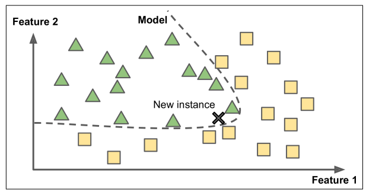 | 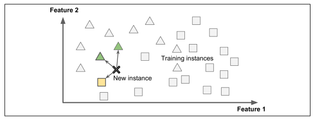 |

### Model selection

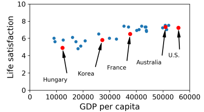

Wanneer we model-based learning toepassen, zullen we een bepaald model moeten kiezen. In de tekening hierboven lijkt de grafiek een lineaire trend te volgen. Als we hier nu een lineair regressiemodel voor maken is het belangrijk om te weten dat we zijn vertrokken vanuit de assumptie dat de data een lineaire trend volgt. Dit is een voorbeeld van een **inductive bias**. 

> Inductive bias = your assumptions on the nature of the target and on the properties of the data

## Main challenges in machine learning

| No free lunch theorem                                        |
| ------------------------------------------------------------ |
| Als je absoluut geen veronderstellingen maakt over je data, is er geen reden om een bepaald model boven een ander te kiezen. Voor sommige datasets is het beste model een lineair model, voor anderen is een neuraal netwerk beter geschikt. Er is geen model dat *a priori* gegarandeerd beter werkt. |

Er zijn een aantal zaken die mis kunnen gaan bij een machine learning model. Deze vallen typisch ofwel in de categorie *bad model* of *bad data*. 

We zullen beginnen met een paar voorbeelden van **bad data**:

* <u>Te weinig trainingsdata</u>
  * Voor de meeste machine learning algoritmes hebben we grote hoeveelheden data nodig, zeker voor problemen zoals image of speech recognition. Voor zulke problemen hebben we typisch miljoenen voorbeelden nodig.
* <u>Non-representatieve trainingsdata</u>
  * De data waarop we het model trainen moet representatief zijn voor de nieuwe gevallen waarnaar we willen generaliseren. 
  * Als je steekproef te klein is krijg je *sampling noise*. De data is niet representatief door toeval.
  * Als je steekproefmethode gebrekkig is zal je te maken krijgen met *sampling bias*, zelfs al is je steekproefgrootte voldoende.
* <u>Slechte kwaliteit data</u>
  * Als je data vol fouten zit is het natuurlijk moeilijk om een goed model te maken
  * Je kan proberen uitschieters te verwijderen of normaliseren of ontbrekende data aanvullen.
* <u>Irrelevante features</u>
  * Belangrijk bij een machine learning model is om een goeie set van features te vinden om het model op te trainen. Dit proces, *feature engineering* bestaat uit:
    * *Feature selection*: de meest nuttige features kiezen
    * *Feature extraction*: features combineren om een nuttigere feature te verkrijgen
    * Nieuwe features maken door nieuwe data te verzamelen

Soms is de data niet de boosdoener, maar liggen de slechte resultaten aan het **algoritme**:

* <u>Overfitting op trainingsdata</u>
  * Het model is te specifiek afgesteld op de trainingsdata en presteert daarom slechter op nieuwe data.
  * Dit probleem kunnen we verminderen door **regularisatie**, hierover later meer.
  * We kunnen ook ons model versimpelen, meer trainingsdata verzamelen of de hoeveelheid *noise* in de data proberen te verminderen.
* <u>Underfitting</u>
  * Het model doet het slecht op zowel trainingsdata als testdata
  * Het model is te simpel, we kunnen meer paramaters of features toevoegen, maar we kunnen ook de hyperparameter van de regularisatie kleiner maken.

## Testing and validating

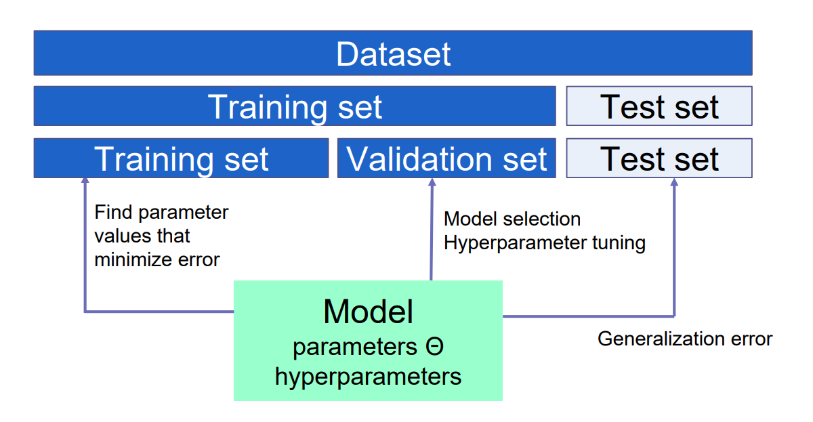

Om te weten of het model effectief werkt, is het belangrijk om het te testen op nieuwe gevallen. We splitsen onze dataset op in een **training set** en een **test set**. Vanzelfsprekend gaan we dan ons model trainen op de training set en testen op de test set. Zo krijgen we inzicht in hoe ons model zou presteren op nieuwe gevallen.

Wat als we nu verschillende modellen willen testen. We trainen meerdere modellen op de training set en testen ze op de test set. Raar genoeg presteert zelfs het beste model nog steeds slecht bij een praktische test. Dit komt doordat we nu een model hebben gekozen en afgesteld zodat het het beste presteert op onze test set. 

Een oplossing hiervoor is om onze training set op te splitsen in een **training set** en een **validation set**. De validation set wordt dan gebruikt voor de modelselectie en het afstellen van hyperparameters. 

### Cross-validation

Deze oplossing werkt goed, maar als de validation set te klein is, kunnen we per ongeluk een suboptimaal model kiezen doordat de evaluaties niet precies genoeg zijn. Als de validation set te groot is, is de resterende training set veel kleiner dan de volledige training set. Dit is ook niet goed, want we gaan dan het model dat op een veel kleinere kleine set getraind en gevalideerd is trainen op de volledige training set. Dit is zoals de snelste sprinter kiezen voor een marathon. 

Een oplossing voor dit probleem is herhaaldelijke **cross-validation**. We gebruiken meerdere kleine validation sets. We evalueren het model dan één keer per validation set, waarna we het trainen op de rest van de data. Als we nu het gemiddelde nemen van al deze evaluaties, krijgen we een veel beter zicht op de prestatie van het model. 

Eén groot nadeel hieraan is dat we dus voor elke validation set het model moeten trainen. De **trainingstijd** wordt **vermenigvuldigt** met het **aantal validation sets**.

# 2 - End-to-end machine learning project

p37

Stel je nu voor dat we data scientists zijn in een groot bedrijf. Dit zijn de stappen die we zullen moeten doorlopen:

1. Look at the big picture. 
2. Get the data. 
3. Discover and visualize the data to gain insights. 
4. Prepare the data for Machine Learning algorithms. 
5. Select a model and train it. 
6. Fine-tune your model. 
7. Present your solution. 
8. Launch, monitor, and maintain your system.

We zullen een aantal stappen behandelen want sommige zijn niet erg relevant.

## Look at the big picture

Eerst en vooral moeten we het probleem proberen te **kaderen**:

* Hebben we ML nodig?
* Wat is het type van het probleem? (regressie, classificatie, ...)
* Welke data is er beschikbaar?

Vervolgens moeten we een **performance metric** kiezen. Een typisch voorbeeld hiervan voor regressieproblemen is de Root-Mean-Squared-Error (RMSE). Deze geeft ons een idee van hoe fout ons systeem zit in zijn voorspellingen, met een hoger gewicht voor grote fouten. 
$$
\text{RMSE}(X,h_0) = \sqrt{ \frac 1 m \sum_{i=1}^m (h_0(x^{(i)}) - y^{(i)})^2 }
$$
We kunnen ook de $\ell_k$ norm gebruiken, waar de $\ell_2$ norm volgens mij hetzelfde is als de RMSE. 
$$
\ell_k = \lVert \hat y - y \rVert_k = (\lvert \hat y ^{(1)} - y^1 \rvert ^k + \cdots + \lvert \hat y^{(m)} - y^m \rvert^k )^\frac{1}{k}
$$
<u>Notatie</u>

* $h_0$ is onze hypothesefunctie
* $\hat y^{(i)} = h_0(x^{(i)})$: als we onze functie een feature vector van een bepaalde instantie $x^{(i)}$ geven, zal hij een voorspelde waarde $\hat y^{(i)}$ teruggeven.
  * $x^{(i)}$ is dus de feature vector van een bepaalde instantie zonder de labels
  * $y^{(i)}$ bevat dan de labels
* De matrix $X$ bevat alle features $x^{(i)}$ van alle instanties.

## Get the data

//laat zitten

## Discover and visualize the data to gain insights

Een andere belangrijke zaak is **exploratory data analysis** (EDA). Hiermee willen we een aantal doelen bereiken:

1. Gevoel krijgen met de data
   * We kunnen histogrammen maken voor elke feature
2. De data visualiseren en inzicht krijgen
   * Scatterplots per twee attributen
3. De data voorbereiden
   * Dit doen we in de volgende stap

## Prepare the data 

* Ontbrekende waarden invullen 
  * Entry of attribuut met ontbrekende waarde verwijderen
  * Vervangen door mediaan, gemiddelde of 0
* Categorische attributen
  * Kunnen maar een aantal mogelijke waarden aannemen, voor nominale variabelen gebruiken we one-hot-encoding
* Feature scaling
  * We kunnen de features herschalen door ze te normaliseren of standaardiseren zodat features met een groter bereik geen grotere impact hebben op modellen 

## Select a model and train it

p75

Nu evalueren we meerdere modellen op onze training set. Probeer verschillende hyperparameters uit voor elk type model en evalueer de prestaties met cross-validation. Vervolgens train je het model opnieuw op de volledige training set met de optimale hyperparameters. 

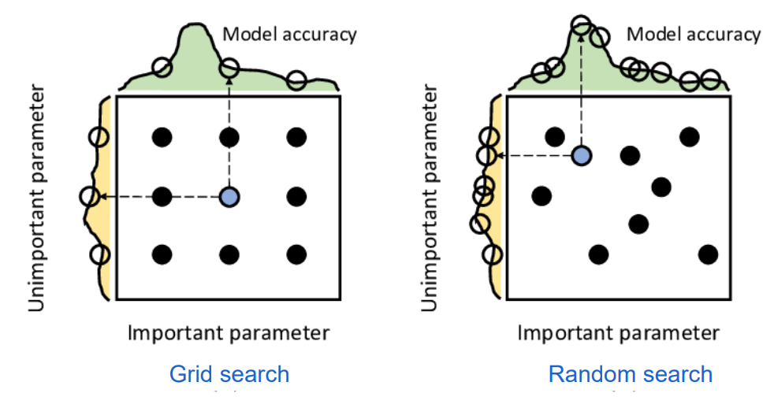

* Grid search 
  * We defineren een *grid* met combinaties van hyperparameters en trainen het model voor elk punt van de *grid*, waarna we het beste model kiezen.
  * Dit is moeilijk als je erg veel combinaties hebt
* Random search
  * We proberen *at random* combinaties van parameters uit en gebruiken de beste combinatie die we vinden. 
  * Dit werkt een stuk beter als de zoekruimte van de hyperparameters erg groot is
  * Het is ook gemakkelijk om te beslissen hoeveel resources random search mag gebruiken. Je laat het gewoon zo lang draaien als je zin hebt.

# 3 - Classification

p87

Een classificatieprobleem is het voorspellen van een klasse op basis van een set features. Classificatie valt onder **supervised learning** in de ML landscape. 

## Performance measures

Om te meten of een classificatiemodel goed presteert, kunnen we gebruik maken van verschillende technieken. 

### Confusion matrix

p92

Dit plaatje toont de confusion matrix voor een classificatiemodel dat ons vertelt of een getal 5 is of niet.

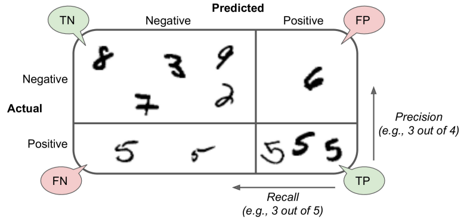

Een confusion matrix geeft ons een overzicht op de volgende waarden voor een binair classificatieprobleem:

* True Negatives (TN): behoren niet tot de klasse en zijn ook zo geïdentificeerd
* True Positives (TP): behoren tot de klasse en zijn ook zo geïdentificeerd
* False Negatives (FN): behoren tot de klasse, maar zijn niet zo geïdentificeerd
* False Positives (FP): behoren niet tot de klasse, maar zijn wel zo geïdentificeerd

### Precision & Recall

p94

**Precision** vertelt ons hoe accuraat de positieve voorspellingen zijn.

| $$ \text{precision} = \frac{TP}{TP+FP} $$ | 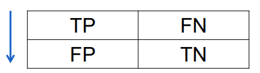 |
| ----------------------------------------- | ------------------------------------------------------------ |

**Recall** vertelt ons hoeveel van de echte positieve waarden effectief gevonden zijn

| $\text{recall} = \frac{TP}{TP+FN}$ | 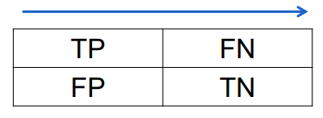 |
| ---------------------------------- | ------------------------------------------------------------ |

Als we deze twee willen combineren in een metriek die een hoge waarde geeft als zowel de precision als de recall hoog zijn, kunnen we gebruik maken van $F_1$:
$$
F_1 = \frac{2}{\frac {1} {\text{precision}} + \frac{1}{\text{recall}} } = 2 \times \frac{\text{precision} \times \text{recall}}{\text{precision} + \text{recall}} = \frac{TP}{TP + \frac{FN + FP}{2}}
$$

Spijtig genoeg moeten we altijd een evenwicht tussen precision en recall vinden, want als de precision omhoog gaat, gaat de recall omlaag en vice versa. Dit noemt met de **precision/recall trade-off**.

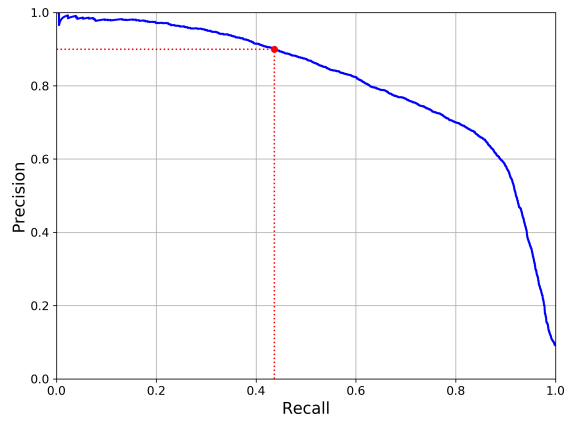

### The ROC Curve

p99

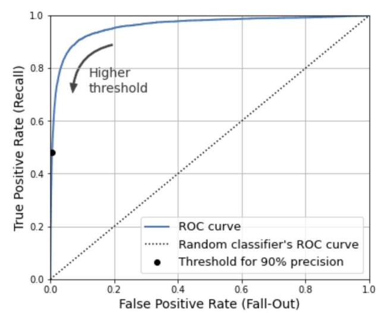

De **receiver operating charactertistic** curve is een ander veelgebruikt hulpmiddel bij binaire classificatieproblemen. De ROC curve zet de **true positive rate** (een ander woord voor *recall*) uit tegenover tegenover de **false positive rate** (*fall-out*), zijnde de verhouding van negatieve instanties die incorrect geclassificeerd zijn als positief. De false positive rate is gelijk aan 1 - de true negative rate (*specificiteit*). 

In de curve zie je weeral de trade-off. Hoe **meer recall**, hoe **meer vals positieven** het model produceert. De stippelijn representeert de de ROC curve van willekeurige classificatie. Voor een goed model willen we typisch zo ver mogelijk van die zlijn zitten.

Een manier om onze classificatiemodellen te vergelijken is door de **area under the curve** (AUC) te meten. Een perfect classificatiemodel heeft dan als oppervlakte de waarde 1. 

Als je ooit moet kiezen tussen een preciesion/recall curve of een ROC curve, is het aangeraden om voor de PR curve te kiezen als de positieve klasse weinig voorkomt of als de vals positieven belangrijker zijn dan de vals negatieven. In andere gevallen kies je voor de ROC.

### Unbalanced dataset

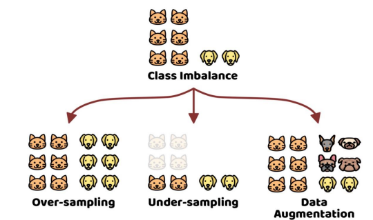

Als sommige klassen veel vaker of veel minder vaak voorkomen, spreken we van een **unbalanced dataset**. Dit kan een sterke invloed hebben op de werking van ons model. Stel je voor dat we een dataset hebben met 95 katten en 5 honden. Als we dan een model maken dat elke nieuwe instantie classificeert als kat, zal het model een accuracy van 95% hebben, terwijl alle honden fout werden geclassificeerd. 

Er zijn een aantal manieren om hiermee om te gaan:

* Dataset Augmentation
* Undersampling: we nemen minder samples van de *majority class* (in dit geval de katten)
* Oversampling: random duplicatie van samples van de *minority class* (de honden)
  * Hierdoor kan het model wel overfitten op de *minority class*
* Ensemble models: meerdere modellen combineren
* Do not use accuracy as metric, kijk best ook naar precision, recall en $F_1$

### Multiclass classification

p102

We hebben het tot nu toe gehad over binaire classificatie, waar we proberen het onderscheid te maken tussen twee klassen. Doen we aan **multiclass classification**, dan proberen we het onderscheid te maken tussen meer dan twee klassen. 

Er zijn een aantal algoritmes die zijn gemaakt om classificatie op meerdere klassen te doen, maar wwe kunnen ook onze binaire classificatiemodellen omzetten om met meer klassen om te kunnen gaan. Dit kunnen we op twee manieren:

* One-versus-all: 
  * Train een binair classificatiemodel voor elke klasse
  * Elk model zegt voor een klasse of een bepaalde instantie bij die klasse hoort of niet.
* One-versus-one:
  * Voor elke twee klassen trainen we een classifier die het onderscheid tussen de twee maakt.

| One-vs-rest                                                  | One-vs-one                                                   |
| ------------------------------------------------------------ | ------------------------------------------------------------ |
| 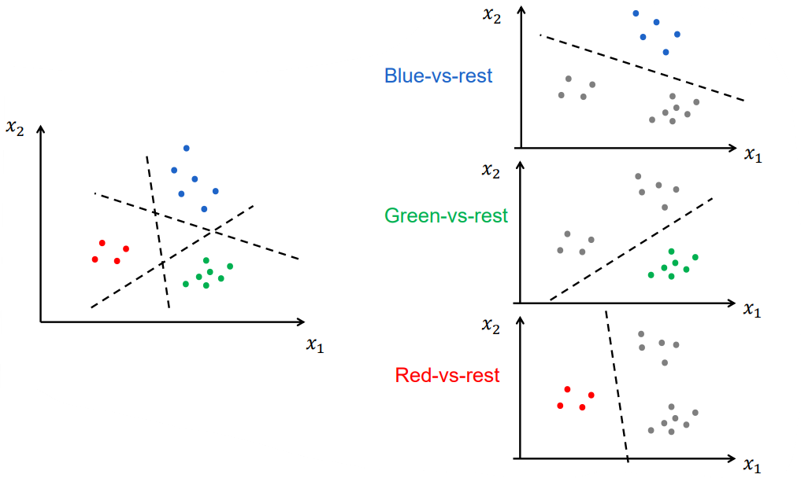 | 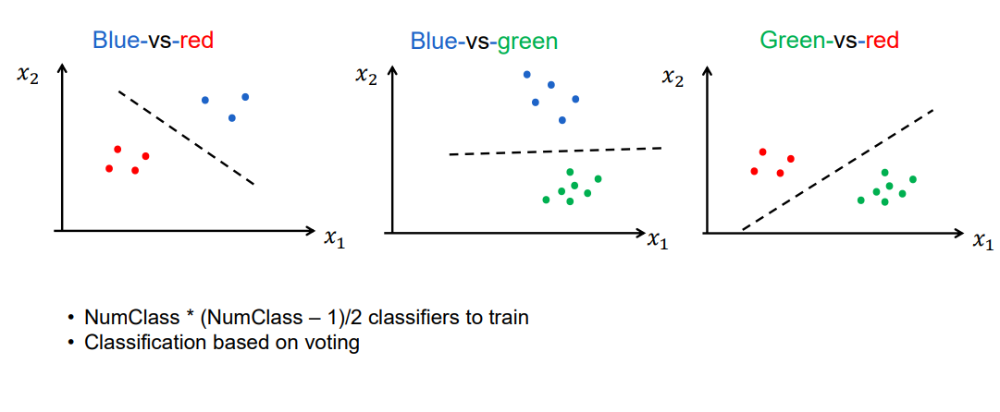 |

#### Confusion matrix

Om de prestaties van multiclass classification te visualiseren, kunnen we gebruik maken van een confusion matrix:

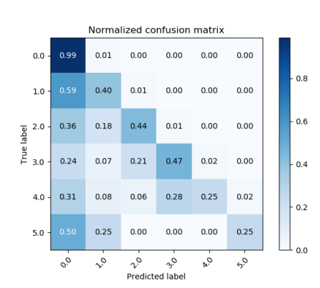

# 4 - Training models

Tot nu toe hebben we alle modellen en hun trainingsalgoritmes als een soort black box behandeld. In dit hoofdstuk gaan we dieper in op een aantal modellen. 

### Lineaire regressie

We bespreken twee zeer verschillende manieren om een lineair regressiemodel te trainen. Aan de ene kant kunnen we een **closed-form** vergelijking gebruiken die rechtstreeks de modelparameters berekent en zo ons een optimale oplossing geeft die het model zo goed mogelijk *fit* op de training data. 

Een andere mogelijkheid is **gradient descent**, een iteratieve oplossing die onze parameters geleidelijk aan optimaliseert door een bepaalde **cost function** te minimaliseren over de training set. 

Bij lineaire regressie vertrekken we van een inductive bias: *Er zit een lineaire relatie in onze data*. In de grafiek van de huisprijzen in Gent zal onze lineaire regressiefunctie deze vorm aannemen:
$$
\text{price} = \Theta_0 + \text{bedrooms}* \Theta_1
$$
Elke waarde voor $\Theta = (\Theta_0, \Theta_1)$ stelt een lijn voor met:

* $\Theta_0$: snijpunt met de y-as (*bias*)
* $\Theta_1$: De richtingscoëfficiënt (*weight*)

We proberen nu de optimale parameters $\hat \theta$ the vinden, deze stellen de lijn voor die het best overeenkomt met de training data.

#### Meerdere input features

Als we te maken hebben met meer dan één input feature, kunnen we meerdere *weights* toevoegen. Om dit weer te geven gebruiken we de vectornotatie:
$$
\hat y = h_\Theta(x) = \Theta.x
$$

* $\hat y$: de voorspelling
* $x$: de inputfeatures (met vanvoor een $1$)
* $\Theta$: de modelparameters

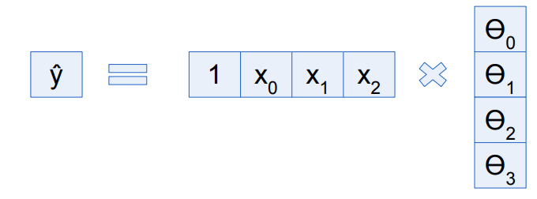

#### Training

We willen nu de optimale set parameters $\hat \Theta$ vinden. Een perfecte fit is nooit mogelijk door de ruis in onze data. Door middel van het minimaliseren van een **loss function**, kunnen we meten hoe goed $\Theta$ is:

$$
\text{MSE} = \frac{1}{n} \sum_{i=1}^{n} (y_i - \hat{y}_i)^2 \\
\text{RMSE} = \sqrt{\frac{1}{n} \sum_{i=1}^{n} (y_i - \hat{y}_i)^2}
$$
Nu kunnen we de bovenvermelde opties gebruiken om  $\hat \Theta$ te vinden. (closed form, gradient descent)

##### Closed Form

We berekenen rechtstreeks de optimale parameters. Dit is typisch niet de manier van werken bij machine learning modellen. Met de **ordinary least squares** methode berekenen we de partiële afgeleide van de loss function voor elke parameter $(\Theta_0, \Theta_1)$. Dit resulteert in de **normal equation**:
$$
\hat \Theta = (X^TX)^{-1}X^T \text{y}
$$

* Met $X$ de feature vector
* Deze methode gebruikt matrix inversie en is daardoor $0(n^3)$, en alleen bruikbaar op kleine datasets

##### Gradient descent

Gradient descent is een algemeen optimalisatiealgoritme dat de volgende stappen hanteert:

* Bereken de partiële afgeleiden van de loss function voor de parameters $(\Theta_0, \Theta_1)$
* Neem random waarden voor $(\Theta_0, \Theta_1)$ en evalueer de partiële afgeleide (dit geeft de gradiënt), deze geeft de 'richting' aan van de loss function
* Pas $(\Theta_0, \Theta_1)$ aan in de tegengestelde richting van de gradiënt
  * Hoe veel je ze aanpast hangt af van de **learning rate**
  * Kiezen we deze te klein, zal het lang duren voor het resultaat convergeert
  * Te groot, dan kan het dat we nooit convergeren
  * De learning rate is dus een **hyperparameter** die we zelf moeten afstellen
* Herhaal tot $(\Theta_0, \Theta_1)$ convergeert

| Kleine learning rate                                         | Grote learning rate                                          |
| ------------------------------------------------------------ | ------------------------------------------------------------ |
| 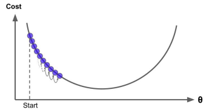 | 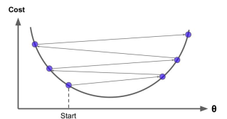 |

## Gradient descent implementaties

Er zijn een aantal verschillende manieren om aan gradiënt descent te doen:

* **Batch gradient descent**: de gradiënt elke stap berekenen voor alle trainingsdata (traag voor grote datasets)
* **Stochastic gradient descent**: loop over de training data, bereken de gradiënt en neem een stap voor elke sample
  * Veel sneller
  * Veel ruis in de schatting van de gradiënt
  * De cost zal rondswingen, lage kans om optimale oplossing te vinden (maar we goed genoeg)
  * Willekeur kan helpen om lokale minima te ontsnappen
* **Mini-batch gradient descent**:
  * Combinatie van beide

## Polynomial regression

Als de relatie in de data niet lineair is, kunnen we gebruik maken van polynomiale regressie om een **niet-lineair model** te proberen fitten. 

* $y = f(x) = \Theta_0 + \Theta_1x + \Theta_2x^2$
* Dan zoeken we $(\Theta_0, \Theta_1, \Theta_2)$ met de closed form of gradiënt descent

We kunnen ook een **niet-lineaire transformatie** uitvoeren op de data, waardoor de data wordt getransformeerd naar een ruimte waar we wel een lineair model op kunnen fitten. 

* Voeg bijvoorbeeld een feature $x^2$ toe, berekend uit bestaande features

## Regularization

### Bias-variance trade-off

Door het gebruik van veeltermen van hogere orde kunnen we complexere relaties modelleren. We kunnen de trainingsdata beter fitten, maar we zullen wel meer parameters moeten afstellen. Het doel is hier niet om een model te maken dat het best past op de training data. We willen een model dat zo goed mogelijk kan **generaliseren**, en dus nieuwe samples zo correct mogelijk kan voorspellen. 

De fout op generalisatie bestaat uit drie termen:

* **Bias error**: Fouten door verkeerde veronderstellingen over het model
  * underfitting
* **Variance error**: Fouten doordat het model te gevoelig is aan kleine veranderingen in de input
  * overfitting
* **Irreducible error**: ruis in de data

### Model regularization

We willen de expressieve kracht van het model beperken om hopelijk overfitting te beperken. Dit kunnen we bereken door een **regularisatie**-term toe te voegen. Deze beperkt het model door de gewichten klein te houden. 

#### Ridge regression

$$
J(\pmb\theta) = \text{MSE}(\pmb\theta) + \alpha \frac 1 2 \sum_{i=1}^{n}\theta_i^2
$$

| Regularisatieterm                      | 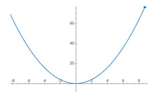 |
| -------------------------------------- | ------------------------------------------------------------ |
| **Afgeleide van de regularisatieterm** | 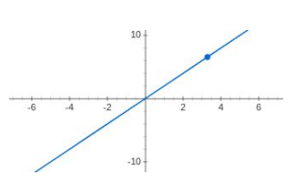 |

#### Lasso regression

De minst belangrijke gewichten worden op **nul** gezet. Het resultaat is dus een **schaars model**.
$$
J(\pmb\theta) = \text{MSE}(\pmb\theta) + \alpha  \sum_{i=1}^{n} \lvert{\theta_i}\rvert
$$
De absolute waarde operatie van Lasso regression is niet afleidbaar. Dit probleem kunnen we omzeilen door gebruik te maken van de **subgradiënt**. Als we de functie niet kunnen afleiden in een punt nemen we een waarde die zich tussen de afgeleiden van omliggende punten bevindt. 

| Regularisatieterm                      | 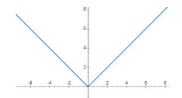 |
| -------------------------------------- | ------------------------------------------------------------ |
| **Afgeleide van de regularisatieterm** | 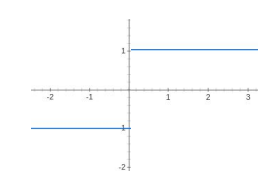 |

#### Elastic net

Is een gewogen som van Ridge en lasso-regressie. 
$$
J(\pmb\theta) = \text{MSE}(\pmb\theta)
+ r \alpha  \sum_{i=1}^{n} \lvert{\theta_i}\rvert
+ \alpha \frac {1-r} 2 \sum_{i=1}^{n}\theta_i^2
$$

## Visualizing performance

### Learning curves

| 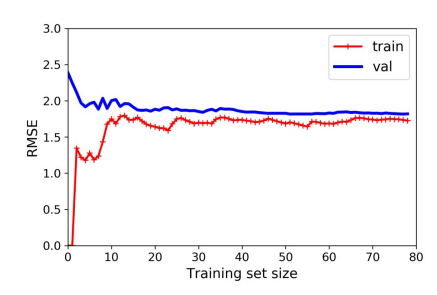 | 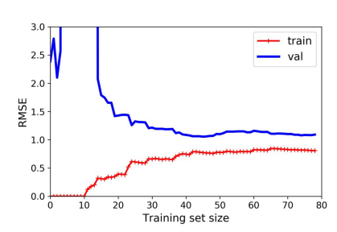 |
| ------------------------------------------------------------ | ------------------------------------------------------------ |

Aan de hand van een **learning curve** kan je de prestaties van het model meten voor verschillende datasetgroottes. De grafiek biedt een antwoord op de volgende vragen:

* Lijdt het model aan hoge bias/variantie?
* Zou het toevoegen van trainingsdata het model verbeteren?

### Training curves

| 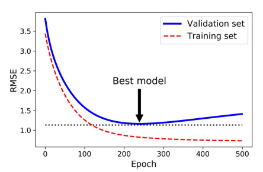 | 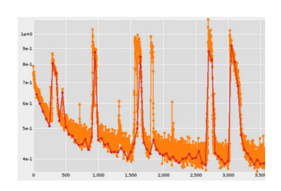 |
| ------------------------------------------------------------ | ------------------------------------------------------------ |

Met een **training curve** kan je de prestaties van het model **tijdens het trainen** visualiseren. Dit is nuttig voor technieken zoals gradiënt descent, waar het model iteratief wordt verbeterd. Een training curve verschaft ons een antwoord op:

* Leert het model bij?
* Wanneer begint het model te overfitten?
* Gebruik ik de juiste learning rate?

Door te kijken naar de training curve kunnen we zien wanneer het model begint te overfitten. Best nemen we een snapshot van het model, vlak voor dit moment. Dit staat bekend als **early stopping**. 

## Classification

Ondertussen weten we al ongeveer wat classificatie is. Bij binaire classificatie modelleren we in essentie een **desicion boundary** die onze twee klassen scheidt. Dit kan lineair of niet-lineair.

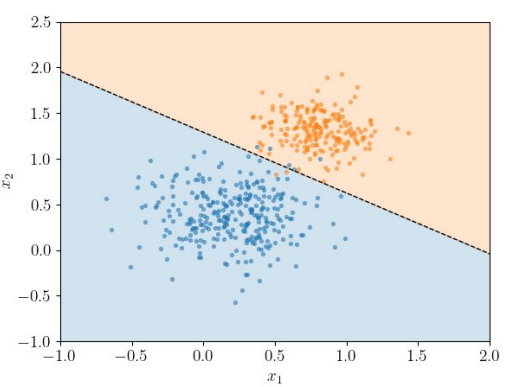

Wat gebeurt er nu als we proberen om lineaire regressie te gebruiken voor classificatie? We labelen één klasse als $0$ en de andere als $1$ en proberen dan een lineair regressiemodel te fitten. Omdat regressie altijd een exacte waarde probeert te voorspellen moeten we de uitkomst van het model telkens naar één van deze twee waarden $(0,1)$ afronden. 

### Logistic regression

$$
\hat p = h_{\pmb\theta} (\mathbf x) = \sigma( \mathbf x ^T \pmb \theta)
$$

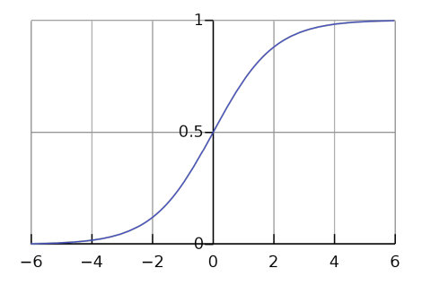

Als we zonder vermelde inzichten toepassen, bekomen we **logistic regression**. Om ervoor te zorgen dat we altijd een waarde tussen $0$ en $1$ uitkomen, maken we gebruik van een **sigmoid function**. 
$$
\sigma(t) = \frac{1}{1 + \exp(-t)} 
$$
$\sigma(t)$ kan dan geïnterpreteerd worden als de probabiliteit dat de sample bij een bepaalde klasse hoort. Dit komt overeen met de afstand tot de decision boundary. Net als bij lineaire regressie, zullen we een cost functie moeten optimaliseren. In dit geval zal de MSE-loss niet-convex zijn. We gebruiken de **log loss**. 

//TODO misschien de wiskundige vergelijkingen toevoegen als die belangrijk zijn

### Softmax regression

Als we meer dan twee klassen hebben, zou **one-vs-all** een mogelijk optie zijn. Dan hebben we een model voor elke klasse. Deze modellen zijn onafhankelijk, wat het vergelijken van de probabiliteiten moeilijk maakt.

Een goede oplossing is **softmax regression**. We voorspellen een probabiliteit voor elke klasse en normaliseren ze zodat hun som gelijk is aan $1$. 

Dit doen we met de softmax functie:
$$
\hat p_k = \sigma(\mathbf s(\mathbf k))_k = \frac{\exp(s_k(\mathbf x))}{\sum_{j=1}^K \exp(s_j(\mathbf x))}
$$

Het model wordt getraind met gradient descent, gebruik makende van **cross entropy loss**:
$$
J(\mathbf \Theta) = - \frac 1 m \sum_{i=1}^m \sum_{k=1}^K y_k^{(i)}\log (\hat p _k ^{(i)})
$$
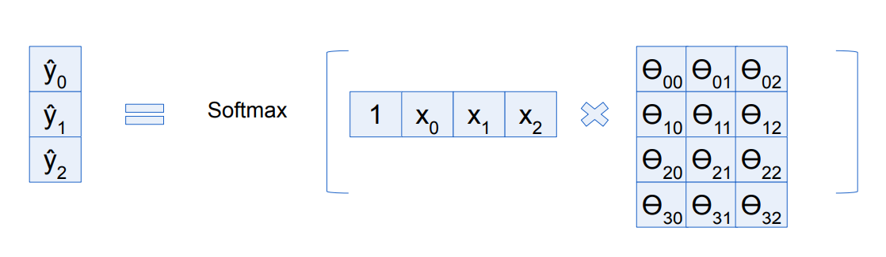

// TODO misschien uitleggen wat cross entropy is

# 5 - Support vector machines

## Linear classification

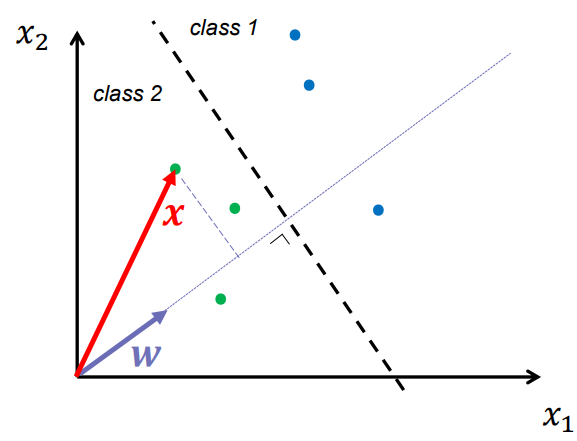

Bij lineaire classificatie zoeken we een discriminator functie $g(x)$ die de samples in twee categorieën opsplitst. Door de vector van een punt ($x$) te projecteren op de rechte door de oorsprong, loodrecht op $g(x)$ kunnen we wiskundig aantonen of een punt tot de klasse behoort of niet. 
$$
\mathbf w ^T \mathbf x \geq c \xRightarrow{\enspace} \mathbf x \text{ behoort tot klasse 1}\\
\mathbf w ^T \mathbf x < c \xRightarrow{\enspace} \mathbf x \text{ behoort tot klasse 2}
$$
Je kan het ook iets mooier schrijven met $b = -c$
$$
g(\mathbf x) = \mathbf w^T \mathbf x + b \geq 0 \xRightarrow{\enspace} \mathbf x \text{ behoort tot klasse 1}\\
g(\mathbf x) = \mathbf w^T \mathbf x + b < 0 \xRightarrow{\enspace} \mathbf x \text{ behoort tot klasse 2}\\
$$

## Marges toevoegen

Een support vector machine is een krachtig machine learning model waarmee je lineaire en non-lineaire classificatieproblemen mee kunt oplossen. Om daar te geraken introduceren we een marge in onze decision rule.

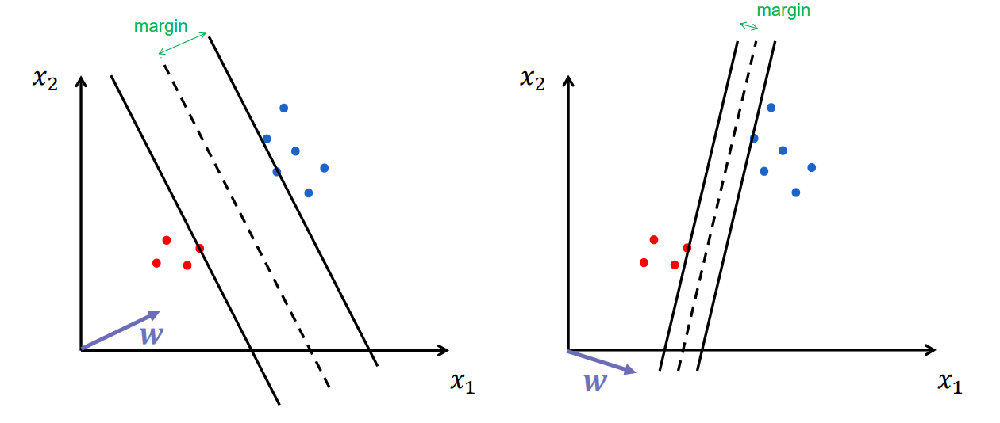

We proberen een scheiding te vinden die niet alleen de twee klassen opsplitst, maar ook **zo ver mogelijk** weg blijft van de dichtstbijzijnde trainingsinstanties. Zo is de kans groter dat het model goed presteert op nieuwe gevallen. Je kan een SVM classifier voorstellen als een zo groot mogelijke "straat" tussen je klassen te proberen passen. Dit staat ook bekend als **large margin classification**. 

Als we aan weerskanten van de "straat" nieuwe training samples toevoegen, zal in tegenstelling tot bij lineaire regressie onze classifier niet veranderen. Hij is volledig afhankelijk van de waarden aan de rand van de "straat". Deze waarden aan de rand noemen we **support vectors**, aangezien ze bij wijze van spreken de straat ondersteunen.

## Soft margin classification

### Hard margin classification

Als we de zonet beschreven voorwaarden strikt opvolgen, doen we aan **hard margin classification**. Alle instanties van één klasse moeten zich aan één kant van de straat bevinden, alle instanties van de andere klasse aan de andere kant. Er mogen zich geen instanties op de straat bevinden. 

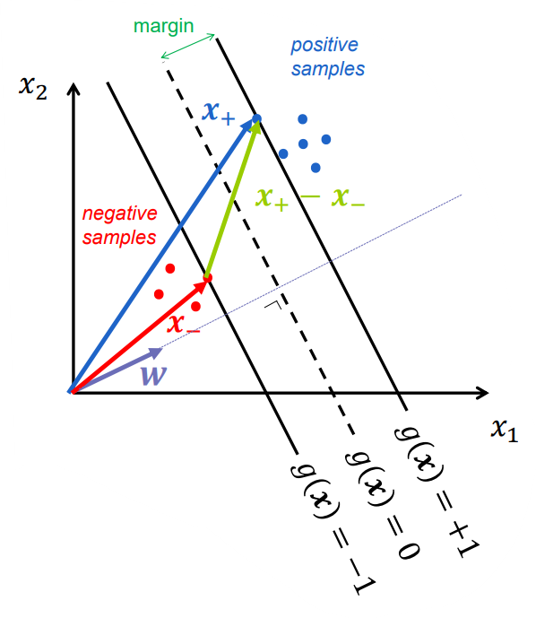

Onze decision function $g(x)$ moet aan de volgende voorwaarde voldoen:
$$
g(\mathbf x ^{\mathbf i}) = t^{(i)}(\mathbf w^T \mathbf x ^{(i)} + b) \geq 1, \quad \forall i
$$

* $\mathbf x ^{(i)}$: de feature vector van het i-de item in de dataset
* $t^{(i)}$ is $-1$ voor de negatieve klasse en $1$ voor de positieve klasse
* $\mathbf w$ bevat de *weights* (richtingscoëfficiënten)
* $b$ is de bias (verschuiving)
* $g(x)$ vertelt ons simpelweg of een waarde 
  * Op de straat ligt: dan ligt zijn waarde tussen $-1$ en $1$
  * Van de straat ligt aan de positieve kant: dan is zijn waarde groter dan $1$
  * Van de straat ligt aan de negatieve kant: dan is zijn waarde kleiner dan $-1$

De breedte van onze straat wordt gegeven door $\frac 2 {\lVert \mathbf w \rVert}$. Om deze breedte te maximaliseren moeten we dus $\lVert \mathbf w \rVert$ minimaliseren. Om dat de wiskunde dan makkelijker is, minimaliseren we: $\frac 1 2 \lVert \mathbf w \rVert ^2$

Dit kunnen we door $\mathbf w$ en $b$ af te stellen.

Dit leidt snel tot een aantal problemen, mooi geschetst in deze plaatjes. 

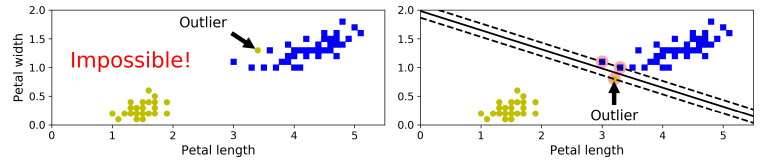

Als we te maken hebben met een uitschieter, kan het onmogelijk zijn om een lijn te vinden die de twee klassen perfect scheidt. Zelfs al kunnen we zo een lijn vinden, kunnen uitschieters de breedte van onze "straat" onnodig verkleinen. Om deze problemen te voorkomen, zullen we een zachtere aanpak moeten hanteren. 

### Soft margin classification

We willen een kleine hoeveelheid misclassificaties (waarden aan de verkeerde kant van de straat) toelaten. Waarden mogen soms ook op de straat liggen. 

Dit kunnen we doen door een bepaalde hoeveelheid **error** te tolereren: $\upzeta^{(i)} \geq 0$
$$
g(\mathbf x ^{\mathbf i}) = t^{(i)}(\mathbf w^T \mathbf x ^{(i)} + b) \geq 1 - \upzeta^{(i)}
$$

In het voorbeeldje hierboven zal voor punt `b` onze $\zeta^{(i)}$ dus groter moeten zijn dan $1$, want we moeten meer dan $1$ van hem aftrekken om aan de juiste kant van de straat te geraken. Ons doel is natuurlijk om een classifier te vinden waarvoor we zo veel mogelijk $\zeta$ 's op nul kunnen zetten.   

We kunnen dit in de vorm van een minimalisatieprobleem als volgt voorstellen:

$$
\min_{\mathbf w ,b,\zeta} \frac 1 2 \lVert\mathbf w \rVert^2 + C \sum^m_{i=1}\zeta^{(i)}\\
\begin{align}
\text{ onderhevig aan: } t^{(i)}(\mathbf w ^T \mathbf x^{(i)}+b) \geq &1 - \zeta^{(i)} \quad \forall i\\
\zeta^{(i)} \geq &0
\end{align}
$$

* Door $\frac 1 2 \lVert \mathbf w \rVert ^2$ te minimaliseren, maximaliseren we de marge (breedte van de straat)
* $C$ is een hyperparameter die we zelf moeten afstellen die aangeeft hoe hard de fouten zullen doorwegen
* $\zeta^{(i)}$ is de fout

//TODO hinge (ik denk dat we dat misschien niet moeten vanbuiten kennen)

## Stadardization

| Unscaled                                                     | Scaled                                                       |
| ------------------------------------------------------------ | ------------------------------------------------------------ |
| 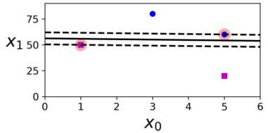 | 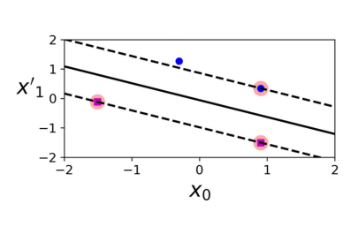 |

Als je met features werkt die ordes van magnitude van elkaar verschillen, zal het resultaat van SVM gedomineerd worden door de feature met de grootste schaal. Daardoor is het soms een goed idee om eerst je features te standaardiseren. 
$$
x_{0, \text{ scaled}} = \frac{x_0 - \mu_{x_0}}{\sigma_{x_0}}
$$

## Support vector

### Generalized Lagrangian

Neem ons optimalisatieprobleem:
$$
\min_{\mathbf w ,b,\zeta} \frac 1 2 \lVert\mathbf w \rVert^2 + C \sum^m_{i=1}\zeta^{(i)}\\
\begin{align}
\text{ onderhevig aan: } t^{(i)}(\mathbf w ^T \mathbf x^{(i)}+b) \geq &1 - \zeta^{(i)} \quad \forall i\\
\zeta^{(i)} \geq &0
\end{align}
$$
Dit probleem kan alleen opgelost worden met quadratic programming. We kunnen dit probleem makkelijker maken om op te lossen met de Generalized Lagrangian. Hierdoor wordt het een convex optimalisatieprobleem dat veel efficiënter opgelost kan worden:
$$
\begin{align}
\mathcal{L}(\mathbf w ,b,\zeta^{(i)}, \alpha^{(i)}, \beta^{(i)}) &= \frac 1 2 \mathbf w ^T \mathbf w + C \sum^m_{i=1} \zeta^{(i)} 
\\&- \sum^m_{i=1} \alpha^{(i)} (t^{(i)}(\mathbf w^T \mathbf {x^{(i)}}+b)-1 + \zeta^{(i)}) 
\\&- \sum^m_{i=1}\beta^{(i)} \zeta^{(i)}
\end{align}
$$
//TODO ik begrijp dit niet

### Intuition in the the solution of SVM

//TODO (slide 29 vooral)

### The dual problem

> U dient enkel te weten 
>
> 1. waarom we soms het duale probleem verkiezen over het primaire en 
> 2. dat in de duale formulering enkel het dot product van datapunten voorkomt; waardoor de kernel trick kan toegepast worden

//TODO

## The kernel trick

Wat als we nu beschikken over data die niet lineair te scheiden valt? 

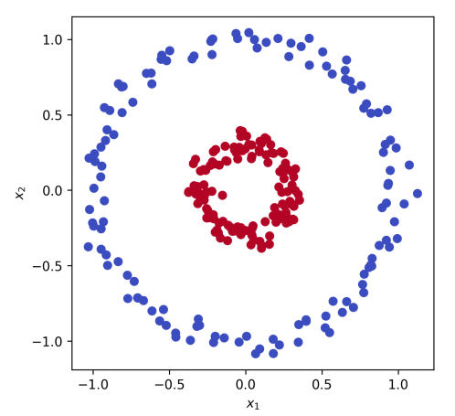

Eén optie is om een kwadratische functie te vinden die de klassen van elkaar scheidt. Dan zullen we meer parameters moeten trainen. Bovendien verhogen we op deze wijze ook de kans op overfitting. 

Een andere optie is om niet-lineaire combinaties van de bestaande features toe te voegen als nieuwe features. Dit correspondeert in essentie met een transformatie naar een hogere dimensie. In deze hogere dimensie kunnen we dan gewoon een lineaire classifier proberen te fitten. 

| Origineel                                                    | Hogere dimensie                                              |                                                              |
| ------------------------------------------------------------ | ------------------------------------------------------------ | ------------------------------------------------------------ |
| 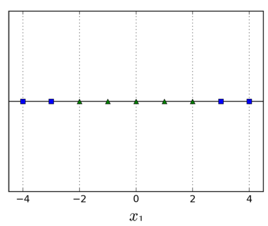 | 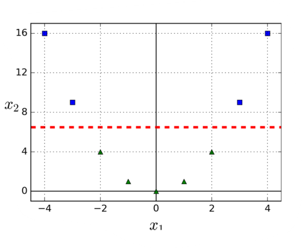 | We voegen de feature $x^2$ toe. We gaan van 1 dimensie naar 2 dimensies. |
|  | 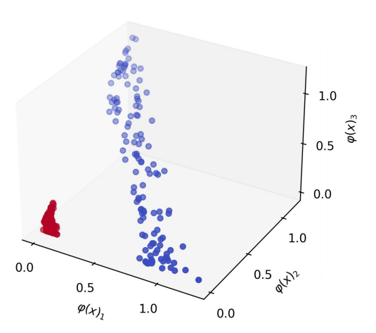 | $\varphi \left(\begin{bmatrix} x_{1} \\x_{2} \\       \end{bmatrix}\right) = \begin{bmatrix} x_{1}^2 \\x_{2}^2 \\ \sqrt2 x_1x_2      \end{bmatrix}$ |

> U moet in woorden kunnen uitleggen wat de kernel trick is, maar hoeft geen formules te kennen van individuele kernels. Slides 46-48 zijn te kennen in die zin dat u 
>
> 1. kan aanwijzen door welk type kernel een scheidingslijn is gegenereerd, en 
> 2. kwalitatief kan zeggen wat de impact van een hyperparameter van een bepaalde kernel is op de vorm van de scheidingslijn (Hoe vervormt de scheidingslijn bij grotere waarde van c bij polynomiale kernel? Hoe vervormt die bij grotere waarde van gamma bij RBF?). 
>
> De Sigmoid kernel is niet te kennen.

//TODO effectieve uitleg kernel trick (boek p 198)

# 6 - Decision trees

Een **decision tree** is een andere manier van supervised learning. Ze zijn geschikt voor zowel classificatie als regressie. We splitsen een beslissing op in een sequentie van kleinere beslissingen, elk gebaseerd op één feature. Je verdeelt de feature ruimte eigenlijk in vakjes. Als een nieuwe waarde dan in een bepaald vakje zit, kan je veronderstellen dat hij dezelfde te voorspellen waarde heeft als de gekende waarden in dat vakje.

| Classification                                               | Regression                                                   |
| ------------------------------------------------------------ | ------------------------------------------------------------ |
| Voorspel het behoren tot een bepaalde klasse                 | Voorspel een continue waarde                                 |
| 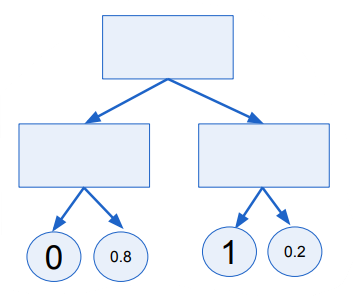 | 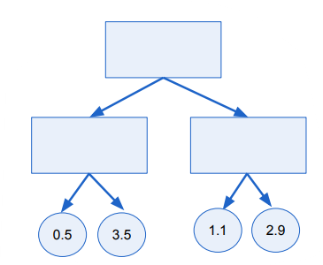 |
| De bladeren bevatten de probabiliteit voor een klasse        | De bladeren bevatten voorspelde waardes                      |
| 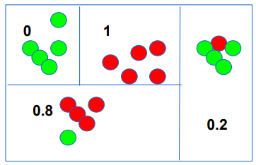 | 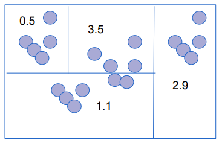 |
| Interne knopen geven een scheiding aan voor de resterende datapunten | Alle waarden in hetzelfde vakje resulteren in dezelfde voorspelling |

### Building a decision tree

Hoe stellen we deze boom nu op? Gegeven een bepaalde dataset met features en labels, moeten we de dataset in twee splitsen door een vraag te stellen. Dit blijven we herhalen tot een bepaalde diepte of als we niet meer verder kunnen splitsen.

Het vinden van de optimale beslissingsboom is een NP-compleet probleem, dus we zullen gebruik moeten maken een greedy methode. We kiezen de vraag die ons op dat moment de meeste informatie zal opleveren. 

#### CART

Eén manier om zo'n boom op te stellen is met CART (classification and regression trees). Dan werken we als volgt:

* Loop over alle features
  * Kies een bepaalde threshold (bijvoorbeeld het gemiddelde of de mediaan van die feature)
    * Je kan ook meerdere thresholds uitproberen per feature om een betere split te krijgen
  * Splits de datapunten op basis van de threshold (groter dan en kleiner dan)
  * Meet hoe goed de splitsing is met een **cost function**
* Kies de beste splitsing
* Herhaal dit tot een bepaalde diepte of als we niet verder kunnen splitsen

##### Classificatie

De cost function ziet er dan zo uit:

$$
J(k,t_k) =\frac{ m_\text{left}}{m}G_\text{left} + \frac{m_\text{right}} m G_\text{right}
$$

* $m_\text{left}$: hoeveel er nee hebben geantwoord
* $m_\text{right}$: hoeveel er ja hebben geantwoord
* $G_\text{left}$: de **impurity** van het linkerdeel, dit geeft aan hoe homogeen de waarden in het linkerdeel zijn
  * $G = 1 - \sum^c_{i=1}(p_i)^2$
  * Met $C$ het aantal klassen en $p_i$ voor een klasse hoeveel procent van de punten hij bevat
  * Als $G=1$ zijn alle elementen in de set van dezelfde klasse
  * Als $G=0$ zijn alle elementen in de set van verschillende klassen
* $G_\text{right}$: de **impurity** van het rechterdeel (analoog aan het vorige)

##### Regressie

Als we CART gebruiken voor regressie, gebruiken we voor $G$ de **sum-of-squares error**.
$$
G = \sum_{i=1}^n (y_i - f(x_i))^2
$$

* $n$: het aantal datapunten in de splitsing
* $y_i$: de target
* $f(x_i)$: de voorspelling (het gemiddelde van de targets in de splitsing)

#### Entropie

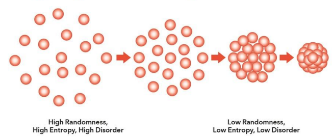

In plaats van de Gini impurity kunnen we gebruik maken van **entropie**. We zoeken dan in elke split een waarde die de entropie vermindert. De entropie zal nul zijn als onze node alleen waardes van één klasse bevat.
$$
H_i = - \sum_{\substack{k=1\\p_{i,k \neq 0}}}^n p_{i,k} \log_2(p_{i,k})
$$

## Bias-variance trade-offs

In bovenstaand plaatje zie je de visualisatie van een Decision Tree met diepte 1, 2 en 3. In de eerste twee zijn er een aantal misclassificaties. Ik het derde plaatje worden alle trainingsinstanties correct geclassificeerd. Is dit dat een goed model? 

Waarschijnlijk niet. Het model is mogelijks onderhevig aan overfitting. Een eigenschap van decision trees is dat het aantal parameters niet bekend is voordat we het model trainen. Decision Trees zijn **non-parametric**. 

## Regularisatie

Omdat Decision Trees gevoelig zijn aan overfitting, hebben we nood aan regularisatie. We willen de vrijheid van het model beperken zodat we niet oneindig veel variabelen kunnen gebruiken om onze functie te modelleren. 

We kunnen een aantal beperkingen introduceren:

* `Min_samples_split`: minimum aantal samples die een knoop moet bevatten als hij wilt splitsen
* `Min_samples_leaf`: minimum aantal samples die een blad moet bevatten
* `Min_weight_fraction_leaf`: zelfde als het vorige, maar als een fractie van het totaal aantal gewogen instanties
* `Max_height`: maximale hoogte van de boom 
* `Max_leaf_nodes`: maximum aantal bladknopen

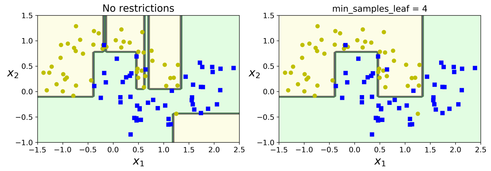

Hetzelfde geldt nog steeds wanneer je Decision Trees gebruikt voor regressie. 

## Voor- en nadelen

Bij het gebruik van Decision Trees komen een aantal voor- en nadelen kijken:

* Voordelen
  * Gemakkelijk te begrijpen
  * Kan **niet-lineaire** interacties tussen features modelleren
  * Zeer snel $O(\log m)$ ($m$ aantal training samples), zeker bij **inferentie**
  * Gemakkelijk te implementeren
  * Kan helpen bij het zoeken naar **feature importance**
  * Kunnen gemakkelijk gecombineerd worden in ensembles
  * Ondersteunt meerdere outputs
* Nadelen
  * Instabiel, een kleine wijziging in de data veroorzaakt een grote wijziging in de boom
  * Alle decisions worden gemaakt door loodrechte scheidingslijnen
    * De dataset roteren resulteert dus in een compleet andere tree
    * Kan verholpen worden door preprocessing met PCA (dan verlies je wel interpreteerbaarheid) //TODO wat is PCA?
  * Ze zijn relatief inaccuraat, er zijn modellen die het beter doen op dezelfde soort data
  * Gevoelig aan **overfitting**
  * Omdat ze alleen stapfuncties gebruiken om de decision boundary te modelleren is het moeilijk om:
    * Lineaire relaties te modelleren
    * Smooth functies te benaderen

Hier zie je wat er gebeurt als je de data roteert:

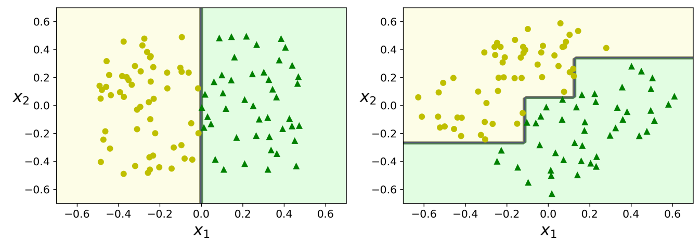

Decision Trees doen dus ook gek bij gladde curves:

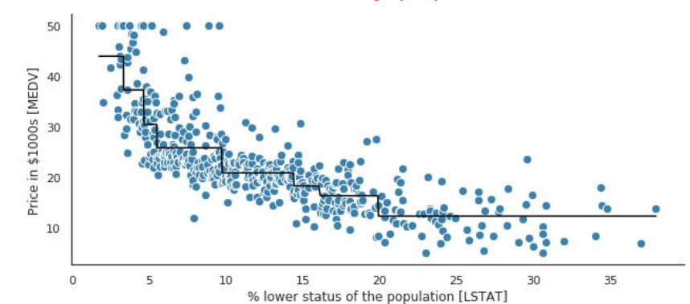

# 7 - Ensembles

Stel je voor dat je een moeilijke vraag stelt aan duizenden willekeurige mensen en een aggregatie maakt van hun antwoorden. In veel gevallen is dit geaggregeerde antwoord waarschijnlijk beter dan het antwoord van één expert. Analoog kunnen we door meerdere modellen te combineren op dezelfde wijze ook een beter resultaat krijgen. Deze techniek heet **ensemble learning**. 

Hierdoor kunnen meerdere zwakke modellen combineren tot één sterk model. Net als die ene scene in de Bionicle film van 2003 waar op het einde die twee Bionicles samensmelten en een sterkere Bionicle worden. (sorry spoilers)

We volgen bij ensembles altijd **twee stappen**:

* Zorg ervoor dat alle modellen verschillende dingen leren
* Combineer de individuele voorspellingen

We zullen de volgende technieken bespreken:

* **Voting**: we trainen modellen op licht verschillende datasets en combineren ze door het gemiddelde te nemen of de waarde die het meest is gekozen (een vote dus)
* **Boosting**: We trainen modellen die de voorspellingen van andere modellen verbeteren
* **Stacking**: We trainen een model dat de voorspellingen van andere modellen als input neemt

## Voting

We trainen hier verschillende modellen op verschillende versies van de data. 

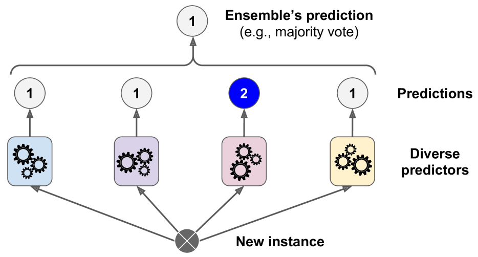

We kunnen totaal verschillende modellen trainen op dezelfde data. Gek genoeg zal in veel gevallen de accuracy van het ensemble zelfs hoger zijn dan de hoogste accuracy van de gebruikte modellen. Een andere manier van aanpak is om verschillende modellen van dezelfde soort te trainen op verschillende trainingsdata. 

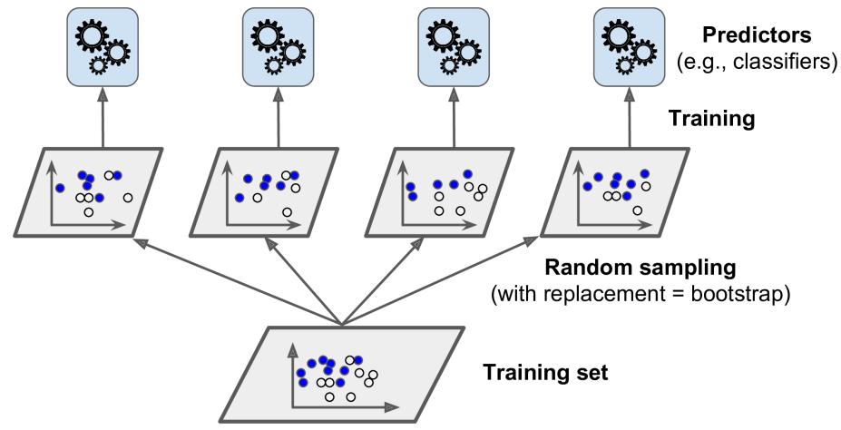

Er zijn een aantal technieken die het probleem op deze manier aanpakken:

* **Bagging**: (kort voor bootstrap aggregating) 
  * We maken meerdere training sets door random samples te nemen uit de training set **met terugleggen**
  * Het kan dus dat onze nieuwe training sets duplicaten bevatten.
  * Geeft meestal betere resultaten
* **Pasting**: 
  * We maken meerdere training sets door random samples te nemen uit de training set **zonder terugleggen**
  * Eén training set kan niet twee keer dezelfde waarde bevatten
  * Tussen verschillende training sets kunnen waarden wel opnieuw voorkomen
* **Random subspaces**
  * We gebruiken willekeurige subsets van de features
* **Random patches**
  * We nemen zowel willekeurige subsets van de features als willekeurige datapunten

Een goeie keuze voor deze werkwijze is om  **Decision Trees** te gebruiken. Doordat zelfs een kleine verandering in data een totaal andere boom geeft, geven ze de variatie die we nodig hebben voor ensembles. Hun zwakte wordt op deze wijze een sterkte. 

Bij het gebruik van bagging introduceren we de term **out-of-bag samples**. Dit zijn samples die voor een bepaald model niet in de training set zaten. Elke instantie van de volledige training set zal out-of-bag zijn voor een aantal van de modellen. Deze kunnen dan gebruikt worden voor de evaluatie van je model, zonder nood aan een extra test set. 

Neem een instantie en laat alle modellen waarvoor deze out-of-bag is een voorspelling maken voor deze instantie. Dan neem je van die modellen de majority vote. Nu kan je voor alle out-of-bag samples deze berekening doen (de OOB error) als performantiemetriek. Je moet wel oppassen, want deze methode doet het model soms beter blijken dan het eigenlijk is. 

### Random forests 

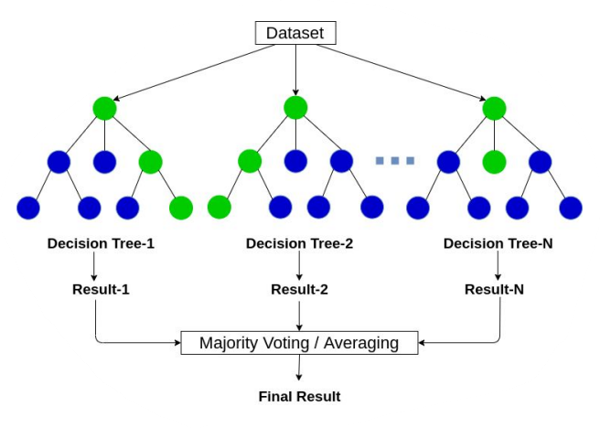

Als we een ensemble van decision trees gaan trainen met bagging, bekomen we een **random forest**. Dit soort model kan dus (net als decision trees) gebruikt worden voor zowel classificatie en regressie. 

* Elke boom wordt getraind op een **random subset van de data** (bagging)
* Om de bomen extra random te maken, nemen we bij het trainen bovendien op **elk niveau** van een gegeven boom een **random subset van de features** en berekenen we de beste split uit deze subset. 
* **Extra trees**: We voegen bij deze variant een random threshold toe (in plaats van te zoeken naar de beste threshold) om nog meer diversiteit te krijgen in de bomen. De bomen zullen minder gebalanceerd zijn, maar dit willen we juist. Dit wordt ook wel een Extremely Random Trees ensemble genoemd.

Een ander nuttig gegeven aan random forests is dat ze het makkelijk maken om de **relatieve importance** van elke feature te bepalen. Voor een bepaalde feature kan zijn belang afgeleid worden door te kijken hoeveel de knopen die deze feature gebruiken gemiddeld de impurity doen afnemen. 

## Boosting

Het principe van boosting is om verschillende modellen te trainen die elkaars fouten verbeteren. In tegenstelling tot voting moeten de modellen sequentieel getraind worden. Dit kan dus niet parallel, waardoor het mogelijks langer duurt. 

We zien twee methodes van boosting: gradient boost en Adaboost. 

### AdaBoost

We trainen een sequentie van modellen waar elk volgend model meer focus legt op de datapunten waar het vorige model fout zat. 

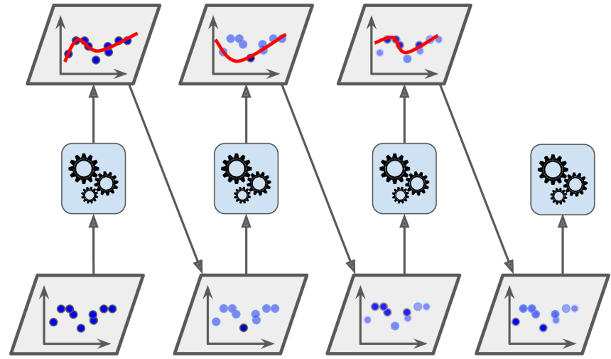

Om dit mogelijk te maken, zullen we moeten werken met gewichten:

* **Instance weight** $w^{(i)}$: dit is het gewicht van een sample. Als deze sample fout wordt geclassificeerd door een model, zullen we dit gewicht verhogen.
* **Predictor weight** $\alpha^{(i)}$: elk model krijgt ook een gewicht. Hoe accurater een model is, hoe hoger zijn gewicht zal zijn. Dit gewicht wordt dan gebruikt voor de berekening van de uiteindelijke voorspelling.

:birthday: hoera we moeten de formules niet kennen. We zullen de stappen in woorden beschrijven zonder enge tekens:

1. Initialiseer all instance weights
2. Train het model en bereken zijn gewogen error rate
3. Bereken de predictor weight
4. Werk de instance weights bij en normaliseer ze
5. Herhaal stappen 2-4 tot een bepaald aantal predictors of als het juiste resultaat is bereikt
6. Bereken de gewogen voorspelling van de modellen samen, rekening houdende met de predictor weights

### Gradient boost

Net als bij AdaBoost, trainen we een sequentie van modellen. Het verschil zit echter in het feit dat gradient boost niet elke ronde de instance weights zal bijwerken, maar zal proberen om de nieuwe predictor te fitten op de **residual error** gemaakt door de vorige predictor. De residual error is het verschil tussen de echte waarde en de voorspelde waarde. 

Als je deze samentelt, bekom je natuurlijk een waarde die dichter ligt bij de echte waarde. Dit wordt dan ook gedaan. 

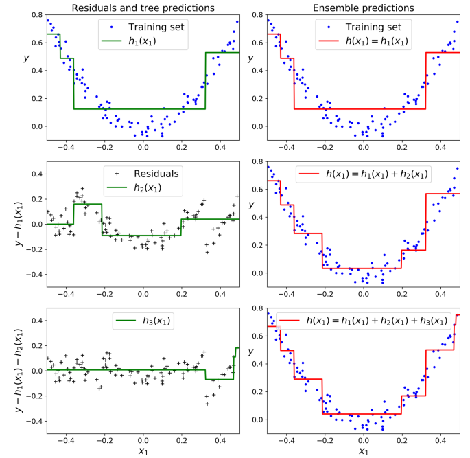

In het voorbeeld zie je links de voorspellingen van elk model apart. Rechts wordt in elke rij de uitkomst van de het huidige en de vorige modellen samengeteld tot een ensemble. Je ziet dat de derde (rechts onder) al een stuk beter presteert. 

Als we gradient boost willen gebruiken voor **classificatie**, zal onze residual error het verschil zijn tussen de voorspelde kans  voor het behoren tot een bepaalde klasse (tussen 0 en 1) en de effectieve waarde voor deze klasse (0 of 1). 

#### Link met gradient descent

Bij gradient descent berekenen we de afgeleide van de *loss*, rekening houdend met de parameters. Dit vertelt ons dan in welke richting we de parameters moeten aanpassen om de *loss* te verminderen. 

Bij gradient boost proberen we de voorspellingen van het vorige model aan te passen om de *loss* te verminderen. We berekenen dus ook de afgeleide van de *loss* functie, maar dan rekening houdend met met de output van het vorige model. Dit zegt ons dan hoe we de output moeten veranderen om de *loss* te verminderen. In essentie probeert het nieuwe model dus de gradiënt te schatten. 

#### Regularisatie

Gradient boosting kan ook weer gevoelig zijn aan overfitting. Hiervoor kunnen we ook weer een aantal dingen doen:

* **Shrinkage**: verminder de bijdrage van elk volgend model. Dit staat ook gekend als **learning rate** en zal ervoor zorgen dat we fouten niet te ver door modelleren. 
* Het aantal trees beperken
* Maximum diepte van trees
* Je kan de regularisatietechnieken van de onderliggende modellen gebruiken

## Stacking

Stacking staat voor stacked generalization en is gebaseerd op een simpel idee. In plaats van triviale functies zoals voting te gebruiken om modellen samen te voegen, trainen we een model om deze operatie uit te voeren. 

| 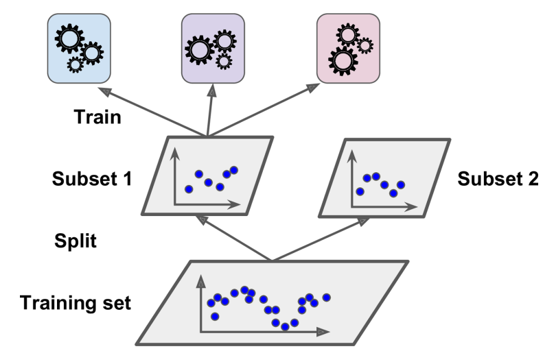 | 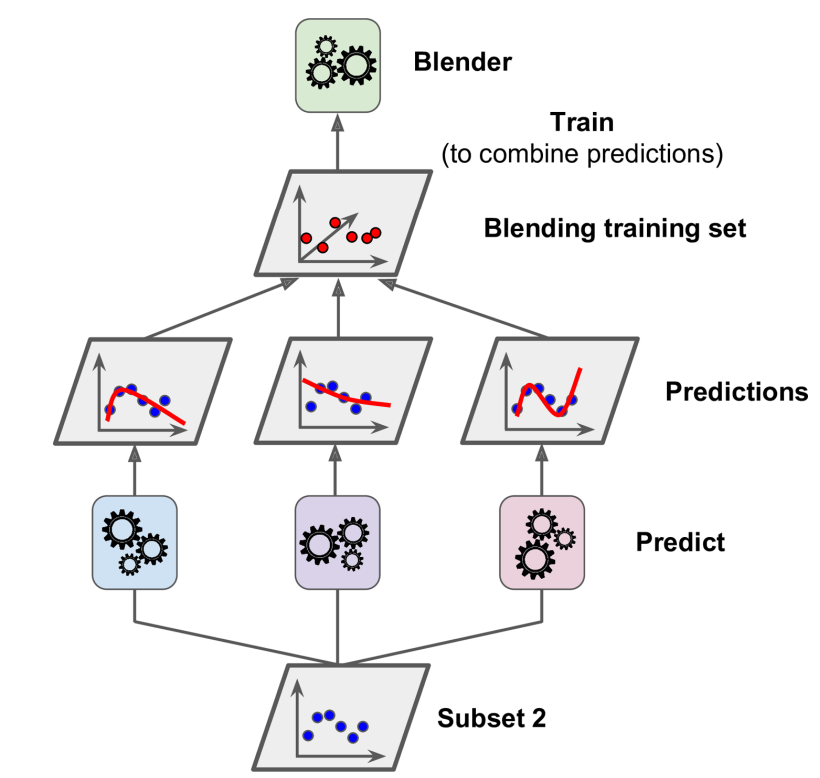 |
| ------------------------------------------------------------ | ------------------------------------------------------------ |

We splitsen de training set in twee. Op het eerste deel trainen we onze modellen. Op het tweede deel laten we de getrainde modellen voorspellingen maken, dit vormt deze set om tot een **blending data set**. Nu kunnen we een model, genaamd een **blender** trainen op deze voorspellingen. 

# 8 - Dimensionality reduction

Veel machine learning problemen gebruiken duizenden of zelfs miljoenen features voor elke training instance. Deze features vertragen niet alleen het trainen, maar kunnen het ook moeilijker maken om een goede oplossing te vinden. Dit probleem wordt vaak de **curse of dimensionality** genoemd.

Gelukkig kunnen we in de echte wereld vaak het aantal dimensies aanzienlijk verkleinen. Hoe? Dat zullen we zo meteen bespreken.

Een kleine voetnoot. Het verminderen van dimensionaliteit veroorzaakt wel enigszins verlies van informatie. Zelfs al zorgt het voor versnelde training, kan het dat je model wat minder goed presteert. In sommige gevallen kan het verminderen van dimensionaliteit de hoeveelheid ruis in je data verminderen, maar in de meeste gevallen zal dat niet zo zijn en zal enkel het trainen versneld worden. Probeer dus altijd eerst te trainen op de originele data. 

## Curse of Dimensionality

Als het aantal features toeneemt, groeit de hoeveelheid data die we nodig hebben om accurate voorspellingen te maken exponentieel. 

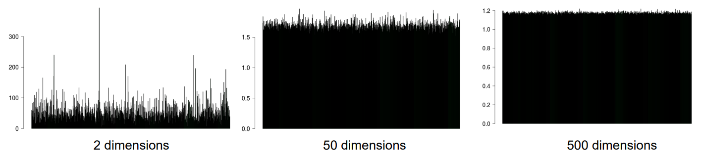

Hoe meer dimensies we hebben in onze data, hoe kleiner de verhouding tussen de afstand tot het dichtste en verste punt wordt. Afstand verliest zijn betekenis. 

Neem een hyperkubus in 2D (een vierkant dus) met zijde 1. Als we twee willekeurig punten in dit vierkant nemen, liggen ze gemiddeld 0.52 uit elkaar. In 3D bedraagt deze afstand 0,66. Gaan we naar 1000 000 dimensies, is deze afstand 408,25. Ookal is de zijde nog steeds één, is er gewoon meer ruimte in hogere dimensies, waardoor onze data schaarser wordt.

| 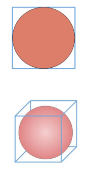 | 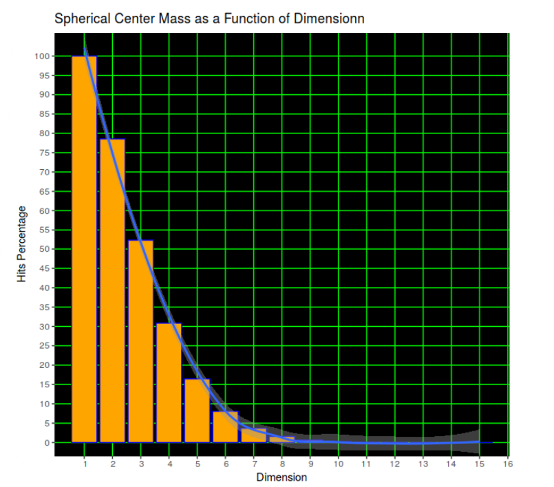 |
| ------------------------------------------------------------ | ------------------------------------------------------------ |

Als we een hyperbal in een hyperkubus steken, zal naarmate de hoeveelheid dimensies toeneemt, de massa van de bal in verhouding met die van de kubus exponentieel afnemen. 

## Manifold hypothesis

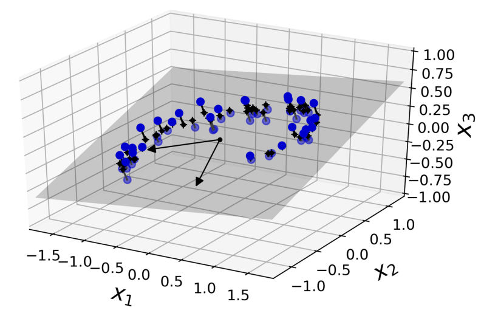

Bij problemen in de echte wereld liggen training instanties gelukkig **nooit** uniform verspreid overheen alle dimensies. De **manifold hypothese** vertelt ons dat we in onze ruimte van trainingsinstanties een soort subruimte (manifold) kunnen vinden die onze instanties bevat. 

Willen we dit nu toepassen, kan dat op twee manieren:

* **Feature selection**: We kiezen de nuttigste features
* **Feature projection**: We transformeren en projecteren om nieuwe features te bekomen
  * Principal component analysis: nieuwe features uit lineaire combinaties van de huidige features
  * Manifold Learning: uit niet-lineaire combinaties

## Linear dimensionality reduction

### Principal component analysis 

Het principe van principle component analysis is om een hypervlak van een lagere dimensie te vinden en onze data daarop te projecteren. Hoe vinden we nu zo'n vlak?

We doen dit door de **principle component** te zoeken. Dit is de richting van grootste variantie in onze data. Dan gaan we verder door een volgende principle component te zoeken, orthogonaal op de vorige. Al deze principle components samen vormen een hypervlak waarop we onze data kunnen projecteren, met een zo laag mogelijk verlies aan variantie.

| 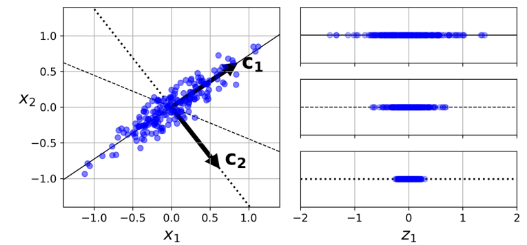 | 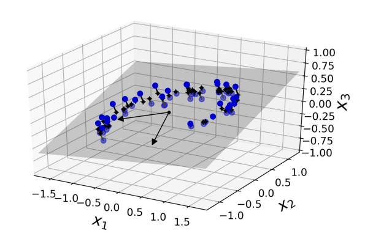 |
| ------------------------------------------------------------ | ------------------------------------------------------------ |

In de praktijk volgen we deze stappen:

* Centreer de dataset rond het gemiddelde
* Bereken de covariantiematrix $\mathbf C$ van de dataset
* Bereken de eigenvectoren en hun corresponderende eigenwaarden van de covariantiematrix
* Maak een $n \times d$ matrix $\mathbf W$ die de eigenvectoren bevat die overeenkomen met de $d$ grootste eigenwaarden van $\mathbf C$
  * De eigenvector met de grootste eigenwaarde is de eerste principal component
* Nu kunnen we $\mathbf W$ gebruiken om de samples naar de nieuwe subspace te transformeren
* We kunnen de data reconstrueren met de inverse van $\mathbf W$

## Non-linear dimensionality reduction

### Manifolds

Stel je de volgende situatie voor:

| 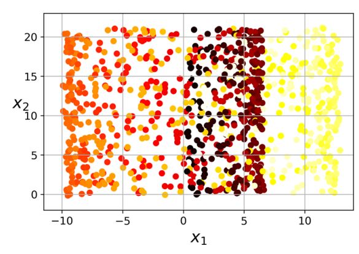 | 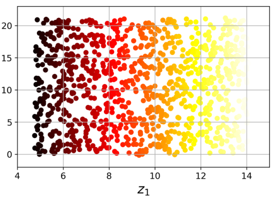 |
| ------------------------------------------------------------ | ------------------------------------------------------------ |
| Als we projecteren op het XY-vlak                            | Als we de rol "ontrollen".                                   |

Lineaire dimensionaliteitsreductie schiet hier duidelijk tekort. Er zijn een hele boel verschillende manieren om aan niet-lineaire dimensionaliteitsreductie te doen. Want meestal zal de oplossing niet zo duidelijk zijn als in dit voorbeeld. Met grid search kan je dan vinden welke manier het beste werkt. 

### Linear local embedding

We kunnen ook op een andere manier de dimensionaliteit van onze data reduceren. 

Het hoofdidee achter **linear local embedding** is om te proberen elk datapunt uit te drukken als een lineaire combinatie van zijn $k$ dichtstbijzijnde buren. Het algoritme vindt voor elk punt de $k$ dichtstbijzijnde buren en maakt daarvoor een matrix $\hat {\mathbf W}$. Deze bevat voor elk van de buren een gewicht zodat de lineaire combinatie van de buren met die gewichten het originele punt zo goed mogelijk benaderen. 

| 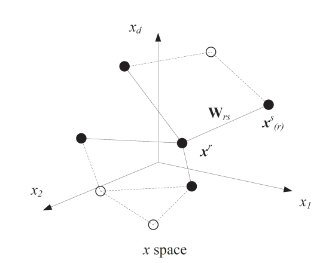 | 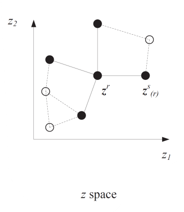 |
| ------------------------------------------------------------ | ------------------------------------------------------------ |
| $\hat{\mathbf W} = \underset{\mathbf W}{\mathrm{argmin}} \sum_{i=1}^m \left( \mathbf x^{(i)} - \sum_{j=1}^m w_{i,j} \mathbf x^{(j)} \right)^2 \\ \text{onderhevig aan: } \begin{cases} w_{i,j = 0}  &\text{ als } \mathbf x^{(j)} \text{ geen van de} \text{ knn is van } \mathbf x^{(i)}\\ \sum_{j=1}^m w_{i,j} = 1 &\text{ voor } i = 1,2, \dots,m \end{cases}$ | $\mathbf{\hat Z} = \underset{\mathbf Z}{\mathrm{argmin}} \sum_{i=1}^m \left( \mathbf z^{(i)} - \sum_{j=1}^m \hat w_{i,j} \mathbf z^{(j)} \right)^2$ |

Nu proberen we alle punten te projecteren naar een lager dimensie, resulterend in een punt $\mathbf z^{(i)}$. Dan minimaliseren we de afstand tussen dit punt en de lineaire combinatie gebruik makende van de gewichten van daarnet met zijn buren in deze ruimte van lagere dimensie. 

Als resultaat krijgen we een projectie die voor elk punt de afstanden tot zijn buren zo goed mogelijk bewaart.

### Kernelized PCA

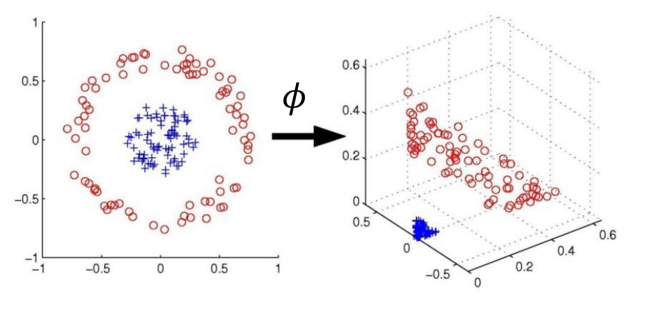

We transformeren eerst onze data naar een hogere dimensie met een transformatiefunctie genaamd de **kernel**. In deze nieuwe ruimte doen we dan PCA. Door de transformatiefunctie goed te kiezen (kernel trick), kunnen we dit grote probleem toch nog net oplossen. Deze methode vergt dus vrij veel rekenkracht.

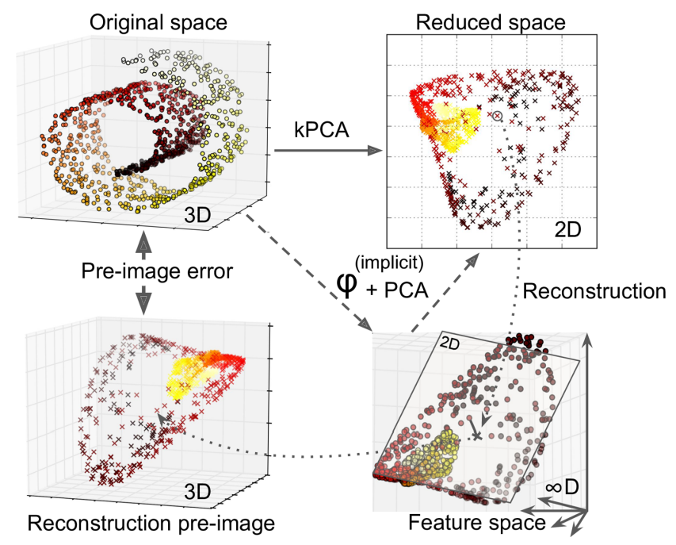

//TODO pre image error

# 9 - Unsupervised learning

## Clustering

Clustering is een techniek die valt onder unsupervised learning omdat er geen *ground truth* is om te evalueren hoe goed je clustering algoritme is. Het doel is om groepen van gelijkaardige instanties te vinden en deze een clusternummer te geven. 

Dit is nuttig om bijvoorbeeld de gelijkaardigheid tussen liedjes op Spotify te vinden. Clustering kan ook gebruikt worden voor data-analyse of anomaly detection. 

### K-means clustering

Het K-means clustering algoritme werk als volgt:

* Kies een getal $k$, dit is het aantal clusters
* Kies $k$ willekeurige punten als cluster centers: $C^{(1)}, \dots ,C^{(k)}$
* Herhaal
  * Wijs elk punt $\mathbf x^{(i)}$ toe aan het dichtstbijzijnde cluster center
  * $b^{(i,j)} = \begin{cases} 1 \text{ als } j =\underset{k}{\mathrm{argmin}} \sum_{l=1}^n(x_l^{(i)} - C_l^{(k)})^2 \\0  \end{cases}$
  * Bereken het nieuwe centrum van elke cluster
  * $C_\text{new}^{(k)} = \frac{\sum_{i=1}^m b^{(i,k)} \mathbf x^{(i)}}{\sum_{i=1}^m b^{(i,k)}}$
  * Stop wanneer het resultaat convergeert of als je tevreden bent

Belangrijk om te weten is dat het resultaat niet altijd convergeert naar een globaal minimum, we kunnen ook vastraken in een lokaal minimum. Of dit al dan niet zo zal zijn hangt af van de keuze van de initiële clustercentra. 

De toewijzing van een punt tot een cluster wordt volledig gebaseerd op zijn afstand tot het clustercentrum.

#### Aantal clusters

Hoe weten we nu wat het optimale aantal clusters is voor onze data?

We proberen gewoon voor een aantal verschillende $k$-waarden het algoritme uit en vergelijken de resultaten aan de hand van een elbow plot.

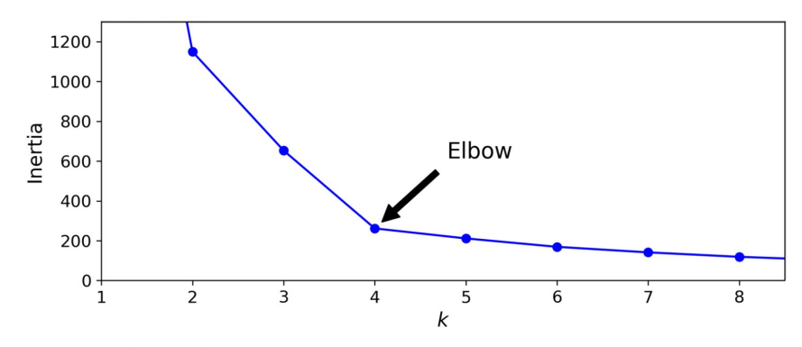

We berekenen voor elk punt de afstand tot zijn dichtstbijzijnde clustercentrum en nemen daar het gemiddelde van:
$$
\frac 1 m \sum_{i=1}^m \min_C \lVert \mathbf x^{(i)} - C^j \rVert^2
$$
Dit noemen we de **inertia** van ons clusteringresultaat. Als we al deze inertias op een grafiek zetten krijgen we het resultaat hierboven. Het buigpunt (elbow) van deze curve zal typisch de best $k$ geven, want hoe hoger we $k$ nemen, hoe groter de kans op overfitting.

#### Silhouette score 

Een andere manier om de prestatie van k-means clustering te kwantificeren is door middel van een **silhouette score**.

Neem:

* $a^{(i)}$: de gemiddelde afstand van een punt tot alle andere punten in dezelfde cluster
* $b^{(i)}$: gemiddelde afstand van een punt tot alle waarden in de volgende dichtstbijzijnde cluster
* $s^{(i)} = \frac{b^{(i)} - a^{(i)}}{\max \{a^{(i)}, b^{(i)} \}}$: de silhouette score

Deze score zal hoog zijn als punten binnen een cluster dicht bij elkaar liggen en punten van verschillende clusters ver uit elkaar liggen. Als de silhouette score van een punt negatief is, dan ligt hij dichter bij een andere cluster dan bij zijn eigen cluster.

#### Silhouette plot

In de volgende plots geeft de rode lijn de gemiddelde silhouette score aan voor de gekozen $k$. De gekleurde vormen stellen de silhouette score voor elk individueel punt voor, gegroepeerd per cluster. 

| 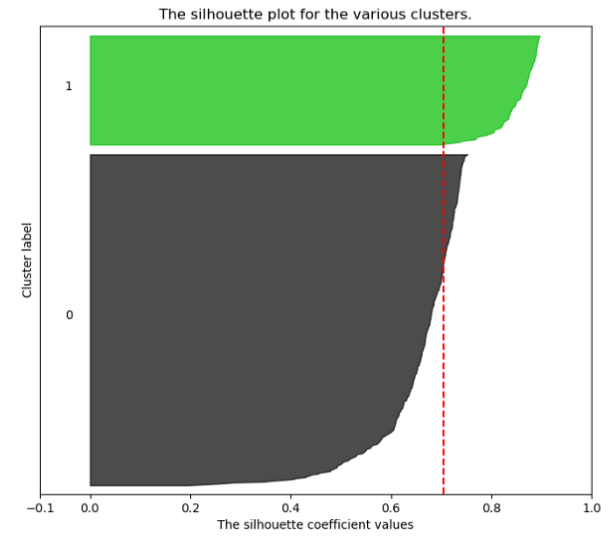 | 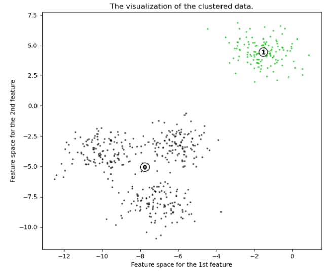 |
| ------------------------------------------------------------ | ------------------------------------------------------------ |
| 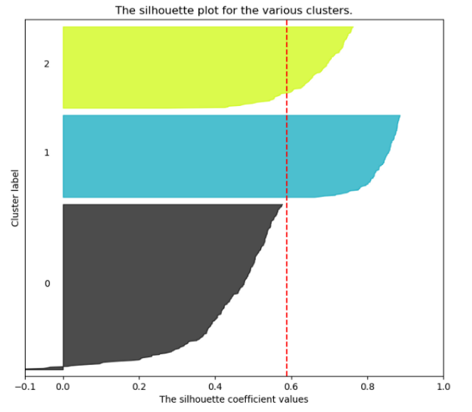 | 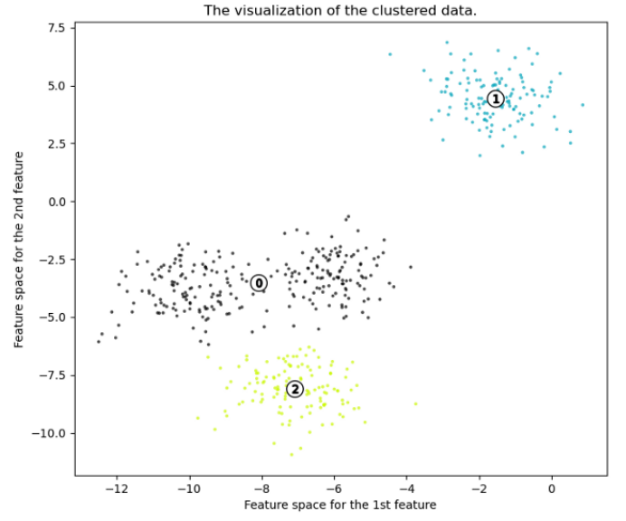 |
| 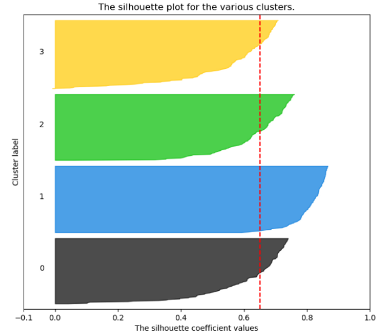 | 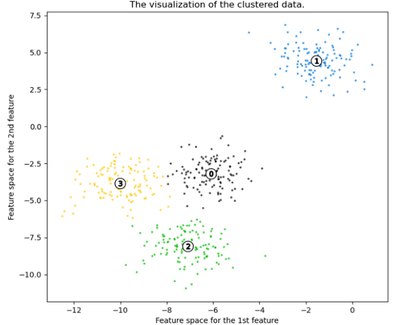 |
| 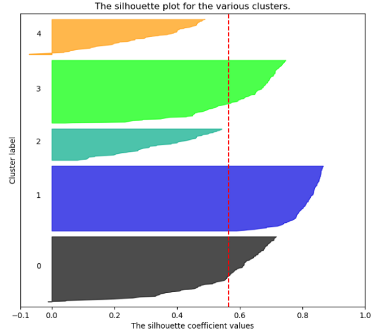 | 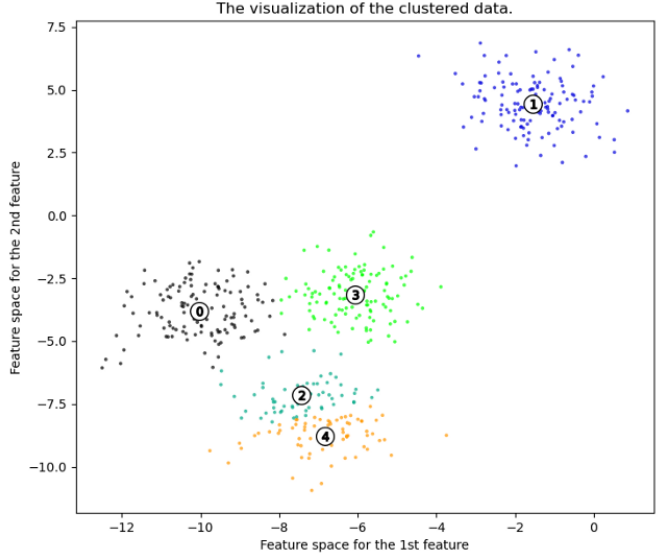 |

In deze plots willen we voor elke cluster liefst zo veel mogelijk waarden in de buurt van ons gemiddelde. 

#### Centroid initialization

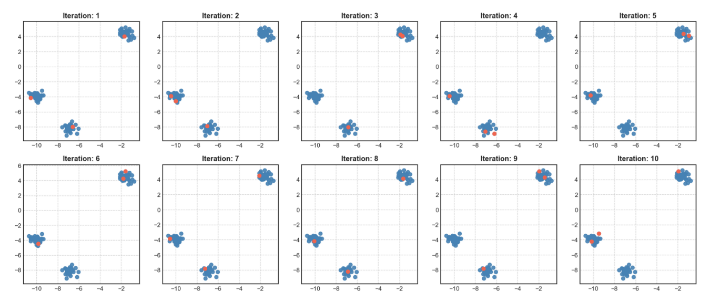

Bij het initialiseren van het algoritme worden willekeurige clustercentrums gekozen. Dit plaatje toont redelijk duidelijk dat dit ervoor kan zorgen dat je clustering op niks trekt doordat hij in een lokaal minimum blijft vastzitten of dat het erg lang duurt om tot het globale minimum te raken. 

Een andere manier is om alle punten initieel willekeurige clusternummers te geven en dan te vertrekken van de clustercentrums van deze willekeurige clusters, maar deze methode blijkt meestal pure schijt op te leveren.

De beste manier is de kmeans++ methode. Deze methode begint ook met een random punt, maar de volgende punten zullen volgens een bepaalde distributie gekozen worden, rekening houdend met de afstand tot de al gekozen punten. Zo liggen de initiële centrums niet te dicht bij elkaar.

#### Nadelen

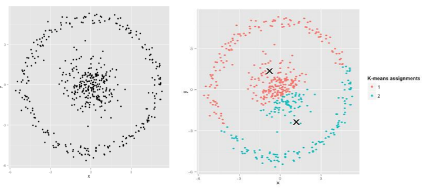

* K-means werkt het best voor **cirkelvormige** clusters. 
* Je moet altijd je data standaardiseren voordat je k-means toepast.
* K-means kan moeilijk omgaan met verschillen in densiteit
* De variantie van features moet gelijkaardig zijn voor alle clusters
* K-means kan moeilijk omgaan met clusters van verschillende grootte (aantal items)
* In hogere dimensies heeft afstand ook minder betekenis 

### DBScan

Een cluster is een continu gebied in de ruimte met hoge densiteit, gescheiden van andere clusters door continue gebieden met lage densiteit. DBScan (Density-Based Spatial Clustering of Applications with Noise) pakt clustering op een andere manier aan gebruik makende van deze eigenschap:

* Een **dense point** is een punt met ten minste `minPts` aantal andere punten binnen een afstand $\epsilon$
* Het algoritme verloopt als volgt:
  * Neem een willekeurig punt $p$
  * Initialiseer een nieuwe cluster op dit punt
    * Als $p$ niet dense is veronderstel je dat hij ruis is
    * Als $p$ dense is
      * Voeg alle punten dichter dan $\epsilon$ toe aan de cluster
      * En voeg voor alle punten die je net hebt toegevoegd recursief hun buren dichter dan $\epsilon$ toe aan de cluster tot je niet meer verder kan
  * Nu neem je opnieuw een willekeurig punt en je begint opnieuw

* <u>Voordelen</u>
  * We moeten niet handmatig het aantal clusters kiezen
  * Kan omgaan met clusters van eender welke vorm
  * Werkt goed als clusters dense genoeg zijn er ver genoeg liggen van andere clusters
* <u>Nadelen</u>
  * Niet deterministisch (maar dat maakt niet zo veel uit in de praktijk)
  * Gebruikt een afstandsmetriek
    * Pas op met scaling
    * Curse of dimensionality
  * Het is moeilijk om de juiste hyperparameters ($\epsilon$, `minPts`) te kiezen als we te maken hebben met regio's met verschillende densiteit

### Hierarchical clustering

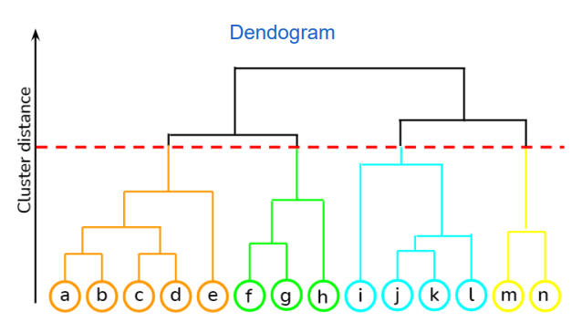

We kunnen ook vertrekken door alle punten in één cluster te steken en deze cluster in twee te delen. De resulterende clusters delen we opnieuw in twee. Dit is een **top-down** benadering van hiërarchisch clusteren, oftewel divisive clustering.

Zoals je misschien al het zien aankomen, kunnen we ook **bottom-up** werken, door eerst alle elementen hun eigen cluster te geven en in elke iteratiestap nabije clusters samen te voegen. Dit is ook wel gekend als agglomerative clustering. 

In de afbeelding geeft de rode stippelijn aan waar we "gestopt" zijn. De resulterende clusters worden aangeduid door de plaats waar de lijn de grafiek snijdt.

Voor beide wijzes van aanpak hebben we nood aan een bepaalde metriek om de afstand tussen clusters te bepalen. Dit kan bijvoorbeeld op deze drie manieren:

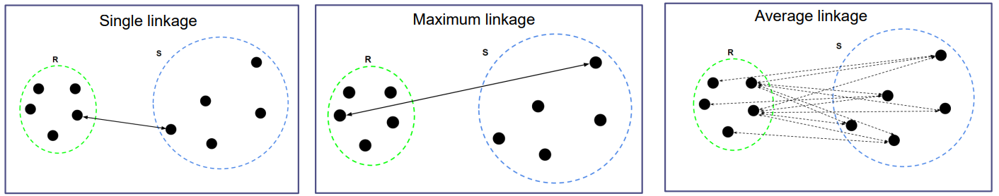

## Gaussian mixture models

//TODO

# 10 - Introduction to deep neural networks

## History

### 1st wave: Perceptron

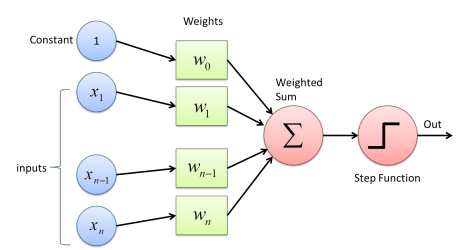

De eerste poging tot het maken van een neuraal netwerk deed zich voor in de fifties. Geïnspireerd op neuronen in een brein, gebruikte deze methode een simpele methode om bij te leren. 
$$
w_{i,j}^\text{(next)} = w_{i,j} + \eta(y_j - \hat y_j)x_i
$$
Met: 

* $w_{i,j}$: het gewicht 
* $\eta$: de learning rate
* $y_j - \hat y_j$: het verschil tussen de target en de voorspelling

Elke iteratie zal het gewicht dus een beetje meer in de juiste richting gaan. Omdat een perceptron maar één laag heeft, zal hij alleen maar lineaire relaties kunnen modelleren. In essentie doet dit hetzelfde als lineaire of logistic regression. 

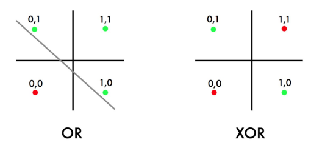

De interesse in perceptrons nam snel af in de sixties omdat ze toch niet zo ongelofelijk goed bleken te zijn. 

### 2nd wave: Distributed representations

In de 80s en 90s kreeg **connectionism** meer populariteit. Het idee hier achter is om het systeem voor te stellen door veel features die elk meerdere inputs beïnvloeden. Er werden ook meerdere lagen toegevoegd, gebruik makende van **backpropagation**. Dit zorgde ervoor dat ook niet-lineaire problemen gemodelleerd konden worden. Uiteindelijk werkten de neurale netwerken toch weer niet zo goed en werden ze vergeten. 

### 3rd wave: Deep learning

Vanaf 2010 begonnen neurale netwerken het ineens heel goed te doen. Dit kwam door twee redenen:

* Veel grotere training datasets 
* Snellere GPU's (SIMD)

## Deep neural networks

De term **deep** slaat op het feit dat het model ook leert om de features uit ruwe informatie te halen, zonder dat dit hand matig gedaan moet worden. 

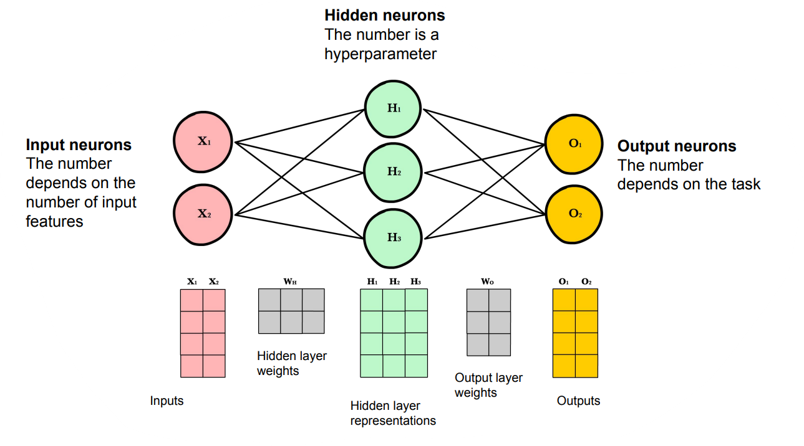

Een neuraal netwerk bestaat uit:

* Input neurons
* Hidden neurons
* Output neurons
  * Bij regressie kan dit bijvoorbeeld 1 neuron zijn, omdat we maar één waarde willen voorspellen
  * Voor classificatie nemen we typisch evenveel neurons als klassen

Elke laag is op een bepaalde manier verbonden met de volgende laag (hoe precies zullen we later bespreken). Elk van deze verbindingen krijgt een bepaald gewicht. Deze gewichten vormen dan samen met de inputs een lineaire combinatie die bepaalt of de volgende neuron geactiveerd zal worden. 

We voegen na elke laag een **niet-lineaire activatiefunctie** toe die het netwerk toestaat om ook niet-lineaire relaties te modelleren. 

Hiervoor zijn een aantal opties:

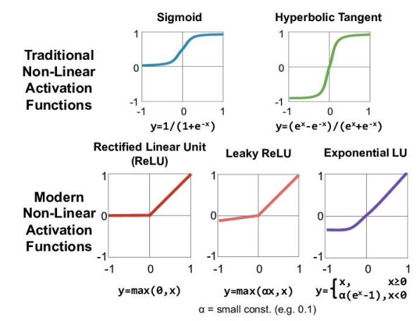

De populairste is ReLU. Hij is simpel, efficiënt en presteert om de één of andere reden zeer goed.

### Training

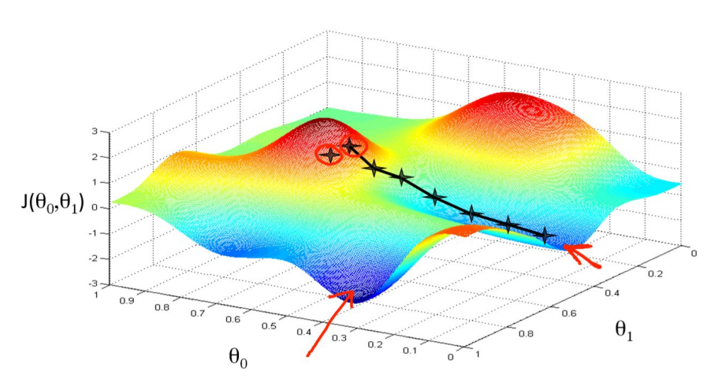

Er is geen closed form oplossing voor dit optimalisatieprobleem. Daarom gebruiken we in de plaats een iteratief **gradient descent** algoritme. 

* We starten van willekeurige initiële parameters
  * We berekenen de loss van het model op een aantal inputs
* Dan gebruiken we de gradiënt om een nieuwe set (hopelijk betere) parameters te berekenen
* Het is een **niet-convex** optimalisatieprobleem, dus er is geen garantie dat we ooit het globale minimum zullen vinden
  * Toch werkt het heel goed in de praktijk, want uiteindelijk maakt het niet super veel uit of we in een lokaal of globaal minimum zitten

### Backpropagation

Oké, we hebben nu gezien wat gradient decent is en hoe een neuraal netwerk ongeveer werkt, maar hoe moeten we nu de gewichten van ons model aanpassen?

Het principe van **backpropagation** is om een fout achterwaarts terug te laten propageren door een neuraal netwerk. Dit kunnen we door middel van de kettingregel:

* Een neuraal netwerk is een geneste functie $f_1(f_2(f_3(f_4(x))))$
* We gebruiken de kettingregel om de afgeleide van de cost functie te berekenen
  * Rekening houdend met de output en gewichten van elke laag
  * Hiermee berekenen we de gradient van de cost function
  * En kunnen we onze gewichten aanpassen in de richting van de negatieve gradient (en dus dalen)

De algemene voorwaarde van backpropagation is dat zowel het model als de loss functie **volledig afleidbaar** moeten zijn.

### Regressie

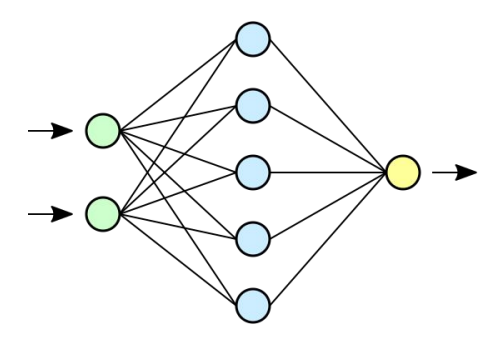

We kunnen neurale netwerken (zoals eerder vermeld) ook gebruiken voor regressie.

* Typisch **één output neuron** (voor regressie met meerdere variabelen gebruiken we er natuurlijk meer)
  * Kan zonder activatiefunctie
  * Sigmoid of tanh activatiefunctie
* Let op scaling!
* Loss functie
  * Typisch mean-squared error 
  * Mean-absolute error (als je veel outliers hebt)

### Classificatie

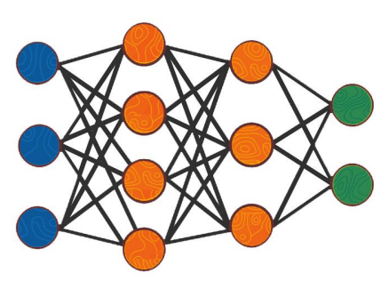

* Typisch meerdere output neurons (evenveel als klassen)
* One-hot encoding
  * Eén attribuut per categorie
  * Waarde 1 als de instantie in de categorie hoort 
  * Anders 0
* Loss-functie
  * Cross-entropy loss
* Een neuraal netwerk met één laag is hetzelfde als softmax regression

### Autoencoder

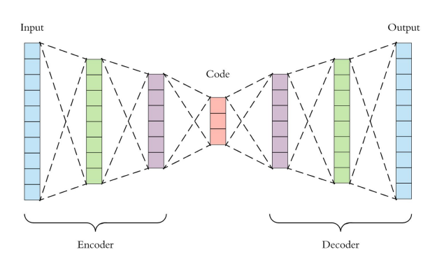

We kunnen neurale netwerken ook gebruiken voor dimensionaliteitsreductie. Hiervoor gebruiken we een **autoencoder**. Dit is een model dat we trainen om zijn eigen input te reconstrueren. Klinkt simpel genoeg. Het coole deel zit in het midden. Door hier een **bottleneck** laag te plaatsen, forceren we eigenlijk het model om de input te comprimeren naar een lagere dimensie, waarna het model vervolgens moet proberen om de input terug voor te stellen vanuit deze verminderde voorstelling. 

Als we dan het decoder-gedeelte weghalen, hebben we een netwerk dat de dimensionaliteit van onze data kan reduceren. 

Autoencoders hebben dus meerdere praktische toepassingen:

* Dimensionaliteitsreductie
* Anomaly detection: we kunnen de reconstructiefout gebruiken als metriek om te bepalen of een waarde 'normaal' is
* Unsupervised pre-training 

### Hyperparameters

Hier een opsomming van de hyperparameters die we dus zelf zullen moeten afstellen:

* Aantal lagen
* Aantal neuronen per laag
* Activatiefuncties
* Learning rate en batch size
* Trainingsalgoritme en loss functie
* Initialisatie van de parameters
* Noise en data augmentatie
* Regularisatie

# 11 - Training deep neural networks

Het trainen van diepe neurale netwerken ligt niet voor de hand. We hebben een groot aantal parameters, waardoor we grote hoeveelheden data nodig hebben. Het model is een complexe geneste functie, waardoor we te maken krijgen met een niet-convex optimalisatieprobleem. En dan hebben we nog niet gesproken over overfitting. 

## Vanishing / exploding gradients

Als we meerdere lagen achter elkaar een sigmoid activatiefunctie gebruiken, zal naarmate we dieper in ons netwerk afzakken, de gradiënt steeds kleiner worden. Dit fenomeen noemt men *vanishing gradients*. Het omgekeerde is ook mogelijk. De gradiënten worden zo groot dat het correct updaten van gewichten bijna onmogelijk. Dit staat dan bekend als *exploding gradients*.

We bespreken drie mogelijke oplossingen voor dit probleem

### 1: Weight initialization

De verdeling van de initiële gewichten van een model heeft een grote impact op de training van het model. Een veelvoorkomende strategie is om samples te nemen uit de normale verdeling. Het kiezen van de juiste initialisatietechniek is natte-vinger-werk. 

### 2: Activation functions

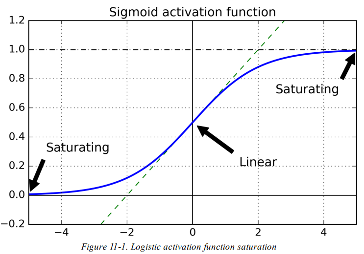

De sigmoid activatiefunctie is niet altijd de beste oplossing omdat hij **saturerend** is. Een beter optie is ReLU (Rectified linear units), maar deze functie lijdt soms aan **dying neurons**. Hier blijven neurons 0 outputten en worden ze niet meer geupdate. Om dit probleem tegen te gaan kunnen we gebruik maken van Leaky ReLU of één van de andere opties in het plaatje. 

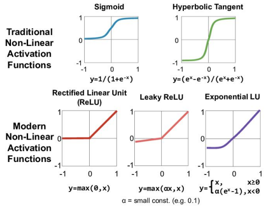

### 3: Batchnorm

Een andere manier om de training van ons model te verbeteren is **batchnorm**, kort voor batch normalization. We normaliseren de activaties door de gemiddelde activatie per batch er van af te trekken en ze te delen door de standaardafwijking van de batch tijdens het trainen.

Omdat het gemiddelde en de standaardafwijking veranderen tijdens het trainen, wat kan leiden tot destabilisatie van het model, houdt het algoritme een **moving average** bij tijdens het trainen. Deze worden dan gebruikt bij inference (want dan hebben we geen gemiddelde en standaardafwijking, maar we hebben ze wel nodig).

We weten eigenlijk niet echt waarom dit zo goed werkt.  

## Optimization algorithms

Er zijn nog een aantal dingen die we kunnen doen om het trainen van ons model te optimaliseren:

* **Momentum**
  * We gebruiken vorige gradiënten om bij te houden in welke 'richting' we bewegen
  * Hierdoor kunnen we soms sneller convergeren
  * De nieuwe richting is dan een gewogen som van de gradiënt $\nabla_\theta J (\theta)$ en de momentum vector $m$
    * $m \leftarrow \beta m − \eta\nabla_\theta J (\theta)$
      * Het momentum $\beta$ is dan typisch 0.9
    * $\theta \leftarrow \theta + m$
* **Adaptive learning rate**
  * Er zijn een aantal algoritmes die de learning rate verschillend aanpassen
* **Second order methods**
  * Gebruiken partiële afgeleiden van de tweede orde om de buiging rond een punt te schatten
  * Zijn duur om te gebruiken

## Learning rate scheduling

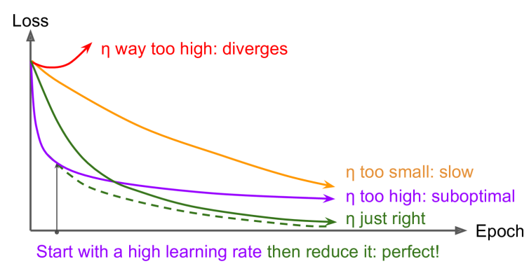

De learning rate is meestal de belangrijkste parameter die je moet afstellen. Als deze te hoog is zal het model niet convergeren. Als hij te laag is kan het dat het heel lang duurt om te convergeren of dat we vastraken in een lokaal minimum.

We beginnen best met een hoge learning rate, die we gradueel doen afnemen met:

* Power scheduling
* Exponential scheduling
* Piecewise constant

## Regularization

Door hun miljoenen parameters zijn neurale netwerken vaak gevoelig aan overfitting. We hebben nood aan regularisatie. 

* Meer training data gebruiken
* Data augmentation en randomness toevoegen
* $L_1$ en $L_2$ regularisatie
* **Dropout**
  * Zet een willekeurige subset van de activaties op nul
  * Dit maakt het model robuuster
  * En forceert elke neuron om onafhankelijker te zijn
  * Bij inferentie worden alle neuronen terug gebruikt, maar worden ze geschaald door de factor die werd gebruikt tijdens het trainen. 

## Normalization

Het is meestal een goed idee om je data te normaliseren voordat je hem in een model steekt. 

Dit kan op meerdere manieren:

* Min-max normalisatie: schalen naar $[0,1]$
* Zero-center: het gemiddelde ervan aftrekken
* Standaardiseren: gemiddelde aftrekken, delen door $\sigma$

Voor afbeeldingen kan je

* Gemiddelde afbeelding ervan aftrekken
* Gemiddelde RGB waarde aftrekken
* Gemiddelde RGB waarde aftrekken en delen door standaardafwijking

## Hyper parameter tuning

Als je alles handmatig doet, noemt men dit ook wel **grad student descent**. 

Een goede algemene aanpak:

* Neem een simpel model zonder regularisatie
* Doe een sanity check voor de loss (is deze wat je zou verwachten)
* Overfit op een klein deel van de dataset
  * Probeer verschillende modellen
  * Probeer verschillende learning rates
* Train de meest veelbelovende modellen op de volledige dataset voor een aantal epochs, met verschillende optimizers
* Pas regularisatie toe en train op de volledige dataset 

# 14 - CNN

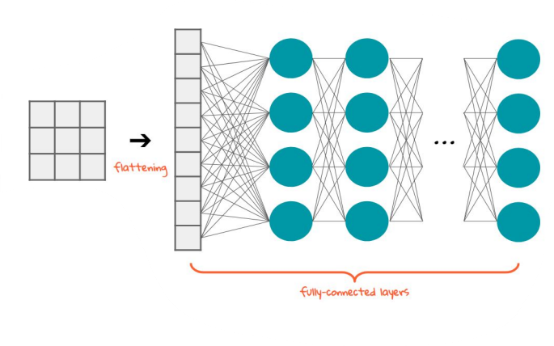

De fully connected neurale netwerken die we tot nu toe behandeld hebben verwachten altijd een 1D input. Als we nu een input van een hogere dimensie hebben, zullen we deze moeten *flattenen* naar 1D. Hierdoor zal wel wat informatie verloren gaan, aangzien het model niet meer precies zal weten welke pixels bij elkaar in de buurt lagen. 

* Het model zal dus zelf moeten leren leren dat sommige inputs gerelateerd zijn.
* Bovendien zal deze methode resulteren in een gigantisch aantal verbindingen. 

CNN's trachten deze problemen op te lossen. 

## Convolutional neural networks

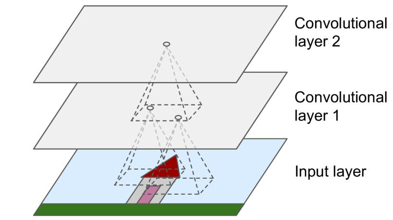

Convolutionele neurale netwerken zijn gebaseerd op de structuur van de visuele cortex van een brein. 

De 2D structuur van de input wordt behouden en de neuronen in een **convolutional layer** worden in een 2D structuur geordend. 

* Elke neuron heeft verbindingen naar een klein vlak in de vorige laag
  * Hij is dus alleen gevoelig voor dat gebied
  * Dit is de **receptive field**
* Een CNN volgt een **hiërarchische structuur**
  * De eerste lagen focussen op kleine, low-level features
  * De diepere lagen brengen deze samen in high level features
* **Weight reuse**
  * Alle neuronen in dezelfde laag gebruiken dezelfde gewichten
  * Deze gewichten vormen dan een filter (**kernel**) die de input overloopt

De kernel is dus een vierkantje (van bijvoorbeeld 3x3) dat we over onze afbeelding gaan schuiven. 

* We schuiven hem altijd een bepaalde hoeveelheid op
  * Dit heet de **stride**, deze is 2 in het plaatje.
* Door de input dan met de kernel te **convolueren**, krijgen we 
  * Een **feature map**, een gefilterde versie van de afbeelding
  * Zo kunnen we in de afbeelding bepaalde gebieden detecteren
    * Horizontale of verticale lijnen
    * Kleurovergangen
* Elke laag gebuikt $N$ verschillende filters
  * Dit resulteert dus in $N$ feature maps voor elke laag
  * 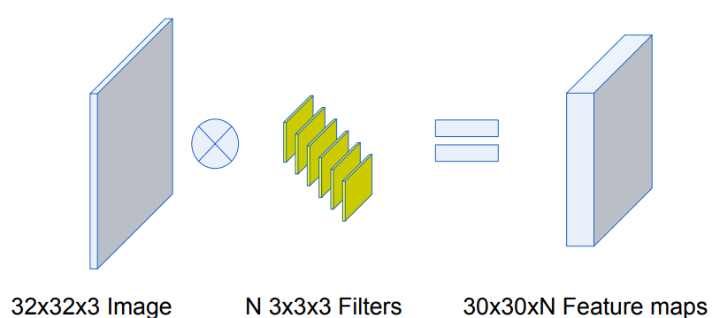 
* De gewichten van de filters worden geleerd met gradient descent

Vervolgens stapelen we meerdere lagen met meerdere feature maps op elkaar, met telkens een niet-lineaire activatiefunctie er tussen. Elke laag aggregeert informatie van de vorige lagen. Naarmate je dieper in het model gaat zal de **receptive field** steeds groter worden. 

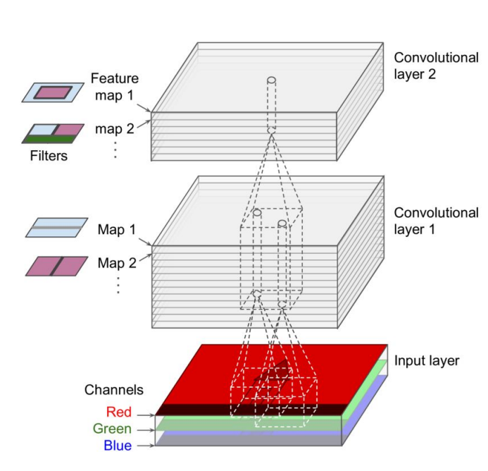

### Output size

Soms kan het dat door de grootte van de kernel en de stride, sommige waarden (aan de rand bijvoorbeeld) worden genegeerd. Dit kan opgelost worden met **zero padding**. 

* Het aantal dimensies van de output

//TODO

# 15 - RNN

# 17 - Representation learning / Generative models

Als we proberen om goede feature descriptions uit data te halen zonder deze manueel te definiëren, spreken we over **representation learning**. Dit doen neurale netwerken typisch. Autoencoders kunnen gebruikt worden om dit unsupervised te doen. 

**Generative modelling** wordt gebruikt om realistische samples te genereren. In dit hoofdstuk zullen we zien hoe we beide kunnen doen aan de hand van autoencoders en Generative Adverserial Networks. 

## Autoencoders

Zoals al eerder besproken, bestaat een autoencoder uit twee delen:

* Encoder
  * Deze transformeert de input naar een **latent space representation**
  * Dit is een abstracte multidimensionale representatie van de features
* Decoder
  * Gebruikt deze representatie om de input te reconstrueren

Ze kunnen beide fully connected, convolutional of recurrent lagen gebruiken en worden getraind met gradient descent. 

Autoencoders kunnen gebruikt worden voor dimensionaliteitsreductie, pre-training en anomaly detection. 

### Denoising autoencoder

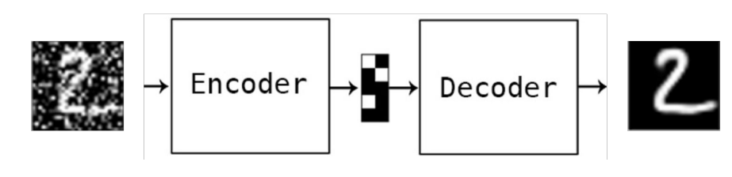

Door willekeurige noise toe te voegen aan de inputs tijdens het trainen, kunnen we het model te trainen om de originele input te vinden. Dit kans ons helpen om goede high-level features te vinden, of om ruis uit afbeeldingen te halen. 

### Variational autoencoders

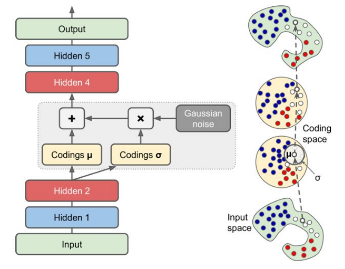

In plaats van rechtstreeks een encodering te maken voor een gegeven input, maakt de encoder een *mean coding* $\pmb \mu$ en een standaardafwijking $\pmb \sigma$. We nemen een willekeurige sample uit deze distributie, die dan aan de decoder gegeven wordt. 

Wanneer het model getraind is, kunnen we dus gemakkelijk nieuwe instanties genereren door ruis te voeren aan de decoder. 

Het model wordt getraind met twee loss functies:

* Reconstruction loss (bv. MSE)
* Latent loss
  * Forceert het model om encoderingen terug te geven die eruitzien alsof ze uit een Gaussiaanse verdeling gesampled waren 

VAEs stimuleren het 'ontrafelen' van onderliggende factoren. Eén dimensie van de latent code kan dan één onderliggende eigenschap voorstellen (lijn dikte, hoek, ...). Deze ontrafeling is nuttig om high level informatie uit je input te halen. 

Variational autoencoders waren een tijdje heel erg populair, maar ze zijn ingehaalde door Generative Adverserial Networks, dit in staat zijn tot veel betere resultaten.

## Generative adverserial models

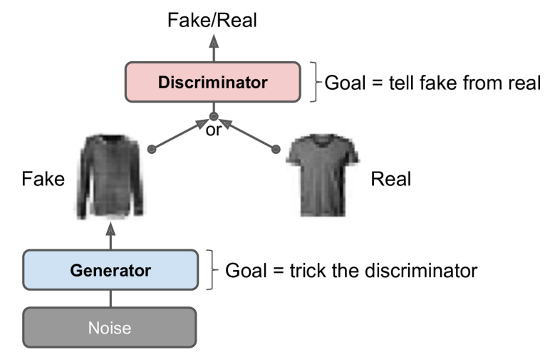

We trainen twee neurale netwerken door ze tegen elkaar op te zetten:

* **Generator**
  * Genereert een sample vanuit ruis, met als doel de discriminator te foppen
  * Ziet nooit echte samples
  * Gebruikt **generator loss** als loss functie, deze zal laag zijn als de discriminator het verschil **niet** kan zien
* **Discriminator**:
  * Probeert de het verschil te zien tussen echt samples en gegenereerde samples
  * Gebruikt **discriminator loss**, zal laag zijn als hij het verschil kan zien

Tijdens het trainen proberen de generator en de discriminator dus constant elkaar te slim af te zijn. Dit resulteert wel in een zeer complex optimalisatieprobleem en is dus zeer gevoelig aan de instellingen van de hyperparameters. Het kan dat we te maken krijgen met **mode collapse**, dit doet zich voor als de outputs van de generator steeds minder divers worden. Als de generator bijvoorbeeld merkt dat de discriminator het moeilijk heeft met schoenen herkennen, kan het dat hij alleen nog maar schoenen genereert. 

## Diffusion models

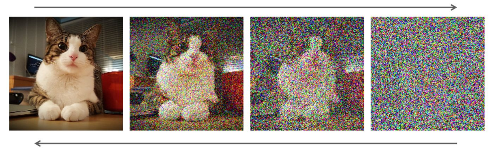

We voegen een klein beetje ruis toe aan onze data en trainen een model om deze ruis te verwijderen. Als we zo meerdere modellen achter elkaar zetten kunnen we zelfs modellen maken die ruis omzetten tot een overtuigend resultaat.

# Examenvragen

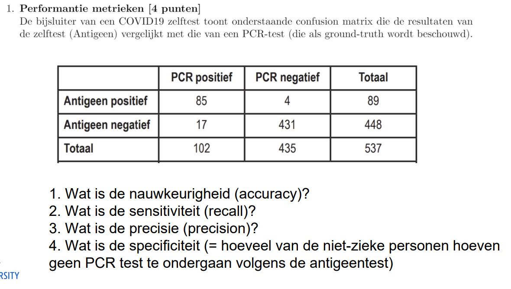

## Vragen uit de slides

### Training models

> What is (linear) regression ? 

> How is a linear regression model parameterized ? How does it make a prediction ? 

> How do we obtain the optimal parameters for a linear regression model. 

> What is gradient descent ? 

> What is a convex function ? 

> What is polynomial regression ? How does it relate to linear regression ? When is polynomial regression useful? 

> What is bias and variance, what is the relationship between them ? 

> What is regularization ? What is Ridge regression, LASSO and elastic net ? What are the benefits ? 

> What is logistic regression ? How is it parameterized ? How does it make a prediction ? How is it trained ? 

> What is softmax regression ? How is it parameterized ? How does it make a prediction ? How is it trained ? 

> What is cross entropy ?

### SVM

> Why is it called support vector machine?

Support Vectors

> What if my data is not linearly separable? 

Kernel trick 

> How to find the best value for hyperparameter C? 

Hyperparameter search with cross-validation

> How to extend to more than 2 classes?

Multiclass classification

> Principle of (linear) SVM

> General structure of the objective function

> Difference between hard and soft margin classification

> Role of slack variables in soft margin classification

> What is the role of the hyperparameter in SVM?

> Why do we need to apply feature scaling in SVM?

## Vragen uit het boek

