# Systeembeheer

## Course specifications

* Final grade calculation 
  * 50% on exam 
  * 50% on end-result labs 
* Individual scores (exam / labs) minimally 9/20 
  * Otherwise score maximum 9/20

* Final competences 
  * Being able to configure Windows Server systems and manage them by means of Powershell 
  * Being able to manage and configure file systems (local / cloud) 
  * Knowledge of IaaS, PaaS, SaaS, FaaS and MaaS Cloud-concepts and advanced virtualisation techniques 
  * Being able to apply Infrastructure as Code and automation tools 
  * Being able to configure and deploy a monitoring stack for system administration

# --- 1 - Cloud ---

## Cloud

### Intro

Er zijn verschillende definities van wat cloud is, maar Bruno zegt dat je dit moet kennen (let op de kernwoorden vooral): 

Een cloud is een grote pool van gemakkelijk bruikbare en toegankelijke **gevirtualiseerde** resources zoals **hardware**, **develoment platformen** en/of **services.** Die resources kunnen dynamisch geherconfigureerd worden om een variabele load aan te kunnen **(scale)**, zodat resources zo optimaal mogelijk worden gebruikt. Deze pool van resources wordt typisch aangeboden in een **pay-per-use** model aangeboden, waarbij garanties worden aangeboden door de provider in de vorm van een op maat gemaakte **SLA** (service level agreement). Netflix heeft natuurlijk veel meer macht over de opstelling van die SLA dan een klein bedrijfje, dus zij krijgen volgens Bruno waarschijnlijk een betere deal.

Alle verschillende definities van cloud hebben deze dingen gemeen:

* Pay-per-use (geen commitment)
* Elastisch (op en neer schalen on demand)
* Self-service interface
  * Webinterface met account en creditcard
* Resources zijn abstract/gevirtualiseerd
  * Je kan typisch nooit voor een specifieke fysieke machine vragen

### Economics of cloud users

Als je zelf fysieke machines hebt kan je twee problemen hebben.

| 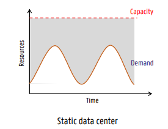 | 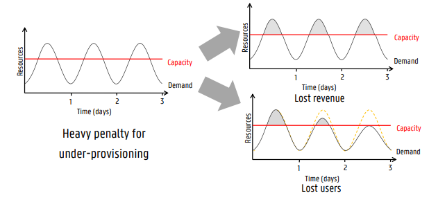 |
| ------------------------------------------------------------ | ------------------------------------------------------------ |
| Je hebt te veel resources en dus verspil je super veel.      | Je hebt te weinig resources, en in de pieken zullen er dus problemen zijn, zoals mensen die hun bestelling niet kunnen maken waardoor je geld verliest. |

Dit probleem kan opgelost worden met **pay-per-use** in de cloud. Het grote voordeel is nu dat je die overtollige resources in de dalmomenten niet moet betalen, je kan dus dynamisch schalen op basis van de belasting van je systeem. 

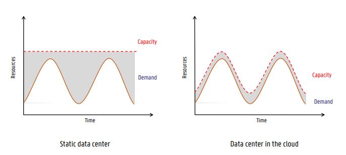

Door de **economy of scale** kunnen cloud providers hun services veel goedkoper aanbieden dan als je de machine zelf zou hebben, want Google en Amazon hebben deals met elektriciteitsmaatschappijen, ISPs, fabrikanten, ... Bovendien zetten ze dan hun datacenters op speciale plekken waar bijvoorbeeld de elektriciteit goedkoper is. 

Cloud is ontstaan vanuit de grote techbedrijven. Om nog meer geld te verdienen hadden ze het geweldige idee om hun al bestaande infrastructuur te verhuren wanneer deze capaciteit over had.

### Cloud myths and facts

* Myths 
  * Cloud computing will eliminate the need for IT personnel 
  * There will only be one super computer in the future 
  * Moving to the cloud automatically saves money 
  * The cloud is not safe for storing data 
    * Je moet niet denken dat je beter bent in beveiliging dan Microsoft of Google
  * Transitioning to the cloud is quick and easy 
    * Altijd gedoe
* Facts 
  * Cloud technology is here to stay 
  * Cloud technology should not be ignored

### Off-premise cloud

Als je zelf in je bedrijf een cloud maakt noem je het een **on-premise cloud**. Als je dat niet doet heb je een **off-premise cloud**, typisch met de volgende eigenschappen:

* Off-premise
  * Service in een andere locatie gehost (bij provider)
  * Over het publieke internet (bij public cloud)
  * Processing gebeurt buiten de firewall van het bedrijf
* Elasticiteit
  * Schaalbaarheid van provider
  * Snel omhoog en omlaag schalen
* Flexibele billing
  * Betaling is een abonnement of op basis van verbruik 
  * Cost effective
* Virtualisatie
  * Kost optimalisatie door **multi-tenant** systemen (meerdere klanten op één fysieke machine)
* Betaalbare resources
  * Geen vaste aankopen
  * Schaal van providers
* On-demand self-service
  * Vraag een service wanneer je hem nodig hebt, deze wordt dan op vraag voorzien

### Cloud deployment models

Bruno toont on **drie** soorten clouds.

| Public cloud                                                 | Community cloud                                              | Private cloud                                                |
| ------------------------------------------------------------ | ------------------------------------------------------------ | ------------------------------------------------------------ |
| 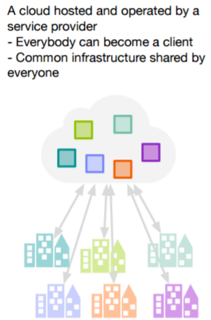 |  | 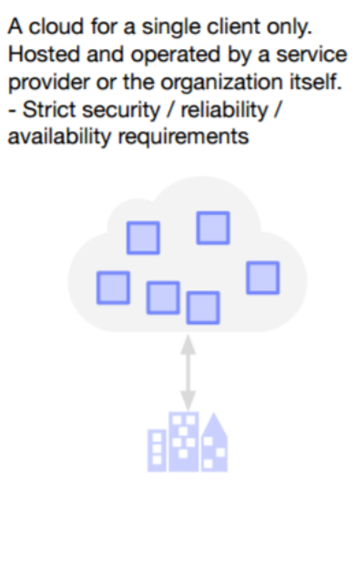 |
| - Google, Microsoft, ...  - Voor toegang tot openbare systemen of services - Gratis of pay-per-use | - Typisch voor speciale security constraints - Bijvoorbeeld zodat de NSA niet kan meekijken  - | - We emuleren een public cloud op onze eigen resources - Je doet niet alleen voor security een private cloud - Vooral als je zeker niet wilt dat je data bij google ofzo zit  - (als je een bank bent bijvoorbeeld) - Is soms nodig om te voldoen aan reguleringen - Optie om naar public cloud te schalen (cloudburst) |

### Hybrid cloud

Wat als we nu **public cloud** en **private cloud** combineren? Dan krijg je **hybrid cloud**. De kritieke activiteiten zitten dan in de private cloud en de niet-kritieke in de public cloud. Dan kunnen we ook doen aan **cloud bursting**, dan vragen we wanneer nodig extra resources aan uit de publieke cloud, en doen we ze weer weg wanneer ze niet meer nodig zijn. 

Dan heb je ook nog **multi-cloud**, dan gebruik je clouds van verschillende providers. Dit wordt in heel veel bedrijven gedaan.

### Cloud models

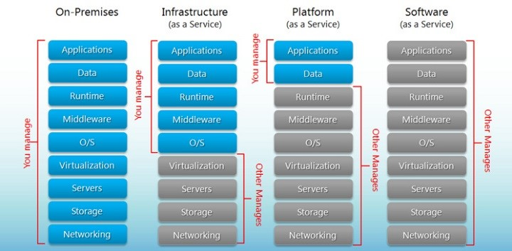

## Infrastructure-as-a-service

Bij IAAS worden gebruikers voorzien van fysieke of virtuele computatie-, storage- en netwerkresources. 

Er zijn enkele verschillende soorten **offerings**:

* Closed IAAS
  * Amazon, Azure, Google, ...
* Container-as-a-service offerings
* Open IAAS
  * OpenStack

Een belangrijk begrip in dit hoofdstuk is **multi-tenacy**. Een fysieke computer wordt gedeeld door meerdere gebruikers. Hoe wordt dit mogelijk gemaakt?

* Door middel van **abstractie**
  * We maken een abstract model van hoe een generische resource eruit zou moeten zien (processor, memory, ...)
* Door **virtualisatie** is er geen afhankelijkheid op fysieke resources. 
  * Services zijn meestal gebaseerd rond virtuele machines
* Abstractielaag zorgt soms wel voor verlaagde **performance**

### Virtualisatie

| 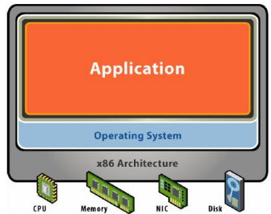 | 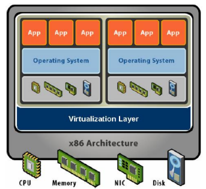 |
| ------------------------------------------------------------ | ------------------------------------------------------------ |

Voor virtuele machines in de cloud wordt typisch generische hardware gebruikt. Daarboven zit dan een virtualisatielaag waarboven er virtuele hardware wordt gesimuleerd. Hier zijn een aantal voordelen van virtualisatie:

* <u>VM Isolatie</u> 
  * Secure multiplexing
    * Op een veilige manier meerdere gebruikers/applicaties op dezelfde hardware zetten zonder dat ze kunnen interfereren
    * Moderne processoren hebben betere ondersteuning voor virtualisatie, bv. direct memory access
  * Sterke garanties
    * Bug, crashes, virussen in één VM raken niet bij andere VMs (behalve als er bugs in de VM software zitten)
  * Performatie isolatie
    * Resources van het systeem partitioneren. Je kan bijvoorbeeld niet over de limiet gaan van de VM, ook al heeft de fysieke machine meer geheugen
* <u>Mixed OS environment</u>
  * Je kan meerdere besturingssystemen op één machine draaien
* <u>VM encapsulatie</u>
  * We kunnen een VM in een bestand stoppen en bijvoorbeeld doorsturen, met de volledige toestand van het geheugen, applicaties en data.
  * Dan kunnen we de VM gemakkelijk ergens anders opstarten
* <u>VM Compatibiliteit</u>
  * Oude legacy applicaties kunnen uitgevoerd worden op VMs
  * Hardwareonafhankelijk
  * Create once, run everywhere

### Virtual machine use cases

* Legacy applicaties draaien
* Software testing, met een 'clean' install van OS en software
  * Kan je het ook snel op verschillende besturingssystemen testen
* Malware testing
  * Loslaten in een gecontroleerd systeem
* Test en development
  * Snel test, development en operational servers opdraaien
* Business continuiteit
  * Snel uitrollen op meerdere servers
* Enterprise desktop
  * Beveiligen van unmanaged PCs zonder de autonomie van eindgebruikers op te offeren door een security policy rond desktop virtual machines
* Server consolidatie
  * Kosten reduceren door services op zo weinig mogelijk machines te draaien
  * Dus meerdere dingen op één machine (consolidatie)

### Evolutie

De virtualisatie zoals we hem nu kennen is natuurlijk niet in één keer tot stand gekomen. Er zijn meerdere evoluties gebeurd doorheen de jaren.

* <u>Eerste generatie</u>
  * 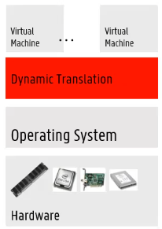 
  * Full virtualization, de software bootst een volledige fysieke hardware na
  * Volledig software-based, je hoeft **niets** te **wijzigen** in het **guest operating system**
  * De hardware had geen notie van virtualisatie
  * Het abstracte model van de virtuele machines werd vertaald naar de hardware (binary rewriting)
  * Grootste **nadeel** is **performantie** (25-75% tragere memory access, ...)
* <u>Tweede generatie</u>
  * 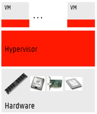 
  * Paravirtualization
  * In de VM (guest operating system) een aantal aanpassingen zodat we toch rechtstreeks naar de hardware kunnen.
  * Het **nadeel** is dat de **guest OS aangepast moest worden** afhankelijk van de gebruikte hypervisor (spreekt het nut van VMs rechtstreeks tegen)
    * Bijvoorbeeld als je VMwareTools installeert zodat je VM minder delay heeft voor de muisinput
  * Het **voordeel** is dat het **sneller** is dan de vorige generatie
* <u>Derde generatie</u>
  * Hardware-assisted virtualization: **hardware weet dat virtualisatie bestaat**
  * Guest OS moet **niet aangepast** worden
  * Je hebt wel twee dingen nodig
    * Een **hypervisor** die **hardware acceleratie ondersteunt**
    * **Processoren** die **hardware acceleratie ondersteunen**
  * Hypervisor heeft rechtstreekse access tot RAM, netwerk, storage, ...
  * Het **voordeel** is dat je een **ongewijzigde OS** kan draaien zonder problemen aan hoge performantie, maar je moet wel software hebben die dat ondersteunt.
  * Het **nadeel** is de **startup time** van de VM, want deze moet helemaal opstarten zoals een gewone PC. Dit probleem heb je eigenlijk met alle VMs.
    * Bij een container heb je dit probleem niet want deze heeft al deze rommel niet volgens Bruno
    * Bij een site zoals Zalando is deze vertraging geen probleem, maar bij Ticketmaster, waar het plots kan dat er duizenden mensen tegelijk refreshen is dit wel erg.

### OS-level virtualization

Er is ook een vierde aanpak van virtualisatie. OS-level virtualisatie wordt op het niveau van het besturingssysteem gedaan. Dit wordt vaak gebruikt voor **containers**. Het voornaamste voordeel hiervan is **densiteit**, want containers hebben niet alle extra bagage die bij een VM zit (zoals een OS en bios). Ze nemen dus veel **minder plaats** in. 

Je kan als je containers gebruikt met dezelfde hardware drie keer meer servers opstarten als wanneer je VMs gebruikt. Dit werd vooral gebruikt in de hosting markt.

#### OS-level vertualization vs VM-based virtualization

| 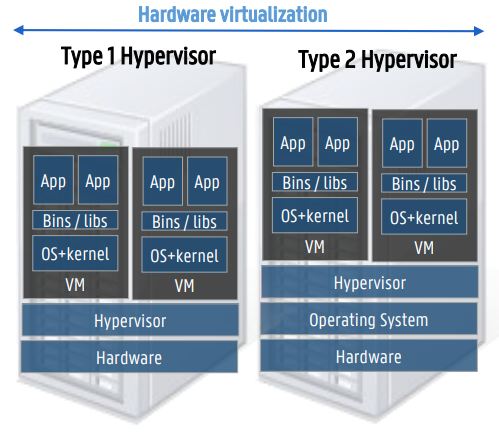 | 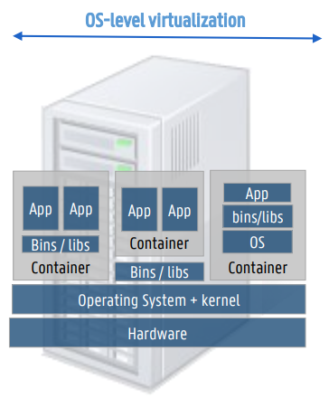 |
| ------------------------------------------------------------ | ------------------------------------------------------------ |
| - Virtuele machines zijn volledig geïsoleerd  - Elke VM heeft zijn eigen OS - De hypervisor regelt toegang tot de gedeelde hardware | - De kernel van de host heeft meerdere process spaces - Containers zijn **lightweight**, ze delen de kernel van de host OS - Elke container heeft wel zijn eigen root file system |

Je ziet dat in de afbeelding rechts er geen kernel en operating system in de container hoeven te zitten. Dan hoeft deze niet opgestart te worden. Containers zijn wel potentiëel minder veilig, want als er een exploit zit in het onderliggende besturingssysteem, zou het kunnen dat we vanuit één container toegang krijgen tot de andere. Bij een type 1 hypervisor heb je dit probleem niet, want de VMs zijn door hardware van elkaar gescheiden.

### Containers

Containers **delen dezelfde OS/kernel** en zijn veel **lichter** dan virtualisatie met een hypervisor. Ze kunnen met de host communiceren via standaard system calls. Bovendien is elke container **logisch onafhankelijk** van de andere containers en moet hij maar een kleine hoeveelheid data (applicatiedata) bijhouden. Een container kan ook op **pauze** gezet worden en op een andere machine verdergezet worden.

De voordelen van containers zijn:

* Snellere start-up tijd
* Density
  * Je kan op één fysieke host veel meer containers draaien dan VMs, want containers hebben slechts één OS per fysiek systeem nodig hebben.
* Potentieel beter management
  * Want de gedeelde kernel heeft een beter zicht op het resource gebruik van alle containers 
  * Bij hypervisors moet je allerlei trucjes gebruiken om ze goed te beheren
* Meer containers = meer winst

### Overzicht

*"De kans dat dit wordt gevraagd op het examen is zeer groot" - Bruno*

| Hypervisor                                                   | Container                                                    |
| ------------------------------------------------------------ | ------------------------------------------------------------ |
| One real hardware, many virtual hardwares, many OSs          | One real hardware, no virtual hardware, one kernel, many user space application instances. Hardware acceleratie is dus moeilijker |
| High versatility, can run different OSs                      | Hier kan je bijvoorbeeld geen DOS appllicatie mee draaien    |
| Lower density                                                | Higher density                                               |
| Virtualization/emulation overhead (derde generatie wel wat minder) | Near-native performance, almost no overhead                  |
| Hardware-enforced isolation                                  | Software-enforced isolation (minder veilig)                  |
| Size: potentially large (OS in VM)                           | Size: potentially small                                      |
| Boot time: relatively high                                   | Boot time: fast                                              |

Bij moderne technologie is de lijn tussen VM-virtualisatie en containervirtualisatie wat vager. Er zijn ook VMs met minimal OS layers, of containers die een minimal OS layer hebben. Er zijn ook containers met hardware-enforced isolation (microVM).

### Open IAAS offerings

#### Openstack

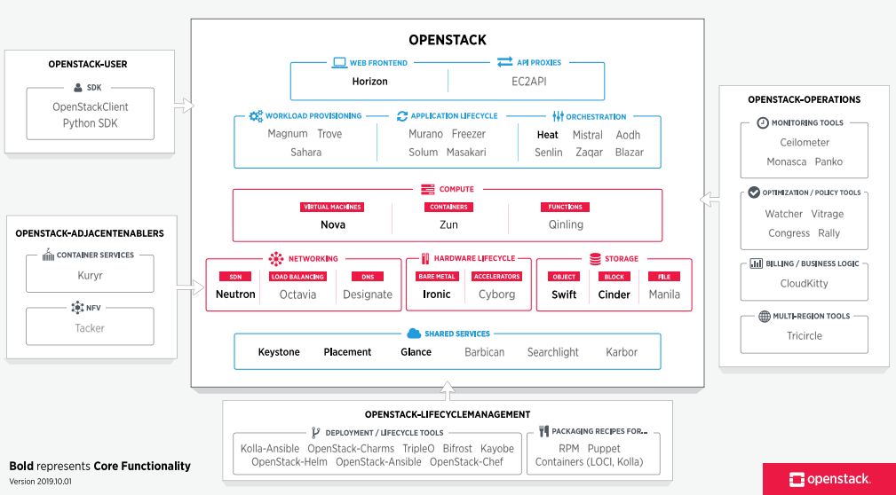

Openstack is een softwareplatform dat je toelaat om zelf een IAAS platform op te zetten, zelfs op hardware die je huurt van grote providers. Typisch doe je het wel op je eigen cloud. 

* Openstack is het meest gebruikte IAAS open source IAAS framework.
* Openstack is wel heel uitgebreid en ingewikkeld.

<small>00:18:00</small>

#### Apache Cloudstack

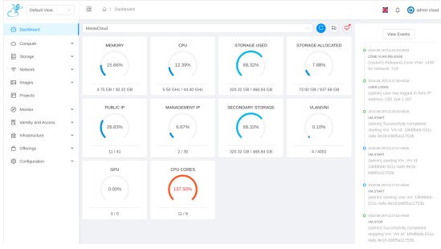

* Tweede meest gebruikte open-source IAAS
* Veel minder uitgebreid dan openstack, maar wel makkelijker te installeren
* API compatibel met AWS voor oganisaties die een hybrid cloud willen

#### Opennebula

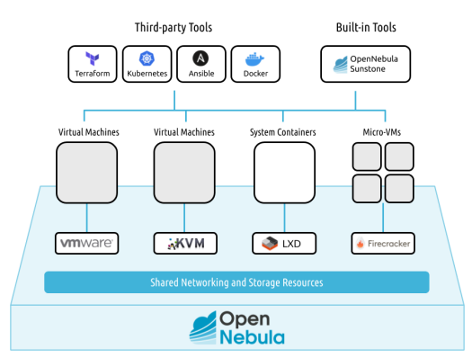

* Veel minder uitgebreid dan openstack, maar wel makkelijker te installeren
* Gebruikt door sommige hele grote bedrijven (Akamai, booking.com)
* Er zit een beetje minder drive achter dan bij de andere oplossingen
* Bruno zegt dat hij er niet voor zou kiezen
* Heeft veel geld opgeslokt

#### Eucalyptus

* Niet veel bedrijven gebruiken het, laatste release in 2018
* Het is eigenlijk dood
* Focus op een AWS compatibele private en hybrid cloud

### IAAS cloud standardisation

Er zijn een aantal standaarden om ervoor te zorgen dat je van één provider over kan naar een andere:

* <u>Open virtualization format (OVF)</u>
  * Beschrijft een manier om een virtuele machine in een bestand te steken
    * Bevat OVF descriptor: XML die de ingepakte VM beschrijft (naam, requirements, ...)
    * Disk images
    * Certificaten en licenties
  * Dan kan je je VM gewoon naar ergens anders verplaatsen
* <u>Open cloud computing interface (OCCI)</u>
  * 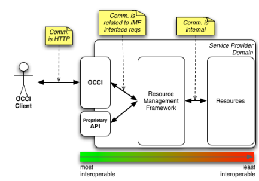 (figuur kennen)
  * Vermijdt het gebruik van proprietaire IAAS APIs
  * Dan zijn de commando's om VMs te starten en te stoppen overal hetzelfde
  * Werkt met een RESTful protocol voor deployment, automatisch schalen, monitoring, network en storage resources.
  * Ondersteund door OpenStack, OpenNebula, Cloudstack, Amazon AWS
  * Niet ondersteund door Azure en Google Cloud, daarom is de standaard waarschijnlijk gestorven. De laatste versie was in 2015
* <u>Cloud infrastructure management interface (CIMI)</u>
  * Net hetzelfde als OCCI
  * Laatste versie in 2016
  * Er is alleen een implementatie voor Openstack, dus het heeft niet zo veel nut.
* <u>Cloud data management interface (CDMI)</u>
  * Voornamelijk bedoeld om storage to koppelen aan draaiende VMs
  * RESTful standaard voor storage, gebruikers exporteren, data tussen cloud systemen verplaatsen, ...
  * Laatste versie in 2014

Zowel OCCI en CIMI zijn weinig gebruikt, de standaard is nu Amazon EC2 (elastic cloud). Het is eigenlijk geen standaard want het is van Amazon, maar iedereen gebruikt het. EC2 heeft een REST API en een hele boel SDKs voor verschillende programmeertalen.

Azure en Google Cloud voorzien gelijkaardige applicaties.

#### Multi-cloud development

Een multi-cloud development library voorziet een API die abstractie maakt van de vershillen tussen verschillende cloud-providers. Er zijn een aantal implementaties:

* Apache libcloud
  * Open-source python toolkit om te interageren met verschillende cloud providers via één API
  * De API houdt zich bezig met compute, storage, load balancing, DNS, container virtualisatie
  * Wordt wel nog actief ontwikkeld
  * Je moet maar één keer code schrijven en kan dan kiezen welke cloud driver je gebruikt
  * Dan is het gemakkelijk om te switchen tussen cloud providers
* Apache Jclouds
  * Iets minder populair dan de python versie, maar zelfde principe
* Andere
  * Pkgcloud
    * Node.js library
  * Libretto
    * Golang

#### Open containers initiative (OCI)

OCI heeft hetzelfde doel als de standaarden die we hierboven hebben besproken, maar dan op containers. Er zijn twee manieren waarop dit wordt gedaan:

* Runtime specification (runtime-spec)
  * Een API die standaardiseert hoe we de containers starten, stoppen, pauzeren, ...
* Image specification (image-spec)
  * Zoals OVF, maar dan voor containers
  * Vertelt hoe je een container in een file steekt

#### Container networking interface (CNI)

CNI voorziet een interface tussen de container runtime in de netwerkimplementatie. CNI voorziet ook third-party plugins voor moeilijkere oplossingen. Het is een standaard die beschrijft hoe containers een IP-adres krijgen, hoe ze bereikbaar zijn, hoe ze aan routering doen, ... CNI wordt onder andere door Kubernetes gebruikt.

## Platform-as-a-service (PAAS)

We nemen de afbeelding van daarstraks er weer bij:

Bij PAAS moet je je geen zorgen meer maken om de runtime, middleware en OS, zoals bij VMs. Je moet je enkel bezighouden met de applicatie en zijn data. Het zijn vooral web-based applicaties die je toelaten om snel een applicatie te bouwen. Typisch krijg je een soort drag-and-drop interface om applicaties aan elkaar te plakken. 

Een aantal voorbeelden zijn:

* Google App engine
* Aws elastic beanstalk
* Microsoft Azure web apps
* Salesforce

Er zijn ook open-source alternatieven:

* RedHat Openshift
* Cloud foundry
* Dokku
* Flynn

### Red hat openshift

Openshift is meer een soort managed kubernetes. Dit is nuttig als je kubernetes wilt gebruiken, maar het zelf niet wilt onderhouden. Openshift heeft ook een aantal extra dingen zoals:

* Geïntegreerde CI/CD pipelines
* Applicaties kunnen in verschillende talen geschreven worden
* Kan op verschillende cloud providers gehost worden
* Ondersteuning voor private cloud
* Een marketplace voor container images

De voordelen zijn:

* Open-source distributie van kubernetes
  * Dev-ops tools bovenop kubernetes
* Portability: volgt OCI standaarden 
* Gecentraliseerd platform voor zowel on-premise als hybrid in de public cloud
* Health management via web interface
* Mature en gemakkelijk te gebruiken web UI

Nadelen

* Vreselijk duur
* Opinionated kubernetes
  * Je kan sommige dingen niet doen
  * Er zijn dingen toegevoegd die eigenlijk niet in kubernetes zitten

### Kubernetes vs openshift

| Parameter                 | Kubernetes                                                   | Openshift                                                    |
| ------------------------- | ------------------------------------------------------------ | ------------------------------------------------------------ |
| Origin                    | Open-source project/framework, geen product                  | Product met veel variaties. OpenShift Origin is open source, maar dit is eigenlijk niet de beste versie. |
| Installation              | Kan op bijna elke linux distro geïnstalleerd worden          | Gelimiteerd, voornamelijk Red Hat enterprise linux (RHEL)    |
| Key Cloud Platforms       | GKE op Google cloud, EKS op amazon AWS en AKS op Microsoft azure. | Red hat ondersteunt AWS en Azure                             |
| Security & Authentication | Well defined, maar niet zo strict als openshift. Je moet nog veel zelf doen om het veilig te krijgen. | Strictere security policies en authenticatiemodellen         |
| Use of templates          | Kubernetes Helm templates zijn flexibel en makkelijk te gebruiken | Openshift templates zijn minder gebruiksvriendelijk en flexibel |
| Releases                  | 4/jaar                                                       | 3/jaar                                                       |
| CI/CD                     | Mogelijk met Jenkins maar niet geïntegreerd in kubernetes    | Geïntegreerd met Jenkins                                     |
| Learning curve            | Geen gemakkijke web UI                                       | Gebruiksvriendelijke web console                             |
| Initial rollout           | Moeilijk als nieuwe onderdelen moeten geïnstalleerd worden (bv. dashboard) | All-in-one oplossing                                         |

### Cloud foundry

* Cloud foundry is ontwikkeld door VMware in 2011 (dus voor kubernetes)
* Orchestreert applicaties. Je kan een applicatie bouwen en cloud foundry houdt zich bezig met de rest.
* Apps draaien op **Diego Cells**
  * Gelijkaardig aan een container
  * Die Diego Cells werden dan eigenlijk op VMs geïnstalleerd
  * Later hebben ze Diego Cells vervangen door een eigen kubernetes versie (KubeCF). 
* Voordelen
  * Open source
  * Portability: makkelijk switchen tussen providers. CF voorziet de middleware tussen je applicatie en de IAAS provider.
  * Autoscaling: automatisch omhoog en omlaag scalen op basis van load
  * Gecentraliseerd platform administratie en logging
  * Applicatie health management
  * Ondersteuning voor verschillende SaaS providers (AWS, Azure, OpenStack, Google Cloud, ...)

Cloud foundry was op papier een hele goede optie, maar als je plots moet overschakelen op kubernetes zal je applicatie nooit zo goed werken als wanneer je van het begin kubernetes had gebruikt.

### Cloud foundry vs openshift

| Parameter                      | Cloud Foundry                                                | OpenShift                                                    |
| ------------------------------ | ------------------------------------------------------------ | ------------------------------------------------------------ |
| Container orchestratie         | Eerst Diego, nu kubernetes                                   | Had van in het begin kubernetes                              |
| Infrastructuur                 | Draait liefst op VMware Origin, maar kan ook op bare metal   | Kan draaien op RHEL of bare metal                            |
| Minimal deveoper version       | CF Dev                                                       | Minishift of Code-ready containers                           |
| Service registry and discovery | Consul en Eureka                                             | Eigen tooling en multicast                                   |
| Zero downtime deployments      | Blue-green deployments: twee identieke versies draaien in productie. Updates overschrijven de productie versie die offline is, waarna de load naar deze machine wordt gestuurd | Gebruikt kubernetes zero downtime deployments                |
| Build mechanism                | Buildpacks: je geeft je source code en er wordt vanzelf een container van gemaakt en gedeployed. Je bent afhankelijk van welke buildpacks er beschikbaar zijn. | Source to image conversion van source code van git repo naar docker images, waardoor ontwikkelaars zich niet moeten bezighouden met dockerfiles enzo. |

Bruno zegt dat je best dat cloud foundry gaat uitfaseren. 

### PAAS cloud standardisation

Er zijn ook een aantal standaarden voor PAAS:

* <u>Cloud application management for platforms (CAMP)</u>
  * Ontwikkeld door Oasis
  * Een taal die de applicatieartefacten en de services die nodig zijn om ze uit te voeren en verbinden beschrijft
  * Beetje hetzelfde als OCCI voor IAAS
  * Voorziet een unificatie van management intefaces van PAAS providers d.m.v. REST calls
  * In theorie zou je dan een applicatie op verschillende PAAS platformen kunnen draaien
  * Er is een POC op openstack, maar niemand gebruikt het eigenlijk
* <u>Topology and orchestration spec for cloud apps (TOSCA)</u>
  * Zeer uitgebreide standaard
  * Een blueprint maken
    * Orchestratie van cloud services 
    * Hun relaties 
    * Hoe ze beheerd worden
  * Probleem: de standaard zegt niet "hoe". De cloud vendor kan dit zelf beslissen.
  * Implementaties
    * Tosca-parser voor OpenStack
    * OpenTosca
    * Cloudify
  * Initeel geen industriële uptake
    * Maar plots heeft Red Hat de Tosca v2 diss track gedropt
    * Is nog in ontwikkeling

#### Cloudify

* Gebruikt Tosca
* Composer voor het maken van visuele Tosca blueprints
  * Je zou dan in theorie met je blueprint naar een grote cloud provider kunnen gaan en hem vertellen om je applicatie uit te voeren.
* Wordt gebruikt in het network function virtualization (NFV) domein. 
* High profile klanten
  * Intel, VMware, Atos, KPN, ...

//TODO misschien wat meer uitbreiden

## Software-as-a-service (SAAS)

Dit zijn applicaties zoals, office 365, Dropbox, Google Apps, ... Hier zijn er niet echt standaarden om je te beschermen tegen vendor lock-in. Er zijn een aantal dingen waarmee je best rekening houdt:

* Zorg dat UIs, APIs, protocollen en dataformaten goed gedefineerd zijn
* Wanneer mogelijk, vraag om gestandaardiseerde APIs, protocols en dataformaten
  * Moeilijk bij hele grote speler als Google natuurlijk
* Kan je een versie van hun software on-premise draaien?
* Is de SaaS oplossing open-source?
* Een plan voor wanneer de SaaS niet meer beschikbaar is
* Je moet ook zien dat je je data eruit kan krijgen
  * Bijvoorbeeld als een open standaard
* Of dat je je data bij hun kan verwijderen

## Function-as-a-service (FAAS)

FAAS is eigenlijk een andere naam voor serverless computing. Dan kan je je code uitvoeren zonder dat je servers moet gaan managen. 

* Serverless computing
  * Typisch kleine code fragmenten snel laten uitvoeren zonder dat je servers moet voorzien. Dan betaal je alleen voor de resources die je gebruikt hebt
  * De cloud provider beheert dan dynamisch de toewijzing van resources
  * Voorbeelden
    * AWS Lambda
    * Azure functions
    * Google cloud functions
    * Cloud foundry application runtime
  * Nadelen
    * Vendor lock-in
      * Geforceerde API upgrades
      * Verhoogde kosten
      * Veranderende limieten
    * Geen FAAS standaarden om vendor lock-in te vermijden
    * Weinig tools voor debugging en monitoring
      * Hangt af van de vendor
    * Architecturale complexiteit
      * Moeilijk om te beslissen wat serverless moet zijn
      * Hoeveel moet een functie doen
    * Je kan vendor lock-in deels vermijden. Kubernetes heeft sommige extensies waarmee je serverless computing kan doen

## Metal-as-a-service (MAAS)

* Software die ervoor zorgt dat je fysieke machines in gebruik kan nemen.
* Dit doe je typisch wanneer je geen performantieoverhead van VMs wilt. 
* MAAS zorgt dan voor de reservatie van de machine en voorziet een platform voor management, installatie, ...
* Dit is bijvoorbeeld nuttig voor performantiemetingen

# --- 2 - Powershell ---

Microsoft PowerShell is een universele automatie-, scripting- en ontwikkelingstaal en is ontwikkeld om het automatiseren van taken zonder kennis van programmeren mogelijk te maken. 

Een aantal nuttige commando's zijn:

* `Get-Alias`: toont de lijst van beschikbare aliasen
* `Get-Command`: toont de lijst van alle beschikbare commando's
  * Er zijn vershillende flavours van commando's
    * De meeste zijn cmdlets, typisch geschreven in andere talen zoals C#
    * Functies zijn commando's die in PowerShell zelf zijn geschreven
* `Get-help`: hetzelfde als `man` in Linux

Commando's in PowerShell hebben ook **parameters**. Dit zijn waarden die meegegeven worden aan het commando om zijn gedrag aan te passen. Het nadeel van powershell is dat je niet even `sudo` kan gebruiken bij een commando dat meer rechten nodig heeft. Je moet PowerShell dan opnieuw opstarten als admin.

## Basic concepts

* Variabelen
  * Moet je direct een waarde geven
    * Je kan hem wel op `$null` zetten (dit is wel een variabele die al in PowerShell zit)
  *  Er zijn ook een aantal built-in variabelen zoals `$MaximumHistoryCount`
  * Normaal gezien moet een variabele bestaan voordat je hem kan gebruiken (in strict mode)
  * `$LastExitCode` is wel nuttig om te zien of de vorig uitgevoerde functie is gelukt

Oké ik was de opname aan het kijken en onze Jericho zegt dat we dit niet moeten kennen voor het examen dus ik ga dit deel niet afmaken. 

# --- 3 - Windows Server ---

## Servers 

Er zijn drie soorten servers:

* Rack-mountable servers: zitten in een rek
* Blade servers: zitten in een chassis, pakken minder ruimte in en zijn typisch hot swappable
* Tower servers: één grote kast die rechtstaat

### Processors

Een server heeft typisch ook één of meerdere processors met een aantal eigenschappen:

* Snelheid
* Cache
* Cores
* Word size (32-bit, 64-bit, ...)
* Virtualisatietechnologie: hardware support voor virtualisatie

### Geheugen

Het RAM en ROM geheugen van een server noemt met de **primary storage**. Meestal gebruiken servers een soort RAM met **error-correcting code** (ECC). Die er voor zorgen dat je fouten in het geheugen kan detecteren en corrigeren. Er zijn ook een aantal andere soorten RAM voor servers (SDDC, DDDC). Typisch is server RAM kloteduur, en een server heeft geen 8GB, maar honderden GBs aan RAM-geheugen nodig.

Als we praten over **secondary storage**, bedoelen we doorgaans **harde schijven**. Deze zijn typisch hot-swappable en zorgen voor de opslag van grote hoeveelheden data. 

### Netwerkinterface

Servers hebben meestal meerdere netwerkinterfaces, dit geeft enkele voordelen:

* NIC teaming: verhoogt de bandbreedte van en naar de server
* Network separation: dan kan je bijvoorbeeld intranet- en internetverkeer scheiden

## Windows server

Windows server is en besturingssysteem voor servers, gemaakt door Microsoft, en wordt redelijk veel gebruikt. Of het vaker gebruikt wordt dan Linux weet Bruno niet zeker. Ze hebben pas vanaf 2008 een versie uitgebracht zonder UI. Er zijn een aantal **versies** van windows server:

* Windows server **datacenter**
  * De meest complete versie, vooral voor bedrijven die veel virtualizatie nodig hebben.
* Windows server **standard**
  * Typisch voor KMO's. De standaard versie.
* Windows server **essentials**
  * Goedkope versie, typisch als je één server hebt
  * Tegenwoordig is deze versie hetzelfde als standard, maar de licentie is geodkoper

### Features

In Windows server 2019/2022 zijn een aantal nieuwe interessante features:

* Features voor **hybrid cloud**
  * Hybrid cloud, storage migration, ...
  * Nu ook ondersteuning voor Azure Stack (Azure op je eigen datacenter)
* Security features
  * Ondersteuning voor **shielded VMs**
  * Nieuwe encryptiestandaarden
  * Trusted Platform Module 2.0
* Features voor infrastructuur en performance optimalisatie
  * Ondersteuning voor monitoring over de hele cluster en grotere hardware

#### Shielded VMs

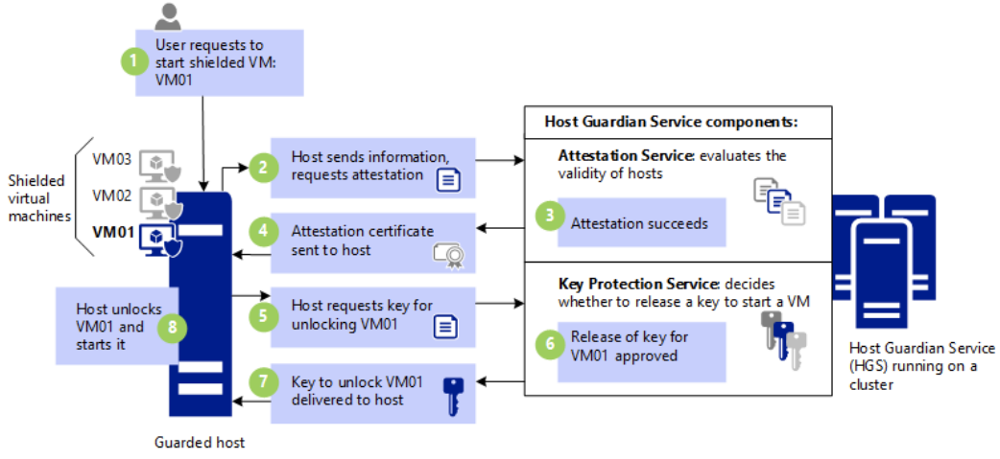

Een shielded VM zorgt ervoor dat je VM wordt uitgevoerd in een **veilige omgeving**, die je verzekert dat er niemand meekijkt met wat je doet. Het opstarten van een shielded VM verloopt in 8 stappen:

1. De gebruiker vraagt een shielded VM aan.
2. De **host** stuurt informatie over zichzelf naar de **Host Guardian Service (HGS)** met de vraag om toestemming om de VM te starten.
3. De **Attestation Service** van de HGS kijkt na of de info geldig is en of de **host** **gekend** is.
4. Als dit oké is krijgt de host een **certificaat** van de HGS.
5. Nu vraagt de host voor een **key** om de VM te kunnen unlocken, want zonder hem te unlocken kan hij niet opgestart worden. De host stuurt dus deze vraag samen met zijn certificaat naar de HGS.
6. De **Key Protection Service** van de HGS beslist dan of hij de host voorziet van een sleutel.
7. De HGS stuurt de **sleutel** naar de host.
8. De host kan nu de VM **unlocken** en hem starten.

Het is nu onmogelijk om de data en de state van de trusted VM te inspecteren. Dit komt doordat een stuk van de processor, genaamd de **Trusted Platform Module (TPM)** zorgt voor encryptie. De data kan dan enkel **gedecrypteerd** worden met de **sleutels** van de **HGS**. Zo kan hetgene dat uitgevoerd wordt in een bepaald proces op de VM enkele bekeken worden door diegene die het uitvoert.

#### System insights 

Er zijn een aantal nieuwe features die je meer inzicht bieden in je server. Ze maken gebruik van predictive analysis en nog wat andere bazaar. Dit is niet zo belangrijk.

#### Azure

Windows server ondesteunt nu **Azure Hybrid Cloud**, dit zorgt voor een verbeterde verbinding tussen on-premise servers en cloud apparaten op Azure. Bovendien bieden ze nu ook een **storage migration service** aan. Dit maakt het makkelijker om data van oude Windows servers, Linux servers of file shares te migreren naar Azure of Windows Server.

#### Storage replica

Windows server voorziet ook **replicatie** van volumes. Dit kan op twee manieren:

* Synchroon: Als je iets schrijft, krijg je pas een oké als het op all replica's is weggeschreven
* Asynchroon: je krijgt een oké als het op de eerste replica is weggeschreven, de rest volgt later.

#### Microsoft defender

Defender voorziet een gecentraliseerd punt voor beveiliging in je bedrijf. Er zitten ook een aantal coole features in. Je kan bijvoorbeeld redelijk gemakkelijk terug gaan in de tijd voor informatie over inbreuken en problemen, maar ook intrusiedetectie en onderzoek naar de oorzaak zijn mogelijk.

### Administratie

Het ding dat Bruno het meeste stoort is dat er voor elke actie 5 verschillende manieren zijn om hem te doen. Dat is niet erg, maar het probleem is dat elke tool maar ongeveer 60% van de taken kan doen. Dus je hebt heel veel verschillende tool nodig. Dit komt doordat Windows een rommelboel is van aan elkaar geplakte dingen. 

De belangrijkste tool is PowerShell. Als je een goede sysadmin bent, **automatiseer** je **elke taak** die **meerdere keren** uitgevoerd wordt. Typisch gaan servers in een datacenter of in de cloud draaien, dus hopelijk moet je niet elke keer langsgaan of inloggen met remote desktop. Probeer zo veel mogelijk in PowerShell te doen in de remote console.

### Privileged access workstation

Een **Privileged Access Workstation (PAW)** is een speciale computer van waaruit administratietaken zijn toegestaan. Zo kan niet eender wie vanuit eender waar wijzigingen aanbrengen aan je systeem.

Deze computer heeft typisch een **locked down** configuratie. Er mag enkel geauthoriseerde en gesigneerde software op deze computer aanwezig zijn. Een PAW wordt als volgt geconfigureerd:

* Stel in dat alleen geauthoriseerde en gesigneerde software wordt toegelaten
* Stel **Credential Guard** in om de wachtwoorden op de computer te beschermen
* Gebruik **BitLocker** om de opslag en bootomgeving van de computer te versleutelen
* De computer mag niet gebruikt worden om te browsen of om te mailen. Blokkeer browsen op de PAW lokaal en in de firewall van het netwerk
* User accounts
  * Gebruik specifieke user accounts voor sysadmins om op de PAW in te loggen
  * Een administrator mag niet inloggen met een account dat root privileges heeft op de PAW
    * Er moet natuurlijk wel één iemand aankunnen, maar alle gewone sysadmins mogen dit niet
  * Je kan bijvoorbeeld ook de sign-in hours beperken
  * Voorkom dat de sysadmin accounts op gewone computers kunnen inloggen
* Stel in dat servers alleen verbindingen accepteren van een sysadmin account op een PAW
* Gebruik configuuration-management tools om de configuratie van de PAW in de gaten te houden
* Zorg dat de audit logs van de PAW naar een veilige locatie worden gestuurd
* Verbied het gebruik van onbekende apparaten zoals USB sticks
* Blokkeer ongevraagd binnenkomend netwerkverkeer op de PAW

#### Jump servers

Meestal heb je niet één enkele PAW, want als die dan kapot gaat zit je in de miserie. Als je meerdere PAWs hebt kunnen **jump servers** van pas komen. Deze kan je zien als een soort proxy tussen je PAW en je servers. 

Dan stel je je servers in dat ze enkel verbindingen aannemen van een jump server. Op de jump server zelf kan niemand inloggen, deze combineert het verkeer van de verschillende PAWs. Dit zorgt dat al dit verkeer langs één punt gaat, waardoor je alles goed in de gaten kunt houden. Een jump server zorgt dus voor een **single point of entry** in je datacenter.

### Windows admin center

Windows admin centrer voorziet een web-based console om je Windows Server remote te beheren. Het handige hieraan is dat elk ding in de interface een powershell commando voorstelt. Je kan dan gewoon dat commando kopiëren en gebruiken om een bepaalde taak te automatiseren.

Het is de bedoeling dat in de toekomst alle grafische management van Windows Server hier naartoe verplaatst, waardoor alles dan achterliggend PowerShell gebruikt.

### Windows software update service

Windows software update service (WSUS) zorgt ervoor dat je gecontroleerd updates van Microsoft kan uitrollen over je systeem. WSUS zorgt ervoor dat je de updates kan downloaden en zelf beslissen waar en wanneer ze moeten geïnstalleerd worden. Dan moeten de computers in je bedrijf geen Windows update gebruiken, waardoor Patrick van sales niet meer 2 jaar lang op 'skip this version' kan klikken waardoor je hele bedrijf wordt geïnfecteerd met ransomware die alle data vervangt door foto's van de instagram van Wim.

Het is maar een grapje he ik hou heel veel van Wim. Ik ga je missen broeder.

## Installatie en configuratie

Windows server heeft een aantal **installatieopties**:

* Desktop experience: standaard windows server met ui
* Server core: Cli-based, minder verbruik
* Nano server: laagste verbruik, beschikbaar als container image, geen lokale login mogelijk, moet dus remote.

Windows heeft ook een soort bestandsformaat waarmee je een hele OS met updates, applicaties en drivers in een image file kan steken. Dit is dan een **image**. Dan kan je de **Deployment Image Servicing and Management (DISM)** tool gebruiken om de images te beheren. Zo kan je direct vertrekken vanuit een image bij een nieuwe machine.

Eén WIM file kan meerdere OS images bevatten. Als je een image mount, kan je er wijzigingen op aanbrengen. Zo kan je er bijvoorbeeld drivers of updates op zetten. 

Door middel van **answer files** kan je ook doen aan unattended installation. Deze file bevat dan het antwoord op elke vraag die tijdens de installatie gesteld wordt. Als je 100 computers moet installeren wil je niet op elke computer opnieuw het toetsenbord op Azerty zetten.

Het is ook mogelijk om een machine te installeren over je **netwerk**. Hoe dat werkt boeit niet volgens Bruno. Wat wel belangrijk is volgens hem is PXE Booting, en daarom krijgt dit van mij wel een aparte titel.

### PXE Booting

PXE booting zorgt ervoor dat wanneer een lege pc (zonder OS) aangesloten wordt op je bedrijfsnetwerk, deze op kan starten via het netwerk. Typisch gebruik je een DHCP server om deze informatie te voorzien. Dit verloopt in 6 stappen:

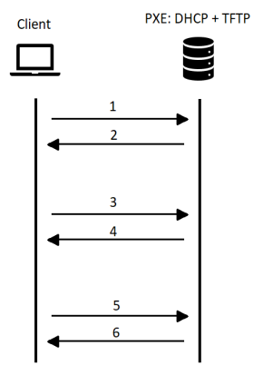

1. De client heeft nog geen IP-adres en verstuurt een `DHCPDISCOVERY` naar het broadcast adres, waarbij hij vermeldt dat hij een PXE boot nodig heeft.
2. De DHCP-server stuurt een `DHCPOFFER` op het broadcast adres. Als de server informatie over de PXE boot heeft, stuurt hij ze ook door.
3. De client stuurt een `DHCPREQUEST` op het broadcast adres, waarmee hij zegt dat hij het adres gaat gebruiken. 
4. De DHCP-server stuurt een `DHCPACK` op het broadcast adres, zo is het IP-adres bevestigd.
5. De client contacteert de PXE boot server met het Trivial File Transfer Protocol (TFTP) en vraagt naar de boot file vanuit de informatie in stap 2.
6. De file wordt geladen en uitgevoerd op de client.

Hierdoor heb je dus enkel een BIOS nodig om een PC te kunnen installeren, want alles kan automatisch via het netwerk gebeuren.

## Registry, services and service accounts

De **registry** is een database de configuratie van je hardware, software en veiligheidsinformatie bevat. Deze worden opgeslagen in de vorm van key-value paren en kunnen aangepast worden vanuit de registry editor. 

Typisch draaien er op je server ook een aantal **services** die je aan of uit kan zetten en aanpassen. Je kan bovendien ook regels instellen die beschrijven wat er moet gebeuren als een service faalt. 

Windows bevat een aantal service accounts. Dit zijn ingebouwde accounts waar je als gebruiker niet op kunt inloggen. De accounts worden gebruikt voor system services. Het kan dat deze accounts zelfs meet rechten hebben dan de root user. Er zijn drie van deze accounts in Windows Server:

* Local system: kan alles
* Local service: kan zo weinig mogelijk
* Network services: kan zo weinig mogelijk, maar kan op het netwerk

## Active Directory

Active Directory is een proprietaire technologie van Microsoft die objecten in een boomstructuur opslaat in een **hiërarchisch, gestructureerd en veilig formaat**. Deze objecten worden uniek geïdentificeerd door een naam en attributen en zijn typisch:

* Gebruikers 
* Computers
* Randapparaten
* Netwerk services

AD **centraliseert** al deze informatie, zodat gebruikers niet zijn verbonden aan één computer. Het maakt beheer ook makkelijker, zo kunnen accounts van mensen die onslagen worden bijvoorbeeld gemakkelijk verwijderd worden. Er zijn ook **AD-aware applicaties** die hun data in de AD kunnen zetten (meestal Microsoft-specifieke applicaties).

Ookal is AD **propriëtair**, zijn er wel een aantal **standaardprotocollen** die je ermee kan gebruiken. Je kan Lightweight Directory Access Protocol (**LDAP**) gebruiken om the authenticeren, data te queryen, ... Met **Kerberos** kan je veilig authenticeren en de identiteit van gebruikers op het netwerk bewijzen.

### Windows domain

Er zijn twee manieren om de gebruikers, computers, devices en services in je Windows bedrijf te structureren. 

| Domain                                                       | Workgroup                                                    |
| ------------------------------------------------------------ | ------------------------------------------------------------ |
| - Dedicated server voorziet services - De server bestuurt beveiliging en permissions voor alle computers op het domein - Veranderingen worden automatisch op alle computers gemaakt | Geen computer heeft controle over een andere computer        |
| Je kan met één account op eender welke computer op het domein inloggen | Elke computer heeft een aantal accounts, als je hem wilt gebruiken moet je er een bijmaken |
| Grote schaal (bedrijf): 10-1000en computers                  | Kleine schaal (thuis)                                        |
| Computers kunnen op verschillende lokale netwerken zitten    | Computers moeten op hetzelfde lokale netwerk zitten          |
| Gebruikt Active Directory Domain Service (AD DS) role        |                                                              |

### Domain controller

De **domain controller** is het belangrijkste onderdeel van je domain. Dit is de server die zegt wat er mag en wat niet. Hij bevat alle informatie over de AD en is de belanglijkste target voor hackers. Als een hacker hierop binnenraakt heeft hij **domain dominance**, en kan hij doen wat hij wilt met jouw domain. Vanaf dat dit gebeurt moet je de stekker eruit trekken en teruggaan naar de vorige backup. Daarom kan je best de DC met Server Core deployen, dus met zo weinig mogelijk **attack surface** hebt.

Vroeger had je in Windows NT een primare en één of meet backup domain controllers, nu krijgen ze gewoon een nummertje dat hun prioriteit aangeeft. 

### Domain tree and forest

Een **domain tree** bestaat uit één of meerdere domains. De domains in een tree zijn gelinkt door **transitive trust**. Als A-B en B-C elkaar vertrouwen, zal A ook C vertrouwen. Een **forest** is een collectie van domain trees.

Er zijn **twee** **redenen** om **meerdere domains** in een forest te hebben:

* De organisatie ligt geographisch verspreid, en er zijn problemen met verkeer voor domein replicatie
  * Als de netwerklink te slecht om elke keer alles over te kopiëren vanuit de andere kant van de wereld
* De organisatie is zeer groot (honderdduizenden gebruikers)

Een organisatie kan ook **meerdere forests** hebben met **trust** **relaties** tussen deze forests. Hier zijn twee redenen voor:

* Meestal: Eén bedrijf neemt een ander bedrijf over en ze hebben beiden al een forest
* Minder vaak: Een bedrijf splitst een deel van zichzelf af en gebruikers moeten naar een nieuwe forest gemigreerd worden voordat de splitsing gebeurt.

### Active directory management

Er zijn ook nog een aantal tools die Microsoft je geeft voor het beheren van je Active Directory:

* Active Directory Administrative Center 
  * One-stop place used to manage Windows Server's directory services 
* Active Directory Users and Computers 
  * Manage users, computers, and relevant information 
* Active Directory Sites and Services 
  * Manage replication and services between sites 
* Active Directory Domains and Trusts 
  * Manage domains, trusts, and relevant information 
* Active Directory Module for Windows PowerShell 
  * Manage the Windows Server's directory services via cmdlets

Ik ga hier niet in detail gaan want Bruno gaat dit sowieso niet vragen. Hij vind dat je gewoon moet weten dat Windows Server basically alle rollen in je bedijf kan overnemen.

### Organizational Units

Active directory gebruikt **organizational units**. Dit zijn groeperingen (basically folders volgens Bruno) van gebruikers, groepen en computers en vergemakkelijken het organiseren van objecten in de AD.

### Local accounts

In een AD zijn er 3 soorten accounts:

* Local user profile
  * Wordt aangemaakt wanneer een gebruiker voor de eerste keer op een computer inlogt
  * Veranderingen die hierin gemaakt worden, blijven alleen op deze computer 
* Roaming user profile
  * Dit is een kopie van de local user profile op bijvoorbeeld een share
  * Wijzigingen worden gesynchroniseerd
  * Wordt gedownload op elke computer waarop de gebruiker inlogt
* Mandatory user profile
  * Roaming user profile dat op voorhand is geconfigureerd door de admin
  * Veranderingen in configuratie tijdens de sessie van een gebruiker worden niet opgeslagen
  * Nuttig wanneer standaardisatie belanglijk is, bijvoorbeeld aan de kassa van de McDonalds

### Groups

Er zijn twee soorten groepen in een AD:

* Security groups: gebruikt voor permissions
* Distribution groups: voor email lijsten

Als een server een domain controller wordt, zullen er direct een aantal default groepen aangemaakt worden. Het is natuurlijk belangrijk dat je users in de juiste groepen steekt. 

Met een **group policy** kan je dingen instellen die verplicht zijn in een bepaalde groep, zoals de homepage van de browser of de achtergrond van het bureaublad.

### Server Roles

In het beste geval heeft een server maar één rol, maar in kleinere bedrijven laat je hem meerdere dingen doen. Een aantal mogelijke rollen zijn

* File and storage
* Webserver
* DNS server
* DHCP server
* Mail server
* Database
* SharePoint
* Monitoring

Er zijn heel erg veel mogelijke opties. 

### Virtualisatie

Windows server beschikt over Hyper-V, waardoor virtualisatie mogelijk is. Dat is zo ongeveer wat ik daarover te vertellen heb.

### Performance monitoring

//TODO

# --- 4 - Kubernetes ---

We begonnen met de standaard deployments, waar je software direct op de OS van een server draaide. Daarna begonnen mensen VMs te gebruiken. Nu zitten veel dingen in een container.

Het probleem is nu dat je honderden containers moet beheren. Dit is onmogelijk om manueel te doen. We hebben nood aan een framework voor **container orchestratie.** Dit framework houdt zich bezig met de deployment, schaling en netwerkverbindingen van containers. Dit wordt op een **declaratieve** manier gedaan. Dat betekent dat je zegt wat de **staat** van het systeem moet zijn, niet welke stappen er worden genomen om tot die staat te komen.

Kubernetes was origineel gemaakt door google, maar op een bepaald moment werden ze te groot en hadden ze een ander systeem nodig. Gelukkig heeft google het dan niet verwijderd. Nu wordt het erg veel gebruikt in productie.

Kubernetes maakt **abstractie** van de onderliggende hardware en voorziet een **uniforme interface** die ervoor zorgt dat je workloads de resource pool kunnen gebruiken. Alle services binnen Kubernetes worden automatisch ge**loadbalanced**, en kunnen dus automatisch omhoog en omlaag schalen. Hierdoor zijn ze **self-healing** (de cluster wilt altijd naar de desired state) en is er mogelijkheid tot **seamless upgrading** of **rollback**. 

Een aantal andere features zijn:

* Automatic bin packing
  * Doet tetris met de jobs om zo efficiënt mogelijk gebruik te maken van resources
* Autoscalen van workloads
* Blue/green deployments
  * Twee productieomgevingen, één live (blue)
  * Loadbalancer switchen tussen de twee wanneer er problemen of updates zijn
* Jobs en cronjobs
  * Taken en updates
* Beheer van stateless en stateful applicaties
  * Stateless: geen context, geen datastore (makkelijk te schalen)
  * Stateful: heeft dit wel (moeilijker te schalen)
* Native methodes voor service discovery
  * Kubernetes weet altijd wat waar staat
* Gemakkelijke integratatie met 3rd party applicaties
* Zelfde API over bare metal en cloud
  * Is niet bij alle Kubernetes distributies hetzelfde

## Architectuur

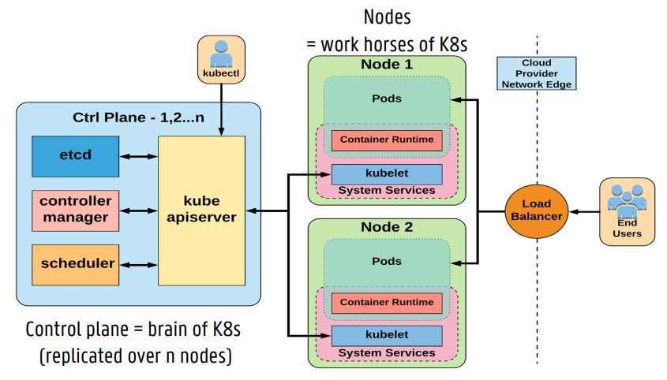

* End users: gebruikters van onze applicatie
* Nodes: onze fysieke servers
  * Eén node kan ook overeenkomen met één VM, maar Bruno zegt dat dat makkelijk kan breken.
* Control plane: stuurt aan

## Objecten

De dingen in je cluster worden voorgesteld als Kubernetes **objecten** en worden vastgelegd in een YAML. Alle objecten hebben verplicht:

* `apiVersion`: versie van Kubernetes API die wordt ondersteund door het object
* `kind`: type van object
* `metadata.name`: unieke naam van het object
* `metadata.namespace`: scope van het object. Kunnen gebruikt worden voor afscheiding te creëren. Standaard zijn er al:
  *  `default`: als je niets anders meegeeft
  * ``kube-system`: voor objecten die door kubernetes zelf zijn gemaakt
  * `kube-public`: leesbaar door alle gebruikers, voor bootstrapping en configuratie
* `metadata.uuid`: id van het object

## Multi-container Pods

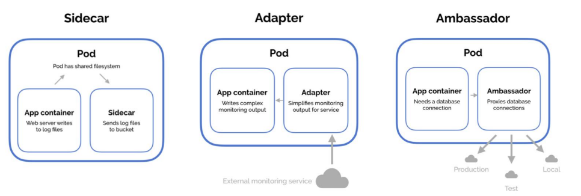

Een **pod** is een verzameling van **één of meerdere** containers met gedeelde volumes, netwerk, namespace. Deze maken deel uit van één context. Typisch maak je een pod **zo klein mogelijk**. Je kan een pod ook altijd aanspreken met REST.

Pods zijn **ephemeraal**, dit betekent dat ze op eender welk moment uitgezet kunnen worden en dat ze geen vast netwerkadres hebben.

Meestal heb je in Kubernetes maar één container per pod, maar je kan er dus ook meerdere hebben. Een pod is dus een **wrapper** rond de containers, en kan dus ook extra **sidecar** containers bevatten die 

Er zijn drie dingen die je hiermee kunt doen:

* Sidecar
  * Voorziet typisch ondersteunende functies zoals tracing, meshing, logging of monitoring. Bijvoorbeeld Prometheus.
  * Je kan meerdere sidecars hebben
* Adapters
  * Kan bijvoorbeeld de output van de monitoring versimpelen. Dus bijvoorbeeld alleen de interessante dingen eruit halen.
* Ambassador
  * Voorziet bijvoorbeeld een verbinding met een database.
  * Dit is een dure operatie, dus dan kan de ambassador bijvoorbeeld een pool van database verbindingen bijhouden  waarvan je er eentje kan nemen.

## Labels, annotaties en selectors

**Labels** zorgen ervoor dat alles **los** aan elkaar gekoppeld is. Het zijn key-value pairs die door de user ingesteld worden. Je kan een label aan eender wat hangen in je cluster (pod, host, node, ...). Het is wel belangrijk dat je uniformiteit bewaart als sysadmin. Je kan ook **annotaties** toevoegen, deze zijn extra **metadata**.

**Selectors** gebruiken labels om objecten te filteren en te selecteren. Er zijn verschillende types selectors (`nodeSelector`, ...). Ze zijn nuttig als je bijvoorbeeld je AI moet draaien op een node met een gpu van nvidia. Dan zet je in de selector `gpu: nvidia`

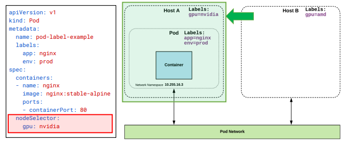

## Storage

Kubernetes voorziet een aantal verschillende manieren om om te gaan met de opslag van data. Hiervoor zijn 4 opties:

* `Volume`
  * Zit vast aan de lifecycle van een pod. Als de **pod verwijderd** wordt is de **volume weg**. Dit is nuttig voor bijvoorbeeld de cache.
  * Er kunnen meerdere verschillende volumes aan een pod hangen.
* `PersistentVolumes`
  * Blijft bestaan, zelfs als de pod weg is
  * Een pod kan niet rechtstreeks op een `persistentVolume` gekoppeld worden.
  * Verschillende access modes zoals: `ReadWriteOnce`, `ReadOnlyMany` en `ReadWriteMany`. Deze zeggen hoe hij gebruikt mag worden. `ReadWriteOnce` is bijvoorbeeld nuttig voor auditing.
* `PersistentVolumeClaims`
  * Een aanvraag voor een bepaalde hoeveelheid ruimte op een `persistentVolume`
  * Dit is belangrijk als de soort storage verandert, want zonder `PersistentVolumeClaims` is er geen **loose cloupling.** 
  * Is eigenlijk gelijkaardig aan een pod, maar neemt dan storage resouces in plaats van node resources.
  * Deze hebben ook de **access modes**
* `StorageClasses`
  * Is eigenlijk een controller
  * Zorgt ervoor dat sysadmins niet de hele tijd `persistentVolumes` moeten aanmaken
  * Een `storageClass` voorziet een manier om de storage te beschrijven die beschikbaar is 
  * Hierdoor kunnen dynamisch `persistentVolumes` gemaakt worden en is er minder werk voor de sysadmin
  * `persitentVolumeClaims `worden dan automatisch toegewezen
  * Het is wel iets complexer om op te stellen
  * Zie plaatje

Hier twee mooie plaatjes van dit geheel.

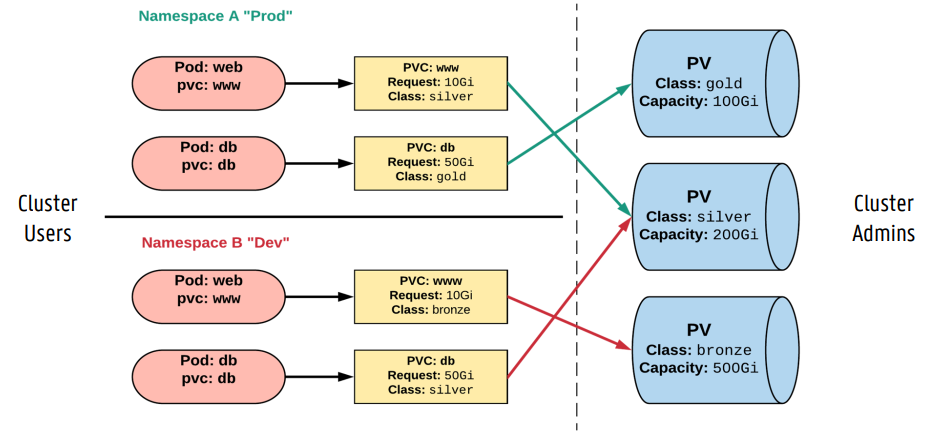

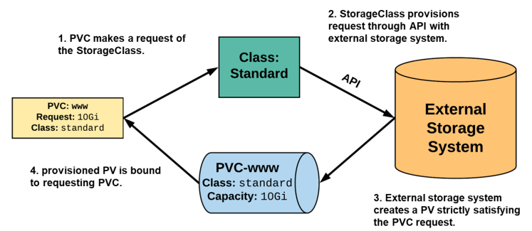

## Nodes 

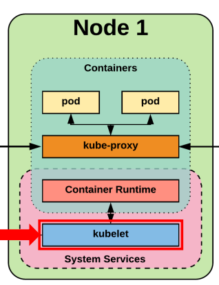

Een node bestaat uit verschillende delen

* **Kubelet**
  * Verantwoordelijk voor het beheer van de lifecycle van de node
  * Het brein
  * Beheert alleen containers/pods die door kubernetes zijn aangemaakt
* **Kube-proxy**
  * Alles wat te maken heeft met netwerk van de node
  * TCP, UDP, SCTP verbindingen of loadbalancing voor kubernetes services
  * Zorgt ervoor dat pods naar buiten kunnen communiceren
* **Container runtime**
  * Kan de container starten, afbreken en beheren
  * Verschillende opties (containerd, CRI-O, Kata, Docker, ...)

## Control plane

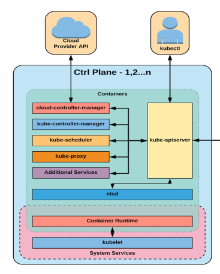

De **control plane** is het brein van Kubernetes en bestaat uit een aantal verschillende onderderelen

* <u>kube-apiserver</u>
  * Single point of entry voor de control plane
  * Voorziet een REST interface
  * Staat in verbinding met **etcd**
  * Is een soort **gatekeeper** voor de cluster
* <u>etcd</u>
  * **Key-value datastore** voor config informatie
  * Hier zitten alle YAMLs
  * Is een snel en gedistribueerd systeem
  * Kan ook netwerkpartities aan (wanneer het netwerk splitst door een fout, leader election doen)
  * Toegang wordt bestuurd in 4 stappen
    * Authenticatie: wie ben je
    * Authorizatie: wat mag je
    * Admission control: mag je doen wat je wilt doen
    * Persist: wanneer het vorige succesvol was, wordt de actie opgeslagen indien nodig
* <u>kube-controller-manager</u>
  * Probeert de hele tijd de cluster naar de desired state te krijgen
  * Beheert **control loops** om dit te doen
  * Houdt de state van de cluster in de gaten via de API server
  * Loopt over een aantal controllers die elk verantwoordelijk zijn voor één aspect van wat er moet gedaan worden
    * Node controller: ziet als er een server down is of bijkomt
    * Replication controller: we willen het correcte aantal replicas van een pod hebben
    * Service account en token controllers: maken default accounts en API access token
* <u>kube-scheduler</u>
  * **Wijst** **pods** toe aan **nodes**
  * Beslist dus welke nodes welke pods moeten uitvoeren
  * Doet default aan bin-packing
  * Je kan requirements instellen
    * Hardware requirements
    * Affiniteit/anti-affiniteit: zet mij liefst samen met die service of niet
    * Labels
* <u>cloud-controller-manager</u>
  * Een onderdeel dat de API van Kubernetes omzet naar de API calls van een cloud vendor
  * De vendors hebben allemaal een implementatie
  * Heeft een aantal controllers:
    * Node controller: nodes aanmaken
    * Route controller: netwerk configureren
    * Service controller: loadbalancer starten, IP-adressen toewijzen, ...

Hier is het volledige plaatje:

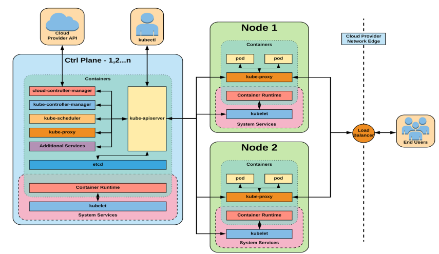

## Workloads

Een **workload** is een higher-level object en kan een applicatie of service voorstellen die je op de cluster wilt draaien. Als je een **pod template** voorziet, kan Kubernetes vanzelf pods aanmaken voor een workload. Er zijn een aantal verschillende soorten workloads:

* <u>Replicaset</u>
  * Voornaamste manier om **pod replicas** en hun lifecycle te beheren
  * Zorgt ervoor dat er altijd een gewenst aantal pods draaien
* <u>Deployment</u>
  * Biedt functionaliteit voor **updates** en **rollbacks**
  * Is een extentie van replicaset
  * Wordt gebruikt voor **stateless** appllicaties
  * Hiervoor zijn twee *strategies*:
    * **Recreate**: alle huidige pods worden gekilled voordat nieuwe worden aangemaakt
    * **Rollingupdate**: doorheen de pods gaan en selectief updaten
      * Dan kan je updaten zonder downtime doordat de loadbalancer het verkeer afleidt tijdens de update
      * met `maxSurge` kunnen er tijdens een update nieuwe replicas worden toegevoegd
      * Als er dan een probleem is kan je rollbacken
  * Met een **loadbalancer** zijn er ook nog andere deployment operaties die je kan doen
    * Canary release: maak een klein deel van de applicatie een nieuwe versie om te testen. Dan heeft maar een klein deel van de users potentiële bugs
    * A/B testing: release twee versies, gebruikers krijgen random één van de twee. Dan kan je zien welke versie het best werkt
* <u>Daemonset</u>
  * Zorg ervoor dat elke node die aan een bepaald criterium voldoet een instantie van een bepaalde pod draait
  * Bijvoorbeeld voor monitoring of log forwarding
  * Heeft ook updatestrategieën
* <u>Statefulset</u>
  * Gelijkaardig aan een deployment, maar is **stateful**
  * Houdt een **unieke identiteit** voor elke pod bij en houdt deez bij wanneer de pod opnieuw opgestart wordt
* <u>Job en cronjob</u>
  * Job: een bepaalde taak of script dat uitgevoerd moet worden, typisch wordt hier een minimale pod voor gemaakt
  * Cronjob: job die regelmatig uitgevoerd moet worden volgens een schema

## Services

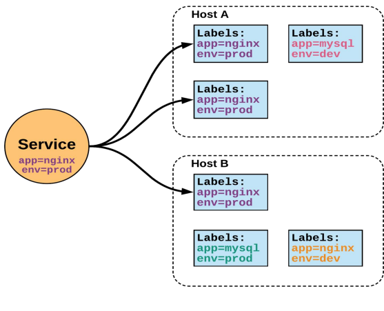

Een **service** voorziet netwerktoegang tot een set van **pods** en dient dus als entry point. De service is eigenlijk ook een soort loadbalancer en krijgt een vast IP-adres en weet welke instanties er achterliggend zitten en kan dus verkeer naar daar doorwijzen wanneer nodig. De dri voornamelijkste service types zijn:

* <u>ClusterIP</u>
  * Een service die intern moet blijven, wordt ge-exposed op een intern virtueel IP
  * Bijvoorbeeld een hulpmicroservice
* <u>NodePort</u>
  * Extensie van clusterIP
  * Ook een poort openen op op het IP van elke node 
    * is bereikbaar van **buiten de cluster**
    * Je moet wel het IP en de poort weten (IP is meestal niet statisch)
  * Gebruikers toegang geven tot de service
  * Sysadmin gaat ook de firewall open moeten zetten
* <u>LoadBalancer</u>
  * De standaard manier om services open te zetten voor kubernetes in de cloud
  * Voorziet een uniek, **publiek toegankelijk IP-adres** die alle verbindingen naar een specifieke service stuurt
  * Elke service in de cluster zal een LoadBalancer instantie nodig hebben (kan duur worden)
* <u>Ingress</u>
  * Is eigenlijk geen service type meer, maar een **controller** die een **set van regels volgt**
  * Gedraagt zich als een proxy
  * Nuttig als je **meerdere services** onder **hetzelfde adres** wilt exposen
  * Complexer om te onderhouden

## Helm, operators

**Helm** is een command-line package manager voor kubernetes die zich bezig houdt met software updates en installs of dependencies. Dit zijn dag 1 taken. 

**Operators** houden zich bezig met dag 2 management taken zoals monitoring of backups. Zij kijken of alles wel goedloopt.

## Configuratie

* Configmap
  * Niet-confidentiele data in key-value paren
  * Kunnen bijvoorbeeld als environment variables geïnjecteerd worden
* Secrets
  * Voor confidentiële data
  * Je moet een setting aanzetten om ze te encrypteren, anders is het gewoon base64

## CNCFs open cluster management

Wat als we meerdere Kubernetes clusters willen federeren? 

//TODO

# --- 5 - Infrastructure as code

Hier is een transcriptie van de laatste 30 seconden van de les van Merlijn waar hij zegt wat je moet kennen. Zo moet je het zelf niet gaan zoeken. :wink:

> Van de verschillende applicaties die ik aangehaald heb, moet je de basis kennen. *eum* Bijvoorbeeld. Hoe werkt die applicatie? Hoe werkt Ansible? Waarom is dat al dan niet declaratief? *eum* Waarvoor kan het gebruikt worden, bijvoorbeeld op het schema, waar op dat schema is het gepositioneerd. Maar je moet bijvoorbeeld niet kunnen uitleggen hoedat die code er specifiek uitziet ofzo. *eum* Van de zaken gelijk de design patterns en de infrastructure as code zelf. Dat moet wel volledig gekend zijn. (10 seconden stilte) Oké als er geen verdere vragen zijn dan zal ik jullie laten. - Merlijn

## Levels van automatie

Het doel van **Infrastructure as Code (IaC)** is om de volledige job van de systeembeheerde te automatiseren. De bedoeling is om alles vanaf het opzetten van fysieke servers tot deployen en configureren van software om te zetten in code. Dan kunnen we de tools die we gebruiken voor softwareontwikkeling toepassen op onze infrastructuur.

Doorheen de geschiedenis heeft de automatisatie van systeembeheer verschillende stappen doorlopen:

* <u>Manueel</u>
  * Er zijn een aantal problemen met manueel systeembeheer.
  * **Configuration drift**: servers die eerst identiek ingesteld zijn kunnen door updates en kleine veranderingen uiteindelijk meer en meer van elkaar verschillen. Hierdoor kan het plots dat je applicatie werkt op één server, maar niet op de andere.
  * **Scaling**: als je alle servers manueel moet instellen duurt het natuurlijk klotelang om een heel datacenter op te starten.
  * **Unexpected problems**: Wat als het datacenter in brand vliegt? Als je niet werkt met IaC moet je helemaal opnieuw beginnen met de setup van je datacenter. 
* <u>Scripting</u>
  * We gebruiken bash of powershell om taken te automatiseren? Natuurlijk zijn er ook weer problemen als je te veel van scripting afhangt
  * **Automation fear cycle**: je hebt scripts die automatisch dingen kunnen regelen in het systeem. Op een moment moet je manueel ingrijpen omdat er iets kapot gaat en wijzig je iets in de configuratie van het systeem. Nu weet je eigenlijk niet of je automatisatiescript nog juist werkt. En dus durf je ze niet meer uit te voeren en doe je alles manueel.
  * **Knowledge**: Er zijn al te weinig mensen in de IT. Specifieke scripts zijn anders voor elk bedrijf waardoor het moeilijk is om nieuwe mensen aan te nemen. Je moet elke keer mensen trainen om te kunnen werken met jouw scripts, wat ook weer tijd en geld kost.
  * **Maintenance**: Het grootste deel van het werk dat is software wordt gestoken is onderhoud. Je moet dus ook constant je eigen scripts constant opdaten als de applicatie veranderd, omdat je code onderhevig is aan **code rot**.
  * **Heruitvinden van het wiel**: Je moet eigenlijk constant dingen maken die al bestaan als je scipting gebruikt.
* <u>Code describing infrastructure</u>
  * Een systeembeheerder beschrijft wat de **desired state** is van de infrastructuur. Deze geeft hij door aan **management sofware**, die te allen tijde tracht de infrastructuur in deze staat te krijgen. Bij IaC maken we dus code die onze infrastructuur beschrijft.
  * Het doel van IaC is om de **consistentie** en **betrouwbaarheid** van het systeem te verbeteren door menselijke fouten en **environment drift** te vermijden. 
  * Door IaC **maakt** de infrastructuur eigenlijk zijn **eigen documentatie**
  * Het vergemakkelijkt de volgende dingen:
    * **Schaalbaarheid**
    * **Deployment en wijzigingen**
    * **Disaster recovery**
    * **Herbuikbaarheid**
    * **Workflow automation**
* Operators en abstractions
  * zie [operators en abstractions](#operators-and-abstractions) aan het einde van dit hoofdstuk
  * Dit is meer de toekomst

Kleine sidenote van Merlijn. Er is een vershil tussen **fault tolerance** en **disaster recovery**:

* Fault tolerance:
  * We zetten meer instanties op van onze services, dus duplicatie en backups
  * We moeten wel manueel onze service terug aanpassen om hem te dupliceren
  * Als één server platgaat moeten we ingrijpen voordat de andere ook platgaat
* Disaster recovery
  * Ga uit van het worst-case scenario. Wat doen we als alles volledig naar de klote is?
  * We slaan alles op als code, waardoor we het zo snel mogelijk kunnen terugzetten

## Geschiedenis

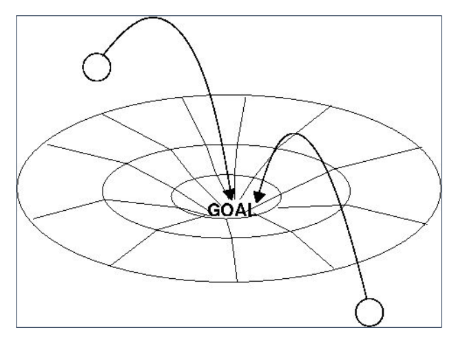

De eerste instantie van IaC was CFEngine, ontwikkeld door een fysicus genaamd Mark. Mark vond het vervelend om de hele tijd servers te configureren. Zijn oplossing was om een **declaratieve** beschrijving te voorzien van een **gewenste staat** van het systeem, waardoor je van een onverwachte beginstaat kan **convergeren** naar een verwachte eindstaat. De manier waarop die staat wordt bereikt wordt beslist door de software. Mark vergeleek die met een zwart gat. Waar je ook bent, zul je er uiteindelijk in belanden.

## Terminologie

IaC verschilt van scripting in het volgende opzicht. Bij scripting is kennis over de beginstaat vereist, dus kan je infrastructuur niet altijd convergeren naar de gewenste staat.

Een belangrijke nadruk is het verschil tussen de woorden **imperatief** en **declaratief**. Als we bijvoorbeeld een programma dat een lijst sorteert op **imperatieve** wijze programmeren, zeggen we stap voor stap **hoe** het programma dit moet doen. Als we **declaratief** werken, zeggen we simpelweg **wat** het programma moet doen. In dit geval is dat de lijst sorteren. Hoe dit gebeurt, houden wij ons niet mee bezig. Hierdoor kan de computer bijvoorbeeld zelf beslissen om taken te parallelliseren.

Merlijn gaf een mooi overzichtje van de belangrijke termen in dit hoofdstuk, dus ik neem het over:

* State: infrastructuur, software, configuratie, processen
* Desired state: wat de gebruiker wilt dat de staat is 
* Desired state priciple: een designpatroon
* Model of Manifest: configuratiebestand dat de desired state beschrijft
* Declaratief: beschrijft resultaat
* Imperatief: beschrijft acties

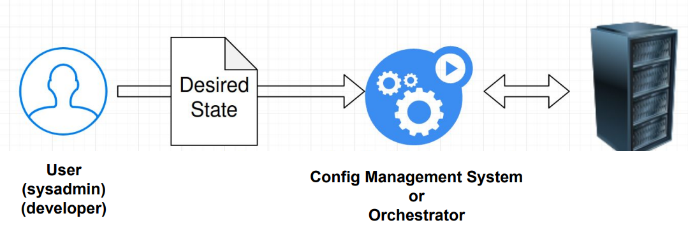

Een configuratiebeheersysteem of **orchestrator** krijgt de desired state binnen en gaat op basis daarvan de service aanpassen. Als een configuratiebeheersysteem werkt op basis van **idempotentie**, wat betekent dat het meermaals uitvoeren van een taak altijd hetzelfde resultaat geeft, zal het iedere keer opnieuw alle taken uitvoeren om het systeem in de desired state te houden. Het configuratiebeheersysteem is pas zeker dat het systeem zich in de juiste staat bevindt als alle taken zijn uitgevoerd.

Een configuratiebeheersysteem gebaseerd op **convergentie** zal eerst kijken welke acties er moeten uitgevoerd worden, en vervolgens de nodige acties uitvoeren. Als het systeem in de juiste staat is worden er geen acties uitgevoerd. Als je geen oen bent zie je dat deze oplossing sneller is.

Nog iets dat handig is om te weten is dat Linux inherent **niet declaratief** is. Alle tools maken een imperatieve interface voor Linux commano's. 

## Config management tools

### Ansible

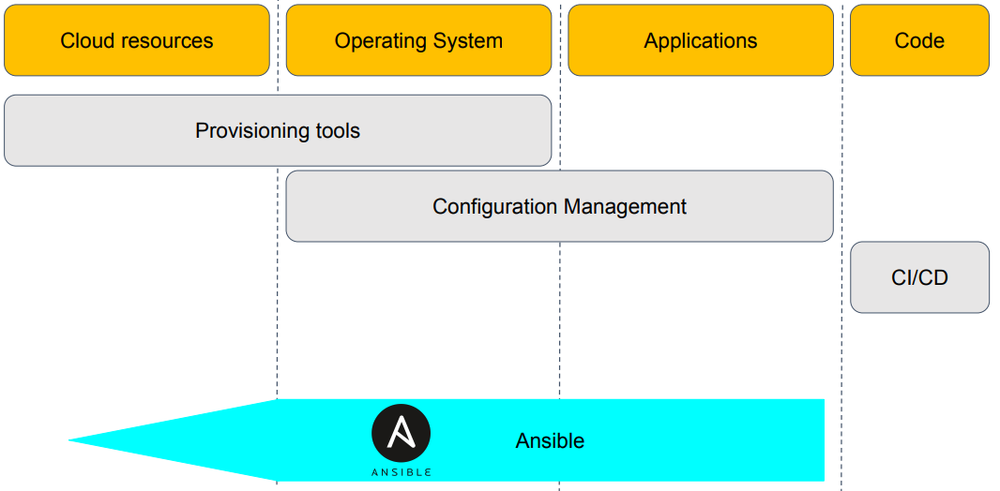

Ansible is een tool voor configuratiebeheer die zich focust op het beheren en installeren van besturingssystemen en services. Eigenlijk is Ansible wel imperatief. Een playbook is een YAML met commando's die in volgorde uitgevoerd worden. Met ieder commando in een playbook voer je een module uit, waaraan je configuratie geeft. De configuratie van de meeste modules is wel declaratief. Elke module is een Python script dat wordt uitgevoerd op de servers.

Hier een overzicht van de belangrijkste onderdelen van Ansible:

* <u>Playbooks</u>
  * Een YAML file waarin **taken** beschreven staan. Deze worden sequentieel uitgevoerd.
  * Ookal is Ansible cross-platform, zijn de playbooks die je schrijft vaak wel **platformspecifiek**.
  * **Statisch herbruikbaar**. Je kan één playbook gebruiken om meerdere machines te configureren.
  * Onderverdeeld in **plays**. 
* <u>Task</u>
  * Eén uitvoering van een module
* <u>Role</u>
  * Is een verzameling van **templated** taken en gerelateerde content
  * Dynamisch herbruikbaar
  * Kan je bijvoorbeeld van het internet halen en aanpassen naar jouw use-case

### Terrraform

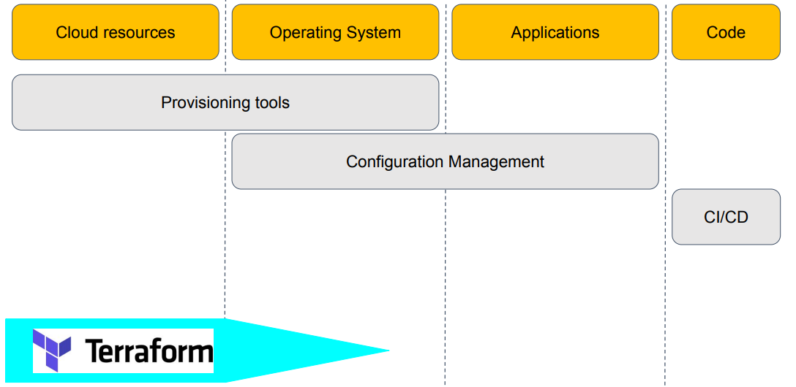

Terraform dient vooral voor infrastructuur. Het houdt zich bezig met het opzetten van servers, virtuele netwerken, gateways, ... Terraform is een **volledig declaratieve** taal. Het maak niet uit in welke volgorde verschillende resources in de code worden beschreven. Als er dependencies zijn tussen servers moet je dit expliciet vermelden.

Terraform is cross-platform en cross-cloud, maar als je een model maakt voor Amazon kan je het natuurlijk niet gebruiken voor Azure. Hieronder een overzicht van de belangrijkste onderdelen van Terraform:

* Configuration
  * Een bestand dat de beschrijving van meerdere **resources** bevat. Een voorbeeld van een resource is een server.
  * Hierin beschrijf je je infrastructuur: "ik wil deze server van deze provider"
  * Om te voorkomen dat je dingen per ongeluk verandert kan je *terraform lock* gebruiken
* Providers
  * Plugins die gebruikt worden door terraform om de resources te beheren
* Modules
  * Dit zijn herbruikbare terraform configuraties
  * Er bestaat bijvoorbeeld een module om Kubernetes op te zetten
* Registry 
  * Online repository van alle modules

Als je Terraform gebruikt op bestaande infrastructuur, is het mogelijk om een plan te laten genereren voor de servers die je al had. Dan kan je ze vanaf dat moment aanpassen met Terraform. Verder wordt Terraform vaak in combinatie met Ansible gebruikt. Terraform wordt dan gebruikt om de servers en het netwerk op te zetten. Ansible wordt gebruikt om hun configuratie aan te passen.

### Chef

Chef is een vreselijke tool om documentatie voor op te zoeken, want chef gebruikt termen zoals *cookbook* en *knife* voor verschillende concepten, maar wordt toch ontzettend veel gebruikt. Onder andere door Facebook. Chef is inherent **imperatief**. Je schrijft de desired state in ruby code, waardoor je ook per ongeluk een script kan schrijven als je niet goed nadenkt. Je kan met Chef servers aanpassen doormiddel van **resources** met een declaratieve configuratie. Deze gebruiken wel allemaal het **desired state principle**, dus je moet opletten dat je alleen de resources gebruikt en niet gewoon ruby begint te schrijven om je infrastructuur te configureren.

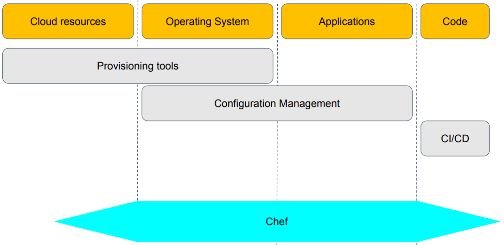

Chef is ook weer cross-platform op de manier dat de vorige twee tools cross-platform waren. De tool is ondertussen zodanig uitgebreid dat je er bijna alles mee kan.

De belangrijkste onderdelen van Chef zijn:

* Cookbook
  * Bevat meerdere recipes
  * Is een templated model van een desired state dat je kan gebruiken om licht verschillende infrastucturen mee op te zetten
* Recipe
  * Bevat meerdere resources
* Resource
  * Beschrijft de desired state
* Chef supermarket
  * Bevat code van de community

### Puppet

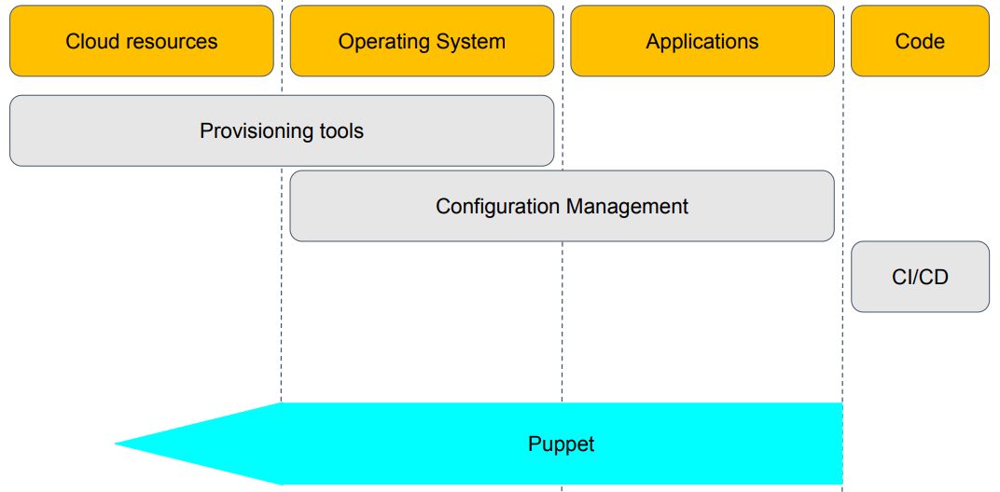

Puppet is gelijkaardig aan Ansible in de zin dat je er dingen mee kan configureren, maar je kan er ook clour resources mee aanmaken. Puppet is **volledig declaratief**, wat impliceert dat de volgorde van uitvoering van taken niet vast ligt. Je moet dus net zoals bij Terraform expliciet dependencies vermelden. Puppet werkt d.m.v. een agent op elke server. Deze halen allemaal hun desired state op bij een master.

Puppet is heel goed voor cross-platform, je moet een minimale hoeveelheid aanpassingen doen om te veranderen van platform.

### Juju

Vreemde eend in de bijt. Juju is één van de enige tools die alles van cloud resources tot applicaties kan regelen. Juju is **volledig declaratief**, doordat je een YAML model maakt waarin je beschrijft wat de desired state is. Verschillende agents halen de desired state van een controller. Je beheert de infrastructuur door een **model** aan te maken, waarin je beschrijft welke charms je wilt gebruiken. **Charms** stellen elk een service voor zoals Kubernetes of OpenStack. Juji is gemaakt voor zeer complexe applicaties die bestaan uit veel verschillende componenten die op een complexe manier aan elkaar hangen. 

Juji is in theorie cross-platform, maar werkt eigenlijk alleen goed op Ubuntu.

Juju is anders dan de andere tools omdat over **relaties** beschikt. De manier dat een charm in Juju geconfigureerd wordt hangt af van met welke andere Charms hij verbonden is. Als er dus een nieuwe Charm toegevoegd wordt, worden de verbonden Charms dynamisch geherconfigureerd. Dan moet je niet al die andere Charms zitten aanpassen als je iets toevoegt.

Je kan charms downloaden of implementeren in eender welke taal.

Het grootste probleem aan Juju is dat je vaak zelf naar beneden moet gaan tot het niveau van charms schrijven. Voor bijvoorbeeld Puppet of Ansible zal je dit zelf nooit moeten doen. Bij Juju is het model veel meer high-level. Juju heeft een heel lage entry barries, maar als je dieper wilt gaan wordt het heel erg moeilijk.

### Desired state configuration (DSC)

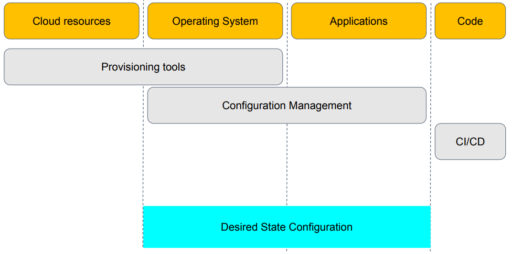

Dit is een tool van Microsoft en maakt gebruik van PowerShell en is **declaratief** door middel van PowerShell objecten. Het bestaat uit de volgende onderdelen:

* Agent (Local configuration manager)
* Configuration
  * Bevat ten minste één resource en één node
* Resource
  * Declaratieve beschrijving van de desired state
* Node
  * De externe host waarop de desired state moet toegepast worden

DSC werkt een beetje vreemd. Je schrijft eerst een imperatief script, en dat wordt dan omgezet naar een declaratief model. Dit resulteert in een `.mof` file. Deze file deploy je op een windows server node met **Push**, of je configureert een **Pull** server waaruit de nodes periodiek hun `.mof` files en DSC resources halen. 

### Kubernetes

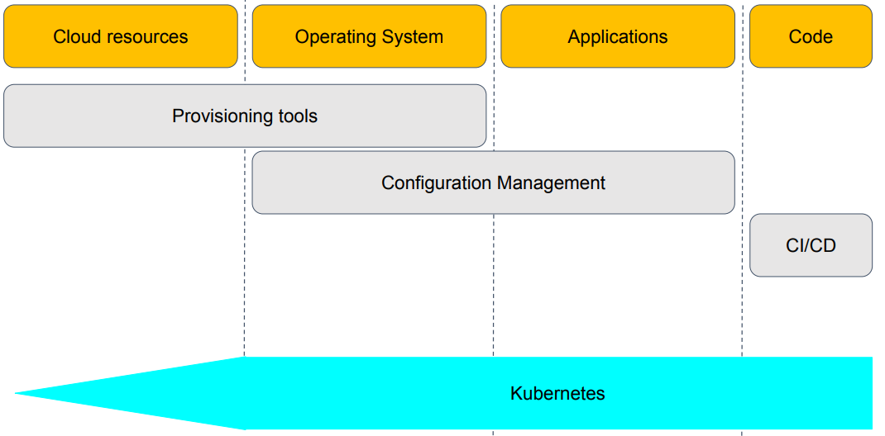

Kubernetes kan voor alles gebruikt worden. Het werkt ook volgens het **desired state principe** en is eigenlijk veel meer dan een container orchestrator. Je kan bijvoorbeeld ook Kubernetes gebruiken om een nieuwe Kubernetes cluster op te zetten. 

De beste eigenschap aan Kubernetes is dat het een gestandaardiseerde API voorziet voor systeembeheerders om te interageren met de code die de infrastructuur en applicaties beheert. Bovendien kan deze API ook gebruikt worden je infrastructuurcode te laten interageren met andere infrastructuurcode.

Kubernetes bevat default al een aantal APIs:

* Ingress controller (Citrix ADC)
* Overlay network (Calico)
* ClusterAPI (VMware vSphere)
* Cloud controller manager (Amazon AWS)
* Cloud service integration

 <small>1:34:52</small>

## Operators and Abstractions

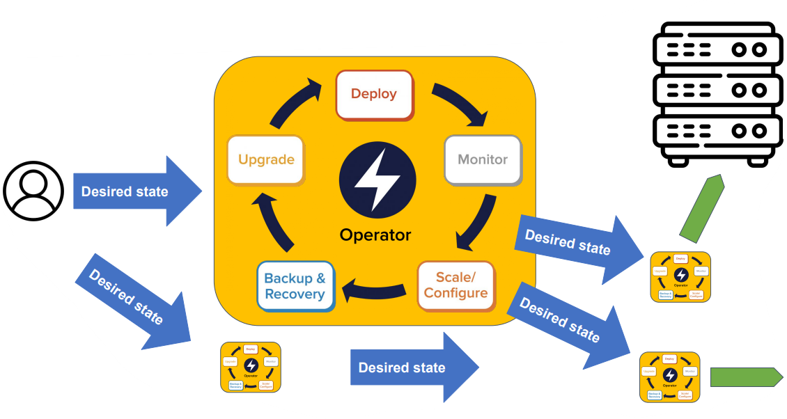

Dit is de laatste stap in automatisatie. De dingen die hier verteld worden zijn dingen die we in de toekomst willen.

In softwareontwikkeling maken we heel veel abstracties. We gebruiken laag op laag op laag van verschillende software die abstactie maakt van de onderliggende lagen, waardoor wij als programmeur ons enkel moeten bezighouden met de laag waarin we ons bevinden. 

We kunnen dit ook in systeembeheer door middel van een **operator**. Als we een bepaald ding willen opzetten zeggen we aan de operator wat we willen, deze roept dan zelf onderliggende modules aan zonder dat wij deze moeten begrijpen. Een operator doet veel meer dan enkel deployment, en werkt op een veel meer dynamische manier dan de klassieke configuratiebeheertools. De operator houdt zich buiten deployment ook bezig met het upgraden, monitoren, schalen en back-uppen van je infrastructuur. Ookal communiceer je met de operator via een desired state, zal de operator deze op een heel dynamische wijze toepassen.

## IaC design patterns

Hier een oplijsting van IaC design patterns:

* Een oplossing voor de Automation fear cycle ([hier](#levels-van-automatie) uitgelegd)
  * **Unattended Automation**:
    * Dan zijn we steeds 100% zeker dat de huidige staat de verwachte staat is
    * Als er is misloopt ga je dat direct zien, en zal de configuratie direct terug worden overschreven door de automatisatie
    * Dit maakt het ook moeilijker voor hackers
  * **Re-use & promote definitions**
    * Gebruik dezelfde definition files voor dev, staging en production
    * Dan moet je alleen maar wat variabelen aanpassen
* **Cattle, not pets**
  * Als je een uniek systeem hebt waar elke server onvervangbaar is, kan je de servers vergelijken met **huisdieren**. Dit is niet goed, want je moet je hond eten geven en naar de dierenarts als hij ziek is en als je hond sterft moet je huilen en dan doet de dierenarts die naar het hondencrematorium en dan krijg je nog een brief of je wilt bijbetalen om de assen van je hond te laten opsturen naar je huis (been there)
  * Het is dus beter om je servers te zien als **vee**. De servers worden beheerd door geautomatiseerde tools en zijn vervangbaar. 
* Duplicatie
  * We hebben microservices met ieder een eigen databank. Hoe kunnen we hierop duplicatie toepassen?
  * **Forking**
    * Het declaratief model forken en hergebruiken
    * Het voordeel is dat je **tight coupling vermijdt** en kan omgaan met verschillende requirements
    * Maar dan met je ook weer omgaan met **divergentie** en **inconsistentie**
      * Kan je wel oplossen met git, maar is wel vervelend
  * **Definition libraries**
    * Meer abstract. Maak bijvoorbeeld een cookbook die een mySql cluster opzet. Die cookbook heeft dan een paar variabelen om de werking van de cluster lichtjes aan te passen. Die cookbook dan dan overal opnieuw gebruikt worden
    * Je hebt dan een infrastructuurteam nodig die de cookbooks maakt
    * Het is hier moeilijk om tight coupling te vermijden. Code ownership is ook een probleem
    * Je moet oppassen dat je niet wijzigingen aan de CI/CD pipeline van de developers aanbrengt terwijl zij wijzigingen aan de applicatie aanbrengen, want dan heb je problemen. Daarom is het belangrijk om een aparte pipeline te hebben voor de infrastructuur.
* Gedeelde elementen
  * Bijvoorbeeld een loadbalancer. Elke keer dat een developer iets nieuws toevoegt, moet hij een aanpassing maken in de loadbalancer. 
  * We willen eigenlijk niet dat de developers de hele tijd aan de systeembeheerders moeten vragen om iets aan te passen.
  * **Oplossing**: optimaliseer de architectuur om zo weinig mogelijk gedeelde elementen te hebben en wijzigingen zo makkelijk mogelijk te maken

<small>1:51:48</small>

## Declarative Linux

De meeste Linux-distributies werken nu bijvoorbeeld wel al met een declaratieve configuratie van het netwerk. (netplan, systemd-networkd)  Hierna gaf Merlijn een hele boel voorbeelden maar ik denk niet dat ik in zo veel detail ga gaan.

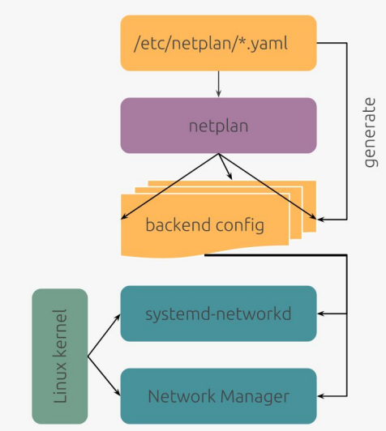

Het komt erop neer dat netplan een high-level declaratieve taal is waarmee je beschrijft hoe je wilt dat je netwerk eruit ziet. Dat wordt dan omget naar een backend netwerk configuratie voor systemd-networkd voor servers of bijvoorbeel Network Manager voor Desktop Ubuntu gebruikers. 

Een voorbeeld van een declaratieve Linux distributie is **NixOS** en wordt vaak gezien als een package manager, maar is meer dan dat. Je kan eigenlijk alles declaratief instellen. Hier is een plaatje van NixOS.

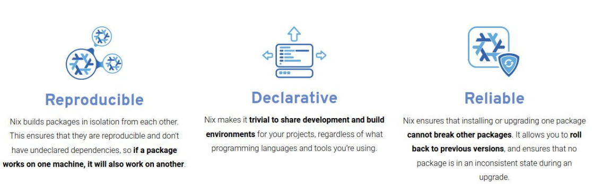

Het is gemaakt door Nederlanders dus de naam NixOS is waarschijnlijk een mop. 

# --- 6 - Monitoring ---

> Enkel dat laatste stuk over Dynamo is geen onderdeel van het examen. De rest is wel examenleerstof. Ik kan niet hetzelfde goeie nieuws geven als bij PowerShell. - Jericho

//TODO

# --- 7 - Storage Virtualization ---

//TODO

# Examenvragen

Ik heb net een ontdekking gemaakt. Ik weet niet hoe dit mij is ontsnapt, maar blijkbaar zet Bruno een icoontje op elke slide waarvan hij vindt dat je hem moet kennen. Het icoontje in kwestie:

## Voorbeeldvragen

Voorbeeldexamenvragen van Bruno:

* What three types of storage virtualization exist? What are their main properties? What benefits and drawbacks do they offer?
* What advantages do network-based methods for storage virtualization offer compared to array-based methods?
* What three types of network-based storage virtualization exist? What are their main properties?
* What is hyperconvergence? Discuss how this can be enabled based on one specific technology that was discussed in this class.

## Van de les

Elke keer dat Bruno zegt dat je iets moet kennen voor het examen.

### Cloud

> Wat wordt bedoeld met Cloud. Leg uit. (Cloud slide 3)

> Geef de voordelen van virtualisatie.  (Cloud slides 56-59)

> Hoe is virtualisatie geëvolueerd doorheen de jaren? Leg de verschillende stappen uit en bespreek de veranderingen. Teken de figuurtjes. (Cloud slide 61)

> Wat is de vierde vorm van virtualisatie? (Cloud slide 68)

> Leg het verschil uit tussen VM-based virtualisatie en OS-level virtualisatie. Maak een tekening. (Cloud slide 69)

> Geef de open IAAS oplossingen en beschrijf ze. (Cloud slide 76)

Openstack is de belangrijkste, maar zeer complex

> Welke standaarden zijn er voor virtualisatie? Geef volledige namen (Cloud slide 86)

> Vergelijk kubernetes met openshift.

### Windows server

> Leg het principe van shielded VMs uit aan de hand van een figuur. (Windows server slide 15)

>  Wat is een Privileged Access Workstation? Hoe wordt deze best geconfigureerd? Wat doet een Jump Server in deze context? (Windows server slide 22)

> Wat is PXE booting? Leg uit en beschrijf de vershillende stappen. (Windows server slide 35)

> Wat is Active Directory? Waarvoor wordt het gebruikt en waarom is het nuttig? (Windows server slide 43)

> Leg het verschil uit tussen een Workgroup en een Domain. Wat komt daar allemaal bij kijken? (Windows server slide 44)

> Wat is een domain controller? Wat zijn de implicaties?

> Leg uit: Forest, Domain. Wat zijn de redenen om meerdere domains te hebben

### Kubernetes

> Wat is Kubernetes? Wat zijn de belangrijkste concepten?

> Wat is de high-level architectuur van Kubernetes? Teken en leg uit.

> Leg uit waarvoor multi-container pods gebruikt kunnen worden

> Beschrijf labels, annotaties en selectors. Wat zijn ze, wat doen ze en waarom worden ze gebruikt. Geef een eigen voorbeeld.

> Wat zijn de opties voor storage in Kubernetes?

> Wat is een storageClass? Leg uit een teken.

> Teken een Kubernetes node. Leg de vershillende onderdelen uit.

> Teken de structuur van de Control Plane van Kubernetes en leg uit.

> Beschrijf Kubernetes aan de hand van de architecturale figuur. Leg elk onderdeel uit.

> Leg de principes uit van Kubernetes workloads. Doe dit aan de hand van een figuur.

> Je hebt een applicatie met meerdere services. Hoe zou je dit deployen op Kubernetes?

onderscheid stateful/stateless ...

> Welke soorten services worden er voorzien door Kubernetes? Leg elke service uit.

### Infrastructure as code

Merlijn heeft niet specifiek gezegd wat we moesten kennen dus de vragen hier zijn verzonnen door mij op basis van zijn uitleg op het einde van de les.

> Wat zijn de nadelen van manueel systeembeheer?

//TODO

### Monitoring

//TODO

### Storage virtualization 

//TODO

## Van mij

allemaal nog //TODO

> Geef een aantal voorbeelden van cloud services.

* Online data storage/retrieval
* Enable access to online applications
  * Gmail, google slides, ...
* Provide computing platform and computing infrastructure

> Is IT-as-a-service een nieuw concept?

Nee, vanaf de jaren 30 (voor computers) verhuurt IBM al hun elektrische accounting machines aan bedrijven om berekeningen te maken. In de 70s was er timesharing en in de 90s was er grid computing. 

Ik denk dat deze vraag nogal nutteloos is maak ja ik ga hem nu niet verwijderen.

> Welke verschillende cloud models zijn er en wat houden ze in? (cloud slide 46, 01h55)

* On premises
* Infrastructure as a service
* Platform as a service
* Software as a service

> Waarom is de performantie van een applicatie op virtuele machines typisch lager dan op fysieke hardware?

Voor virtuele machines in de cloud wordt typisch generische hardware gebruikt. Daarboven zit dan een abstractielaag waarboven er virtuele hardware wordt gesimuleerd.

//TODO

> Wat zijn de voordelen van containers?

//TODO

