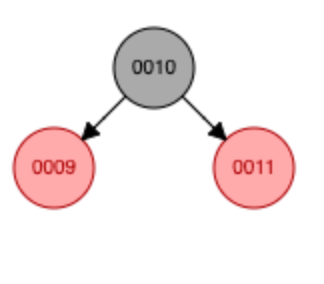
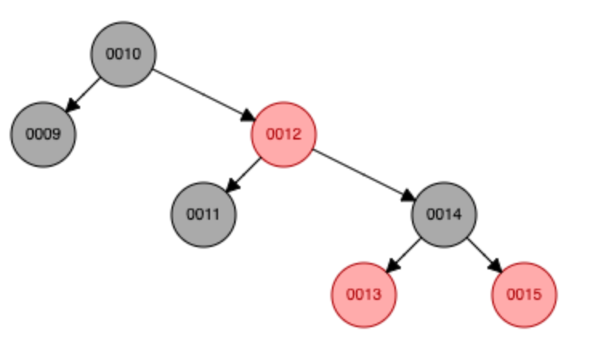
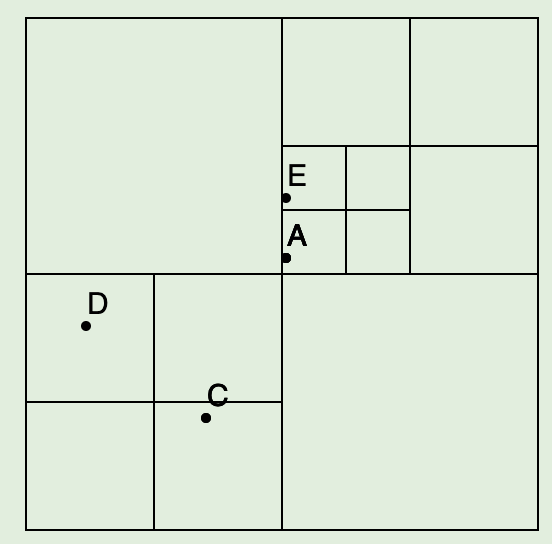
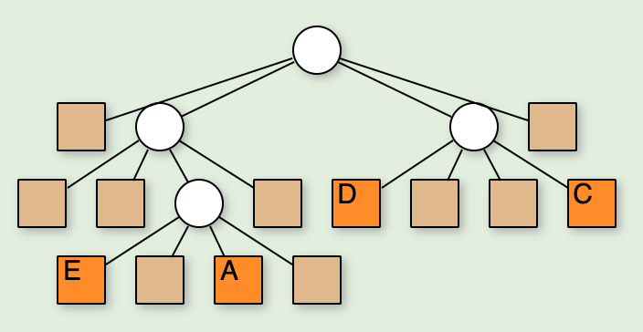
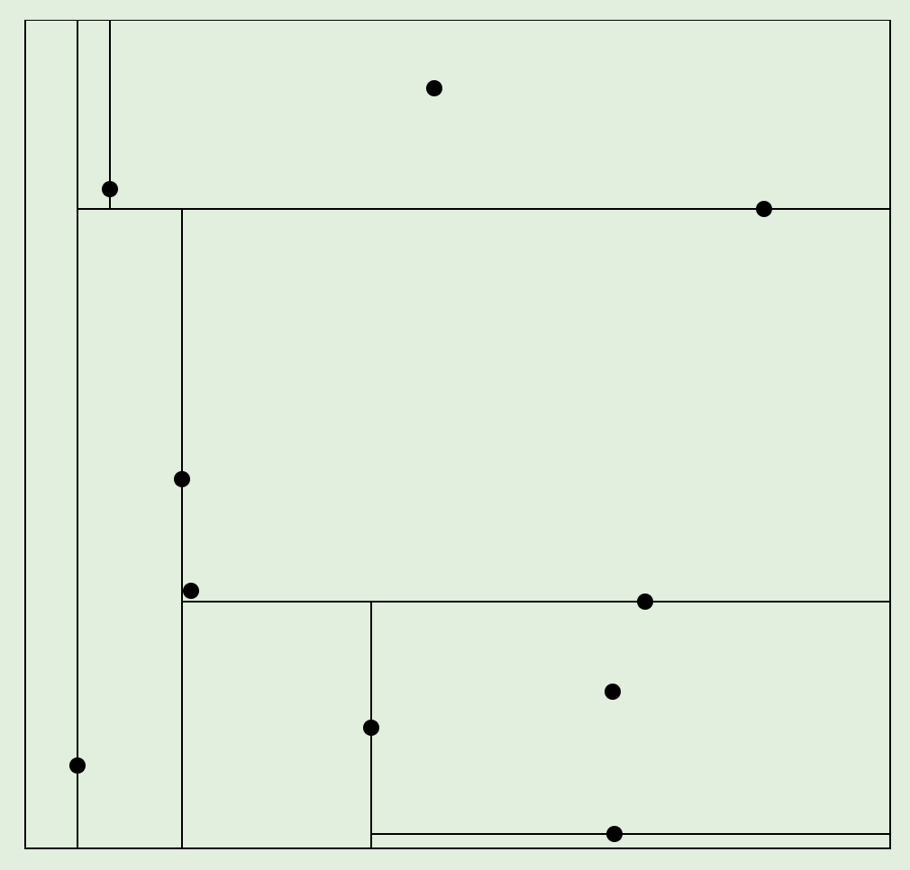
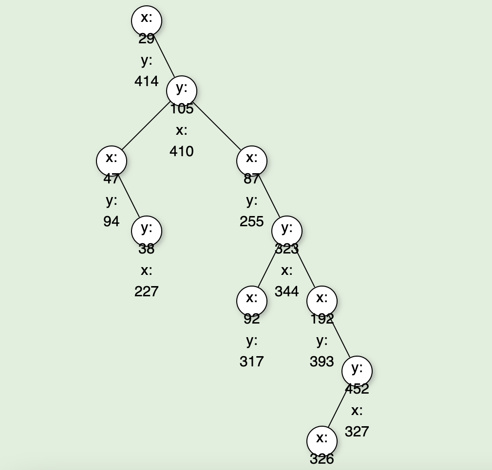
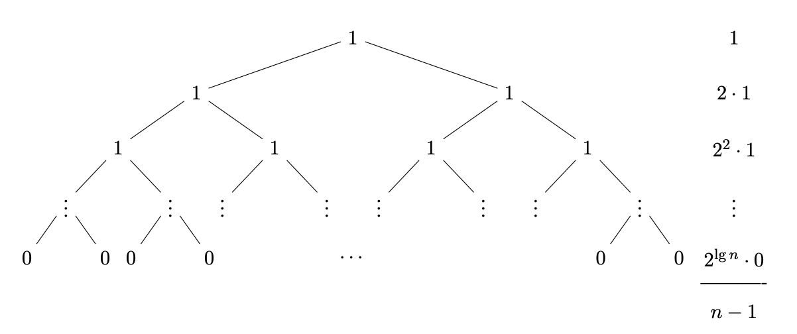
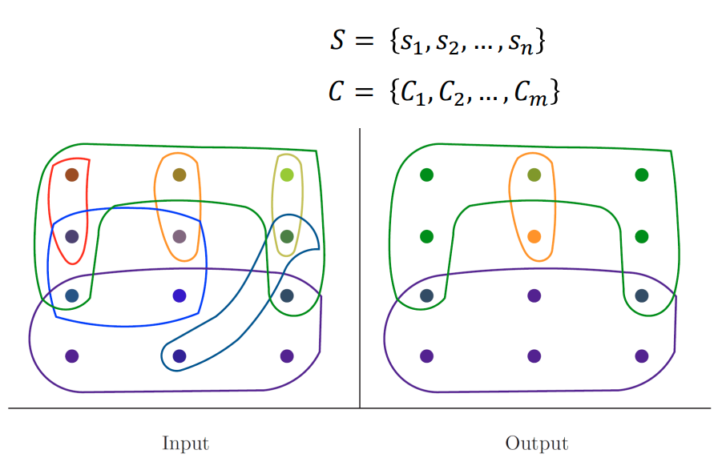

# Algoritmen oefenexamen (oplossingen)

## Red-black trees

**Voeg de reeks 12, 13, 14, 15 toe aan onderstaande rood-zwarte boom.**





---

**Toon aan dat een rood-zwarte boom ten minste $2^{ZH(x)} - 1$ interne knopen bevat.**

Bewijs via inductie:

* Boom met hoogte 0: $2^0 -1 = 0$
* Boom met hoogte 1: $2^1 - 1 =1$
  * Zwarte wortel met 2 virtuele kindknopen

Neem willekeurige knoop $x$ met zwarte hoogte $w = ZH(x)$.

Zijn kinderen hebben elk ofwel:

* Zwarte hoogte $w$ als het kind rood is, dus $2^{w} - 1$ kindknopen
* Zwarte hoogte $w-1$ als het kind zwart is, dus $2^{w-1} - 1$ kindknopen

Het aantal knopen in de boom is de wortel plus de som van het aantal knopen in zijn linker en rechter deelbomen. Het aantal kindknopen in eender welke van de twee deelbomen is minstens $2^{w-1} - 1$.
$$
\begin{align}
 &\geq 1 + 2(2^{w-1} - 1)\\
 &\geq  2^{w} -1


\end{align}
$$


---

**Bewijs dat de hoogte van een red-black tree $O(\log n)$ is.**

* Een rode knoop heeft altijd 2 zwarte kinderen
* Minstens de helft van de knopen op het pad tussen de wortel en een virtuele knoop is zwart.

Een rood-zwarte boom bevat ten minste $2^{ZH(x)} - 1$ interne knopen:
$$
\begin{align}
ZH(\text{wortel}) &\geq \frac h 2 \\
n &\geq 2^{\frac h 2} - 1 \\
n +1  &\geq 2^{\frac h 2}  \\
\log(n +1)  &\geq \frac h 2 \\
2\log(n +1)  &\geq h \\

\end{align}
$$
De hoogte is dus $O(\log n)$.


## Meerdimensionale gegevensstructuren

**Teken de resulterende PR-Quadtree bij het toevoegen van de volgende punten. Maak ook een tekening in boomvorm. Alle punten vallen binnen [0, 255]**

A(130, 120)

C(90, 200)

D(30, 154)

E(130, 90)






---

**Teken de resulterende KD-tree bij het toevoegen van de volgende punten. Maak ook een tekening in boomvorm. Alle punten vallen binnen [0, 500]**

(29, 414), (410, 105), (87, 255), (47, 94), (227, 38), (344, 323), (92, 317), (192, 393), (327, 452), (326, 373)






---

**Waardoor wordt de hoogte van een PR Quadtree bepaald? Bewijs.**

De hoogte van een PR Quadtree wordt bepaald door de kleinste afstand $a$ tussen twee knopen, aangezien er telkens dieper gesplitst zal moeten worden totdat elk punt zijn eigen vakje heeft.


Neem $z$, de grootste zijde van de zoekruimte. Dit is 100 in het plaatje hierboven. De grootste zijde van een gebied op diepte $d$ is:
$$
\frac z {2^d}
$$


De maximale afstand tussen twee punten in dat gebied is gelijk aan de lengte van de diagonaal:
$$
\frac{z\sqrt 2}{2^d}
$$
Deze afstand is groter dan of gelijk aan onze minimale afstand $a$. 
$$
\frac{z\sqrt 2}{2^d} \geq a \\
\frac{z\sqrt 2}{a} \geq 2^d \\
\log (\frac{z\sqrt 2}{a}) \geq d \\
\log \frac z a + \log \sqrt 2 \geq d \\
$$
De hoogte $h$ is de maximale diepte van van een inwendige knoop plus één. $h = d + 1$.  Stel je het zo voor. We zitten nu op $d$, het diepste gebied waar nog 2 knopen in zitten. Dan is het logisch dat we nog eentje dieper moeten gaan. Vul dit nu in in de vergelijking van hierboven en je krijgt:
$$
h \leq \log \frac z a + \frac 3 2
$$
Kleine opmerking, dit bewijs is voor een PR Quadtree met 2 dimensies. Voor $k$ dimensies moet je $\sqrt k$ nemen in plaats van $\sqrt 2$.


## Efficiëntie van algoritmen

**Sorteer de volgende functies in aflopende orde van toename.**
$$
 \log \log n \quad C \quad
2^n\quad \log n\quad n! \quad  \quad n^{1+\alpha} \quad n \log n   \quad
 n^\epsilon 
$$

$$
n!>> 2^n >> n^{1+\alpha} >> n \log n  >> n^\epsilon >> \log n >> \log \log n >> C
$$

---

**Geef een $\Theta$ afschatting voor het volgende algoritme.**

```c++
int functie(vector<int>& v){
  int result = 0;
    int n = v.size();
    for (int i = 0; i <= n; i*=2){	
      for (int j = 0; j < n; j++){
      	result += v[j];
      }
    }
  return result;
}
```

$$
\begin{align}
T(n) &= \sum_{i=1}^{K} \sum_{j=0}^{n-1} 1 \\
&= \sum_{i=1}^{K}n \\ 

&= nK \\
&= n\lfloor \log n \rfloor

\end{align}
$$

De uitvoeringstijd bedraagt $\Theta(n\log n)$.


---

**Stel een recurrente betrekking op voor het volgende algoritme en vorm om naar een gesloten uitdrukking.**

```c++
int factorial(int n){
  if (n == 0) return 1; 
  else return n*factorial(n–1);
}
```

$$
T(n) = \begin{cases}
T(n-1) +1  &\text{ als } n \geq 0 \\
0 &\text{ als } n=0

\end{cases}
$$

$$
\begin{align}
T(n) &= T(n-1) + 1 \\
&= (T(n-2)+1)+1 = T(n-2)+2 \\
&= T(n-3) + 3 \\
&= \dots \\
&= T(0 +n) \\
&= n
\end{align}
$$


---

**Gegeven een recursief algoritme dat de som van een tabel berekent door de tabel telkens in 2 te splitsen. **

```c++
int somBinaireRecursie(const vector<T>& v, int start, int stop){
	if(start >= stop) return 0;
  
  if(start == (stop -1)) return v[start];
  
  int mid = start + (stop - start)/2;
  
  return somBinaireRecursie(v, start, mid) + somBinaireRecursie(v, mid, stop);
}
```

**Stel een recurrente betrekking op en geef een afschatting voor de uitvoeringstijd op basis van de invoer $n$**
$$
T(n) = \begin{cases}
T(\lfloor \frac n 2 \rfloor) + T(\lceil \frac n 2 \rceil) + 1  &\text{ als } n \geq 2 \\
0 &\text{ als } n=0


\end{cases}
$$
We negeren de floor en ceil en verkrijgen:
$$
T(n) = \begin{cases}
2T( \frac n 2 ) + 1  &\text{ als } n \geq 2 \\
0 &\text{ als } n=0

\end{cases}
$$
Nu kunnen we een boom maken. 



We moeten we wel nog weten hoe diep hij is. Op elk niveau verdubbelt het aantal elementen in de boom. Als we dus $n$ nemen en hem $h$ keer delen, zullen we een getal tussen $1$ en $2$ krijgen:
$$
1 \leq \frac{n}{2^h} < 2
$$
Met $h$ de hoogte van de boom en $n$ het aantal elementen. We kunnen dit omvormen naar:
$$
h \leq \log n < h+1 \\
h = \lfloor \log n \rfloor
$$
In het slechtste geval is de boom volledig gevuld en kunnen we dus stellen dat $h= \log n$. Onze totale uitvoeringstijd is de som van de uitvoeringstijd in alle knopen.
$$
\begin{align}
T(n) &= 2^0 + 2^1 + 2^2 + \dots + 2^{\log n -1}-1 \\
&= 2^{\log n } -1\\
&= n-1\\
&= O(n)
\end{align}
$$

---

**Wat is de efficiëntie van quickselect in het beste, gemiddelde en slechtste geval?**

**Beste geval**

Geen recursieve oproep, dus er zijn maar $n-1$ sleutelvergelijkingen nodig. Dus $\Theta(n)$

**Slechtste geval**

Als de pivot bij elke recursieve oproep het grootste of het kleinste element is, wordt de oproep telkens gedaan op $n-1$ elementen:
$$
\begin{align}
T(n) &= n-1 + T(n-1) \\
T(n-1) &= n-2 + T(n-2)\\
&\space \space \vdots \\
T(n) &= n-1 + n-2 + \cdots + 1\\ &= \frac{(n-1)n} 2
\end{align}
$$
In het slechtste geval zal het $k$-de kleinste element dat we zoeken telkens in de grote deeltabel terecht komen. Dan is quickselect $\Theta(n^2)$

 **Gemiddeld geval**

Het gemiddeld geval is iets moeilijker. We veronderstellen de de pivot random wordt gekozen. 
$$
T(n,k) = n-1 + \frac 1 n \left( \sum_{i=1}^{k-1} T(n-i, k-i) + \sum_{i=k+1}^n T(i-1, k) \right)
$$
Die twee sommen hier stellen blijkbaar alle mogelijke posities $i$ van het gekozen spilelement voor. Komt uit op $O(n)$.

## Algemene sorteermethodes


**Wat is de performantie van insertion sort in het slechtste, gemiddelde en beste geval? Waarvoor wordt insertion sort vaak gebruikt en waarom?**

* De buitenste lus wordt $n-1$ keer uitgevoerd.
* Het aantal iteraties van de binnenste lus hangt af van de invoer. We gaan dus onderscheid maken tussen het beste, slechtste en gemiddelde geval.

Als we twee elementen $a[i] $ en $ a[j]$ uit de tabel nemen, met $i<j$. Dan vormen deze twee een **inversie** als $a[i] > a[j]$. Een inversie is dus simpelweg **een paar elementen dat op de verkeerde volgorde staat**. Om een beter zicht te krijgen op de performantie van ons algoritme, gaan we het aantal inversies tellen. Afhankelijk van dit aantal, kunnen we een onderscheid maken tussen drie gevallen.

**Slechtste geval**

De rij staat achterstevoren, elk paar elementen vormt een inversie. Dit zijn er $n(n-1)/2$, en is dus even veel als het aantal sleutelvergelijkingen. We komen op $\Theta(n^2)$.

**Beste geval**

De tabel staat in volgorde en er zijn geen inversies. We moeten de tabel dus maar één keer $(n-1)$ overlopen: 

**Gemiddeld geval**

We veronderstellen dat elke permutatie van de elementen even waarschijnlijk is. Dan bekomen we $n(n-1)/4$. Dit is nog steeds $\Theta(n^2)$, maar dan met een verborgen factor van $0.5$.


Wat insertion sort zo nuttig maakt, is dat zolang het aantal inversies $O(n)$ is. Onze uitvoertijd $\Theta(n)$ zal zijn. Dit is weliswaar alleen het geval wanneer onze rij al bijna helemaal gesorteerd is. We gebruiken insertion sort dus vaak in de laatste fase van efficiëntere algoritmen.


---

**Geef een big O afschatting voor de performantie van heapsort en bewijs.**

We transformeren onze rij tot een max-heap. Dit kan in $O(n)$ door het samenvoegen van deelheaps. Nu staat het grootste element vanboven. De bedoeling is nu dat we dus telkens het grootste element pakken en deze achteraan in de tabel gooien. Nu herstellen we de heapvoorwaarde op onze heap die nu één elementje kleiner is en herhalen dit proces.

Dit doen we $n-1$ keer. Elke keer dat we de heapvoorwaarde moeten herstellen zijn hier in het slechtste geval $2h$ sleutelvergelijkingen voor nodig. Dit doet zich voor als de nieuwe wortel helemaal naar beneden moet zakken en telkens met beide kinderen vergeleken moet worden.

Een heap met $n$ elementen heeft hoogte $h =\lfloor \log n \rfloor$. In het slechtste geval is deze volledig gevuld op het laatste niveau, dus $2^h$ bladeren. We moeten dus de heapvoorwaarde herstellen voor een heap met $n-1$ elementen, $n-2$ elementen, $n-3$, totdat we nog maar één element over hebben. Dus:
$$
\begin {align}
T(n) &\leq 2 \lfloor \log(n-1) \rfloor + 2 \lfloor \log(n-2) \rfloor + \cdots + 2\lfloor \log(1) \rfloor \\
&\leq 2 \sum_{i=1}^{n-1} \log(i)\\
&\leq 2 \sum_{i=1}^{n-1} \log(n-1)\\
&\leq 2(n-1)\log (n-1)\\
&\leq 2n\log n


\end{align}
$$

* De initiële heap maken: $O(n)$
* De berekening hierboven: $O(n\log n)$
* Totaal: $O(n\log n)$


---

**Bewijs: Mergesort is $\Theta(n\log n)$**

Recurrente betrekking:
$$
T(n) = \begin{cases}
2T(\frac n 2) + cn \quad &\text{ if } n>1
\\ 0 \quad &\text{ if } n = 0,1
\end{cases}
$$
Master theorema:
$$
T(n) = \Theta(\log n \cdot n^{\log_b a}) = \Theta(n\log n)\\
\text{ want } \log_b a = \log _2 2 = 1
$$


---

**Wat is de efficiëntie van Quicksort in het beste en slechtste geval? Bewijs.**

**Beste geval**

De deelrijen zijn altijd even groot:
$$
\begin{cases}
2T(\frac n 2) + cn \quad &\text{ if } n>1
\\ 0 \quad &\text{ if } n = 0,1
\end{cases}
$$
Dit is dezelfde betrekking als bij Mergesort en dus $T(n) = \Theta(n\log n)$ (master theorema)


**Slechtste geval**

Dan bestaat één van de twee deeltabellen telkens uit één element. Dus:
$$
\begin{align}
T(n) &= cn + T(1)+T(n-1)\\
T(n-1) &= c(n-1) + T(1) + T(n-2)\\
 & \space \space\vdots \\
 T(2) &= c(2) + T(1) + T(1)

\end{align}
$$
De uitvoeringstijd is dus de som van al die dingen: 
$$
\begin{align}
T(n) &= c(n + (n-1) + \cdots + 3 + 2)+ nT(1)\\
&= c(-1 + \sum_{i=1}^{n} i) + nT(1)\\
&= c \frac{n(n+1)} 2 + nT(1) - c
\end{align}
$$
dus $\Theta(n^2)$


---

**Vul in:**

| Sorteeralgoritme | Ter plaatse / Niet ter plaatse | Stabiel / Niet stabiel |
| ---------------- | ------------------------------ | ---------------------- |
| Selection sort   | Ter plaatse                    | Niet stabiel           |
| Insertion sort   | Ter plaatse                    | Stabiel                |
| Shellsort        | Ter plaatse                    | Niet stabiel           |
| Heapsort         | Ter plaatse                    | Niet stabiel           |
| Mergesort        | Niet ter plaatse               | Stabiel                |
| Quicksort        | Ter plaatse                    | Niet stabiel           |
| Counting sort    | Niet ter plaatse               | Stabiel                |
| LSD Radix sort   | Niet ter plaatse               | Stabiel                |
| MSD Radix sort   | Niet ter plaatse               | Stabiel                |
| Bucket sort      | Niet ter plaatse               | Stabiel                |


---

**Toon aan dat rangschikken van n gegevens, enkel op basis van sleutelvergelijking, in het slechtste geval $\Theta(n \log n)$ sleutelvergelijkingen vereist.**

We kunnen alle mogelijke sequenties van vergelijkingen die een sorteeralgoritme zou uitvoeren in de vorm van een beslissingsboom voorstellen. Elke inwendige knoop is een sleutelvergelijking tussen twee elementen. Elke bladknoop is een mogelijke uitkomst van het algoritme. De bladeren van deze boom bevatten dus alle mogelijke permutaties van indices onze invoerrij. Dit zijn er minstens $n!$, aangezien een sorteeralgoritme via verschillende reeksen sleutelvergelijkingen tot dezelfde permutatie kan komen.


In het **slechtste geval** is dus de **langste weg** naar een bladknoop. Onthoud dat we op zoek zijn naar een ondergrens. We willen dus een maatstaaf vinden voor hoe snel het best mogelijke algoritme de slechtst mogelijke sequentie kan sorteren. We zijn dus op zoek naar de minimale hoogte van een boom met $n!$ bladeren. En in deze boom met minimale hoogte zoeken we dan de langst mogelijke weg. 

Zie je het verband? De minimale boom is het best mogelijke sorteeralgoritme. De langst mogelijke weg is het slechtste geval. De langste weg naar een blad is gelijk aan de hoogte.


**Hoogte van de boom**

Eerst en vooral moeten we weten hoe hoog onze boom is. We bewijzen dat een boom met hoogte $h$ niet meer dan $2^h$ bladeren heeft met inductie.

* $h=0$: De eigenschap geldt sowieso want de boom is leeg, net als jouw dms op tinder.
* We veronderstellen dat de eigenschap geldt voor $h-1$, als ze dan ook geldt voor $h$, is de eigenschap bewezen.

Een boom met hoogte $h$ heeft twee deelbomen, elk zeker niet hoger dan $h-1$.

* We hebben verondersteld dat de eigenschap geldt voor $h-1$
  * Beide deelbomen hebben dus niet meer dan $2^{h-1}$ bladeren. 
  * $2^{h-1} + 2^{h-1} = 2(2^{h-1}) = 2^h$
  * Bada bing bada boom mr inductie in da room
  * Met $b$ het aantal bladeren is dus: $b \leq 2^h$ oftewel: $\log b \leq h$ (ik doe dit hier zodat we een stap kunnen overslaan hierna)

**Aantal bladeren**

We hadden $n!$ bladeren dus dan vullen we dit in in de formule:
$$
\begin{align}

h &\geq  \log n!  \\
h&> \log(\frac n e)^n \quad \text{ *(formule van sterling)} \\
h&>n\log n-n\log e \\
h&= \Omega(n \log n)
\end{align}
$$


---

**Toon aan dat rangschikken van n gegevens, enkel op basis van sleutelvergelijking, in het gemiddeld geval $\Theta(n \log n)$ sleutelvergelijkingen vereist.**


We zoeken in onze beslissingsboom de gemiddelde lengte van de wortel naar een blad. Hiervoor zoeken we eerst de som van al de weglengtes naar de bladeren. Dit is de **uitwendige weglengte**. 

We bewijzen dat de uitwendige weglengte $l$ van een boom met $b$ bladeren minstens $b\log b$ is.

Voor $h=0$ klopt dit, dus we kunnen de eigenschap bewijzen met inductie. We nemen nu een grotere boom met hoogte $h>0$ en veronderstellen dat de eigenschap klopt voor alle kleinere hoogten. Als we nu, rekening houdend met het vorige, kunnen bewijzen dat de eigenschap ook geldt op de boom met hoogte $h$, zijn we klaar.

De wortel heeft twee deelbomen met $b_1$ en $b_2$ bladeren. En de eigenschap geldt voor de kleinere bomen:
$$
l \geq b_1  + b_1\log(b_1) + b_2 + b_2\log(b_2) \\
$$
Omdat $b = b_1 + b_2$ , kunnen we $b_2$ vervangen.
$$
l\geq b_1 + b_1\log(b_1) + b - b_1 + (b - b_1)\log(b_2)\\
$$
We kunnen de kleinst mogelijke waarde vinden door deze uitdrukking af te leiden en zijn nulpunt te zoeken (ja ik heb dit uitgewerkt want het stoorde mij dat pieter dat niet deed in de cursus):
$$
\begin{align}
\frac{d}{db_1}(b_1 + b_1\log(b_1) + b - b_1 + (b - b_1)\log(b-b_1) ) &=0\\
1 + \log(b_1) + \frac{b_1}{b_1\ln2} - 1 - \log(b-b_1) - (b-b_1)\frac{-1}{(b-b_1)\ln 2} &= 0\\
log(b_1)-log(b-b_1) &= 0\\
b_1 &= b-b_1\\
2b_1 &= b
\end{align}
$$
 En dus is $\frac b 2 = b_1 = b_2$. De totale weglengte is dus $b\log b$. Als we $n!$ bladeren hebben is de gemiddelde weglengte $\Omega(\log n!)$, en dus gelijk aan $\Omega(n\log n)$. (als je dit moet doen op het examen kan je misschien de berekening van de vorige vraag er best bijzetten)

## Backtracking

**Geef 5 snoeitechnieken voor backtracking en leg kort uit.**

* **Variabelen ordenen**: we kunnen het aantal knopen beperken door de volgorde waarin variabelen worden toegevoegd te wijzigen. Als je een sudoku wilt oplossen kan je bijvoorbeeld beginnen bij het vakje waar zo weinig mogelijk verschillende cijfers in mogen.
* **Waarden ordenen**: we kunnen de volgorde waarin de mogelijke waarden van een variabele worden uitgeprobeerd veranderen. Dit heeft geen invloed op de grootte van de boom, maar wel op de volgorde dat hij wordt overlopen. Je begint best met een waarde die zo veel mogelijk opties open houdt.
* **Vooruit testen**: wanneer je een waarde toekent aan een variabele, kijk je of er ten minste één mogelijke waarde overblijft voor alle resterende variabelen. Als dit niet het geval is, ga je meteen naar de volgende waarde.
* **Symmetrieën**: deelbomen die dezelfde oplossingen leveren die we al gevonden hebben, kunnen we weglaten.
* **Branch-and-bound**: Als je een voorlopige deeloplossing hebt, maar weet dat de nog toe te wijzen variabelen onmogelijk tot een betere oplossing kunnen leiden dan de huidig beste oplossing, breek je de zoektocht af.


## Gulzige algoritmen en metaheuristieken


**Gegeven een processor en een bepaalde reeks taken die de processor moet uitvoeren. Elke taak heeft een bepaalde uitvoeringstijd. Bedenk een gulzig algoritme dat de gemiddelde eindtijd van alle taken minimaliseert. Geeft jouw algoritme ook de ideale oplossing? Toon aan.** 

Een gulzig algoritme geeft de beste oplossing. We beginnen met de kortste taak, dan de tweede kortste, ... 

**Bewijs**

Veronderstel dat je een optimale planning hebt in de volgorde:
$$
j_{i_1 }, j_{i_2 }, \dots ,j_{i_n }
$$

* De eerste taak eindigt op: $t_{i_1 }$
* De tweede op $t_{i_1 } + t_{i_2 }$
* De derde op $t_{i_1 } + t_{i_2 } +  t_{i_3 }$

De som van al deze eindtijden is dan:
$$
\begin{align}
C &= \sum_{k=1}^n (n-k+1)t_{i_k}\\
&=(n+1) \sum_{k=1}^n t_{i_k} - \sum_{k=1}^nk \cdot t_{i_k}
\end{align}
$$
De clue is dat we hier vertrekken van de optimale oplossing. We nemen twee taken die uitgevoerd worden als $x$-de en als $y$-de. Met $x>y$. Maar met $t_{i_x} < t_{i_y}$. Dus gewoon twee taken waarvan de eerste langer is dan de tweede. Als we deze twee taken nu van plaats wisselen zal de som in de laatste term van onze vergelijking groter worden, maar omdat er een min voor staat zal de som van de eindtijden krimpen. Dat kan natuurlijk niet, want onze oplossing was al de beste oplossing. Contradictie alert. 

Dit betekent dat in een ideale oplossing, de taken niet in afnemende volgorde van uitvoertijd mogen staan. Hiermee bewijzen we dus dat ze in toenemende volgorde moeten staan.


---

**Gegeven een reeks activiteiten met een bepaalde begin- en eindtijd. Bedenk een gulzig algoritme dat ervoor zorgt dat we zo veel mogelijk activiteiten kunnen uitvoeren en bewijs dat dit de ideale oplossing is.**


We hebben een feestzaal en we willen zo veel mogelijk feestjes geven. Elk feestje heeft een bepaalde duur, maar ze mogen niet overlappen. De 'gulzige' manier van oplossen in dit geval is door telkens het feestje met de vroegste eindtijd te nemen dat niet overlapt met het vorige gekozen feestje.

We zullen even alles met cool wiskundige tekens voorstellen:

* $S=\{a_1,a_2,\dots ,a_n\}$, onze verzameling van activiteiten
* Elke activiteit heeft:
  * Een starttijd: $s_i$
  * Een eindtijd: $f_i$
  * Deze vormen een halfopen interval: $[s_i,f_i[$
  * De intervallen van twee activiteiten mogen dus niet overlappen als we ze willen inplannen.

**Bewijs**

Om het bewijs op te stellen moeten we nog een paar extra dingen invoeren:

* $S_k = \{ a_i \in S : s_i \geq f_k\}$

  * de deelverzameling van activiteiten die pas beginnen als $a_k$ is afgelopen. Dus eigenlijk de rest van de mogelijke activiteiten nadat we er al een aantal hebben ingepland.
  * We nemen een activiteit $a_m$ met de vroegste eindtijd binnen $S_k$

* $A_k$: een maximum subset van onderling compatibele activiteiten van $S_k$. Dus eigenlijk de ideale inplanning van alle resterende activiteiten.

  * We nemen een activiteit $a_j$ met de vroegste eindtijd binnen $A_k$

  

Als $a_j = a_m$, dan is de eigenschap bewezen. Want dat betekent dat de activiteit met de vroegste eindtijd uit de mogelijk inplanbare activiteiten deel is van de ideale inplanning.

Als $a_j \neq a_m$:

* Neem $A'$: de verzameling die je krijgt door in $A$, $a_j$ te vervangen door $a_m$.
* $a_m$ heeft de vroegste eindtijd van $S_k$, dus eindigt hij vroeger of tegelijk met $a_j$, want $A_k$ is een deelverzameling van $S_k$.
  * In symbolen: $f_m \leq f_j$
  * Hierdoor zijn alle elementen in $A_k$ dus nog steeds compatibel.
* $A_k$ en $A_k'$ hebben evenveel elementen, want we hebben er gewoon eentje gewisseld.

$A'_k$ is dus ook een maximum subset. Dit impliceert dus dat $a_m$, de activiteit met de vroegste eindtijd van de mogelijk in te plannen activiteiten deel is van een ideale oplossing.


---

**Welk probleem doet zich voor bij lokaal zoeken. Welke metaheuristiek(en) tracht(en) dit op te lossen. Hoe?**

Het kan dat je bij lokaal zoeken in een **lokaal maximum** terecht komt. Bij simulated annealing zorgen we ervoor dat er ook een bepaalde kans is dat er een slechtere oplossing wordt aanvaardt. Zo kunnen we lokale maxima ontsnappen.


## NP-complete problemen

**Toon aan dat 3SAT NP-compleet is.**

Een probleem is NP-compleet als we een ander NP-compleet probleem ernaar kunnen reduceren in polynomiale tijd en aan kunnen tonen dat een oplossing voor dit gereduceerde probleem ook een oplossing is voor het NP-complete probleem.

Als we een bekend probleem kunnen reduceren naar 3SAT en kunnen aantonen dat deze oplossing ook een oplossing is voor het bekend probleem, hebben we bewezen dat 3SAT NP-compleet is. We zullen dit doen aan de hand van SAT.

**Reductie**

Elke uitspraak in ons SAT probleem heeft 1, 2, 3 of meer variabelen. We moeten elk van deze uitspraken omzetten in een uitspraak met 3 variabelen. We introduceren een verzameling hulpvariabelen $\{t, p ,q, r_1, r_2 \dots\}$ om het ons iets makkelijker te maken:

* Drie variabelen: $\{x_1\or x_2\or x_3\}$
  * Mag je gewoon zo houden
* Twee variabelen: $\{x_1 \or x_2\}$
  * zet je om naar $\{x_1\or x_2\or t\}$ en$\{x_1\or x_2\or \overline t\}$. 
  * Er verandert dus eigenlijk niks, maar de twee uitspraken bevatten nu wel 3 variabelen.
* Eén variabele: $\{x_1\}$
  * zet je om naar $\{x_1\or p \or q\}$, $\{x_1\or \overline p \or q\}$, $\{x_1\or p \or \overline q\}$ en $\{x_1\or \overline p \or \overline q\}$
* Meer dan drie variabelen: bv. $\{x_2\or \overline{ x}_5\or x_7\or \overline{ x}_9\or \overline{ x}_{10}\}$
  * We volgen het principe van hierboven (ongeveer)
  * Knip de eerste twee elementen eraf: 
    * $\{x_2\or \overline{ x}_5\}\{ x_7\or \overline{ x}_9\or \overline{ x}_{10}\}$ 
  * En voeg aan beide stukken een hulpvariabele $r_1$ en zijn inverse toe:
    * $\{r_1 \or x_2\or \overline{ x}_5\}\{ \overline{r}_1 \or x_7\or \overline{ x}_9\or \overline{ x}_{10}\}$ 
  * Het tweede stuk is nu nog steeds te groot dus je splitst nog is: 
    * $\{r_1 \or x_2\or \overline{ x}_5\}\{ \overline{r}_1 \or x_7 \}\{ \overline{ x}_9\or \overline{ x}_{10}\}$
  * Weeral een hulpvariabele toevoegen ($r_2$)
    * $\{r_1 \or x_2\or \overline{ x}_5\}\{ r_2 \or \overline{r}_1 \or x_7 \}\{ \overline{r}_2 \or \overline{ x}_9\or \overline{ x}_{10}\}$

**Kunnen we reduceren in polynomiale tijd?**

We hebben SAT succesvol omgevormd naar 3SAT. Nu moeten we nog aantonen dat deze reductie in **polynomiale tijd** kan gebeuren. Neem een reeks uitspraken:

* $(l_1 \or l_2 \or l_3 \or l_4) \and (l_5) \and (l_6 \or l_7 \or l_8) \and \dots$
* Die $l$'en zijn $x$'en die we in de uitspraken gestoken hebben. Het kan bijvoorbeeld dat $l_1 = x_5$ en $l_7 = \overline x_5$
* Aangezien we om deze bepaalde reeks uitspraken om te vormen naar 3-SAT, we gewoon moeten itereren over de lijst en opsplitsen waar nodig. Is de omvorming $O(\text{lengte input})$.

**Is deze oplossing van 3SAT een oplossing voor SAT?**

We beginnen door een willekeurige uitspraak uit ons SAT probleem te kiezen:

* $F_i : l_1 \or l_2 \or l_3 \or l_4 \or l_5$

Omgevormd naar 3SAT wordt dit:
$$
\begin{cases} 
l_1 \or l_2 \or p \quad &(1) \\ 
\overline p \or l_3 \or q \quad &(2) \\ 
\overline q \or l_4 \or l_5  \quad &(3)
\end{cases}
$$
We nemen aan dat dit nu dus een oplossing van 3SAT is. We moeten eigenlijk bewijzen dat er tenminste 1 variabele ($l_1, l_2, \dots$) waar moet zijn opdat deze oplossing van 3SAT ook een oplossing is voor SAT. 

* Als onze hulpvariabele $p$ `true` is, dan mogen $l_1$ en $l_2$ `false` zijn. (1)
* $\overline p$ is dan `false` (2), dus 
  * Oftwel nemen we $q = $ `false` 
    * Dan moet $l_3$ `true` zijn (2) en is $F_i$ een oplossing 
  * Nemen we $q=$ `true` 
    * Dan moet $l_4$ of $l_5$ `true` zijn (3) en is $F_i$ bijgevolg ook een oplossing

Voor uitspraken van andere groottes is het bewijs analoog. We hebben nu dus bewezen dat 3SAT NP-compleet is.


---

**Toon aan dat set cover NP-compleet is**




We hebben een verzameling $S$ (alle bolletjes) en een verzameling van deelverzamelingen $C$ (alle vormen op de tekening links). We zoeken het kleinste aantal deelverzamelingen uit $C$ zodat we in deze selectie nog steeds ten minste één van de elementen van $S$ hebben.


Om aan te tonen dat Set Cover NP-compleet is, willen we aantonen dat we SAT ernaar kunnen reduceren.

* Neem $S = \mathcal F \cup \mathcal X$
  * $\mathcal F = \{F_1, F_2, \dots F_{\left|{\mathcal F}\right|}\}$
  * $\mathcal X = \{x_1, x_2, \dots x_{\left|{\mathcal X}\right|}\}$
* Voeg voor elke $x_i$ twee deelverzamelingen toe aan $C$
  * $C_{x_i} = x_i \cup \{ F \in \mathcal F: x_i \in F\}$
  * $C_{\overline x_i} = x_i \cup \{ F \in \mathcal F: \overline x_i \in F\}$

We hebben hier een voorbeeld met 4 variabelen en 3 uitspraken. 
$$
\begin {align}
F_1 &= x_1 \or \overline x_3 \or x_4 \\
F_2 &= \overline x_1\\
F_3 &= x_2 \or \overline x_3 \or x_4
\end{align}
$$


Het SAT-probleem heeft dus enkel een oplossing als er een minimum set cover is van grootte $|\mathcal X|$


**Vul aan**:

| Probleem            | Korte beschrijving                                           |
| ------------------- | ------------------------------------------------------------ |
| SAT                 | Kunnen we alle variabelen een waarde geven zodat elke uitspraak waar is? |
| 3SAT                | Zelfde als SAT, maar met uitspraken met 3 variabelen.        |
| Set cover           | Het kleinste aantal deelverzamelingen die nog steeds samen alle elementen bevatten. |
| Hitting set         | Zo klein mogelijke deelverzameling die met alle deelverzamelingen overlapt. |
| Set packing         | Kleinst aantal exclusieve deelverzamelingen die samen alle elementen bevatten. |
| Subset sum          | Bestaat er een deelverzameling waarvoor de som gelijk is aan $k$? |
| Integer Partition   | Kunnen we onze verzameling splitsen zodat de sommen van de twee delen gelijk zijn aan elkaar? |
| Bin packing         | Kunnen we alle goederen opslaan in zo weinig mogelijk bakken? |
| Knapsack            | Object met gewicht en waarde. Rugzak met limiet zo goed mogelijk vullen. |
| Vertex cover        | Kleinste groep nodes die alle verbindingen covert.           |
| Clique              | Grootste groep knopen die allemaal met elkaar verbonden zijn. |
| Vertex coloring     | Knopen met zo weinig mogelijk kleuren inkleuren, nooit zelfde kleur naast elkaar. |
| Edge coloring       | Edges met zo weinig mogelijk kleuren inkleuren, nooit zelfde kleur naast elkaar. |
| Independent set     | Grootste groep knopen die niet met elkaar verbonden is       |
| Travelling salesman | Kortste pad dat alle steden 1 keer bezoekt en terug uitkomt bij de eerste stad |

