# Wiskunde II

* Examen: 75%
  * 60% open vragen
  * 40% meerkeuzevragen met standaard setting (5 van de 8 juist om er door te zijn)
* Test: 25%

# 1 - Ruimtemeetkunde

## Vlakken

**Carthesische vergelijking**

Vlak: $\alpha:\;ax+by+cz+d=0$ heeft normaalvector: $\overrightarrow{n_\alpha}=\left\{a,b,c\right\}$

Je kan een vlak bepalen d.m.v. een punt en een normaalvector. We gebruiken $\overrightarrow{n_\alpha}$ en $p(x_1,y_1,z_1)$ en bekomen:
$$
a(x-x_1) + b(y-y_1) + c(z-z_1) = 0\\
$$
dit herleiden we tot
$$
\alpha:\;ax+by+cz+d=0
$$

**Determinantvorm**

Vergelijking vlak door een punt $p(x_1,y_1,z_1)$ en 2 onafhankelijke richtingsvectoren $\overrightarrow u=\left\{u_x,u_y,u_z\right\}$ en $\overrightarrow v=\left\{v_x,v_y,v_z\right\}$
$$
\gamma:\;\begin{vmatrix}x-x_1&y-y_1&z-z_1\\u_x&u_y&u_z\\v_x&v_y&v_z\end{vmatrix}=0
$$

**Parametervergelijking**
$$
\gamma:\;\left\{\begin{array}{l}
x = x_1 + ku_x + lv_x
\\y = y_1 + ku_y + lv_y \quad \quad \text{met } k,l \in \mathbb{Z}
\\z = z_1 + ku_z + lv_z

\end{array}\right.
$$

**Hoek tussen 2 vlakken**

met $\overrightarrow{n_1}$ en $\overrightarrow{n_2}$ de normaalvectoren van de vlakken.
$$
\cos\theta = \frac{\overrightarrow{n_1}\cdot \overrightarrow{n_2}}
{\lvert\lvert\overrightarrow{n_1}\rvert\rvert \cdot  \lvert\lvert\overrightarrow{n_2}\rvert\rvert}
$$
**Onderlinge stand**

> Twee vlakken zijn **evenwijdig** als hun normaalvectoren evenwijdig zijn.

> Twee vlakken zijn **orthogonaal** als hun normaalvectoren loodrecht op elkaar staan.

> Een rechte is **evenwijdig** met een vlak als als de richtingsvector van de rechte **loodrecht** staat op de normaalvector van het vlak.

> Een rechte staat **loodrecht** op een vlak als zijn richtingsvector **evenwijdig** is met de normaalvector van het vlak.

## Rechten

**Rechte als snijlijn van 2 vlakken**
$$
R:\;\left\{\begin{array}{l}a_1x+b_1y+c_1z+d_1=0\\a_2x+b_2y+c_2z+d_2=0\end{array}\right.
$$
heeft richtingsvector $\overrightarrow{u_R}=\overrightarrow{n_1}\times\overrightarrow{n_2}$

met:
$$
\overrightarrow{n_1}=\left\{a_1,b_1,c_1\right\} \\
$$

$$
\overrightarrow{n_2}=\left\{a_2,b_2,c_2\right\}
$$

**Carthesische vergelijking** 

Carthesische vergelijking van rechte door punt $p(x_1,y_1,z_1)$ richtingsvector $\overrightarrow u=\left\{u_x,u_y,u_z\right\}$
$$
\frac{x-x_1}{u_x}=\frac{\displaystyle y-y_1}{\displaystyle u_y}=\frac{\displaystyle z-z_1}{\displaystyle u_z}
$$

**Parametervergelijking**
$$
R:\;\left\{\begin{array}{l}
x = x_1 + ku_x\\
y = y_1 + ku_y \quad \text{met } k \in \mathbb{R}\\ 
z = z_1+ku_z
\end{array}\right.
$$
**Hoek tussen twee rechten**
$$
\cos\theta = \frac{\overrightarrow{u_1}\cdot \overrightarrow{u_2}}
{\lvert\lvert\overrightarrow{u_1}\rvert\rvert \cdot  \lvert\lvert\overrightarrow{u_2}\rvert\rvert}
$$

**Hoek tussen twee vlakken**
$$
\cos\theta = \frac{\overrightarrow{n_1}\cdot \overrightarrow{n_2}}
{\lvert\lvert\overrightarrow{n_1}\rvert\rvert \cdot  \lvert\lvert\overrightarrow{n_2}\rvert\rvert}
$$
**Hoek tussen een rechte en een vlak**
$$
\sin\theta = \frac{\overrightarrow{u}\cdot \overrightarrow{n}}
{\lvert\lvert\overrightarrow{u}\rvert\rvert \cdot  \lvert\lvert\overrightarrow{n}\rvert\rvert}
$$
**Ondelinge stand**

> Twee rechten zijn evenwijdig als hun richtingsvectoren **evenwijdig** zijn.

> Ze zijn **orthagonaal** als hun richtingsvectoren loodrecht op elkaar staan.

> Ze zijn **snijdend** als ze samen een vlak bepalen (je kan dan ook een snijpunt vinden). Anders zijn ze **kruisend**.

## Afstanden

**Afstand tussen 2 punten** $a(x_1,y_1,z_1)$ en $b(x_2,y_2,z_2)$:
$$
d(a,b)=\sqrt{\left(x_2-x_1\right)^2+\left(y_2-y_1\right)^2+\left(z_2-z_1\right)^2}
$$

**Afstand tussen punt en vlak**
$$
d(p_1, \alpha) = \frac{\left| ax_1 + by_1 + cz_1 +d \right|}{\sqrt{a^2 + b^2 + c^2}}
$$

punt $p_1(x_1,y_1,z_1)$ en vlak $\alpha:\;ax+by+cz+d=0$

**Afstand punt tot rechte**

* Maak een vlak met het punt en de normaalvector van de rechte
* Bepaal het snijpunt van het vlak en de rechte
* Nu bepaal je de afstand tussen het snijpunt en je punt

**Afstand tussen 2 rechten**

(de rechten zijn ieder bepaald door een punt en een richtingsvector)

* Methode 1
  * Neem het vectorieel product van de richtingsvectoren van de twee rechten
  * Maak hiervan een eenheidsvector
  * De afstand tussen de twee rechten is het scalair product van deze eenheidsvector en de vector bepaald door de twee punten van de rechten: $|\overrightarrow{p_1 p_2} \cdot \overrightarrow{e_n}|$
* Methode 2
  * Maak een vlak door één punt van de rechten, evenwijdig aan beide richtingsvectoren
  * Nu kan je de afstand van het andere punt tot dit vlak bepalen met de formule van twee paragrafen terug

**Gemeenschappelijke loodlijn van twee rechten**

* De richtingsvector van de loodlijn is het vectorieel product van de richtingsvectoren van de rechten

* Stel nu twee vlakken op, elk door een punt op één van de rechten en met als richtingsvectoren

  * De vector van de vorige stap
  * De richtingsvector van de rechte door dat punt

* De loodlijn is nu de snijlijn van de twee rechten

  

## Boloppervlak & Cirkel

**Boloppervlak**
$$
(x-x_0)^2 + (y-y_0)^2 + (z-z_0)^2 = R^2
$$

met middelpunt $m(x_0,y_0,z_0)$ en straal R

**Bol door 4 niet collineaire punten:**

* Bepaal de 3 lijnstukken bepaald door de 4 punten
* Het middelpunt van de bol is het snijpunt van de 3 middelloodvlakken van deze lijnstukken
  * Om de middelloodvlakken te berekenen neem je als normaalvector de richtingsvector van het lijnstuk
  * En als punt het midden van de twee punten (optellen en delen door 2)
* De straal is de afstand van het middelpunt tot één van de punten

**Cirkel**

Als snijlijn van een bol en een vlak.
$$
R:\;\left\{\begin{array}{l}
(x-x_0)^2 + (y-y_0)^2 + (z-z_0)^2 = R^2
\\
ax+by+cz+d=0\end{array}\right.
$$

**Cirkel door drie niet collineaire punten**

* Bepaal het vlak door de 3 punten
* Bepaal de middelloodvlakken van de twee lijnstukken bepaald door de 3 punten
* Neem een willekeurig punt op de snijlijn van de twee vlakken en bereken de afstand hiervan tot één van de 3 punten
* De cirkel is de snijlijn van:
  *  de bol bepaald door dat willekeurig punt en de afstand 
  * de vergelijking van het vlak door de 3 punten

// TODO omzettingsformules

## Inhoud ruimtelichamen

Kan altijd van pas komen.

# 2 - Functies van meerdere veranderlijken

## Gradiënt

De gradiënt in een punt $p$ van een scalaire functie $\varphi$ geeft de richting van grootste verandering in dat punt.
$$
\overrightarrow\nabla\varphi=\left\{\frac{\partial\varphi}{\partial x},\frac{\partial\varphi}{\partial y},\frac{\partial\varphi}{\partial z}\right\}
$$

* De gradiënt staat loodrecht op elke niveaulijn of niveauoppervlak van je functie
* De gradiënt in een punt geeft de richting van grootste verandering in dat punt

## Totale differentiaal

$$
df = \frac{\partial f}{\partial x}dx + \frac{\partial f}{\partial y}dy + \frac{\partial f}{\partial z}dz
$$

## Lineaire benadering

als je bijvoorbeeld $1.02^{3.01}$ moet berekenen

* $\triangle x = 0.02$ 
* $\triangle y = 0.01$ 
* $z=x^y$ in $(1,3)$

$$
f(x_p+\triangle x,y_p+\triangle y)\approx f(x_p,y_p)+{\left(\frac{\partial f}{\partial x}\right)}_p\cdot\triangle x+{\left(\frac{\partial f}{\partial y}\right)}_p\cdot\triangle y
$$

## Vergelijking raakvlak aan oppervlak

In het punt $p(x_0, y_0, z_0)$ aan $\varphi(x,y,z)$
$$
\left(  \frac{\partial\varphi}{\partial x} \right)_p (x-x_0)
+ \left(  \frac{\partial\varphi}{\partial y} \right)_p (y-y_0)
+ \left(  \frac{\partial\varphi}{\partial z} \right)_p (z-z_0)
=0
$$

## Vergelijking normaal aan oppervlak

In het punt $p(x_0, y_0, z_0)$ aan $\varphi(x,y,z)$
$$
\frac{x-x_0}{\left(  \frac{\partial\varphi}{\partial x} \right)_p}
=\frac{y-y_0}{\left(  \frac{\partial\varphi}{\partial y} \right)_p}
=\frac{z-z_0}{\left(  \frac{\partial\varphi}{\partial z} \right)_p}
$$

## Totale differentiaal van de eerste orde

$$
df = \frac{\partial\varphi}{\partial x}dx + \frac{\partial\varphi}{\partial y}dy + \cdots \text{ voor alle variabelen}
$$

## Vergelijking raaklijn in een punt van een kromme

In het punt $p(x_0, y_0, z_0)$ aan de snijlijn van de krommen:
$$
\;\left\{\begin{array}{l}
\varphi(x,y,z) = 0
\\
\psi(x,y,z) = 0
\end{array}\right.
\\
$$
De raaklijn is de snijlijn van de twee raakvlakken. We krijgen een richtingsvector van de raaklijn door het vectorieel product te nemen van de normaalvectoren. 
$$
\\
\left\{
\left(\frac{\partial\varphi}{\partial x} \right)_p,
\left(\frac{\partial\varphi}{\partial y} \right)_p,
\left(\frac{\partial\varphi}{\partial z} \right)_p
\right\}
\times
\left\{
\left(\frac{\partial\psi}{\partial x} \right)_p,
\left(\frac{\partial\psi}{\partial y} \right)_p,
\left(\frac{\partial\psi}{\partial z} \right)_p
\right\}
$$
Dan gebruik je de [formule](#rechten) om de vergelijking van een rechte op te stellen aan de hand van een richtingsvector en een punt.

### Normaalvlak

Het normaalvlak in $p$ staat loodrecht op de raaklijn. Je kan de bovenstaande vector hier dus voor hergebruiken. Doe [dit](#vlakken). Je gaat wel nog $d$ moeten zoeken. Dat kan je door het punt in de bekomen vergelijking in te vullen.

## Raaklijn aan parameterkromme

$$
\;\left\{\begin{array}{l}
x = f_1(t)
\\
y = f_2(t)
\\
z = f_2(t)
\end{array}\right.

\\
\\
\text{richtingsvector raaklijn: } \{f_1'(t_0), f_2'(t_0), f_3'(t_0)\}
\\\\
\text{raaklijn in $p$: }\\ \frac{x-x_0}{f_1'(t_0)} = \frac{y-y_0}{f_2'(t_0)} = \frac{z-z_0}{f_3'(t_0)}
\\\\
\text{normaalvlak in $p$: }\\ f_1'(t_0)(x-x_0) + f_2'(t_0)(y-y_0) + f_3'(t_0)(z-z_0) = 0
$$

## Extrema

Vind alle punten waarvoor:
$$
\left\{\begin{array}{l}{\left(\frac{\partial z}{\partial x}\right)}_p=0\\{\left(\frac{\partial z}{\partial y}\right)}_p=0\end{array}\right.
$$
Bereken voor elk punt de vereenvoudigde discriminant:
$$
\triangle_p=\left(\frac{\partial^2z}{\partial x\partial y}\right)_p^2-{\left(\frac{\partial^2z}{\partial x^2}\right)}_p\cdot{\left(\frac{\partial^2z}{\partial y^2}\right)}_p
$$

* $\triangle_p>0$: $p$ is een zadelpunt
* $\triangle_p<0$: $p$ is een extremum
  * ${\left(\frac{\partial^2z}{\partial x^2}\right)}_p>0$: $p$ is een minimum
  * ${\left(\frac{\partial^2z}{\partial x^2}\right)}_p<0$: $p$ is een maximum
  * ${\left(\frac{\partial^2z}{\partial x^2}\right)}_p=0$: verder onderzoek nodig

## Gebonden extrema

1. Bepaal de vergelijking van Lagrange: $L(x,y, \lambda) = f(x,y) + \lambda g(x,y)$

2. Los het stelsel op

$$
\left\{\begin{array}{l}{
\frac{\partial L}{\partial x}}=0\\
\frac{\partial L}{\partial y}=0\\
\frac{\partial L}{\partial \lambda}=0 \xLeftrightarrow{\space \space} g(x,y) = 0 \\

\end{array}\right.
$$

3. Je functie heeft gebonden extrema inde de oplossingen van dit stelsel als:

$$
\triangle_p(x,y)=\left(\frac{\partial^2L}{\partial x\partial y}\right)_p^2-{\left(\frac{\partial^2L}{\partial x^2}\right)}_p\cdot{\left(\frac{\partial^2L}{\partial y^2}\right)}_p
$$

* ${\left(\frac{\partial^2L}{\partial x^2}\right)}_p>0$: $p$ is een minimum
* ${\left(\frac{\partial^2L}{\partial x^2}\right)}_p<0$: $p$ is een maximum

# 3 - Dubbelintegralen

## Oppervlakte vlak gebied

$$
\begin{align}
S &= \iint_Gds 
\\
&= \iint_Gdxdy 
\\
&=\iint_G \operatorname r dr d\theta
\end{align}
$$

## Inhoud lichaam

Met $G$ een gebied in het $XY$-vlak.
$$
V=\iint_G\left|f(x,y)\right|\operatorname dS
$$

## Oppervlakte van een oppervlak

Met $G$ een gebied in het $XY$-vlak.
$$
\sigma=\iint_G\sqrt{1+\left(\frac{\partial f}{\partial x}\right)^2+\left(\frac{\partial f}{\partial y}\right)^2} dS
$$

## Jacobiaan

$$
\\
\left\{\begin{array}{l}
{x=g(u,v)}
\\
{y=h(u,v)}
\end{array}\right.
\\\\
dxdy = |J(u,v)|dudv \\\\
J =
\begin{vmatrix}
\frac{\partial x}{\partial u} & \frac{\partial x}{\partial v} \\
\frac{\partial y}{\partial u} & \frac{\partial y}{\partial v}
\end{vmatrix}

\\ \\
\iint_Gf(x,y) dxdy = \iint_Gf(g(u,v), h(u,v)) \space |J(u,v)|dudv
$$

### Overgang naar poolcoördinaten

Je kan de Jacobiaan dus ook gebruiken om over te gaan naar poolcoördinaten. Deze is gelijk aan $r$. 
$$
\\
\left\{\begin{array}{l}
{x=r\cos\theta}
\\
{y=r\sin\theta}
\end{array}\right.
\\\\
J =
\begin{vmatrix}
\cos \theta & -r\sin\theta \\
\sin \theta & r\cos \theta
\end{vmatrix} = r
\\\\
\iint_Gf(x,y) dxdy = \iint_Gf(r\cos \theta, r\sin \theta) r \space drd\theta
$$

## Traagheidsmoment en Statisch moment

Beide zijn altijd ten opzichte van één as. Dus $a$ is de afstand van $dS$ tot die as.

**Traagheidsmoment**

> Het **traagheidsmoment** geeft de mate van verzet tegen verandering van hoeksnelheid van een lichaam met een zekere massa. - Wikipedia

$$
I_a = \iint_G a^2 dS
$$
**Statisch moment**

$$
M_A = \iint_G a \space dS
$$

### Zwaartepunt 

$$
\overline{x} = \frac{M_y}{S} \quad \quad \overline{y} = \frac{M_x}{S}
\\ 
z = (\overline{x},\overline{y})
$$

# 4 - Basisbegrippen differentiaalvergelijkingen

De **graad** van een differentiaalvergelijking is de exponent van de hoogste afgeleide. De **orde** van een differentiaalvergelijking is de orde van de hoogste afgeleide (dus hoe vaak die wordt afgeleid).

Voor de graad moet je wel een beetje oppassen als je hoogste afgeleide in de noemer staat. Als je deze vergelijking herleidt om $y'$ uit de noemer te krijgen zal je zien dat de graad gelijk is aan $2$.
$$
y' + \frac{1}{y'} = x+3
$$

## DVG van een familie krommen

Als er $n$ constanten zijn:

1. Leid de vergelijking $n$ keer af. Dan heb je een stelsel van $n+1$ vergelijkingen
2. Gebruik het stelsel om de constanten te elimineren

# 5 - DVG van de eerste orde en eerste graad

Er zijn een aantal manieren om deze DVG's op te lossen. Je moet ze blijkbaar in deze volgorde uitproberen.

1. Scheiden van veranderlijken
2. Homogene DVG
3. Totale DVG
4. Lineaire DVG
5. DVG van Bernoulli

## Scheiden van veranderlijken

Als je de vergelijking kan herschrijven als:
$$
f(x)dx = g(y)dy
$$
Kan je hem gewoon oplossen door beide leden te integreren.

## Homogene differentiaalvergelijkingen

Je functie is homogeen als:
$$
f(\lambda x, \lambda y) = \lambda^n f(x,y)
$$
Vervang dus $x$ door $\lambda x$ en $y$ door $\lambda y$ en kijk of je de $\lambda$ eruit kan halen. 

Een vergelijking zoals deze:
$$
M(x,y)dx + N(x,y)dy = 0
$$
Is homogeen als de $\lambda$'s van $M$ en van $N$ dezelfde graad hebben. 

Substitueer dan met $y=ux$ of $x = uy$. 

## Totale differentiaalvergelijkingen

Een vergelijking van de vorm $M(x,y)dx + N(x,y)dy = 0$ is totaal als en slechts als
$$
\frac{\partial M(x,y)}{\partial y} = \frac{\partial N(x,y)}{\partial x}
$$
Als de partiële afgeleiden continu zijn uiteraard.

Stappen (hoe ik het doe, ik weet niet zeker of het wel helemaal halal is):

* Zoek een functie waarvoor de partiële afgeleide naar $x$ gelijk is aan $M$ en die naar $y$ aan $N$.
* Dit doe ik door $M$ te integreren naar $x$ en $N$ naar $y$
* Dan ga je zien dat de integralen van $M$ en $N$ redelijk hard op elkaar lijken en kan je op het zicht een combinatie vinden die aan de voorwaarde in de eerste stap voldoet. 
* Omdat $\frac{\partial F(x,y)}{\partial x} + \frac{\partial F(x,y)}{\partial y} = M(x,y)dx + N(x,y)dy$, heb je gewoon $F(x) = C$ als oplossing. 

## Lineaire differentiaalvergelijkingen

Je DVG is lineair als je hem kan schrijven als:
$$
y' + yP(x) = Q(x)
$$

* Stel $y=uv$, dan krijg je $u'v + v'u + uvP(x) = Q(x)$
* Nu kies je $v$ zodat $v' + vP(x) = 0$ 
* Dus nu los je de (gemakkelijke) differentiaalvergelijking $v' + vP(x) = 0$ op
* Omdat $v$ er nu voor zorgt dat er een deel wegvalt, los je $u'v = Q(x)$ op door $v$ in te vullen
* Nu ken je $u$ en $v$ en krijg je de oplossing door ze in te vullen in $y = uv$

## Differentiaalvergelijkingen van Bernoulli

Heb je een vergelijking van het type:
$$
y' + yP(x) = y^nQ(x)
$$

* Deel alles door $y^n$
* Stel $z=y^{1-n}$, dan is $z' = \frac{dz}{dx} = \frac{dz}{dy}\cdot \frac{dy}{dx} $, dus de afgeleide van $y^{1-n}$ maal $y'$
* Nu heb je een lineaire DVG, slimme gast die Bernoulli
* Los verder op door de stappen in de vorige paragraaf te volgen, maar dan met $z = uv$
* Bij dit eindresultaat vervang je dan $z$ met $y^{1-n}$
* Winst

 

# 6 - DVG van eerste orde en niet eerste graad

## Oplosbaar naar $y'$

Als je de DVG kan omvormen naar $y'$, kan je hem gewoon oplossen met de technieken van het vorige hoofdstuk.

## Oplosbaar naar $y$

Als je $y$ kan afzonderen. Te schrijven als $y = G(x,y')$. 

* Stel $y' = p$

* Leid  de vergelijking af naar $x$: 

  * $\frac{dy}{dx} = \frac{\partial G(x,p)}{\partial x} + \frac{\partial G(x,p)}{\partial p} \frac{dp}{dx}$
  * Dus gewoon de partiële afgeleide naar $x$ plus de partiële naar $p$ (met $p'$ eraan geplakt)
  * Je hebt nu ook $p$ in het linkerlid dankzij de substitutie

* Nu oplossen naar $p$ (meestal heb je meerdere oplossingen)

* Vul de oplossingen van $p$ in de vergelijking waarin je $y'$ had vervangen door $p$

* Bada bing bada boom, mr worldwide in the room

  

## Oplosbaar naar $x$

Als je $x$ kan afzonderen. Te schrijven als $x = G(y,y')$. 

* Stel $y' = p$

* Leid  de vergelijking af naar $y$: 
  * $\frac{dx}{dy} = \frac{\partial G(y,p)}{\partial y} + \frac{\partial G(y,p)}{\partial p} \frac{dp}{dy}$
  * Dus gewoon de partiële afgeleide naar $x$ plus de partiële naar $p$ (met $p'$ eraan geplakt)
  * Je hebt nu ook $\frac{1}{p}$ in het linkerlid dankzij de substitutie
  
* Nu oplossen naar $p$ (meestal heb je meerdere oplossingen)

* Vul de oplossingen van $p$ in de vergelijking waarin je $y'$ had vervangen door $p$

* zie vorige paragraaf

  

# 7 - Toepassingen

## Orthogonale krommenbundels

Twee krommenbundels waarvan elke kromme uit de ene loodrecht staat op elke kromme uit de andere. 

* Stel DVG van de bundel op
* Vervang $y'$ door $-\frac{1}{y'}$
* Los de resulterende DVG op

Door in de vergelijking van onze bundel krommen $y'$ te vervangen door $-\frac{1}{y'}$, bepalen we nu eigenlijk simpelweg een DVG die een bundel krommen beschrijft die loodrecht staat op onze krommen. Dit omdat het product van de richtingscoëfficienten nu gelijk is aan $-1$.

# 8 - DVG's hogere orde 

## $y^{(n)} = f(x)$

* Integreer $n$ keer

## Tweede orde DVG die $y$ niet expliciet bevat

$F(x,y',y'') = 0$

* Stel $y' = p(x)$
* Dus $y'' = \frac{dp(x)}{dx} = p'$
* Nu krijg je een DVG met $x$, $p$ en $p'$, deze is van de eerste orde
* Als je deze oplost kan je $p$ terug vervangen door $y'$ en dat op zijn beurt (gemakkelijk) oplossen.

## Tweede orde DVG die $x$ niet expliciet bevat

$F(y,y',y'') = 0$

* Stel $y' = p(y)$
* Dus $y'' = \frac{dp(y)}{dx} = \frac{dp(y)}{dy} \cdot \frac{dy}{dx} = p'p$
  * $p' = \frac{dp}{dy}$
* Nu krijg je een DVG met $y$, $p$ en $pp'$, deze is van de eerste orde
* Als je deze oplost kan je $p$ terug vervangen door $y'$ en dat op zijn beurt (gemakkelijk) oplossen.

# 9 - Lineaire DVG's

## Notatie van Cauchy

Je kan lineaire differentiaalvergelijkingen van de n-de orde op een iets gemakkelijkere manier schrijven:

* Vervang $y^{(n)}$ door $D^n$
* Kijk maar gewoon naar het voorbeeld ik kan het niet uitleggen want ik ben dom.

$$
\begin{align}
\tan x y''' + xy' - y &= x \\
(\tan xD^3 + xD - 1)y &= x \\ 
L(D)y &= x \quad\text { met } L(D) = \tan x D^3 +xD-1

\end{align}
$$

## Lineaire DVG, 2de orde, constante coëfficienten

Dit lijkt me nuttig

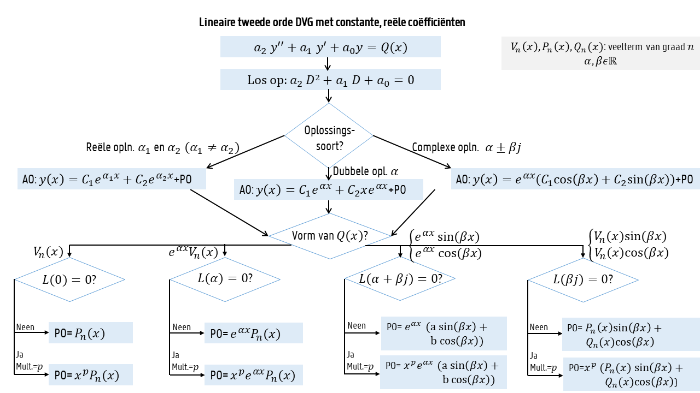

Het oplossen bestaat uit twee delen:

1. AO van de corresponderende homogene lineaire DVG bepalen
2. PO van de oorspronkelijke lineaire DVG bepalen

### Algemene oplossing

Oké je kan eigenlijk elke oefening oplossen met het schema hierboven. De algemene oplossing is altijd ez pz. Het particuliere gedeelte soms iets vervelender.

### Particuliere oplossing

//TODO ik ga hier waarschijnlijk niks schrijven dus maak maar effe zelf de oefeningen met je luie kutkop.

# 10 - Lineaire Algebra

## Eigenschappen matrices

$I_n$ is de $n$-dimensionale eenheidsmatrix. Dan is bijvoorbeeld
$$
I_3 = \begin{pmatrix}
1 & 0 & 0\\
0&1&0\\
0&0&1

\end{pmatrix}
$$
$A^T$ = de getransponeerde matrix, dus de rijen zijn gewisseld met de kolommen en er geldt dat $(AB)^T = A^TB^T$

### Determinant

De **minor** $M_{ij}$ van een element $a_{ij}$  is de determinant van de matrix zonder de $i$-de rij en de $j$-de kolom. 

De **cofactor** $A_{ij}$ van een element $a_{ij}$ is zijn minor vermenigvuldigt met $(-1)^{i+j}$

Dan kunnen we de **determinant** zo berekenen: $|A| = \sum_{j=1}^{n} a_{ij}(-1)^{i+j}M_{ij}$

Een matrix $A$ is **singulier** als $|A| = 0$ en is **regulier** als $|A| \neq 0$

Eigenschappen van determinanten:

* Waarde van determinant is onafhankelijk van de rij of kolom gekozen voor ontwikkeling
* 2 rijen of kolommen wisselen: determinant maal $-1$
* Rij of kolom vermenigvuldigen met $k$, determinant ook vermenigvuldigen met $k$
* Determinant verandert niet als je rijen of kolommen bij elkaar optelt
* $|AB| = |A||B|$
* Voor een vierkante matrix: $|A| = |A^T| $

### Adjunct en inverse

De **adjunctmatrix** $A^A$ krijg je door $A$ te transponeren en elk element van $A^T$ te vervangen door zijn cofactor.

De inverse matrix $A^{-1}$ is de matrix waarvoor geldt: $AA^{-1}= I_n$

* $(AB)^{-1} = B^{-1}A^{-1}$
* $|A^{-1}|= \frac 1 {|A|}$
* $A^{-1} = \frac 1 {|A|}A^A$
  * Dit gebruik je best om de inverse te bereken zodat je geen fakking stelsel moet oplossen

### Symmetrische matrices enzo

* $A$ is een **bovendriehoeksmatrix** als alle elementen onder de hoofddiagonaal $0$ zijn.
* $A$ is een **onderdriehoeksmatrix** als alle elementen boven de hoofddiagonaal $0$ zijn.
* $A$ is **symmetrisch** als die symmetrisch is 
* $A$ is **antisymmetrisch** als die symmetrisch is, maar de elementen aan de andere kant van de diagonaal zijn tegengesteld
* $\overline A = (\overline{a_{ij}})$ is de **complex toegevoegde** matrix van $A = a_{ij}$
* $A^*$ is de **getransponeerde complex toegevoegde matrix**  $(\overline A)^T$
* $A$ is een **hermetische matrix** als $A^* = A$

## Lineaire stelsels

Ik veronderstel dat je weet hoe je een lineair stelsel als een matrix moet voorstellen. Is dit niet het geval? Kus m'n kloten want ik ga die shit hier niet uittypen omdat ik het te druk heb met uw moeder te bevredigen.

Dit gezegd zijnde gaan we verder met matrices.

Een **hoofdmatrix** $M$ is een vierkante matrix die krijgt door rijen en kolommen te schrappen uit je matrix, waarvan de determinant niet gelijk is aan $0$. Als je dus een matrix $A$ hebt waarvan de determinant $0$, is de hoofdmatrix de grootste matrix die je uit $A$ kan halen waarvan de determinant niet $0$ is. De grootte van die matrix $M$ noem je dan de **rang** van $A$. Tanja schrijft de rang vaak als $r(A)$.

Als je dus je stelsel als een matrix voorstelt, met dus gewoon de coëfficiënten in matrixvorm en de constanten aan de rechterkant van alle vergelijkingen in de laatste kolom, heb je een **uitgebreide coëfficiëntenmatrix ** $A_B$. Als je die constanten aan de rechterkant weglaat heb je gewoon de **coëfficiëntenmatrix** $A$.

### Aantal oplossingen van stelsels

 Als je een stelsel met $n$ onbekenden voorstelt als een matrix geldt er:

* Als $r(A) +1 = r(A_B)$: Geen oplossingen
* Als $r = r(A) = r(A_B)$: Oplossing met $n-r$ vrije variabelen
  * Als $r=n$ dus $1$ oplossing
  * Als $r < n$ dus $\infty^{n-r}$ oplossingen

### Methode van Gauss(-Jordan)

Als we een lineair niet strijdig stelsel hebben dat we voorstellen als een matrix, kan je het oplossen door het naar deze vorm om te zetten:
$$
\left(
\begin{array}{ccccc|c}
1 & a_{12} & a_{13} & \cdots &a_{1n} &b_1\\
0 & 1 & a_{23} & \cdots &a_{2n} &b_2\\
0 & 0 & 1 & \cdots & a_{3n} & b_3\\
\vdots & \vdots & \vdots & \vdots & \vdots & \vdots\\
0 &0 &0 &\cdots &1 & b_{n}
\end{array}
\right)
$$
Dit doe je met elementaire rijoperaties. Je kan bijvoorbeeld rijen bij elkaar optellen of vermenigvuldigen met een scalar. Dit is het deel van real G Gauss. Een uitbreiding van de methode, gemaakt door real G Gauss feat. lil Jordan gaat als volgt:

Je moet eigenlijk gewoon hetzelfde doen en ervoor zorgen dat alle getalletjes boven de hoofddiagonaal ook $0$ zijn. 
$$
\left(
\begin{array}{ccccc|c}
1 & 0 & 0 & \cdots &0 &b_1\\
0 & 1 & 0 & \cdots &0 &b_2\\
0 & 0 & 1 & \cdots & 0 & b_3\\
\vdots & \vdots & \vdots & \vdots & \vdots & \vdots\\
0 &0 &0 & \cdots &1 & b_{n}
\end{array}
\right)
$$
Je kan dit eigenlijk gemakkelijk doen als je de vorige matrix al had. Je begint gewoon vanonder en trekt een veelvoud van de laatste rij af van de voorlaatste. Dan een veelvoud van de voorlaatste van eentje erboven. Enzovoort enzoverder.

### Gauss-Jordan matrix inverteren

Blijkbaar is er nog een disstrack van real G Gauss feat. lil Jordan.

Je kan dus ook met de methode van hierboven de inverse van een matrix vinden, maar ik ga dit er pas in zetten als ik het ooit nodig heb sorry. 

## Lineaire Transformaties

### Basis

Vectoren $\vec v_1, \vec v_2, \cdots, \vec v_k \in V$ zijn **lineair onafhankelijk** als $\sum_{i=1}^kc_i \vec v_i = \vec 0 \implies c_i = 0, \forall i$. Je kan dus alleen de nulvector bekomen door ze allemaal te vermenigvuldigen met nul. 

Een stel vectoren $\vec v_1, \vec v_2, \cdots, \vec v_n \in \mathbb R^n$ vormen een **basis** voor de vectorruimte $(\mathbb R, \mathbb R^n, +,.)$ als ze lineair onafhankelijk zijn over $\mathbb R.$ Je kan dan elke vector in $\mathbb R^n$ schrijven als een lineaire combinatie van deze vectoren.

Je kan gemakkelijk checken of je vectoren een basis vormen door ze in een matrix $A$ te gooien en de determinant te berekenen. Als $|A| \neq 0$, vormen de vectoren een basis.  

Stel je voor, je hebt nu een basis $\beta = \{\vec b_1, \vec b_2, \cdots, \vec b_n\}$ en een vector $\vec v$ ten opzichte van die basis. Als we deze vector nu willen omzetten naar het referentiekader van een andere basis $\beta' = \{\vec b'_1, \vec b'_2, \cdots, \vec b'_n\}$. Dan krijg je de componenten van deze vector t.o.v. $\beta'$ in de matrix $A = B'^{-1}B$, waarbij $B$ in elke kolom de componenten van elk van de basisvectoren van $\beta$ bevat. Voor $B'^{-1}$ doe je hetzelfde, maar moet je ook nog de inverse zoeken.  

### Lineaire transformatie

Een **transformatie** beeldt elke vector van $\mathbb R^n$ af op een vector in $R^m$. 

Een **lineaire transformatie** doet dit ook, maar is ook lineair. Dit wil zeggen dat voor een lineaire transformatie $L$ geldt dat: $L(a \vec v_1 + b \vec v_2) = aL(\vec v_1) + bL(\vec v_2)$

Je kan elke lineaire transformatie uniek voorstellen door een **transformatiematrix** $A$. In deze matrix elke kolom het beeld van één van de basisvectoren als je die transformatie erop doet.

Als je nu de transformatie in de andere richting wilt doen, gebruik je $A^{-1}$.

Als je twee lineaire transformaties na elkaar wilt doen, zeg nu bijvoorbeeld eerst $T$ met transformatiematrix $A$ en daarna $S$ met matrix $B$, dan schrijf je dit als $S \circ T$. Je hebt dan $BA$ als transformatiematrix.

#### Rotatie

De rotatie over een hoek $\varphi$ in tegenwijzerzin wordt voorgesteld door de transformatiematrix:
$$
A = \begin{pmatrix} 
\cos \varphi & \sin \varphi\\
-\sin \varphi & \cos \varphi\\

\end{pmatrix}
$$

### Eigenwaarden en eigenvectoren

Als je een vector door een lineaire transformatie kan omzetten in een veelvoud $\lambda$ van zichzelf, is hij een **eigenvector**. De factor $\lambda$ is dan de **eigenwaarde**. Dus:
$$
L(\vec v ) = A \vec v = \lambda \vec v
$$
 Hoe vinden we die eigenwaarde nu? Zo:
$$
|A-\lambda I_n| = 0
$$
Als je deze vergelijking opgelost heb zal je één of meerdere $\lambda$'s hebben. Voor die met multipliciteit één kan je de eigenvectoren direct vinden. De eerste eigenvector $\vec w_1$ vinden we a.d.h.v. dit stelsel:
$$
\begin{cases}
(a_{11} - \lambda)x_1 + a_{12}x_2 + \cdots + a_{1n}x_n &= 0\\
a_{21}x_1 + (a_{22} - \lambda)x_2 + \cdots + a_{2n}x_n &= 0\\
\quad \vdots\\
a_{n1}x_1 + a_{n2}x_2 + \cdots + (a_{nn}-\lambda)x_n &= 0

\end{cases}
$$
Bij hogere multipliciteit moet je wat verder rekenen:

* $\vec w_2$ vind je met hetzelfde stelsel door uit te drukken dat $\vec w_1^T \cdot \vec w_2 = 0$
* $\vec w_3$ door uit te drukken dat $\vec w_1^T \cdot \vec w_3 = 0$ en $\vec w_2^T \cdot \vec w_3 = 0$

Dit stelsel heeft oplossingen verschillend van de nuloplossing als $|A-\lambda I_n| = 0$. De eigenwaarden bij de matrix $A$ zijn dus de oplossingen van deze vergelijking. Die noem je blijkbaar de **karakteristieke vergelijking**, en zijn oplossingenverzameling noem je het **spectrum**. 

De oplossingsmethode voor oefeningen van deze aard is lang niet zo moeilijk als het hier blijkt. Kijk naar het filmpje voor de werkwijze van de oplossing van oefening 30F (werkcollege 12). 

Nog een kleine toevoeging. Ik had in discussies op ufora nog iets nuttigs gevonden dat alles wat duidelijker maakte voor mij.

Tim (moet wel de dt-regels nog eens herhalen) zei:

> Beste,
>
> In oefening 30 worden vaak de eigenvectoren genormeerd zodat deze een grootte van 1 hebben maar dit gebeurd niet altijd. In oefening 30C wordt vector $v_2=\{1,0,2\}$ niet genormeerd. Zou u mij meer uitleggen kunnen geven wanneer de eigenvector genormeerd moet worden en wanneer niet? 

Tanja antwoordde:

> Dag Tim,
>
> Het normeren wordt maar uitgevoerd als we in staat zijn om een stel van eigenvectoren te vinden die loodrecht op elkaar staan (m.a.w orthogonaal). Als we niet vertrekken van een reëel, symmetrische matrix, is dit niet altijd mogelijk. 
> Orthonormaal = orthogonaal + genormeerd.

### Toepassingen

#### Markov ketens

Ik ga het hier proberen te verduidelijken aan de hand van een oefening

Stef heeft volgende blijvende studeergewoonten: 

* als hij ’s avonds studeert
  * is er 70% kans dat hij de volgende avond niet studeert
* als hij een avond niet studeert
  * is er 60% kans dat hij de volgende avond ook niet studeert

Hij studeert op maandagavond. Wat is de kans dat:

* hij op woensdagavond van dezelfde week studeert? 
* hij studeert op een willekeurige avond op lange termijn?

$s(t)$ is de kans dat hij heeft gestudeerd op dag $t$.

$l(t)$ is de kans dat hij niet heeft gestudeerd op dag $t$.

Dus voor dinsdag geldt:
$$
\begin{cases}
s(1) = 0.3 \space s(0) + 0.4 \space l(0)\\
l(1) = 0.7 \space s(0) + 0.6 \space l(0)\\
\end{cases}
$$

$$
x(t) = \begin{pmatrix} 0.3 & 0.4 \\ 0.7 &0.6 \end{pmatrix}\begin{pmatrix} s(t-1) \\ l(t-1) \end{pmatrix}
$$

$$
x(1) = \begin{pmatrix} s(1) \\ l(1)  \end{pmatrix} = 
\begin{pmatrix} 0.3 & 0.4 \\ 0.7 &0.6 \end{pmatrix}\begin{pmatrix} 1 \\ 0 \end{pmatrix} = 
\begin{pmatrix} 0.3 \\ 0.7  \end{pmatrix}
$$

Voor woensdag (dus na 2 dagen)
$$
x(2) = \begin{pmatrix} 0.3 & 0.4 \\ 0.7 &0.6 \end{pmatrix}^2\begin{pmatrix} 1 \\ 0 \end{pmatrix} = 
\begin{pmatrix} 0.37 & 0.36 \\ 0.63 &0.64 \end{pmatrix}\begin{pmatrix} 1 \\ 0 \end{pmatrix} = 

\begin{pmatrix} 0.37 \\ 0.63  \end{pmatrix}
$$
De kans dat hij studeert op woensdag is dus $0.37$. We willen nu weten of dit op lange termijn convergeert. We kunnen bepalen naar waar Stef z'n studiegedrag convergeert op lange termijn door de eigenvector te bepalen.
$$
A = \begin{pmatrix} 0.3 & 0.4 \\ 0.7 &0.6 \end{pmatrix}
\\

|A-\lambda I_2| = \begin{vmatrix} 0.3 -\lambda & 0.4  \\ 0.7 &0.6 -\lambda \end{vmatrix} \implies
\lambda^2 - 0.9\lambda-0.1 = 0
$$
$A$ heeft dus als eigenwaardes $\lambda = 1$ en $\lambda = -0.1$. We willen weten wanneer het studiegedrag van Stef niet meer verandert dus we zoeken de eigenvector voor de eigenwaarde $1$.
$$
\begin{cases}
-0.7s + 0.4 t &= 0\\
0.7s - 0.4t &= 0\\

\end{cases}
$$

$$
0.7s = 0.4t \implies \vec v \in ( \frac 4 7a,  a)
$$

De kans dat hij 's avonds studeert is dus $\frac 4 {11}$ en de kans dat hij niet studeert $\frac 7 {11}$ (op lange termijn).

# Examens

Maak je geen zorgen, de oplossingen vind je ook op de site als je niet blind bent.

## 20-21 Eerste zit A

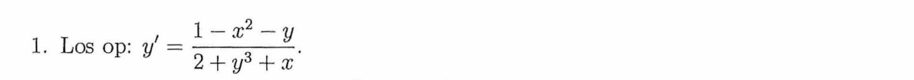 

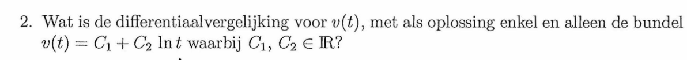 

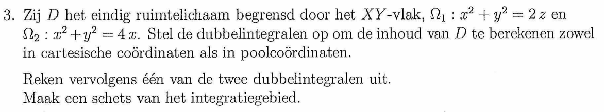

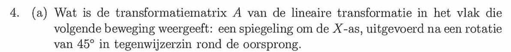 

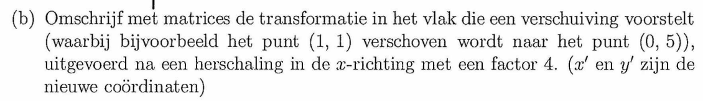

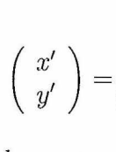

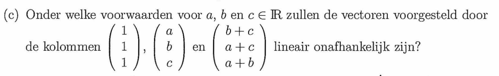

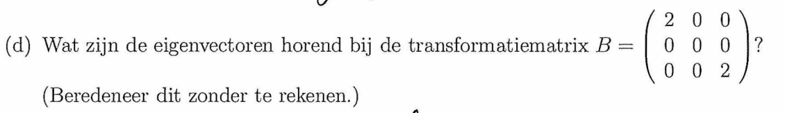

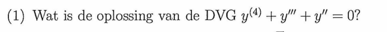

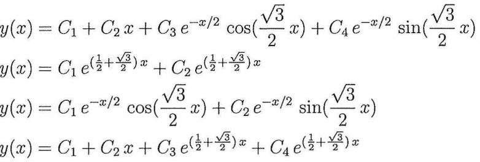

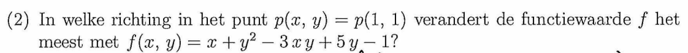

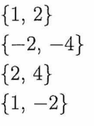

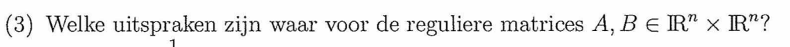

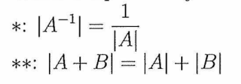

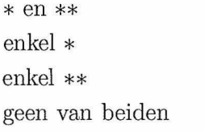

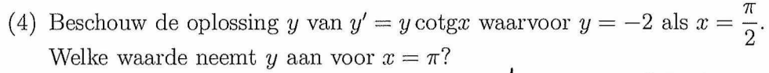

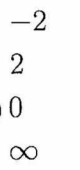

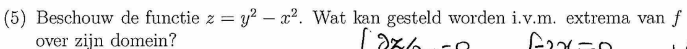

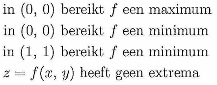

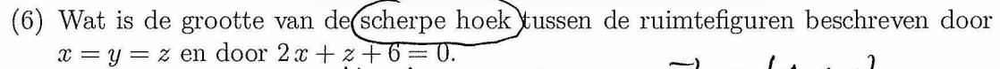

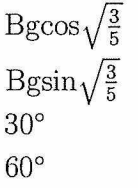

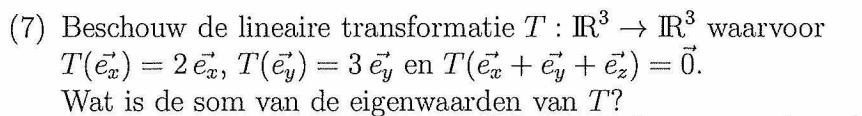

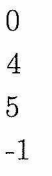

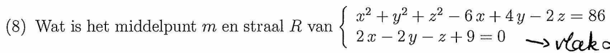

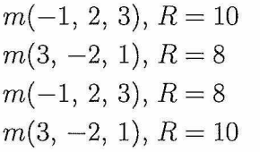

## 20-21 Tweede zit A

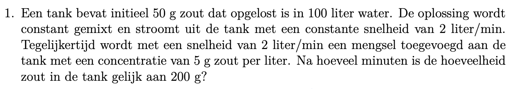

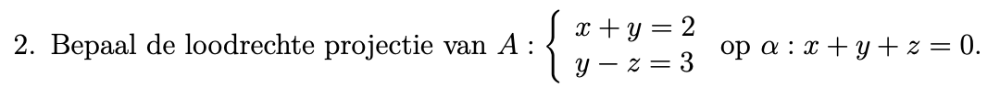

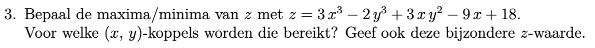

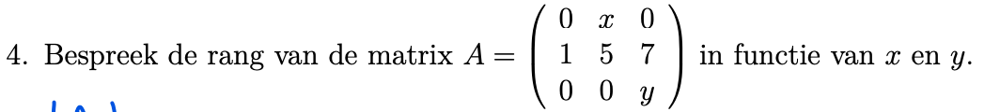

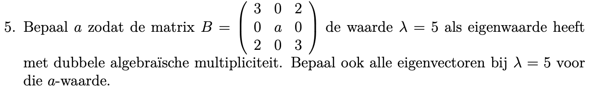

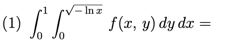

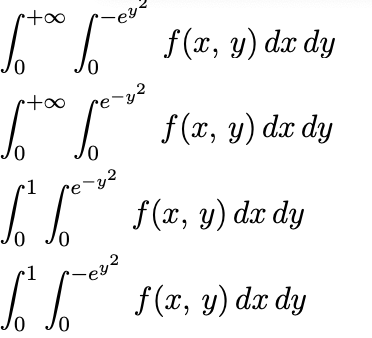

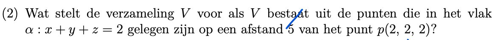

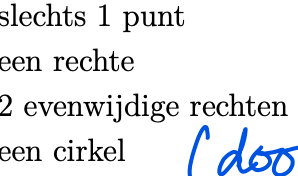

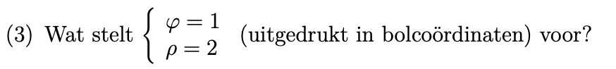

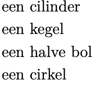

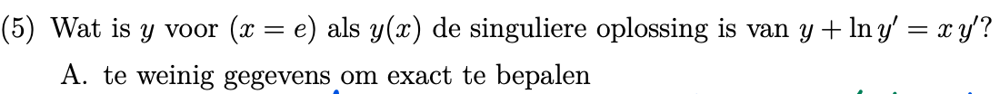

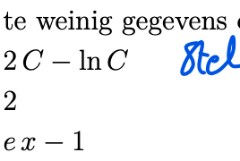

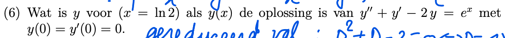

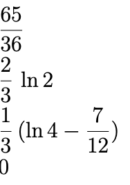

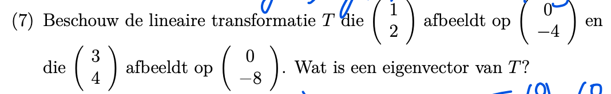

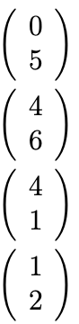

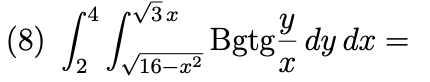

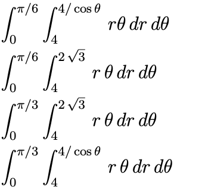
