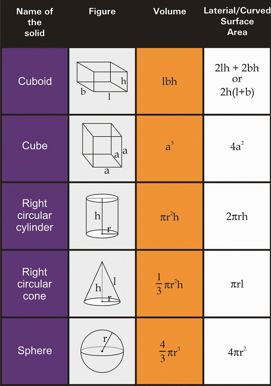

# Wiskunde II

* Examen: 75%
  * 60% open vragen
  * 40% meerkeuzevragen met standaard setting (5 van de 8 juist om er door te zijn)
* Test: 25%

# 1 - Ruimtemeetkunde

## Vlakken

**Carthesische vergelijking**

Vlak: $\alpha:\;ax+by+cz+d=0$ heeft normaalvector: $\overrightarrow{n_\alpha}=\left\{a,b,c\right\}$

Je kan een vlak bepalen d.m.v. een punt en een normaalvector. We gebruiken $\overrightarrow{n_\alpha}$ en $p(x_1,y_1,z_1)$ en bekomen:
$$
a(x-x_1) + b(y-y_1) + c(z-z_1) = 0\\
$$
dit herleiden we tot
$$
\alpha:\;ax+by+cz+d=0
$$

**Determinantvorm**

Vergelijking vlak door een punt $p(x_1,y_1,z_1)$ en 2 onafhankelijke richtingsvectoren $\overrightarrow u=\left\{u_x,u_y,u_z\right\}$ en $\overrightarrow v=\left\{v_x,v_y,v_z\right\}$
$$
\gamma:\;\begin{vmatrix}x-x_1&y-y_1&z-z_1\\u_x&u_y&u_z\\v_x&v_y&v_z\end{vmatrix}=0
$$

**Parametervergelijking**
$$
\gamma:\;\left\{\begin{array}{l}
x = x_1 + ku_x + lv_x
\\y = y_1 + ku_y + lv_y \quad \quad \text{met } k,l \in \mathbb{Z}
\\z = z_1 + ku_z + lv_z

\end{array}\right.
$$

**Hoek tussen 2 vlakken**

met $\overrightarrow{n_1}$ en $\overrightarrow{n_2}$ de normaalvectoren van de vlakken.
$$
\cos\theta = \frac{\overrightarrow{n_1}\cdot \overrightarrow{n_2}}
{\lvert\lvert\overrightarrow{n_1}\rvert\rvert \cdot  \lvert\lvert\overrightarrow{n_2}\rvert\rvert}
$$
**Onderlinge stand**

> Twee vlakken zijn **evenwijdig** als hun normaalvectoren evenwijdig zijn.

> Twee vlakken zijn **orthogonaal** als hun normaalvectoren loodrecht op elkaar staan.

> Een rechte is **evenwijdig** met een vlak als als de richtingsvector van de rechte **loodrecht** staat op de normaalvector van het vlak.

> Een rechte staat **loodrecht** op een vlak als zijn richtingsvector **evenwijdig** is met de normaalvector van het vlak.

## Rechten

**Rechte als snijlijn van 2 vlakken**
$$
R:\;\left\{\begin{array}{l}a_1x+b_1y+c_1z+d_1=0\\a_2x+b_2y+c_2z+d_2=0\end{array}\right.
$$
heeft richtingsvector $\overrightarrow{u_R}=\overrightarrow{n_1}\times\overrightarrow{n_2}$

met:
$$
\overrightarrow{n_1}=\left\{a_1,b_1,c_1\right\} \\
$$

$$
\overrightarrow{n_2}=\left\{a_2,b_2,c_2\right\}
$$

**Carthesische vergelijking** 

Carthesische vergelijking van rechte door punt $p(x_1,y_1,z_1)$ richtingsvector $\overrightarrow u=\left\{u_x,u_y,u_z\right\}$
$$
\frac{x-x_1}{u_x}=\frac{\displaystyle y-y_1}{\displaystyle u_y}=\frac{\displaystyle z-z_1}{\displaystyle u_z}
$$

**Parametervergelijking**
$$
R:\;\left\{\begin{array}{l}
x = x_1 + ku_x\\
y = y_1 + ku_y \quad \text{met } k \in \mathbb{R}\\ 
z = z_1+ku_z
\end{array}\right.
$$
**Hoek tussen twee rechten**
$$
\cos\theta = \frac{\overrightarrow{u_1}\cdot \overrightarrow{u_2}}
{\lvert\lvert\overrightarrow{u_1}\rvert\rvert \cdot  \lvert\lvert\overrightarrow{u_2}\rvert\rvert}
$$

**Hoek tussen twee vlakken**
$$
\cos\theta = \frac{\overrightarrow{n_1}\cdot \overrightarrow{n_2}}
{\lvert\lvert\overrightarrow{n_1}\rvert\rvert \cdot  \lvert\lvert\overrightarrow{n_2}\rvert\rvert}
$$
**Hoek tussen een rechte en een vlak**
$$
\sin\theta = \frac{\overrightarrow{u}\cdot \overrightarrow{n}}
{\lvert\lvert\overrightarrow{u}\rvert\rvert \cdot  \lvert\lvert\overrightarrow{n}\rvert\rvert}
$$
**Ondelinge stand**

> Twee rechten zijn evenwijdig als hun richtingsvectoren **evenwijdig** zijn.

> Ze zijn **orthagonaal** als hun richtingsvectoren loodrecht op elkaar staan.

> Ze zijn **snijdend** als ze samen een vlak bepalen (je kan dan ook een snijpunt vinden). Anders zijn ze **kruisend**.

## Afstanden

**Afstand tussen 2 punten** $a(x_1,y_1,z_1)$ en $b(x_2,y_2,z_2)$:
$$
d(a,b)=\sqrt{\left(x_2-x_1\right)^2+\left(y_2-y_1\right)^2+\left(z_2-z_1\right)^2}
$$

**Afstand tussen punt en vlak**
$$
d(p_1, \alpha) = \frac{\left| ax_1 + by_1 + cz_1 +d \right|}{\sqrt{a^2 + b^2 + c^2}}
$$

punt $p_1(x_1,y_1,z_1)$ en vlak $\alpha:\;ax+by+cz+d=0$

**Afstand punt tot rechte**

* Maak een vlak met het punt en de normaalvector van de rechte
* Bepaal het snijpunt van het vlak en de rechte
* Nu bepaal je de afstand tussen het snijpunt en je punt

**Afstand tussen 2 rechten**

(de rechten zijn ieder bepaald door een punt en een richtingsvector)

* Methode 1
  * Neem het vectorieel product van de richtingsvectoren van de twee rechten
  * Maak hiervan een eenheidsvector
  * De afstand tussen de twee rechten is het scalair product van deze eenheidsvector en de vector bepaald door de twee punten van de rechten: $|\overrightarrow{p_1 p_2} \cdot \overrightarrow{e_n}|$
* Methode 2
  * Maak een vlak door één punt van de rechten, evenwijdig aan beide richtingsvectoren
  * Nu kan je de afstand van het andere punt tot dit vlak bepalen met de formule van twee paragrafen terug

**Gemeenschappelijke loodlijn van twee rechten**

* De richtingsvector van de loodlijn is het vectorieel product van de richtingsvectoren van de rechten

* Stel nu twee vlakken op, elk door een punt op één van de rechten en met als richtingsvectoren

  * De vector van de vorige stap
  * De richtingsvector van de rechte door dat punt

* De loodlijn is nu de snijlijn van de twee rechten

  

## Boloppervlak & Cirkel

**Boloppervlak**
$$
(x-x_0)^2 + (y-y_0)^2 + (z-z_0)^2 = R^2
$$

met middelpunt $m(x_0,y_0,z_0)$ en straal R

**Bol door 4 niet collineaire punten:**

* Bepaal de 3 lijnstukken bepaald door de 4 punten
* Het middelpunt van de bol is het snijpunt van de 3 middelloodvlakken van deze lijnstukken
  * Om de middelloodvlakken te berekenen neem je als normaalvector de richtingsvector van het lijnstuk
  * En als punt het midden van de twee punten (optellen en delen door 2)
* De straal is de afstand van het middelpunt tot één van de punten

**Cirkel**

Als snijlijn van een bol en een vlak.
$$
R:\;\left\{\begin{array}{l}
(x-x_0)^2 + (y-y_0)^2 + (z-z_0)^2 = R^2
\\
ax+by+cz+d=0\end{array}\right.
$$

**Cirkel door drie niet collineaire punten**

* Bepaal het vlak door de 3 punten
* Bepaal de middelloodvlakken van de twee lijnstukken bepaald door de 3 punten
* Neem een willekeurig punt op de snijlijn van de twee vlakken en bereken de afstand hiervan tot één van de 3 punten
* De cirkel is de snijlijn van:
  *  de bol bepaald door dat willekeurig punt en de afstand 
  * de vergelijking van het vlak door de 3 punten

// TODO omzettingsformules

## Inhoud ruimtelichamen

Kan altijd van pas komen.

# 2 - Functies van meerdere veranderlijken

## Gradiënt

De gradiënt in een punt $p$ van een scalaire functie $\varphi$ geeft de richting van grootste verandering in dat punt.
$$
\overrightarrow\nabla\varphi=\left\{\frac{\partial\varphi}{\partial x},\frac{\partial\varphi}{\partial y},\frac{\partial\varphi}{\partial z}\right\}
$$

* De gradiënt staat loodrecht op elke niveaulijn of niveauoppervlak van je functie
* De gradiënt in een punt geeft de richting van grootste verandering in dat punt

## Totale differentiaal

$$
df = \frac{\partial f}{\partial x}dx + \frac{\partial f}{\partial y}dy + \frac{\partial f}{\partial z}dz
$$

## Lineaire benadering

als je bijvoorbeeld $1.02^{3.01}$ moet berekenen

* $\triangle x = 0.02$ 
* $\triangle y = 0.01$ 
* $z=x^y$ in $(1,3)$

$$
f(x_p+\triangle x,y_p+\triangle y)\approx f(x_p,y_p)+{\left(\frac{\partial f}{\partial x}\right)}_p\cdot\triangle x+{\left(\frac{\partial f}{\partial y}\right)}_p\cdot\triangle y
$$

## Vergelijking raakvlak aan oppervlak

In het punt $p(x_0, y_0, z_0)$ aan $\varphi(x,y,z)$
$$
\left(  \frac{\partial\varphi}{\partial x} \right)_p (x-x_0)
+ \left(  \frac{\partial\varphi}{\partial y} \right)_p (y-y_0)
+ \left(  \frac{\partial\varphi}{\partial z} \right)_p (z-z_0)
=0
$$

## Vergelijking normaal aan oppervlak

In het punt $p(x_0, y_0, z_0)$ aan $\varphi(x,y,z)$
$$
\frac{x-x_0}{\left(  \frac{\partial\varphi}{\partial x} \right)_p}
=\frac{y-y_0}{\left(  \frac{\partial\varphi}{\partial y} \right)_p}
=\frac{z-z_0}{\left(  \frac{\partial\varphi}{\partial z} \right)_p}
$$

## Totale differentiaal van de eerste orde

$$
df = \frac{\partial\varphi}{\partial x}dx + \frac{\partial\varphi}{\partial y}dy + \cdots \text{ voor alle variabelen}
$$

## Vergelijking raaklijn in een punt van een kromme

In het punt $p(x_0, y_0, z_0)$ aan de snijlijn van de krommen:
$$
\;\left\{\begin{array}{l}
\varphi(x,y,z) = 0
\\
\psi(x,y,z) = 0
\end{array}\right.
\\
$$
De raaklijn is de snijlijn van de twee raakvlakken. We krijgen een richtingsvector van de raaklijn door het vectorieel product te nemen van de normaalvectoren. 
$$
\\
\left\{
\left(\frac{\partial\varphi}{\partial x} \right)_p,
\left(\frac{\partial\varphi}{\partial y} \right)_p,
\left(\frac{\partial\varphi}{\partial z} \right)_p
\right\}
\times
\left\{
\left(\frac{\partial\psi}{\partial x} \right)_p,
\left(\frac{\partial\psi}{\partial y} \right)_p,
\left(\frac{\partial\psi}{\partial z} \right)_p
\right\}
$$
Dan gebruik je de [formule](#rechten) om de vergelijking van een rechte op te stellen aan de hand van een richtingsvector en een punt.

### Normaalvlak

Het normaalvlak in $p$ staat loodrecht op de raaklijn. Je kan de bovenstaande vector hier dus voor hergebruiken. Doe [dit](#vlakken). Je gaat wel nog $d$ moeten zoeken. Dat kan je door het punt in de bekomen vergelijking in te vullen.

## Raaklijn aan parameterkromme

$$
\;\left\{\begin{array}{l}
x = f_1(t)
\\
y = f_2(t)
\\
z = f_2(t)
\end{array}\right.

\\
\\
\text{richtingsvector raaklijn: } \{f_1'(t_0), f_2'(t_0), f_3'(t_0)\}
\\\\
\text{raaklijn in $p$: }\\ \frac{x-x_0}{f_1'(t_0)} = \frac{y-y_0}{f_2'(t_0)} = \frac{z-z_0}{f_3'(t_0)}
\\\\
\text{normaalvlak in $p$: }\\ f_1'(t_0)(x-x_0) + f_2'(t_0)(y-y_0) + f_3'(t_0)(z-z_0) = 0
$$

## Extrema

Vind alle punten waarvoor:
$$
\left\{\begin{array}{l}{\left(\frac{\partial z}{\partial x}\right)}_p=0\\{\left(\frac{\partial z}{\partial y}\right)}_p=0\end{array}\right.
$$
Bereken voor elk punt de vereenvoudigde discriminant:
$$
\triangle_p=\left(\frac{\partial^2z}{\partial x\partial y}\right)_p^2-{\left(\frac{\partial^2z}{\partial x^2}\right)}_p\cdot{\left(\frac{\partial^2z}{\partial y^2}\right)}_p
$$

* $\triangle_p>0$: $p$ is een zadelpunt
* $\triangle_p<0$: $p$ is een extremum
  * ${\left(\frac{\partial^2z}{\partial x^2}\right)}_p>0$: $p$ is een minimum
  * ${\left(\frac{\partial^2z}{\partial x^2}\right)}_p<0$: $p$ is een maximum
  * ${\left(\frac{\partial^2z}{\partial x^2}\right)}_p=0$: verder onderzoek nodig

## Gebonden extrema

1. Bepaal de vergelijking van Lagrange: $L(x,y, \lambda) = f(x,y) + \lambda g(x,y)$

2. Los het stelsel op

$$
\left\{\begin{array}{l}{
\frac{\partial L}{\partial x}}=0\\
\frac{\partial L}{\partial y}=0\\
\frac{\partial L}{\partial \lambda}=0 \xLeftrightarrow{\space \space} g(x,y) = 0 \\

\end{array}\right.
$$

3. Je functie heeft gebonden extrema inde de oplossingen van dit stelsel als:

$$
\triangle_p(x,y)=\left(\frac{\partial^2L}{\partial x\partial y}\right)_p^2-{\left(\frac{\partial^2L}{\partial x^2}\right)}_p\cdot{\left(\frac{\partial^2L}{\partial y^2}\right)}_p
$$

* ${\left(\frac{\partial^2L}{\partial x^2}\right)}_p>0$: $p$ is een minimum
* ${\left(\frac{\partial^2L}{\partial x^2}\right)}_p<0$: $p$ is een maximum

# 3 - Dubbelintegralen

## Oppervlakte vlak gebied

$$
\begin{align}
S &= \iint_Gds 
\\
&= \iint_Gdxdy 
\\
&=\iint_G \operatorname r dr d\theta
\end{align}
$$

## Inhoud lichaam

Met $G$ een gebied in het $XY$-vlak.
$$
V=\iint_G\left|f(x,y)\right|\operatorname dS
$$

## Oppervlakte van een oppervlak

Met $G$ een gebied in het $XY$-vlak.
$$
\sigma=\iint_G\sqrt{1+\left(\frac{\partial f}{\partial x}\right)^2+\left(\frac{\partial f}{\partial y}\right)^2} dS
$$

## Jacobiaan

$$
\\
\left\{\begin{array}{l}
{x=g(u,v)}
\\
{y=h(u,v)}
\end{array}\right.
\\\\
dxdy = |J(u,v)|dudv \\\\
J =
\begin{vmatrix}
\frac{\partial x}{\partial u} & \frac{\partial x}{\partial v} \\
\frac{\partial y}{\partial u} & \frac{\partial y}{\partial v}
\end{vmatrix}

\\ \\
\iint_Gf(x,y) dxdy = \iint_Gf(g(u,v), h(u,v)) \space |J(u,v)|dudv
$$

### Overgang naar poolcoördinaten

Je kan de Jacobiaan dus ook gebruiken om over te gaan naar poolcoördinaten. Deze is gelijk aan $r$. 
$$
\\
\left\{\begin{array}{l}
{x=r\cos\theta}
\\
{y=r\sin\theta}
\end{array}\right.
\\\\
J =
\begin{vmatrix}
\cos \theta & -r\sin\theta \\
\sin \theta & r\cos \theta
\end{vmatrix} = r
\\\\
\iint_Gf(x,y) dxdy = \iint_Gf(r\cos \theta, r\sin \theta) r \space drd\theta
$$

## Traagheidsmoment en Statisch moment

Beide zijn altijd ten opzichte van één as. Dus $a$ is de afstand van $dS$ tot die as.

**Traagheidsmoment**

> Het **traagheidsmoment** geeft de mate van verzet tegen verandering van hoeksnelheid van een lichaam met een zekere massa. - Wikipedia

$$
I_a = \iint_G a^2 dS
$$
**Statisch moment**

$$
M_A = \iint_G a \space dS
$$

### Zwaartepunt 

$$
\overline{x} = \frac{M_y}{S} \quad \quad \overline{y} = \frac{M_x}{S}
\\ 
z = (\overline{x},\overline{y})
$$

# 4 - Basisbegrippen differentiaalvergelijkingen

De **graad** van een differentiaalvergelijking is de exponent van de hoogste afgeleide. De **orde** van een differentiaalvergelijking is de orde van de hoogste afgeleide (dus hoe vaak die wordt afgeleid).

Voor de graad moet je wel een beetje oppassen als je hoogste afgeleide in de noemer staat. Als je deze vergelijking herleidt om $y'$ uit de noemer te krijgen zal je zien dat de graad gelijk is aan $2$.
$$
y' + \frac{1}{y'} = x+3
$$

## DVG van een familie krommen

Als er $n$ constanten zijn:

1. Leid de vergelijking $n$ keer af. Dan heb je een stelsel van $n+1$ vergelijkingen
2. Gebruik het stelsel om de constanten te elimineren

# 5 - DVG van de eerste orde en eerste graad

Er zijn een aantal manieren om deze DVG's op te lossen. Je moet ze blijkbaar in deze volgorde uitproberen.

1. Scheiden van veranderlijken
2. Homogene DVG
3. Totale DVG
4. Lineaire DVG
5. DVG van Bernoulli

## Scheiden van veranderlijken

Als je de vergelijking kan herschrijven als:
$$
f(x)dx = g(y)dy
$$
Kan je hem gewoon oplossen door beide leden te integreren.

## Homogene differentiaalvergelijkingen

Je functie is homogeen als:
$$
f(\lambda x, \lambda y) = \lambda^n f(x,y)
$$
Vervang dus $x$ door $\lambda x$ en $y$ door $\lambda y$ en kijk of je de $\lambda$ eruit kan halen. 

Een vergelijking zoals deze:
$$
M(x,y)dx + N(x,y)dy = 0
$$
Is homogeen als de $\lambda$'s van $M$ en van $N$ dezelfde graad hebben. 

Substitueer dan met $y=ux$ of $x = uy$. 

## Totale differentiaalvergelijkingen

Een vergelijking van de vorm $M(x,y)dx + N(x,y)dy = 0$ is totaal als en slechts als
$$
\frac{\partial M(x,y)}{\partial y} = \frac{\partial N(x,y)}{\partial x}
$$
Als de partiële afgeleiden continu zijn uiteraard.

Stappen (hoe ik het doe, ik weet niet zeker of het wel helemaal halal is):

* Zoek een functie waarvoor de partiële afgeleide naar $x$ gelijk is aan $M$ en die naar $y$ aan $N$.
* Dit doe ik door $M$ te integreren naar $x$ en $N$ naar $y$
* Dan ga je zien dat de integralen van $M$ en $N$ redelijk hard op elkaar lijken en kan je op het zicht een combinatie vinden die aan de voorwaarde in de eerste stap voldoet. 
* Omdat $\frac{\partial F(x,y)}{\partial x} + \frac{\partial F(x,y)}{\partial y} = M(x,y)dx + N(x,y)dy$, heb je gewoon $F(x) = C$ als oplossing. 

## Lineaire differentiaalvergelijkingen

Je DVG is lineair als je hem kan schrijven als:
$$
y' + yP(x) = Q(x)
$$

* Stel $y=uv$, dan krijg je $u'v + v'u + uvP(x) = Q(x)$
* Nu kies je $v$ zodat $v' + vP(x) = 0$ 
* Dus nu los je de (gemakkelijke) differentiaalvergelijking $v' + vP(x) = 0$ op
* Omdat $v$ er nu voor zorgt dat er een deel wegvalt, los je $u'v = Q(x)$ op door $v$ in te vullen
* Nu ken je $u$ en $v$ en krijg je de oplossing door ze in te vullen in $y = uv$

## Differentiaalvergelijkingen van Bernoulli

Heb je een vergelijking van het type:
$$
y' + yP(x) = y^nQ(x)
$$

* Deel alles door $y^n$
* Stel $z=y^{1-n}$, dan is $z' = \frac{dz}{dx} = \frac{dz}{dy}\cdot \frac{dy}{dx} $, dus de afgeleide van $y^{1-n}$ maal $y'$
* Nu heb je een lineaire DVG, slimme gast die Bernoulli
* Los verder op door de stappen in de vorige paragraaf te volgen, maar dan met $z = uv$
* Bij dit eindresultaat vervang je dan $z$ met $y^{1-n}$
* Winst

 

