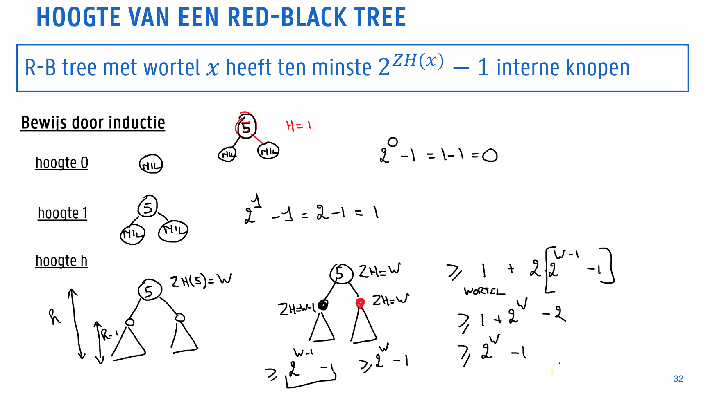
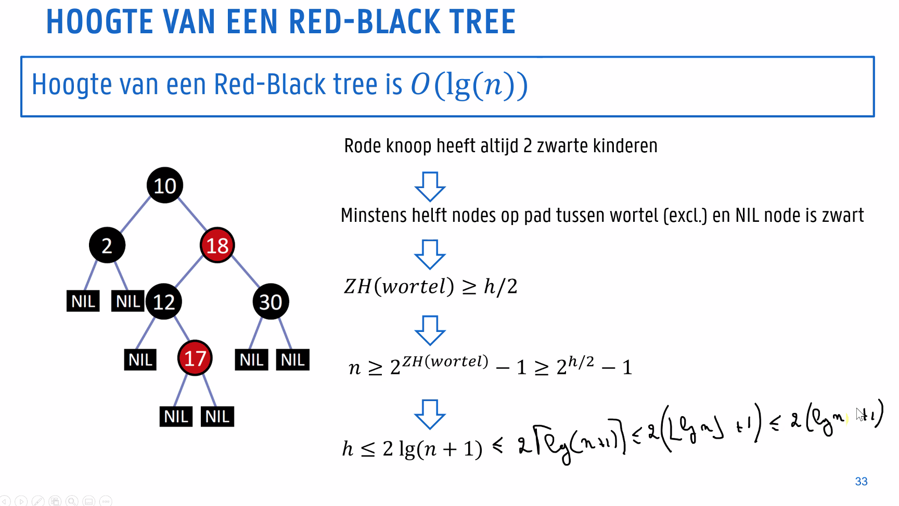

# Algoritmen

* Theorie: 60%
* Praktijk:
  * Test 30 maart: 20%
  * Test 23 mei: 20%
* Minstens 8/20 op zowel theorie als praktijk


## To Do

* Duidelijk hoe je moet toevoegen en verwijderen aan redblack trees uitleggen
* Lijst van bewijzen + verkorte mnemotechnische schemas?
* Ondergrens sorteren op basis van sleutelvergelijkingen
* Hoogte van een red-black tree
* minimaliseren totale eindtijd met P processoren


# ------------ Theorie ------------


# 1 - Efficiënte zoekbomen

## Evenwichtige zoekbomen


We willen ervoor zorgen dat bomen niet uit balans geraken:

* Red-black-tree: boom altijd herbalanceren
* Splay trees: maakt reeks opeenvolgende operaties efficient
* Treaps: tree die ook een heap is (gaan we niet verder op in)


## Red-black tree


Binaire zoekboom, waarvoor geldt:

1. Elke knoop is rood of zwart
2. De wortel is zwart
3. Elke virtuele knoop (NIL) is zwart
4. Elke rode knoop heeft 2 zwarte kinderen
5. Elk pad van een knoop naar een bladnode in zijn deelboom bevat eenzelfde aantal zwarte knopen

We definiëren het begrip **zwarte hoogte** als het aantal zwarte knopen op het pad naar een bladnode. 

We willen bewijzen dat een red-black tree met wortel $x$ ten minste $2^{ZH(x)} - 1$ interne knopen bevat (met $ZH$ de zwarte hoogte)






### Zoeken

Zelfde als bij BST, we houden geen rekening met de kleur, dus $O(\log n)$


### Toevoegen

We gaan dus altijd toevoegen als rode knoop. Omdat we dan de zwarte hoogte van de boom niet super hard verkloten. Het kan nu wel dat we dan twee rode knopen achter elkaar krijgen. Om dit op te lossen moeten we gaan **roteren** en **recoloren** om de boom terug geldig te krijgen. Roteren doe je zo: 


We roteren het kind naar bover zijn ouder, de deelboom van het kind wordt de deelboom van de voormalige ouder. De kost van één rotatie is $O(1)$. 

Een rode knoop mag dus geen rode kinderen hebben. Hoe lossen we dit op? Er zijn 3 mogelijke opties.

**Rode oom**


De knopen $p$ en $c$ vormen een double red. Als de broer van $p$ (de oom van $c$) rood is, kan je gewoon de kleur van $u$ en $p$ wisselen met hun ouder en het probleem naar boven opschuiven (want het kan nu dat $g$ met zijn ouder een double red vormt).

Als de oom van $p$ niet rood is, zijn er twee mogelijkheden:


**Zwarte oom, gealigneerd**


Als $c$, $p$ en $g$ op één lijn staan zal je eerst $p$ boven $g$ moeten roteren en daarna de kleur van $c$ en $g$ wisselen met die van hun ouder.

**Zwarte oom, niet gealigneerd**


Als $c$, $p$ en $g$ niet op één lijn staan, roteer je $c$ boven $p$. Nu is je zwarte oom wel gealigneerd en kan je het double red probleem oplossen met het vorige geval.

### Verwijderen

Dit kunnen we opsplitsen in 3 gevallen:

* De knoop heeft geen kinderen
* De knoop heeft 1 kind
* De knoop heeft 2 kinderen

De eerste en tweede zijn triviaal. Als de knoop geen kinderen heeft moet je niks doen. Als je knoop één kind heeft, laat je zijn ouder gewoon wijzen naar het kind. Als je knoop twee kinderen heeft, zal je zijn in-order **voorloper** moeten vinden. Deze heeft sowieso geen rechterkind, aangezien het zijn voorloper is. Overschrijf de inhoud van de te verwijderen knoop met de inhoud van zijn voorloper en verwijder de voorloper.


**Red-black voorwaarden herstellen**

//TODO

# 2 - Meerdimensionale gegevensstructuren

Vaak hebben we nood aan meerdimensionale gegevens. Dit zijn gegevens die meer dan één sleutel bezitten. We modelleren deze gegevens typisch als een meerdimensionaal geometrisch probleem.


## Projectie


We houden per dimensie een gegevensstructuur bij waarin de punten gerangschikt zitten volgens deze dimensie. Willen we dan een range van gegevens opzoeken, stellen we dit voor als een hyperrechthoek (in de tekening een balk, in 2 dimensies zou het een gewone rechthoek zijn). We zoeken dan per dimensie alle gegevens die binnen de overeenkomstige zijde van de hyperrechthoek vallen. Dan overlopen we sequentieel de kleinste verzameling om te kijken welke punten binnen onze range zitten. 

Als de punten gelijkmatig verdeeld zijn kunnen we opteren om slechts één dimensie in een gegevensstructuur te steken. Is dit niet het geval, zullen we toch voor elke dimensie een gegevensstructuur aan moeten maken.

//todo performantie? op zich is dit deel niet super belangrijk


## Rasterstructuur


We kunnen onze verdelen in vakjes met behulp van een raster. We houden in elk vakje een gelinkte lijst bij van alle punten. Als we dan een range van punten willen vinden in een bepaalde zoekhyperrechthoek, vragen we alle gelinkte lijsten op van de vakjes die overlappen met het zoekgebied. Dan moeten we wel nog elk van die lijsten overlopen om de punten binnen het zoekgebied te vinden. 

Je kan waarschijnlijk wel al ruiken dat een gegevensstructuur van deze aard enkel goed werkt indien de punten die hij bevat ietwat uniform verdeeld zijn. In het slechtste geval kunnen alle punten samengeklit in één rooster zitten, wat ook niet echt bevorderlijk zal werken voor de performantie.

De volgende gegevensstructuren trachten deze problemen op te lossen.


## Quadtrees


### Point Quadtrees


Elke toegevoegde knoop verdeelt het zoekgebied in **vier** (niet noodzakelijk gelijke) **rechthoekige gebieden**. Om te zoeken vertrekken we vanaf de wortel. Dan vergelijken we telkens ons zoekpunt met de vier kinderen en dalen af indien nodig. Als we dan een leeg gebied tegenkomen is het zoekpunt niet aanwezig in de boom.

De vorm van een Point Quadtree is afhankelijk van de toevoegvolgorde. Als elke toevoegvolgorde even waarschijnlijk is, zijn zoeken en toevoegen gemiddeld $O(\log n)$, en in het slechtste geval $O(n)$.

Als de punten op voorhand gekend zijn kan je ervoor zorgen dat het evenwicht in de boom veel beter ligt. Als we alle punten rangschikken op x (bij gelijke x op y), vallen alle punten voor de mediaan in twee deelbomen. De punten erachter vallen dan in de andere twee deelbomen. Zo zal een deelboom nooit meer dan de helft van de punten van zijn ouder bevatten. Deze operatie is wel $O(n\log n)$

Zoek je meerdere punten, doe dit dan recursief. Test bij een knoop of zijn punt in de zoekrechthoek ligt en ga vervolgens verder in de deelbomen die de rechthoek overlappen.


### Point Region Quadtrees


Het principe van een PR Quadtree is gelijkaardig aan dat van een gewone Quadtree, met het verschil dat elk gebied altijd in vier gelijke gebieden gesplitst zal worden. Als er een punt wordt toegevoegd zullen we dus telkens het gebied moeten splitsen totdat elk punt zijn eigen vakje heeft. Dit heeft als gevolg dat de structuur, evenals de hoogte van de boom onafhankelijk zijn van de toevoegvolgorde. 


#### Hoogte

De hoogte van een PR Quadtree wordt bepaald door de kleinste afstand tussen twee knopen, aangezien er telkens dieper gesplitst zal moeten worden totdat elk punt zijn eigen vakje heeft.

  


In een gebied met zijde $z$, is de maximale afstand tussen twee punten in een gebied op diepte $d$ gelijk aan $\frac{z \sqrt{2}}{2^d}$


#### Range queries


Om een range query te implementeren bij een PR-quadtree, vertrek je vanaf de bovenste knoop. Als de zoekrechthoek overlapt met de cel van de knoop, ga je recursief dieper. Als dit niet het geval is geef je een leeg resultaat terug. Bij een bladknoop kijk je of het individuele punt overlapt met de zoekrechthoek. Als dit het geval is geef je het punt terug.


#### Nadelen

Het grote nadeel aan beide eerder genoemde Quadtrees is dat bij meer dimensies, de hoeveelheid gebruikte pointers exponentieel zal toenemen. Elke node heeft voor $k$ dimensies namelijk $2^k$ pointers. 


### K-D Trees


K-D Trees trachten de vertakkingsgraad te beperken door op elk niveau te splitsen volgens één dimensie. Bij het afdalen in de boom zullen we dan typisch alterneren tussen de verschillende dimensies.


#### Range search query


Je gaat weer recursief moeten werken per knoop. Als het punt van deze knoop binnen de zoekrechthoek valt, voeg je hem toe aan het resultaat. Als de zoekrechthoek (gedeeltelijk) overlapt met de cel van de knoop, ga je recursief dieper. Is dit niet het geval,  geef je een leeg resultaat terug.


#### Nearest Neighbor

//TODO


# 3 - Analyse van iteratieve algoritmen

## Orde van toename

$$
n!>> 2^n >> n^{1+\alpha} >> n \log n  >> n^\epsilon >> \log n >> \log \log n >> C
$$


## Lussen

**Enkele lus**

```c++
int functie (vector<int>& v){
	int result = 0;
	int n = v.size();
	for (int i = 0; i < n; i++){
		result += (i+1)*v[i];
	}
	return result;
}
```

We loopen $n$ keer. Onze basisoperatie wordt dus $T(n) = n$ keer uitgevoerd.


**Geneste lus**

```c++
int functie(vector<int>& v){
  int result = 0;
    int n = v.size();
    for (int i = 0; i < n; i++){	
      for (int j = 0; j < n; j++){
      	result += v[j];
      }
    }
  return result;
}
```

Deze code doet eigenlijk het zelfde als het vorige blokje code, maar minder efficiënt. We zetten onze code om in een sommatie:
$$
T(n) = \sum_{i=0}^{n-1} \sum_{j=0}^{n-1}1
$$
Na wat coole wiskunde krijgen we:
$$
T(n) = \frac{n^2+n}{2}
$$
**Logaritmische uitvoeringstijd**

Als je je teller bijvoorbeeld verdubbeld in plaats van incrementeert, krijg je een logaritmische uitvoeringstijd:

```c++
int functie(vector<int>& v){
  int result = 0;
    int n = v.size();
    for (int i = 0; i <= n; i*=2){	
      for (int j = 0; j < n; j++){
      	result += v[j];
      }
    }
  return result;
}
```

Per iteratie van de buitenste lus, wordt de binnenste lus $n$ keer uitgevoerd. De buitenste lus wordt $K = \lfloor \log n \rfloor$ keer uitgevoerd.
$$
\begin{align}
T(n) &= \sum_{i=1}^{K} \sum_{j=0}^{n-1} 1 \\
&= \sum_{i=1}^{K}n \\ 

&= nK \\
&= n\lfloor \log n \rfloor

\end{align}
$$
De uitvoeringstijd bedraagt $\Theta(n\log n)$.


## Sorteeralgoritmes

### Selection sort


* Neem het kleinste element van de lijst en zet het vooraan
* Neem het kleinste element van de lijst behalve het eerste element en zet dat op de tweede plek
* Herhaal
* Winst (eigenlijk niet want het is $O(n^2)$)

```c++
void selectionSort(int arr[], int n)
{
    int i, j, min_idx;
 
    // One by one move boundary of
    // unsorted subarray
    for (i = 0; i < n-1; i++)
    {
        // Find the minimum element in
        // unsorted array
        min_idx = i;
        for (j = i+1; j < n; j++)
        if (arr[j] < arr[min_idx])
            min_idx = j;
 
        // Swap the found minimum element
        // with the first element
        swap(&arr[min_idx], &arr[i]);
    }
}
```


### Insertion sort


Je gaat eigenlijk de rij element per element af, het element dat je tegenkomt blijf je naar links schuiven zolang het kleiner is dan het element aan zijn linkerkant. Je krijgt dus in elke stap links van het groene blokje en telkens groter wordende gesorteerde deelrij.

```c++
void insertionSort(int arr[], int n)
{
    int i, key, j;
    for (i = 1; i < n; i++)
    {
        key = arr[i];
        j = i - 1;
 
        // Move elements of arr[0..i-1], that are greater than key, to one position ahead of their
        // current position
        while (j >= 0 && arr[j] > key)
        {
            arr[j + 1] = arr[j];
            j = j - 1;
        }
        arr[j + 1] = key;
    }
}
```

Belangrijk om te weten bij insertion sort, is dat het vrij goed werkt op een tabel die al redelijk goed in volgorde staat. 

#### Efficiëntie

* Buitenste lus wordt $n-1$ keer uitgevoerd.
* Het aantal iteraties van de binnenste lus hangt af van de invoer. We gaan dus onderscheid maken tussen het best, slechtste en gemiddelde geval.

Als we twee elementen $a[i] $ en $ a[j]$ uit de tabel nemen, met $i<j$. Dan vormen deze twee een **inversie** als $a[i] > a[j]$. Een inversie is dus simpelweg **een paar elementen dat op de verkeerde volgorde staat**. Om een beter zicht te krijgen op de performantie van ons algoritme, gaan we het aantal inversies tellen. Afhankelijk van dit aantal, kunnen we een onderscheid maken tussen drie gevallen.

**Slechtste geval**

De rij staat achterstevoren, elk paar elementen vormt een inversie. Dit zijn er $n(n-1)/2$, en is dus het aantal sleutelvergelijkingen. We komen op $\Theta(n^2)$.

**Beste geval**

De tabel staat in volgorde en er zijn geen inversies. We moeten de tabel dus maar één keer $(n-1)$ overlopen: 

**Gemiddeld geval**

We veronderstellen dat elke permutatie van de elementen even waarschijnlijk is. Dan bekomen we $n(n-1)/4$. Dit is nog steeds $\Theta(n^2)$, maar dan met een verborgen factor van $0.5$.


Goed, dit is eigenlijk niet zo belangrijk. Wat insertion sort zo nuttig maakt, is dat zolang het aantal inversies $O(n)$ is. Onze uitvoertijd $\Theta(n)$ zal zijn. Dit is weliswaar alleen het geval wanneer onze rij al bijna helemaal gesorteerd is. We gebruiken insertion sort dus vaak in de laatste fase van efficiëntere algoritmen.


#### Sentinel

Een andere manier om insertion sort een klein beetje sneller is door een **sentinel** (poortwachter) te selecteren. Dit is het kleinste element van de tabel. Door dit element al direct vooraan te zetten, kunnen we de conditie $j>= 0$ uit onze while-lus weghalen. Pas wel op, want als je bijvoorbeeld veel kleine rijen moet sorteren, kan dit juist een negatief effect hebben.


## Stappenplan

  1. Definieer een maat voor de invoergrootte
 2. Definieer je kostenmodel: welke basisoperaties?
 3. Bepaal of uitvoeringstijd afhankelijk is van waarde van de invoer
 4. Stel een sommatie op die uitdrukt hoe vaak de basisoperatie wordt uitgevoerd
 5. Werk deze sommatie uit tot een gesloten uitdrukking, of schat af in asymptotische notatie


# 4 - Analyse van recursieve algoritmen

## Iteratieve methode

```c++
int factorial(int n){
  // basisgeval
  if (n == 0) return 1; 
  //recursie
  else return n*factorial(n–1);
}
```

Het aantal vermenigvuldigingen $T(n)$ is gelijk aan het aantal vermenigvuldigingen voor het berekenen van $(n-1)!$ plus één. We krijgen de volgende recurrente betrekking:
$$
T(n) = \begin{cases}
T(n-1) +1  &\text{ als } n \geq 0 \\
0 &\text{ als } n=0


\end{cases}
$$
We gebruiken **backwards substitution** om deze om te vormen naar een gesloten uitdrukking:
$$
\begin{align}
T(n) &= T(n-1) + 1 \\
&= (T(n-2)+1)+1 = T(n-2)+2 \\
&= T(n-3) + 3 \\
&= \dots \\
&= T(0 +n) \\
&= n
\end{align}
$$
Onze `factorial()` is dus $\Theta(n)$. In dit geval gaan we dus vanaf $T(n)$ omlaag. Je kan ook omhoog gaan. Dit heet dan **forwards substitution**.


## Recursieboom

Beschouw het volgende algoritme:

```c++
int somBinaireRecursie (const vector<T>&v, int start, int stop){
   if (start >= stop) //basisgeval: lege rij
      return 0;
   if (start == (stop – 1)) //basisgeval: 1 element
      return v[start];
   int mid =start +( stop-start)/2;
   return somBinaireRecursie(v, start, mid) + somBinaireRecursie(v, mid, stop );
}
```

We zullen hiervan is een recursieboom maken. We beginnen met het opstellen van een betrekking voor de uitvoeringstijd met als basisoperatie de optelling op de laatste lijn:
$$
T(n) = \begin{cases}
T(\lfloor \frac n 2 \rfloor) + T(\lceil \frac n 2 \rceil) + 1  &\text{ als } n \geq 2 \\
0 &\text{ als } n=0


\end{cases}
$$
We negeren de floor en ceil en verkrijgen:
$$
T(n) = \begin{cases}
2T( \frac n 2 ) + 1  &\text{ als } n \geq 2 \\
0 &\text{ als } n=0

\end{cases}
$$
Nu kunnen we een boom maken. 


We moeten we wel nog weten hoe diep hij is. Op elk niveau verdubbelt het aantal elementen in de boom. Als we dus $n$ nemen en hem $h$ keer delen, zullen we een getal tussen $1$ en $2$ krijgen:
$$
1 \leq \frac{n}{2^h} < 2
$$
Met $h$ de hoogte van de boom en $n$ het aantal elementen. We kunnen dit omvormen naar:
$$
h \leq \log n < h+1 \\
h = \lfloor \log n \rfloor
$$
In het slechtste geval is de boom volledig gevuld en kunnen we dus stellen dat $h= \log n$. Onze totale uitvoeringstijd is de som van de uitvoeringstijd in alle knopen.
$$
\begin{align}
T(n) &= 2^0 + 2^1 + 2^2 + \dots + 2^{\log n -1}-1 \\
&= 2^{\log n } -1\\
&= n-1\\
&= O(n)
\end{align}
$$

## Master theorema

Oké, we gaan dit even drastisch versimpelen. Het kadertje hieronder vertelt ons eigenlijk hoe het werk in onze boom verdeeld wordt. Je moet de term $f(n)$ zien als het werk dat in de huidige knoop wordt gedaan en  $aT(n/b)$ zien als het werk dat gedelegeerd wordt naar de kindknopen. 

1. Onze $f(n)$ is klein dus er wordt veel werk naar onder gedelegeerd.
2. Het werk is gelijk verdeeld
3. $f(n)$ is groot en er wordt dus veel werk in de wortel gedaan.


Als je dus een recurrente betrekking kan opstellen van je algoritme, kan je d.m.v. dit kadertje een afschatting maken voor de onder- en bovengrens van zijn tijdscomplexiteit.


## Afschattingen van recursiebetrekkingen

**Logaritmische afschatting**
$$
T(n) \leq T(\frac n 2) + c \xRightarrow{\quad} T \text{ is } O(\log n)
$$
**Machten van $n$**
$$
\begin{align}
T(n) \leq c + T(n-1) &\xRightarrow{\quad} T \text{ is } O(n) \\
T(n) \leq cn^\alpha + T(n-1) &\xRightarrow{\quad} T \text{ is } O(n^{\alpha+1}), \alpha > -1\\
T(n) \leq \frac 1 n + T(n-1) &\xRightarrow{\quad} T \text{ is } O(\log n)


\end{align}
$$
**Afschattingen met sommen**

//TODO


# 5 - Decrease-and-conquer

**Verminderen met een constante term**
$$
T(n) = T(n-c) +f(n) 
$$
**Verminderen met een constante factor**
$$
T(n) = T(\frac n b) + f(n)
$$
**Verminderen met een variabele factor**
$$
T(n) = T(\frac n {b_i})
$$

## Verminderen met een constante term

Als je insertion sort recursief implementeert doet hij precies dit.


## Verminderen met een constante factor

//TODO varianten op binair zoeken


## Verminderen met een variabele factor

### Quickselect

//TODO

#### Pivot


# 6 - Divide-and-conquer en algemene sorteermethodes

## Divide-and-conquer

Als we een algoritme maken volgens het principe van divide-and-conquer, **verdelen** we het probleem in **meerdere onafhankelijke deelproblemen**. Deze zijn allemaal kleinere instanties van het originele probleem. Meestal wordt elk deelprobleem dan gedelegeerd door middel van een recursieve oproep, totdat het probleem zo klein is dat we bij het **basisgeval** terecht komen. We combineren dan de oplossingen van de deelproblemen tot een oplossing voor ons origineel probleem.

### Algoritme van Strassen

Niemand houdt van matrices. Strassen is een simp want zijn algoritme is nieteens goed volgens Simoens.

//TODO


## Algemene sorteermethodes

We beginnen dit hoofdstuk met enkele andere aspecten van sorteren waarmee we rekening willen houden:

* Geheugengebruik

  * We willen weten hoeveel extra geheugen een sorteermethode nodig heeft. Als de hoeveelheid extra geheugen niet afhankelijk is van het aantal elementen, spreken we van **ter plaatse** rangschikken.

* Stabiliteit

  * Als het de volgorde van gegevens met dezelfde sleutels niet verandert, noemen we ons algoritme **stabiel**. Als we bijvoorbeeld een lijst van personen die op naam gesorteerd staat, op leeftijd gaan sorteren, is ons algoritme stabiel als na deze operatie de personen per leeftijd nog steeds alfabetisch gerangschikt staan.

  


## Shellsort


Shellsort is simpel. We gaan een rij $k$-sorteren. Dit betekent dat we ervoor zorgen dat als we de rij afgaan in stappen van $k$ groot, de elementen die we tegenkomen in volgorde staan. Dit doen we met insertion sort. Nu nemen we dus telkens een kleinere $k$ totdat we aan $k=1$ zitten. Dit is dan eigenlijk gewone insertion sort, maar omdat de rij al grotendeels gesorteerd is, is het aantal inversies klein.

Shellsort rangschikt **ter plaatse**, maar is **niet stabiel**. Dit komt door het rangschikken van de verschillende deelreeksen. De complexiteit hangt af van de gekozen incrementreeks (dus welke $k$'tjes je gaat kiezen), maar de theoretisch beste reeks is nog niet gevonden. 


## Heapsort

Neem bijvoorbeeld de reeks: `5 2 7 9 4 7`


Wat als we nu van onze data een heap maken en hier gewoon telkens het grootste element uit halen? Dat is Heapsort. Een rij omvormen in een heap kost $O(n)$. We moeten dan wel telkens de heapvoorwaarde herstellen. Dit kost in totaal $O(n\log n)$. Dit is dan ook de uitvoeringstijd voor het algoritme. Het fijne aan Heapsort is dat de uitvoeringstijd heel consistent is, het gemiddelde geval wijkt nauwelijks af van het slechtste geval. Het algoritme sorteert **ter plaatse**, maar is spijtig genoeg **niet stabiel** omdat het opbouwen en herschikken van de heap de volgorde van gelijke elementen kan verstoren.


## Mergesort

| Voor                                                        | Na                                                          |
| ----------------------------------------------------------- | ----------------------------------------------------------- |
|  |  |

Mergesort is een perfect voorbeeld van divide-and-conquer. We verdelen telkens de tabel in twee helften en sorteren elke helft apart. Op het laagste niveau bevat elke deeltabel maar één element, en is dus al gesorteerd. We moeten dus enkel weten hoe we twee reeds gesorteerde rijen moeten samenvoegen, vandaar de naam mergesort.

Samenvoegen van twee gerangschikte tabellen kan heel gemakkelijk. Je vergelijkt van beide tabellen het eerste element en je neemt telkens de kleinste. Hiervoor heb je dus wel extra geheugen nodig, want je moet dat element wel ergens kunnen steken. Kopieer dus één van de twee deeltabellen naar een hulptabel. Als we bij elke samenvoeging bij de linkse deeltabel beginnen, behouden we de volgorde van gelijke sleutels en is het algoritme bijgevolg **stabiel**. Door het extra geheugengebruik rangschikt het wel **niet ter plaatse**.

**Efficientie**
$$
\begin{cases}
2T(\frac n 2) + cn \quad &\text{ if } n>1
\\ 0 \quad &\text{ if } n = 0,1
\end{cases}
$$
 Elke recursieve oproep splitst de rij in twee. Om deze twee samen te voegen hebben we in het slechtste geval $n-1$ sleutelvergelijkingen nodig. In het beste geval maar half zo veel. We schrijven dus gewoon $cn$ met $c$ een onbekende constante. We kunnen op deze recursieve betrekking het mastertheorema toepassen en bekomen:
$$
T(n) = \Theta(\log n \cdot n^{\log_b a}) = \Theta(n\log n)\\
\text{ want } \log_b a = \log _2 2 = 1
$$
**Bottom-up implementatie**


Je kan mergesort nog een beetje optimaliseren door in plaats van recursief te dalen, gewoon direct te beginnen bij deelrijen met lengte 1. Deze ga je dan stap voor stap mergen tot grotere rijen. Zo vermijd je de overheid van recursieve oproepen. De efficiëntie is nog steeds $\Theta(n\log n)$.

**Optimalisaties**

Als je een retard beta cuck bent maak je voor elke merge operatie een nieuwe hulptabel aan. Als je een alpha chad bent weet je dat je eigenlijk maar één extra tabel met grootte $n$ moet aanmaken voor mergesort.


Je gaat nu gewoon de deelrijen (lengte 2 in het voorbeeld) in de hoofdtabel mergen in de hulptabel waardoor je hem overschrijft. In de volgende stap gebruik je de hulptabel als nieuwe hoofdtabel.


Je kan ook nog een kleine optimalisatie doen door te starten met deeltabellen groter dan één element, en deze al te sorteren met insertion sort. 


## Quicksort


Om Quicksort even kort samen te vatten zal ik even beginnen met een oversimplificatie, zonder optimalisaties. 

* Neem het eerste element (we noemen dit de pivot)
* Zet alle elementen kleiner dan dat element links ervan
* Zet alle elementen groter dan dat element rechts ervan
* Ga recursief verder in het linkse en rechtse deel 
* Herhaal tot je aan een deelrij van één element komt. Nu is je hele rij gesorteerd

Wat moeten we nu doen om ervoor te zorgen dat de elementen kleiner dan de pivot links staat? En zodat de grotere elementen rechts staan? We hebben in één van de vorige hoofdstukken al Lomuto partitionering besproken. Dit is zeker een mogelijkheid, maar er bestaat een betere methode.


### Partitiemethode van Hoare


We nemen weer ter illustratie het eerste element van de rij als pivot. 

* Laat $i$ en $j$ overeenkomen met de indices van het eerste en het laatste element.
* Schuif $i$ naar rechts tot je een element groter dan de pivot tegenkomt
* Schuif $j$ naar links tot je een element kleiner dan de pivot tegenkomt
* Swap nu de elementen op plaats $i$ en $j$
* Ga verder totdat $i$ en $j$ elkaar kruisen

### Quicksort

Als we deze partitionering nu telkens opnieuw uitvoeren op de deelrijen links en rechts van de pivot, zal uiteindelijk onze rij gesorteerd zijn.

```c++
void quicksort (vector<T>&v, int l, int r){
   // Rangschikt de deelvector v[l..r-1]
   if (l<r-1){
     // Partitie met v[l] als spilelement
     T pivot = v[l]; //Geen T&, geen move!
     int i = l, j = r-1
     while (v[j]>pivot)
       j--;
     while (i<j){
        swap(v[i],v[j]);
        i++;
     		while (v[i]<pivot)
          i++;
        j--;
        while (v[j]>pivot)
          j--;
     }
     // Recursief rangschikken van beide delen
     quicksort (v, l, j+1);
     quicksort (v, j+1, r);
   }
}
void quicksort (vector<T>&v){
     quicksort(v, 0, v.size());
}
```


### Efficiëntie

**Beste geval**

De deelrijen zijn altijd even groot:
$$
\begin{cases}
2T(\frac n 2) + cn \quad &\text{ if } n>1
\\ 0 \quad &\text{ if } n = 0,1
\end{cases}
$$
Dit is dezelfde betrekking als bij Mergesort en dus $T(n) = \Theta(n\log n)$


**Slechtste geval**

Dan bestaat één van de twee deeltabellen telkens uit één element. Dus:
$$
\begin{align}
T(n) &= cn + T(1)+T(n-1)\\
T(n-1) &= c(n-1) + T(1) + T(n-2)\\
 & \space \space\vdots \\
 T(2) &= c(2) + T(1) + T(1)

\end{align}
$$
De uitvoeringstijd is dus de som van al die dingen: $\Theta(n^2)$


### Random keuze van de pivot

//TODO


### Varianten

**Cut-off**

We kunnen de recursie stoppen als de deeltabel kleiner is geworden dan een bepaalde cut-off waarde. Dan zou je oftewel deze kleine deeltabellen ieder sorteren met insertion sort, oftewel insertion soort in één keer de hele tabel laten sorteren. Dit zal zeer efficiënt uitvallen aangezien het aantal inversies laag is.

**Mediaan-van-drie**

Neem het eerste, middelste en het laatste element van de lijst. Sorteer deze 3 ter plaatse. De grootste en de kleinste kunnen als stopelementen dienen, de middelgrootste gebruik je als pivot. We houden deze apart door hem op de voorlaatste plaats in de rij te zetten. Voor de recursieve oproep zetten we de pivot dan nog op zijn definitieve plaats door te swappen. Deze optimalisatie blijkt in de praktijk 5% sneller dan de pivot random kiezen.

**3-way partitioning**

We verdelen de tabel in drie partities. 

* Elementen kleiner dan de pivot
* Elementen gelijk aan de pivot
* Elementen groter dan de pivot

**Dual pivot sort**

//TODO

# 7 - Lineaire sorteermethodes

## Efficiëntie van rangschikken


We willen een informatietheoretische ondergrens bepalen voor eender welk sorteeralgoritme op basis van sleutelvergelijkingen. Als we nu bijvoorbeeld een lijst hebben met drie waardes (a, b en c), kunnen we alle mogelijke sequenties van vergelijkingen die een sorteeralgoritme zou uitvoeren in de vorm van een beslissingsboom voorstellen. Elke inwendige knoop is een sleutelvergelijking tussen twee elementen. Elke bladknoop is een mogelijke uitkomst van het algoritme. De bladeren van deze boom bevatten dus alle mogelijke permutaties van indices onze invoerrij. Dit zijn er minstens $n!$, aangezien een sorteeralgoritme via verschillende reeksen sleutelvergelijkingen tot dezelfde permutatie kan komen.

Hoe veel sleutelvergelijkingen heeft een sorteeralgoritme nu nodig in het slechtste geval? En in het gemiddelde geval? We zoeken voor beiden een ondergrens.

**Slechtste geval**

Het slechtste geval is de langste afstand van de wortel naar een blad, dit is per definitie de hoogte van de boom. Om een ondergrens te vinden zoeken we de minimale hoogte van een boom met $n$ bladeren.
$$
\begin{align}
2^{h-1}&<n!\leq2^h \\
h &= \lceil \log n! \rceil \\
h&> \log(\frac n e)^n \quad \text{ *(formule van sterling)} \\
h&>n\log n-n\log e \\
h&= \Omega(n \log n)
\end{align}
$$
**Gemiddeld geval**

Ook $\Omega(n \log n)$ //TODO

## Counting sort


Counting sort is zeer nuttig om een tabel te sorteren met waarden die binnen een niet al te groot interval vallen, met veel duplicaten. Eerst en vooral hebben we het maximum en minimum van de lijst nodig. Die kunnen we vinden met Quickselect Dan doen we de volgende stappen:

* Maak een frequentietabel van alle waarden, de index van deze tabel komt overeen met de waarde in de originele tabel
* Maak hiervan een cumulatieve frequentietabel (door te overlopen en op te tellen)
  * Elke waarde in de frequentietabel komt nu overeen met de hoogste index (in de originele tabel) van de waarde op deze index in de frequentietabel
* Maak een nieuwe tabel voor je uitkomst
* Nu overloop je de originele tabel van rechts naar links en voor elk element $x$ dat je tegenkomt doe je:
  * Ga naar de index $x$ in de frequentietabel 
  * Zet $x$ op plaats frequentietabel[x] in de uitkomsttabel
  * Decrementeer frequentietabel[x]
* Zo ga je door tot je aan het eerste element van de originele tabel zit

Dit lijkt een beetje omslachtig, maar deze extra stappen zijn nodig zodat het algoritme **stabiel** is, omdat we vaak te maken zullen hebben met duplicaten. Spijtig genoeg rangschikt het algoritme door de extra tabellen **niet ter plaatse**.

Als we $k$ verschillende sleutels hebben en $k = O(n)$, dan is ons algoritme $\Theta(n)$.

## Radix sort


Radix sorteert een rij door elke sleutel **op te splitsen** in afzonderlijke elementen. Zo kan je een getal in cijfers opsplitsen of een string in letters. Elk afzonderlijk element wordt dan gezien als een getal in een talstelsel met een bepaalde radix (bv 26 bij letters). We kunne onze rij nu dus sorteren per afzonderlijk element. Dit doen we met counting sort. Ik zal iets dieper ingaan op de details in de volgende paragrafen.


### LSD Radix sort

We beginnen bij de meest rechtse (de least significant digit) en sorteren de rij op basis van dit 'getal'. Wanneer dit gedaan is gaan we eentje hoger. Enzovoort enzoverder. 

Met radix $m$, aantal cijfers $d$ en is de performantie $O(dn + dm)$. Als je geen poep in je hoofd hebt neem je een kleine radix en radix sort dus $O(dn)$. Lineair dus. 


### MSD Radix sort

We sorteren de rij op basis van het grootste 'getal'. Dan sorteren we recursief alle deelrijen die beginnen met hetzelfde getal op basis van het tweede grootste getal. Dit doen we natuurlijk altijd met counting sort. 


**Complexiteit**

//TODO


## Bucket sort

//TODO


# 8 - Dynamisch programmeren

Dynamisch programmeren is eigenlijk een upgrade van divide-and-conquer. We splitsen problemen op in kleinere **overlappende deelproblemen**. Als we een deelprobleem hebben opgelost, slaan we op de één of andere manier het resultaat op, zodat we in de andere deelproblemen gebruik kunnen maken van dit resultaat. Dit noemt men **memoisatie**. We ruilen dus geheugen voor uitvoeringstijd.

Stel dat we een een algoritme willen schrijven om het $n$-de Fibonaccigetal te berekenen.
$$
\begin{cases}
F_{n-1} + F_{n-2} &\text{ als } n \geq 2 \\
1 &\text{ als } n = 1 \\
0 &\text{ als } n = 0
\end{cases}
$$
Als we nu geen big brain programmeerstrategieën zouden hebben, zouden we dit algoritme recursief kunnen implementeren. Dan laat je bijvoorbeeld het algorime twee recursieve oproepen doen om telkens de vorige twee Fibonaccigetallen te berekenen. Dit is natuurlijk vrij achterlijk, aangezien super veel getallen meerdere keren gaan berekenen. Kijk maar naar het plaatje.


Om dit algoritme te verbeteren met dynamisch programmeren, kunnen we dit op twee manieren aanpakken:

* **Top-down**
  * We vertrekken vanuit de wortel van onze recursieboom en kijken welke deelproblemen moeten worden opgelost, zodat we geen onnodige problemen oplossen. We houden ook een memoruimte bij zodat we éénzelfde probleem geen twee keer op moeten lossen.
  * We beginnen bij het grootste getal en werken zo nog steeds naar beneden, maar nu slaan we de deelresultaten $F_i$ (de reeds berekende Fibonaccigetallen) op in een tabel. We kijken dus eerst in de tabel alvorens een getal te berekenen. 

* **Bottom-up**
  * We berekenen alle deeloplossing in een bepaalde volgorde zodat als we bij een bepaald deelprobleem komen, alle onderliggende deelproblemen zijn opgelost. We gaan dus eigenlijk omhoog in een boom.
  * Hier beginnen we onderaan. Elke keer dat we een nieuw getal berekenen houden we de vorige twee getallen bij. Deze implementatie is natuurlijk de meest efficiënte. Dat is ook meestal het geval voor een bottom-up implementatie.


## Stappenplan

1. Karakterisatievan de oplossing
2. Opstellen recursieve betrekking
3. Bepaal waarde van de optimale oplossing
4. Bepaal structuur van de optimale oplossing


Ik denk dat het bij dit hoofdstuk vooral belangrijk is dat je oefeningen maakt. Ik heb een aantal oefeningen van dit hoofdstuk uitgeschreven in C++ met wat tests. https://github.com/martijnmeeldijk/martijn_oef


## Toepassingen

### Optimale binaire zoekboom

Stel je voor. We hebben eer reeks sleutels die op oplopende volgorde zijn gesorteerd. We hebben ook een tabel met een bepaalde reeks sleutels, met voor elke sleutel een zoekfrequentie. Hoe kunnen we nu een binaire boom opstellen die de totale zoektijd voor deze reeks sleutels  minimaliseert?

We hebben dus:

* Een oplopende reeks sleutels: $s_1, s_2, \dots ,s_n$
* Zoekfrequentie $p_i$ voor elke sleutel $s_i$
* Zoekfrequenties $q_0, q_1, \dots , q_n$ 
  * deze liggen ieder in een interval tussen twee sleutels (of op één van de uiteindes): $]-\infty, s_1[, ]s_1,s_2[ , \dots, ]s_n, + \infty[$

We zoeken naar een boomstructuur die de volgende uitdrukking minimaliseert:
$$
\sum_{i=1} ^n (\text{diepte}(s_i) + 1)p_i + \sum_{i=1} ^n (\text{diepte}(b_i) + 1)q_i
$$
Dit is dus de som van alle lengtes van de zoekpaden naar aanwezige en afwezige sleutels.

//TODO


### Longest common subsequence

Neem twee strings. Wat is de langst opeenvolgende sequentie letters die in beide strings voorkomt? Je mag deze sequentie bekomen door uit elke string een aantal letters weg te halen.

We passen het stappenplan toe:

**Karakterisatie van de oplossing**

On probleem heeft een **optimale deelstructuur**. Een optimale oplossing maakt gebruik van optimale oplossingen voor deelproblemen. Beschouw de volgende sequenties.

```pseudocode
LCS('CGTATGC', 'CTGAC') = LCS('CGTATG', 'CTGA') + 'C'
LCS('CGTATG', 'CTGA') = max(LCS('CGTAT', 'CTGA'), LCS('CGTATG', 'CTG'))
```

We kunnen onze LCS uitdrukken in functie van de LCS van de string met één letter minder.

**Opstellen van een recursieve betrekking**
$$
X = \{ x_1, x_2, \dots, x_n\} \quad Y = \{ y_1, y_2, \dots, y_m\}
$$
We stellen de oplossing voor in een matrix $c$. Het element $c[i,j]$ is de waarde van de LCS van de eerste $i$ letters van $X$ en de eerste $j$ letters van $Y$.
$$
c[i, j] = \begin{cases}
0 &\text{ als } i = 0 \text{ of } j=0 \\
c[i-1][j-1] &\text{ als } i > 0 \text{ en } j>0 \text{ en } x_i = y_j \\
max(c[i][j-1], c[i - 1][j]) &\text{ als } i > 0 \text{ en } j>0 \text{ en } x_i \neq y_j
\end{cases}
$$
**Waarde van de optimale oplossing**

De waarden $c[i,j]$ worden dus opgeslagen in een matrix. Om de waarde van een element te berekenen hebben we de waarde links, linksboven en boven nodig. Als we gewoon vanaf het eerste element in de linkerbovenhoek vertrekken en de matrix rij per rij aflopen, kunnen we hem zo vullen met waarden om uiteindelijk rechtsonder de finale waarde te krijgen.

**Opbouw van de optimale oplossing**

We willen niet alleen de lengte van de langste deelsequentie, maar ook de deelsequentie zelf berekenen. We moeten hiervoor een extra tabel bijhouden die onthoudt welke vorige waarde in $c$ we hebben om elke waarde te berekenen. Dit is iets duidelijker met een plaatje erbij.


De matrix $b$ wordt hier voorgesteld door de pijltjes. Als we vanaf het element rechtsonder de pijlen volgen, kunnen we zo de longest common substring vinden.

# 9 - Backtracking

## Combinatorische problemen

Bij combinatorische problemen zoeken we naar oplossingen die de vorm hebben van een combinatorisch object zoals een combinatie of een permutatie. Bij een combinatorisch optimalisatieprobleem zoeken we een geldige oplossing met een minimale of maximale waarde. Voor de meeste combinatorische problemen zijn nog geen efficiënte oplossingen gevonden. We moeten dus kandidaat-oplossingen uitproberen. Dit proces kunnen we versnellen dankzij **backtracking**.


## Backtracking

Met backtracking gaan we onze oplossing **incrementeel opbouwen**. Het is belangrijk dat we het dan zo snel mogelijk ontdekken als we ons op een dood spoor bevinden. Als dit het geval is keren we terug op onze stappen. Beschouw het $n$-queens probleem. We willen $n$ koninginnen op een bord plaatsen zodat ze elkaar niet kunnen slaan. Een backtracking oplossing van dit probleem zou er zo uit kunnen zien.


Als we op een ongeldige oplossing komen (een x), keren we één stap terug. Als we vast komen te zitten gaan we terug naar boven en proberen we daar verder. Dat is backtracking in een notendop. Als we nu helemaal sicko mode willen gaan en ons algoritme sneller willen maken, zullen we moeten **snoeien**.

### Snoeien

Omdat de grootte van onze boom vreselijk snel toeneemt, willen we het aantal knopen zo veel mogelijk beperken. We moeten onze boom dus snoeien. Hier zijn een aantal verschillende technieken voor:

* **Variabelen ordenen**: we kunnen het aantal knopen beperken door de volgorde waarin variabelen worden toegevoegd te wijzigen. Als je een sudoku wilt oplossen kan je bijvoorbeeld beginnen bij het vakje waar zo weinig mogelijk verschillende cijfers in mogen.
* **Waarden ordenen**: we kunnen de volgorde waarin de mogelijke waarden van een variabele worden uitgeprobeerd veranderen. Dit heeft geen invloed op de grootte van de boom, maar wel op de volgorde dat hij wordt overlopen. Je begint best met een waarde die zo veel mogelijk opties open houdt.
* **Vooruit testen**: wanneer je een waarde toekent aan een variabele, kijk je of er ten minste één mogelijke waarde overblijft voor alle resterende variabelen. Als dit niet het geval is, ga je meteen naar de volgende waarde.
* **Symmetrieën**: deelbomen die dezelfde oplossingen leveren die we al gevonden hebben, kunnen we weglaten.
* **Branch-and-bound**: Als je een voorlopige deeloplossing hebt, maar weet dat de nog toe te wijzen variabelen onmogelijk tot een betere oplossing kunnen leiden dan de huidig beste oplossing, breek je de zoektocht af.


# 10 - Gulzige algoritmen en metaheuristieken

## Gulzige algoritmen

Hoe leuk backtracking ook is, zal zelfs met de beste snoeitechnieken ons probleem nog steeds snel vreselijk groot worden. Dit komt doordat we alle geldige configuraties afgaan om zo de beste te vinden. Dit is gedoemd om te falen bij grote combinatorische problemen. We hebben heuristieken nodig. 

Een **heuristiek** is basically een vuistregel om bij het zoeken naar een oplossing om te beslissen wat we moeten doen bij de volgende stap. Heuristieken garanderen niet altijd dat de beste oplossing, of zelfs een oplossing wordt gevonden. Ze helpen ons wel in de zoektocht ernaar.

Een **gulzig** (greedy) algoritme zal in elke stap kiezen voor de optie die op dat moment het best lijkt, zonder vooruit te denken. Dit geeft wonder boven wonder voor verbazend veel problemen de best mogelijke oplossing. En in andere gevallen een benaderende oplossing die vaak goed genoeg is. 

Bij het wisselgeldprobleem (een bedrag betalen met zo min mogelijk biljetten en muntstukken) geeft een greedy algoritme altijd de beste oplossing. In dit geval zou je dan beginnen met telkens de hoogste munt of biljet die past in je bedrag en telkens weer de grootst mogelijke selecteren tot je het volledige bedrag hebt.

Bij een GPS komt een greedy algoritme best wel van pas, maar ik vind dit voorbeeld in de cursus eigenlijk niet zo goed dus ik ga het achterwege laten. We zullen verder gaan met wat problemen waarvoor we kunnen aantonen dat de greedy oplossing ook de beste oplossing is.

 

### Gemiddelde eindtijd van processortaken


We hebben een processor en een bepaalde reeks taken die de processor moet uitvoeren. Elke taak heeft een bepaalde uitvoeringstijd. We willen natuurlijk dat er zo snel mogelijk zo veel mogelijk taken uitgevoerd worden, oftewel de gemiddelde eindtijd van de taken minimaliseren. De rechtse figuur toont een optimale oplossing. 

Toevallig is hier de greedy methode ook de beste. We nemen gewoon de kortste taak, de tweede kortste, ... Heel leuk, maar we moeten ook nog bewijzen dat dik klopt.

**Bewijs**

Veronderstel dat je een optimale planning hebt in de volgorde:
$$
j_{i_1 }, j_{i_2 }, \dots ,j_{i_n }
$$

* De eerste taak eindigt op: $t_{i_1 }$
* De tweede op $t_{i_1 } + t_{i_2 }$
* De derde op $t_{i_1 } + t_{i_2 } +  t_{i_3 }$

De som van al deze eindtijden is dan:
$$
\begin{align}
C &= \sum_{k=1}^n (n-k+1)t_{i_k}\\
&=(n+1) \sum_{k=1}^n t_{i_k} - \sum_{k=1}^nk \cdot t_{i_k}
\end{align}
$$
De clue is dat we hier vertrekken van de optimale oplossing. We nemen twee taken die uitgevoerd worden als $x$-de en als $y$-de. Met $x>y$. Maar met $t_{i_x} < t_{i_y}$. Dus gewoon twee taken waarvan de eerste langer is dan de tweede. Als we deze twee taken nu van plaats wisselen zal de som in de laatste term van onze vergelijking groter worden, maar omdat er een min voor staat zal de som van de eindtijden krimpen. Dat kan natuurlijk niet, want onze oplossing was al de beste oplossing. Contradictie alert. 

Dit betekent dat in een ideale oplossing, de taken niet in afnemende volgorde van uitvoertijd mogen staan. Hiermee bewijzen we dus dat ze in toenemende volgorde moeten staan.


### Plannen van activiteiten


We hebben een feestzaal en we willen zo veel mogelijk feestjes geven. Elk feestje heeft een bepaalde duur, maar ze mogen niet overlappen. De 'gulzige' manier van oplossen in dit geval is door telkens het feestje met de vroegste eindtijd te nemen dat niet overlapt met het vorige gekozen feestje.

We zullen even alles met cool wiskundige tekens voorstellen:

* $S=\{a_1,a_2,\dots ,a_n\}$, onze verzameling van activiteiten
* Elke activiteit heeft:
  * Een starttijd: $s_i$
  * Een eindtijd: $f_i$
  * Deze vormen een halfopen interval: $[s_i,f_i[$
  * De intervallen van twee activiteiten mogen dus niet overlappen als we ze willen inplannen.

**Bewijs**

Om het bewijs op te stellen moeten we nog een paar extra dingen invoeren:

* $S_k = \{ a_i \in S : s_i \geq f_k\}$

  * de deelverzameling van activiteiten die pas beginnen als $a_k$ is afgelopen. Dus eigenlijk de rest van de mogelijke activiteiten nadat we er al een aantal hebben ingepland.
  * We nemen een activiteit $a_m$ met de vroegste eindtijd binnen $S_k$

* $A_k$: een maximum subset van onderling compatibele activiteiten van $S_k$. Dus eigenlijk de ideale inplanning van alle resterende activiteiten.

  * We nemen een activiteit $a_j$ met de vroegste eindtijd binnen $A_k$

  

Als $a_j = a_m$, dan is de eigenschap bewezen. Want dat betekent dat de activiteit met de vroegste eindtijd uit de mogelijk inplanbare activiteiten deel is van de ideale inplanning.

Als $a_j \neq a_m$:

* Neem $A'$: de verzameling die je krijgt door in $A$, $a_j$ te vervangen door $a_m$.
* $a_m$ heeft de vroegste eindtijd van $S_k$, dus eindigt hij vroeger of tegelijk met $a_j$, want $A_k$ is een deelverzameling van $S_k$.
  * In symbolen: $f_m \leq f_j$
  * Hierdoor zijn alle elementen in $A_k$ dus nog steeds compatibel.
* $A_k$ en $A_k'$ hebben evenveel elementen, want we hebben er gewoon eentje gewisseld.

$A'_k$ is dus ook een maximum subset. Dit impliceert dus dat $a_m$, de activiteit met de vroegste eindtijd van de mogelijk in te plannen activiteiten deel is van een ideale oplossing.


### Knapsack problem


We hebben een rugzak die een bepaald aantal kilo's aan rommel kan dragen en een verzameling van rommel. Elk stuk rommel heeft een bepaalde prijs. Kunnen we nu een algoritme bedenken dat de ideale combinatie bepaalt van rommel zodat de totale hoeveelheid rommel in onze rugzak zo veel mogelijk waard is?

Kort antwoord: nee

Iets langer antwoord: Het knapsack probleem is NP-compleet, dus je kan zo ver we weten geen algoritme bedenken dat in polynomiale tijd eender welke rugzak kan vullen met de meest waardevolle combinatie van rommel. Er zijn wel heuristieken die de oplossing kunnen benaderen. Zo kunnen we bijvoorbeeld een gulzig algoritme schrijven dat telkens kiest voor het object met de grootste $\frac{\text {prijs}}{\text{gewicht}}$ verhouding.


## Metaheuristieken

Er zijn een aantal strategieën, afgeleid uit vele probleemspecifieke heuristieken, die algemener toepasbaar blijken. Dit zijn de zogenaamde **metaheuristieken**. Deze strategieën zijn algemene recepten waar jij dan zelf nog de juiste ingrediënten voor moet kiezen. Chili con Carne

Ik heb zin in Chili con Carne. Maar er is geen Chili en ook geen con Carne dus ik ben genaaid. 

Je gaat metaheuristieken meestal gebruiken voor **optimalisatieproblemen**. We zullen er enkele bespreken.

### Lokaal zoeken

Begin van een willekeurige oplossing $s_0$. We definiëren die verzameling van naburige oplossingen $\mathcal N (s_0)$. Dit zijn oplossingen die je verkrijgt door $s_0$ een heel klein beetje aan te passen. We kiezen nu de beste oplossing $s_1$ uit $\mathcal N (s_0)$. Dit proces herhalen we tot we in een **lokaal maximum** terecht komen. Deze procedure heet dus ook **steepest hill climbing**. Belangrijk om te weten is dat dit lokaal maximum niet speciaal de beste oplossing is. Daarom kan je dit proces best nog een paar keer herhalen met andere random startoplossingen.

### Simulated Annealing

Simulated Annealing biedt een oplossing voor het probleem dat zich voordoet bij lokaal zoeken. We zorgen ervoor dat er een bepaalde kans is dat een slechtere oplossing aanvaardt wordt, in de hoop uit **lokale extrema te kunnen ontsnappen** en het globale maximum te vinden.

Stel je voor. We hebben een oplossing $s$ en een iets slechtere oplossing $s'$. We beschikken ook over een functie $f$ om te meten hoe goed een oplossing is. De kans om een slechtere oplossing te aanvaarden hangt af van $f(s) - f(s')$. Hoe groter dit verschil, hoe kleiner de kans dat we de slechtere oplossing aanvaarden.

Nu wordt het leuk. We willen ook dat we in het begin van het zoekproces vaak slechtere oplossingen uitproberen. Naarmate we verder zoeken, willen we die kans verkleinen. Deze kans moet als het ware afkoelen. Neem $T$, we noemen dit de temperatuur. We laten terwijl ons algoritme draait $T$ geleidelijk aan dalen. We kunnen dan bijvoorbeeld de Boltzmann distributie gebruiken om te bereken wat de kans dat we de foute oplossing kiezen moet zijn. 
$$
p(T, s's) = e^{\frac{f(s) - f(s')} T}
$$
Deze geeft dan altijd een waarde tussen $0$ en $1$. Onze kans dus. Naarmate $T$ daalt, zal deze functie een kleinere kans teruggeven. Hoe snel we $T$ laten dalen is een proces van trial en error. Het kans soms ook dat het beter is om $T$ te laten oscilleren.

### Genetische algoritmen

Ik veronderstel dat je al kunt raden van waar genetische algoritmen hun naam krijgen, dus dat zal ik even achterwege laten. Genetische algoritmen houden een populatie van kandidaatoplossingen bij. We gaan herhaaldelijk de populatie uitdunnen door de slechtste oplossingen dood te maken. Welke oplossingen moeten sterven, bepalen we met een bepaalde **fitness functie**. Dan maken we kruisingen tussen de overblijvende oplossingen, door bijvoorbeeld onderdelen te wisselen. We voegen wat willekeurige mutaties toe. Dit is ongeveer hetzelfde als een andere oplossing kiezen uit $\mathcal N (s)$. 

Hoe je dit allemaal in de praktijk kunt toepassen is niet echt duidelijk. Hoe cool ze ook klinken, zijn genetische algoritmen vaak niet zo nuttig. Het wisselen van genen schaalt niet bepaald goed en we moeten voor elke oplossing een mogelijks kostelijke fitness functie evalueren.


# 11 - NP-Complete problemen

Zoals je misschien al weet, is het voor zo ver we weten niet mogelijk om alle problemen op te lossen in polynomiale uitvoeringstijd. De problemen waarvoor nog geen efficiënte oplossing bestaat en waarvoor we kunnen aantonen dat die niet bestaat, noemen we **NP-complete** problemen. Als je kan bewijzen dat je probleem NP-compleet is, hoef je eigenlijk niet meer te zoeken naar een efficiënte oplossing. Je kan je tijd beter besteden om een benadering te vinden.

## Reductie

Stel je voor dat we een probleem hebben waarvoor we nog geen oplossing hebben gevonden. Als we dit probleem kunnen omvormen naar een ander probleem dat wel een oplossing heeft. Dan kunnen we het originele probleem vie deze weg oplossen door de invoer om te vormen naar die van het oplosbare probleem en de oplossing die daaruit komt terug om te zetten. Dit noemt men een **reductie**. We zullen er er een aantal bespreken.

**Mediaan**

Stel je voor dat je geen algoritme hebt om de mediaan te berekenen. Dan zul je met een reductie het probleem moeten omvormen tot een ander probleem waarvoor je wel een oplossing hebt. We weten nu bijvoorbeeld wel hoe je een verzameling $S$ moet sorteren. Dan is dit een mogelijke oplossing:

```pseudocode
findMedian(S, <)
	Sort S
	return S[(S.size() - 1)/2]
```

We beschikken natuurlijk ook een functie `<` die ons kan vertellen of één element kleiner is dan een andere. We hebben het zoeken van de mediaan nu gereduceerd naar het probleem van sorteren.

**Convex Hull**


In dit voorbeeld beschikken we juist niet over een algoritme om een verzameling $S$ te sorteren. We hebben wel een functie die de *convex omhullende* van een verzameling van punten kan berekenen. Dit is de kleinste convexe veelhoek die je kan maken met gegeven punten. Het algoritme geeft de punten terug vanaf de kleinste $y$-coördinaat, in een bepaalde volgorde zodat als we door de lijst van punten wandelen we de veelhoek zijde per zijde kunnen tekenen.

We willen nu op een manier elk getal $i$ van de verzameling $S$ omzetten naar een punt. Met de hoop dat onze functie voor de convex omhullende ons zal helpen om $S$ te sorteren. We zetten elk getal $i$ om naar een punt $(i, i^2)$. Zo ligt elk van de punten op een parabool. Een parabool is convex, en dus zal elk punt op de convex omhullende liggen. Wegens de volgorde dat onze functie voor de complex omhullende de waarden teruggeeft, zullen de punten nu gesorteerd zijn op oplopende $x$-waarden.

Het aanmaken van deze punten (de transformatie dus) is $O(n)$. Als ons algoritme voor de complex omhullende te berekenen nu $O(n)$ zou zijn, hadden we de wetten van de informatietheorie gebroken. Turing zou uit zijn graf opstaan en u een klets op uw bakkes komen geven. Deze logica zullen we straks verder bespreken.


### Polynomiale reductie

We kunnen dus, zoals mooi verwoordt door ikzelf in de vorige paragraaf, op basis van reductie bepaalde conclusies trekken over de complexiteit van problemen. Om in het algemeen een probleem A te reduceren naar een probleem B, passen we de volgende stappen toe:

* Vertaal de instantie van A naar een instantie van B
* Los de instantie van het probleem B op met het gekende algoritme 
* Vertaal de oplossing van probleem B naar de oplossing van het probleem A.

Hieruit kunnen we twee conclusies trekken. Die zijn in de cursus mooi uitgeschreven in grote mensentaal, maar ik zal het simpel houden aangezien jullie geschatte hersencapaciteit asymptotisch begrensd is door die van een 5-jarige.

1. Als je het probleem B kan oplossen met een bepaalde complexiteit, dan is de complexiteit om A op te lossen gelijk aan de complexiteit van B plus de complexiteit van de reductie.
2. Als we een bewezen ondergrens hebben voor probleem A, dan is de ondergrens voor B gelijk aan de ondergrens van A min de reductie van A naar B. A is dus minstens even 'moeilijk' als B. 

### P en NP

**De klasse P**

Deze bevat alles (beslissingsproblemen) waarvoor een algoritme bestaat dat een oplossing kan **berekenen** in  $O(n^k)$ uitvoeringstijd, met $k$ een constante.

**De klasse NP**

Bevat alle (beslissing)problemen waarvoor we in polynomiale tijd een oplossing kunnen **verifiëren**. Deze klasse bevat dus ook de klasse P, met nog extra dingen.


## NP-complete problemen

Een probleem is NP-compleet als:

1. Het behoort tot NP
2. Elk probleem in NP kan in polynomiale tijd worden gereduceerd naar dit probleem.

Als iemand dus één NP-compleet probleem kan oplossen in polynomiale tijd, betekent dit dat alle NP-complete problemen oplosbaar zijn in polynomiale tijd. Je kan dus bewijzen dat een probleem NP-compleet is als je kan bewijzen dat het kan omzetten in een probleem waar al van is bewezen dat het NP-compleet is.

Een bepaalde slimme gast heeft zonder reductie bewezen dat Boolean Satisfiability probleem NP-compleet is. Toen kon door middel van reductie de NP-compleetheid van een heleboel andere problemen aangetoond worden


Als je niet weet wat al deze namen betekenen, is dat niet zo erg, want we gaan er lekker een stuk of 10 uitvoerig bestuderen. Zorg dat je je niet in een hoge verdieping met een raam bevindt als je de volgende paragrafen leest, want de snelle weg naar beneden zal plots heel verleidelijk lijken.

Als je wilt bewijzen dat jouw probleem NP-compleet is, moet je dus een **gekend** NP-compleet **naar** jouw probleem weten te reduceren in polynomiale tijd.


### SAT

Neem:

* $\mathcal X = \{x_1, x_2, \dots x_{\left|{\mathcal X}\right|}\}$: een verzameling logische variabelen. Deze kunnen dus `true` of `false` bevatten.
*  $\mathcal F = \{F_1, F_2, \dots F_{\left|{\mathcal F}\right|}\}$: een verzameling logische uitspraken, bestaat uit een reeks $x_i$'tjes, of hun inverse: $\overline{x_i}$
  * Bijvoorbeeld: $F_1: x_2 \or \overline{x_5} \or x_7 \or x_8$
  * Elke uitspraak is dus een logische `OR` tussen een aantal variabelen van $\mathcal X$.

We willen nu dus aan elke $x_i$ een waarde toekennen zodat alle uitspraken in $\mathcal F$ tegelijk waar zijn. Dit komt overeen met: $F_1 \and F_2 \and \dots$ Dus een logische `AND` tussen alle uitspraken. Zoals eerder vermeld heeft een slimme ~~meneer~~ persoon dus bewezen dat dit probleem NP-compleet is.


### 3SAT

Dit is in essence hetzelfde probleem als SAT. De enige restrictie is dat elke uitspraak maar 3 variabelen mag bevatten. Ik zal dit proberen uitleggen aan de hand van een stackoverflow post aangezien ik niet heb genoteerd in de les en Pieter in de cursus zegt: "*Het is gemakkelijk in te zien dat we een uitspraak met meer dan drie atomen kunnen herleiden naar een reeks uitspraken met elk drie atomen zodat de uitspraak waar is als en slechts als de 3-uitspraken waar zijn.*" Sorry Pieter maar ik vind dit niet gemakkelijk.

**Reductie**

Elke uitspraak in ons SAT probleem heeft 1, 2, 3 of meer variabelen. We moeten elk van deze uitspraken omzetten in een uitspraak met 3 variabelen. We introduceren een verzameling hulpvariabelen $\{t, p ,q, r_1, r_2 \dots\}$ om het ons iets makkelijker te maken:

* Drie variabelen: $\{x_1\or x_2\or x_3\}$
  * Mag je gewoon zo houden
* Twee variabelen: $\{x_1 \or x_2\}$
  * zet je om naar $\{x_1\or x_2\or t\}$ en$\{x_1\or x_2\or \overline t\}$. 
  * Er verandert dus eigenlijk niks, maar de twee uitspraken bevatten nu wel 3 variabelen.
* Eén variabele: $\{x_1\}$
  * zet je om naar $\{x_1\or p \or q\}$, $\{x_1\or \overline p \or q\}$, $\{x_1\or p \or \overline q\}$ en $\{x_1\or \overline p \or \overline q\}$
* Meer dan drie variabelen: bv. $\{x_2\or \overline{ x}_5\or x_7\or \overline{ x}_9\or \overline{ x}_{10}\}$
  * We volgen het principe van hierboven (ongeveer)
  * Knip de eerste twee elementen eraf: 
    * $\{x_2\or \overline{ x}_5\}\{ x_7\or \overline{ x}_9\or \overline{ x}_{10}\}$ 
  * En voeg aan beide stukken een hulpvariabele $r_1$ en zijn inverse toe:
    * $\{r_1 \or x_2\or \overline{ x}_5\}\{ \overline{r}_1 \or x_7\or \overline{ x}_9\or \overline{ x}_{10}\}$ 
  * Het tweede stuk is nu nog steeds te groot dus je splitst nog is: 
    * $\{r_1 \or x_2\or \overline{ x}_5\}\{ \overline{r}_1 \or x_7 \}\{ \overline{ x}_9\or \overline{ x}_{10}\}$
  * Weeral een hulpvariabele toevoegen ($r_2$)
    * $\{r_1 \or x_2\or \overline{ x}_5\}\{ r_2 \or \overline{r}_1 \or x_7 \}\{ \overline{r}_2 \or \overline{ x}_9\or \overline{ x}_{10}\}$

**Kunnen we reduceren in polynomiale tijd?**

We hebben SAT succesvol omgevormd naar 3SAT. Nu moeten we nog aantonen dat deze reductie in **polynomiale tijd** kan gebeuren. Neem een reeks uitspraken:

* $(l_1 \or l_2 \or l_3 \or l_4) \and (l_5) \and (l_6 \or l_7 \or l_8) \and \dots$
*  Die $l$'en zijn $x$'en die we in de uitspraken gestoken hebben. Het kan bijvoorbeeld dat $l_1 = x_5$ en $l_7 = \overline x_5$
* Aangezien we om deze bepaalde reeks uitspraken om te vormen naar 3-SAT, we gewoon moeten itereren over de lijst en opsplitsen waar nodig. Is de omvorming $O(\text{lengte input})$.

**Is deze oplossing van 3SAT een oplossing voor SAT?**

We beginnen door een willekeurige uitspraak uit ons SAT probleem te kiezen:

* $F_i : l_1 \or l_2 \or l_3 \or l_4 \or l_5$

Omgevormd naar 3SAT wordt dit:
$$
\begin{cases} 
l_1 \or l_2 \or p \quad &(1) \\ 
\overline p \or l_3 \or q \quad &(2) \\ 
\overline q \or l_4 \or l_5  \quad &(3)
\end{cases}
$$
We nemen aan dat dit nu dus een oplossing van 3SAT is. We moeten eigenlijk bewijzen dat er tenminste 1 variabele ($l_1, l_2, \dots$) waar moet zijn opdat deze oplossing van 3SAT ook een oplossing is voor SAT. 

* Als onze hulpvariabele $p$ `true` is, dan mogen $l_1$ en $l_2$ `false` zijn. (1)
* $\overline p$ is dan `false`, dus
  * Oftwel nemen we $q = $ `false`
    * Dan moet $l_3$ waar zijn en is $F_i$ een oplossing 
  * Nemen we $q=$ `true`
    * Dan moet $l_4$ of $l_5$ `true` zijn en is $F_i$ bijgevolg ook een oplossing

Voor uitspraken van andere groottes is het bewijs analoog. We hebben nu dus bewezen dat 3SAT NP-compleet is.


### Problemen bij verzamelingen

#### Set cover


We hebben een verzameling $S$ (alle bolletjes) en een verzameling van deelverzamelingen $C$ (alle vormen op de tekening links). We zoeken het kleinste aantal deelverzamelingen uit $C$ zodat we in deze selectie nog steeds ten minste één van de elementen van $S$ hebben.


Om aan te tonen dat Set Cover NP-compleet is, willen we aantonen dat we SAT ernaar kunnen reduceren.

* Neem $S = \mathcal F \cup \mathcal X$
  * $\mathcal F = \{F_1, F_2, \dots F_{\left|{\mathcal F}\right|}\}$
  * $\mathcal X = \{x_1, x_2, \dots x_{\left|{\mathcal X}\right|}\}$
* Voeg voor elke $x_i$ twee deelverzamelingen toe aan $C$
  * $C_{x_i} = x_i \cup \{ F \in \mathcal F: x_i \in F\}$
  * $C_{\overline x_i} = x_i \cup \{ F \in \mathcal F: \overline x_i \in F\}$

Ik ben echt certified dikke neurt want ik heb er een tekening bij gemaakt. Ik vond het beter te begrijpen aan de hand van een voorbeeld.

We hebben hier een voorbeeld met 4 variabelen en 3 uitspraken. 
$$
\begin {align}
F_1 &= x_1 \or \overline x_3 \or x_4 \\
F_2 &= \overline x_1\\
F_3 &= x_2 \or \overline x_3 \or x_4
\end{align}
$$


#### Hitting set


#### Set Packing


#### Subset sum


#### Integer partition


### Gegevensopslag

#### Bin packing


#### Knapsack


### Graafproblemen

#### Vertex cover


#### Graph coloring


#### Clique


#### Independent set


#### Hamiltonian circuit


#### Travelling salesman

# Examen

Het leek me nog wel nuttig om de vragen vanuit de wooclaps te verzamelen.


**De fysiek verwijderde knoop uit een**
**geldige rood-zwarte boom kan zijn:**

1. Een rode knoop met 2 virtuele
   kindknopen
2. Een rode knoop met 1 echt zwart
   kind, en 1 virtueel kind
3. Een zwarte knoop met 2 virtuele
   kindknopen
4. Een zwarte knoop met 1 echt rood
   kind en 1 virtueel kind
5. Een zwarte knoop met 1 echt zwart
   kind en 1 virtueel kind


**Als ik de zijde van mijn raster vergroot, krijg ik voor dezelfde gegevens (rasterstructuur):**

1. Minder en kortere gelinkte lijsten
2. Meer en kortere gelinkte lijsten
3. Minder en langere gelinkte lijsten
4. Meer en langere gelinkte lijsten


**Welke uitspraken zijn waar voor een Point Quadtree?**

1. het aantal knopen neemt toe volgens $O (n · 2^k)$ (x)
2. het aantal knopen neemt toe volgens $O(k·2^n)$
3. Zoeken en toevoegen zijn $O (n)$ in het slechtste geval (x)
4. Zoeken en toevoegen zijn O (log n) in het slechtste geval


**De hoogte van een Point Reqion Quad Tree hangt rechtstreeks af van (meerdere opties mogelijk):**

1. De invoervolgorde van de gegevens
2. De grootte van de zoekruimte
3. De kortste afstand van elk mogelijk paar punten


**De invoervolgorde heeft effect op de structuur van een k-d tree**

1. Waar
2. Vals


**De invoervolgorde heeft effect op de structuur van een k-d tree**

1. Waar
2. Vals


**Na $n$ punten toegevoegd te hebben is mijn zoekruimte gesplitst in**

1. $lg(n)$ hyperrechthoeken
2. $lg(n + 1) $hyperrechthoeken
3. $n$ hyperrechthoeken
4. $n+1$ hyperrechthoeken
5. $2n$ hyperrechthoeken
6. $2n +1$ hyperrechthoeken


**Hoeveel neemt de uitvoeringstijd toe wanneer de invoergrootte verdubbelt bij een algoritme met uitvoeringstijd $ log_2 n$, respectievelijk $2^n$?**

1. +1 en x2
2. +1 en x4
3. x2 en x2
4. x2 en x4


**Rangschik onderstaande functies in oplopende volgorde van orde van toename**

1. $2^{\sqrt{n}}$
2. $n \log \log n$n
3. $log^2 n$
4. $2\ log n$
5. $\log n$
6. $2 \log^3 n$


**Rangschik onderstaande functies in oplopende volgorde van orde van toename**

1. $\sqrt{n} \log n$
2.  $5\log \log n$
3. $2^n$
4. $n \log^2 n$
5. $2^{\sqrt{n}}$
6. $2 \log n$


**Is $2^{n+1} = O(2^n)$?**

1. Waar
2. Vals


**Is $2^{n+1} = \Omega(2^n)$?**

1. Waar
2. Vals


**Welke van onderstaande betrekkingen zijn juist over $log^3 n$? (meerdere opties mogelijk)**

1. $\log^3 n$ is $O(\log n)$
2. $\log^3 n$ is $\Omega(\log n)$
3. $\log^3 n$ is $\Theta(\log n)$


**Welke operaties neem je op in je kostenmodel?**

```c++
void selection_sort(vector<T> &v){
	int n = v.size()
	for (int i=0; i<n-1; i++){
		int imin = i;
    for (int j=i+1; j<n; j++){
      if (v[j] < v[imin]) imin = j;
    }
  swap(v[i],v[imin]);
  }
}
```

1. Initialiseren van de positie van het minimum
2. Sleutelvergelijking
3. Aanpassen van de positie van ... (niet leesbaar op de wooclap)
4. Swap operatie


**Selection sort rangschikt:**

```c++
void selection_sort(vector<T> &v){
	int n = v.size()
	for (int i=0; i<n-1; i++){
		int imin = i;
    for (int j=i+1; j<n; j++){
      if (v[j] < v[imin]) imin = j;
    }
  swap(v[i],v[imin]);
  }
}
```

1. Ter plaatse en stabiel
2. Ter plaatse maar niet stabiel
3. Niet ter plaatse en stabiel
4. Niet ter plaatse en niet stabiel


**Insertion sort rangschikt**

1. Ter plaatse en stabiel
2. Ter plaatse maar niet stabiel
3. Niet ter plaatse maar stabiel
4. Niet ter plaatse en niet stabiel


**Het beste/slechtste geval voor insertion sort treedt op bij:**

1. reeds oplopend/aflopend gesorteerde invoer
2. reeds aflopend/oplopend gesorteerde invoer
3. reeds oplopend/oplopend gesorteerde invoer
4. reeds aflopend/aflopend gesorteerde invoer


**We starten met n elementen. Wat is de maximale grootte van de deeltabel waarop de recursieve oproep gebeurt?**

1. $\lfloor \frac{n}{2} \rfloor - 1$ 
2. $\lfloor \frac{n}{2} \rfloor $ 
3. $ \frac{n}{2}  - 1$ 
4. $ \frac{n}{2} $ 
5. $\lceil \frac{n}{2} - 1 \rceil $ 
6. $\lceil \frac{n}{2} \rceil $ 


**Flipping pancakes**

Je hebt een stapel van n pannenkoeken, elk van verschillende grootte. Je kan een spatel onder een willekeurige pannenkoek steken, en zo alle pannenkoeken boven de stapel omkeren. Ontwerp een algoritme om met je spatel de pannenkoeken te sorteren volgens grootte, met de grootste pannenkoek op de bodem.


**Welk geval van het master theorema is van toepassing bij mergesort?**


1. Geval 1
2. Geval 2
3. Geval 3


# ------------ Labo's ------------

Hier wat dingen die ik bijgeleerd heb of anders heb gedaan.

## Red black trees

De oplossingen staan online, maar ik wou hier toch even iets kleins toevoegen. De `contains()` wordt in de oplossing recursief opgelost, maar het kan ook iteratief.

```c++
bool RedBlackTree::contains(int key)
{
    // Kan blijkbaar ook recursief
    if (root == NULL) {
        return false;
    } else {
        Node* current = root.get();
        while (true) {
            if (current->key == key) {
                return true;
            } else if (current->key < key) {
                if (current->rightChild) {
                    current = current->rightChild.get();
                } else {
                    return false;
                }
            } else {
                if (current->leftChild) {
                    current = current->leftChild.get();
                } else {
                    return false;
                }
            }
        }
    }
}
```

Ik had de `getHeight()` ook een beetje anders gedaan (een beetje slechter denk ik). Misschien heb je er iets aan.

```c++
int RedBlackTree::getHeight()
{
    return getHeight(root.get());
}
int RedBlackTree::getHeight(Node* node)
{
    if (node == NULL) {
        return 0;
    }
    int left = 0;
    int right = 0;
    if (node->leftChild) {
        left = getHeight(node->leftChild.get()) + 1;
    }
    if (node->rightChild) {
        right = getHeight(node->rightChild.get()) + 1;
    }

    return left > right ? left : right;
}
```


## Decrease and conquer

Redelijk straightforward, maar ik heb wel één leuk fenomeen ondervonden:

De eerste manier runde echt zeker 10 keer trager dan de tweede.

```c++
for (auto& testPoint : testData) {

        // TODO calculate error for this testpoint !
        double error;
        updateDistance(testPoint, trainingData);
        location estimate = kNN_location(trainingData, 10);
        error = euclideanDistance(testPoint, estimate);

        errors[nrTestPoint++] = error;

        std::cout << nrTestPoint << ". Error: " << error << " m" << std::endl;
    }
```

```c++
for (auto& testPoint : testData) {

        // TODO calculate error for this testpoint !
        double error;
        updateDistance(testPoint, trainingData);
        std::shuffle(trainingData.begin(), trainingData.end(), rng);
        location estimate = kNN_location(trainingData, 10);
        error = euclideanDistance(testPoint, estimate);

        errors[nrTestPoint++] = error;

        std::cout << nrTestPoint << ". Error: " << error << " m" << std::endl;
    }
```

Hoe zou dat komen? :wink:


## Divide and conquer

Ik heb het een klein beetje anders gedaan dan in de oplossing, moest iemand geïnteresseerd zijn. 

```c++
template <class T>
T sortedVectorMedian(std::vector<T>& v)
{
    std::sort(v.begin(), v.end(), [](T a, T b) -> bool { return a < b; });
    if (v.size() % 2 == 0) {
        return (v[v.size() / 2 - 1] + v[v.size() / 2]) / 2;
    } else
        return v[v.size() / 2];
}

template <class T>
T sortedVectorMedianOffset(std::vector<T>& v, int offset, int n)
{
    if (n % 2 == 0) {
        return (v[n / 2 - 1 + offset] + v[n / 2 + offset]) / 2;
    } else
        return v[n / 2 + offset];
}

template <class T>
T M3(T a, T b, T c)
{
    return a < b ? (a < c ? (b < c ? b : c) : (a < b ? a : b)) : (b < c ? (a < c ? a : c) : (a < b ? a : b));
}
template <class T>
T M4(T a, T b, T c, T d)
{
    T max = std::max(std::max(a, b), std::max(c, d));
    T min = std::min(std::min(a, b), std::min(c, d));

    return (a + b + c + d - max - min) / 2.0f;
}

template <class T>
void printVector(std::vector<T>& v, int offset, int n)
{
    std::cerr << "[";
    for (int i = 0; i < n; i++) {
        std::cerr << v[i + offset] << ", ";
    }

    std::cerr << "]\n";
}

template <class T>
T getMedian(std::vector<T>& branchA, int a_offset, int a_n, std::vector<T>& branchB, int b_offset, int b_n)
{
    T median_a = sortedVectorMedianOffset<T>(branchA, a_offset, a_n);
    T median_b = sortedVectorMedianOffset<T>(branchB, b_offset, b_n);
    if (median_a == median_b) {
        return median_a;
    }
    if (a_n == 0) {
        return median_b;
    }
    if (a_n == 1) {
        T a = branchA[a_offset];
        T b0 = branchB[b_offset + b_n / 2 - 1];
        T b1 = branchB[b_offset + b_n / 2];
        T b2 = branchB[b_offset + b_n / 2 + 1];
        if (b_n % 2 == 0) {

            return M3(a, b0, b1);
        } else {
            return M4(a, b0, b1, b2);
        }
    }
    if (a_n == 2) {
        T a1 = branchA[a_offset];
        T a2 = branchA[a_offset + 1];
        T b0 = branchB[b_offset + b_n / 2 - 2];
        T b1 = branchB[b_offset + b_n / 2 - 1];
        T b2 = branchB[b_offset + b_n / 2];
        T b3 = branchB[b_offset + b_n / 2 + 1];
        if (b_n % 2 == 0) {
            if (a2 < b0) {
                return (b0 + b1) / 2;
            }
            if (a1 > b3) {
                return (b2 + b3) / 2;
            } else {
                return M4(a1, a2, b1, b2);
            }
        } else {
            return M3(a1, a2, b2);
        }
    } else {

        if (median_a < median_b) {
            return getMedian(branchA, a_offset + a_n / 2, a_n - (a_n / 2), branchB, b_offset, b_n - (a_n / 2));
        } else {
            return getMedian(branchA, a_offset, a_n - (a_n / 2), branchB, b_offset + (a_n / 2), b_n - (a_n / 2));
        }
    }
}

template <class T>
T getMedian(std::vector<T>& branchA, std::vector<T>& branchB)
{
    if (branchA.size() < branchB.size()) {
        return getMedian(branchA, 0, branchA.size(), branchB, 0, branchB.size());
    } else {
        return getMedian(branchB, 0, branchB.size(), branchA, 0, branchA.size());
    }
}
```


Ik heb de testklasse ook wat uitgebreid, want die van de lectoren was wel echt matig. Die van mij maakt twee random arrays, met elke keer andere waarden, dus dan kan je deftig je code testen. Ik zou ook de lengtes van de vectoren aanpassen wanneer je je code test.

```c++
TEST_CASE("Final median wage test", "[MedianWage]")
{
    srand(time(NULL));

    std::vector<float> branchAf = { 3, 7, 8, 9, 12, 30, 40, 65 };
    std::vector<float> branchBf = { 5, 8, 10, 20, 32, 64 };

    float median = getMedian<float>(branchAf, branchBf);

    // Generate 10 random numbers by lambda func and fill it in vector
    std::vector<float> vec_a(23);
    std::generate(vec_a.begin(), vec_a.end(), []() {
        return rand() % 100;
    });
    std::sort(vec_a.begin(), vec_a.end());

    std::vector<float> vec_b(22);
    std::generate(vec_b.begin(), vec_b.end(), []() {
        return rand() % 100;
    });
    std::sort(vec_b.begin(), vec_b.end());

    float median2 = getMedian<float>(vec_a, vec_b);
    vec_a.insert(vec_a.end(), vec_b.begin(), vec_b.end());
    std::sort(vec_a.begin(), vec_a.end());
    float computed_median = sortedVectorMedian(vec_a);

    REQUIRE(median == 11.0f);
    REQUIRE(median2 == computed_median);
}

```


## Linear Sorting

### Smallest window

Je moest hier de kleinste range in een lijst vinden, zodat als je die range sorteert, de hele lijst is gesorteerd. De boys van algoritmen hebben het toch wel wat beter aangepakt dan ik.

Mijn oplossing:

```c++
std::pair<int, int> SmallestWindow::run(std::vector<int> numbers)
{
    std::cout << "sorting vector of size: " << numbers.size() << std::endl;

    int left = 0;
    int right = numbers.size() - 1;

  	// Ik verzet de linkse wijzer naar rechts zolang de elementen stijgend zijn
    while (left < numbers.size() - 1 && numbers[left] < numbers[left + 1]) {
        left++;
    }

  	// Ik verzet de rechtse wijzer naar links zolang de elementen dalend zijn
    while (right > left && numbers[right] > numbers[right - 1]) {
        right--;
    }
		
  	// Als ze elkaar tegenkomen is de rij gesorteerd
    if (right == left)
        return std::pair(0, 0);

  	// Nu neem ik de linkse wijzer en verzet deze naar links zolang er een element aan zijn rechterkant zit 
  	// dat kleiner is
    int left_offset = 0;
    while (left + left_offset < right) {
        if (numbers[left + left_offset] < numbers[left]) {
            left--;
        } else {
            left_offset++;
        }
    }

  	// Idem, maar andersom met de rechtse
    int right_offset = 0;
    while (right + right_offset > left) {
        if (numbers[right + right_offset] > numbers[right]) {
            right++;
        } else {
            right_offset--;
        }
    }
    std::cout << "left: " << left << " right: " << right << std::endl;
    return std::pair(left + 1, right - 1);
}
```

Deze oplossing is zo veel eleganter

```c++
std::pair<int, int> SmallestWindow::run(std::vector<int> numbers) {
    int max = *std::min_element(numbers.begin(), numbers.end());
    int min = *std::max_element(numbers.begin(), numbers.end());
    int j = numbers.size() - 1;
    int i = 0;

    // loop over input from left to right
    // keep track of max value and j which is the highest index for which
    // numbers[n] <= max
  	// Ze gaan van links naar rechts en houden het maximum van alle overlopen nummers bij
  	// Zolang het volgende element niet groter is dan het maximum, zetten ze j naar rechts
  	// dus eigenlijk zolang je een element tegenkomt dat niet op zijn plaats staat
  	// alle elementen rechts van j zijn dan op het einde de elementen die goed staan
    for (int n = i; n < numbers.size(); n++) {
        if (numbers[n] > max) {
            max = numbers[n];
        } else {
            j = n;
        }
    }

    // loop over input from right to left starting at j
    // keep track of min value and i which is the smallest index for which
    // numbers[n] >= min
    for (int n = j; n >= 0; n--) {
        if (numbers[n] < min) {
            min = numbers[n];
        } else {
            i = n;
        }
    }

    return std::pair<int, int>(i, j);
}
```


## Seam Carving

Bij de `get_energy` methode heb ik te veel werk in de methode zelf gedaan. Ik had beter een abstractie gemaakt door in de functie te loopen over de rijen en de kolommen, en dan een andere functie zich bezig te laten houden met de pixels.


## Dynamic Programming 

### Darts

Ik weet niet wat ik heb gedaan, maar ik heb een timer opgezet en mijn oplossing is 10 keer sneller dan die van de boys.

```c++
void gen_throws(std::vector<int>& arr)
{
    for (int mul = 1; mul <= 3; mul++) {
        for (int hit = 1; hit <= 20; hit++) {
            int score = hit * mul;
            arr.push_back(score);
        }
    }
    arr.push_back(25);
    arr.push_back(50);
}

std::pair<int, int> number_of_darts(int remaining_score)
{
    std::vector<int> pos(remaining_score, 0);
    std::vector<int> darts(remaining_score, INT_MAX);
    std::vector<int> throws;
    gen_throws(throws);

    for (int j = 2; j <= 40 && j <= remaining_score; j += 2) {
        darts[remaining_score - j] = 1;
        pos[remaining_score - j] = 1;
    }
    if (remaining_score > 50) {
        darts[remaining_score - 50] = 1;
        pos[remaining_score - 50] = 1;
    }

    for (int i = remaining_score - 2; i >= 0; i--) {

        int min = INT_MAX;
        bool found = false;
        for (int score : throws) {
            if (i + score < remaining_score && darts[i + score] < min) {
                min = darts[i + score];
            }
            if (i + score > remaining_score)
                break;
        }
        if (min <= darts[i] && min + 1 < darts[i]) {
            darts[i] = 1 + min;
        }

        for (int score : throws) {
            if (i + score < remaining_score && darts[i + score] + 1 == darts[i]) {
                pos[i] += pos[i + score];
            }
            if (i + score > remaining_score)
                break;
        }
    }
    // std::cout << "Possibilities: " << std::endl;
    // printV(pos);
    // std::cout << std::endl;
    // std::cout << "darts: " << std::endl;
    // printV(darts);
    return { darts[0], pos[0] };
}

```


## Nuttige dingen voor de tests

### nth-element

`std::nth_element` sorteer je lijst gedeeltelijk zodat het n-de element zeker op de juiste plaats staat. Alle elementen die voor het n-de element staan zullen kleiner zijn en alle elementen erna groter.

```c++
auto m = v.begin() + v.size()/2; 
std::nth_element(v.begin(), m, v.end()); // je moet dus 3 iterators meegeven (begin, n-de element, einde)

// je kan als vierde element ook een (lambda) functie meegeven 
std::nth_element(colors.begin(), half, colors.end(), [&dim](Color a, Color b) { return a.compareDim(a, dim, b); });

// want in dit labo kon je niet zomaar kleuren vergelijken met de "<" operator. 
```


### minmax_element

`std::minmax_element` geeft een paar van iterators terug, de eerste wijst naar het kleinste, en de tweede naar het grootste element in de range.

```c++
const auto v = { 3, 9, 1, 4, 2, 5, 9 };
const auto [min, max] = std::minmax_element(begin(v), end(v));
```


### transform

`std::transform` past een functie toe op elk element van een range (niet gegarandeerd in volgorde geloof ik)

```c++
// we maken alle letters uppercase
std::string s("hello");
std::transform(s.begin(), s.end(), s.begin(), [](unsigned char c) -> unsigned char { return std::toupper(c); });

// We steken alle keys van een map in een vector
map<int, string> m = { {1,"foo"}, {42, "bar"}, {7, "baz"} };
vector<int> keys;
std::transform(m.begin(), m.end(), std::back_inserter(keys), getFirst);
// back_inserter is een output iterator die ook een push_back doet in de array die je eraan meegeeft
```


### accumulate

je kan `std::accumulate` gebruiken om bijvoorbeeld het gemiddelde van een vector te berekenen

```c++
double avg1(std::vector<int> const& v) {
    return 1.0 * std::accumulate(v.begin(), v.end(), 0LL) / v.size();
}
// deze is wel voor als je met hele grote getallen werkt, het kan ook simpeler
```


### vector splitsen

Je kan de constructor van een vector twee iterators meegeven (begin, einde). De elementen van begin tot einde worden dan naar de nieuwe vector gekopieerd. Dit kan van pas komen als je recursief een boom moet opbouwen.

```c++
std::vector<int> lines;
// fill
std::size_t const half_size = lines.size() / 2;
std::vector<int> links(lines.begin(), lines.begin() + half_size);
std::vector<int> rechts(lines.begin() + half_size, lines.end());
```


### swap

Om twee elementen te wisselen.

```c++
std::swap(v[0],v[1]);
```


### vectoren samenvoegen

```c++
vector1.insert( vector1.end(), vector2.begin(), vector2.end() );
```


## Extra

Mijn eigen versies van een aantal algoritmen. 

### Longest common substring

Deze is van een labo van vorig jaar. Om de één of andere reden is mijn oplossing weer sneller dan die van de boys

```c++
int lcs(string& A, string& B, const int m, const int n)
{
    std::vector<std::vector<int>> tab(m + 1, std::vector<int>(n + 1, 0));
    for (int i = 0; i <= m; i++) {
        for (int j = 0; j <= n; j++) {
            if (i == 0 || j == 0) {
                tab[i][j] = 0;
            } else if (A[i] == B[j]) {
                tab[i][j] = std::min(tab[i - 1][j - 1], std::min(tab[i][j - 1], tab[i - 1][j])) + 1;
            } else if (A[i] != B[j]) {
                tab[i][j] = std::max(tab[i - 1][j - 1], std::max(tab[i][j - 1], tab[i - 1][j]));
            }
        }
    }

    return tab[m][n];
}
```

### Selection sort

```c++
#include "selectionsort.h"

void SelectionSort::sort(std::vector<int>& v) const
{
    int index = 0;
    while (index < v.size()) {
        int min = std::distance(std::begin(v), std::min_element(std::begin(v) + index, std::end(v)));
        std::swap(v[index], v[min]);
        index++;
    }
}
```

### Insertion sort

```c++
#include "insertionsort.h"
#include <iostream>
void InsertionSort::sort(std::vector<int>& v) const
{
    int index = 1;

    while (index < v.size()) {
        int i = index;
        while (i > 0 && v[index] < v[i - 1]) {
            i--;
        }
        int num = v[index];
        v.erase(v.begin() + index);
        v.insert(v.begin() + i, num);

        index++;
    }
}

```


### Shellsort

```c++
#include "shellsort.h"
#include <iostream>
void ShellSort::sort(std::vector<int>& v) const
{
    std::vector<int> seq = { 701, 301, 132, 57, 23, 10, 4, 1 };
    for (int i : seq) {
        n_sort(v, i);
    }
}

void ShellSort::n_sort(std::vector<int>& v, int n) const
{
    for (int offset = 0; offset < n; offset++) {
        for (int i = n; i < v.size(); i += n) {
            int j = i;
            int temp = v[i];
            while (j > 0 && temp < v[j - n]) {
                v[j] = v[j - n];
                j -= n;
            }
            v[j] = temp;
        }
    }
}
```

