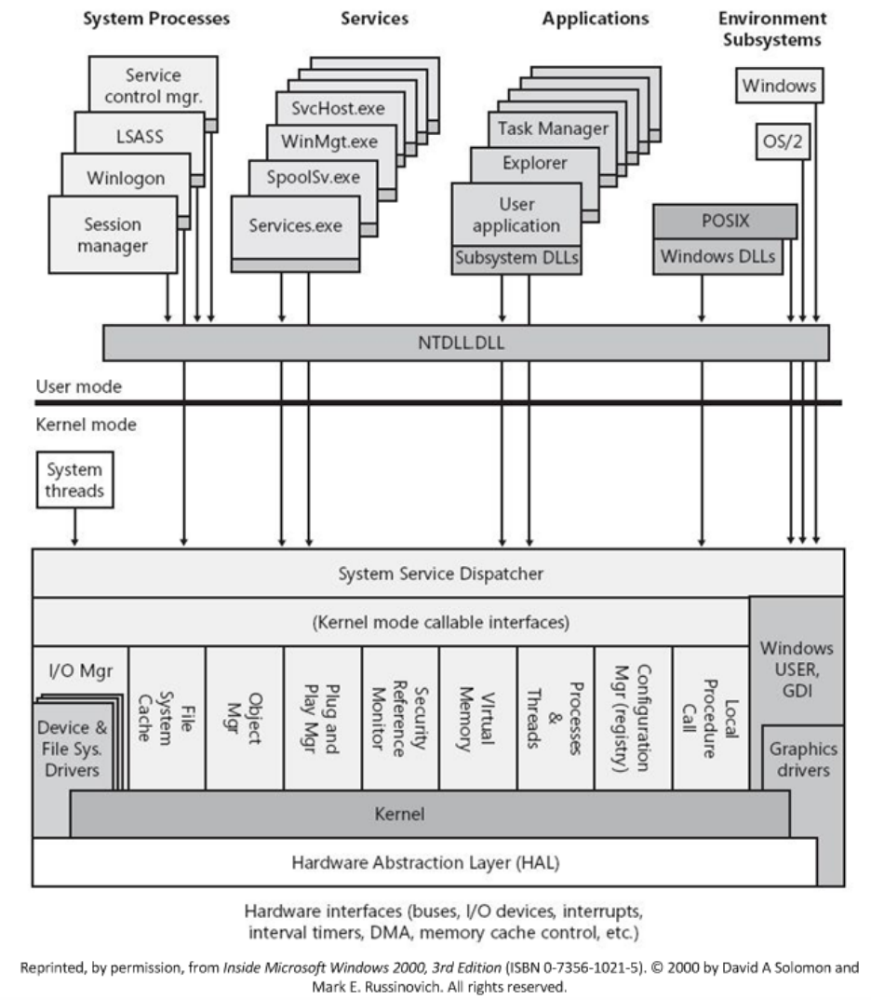
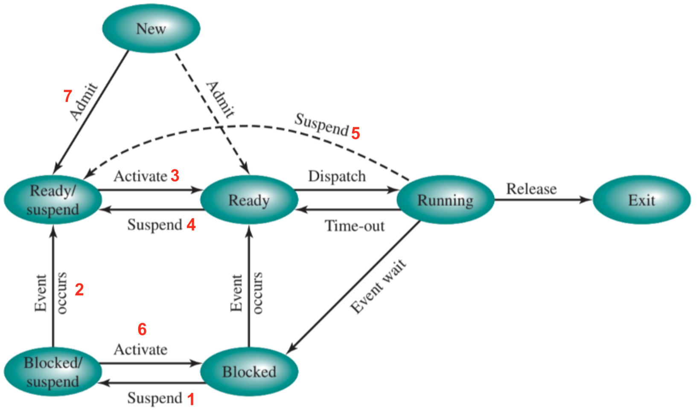
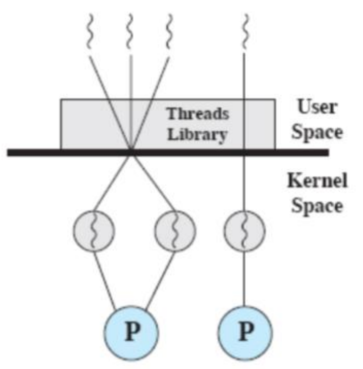
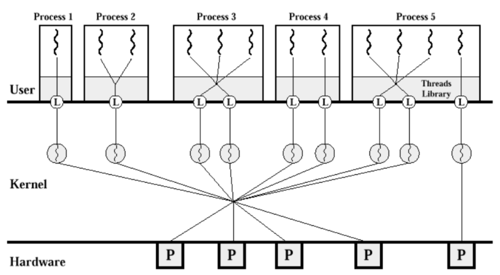
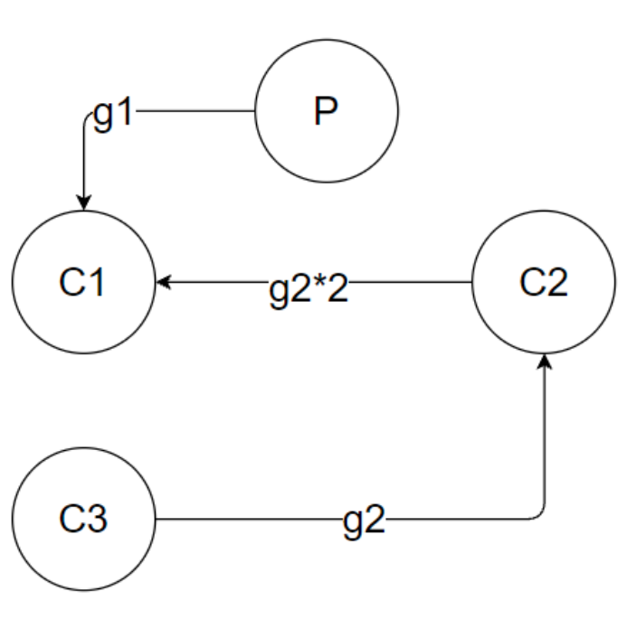
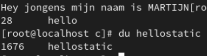

# Besturingssystemen

* Theorie: 50%
  * Vragen uit vragenlijst
* Labo: 50% 

Ik ben een nuttige idioot en ik heb ook bij elke vraag de paginanummers geschreven :wink:.

# Hoofdstuk 1

## Vraag 1

> Wat is het verschil tussen symmetrische en asymmetrische multiprocessing? p15

Bij **asymmetrische multiprocessing** wordt de kernel van het besturingssysteem altijd uitgevoerd op een bepaalde **master** processor. Hij is verantwoordelijk voor scheduling en heeft volledige controle over het geheugen. 

Dit heeft als gevolg dat de andere processoren enkel gebruikersprogramma's en hulpprogramma's kunnen uitvoeren. Als één van deze processoren dan een dienst nodig heeft (I/O ofzo), zal hij een request moeten sturen naar de master. De master is dus de **bottleneck** in dit systeem, maar voor deze benadering zijn echter weinig aanpassingen nodig aan het besturingssysteem indien deze al multitasking voor één processor ondersteunt.


We kunnen op twee manieren doen aan **symmetrische multiprocessing**:

1. De kernel opbouwen uit **meerdere processen** of threads. Dan kunnen ze verdeeld worden over de verschillende processoren. 
2. Elke processor een **volledige kopie** van het besturingsssysteem laten uitvoeren. (is wel iets complexer omtrent communicatie en synchronisatie)

Bij symmetrische multiprocessing kan de kernel dus uitgevoerd worden **op elke processor**. De complexiteit is hoger en deze werkwijze vraagt meer van ons systeem, waarvoor we in ruil wel hogere fouttolerantie en betere uitbreidingsmogelijkheden krijgen.

## Vraag 2

> Wat moet je voorzien om op een Unix-systeem Windows applicaties te kunnen uitvoeren? p12

Een **virtuele machine**. Deze zorgt ervoor dat we functioneel gebruik kunnen maken van software en hardware die niet noodzakelijk effectief aanwezig zijn op ons systeem. Hardware aanspreken via een virtuele machine vereist wel **veel meer software-instructies**, dus we moeten een afweging maken tussen efficiëntie en gebruiksvriendelijkheid.


## Vraag 3

> Bespreek hoe je op Windows een Unix-applicatie kan uitvoeren? Wat wordt in deze context bedoeld met een subsysteem? 

**Omgevingssubsystemen** zorgen voor interactie met de gebruiker en voorzien een API set waardoor we op Windows toepassingen kunnen ondersteunen die geschreven zijn voor andere besturingssystemen, zoals Unix bijvoorbeeld. Elk subsysteem heeft zijn eigen adresruimte. 

Elk programma dat draait kan maar van één omgevingssubsysteem gebruik maken (het is wel logisch dat een windows programma geen UNIX system calls hoeft te doen hoop ik). Als we een Unix applicatie willen draaien, maken we dus gebruik van het POSIX-subsysteem, waarin de meeste UNIX-compatibele software kan worden gecompileerd en uitgevoerd. De API van ons POSIX-subsysteem wordt dus vertaald om toegang te krijgen tot de Executive.

## Vraag 4

> Geef drie mogelijke ontwerpen van kernels. Bespreek bij elk hun voor- en nadelen en of ze nog gebruikt worden. p22?

* **Oude Unix**: monolithische kernel

De kernel van oude Unix versies is **niet erg modulair**, vooral door de beperkte hardwaremogelijkheden van toen. Er zijn ook geen voorzieningen om gegevensstructuren te beschermen tegen gelijktijdige toegang door verschillende processoren. 

De machineafhankelijke code van Unix zit enkel op de lagere niveaus van het I/O-subsysteem, waardoor het gemakkelijk is om Unix naar nieuwe hardware over te brengen. Er zijn dus in de loop van de tijd ook vooral op dit niveau uitbreidingen toegevoegd, maar in het oorspronkelijk ontwerp was er **geen enkele voorziening** om de **kernel** modulair **uit te breiden**.

* **Moderne Unix**: meer modulaire architectuur

Modernere versies van Unix (Solaris, FreeBSD, ...) hebben een **meer modulaire** architectuur. Een kleine kern zorgt voor de diensten die noodzakelijk zijn voor andere modules. 

* **Linux**: monolithische kernel

Het hoofddoel van Linux is om zo veel mogelijk functionaliteit te bieden, met beperkte bronnen. Linux lijkt qua ontwerp sterk op de originele Unix, één monolithische kernel. Dit met het oogmerk op **performantie**. Toch is Linux iets meer modulair dan onze oude Unix, de kernel kan dynamisch verschillende kernelmodules laden. Het is ook niet nodig om de hele kernel opnieuw te compileren wanneer nieuwe functies of hardware toegevoegd moeten worden.


//TODO ik denk dat de laatste twee misschien samen horen en dat de derde kernel misschien windows NT moet zijn?

## Vraag 5

> Gegeven onderstaande figuur:



> Geef van elke component in de “executive” aan wat de werking ervan is. p20

* I/O-manager: verwerkt I/O-verzoeken en is gelaagd opgebouwd om bijvoorbeeld stuurprogramma's dynamisch te laden
* Cache manager: beheert de schijfcache
* Security reference monitor: controleert alle toegang
* Object Manager: maakt en verwijdert objecten
* Process Manager: beheert proces- en threadobjecten
* Virtual Memory Manager: doet de vertaling tussen fysieke en virtuele geheugenadressen. 
* Windows & Graphics (Vanaf NT 4.0): bevatten de scherminterface en de grafische stuurprogrammas (voor NT 4.0 werden ze in gebruikersmodus uitgevoerd)

//TODO hij legt ze precies niet allemaal uit in de cursus, moet ik die andere er dan ook bijzetten? let me know in the comments and be sure to like and subscribe

# Hoofdstuk 2

 

## Vraag 6

> Wat is het verschil tussen een programma en een proces? Wat zijn de oorspronkelijke twee definities voor een proces?p28

Een **programma** is een passieve entiteit. Simpelweg een verzameling van instructies. Een **proces** is daarentegen de effectieve uitvoering van een afzonderlijk programma. Een programma is dus passief en een proces is actief.


//TODO toevoeging van wim

## Vraag 7

> Waarom is het model met twee procestoestanden actief en niet actief niet interessant? Wat is het probleem dat je hier zal tegenkomen? p30

Het model is te simpel. Sommige processen in de toestand 'niet actief' zijn klaar om uitgevoerd te worden, terwijl anderen aan het wachten zijn op bijvoorbeeld een I/O bewerking. De scheduler moet dus telkens in de wachtrij op zoek gaan naar een proces dat niet aan het wachten is.


## Vraag 8

> Geef alle toestanden waarin een thread zich kan bevinden? Bespreek wanneer een thread van de ene toestand in de andere zal terechtkomen. p30-31

* **Nieuw** (new)
  * Nieuw &rarr; Gereed: Een nieuw proces wordt toegevoegd aan de lijst van uitvoerbare processen.
* **Gereed** (ready)
  * Gereed &rarr; Actief: De scheduler kiest één van de processen in de toestand 'gereed' om uit te voeren.

* **Actief** (running)
  * Actief &rarr; Einde: Het proces word afgebroken of het geeft zelf aan dat het voltooid is.
  * Actief &rarr; Gereed: Als het proces te lang bezig is (indien threshold van besturingssysteem), wordt het onderbroken. Het proces kan dit ook bijvoorbeeld doen met *sleep()*.
  * Actief &rarr; Geblokkeerd: Een proces wordt geblokkeerd als hij vraagt om iets waarop hij moet wachten. (meestal in de vorm van een system call naar I/O of wachten op een kindproces.)
* **Geblokkeerd** (blocked)
  * Geblokkeerd &rarr; Gereed: Als het ding waarop het proces aan het wachten was klaar is.
* **Einde** (exit)


## Vraag 9

> Voor processen hebben we een model met 7 toestanden, dewelke? Teken het toestandsdiagram en geef aan hoe en wanneer er van toestand zal worden gewisseld. p32-33

Oké onze Wim heeft dus deze afbeelding van google images schaamteloos zonder referentie in zijn cursus geknald. (hij heeft er wel nummertjes bij gezet dus op zich heeft hij het niet helemaal gepikt)




1. **Blocked &rarr; Blocked/Suspend**
2. **Blocked/Suspend &rarr; Ready/Suspend**
3. **Ready/Suspend &rarr; Ready**
4. **Ready &rarr; Ready/Suspend**
5. **Active &rarr; Ready/Suspend**
6. **Blocked/Suspend &rarr; Blocked**
7. **New &rarr; Ready/Blocked**

// TODO kleine uitleg voor elk nummertje


## Vraag 10

> Wat wordt er bedoeld met het procesbeeld? Geef aan hoe dit er uitziet en beschrijf ook wat er zich in elk deel bevindt. Het PCB mag je hier buiten beschouwing laten. p33-34

Het **procesbeeld** is de verzameling van het **programma**, de **gegevens** en de **stackgebieden**. Voordat een proces uitgevoerd wordt moet het hele procesbeeld dus in het hoofdgeheugen geladen worden. Als het programma zich in onderbroken toestand bevindt wordt het hele procesbeeld als een aaneengesloten blok geheugen op de schijf opgeslagen.


* Geheugentabellen
  * Beheren het hoofdgeheugen en het secundaire geheugen
* I/O-tabellen
  * Worden door het besturingssysteem om I/O apparaten te beheren. 
* Bestandstabellen
  * Worden niet door het besturingssysteem, maar door het bestandsbeheersysteem bijgehouden en bevatten info over over bestanden zoals naam, locatie, status en attributen.
* Procestabellen
  * Worden bijgehouden om processen te beheren. 


## Vraag 11

> De info in het PCB kan je in drie categorieën onderverdelen. Dewelke? Bespreek ook wat er zich zoal in elk deel van het PCB bevindt. p34-36

PCB = Process control block, een blok geheugen in de geheugenruimte van het proces zelf met informatie omtrent procesbeheer.

* Procesidentificatie
  * Het proces krijgt een uniek nummer (een **pid**), deze is een index in de primaire procestabel. De procesidentificatie kan ook verwijzingen bevatten naar andere processen  (bv. ouderprocessen).
* Processortoestandsinformatie
  * Bestaat uit de inhoud van alle processorregisters. Als het proces actief is zit deze inhoud natuurlijk in de registers van de processors. Als het proces onderbroken wordt, zal deze info in het procesbesturingsblok worden opgeslagen zodat het later weer hersteld kan worden.
* Procesbesturingsinformatie
  * Extra informatie die het besturingssysteem nodig heeft voor het beheren van processen. Zoals onder meer:
    * Scheduling- en toestandsinformatie
    * Structurele informatie
    * De locaties van alle delen van het procesbeeld
    * Verwijzingen naar andere geheugentabellen
    * Welke bronnen zijn aangevraagd door en toegewezen aan het proces
    * Informatie over privileges (geheugen en instructies)
    * Eventuele limieten en quota
    * Informatie over vlaggen (*sig, signal, blocked*)


## Vraag 12

> Welke stappen moet het besturingssysteem ondernemen om een nieuw proces aan te maken? p36

Eerst en vooral maken we een unieke **procesidentificatiecode** (pid) aan en voegen we een nieuwe entry toe in primaire procestabel. We **wijzen ruimte toe** aan alle delen van het procesbeeld. Het besturingssysteem moet dus weten hoe veel ruimte er nodig is. Dan initialiseren we het **procesbesturingsblok** (PCB), eigenlijk vooral de procesbesturingsinformatie. Verder moeten we de **juiste koppelingen instellen**, zoals het proces in de wachtrij van 'gereed' of 'gereed/onderbroken' stoppen. 

Tot slot kunnen we eventuele gegevensstructuren aanmaken of andere gegevensstructuren uitbreiden.

## Vraag 13

> Welke opportuniteiten kan het besturingssysteem gebruiken om van proces te wisselen? Bespreek zo gedetailleerd mogelijk op welke momenten de scheduler aan bod kan komen. Geef bij elke mogelijke opportuniteit ook aan of er van proces zal/kan/moet gewisseld worden en geef zo mogelijk ook een aantal voorbeelden om je antwoord te staven. p36-38

1. **Interrupts**
   * *Klokinterrupts*: klok die periodiek decrementeert, wanneer hij nul is zal het programma worden stopgezet zodat het niet te lang draait. (asynchroon)
   * *I/O-interrupts:* verwittigen het besturingssysteem van een I/O-gebeurtenis. De processen die wachten kunnen onderbroken worden om bijvoorbeeld een proces met hogere prioriteit uit te voeren. (asynchroon)
   * *Paginafouten*: verwijzing naar geheugenelementen die al verwijderd zijn (synchroon)

2. **Traps / exceptions**

   Een trap is een speciaal soort interrupt die wordt gegenereerd binnen het actieve proces. Dit kan bijvoorbeeld als je user mode een kernelinstructie probeert uit te voeren. (synchroon)

3. **Systeemaanroepen / software-interrupts**

   Systeemaanroepen zijn de interface tussen het besturingssysteem en de gebruikersprogramma's. Ze worden enkel veroorzaakt op het verzoek van het actieve proces. Systeemaanroepen kunnen op twee manieren gedaan worden:

   * *Berichtgestuurd*: in besturingssystemen met een microkernel of client/server architectuur werkt de interface tussen client- en serverprocessen met het uitwisselen van berichten. Er wordt een kanaal tot stand gebracht tussenbeide. Wanneer een clientproces dan een aanvraag doet, laat het zich vrijwillig blokkeren tot het antwoord beschikbaar is. Als ze alle vragen hebben beantwoord, dragen de serverprocessen de controle over aan de scheduler.
   * *Proceduregestuurd*: Een meer klassieke benadering. Elke systeemaanroep komt overeen met een bibliotheekprocedure. De parameters (of adres naar een lijst van parameters) worden in een register gezet en trap gegenereerd, waarna het systeem in kernelmodus wordt gezet en de controle aan het besturingssysteem wordt overgedragen. Die kijkt met welke interne procedure de systeemaanroep overeenkomt en voert hem uit. Het doel is hier om systeemaanroepen meer te doen lijken op gewone procedures. 

//TODO scheduler

## Vraag 14

> Wat is het verschil tussen een synchrone en asynchrone interrupt? p37

Een **synchrone** interrupt moet onmiddellijk worden uitgevoerd. De uitvoering van het programma waaruit de interrupt is ontstaan kan niet doorgaan zolang het besturingssysteem geen actie ondernomen heeft. Het programma wordt geblokkeerd tot de interrupt afgehandeld is. Voorbeeld: paginafout


Een **asynchrone** interrupt kan daarentegen onmiddellijk worden uitgevoerd, maar ook uitgesteld worden. Het programma wordt niet geblokkeerd en de uitvoering kan doorgaan. Voorbeeld: I/O-interrupt

## Vraag 15

> Geef een aantal voorbeelden die aanleiding zullen geven tot het wisselen van proces. Geef een aantal voorbeelden die wellicht geen aanleiding zullen geven tot een proceswissel. 


## Vraag 16

> Hoe zal men bij een microkernel-architectuur een systeemaanroep afhandelen?  p38

**Berichtgestuurd**: in besturingssystemen met een microkernel of client/server architectuur werkt de interface tussen client- en serverprocessen met het uitwisselen van berichten. Er wordt een kanaal tot stand gebracht tussenbeide. Wanneer een clientproces dan een aanvraag doet, laat het zich vrijwillig blokkeren tot het antwoord beschikbaar is. Als ze alle vragen hebben beantwoord, dragen de serverprocessen de controle over aan de scheduler.

## Vraag 17

> Hoe zal men bij een monolithisch kernelontwerp een systeemaanroep afhandelen? p38

```
Bij een systeemaanroep wordt de context van het huidige actieve proces opgeslagen en de besturing overgedragen aan de kernel. Na de uitvoering van de gewenste functies wordt, oftewel de context van het onderbroken proces hersteld, of verdergegaan met het opslaan van de omgeving van het actieve proces en een ander proces geactiveerd.

// dit hoort hier niet denk ik maar ik wil het niet verwijderen indien het ergens anders past.
```

**Proceduregestuurd**: Elke systeemaanroep komt overeen met een bibliotheekprocedure. De parameters (of adres naar een lijst van parameters) worden in een register gezet en trap gegenereerd, waarna het systeem in kernelmodus wordt gezet en de controle aan het besturingssysteem wordt overgedragen. Die kijkt met welke interne procedure de systeemaanroep overeenkomt en voert hem uit. Het doel is hier om systeemaanroepen meer te doen lijken op gewone procedures. 


## Vraag 18

> Waarom hebben software interrupts een veel lagere prioriteit dan hardware interrupts? p39

Het uitvoeren van systeemaanroepen voor een toepassing is doorgaans minder dringend dan het op tijd bedienen van een I/O-controller, alvorens zijn interne buffers overflowen en er data verloren gaat.  

## Vraag 19

> Er wordt steeds gezegd dat wanneer een proces tegen een I/O-bewerking aanloopt, het proces geblokkeerd wordt. Hoe kan het besturingssysteem dat weten? p39

In de interruptcyclus van de instructiecyclus checkt de processor door middel van de aanwezigheid van een interruptsignaal of er interrupts zijn opgetreden. Er wordt dus periodiek gecontroleerd op interrupts.

## Vraag 20

> Bespreek de stappen bij het afhandelen van een interrupt wanneer de scheduler ervoor opteert om de uitvoering verder te zetten binnen het reeds actieve proces. Wat wordt er hier bedoeld met een moduswissel en een contextwissel? p40

Er wordt teruggeschakeld naar gebruikersmodus en de processortoestandsinformatie wordt hersteld in de registers. Zo wordt dus automatisch de controle terug overgedragen aan het eerder onderbroken proces.

Het overschakelen naar gebruikersmodus is een moduswissel. Bij een contextwissel wordt de inhoud van de registers, waaronder ook de programmateller (de processortoestandsinformatie) gewisseld. In dit geval wordt deze hersteld naar de context van het onderbroken proces, op het moment dat deze voor het laatst uit de toestand *actief* werd gewisseld.

## Vraag 21

> Bespreek de stappen bij het afhandelen van een interrupt wanneer de scheduler ervoor opteert om de uitvoering niet verder te zetten binnen het reeds actieve proces. Welke stappen zijn nodig om een proceswissel door te voeren? p40-41

Het besturingssysteem zal dan wat meer werk moeten doen

* Context van de processor opslaan + procesbesturingsinformatie van het voorgaande actieve proces bijwerken. 
* Procesbesturingsblok van het nieuwe proces naar de juiste wachtrij verplaatsen
* Zijn procesbesturingsblok bijwerken
* Gegevensstructuren voor geheugenbeheer bijwerken
* Terugschakelen naar gebruikersmodus en de context wisselen naar die van het geselecteerde proces.

## Vraag 22

> Wat zijn de nadelen van een procesloze kernel? Welke delen van een Unix- en een Windows kernel zijn procesloos? 


## Vraag 23

> Hoe wordt er van binnen een Unix besturingssysteem doorgaans van proces gewisseld? Hoe komt het dat dit vrij efficiënt verloopt? 


## Vraag 24

> Hoe wordt er binnen een microkernelgeoriënteerd besturingssysteem van proces gewisseld? Wat zijn hier de voor- en nadelen? 


## Vraag 25

> Wat is de herdefinitie van een proces en de definitie van een thread?


## Vraag 26

> Geef het procesbeeld van een multithreaded proces met drie threads. Welke delen worden er over de grenzen van een thread gedeeld. 


## Vraag 27

> Geef voor- en nadelen van multithreading. Welke zijn de mogelijke implementaties (enkel vernoemen volstaat)? 


## Vraag 28

> Wat zijn de voor- en nadelen met user level threading? 


## Vraag 29

> Wat zijn de voor- en nadelen van kernel level threading? 


## Vraag 30

> Wat is het verschil tussen coöperatieve- en preempted multitasking?


## Vraag 31

> Geef het procestoestandsdiagram van een klassiek Unix besturingssysteem en bespreek elke toestandsovergang (cfr. vraag 9). Waarom is dit niet geschikt voor realtime-applicaties?


## Vraag 32

> Een proces in een Windows heeft drie zaken? Benoem ze en bespreek waarvoor ze dienen.


## Vraag 33

> Geef het toestandsdiagram van een Windows thread? Bespreek de toestanden en de mogelijke overgangen. 


## Vraag 34

> Geef het toestandsdiagram van een besturingssysteem dat gebruikmaakt van user level threads en een lichtgewichtproces (cfr. Solaris). Wat zijn de verschillende toestanden en de mogelijke overgangen? Bespreek wanneer er van toestand zal worden gewisseld en geef ook aan in welke toestand de user-level thread en het lichtgewichtproces zich moeten bevinden om uitgevoerd te worden.


## Vraag 35

> Bespreek onderstaande figuur. Hoe worden de verschillende componenten aan elkaar gekoppeld.




## Vraag 36

> Bespreek elke gegeven situatie en geef ook aan waar ze ideaal voor geschikt zijn, m.a.w. waar en wanneer zullen ze worden gebruikt




# Hoofdstuk 3 (labo)

## Vraag 37

> Waarom krijg je bij het schrijven van data naar een filedescriptor die geopend werd met de O_SYNCvlag een heel trage verwerkingssnelheid (2 redenen)? 


Antwoord van the man himself:

> Wanneer je de vlag niet meegeeft zal een proceswissel niet steeds noodzakelijk zijn. Het proces roept via een software-interrupt de systeemaanroep aan, er treedt een modewissel en contextwissel op (cfr. de CPU-registers worden, in Linux althans, op de kernelstack bewaard) en de code van de systeemaanroep wordt in kernelmode uitgevoerd. Zonder de O_SYNC-vlag leidt dit veelal tot een zuivere geheugenoperatie door het wegschrijven van 1 of meerdere bytes van de user-buffer naar de kernel-buffer. De tijd die hiervoor nodig is is zeer beperkt en na de systeemaanroep is een proceswissel dus niet steeds aan de orde. Wanneer de kernelbuffer echter vol komt, moet er een I/O-operatie gestart worden en zal het gebruikersproces moeten worden geblokkeerd tot wanneer alle bytes uit de userbuffer werden gekopieerd. 
>
> Bij het zetten van de O_SYNC-vlag heb je dus naast meer I/O-operaties ook steeds een extra proceswissel wat het vertragend effect nog versterkt. Iedere write-systeemaanroep wordt verplicht om een I/O-operatie te starten en het bijhorende proces te blokkeren tot wanneer de bijhorende I/O-interrupt het geblokkeerde proces deblokkeert.


## Vraag 38

> Wat zijn de voor- en nadelen van (kernel/user) buffering? In de kernel wordt er default gebruikgemaakt van buffering en in het gebruikersprogramma stel je het zelf in. Bemerk dat wanneer je opeenvolgende schrijfopdrachten doet met slechts 1 byte, je per definitie geen buffering gebruikt. 


Antwoord van the man himself:

> Buffering beperkt het aantal I/O-opdrachten naar de schijf. De blokgroottes die naar schijf worden geschreven zijn niet bepalend voor de schijfprestaties, het aantal lees/schrijfoperaties per seconde (IOPS ook wel eye-ops uitgesproken, bij een klassieke magnetische disk een hondertal, bij een solid state schijf veel meer maar dan nog) daarentegen wel. Dus meer lees- of schrijfopdrachten beperkt de snelheid van het computersysteem in zijn geheel (i.e. veel meer processen in geblokkeerde toestand die aan het wachten zijn op een I/O-interrupt, ook het oplossen van paginafouten verloopt trager). 
>
> Buffering zorgt dat lees/schrijfopdrachten plaatsvinden op een geheugenbuffer en wanneer die dreigt vol te lopen zal het OS die moeten flushen. Er wordt dus van heel veel kleine I/O-opdrachten één grote I/O-opdracht gemaakt die dan daadwerkelijk naar schijf zal worden geschreven. 
>
> Het nadeel is wel dat je ten eerste geheugen zal moeten toekennen om die buffers te voorzien en twee dat er ook wel wat werkt kruipt in het constant in de gaten houden van de buffergrootte zodat die tijdig kan worden leeggemaakt (bij schrijven) of opgevuld (bij lezen). Buffering vereist ook complexe algoritmes die de buffers op juiste moment moeten aanvullen of leegmaken.


## Vraag 39

> Wanneer zal de systeemaanroep read resulteren in een geblokkeerd proces en wanneer niet. Idem voor een write-systeemaanroep. Geef nog een aantal andere systeemaanroepen die doorgaans een proces zullen blokkeren en dus bijgevolg een proceswissel zullen veroorzaken. 


Antwoord van the man himself:

> Wanneer de buffer net moeten worden opgevuld, zal het OS het proces moeten blokkeren tot wanneer de achterliggende I/O-opdracht de buffer terug aangevuld heeft. Wanneer de buffer nog voldoende gevuld is zal het OS onmiddellijk de leesopdracht kunnen beantwoorden zonder te moeten wisselen van proces. 
>
> waitpid en bv. write (bij een volle buffer die moet geflusht worden) zijn voorbeelden van systeemaanroepen die een geblokkeerd proces en dus een proceswissel zullen veroorzaken.

## Vraag 40

> Geef een kort C-codefragment waarmee je een zombie-proces aanmaakt. Wanneer een proces een zombieproces wordt, welk deel van het proces houdt de kernel dan nog in het geheugen bij en waarom? 


Antwoord van the man himself:

```c
int main(){
  int pid;
  if ( (pid=fork()) < 0){
    perror(argv[0]);
    exit(1);
  }
  else if (pid == 0){
    //child
    exit(0);
  }
  //parent
  sleep(60);
  //niet wachten, geen waitpid dus
}
```

> Wanneer een proces klaar is komt het in Unix in de status zombie terecht vooraleer het wordt afgebroken. Het proces kan echter uitsluitend worden afgebroken wanneer de parent zijn exitstatus leest. Doet de parent dit niet, wordt het proces niet volledig beëindigd en blijft het in de toestand zombie. Als de parent zelf beëindigd wordt, wordt het kind naast een zombie ook een orphan dat geadopteerd wordt door het init-proces. Het init-proces zal de exit-status van het kind lezen waardoor vervolgens ook het kindproces kan worden ontmanteld. 
>
> De exit-status van een proces wordt in Linux bijgehouden in het PCB (process control block) dat dus zolang het in de status “zombie” vertoefd in het geheugen blijft. 
>
> Bij een daemon-proces zal je dus bij het niet correct lezen van de exit-statussen van de kinderen een ganse waslijst met zombie-processen maken die op zich 0% CPU tijd krijgen (dus geen probleem voor de scheduler) en ook 0% geheugen toegewezen krijgen. Iedere zombie neemt wel een plaats in de globale procestabel in beslag en bovendien blijft de volledige procesbesturingsinformatie achter in het geheugen! Dit is dus niet onschuldig!


## Vraag 41

> Na de systeemaanroep fork kan de uitvoering worden verdergezet in ofwel het kind ofwel de ouder. In welke van de twee zal de uitvoering hoogstwaarschijnlijk worden verdergezet en waarom? Wanneer zal dit niet het geval zijn? 


Antwoord van the man himself:

> Wanneer je een systeemaanroep aanroept wordt er naar kernelmode geschakeld om de software interrupt (systeemaanroep) af te handelen. Hierna komt de scheduler (ook in kernelmode) aan bod om te kijken of er door de interrupt-afhandeling geen meer prioritaire processen werden gedeblokkeerd en zich dus in de toestand “gereed” bevinden. Dit is hier onmogelijk want de enige manier dat er preemptief van proces kan worden gewisseld is wanneer er na het afhandelen van de systeemaanroep processen gedeblokkeerd werden met een hogere prioriteit. Dus zal de uitvoering gewoon worden verdergezet in het proces dat aan zet was voor de onderbreking, de parent dus. Er is slechts één manier waarbij het kind als eerste aan bod zou kunnen komen en dat is dat bij het aanroepen van de systeemaanroep alle toegewezen tijd door de parent werd opgebruikt. Dan en enkel dan zal het kind als eerste aan bod komen

## Vraag 42

> Linux kent geen fork-systeemaanroep. Hoe komt het dat je hem wel kan gebruiken? 


Antwoord van the man himself:

> Linux gebruikt de glibc-POSIX API. Die staat in voor de vertaling van courante Unixsysteemaanroepen naar Linux-specifieke systeemaanroepen.

## Vraag 43

> In welke situatie maak je gebruik van een named pipe en kan je dus geen unnamed pipe gebruiken? 


Antwoord van the man himself:

> Unamed pipes of anonieme pipes kan je uitsluitend gebruiken voor IPC (interprocescommunicatie) tussen processen met verwantschap (ouder, kind, broer, kleinkind,…). Bij processen zonder verwantschap moet je gebruikmaken van een named pipe, i.e. een object op het bestandssysteem dat je een naam moet geven (vandaar ook de naam).

## Vraag 44

> Zijn POSIX-threads (of pthreads genoemd) kernel level threads of user level threads? Hoe kom je tot dit besluit?


Antwoord van the man himself:

> Linux kent uitsluitend tasks en maakt eigenlijk geen onderscheid tussen threads en processen. Bij het gebruik van POSIX-threads merk je op dat er achter de schermen een clone-systeemaanroep wordt gebruikt en waar dus een nieuw proces mee wordt aangemaakt waarbij alles gedeeld wordt behalve dan de userstack. Ook wanneer je kijkt met de opdracht top -H zie je hier twee processen staan waarbij het dus eerder aanleunt bij de definitie van kernelthreads dan bij de definitie van user level threads. Ter info bij user level threads is het besturingssysteem niet op de hoogte van het gebruik van threads. De scheduler kan dus onmogelijk een user level thread voor uitvoering selecteren. Alle beheer van user level threads komt dus terecht bij de applicatie zelf. Het proces moet dus de nodige code bevatten om zelf te switchen tussen threads. Blokkeert één user level thread op een I/O-bewerking, dan blokkeert het volledige proces. Ook al kunnen andere threads binnen dat proces wel verder doen. 

# Hoofdstuk 4


## Vraag 45

> Aan welke vier randvoorwaarden moet ieder geheugenbeheersysteem voldoen? 


## Vraag 46

> Bespreek de werking van vaste partitionering (vaste grootte en verschillende grootte). Wat zijn de voor- en nadelen van dit systeem? Hoe zal het besturingssysteem procesbeelden gaan plaatsen in een systeem met vaste partitionering. 


## Vraag 47

> Bespreek de werking van dynamische partitionering. Wat zijn de voor- en nadelen? Welke zijn de verschillende plaatsingsalgoritmen en bespreek de werking en functie van elk algoritme. 


## Vraag 48

> Hoe gebeurt adresvertaling bij dynamische partitionering? 


## Vraag 49

> Bij dynamische partitionering kan je voor het geheugengebruik een bitmap of een gelinkte lijst bijhouden (maak een schets)? Hoe gebeurt dit en wat zijn de voor- en nadelen van beide systemen? 


## Vraag 50

> Bespreek de werking van paginering (zonder virtueel geheugen). Wat is het verschil tussen paginering en vaste partitionering? Hoe gebeurt de adresvertaling bij paginering (maak een schets)? 


## Vraag 51

> Bespreek de werking van segmentatie (zonder virtueel geheugen)? Wat is het verschil tussen dynamische partitionering en segmentatie? Waarom wordt dit model voor de gebruiker bewust zichtbaar wordt gehouden. Geef een voorbeeld waar je handig gebruik kan maken van segmenten. Hoe gebeurt de adresvertaling bij segmentatie (maak een schets)? 


## Vraag 52

> Bespreek de stappen die moeten ondernomen worden wanneer bij adresvertaling wordt vastgesteld dat een deel van het proces zich niet in het geheugen bevindt? 


## Vraag 53

> Wat zijn de drie voordelen van het gebruik van virtueel geheugen? Wat is het nadeel van het gebruik van virtueel geheugen? 


## Vraag 54

> Welke twee parameters moet het besturingssysteem in de gaten houden om te zien of er bij het gebruik van virtueel geheugen te veel dan wel te weinig paginafouten optreden? Wat wordt er bedoeld met “thrashing”? Hoe kan het besturingssysteem oordeelkundig inschatten welke pagina’s in de toekomst nodig zullen zijn en welke niet? 


## Vraag 55

> Welke extra zaken moeten er bij paginering in de paginatabel worden bijgehouden om paginering te kunnen doen in een systeem dat virtueel geheugen gebruikt. Hoe gebeurt de adresvertaling bij paginaring met virtueel geheugen (maak een schets)? 


## Vraag 56

> Welke parameters pleiten voor kleine paginagroottes en welke voor grote paginagroottes? 


# Zelftest 1 labo

## Vraag 1

> Leg uit wat het verschil is tussen statisch en dynamisch linken? Enkel de uitleg 
> volstaat.

Bij statisch linken wordt alle code in één groot uitvoerbaar bestand geplaatst. Bij dynamisch linken worden voor alle onbekende symbolen stubs in de uitvoerbare code voorzien. De code zelf bevindt zich in een externe library die bij het starten van het proces aan de virtuele adresruimte wordt toegevoegd. De dynamische linker zal ervoor zorgen dat bij de iedere aanroep van een functie waarvan de code niet beschikbaar is, de code uit de bibliotheek zal uitgevoerd worden. Het voordeel van dynamisch linken is dat een bibliotheek maar één keer in het geheugen moet worden geladen en dat die dan in de adresruimte van ieder proces die hem nodig heeft kan ondergebracht worden (cfr. shared memory). Het kost wel meer tijd om uit te voeren omdat de dynamisch linker bij iedere stub de code in de bibliotheek moet gaan zoeken.

## Vraag 2

> Hoe kan je een terminal venster leeg maken? 

```
clear
```


## Vraag 3

Hoe kan je met het commando man informatie opvragen over de informatie 
in het bestand /etc/passwd?  

```bash
man 5 passwd # sectie 5 in de manpage van passwd
```

 

## Vraag 4

Met het commando man kan je informatie opvragen over externe Linux/Unix-
opdrachten. Hoe kan je best info opvragen over interne opdrachten zoals 
echo, printf, set, cd, ... 

 

```
help echo
help printf
```


## Vraag 5

Welk commando kun je gebruiken om: 
a.  gegevens te sorteren? 

```
sort
```

b.  het verschil tussen twee bestanden te bekijken? 

```
diff
```

c.  een bestand of directory te zoeken? 

```
find
```

d.  duplicate regels uit een bestand te verwijderen? 

```
sort {file-name} | uniq -u
```

e.  enkel de 10 eerste lijnen uit een bestand op het scherm te tonen? 

```
head
```

f. enkel de 10 laatste lijnen uit een bestand op het scherm te tonen? 

```
tail
```

g.  een string te zoeken in een tekstbestand? 

```
grep
```

h.  het aantal lijnen, woorden en karakters van een bestand te tonen? 

```
wc
```


## Vraag 6

De inhoud van de /dev-map bevat bestanden die je in twee groepen kan onderverdelen. Block special device files voor harde schijven en andere “mass storage devices” en character special device files voor de overige randapparatuur waar een device-node voor werd voorzien (niet elke device heeft immers een device node). 

Wat is het essentiële verschil tussen een block- en character special device files? 

> Een block special device heeft meer besturingssysteem nodig aangezien er gebufferd wordt. Bij een character special device gebeurt dit niet. Het heeft dus eigenlijk dus niets te maken met het soort devices wat volgens sommige bronnen het geval is. Het heeft te maken met de manier van programmeren. Block special devices zijn complexer te maken en vandaar dat ze ook schaarser zijn.

Bedankt Wim, maar nu weet ik eigenlijk nog steeds niet wat ze zijn. //TODO

## Vraag 7

Wat is de betekenis van de twee getallen die naast een device node vermeld staan?  

Het major nummer identificeert de device driver die door het OS gebruikt moet worden. Het minor nummer geeft aan welke instantie er gebruikt van maakt. 

Een device node met major nummer 8 en minor nummer 2 moet je lezen als “De tweede instantie die gebruik maakt van de door het systeem gekende driver met als nummer 8”. Achter de schermen zal er binnen de kernel wel ergens een tabel bijgehouden worden waar het major nummer zal gebruikt worden als index om zo de device driver te vinden. De combinatie van beide is uniek. Het major nummer geeft aan welke driver er moet gebruikt worden en het minor nummer identificeert dan weer het device dat er gebruik van maakt.

## Vraag 8

Gebruik het commando find om een overzicht te krijgen van zowel de  character special device files als de block special device files. Probeer het  eerst door twee opdrachten te geven en daarna door de twee opdrachten te  groeperen in één opdracht.  

```bash
find /dev -type b
```

```bash
find /dev -type c
```

```bash
find /dev -type b && find /dev -type c # hihi ik weet dat dit illegaal is 
```


 ## Vraag 9

Leg uit wat het verschil is tussen een hard link en een soft link. Wat zijn de voor- en nadelen van beide. 

**Hardlink**
Een inode bevat alle info over een filesysteemobject. Datum en tijdstip van laatste wijziging, de grootte, het uid van de eigenaar, de toegangsrechten, enzovoort. Ook bevat de inode een verwijzing naar de datablokken. Wanneer je aan een filesysteemobject een extra naam toekent op een eventueel andere locatie, dan is dat een hardlink. Ze delen dezelfde inode dus wanneer je een hardlink verwijdert wordt de naam verwijderd. Enkel wanneer de laatste naam (link) verwijderd wordt, wordt de inode verwijderd en dus ook de bijhorende data. Vandaar ook de naam van de syscall om iets verwijderen...unlink! 

Een hardlink is dus niet op het eerste zicht zichtbaar. Enkel met “ls -l” kan je zien hoeveel hardlinks er zijn. Bij het aanmaken van een directory worden automatisch twee hardlinks toegevoegd, nl “.” En “..”. De “.” is een hardlink naar de nieuwe map, de “..”
is een verwijzing naar de bovenliggende map. 

**Symlink, softlink of logische link...**
Bij een symlink wordt een nieuwe inode aangemaakt met een verwijzing naar de naam van het filesysteemobject. Een verwijzing naar de naam, niet naar de inode! Dit is duidelijk zichtbaar bij een “ls -l” opdracht aangezien je uiterst links lrwxrwxrwx zal terugvinden en uiterst rechts “linknaam -> naam”.

Hardlinks hebben als nadeel:

* Niet mogelijk voor directories. Anders kan je lussen maken in je bestandssysteem. Een opdracht zoals find kan het verschil niet zien tussen de link en het origineel aangezien er gewoon geen verschil is. Een hardlink is een extra naam die je toekent.
* Niet mogelijk over de grenzen van schijfpartities/schijven/USB- sticks/etc. Dus een hardlink kan je enkel maar leggen naar objecten binnen hetzelfde bestandssysteem.
* Minder zichtbaar voor gebruikers

Hardlinks hebben als voordeel:

* Neemt geen extra plaats in op schijf. Er wordt geen nieuwe inode
  aangemaakt!
* De voordelen van een symlink zijn de nadelen van een hardlink en
  omgekeerd.

 

 ## Vraag 10

Maak in je home-directory een softlink aan naar /etc/passwd en een hardlink  naar /etc/group (probeer dit met het commando cp als met commando ln). 

Hoe kan je zien of het wel degelijk over een hardlink gaat en niet over een kopie? 


## Vraag 11

Waarom is een pseudo random generator met een beperkt aantal bits geen goede random generator? 

 

## Vraag 12 

Hoe kan je met het commando head en bijhorende optie 4 bytes uit 
/dev/random halen en deze bytes gewoon zonder te converteren naar het 
scherm schrijven? 

## Vraag 13

Wat is pathname expansion? Wat zijn de verschillende metatekens die je bij 
pathname expansion kan gebruiken? 


## Vraag 14

Hoe kan je met het commando “ls -l” een overzicht geven van alle 
bestandsnamen die bestaan uit minstens twee letters gevolgd door een cijfer 
gevolgd door een willekeurig aantal karakters?  


## Vraag 15

Wanneer je “echo *” ingeeft, welk proces zorgt dan dat die * wordt omgezet 
naar bestandsnamen? 

## Vraag 16

Maak met touch een bestand aan met als naam passwd in je huidige 
werkdirectory. Zoek nu met het commando find naar alle bestands- en 
directorynamen, te beginnen bij /, die beginnen met het woord pass gevolgd 
door 0 of meerdere willekeurige tekens? Zorg dat find hier het *-teken omzet 
naar 0 of meerdere willekeurige tekens.  


## Vraag 17

Genereer met brace expansion alle hexadecimale getallen van 00 tot FF. 


## Vraag 18

Wat doet het commando sync? Wat wordt er bedoeld met mounten en 
unmounten?  

## Vraag 19

Welke filedescriptoren worden er gebruikt voor standaard invoer, standaard 
uitvoer en het standaardfoutenkanaal? Wat is het essentiële verschil tussen 
de twee uitvoerkanalen?


## Vraag 20

Waarvoor dient /dev/null? Hoe kan je de gebufferde uitvoer van een 
willekeurige opdracht naar /dev/null schrijven? Hoe kan je de niet-gebufferde 
uitvoer van een willekeurige opdracht naar /dev/null schrijven? Hoe kan je 
ervoor zorgen dat ze nu allebeide naar /dev/null worden gestuurd? 


## Vraag 21

Wanneer is het handig om gebufferde uitvoer om te zetten naar niet 
gebufferde uitvoer? Wanneer is het nodig om niet-gebufferde uitvoer naar 
gebufferde uitvoer om te zetten? 


## Vraag 22

Wat is een pipe? Wat wordt doorgelaten en wat niet? 


## Vraag 23

Tel hoeveel fouten het commando “du /proc” oplevert en maak hierbij 
gebruik van een pipe? 


## Vraag 24

Gegeven “strace shuf -i 1-10 -n 5”. Strace schrijft de uitvoer van het 
commando shuf naar stdout. De systeemaanroepen die het commando shuf 
aan het besturingssysteem heeft gericht worden naar stderr gestuurd. 
Herschijf de bovenstaande opdracht zodat nu uitvoer van shuf naar /dev/null 
wordt gestuurd en waarbij de systeemaanroepen kunnen worden overlopen 
door een pipe naar het commando less. 


## Vraag 25

Open de manpagina van de opdracht tr. Maak ook een bestand aan met 
uitsluitend leestekens en kleine letters. Hoe kan je met tr alle tekst uit dit 
bestand omzetten naar een hoofdletters? Het commando tr kent geen 
bestandparameters waardoor je met input en output redirection zal moeten 
werken. Bemerk ook dat het een slecht idee is om binnen een proces van een 
bestand te lezen en er ook naartoe te schrijven. Maak dus gebruik van een 
tijdelijk bestand dat je na tr met de opdracht cp naar het originele bestand 
kopieert (en waardoor dus het oorspronkelijk bestand overschreven wordt).  


## Vraag 26

Hoe wordt het regeleinde aangegeven in Windows en hoe wordt dit gedaan 
in Linux? Het gebruik van het Linux-formaat in Windows geeft problemen, 
dewelke? Het gebruik van het DOS-formaat geeft dan weer nog grotere 
problemen in Linux. Waarom? 


## Vraag 27

Gebruik het commando od om de inhoud van het bestand /etc/passwd 
hexadecimaal, in groepjes van 1 byte, op het scherm te tonen.  Doe hetzelfde 
met het commando xxd en vergelijk de uitvoer van beide commando’s. Bekijk 
uitvoerig de manpagina’s van beide opdrachten! 


## Vraag 28

Bij vraag 12 werd er gevraagd om 4 bytes (32 bits) te lezen van /dev/random. 
Zet die uitvoer met het commando od nu om naar een decimaal getal. Hoe 
zet je het om naar een strikt positief getal? (unsigned dus) 

 

 

 

# Zelftest 2 labo

## Vraag 1

Zoek naar alle bestanden of symlinks met een grootte van 1M of die de voorbije 24u werden gewijzigd. 


## Vraag 2

Geef hieronder de opdracht of pipeline van opdrachten om de bovenstaande uitvoer te ordenen op basis van het inodenummer (grootste eerst, kleinste laatst). 


## Vraag 3

Volgens de manpagina van find kan je met de optie -o op twee dingen testen en zal de naam van het object uitgeprint worden wanneer een van de twee voorwaarden voldaan is. Ook kan je haakjes gebruiken om dit te doen (let wel, in BASH moet je die wel escapen met een \ om aan te geven dat die haken voor find bedoeld zijn). Geef een overzicht van alle bestanden in de map /etc die een grootte hebben kleiner dan 10K of groter dan 100K. 


## Vraag 4

Geef van alle bestanden die zich bevinden in de /etc directory bevinden en die een grootte hebben van minder dan 10K het aantal lijnen. Doe dit op twee manieren: a. Met de optie -exec van find b. Door alle namen via een pipe door te geven naar het commando xargs die dan op iedere bestandsnaam het commando wc uitvoert. 


## Vraag 5

Bij het bovenstaande heb je wellicht geen rekening gehouden met bestandsnamen die spaties bevatten. Bij find kan je vragen om de bestandsnamen af te sluiten met een null-karakter i.p.v. een newline (\n) door middel van de optie -print0. Gebruik nu opnieuw xargs met bijhorende parameters om op iedere null-terminated bestandsnaam “wc -l” toe te passen.  


## Vraag 6

Gebruik het commando shuf om 16 getallen te genereren tussen 10 en 50 en gebruik xargs om die uit te schrijven in een raster van 4 bij 4. 


## Vraag 7

Zelfde vraag als hierboven maar doe dit nu met printf (2 karakter per getal) en command substitution. Je zal zien dat dit een betere uitlijning geeft wanneer je “%2d” gebruikt voor ieder getal. 


## Vraag 8

Hoe worden lijneindes aangegeven in Windows en hoe gebeurt dit in Unix/Linux? Waarom is het belangrijk om te werken met tekstbestanden/scripts/… die regeleindes hebben overeenkomstig het besturingssysteem? Geef enkele voorbeelden waar het fout kan gaan.


## Vraag 9

Geef de reguliere expressie om te testen of een lijn een getal bevat. Geef nu de reguliere expressie om te testen of een lijn uitsluitend een getal bevat. Maak een testbestand aan waar je enkele lijnen naartoe wegschrijft die voldoen en die niet voldoen. Test vervolgens met het commando grep uit of de reguliere expressie die je hebt uitgedacht, voldoet.


## Vraag 10

Een geldig e-mailadres voldoet aan de volgende regel “naam@domeinnaam” waarbij zowel de naam als de domeinnaam kan bestaan uit verschillende delen gescheiden door punten. De (domein)naam bestaat uitsluitend uit letters en/of cijfers. Test opnieuw uit of een regel van een tekstbestand uitsluitend een geldig e-mailadres bevat (dus tussen het begin en het einde van de regel bevindt zich een e-mailadres).


## Vraag 11

Waarvoor dient in een script de shebang-lijn? (i.e. #!/bin/bash)? 


## Vraag 12

Wat is het type van iedere variabele in BASH? 


## Vraag 13

Wanneer is het handig of zelfs noodzakelijk om bij het uitschrijven van een variabele de variabelenaam tussen accolades te plaatsen? 


## Vraag 14

Schrijf een BASH-script dat een getal inleest (geen controle nodig) en de derdemacht van dat getal naar het scherm schrijft (via arithmetic expansion). 

Een intermezzo….de magie van process substition… 

Bij interprocescommunicatie wordt meestal gebruikgemaakt van de verticale streep en voldoet een opdrachtregel aan de volgende syntax: 

opdracht1 | opdracht2 | opdracht3 

De uitvoer van opdracht1 wordt via een anonieme pipe naar het invoerkanaal van het proces waar opdracht2 in uitgevoerd wordt. Hetzelfde met de uitvoer van opdracht2 naar de invoer van opdracht3. 

Hoe handig deze syntax is, er is één groot nadeel aan verbonden. Dat is dat iedere opdracht na de verticale streep uitgevoerd wordt in een subshell van de huidige shell. Dus wanneer bv. variabelen wil gaan inlezen via de opdrachtlijn: 

echo 1 2 3 | read a b c echo \$a 

kom je er altijd op uit dat als je de inhoud van de variabele a wil uitschrijven dat die precies niet bestaat. Dat is niet abnormaal aangezien je nu zou moeten weten dat het inlezen en dus ook het toekennen is gebeurd in een subshell en niet in de shell waar je de oorspronkelijke “echo 1 2 3” hebt laten uitvoeren. 

Om dit wel mogelijk te maken zou je maar al te graag de volgorde van de opdrachten omdraaien en dat kan wanneer je gebruikmaakt van process substitution. De syntax is complexer als met de verticale streep maar is veel flexibeler te gebruiken. De bovenstaande opdracht kan als volgt worden geschreven: 

read a b c < **<(echo 1 2 3)** 

Het in het vetgedrukte gedeelte is proces substitution. Het eerste <-teken staat voor input redirection onmiddellijk gevolgd door een spatie, gevolgd door een <(opdracht). Let op, dit is aan elkaar geschreven en er kan zeker geen spatie staan tussen het <-teken en de openende ronde haak aangezien een <-teken omringd door spaties in BASH duidt op input redirection. 

Wat er achter de schermen gebeurt is hetzelfde als met de verticale streep. Er worden twee kindprocessen aangemaakt die via een tijdelijke pipe met elkaar data uitwisselen. Hierbij wordt de <(opdracht) vervangen door een tijdelijk bestand dat zich in de /dev map bevindt en dat eigenlijk een gateway is naar de leesfiledescriptor van de pipe. Dus net zoals met I/O kan je eenvoudigweg via een bestand toegang krijgen tot een structuur in de kernel. 

Even terzijde maar >(opdracht) kan ook. Hier zal je dus een tijdelijk bestand zien verschijnen in de /dev map dat een gateway is naar schrijffiledescriptor van de pipe. 

Enkele voorbeelden: 

```
ls <(:) >(:) #hier zie je de tijdelijke bestanden voor interprocescommunicatie 

grep -E “^pass” <(ls -lR /etc) 

grep -E “^pass” < <(ls -lR /etc) 
```

De laatste twee opdrachten geven identieke uitvoer. Bij de eerste opdracht zal <(ls -lR) vervangen worden door een tijdelijk bestand dat zich in de /devmap bevindt en waarvan grep gewoon van leest. Bij de tweede opdracht wordt er gewerkt met input redirection waarbij de invoer voor het  commando grep komt van het tijdelijke bestand in de /dev-map. Onnodig om te zeggen dat de input redirection onnodig is! 

Heb je bv. een kopie gemaakt van een map, dan kan je heel eenvoudig controleren of de inhoud van het origineel en van de kopie hetzelfde is. Dit kan door: 

diff <(ls -lR origineel) <(ls -lR kopie) 

Zoals onmiddellijk duidelijk wordt is dit met de verticale strepen heel wat lastiger om niet te zeggen onmogelijk! Hier worden achter de schermen drie kindprocessen aangemaakt en leest diff van zowel het ene kind (ls -lR origineel) als van het tweede kind (ls -lR kopie). Beide ls-processen hebben een pipe naar het commando diff en voor iedere pipe wordt een tijdelijk bestand voorzien waardoor diff kan lezen van die pipes alsof het van reguliere bestanden leest. 


## Vraag 15

Het commando read splitst op basis van de inhoud van de IFS-variabele. Zijn er meer variabelen dan dat er elementen zijn, dan zullen de overtollige variabele leeg zijn. Zijn er minder variabelen dan dat er elementen zijn dan zal de laatste variabele het restant van de lijn bevatten. 

IFS-wijzigen om bv. read te laten splitsen op basis van iets anders dan whitespace kan gewoon door de volgende constructie: 

IFS=. read a b c d <<< string 

De <<< is string input redirection en betekent dus dat je van plan bent om niet van een bestand te lezen maar van een string. 

IFS=. read a b c d <<< “192.168.16.16”

 echo $a 

Wanneer je IFS een waarde toekent vóór een commando dan zal IFS enkel en alleen gewijzigd zijn voor dat commando en dus niet voor de rest van het script! Dus dan gaat het om een wijziging in de context van dat commando. 

Schrijf een script dat een IPv4-adres inleest en dat daarna dat IPv4-adres opsplitst in vier variabelen. Daarna check je of ieder van deze variabelen  bestaat en of dat het een getal voorstelt en of dat dat getal binnen de grenzen [0-255] ligt. Indien deze voorwaarde niet voldaan is, dan is het geen geldig IPv4-adres! Het script eindigt met een passende foutboodschap wanneer er geen geldig IPv4 adres werd ingelezen. (Met een reguliere expressie testen op de geldigheid van een IPv4-adres is niet eenvoudig maar de constructie hierboven maakt het makkelijker) 


## Vraag 16

Schrijf nu hetzelfde script als hierboven maar geef het IP-adres als een parameter mee met het script. Als de parameter niet wordt meegegeven, dan wordt verondersteld dat het IP-adres dat je moet checken 192.168.16.8 is. 


## Vraag 17

Gebruik stringoperatoren om alle klinkers uit een woord te vervangen door een punt. (probeer dit ook eens uit via de externe opdracht tr) 


## Vraag 18

Hoe kan je van een getal dat de bestandsgrootte in bytes voorstelt en waarbij digit grouping gebruikt wordt, bv. 131.273.678, één getal maken en dat getal in kilobytes naar het scherm schrijven. Hieronder volgen enkele oefeningen op C en systeemaanroepen: 


## Vraag 19

Schrijf in C een eigen versie van het commando du. De bestandsgrootte kan je opvragen met de syscall stat. 


## Vraag 20

Schrijf in C een eigen versie van het commando “wc -l” dat van de laatste 100 bytes van de bestanden die meegegeven worden op de commandolijn het aantal lijnen bepaalt. In BASH zou je dit als volgt schrijven …. tail -c 100 bestand1 bestand2| wc -l. Doe dit zonder pipe en zonder execve syscalls maar dus louter met open/read/write/close/…! 


## Vraag 21

Doe nu hetzelfde als vorige vraag waar je wel gebruikmaakt van kindprocessen en een pipe als IPC. Gebruik ook execve of gelijkaardige syscalls om de programma’s aan te roepen. 


## Vraag 22

Gegeven volgende situatie: 



C1 en C2 zijn kindprocessen van P. C3 is een kindproces van C1. 

De werking is als volgt: Zowel de parent P als child C3 genereren een willekeurig getal. De parent stuurt zijn getal naar C1 en child C3 stuurt zijn willekeurig getal naar C2. Child C2 vermenigvuldigt het ontvangen getal van C3 met twee en stuurt dat getal door naar C1. C1 telt het getal van de parent P samen met het getal ontvangen van child C2 en schrijft de som naar het scherm. 

Schrijf een volledig C-programma dat alle processen aanmaakt en ervoor zorgt dat C1 de som van g1 en g2*2 naar het scherm schrijft. 

 


# Labo opgaven

### Deel 1

1. Welke toetsencombinatie heb je nodig om een runnend programma (een proces dus) te onderbreken? 

`ctrl + C`

2. Hoe kan je een runnend programma pauzeren? (Het hervatten van een programma zullen we later zien) 

`ctrl + Z`

3. Wanneer een programma vraagt om gegevens in te typen, met welke toetsencombinatie kan je dan aangeven dat de invoer stopt? 

`ctrl + D`

4. Wanneer je op de commandolijn een aantal woorden intikt, hoe kan je dan het laatste woord verwijderen?

`ctrl + W`

5. In een shell kan je aan “auto completion” doen door gebruik te maken van de tab-toets. Tik de letters “les” in, en tik vervolgens op de tab-toets. Je merkt dat er automatisch less verschijnt. Nu kan het zijn dat er nog opdrachten zijn die met less beginnen. Tik nogmaals op de tab-toets om te kijken welke opdrachten er met less beginnen. Een ander handigheidje is “reverse search” om eerder ingetypte commando’s te suggereren tijdens het typen. Gebruik hiervoor “CTRL+r”.

### Deel 2

1. Met de opdracht man kan je alle info over een welbepaalde opdracht achterhalen. Zo zal de opdracht “man ls” de info tonen van de ls-opdracht. Man toont de informatie a.d.h.v. een pager, een programma dat de informatie niet alleen op het scherm toont maar dat ook gebruikersinteractie toelaat. Zo kan je scrollen, zoeken naar bepaalde woorden, etc. Standaard is de pager ingesteld op het commando less. Dit betekent dat wanneer je wil weten hoe je voorwaarts moet zoeken in een manpagina, je dit moet gaan zoeken bij het commando less en niet bij het commando man. Vraag de manpagina op van het commando less en ga na hoe je een tekst die met less wordt getoond kan afsluiten. Hoe kan je voorwaarts zoeken in een manpagina?

```bash
/zoekopdracht
```

en dan `n` om naar het volgende en `shift + n`om naar het vorige resultaat te gaan.

2. Hoe kan je zorgen dat er bij het zoeken in een manpagina geen rekening wordt gehouden met het verschil tussen hoofd- en kleine letters?

```
volgens google gewoon als je je zoekopdracht in kleine letters intikt
```

3. Bekijk de manpagina van het commando man en ga na hoeveel secties er gekend zijn.

```
13
```

4. Wanneer je de opdracht “man read” intikt krijg je de info te zien van het commando read. Er is echter ook een systeemaanroep read aanwezig. Hoe kan je aan man meegeven dat je niet de info wenst te zien van het commando read maar wel van de systeemaanroep read?

```
//TODO
```

5. Met de opdracht “ls” krijg je van een directory een overzicht van alle bestanden en subdirectories te zien. Wanneer je geen directory opgeeft, wordt de huidige werkdirectory genomen. Wat doen de opties -l en -h?

```bash
ls -l #toont meer details zoals rechten enzo
ls -h #toont hidden files
```

6. Bekijk met “ls /” de inhoud van de hoofddirectory.


7. In punt 5 en 6 heb je gemerkt dat de uitvoer voorzien wordt van kleuren. Zo worden bv. directories in het donkerblauw gekleurd en symbolische links in het lichtblauw. Dit gedrag is te wijten aan het feit dat er voor ls een alias gedefinieerd is die telkens ls vervangt door “ls --color=auto”. Ga met de opdracht “alias” na welke andere aliassen er bestaan. 

```
nog een aantal andere aliassen voor ls en grep met opties
```

8. Met de opdracht “cd” kan je van werkdirectory veranderen. Wanneer je geen directorynaam opgeeft wordt je home-directory de nieuwe werkdirectory. Voer “cd /tmp” uit en keer daarna terug naar je home-directory.

9. Een directory aanmaken kan via de opdracht “mkdir”. Maak in je home-directory een directory aan met als naam ‘c’ waar je toekomstige C-programma’s naartoe kan kopiëren.

10. Een bestand kopiëren gebeurt via de opdracht “cp”. De eerste parameter is de bron, de tweede de bestemming. Een bestand verplaatsen doe je via de opdracht “mv”.


```c
#include <stdio.h>
int main(){
	printf(“Hello ik ben MARTIJN!!!!!!”);
	return 0;
}
```



Static is dus veel groter

 ### Deel 3

programma geschreven met memory leaks ik heb geen zin om het over te type want ik weet niet hoe ik copy paste uit virtualbox

 ### Deel 4


### Deel 7

1. Met welk van de commando’s cp, dd, ln, mktemp, touch en cat kan je vlug een aantal (lege) bestanden aanmaken waarvan de namen als parameters van het commando worden opgegeven?

```
touch
```


2. Wat verschijnt er op het scherm indien je de opdracht head /etc/passwd uitvoert? Zoek nu de verwante opdracht voor het tonen van de laatste lijnen van een bestand. Hoe kan je steeds de laatste lijnen van een bestand op het scherm laten verschijnen wanneer er een ander proces achteraan het bestand lijnen toevoegt?

```bash
$ head /etc/passwd
=> eerste 10 lijnen van de password file

$ tail /etc/passwd

$ tail -f
```


3. Waarvoor dient de optie -rf bij de opdracht rm? Maak met een editor een bestand aan met als naam “-rf”. Hoe kan je het bestand “-rf“ verwijderen?

```bash
r = recursive
f = force

# het lukt mij niet om een bestand genaamd -rf te maken
$ rm -- -rf
## dubbele dash betekent "end of options"
```


4. Welke opties moet je toevoegen aan het commando wc om enkel de grootte van een bestand te tonen zonder extra informatie?

```bash
$ wc -c
```


5. In Bash zijn er ook Bash-builtin opdrachten zoals cd, set, pwd, exec, printf en : waarvoor er geen aparte man-pagina’s beschikbaar zijn. Een overzicht kan je bekomen door man builtin of door de man-pagina van Bash op te vragen. Zoek informatie op over het gebruik van de opdrachten cd, set, pwd, exec, printf en :.

```bash
$ help cd

$ help :
=> No effect; the command does nothing.  A zero exit code is returned.
```


6. Wat doet het commando sync?

```bash
sync - Synchronize cached writes to persistent storage
```


7. Hoe kan je met het commando dd een afbeelding maken van een USB-pen? Welke device-file heb je hiervoor nodig? Bekijk de uitvoer van de opdracht “fdisk -l”

```bash
$ dd if=/dev/usb/disk/sdX of=/path/to/backup.img bs=4M
# stackoverflow

dd if=/dev/random bs=64 count=1 #dit doorgeven aan od om random 64 bit getal te berekenen

```


8. Hoe kan je met dd een kopie maken van de eerste 512 bytes van de vaste schijf? Bekijk met het commando strings welke tekststrings in die 512 bytes verscholen zitten.

```bash
$ dd if=/dev/sda of=/root/Documents/lol bs=512 count=1
=>
	1+0 records in
	1+0 records out
	512 bytes copied, 0.000303232 s, 1.7 MB/s
	
$ strings lol
=>
  ZRr=
  `|f	
  \|f1
  GRUB 
  Geom
  Hard Disk
  Read
  Error

```


9. Gebruik het commando find om een lijst van bestanden te krijgen die de afgelopen 24u nog werden aangepast.

```bash
$ find / -mtime 1 -ls
```


10. Met het commando wodim kan je van op de opdrachtlijn een CD/DVD-branden. Met het commando genisoimage kan je een ISO-bestand aanmaken. Hoe kan je van de inhoud van de /root directory een ISO-bestand maken? 

```bash
$ genisoimage -D -o root.iso /root

=>
4.68% done, estimate finish Fri Mar  4 13:25:59 2022
  9.36% done, estimate finish Fri Mar  4 13:25:59 2022
 14.02% done, estimate finish Fri Mar  4 13:25:59 2022
 18.69% done, estimate finish Fri Mar  4 13:25:59 2022
 23.37% done, estimate finish Fri Mar  4 13:25:59 2022
 28.04% done, estimate finish Fri Mar  4 13:25:59 2022
 32.70% done, estimate finish Fri Mar  4 13:25:59 2022
 37.38% done, estimate finish Fri Mar  4 13:25:59 2022
 42.06% done, estimate finish Fri Mar  4 13:25:59 2022
 46.73% done, estimate finish Fri Mar  4 13:25:59 2022
 51.39% done, estimate finish Fri Mar  4 13:26:00 2022
 56.07% done, estimate finish Fri Mar  4 13:26:00 2022
 60.73% done, estimate finish Fri Mar  4 13:26:00 2022
 65.41% done, estimate finish Fri Mar  4 13:26:00 2022
 70.08% done, estimate finish Fri Mar  4 13:26:01 2022
 74.75% done, estimate finish Fri Mar  4 13:26:01 2022
 79.42% done, estimate finish Fri Mar  4 13:26:01 2022
 84.10% done, estimate finish Fri Mar  4 13:26:01 2022
 88.78% done, estimate finish Fri Mar  4 13:26:01 2022
 93.44% done, estimate finish Fri Mar  4 13:26:01 2022
 98.11% done, estimate finish Fri Mar  4 13:26:01 2022
Total translation table size: 0
Total rockridge attributes bytes: 0
Total directory bytes: 1132544
Path table size(bytes): 6162
Max brk space used 46a000
107024 extents written (209 MB)

```


11. Bij vraag 10 zal je merken dat de namen van de bestanden/directories werden gewijzigd. Je kunt dit vermijden door de image in Joliet-formaat weg te schrijven.

```bash
$ mount root.iso /mnt #om te lezen
$ cd /mnt
=> 
_a___         _bash_hi  _bash_pr  c       close    _cshrc    desktop   download  _esmtp_q  _local       music     _pki    _ssh     template      _vbox001.pid  videos    _vscode
anaconda.cfg  _bash_lo  _bashrc   _cache  _config  dead.let  document  _esd_aut  _lesshst  martijn.txt  pictures  public  _tcshrc  _vbox000.pid  _vboxcli.pid  _viminfo
# wordt afgeknipt op 8 tekens & alleen lowercase

$ genisoimage -J -D -o root.iso /root # De -J voor Joliet
$ umount /mnt # eerst effe de vorige unmounten
$ mount root.iso /mnt #om te lezen
$ cd /mnt
$ ls 
=> _a___  anaconda-ks.cfg  c  close  dead.letter  Desktop  Documents  Downloads  martijn.txt  Music  Pictures  Public  root.iso  Templates  Videos

# ziet er beter uit

```

Naast reguliere expressies kent Unix ook patterns om een verzameling strings te beschrijven. De mogelijkheden van standaard patterns zijn veel beperkter dan bv. reguliere expressies en  worden gebruikt zowel in opdrachten als in shellscripts. In recente Bash-versies werden deze patterns uitgebreid. Extended pattern matching kan worden aangezet met de opdracht “shopt –s extglob”. Bij het uitvoeren van een commando met een pattern wordt eerst een lijst met bestandsnamen gegenereerd die aan het opgegeven patroon voldoen. Dit wordt meestal “Pathname Expansion” genoemd. Meer uitleg kan je vinden in de man-pagina van Bash onder de rubriek “Pathname Expansion”. Maak voor onderstaande opdrachten de volgende lege bestanden aan: a, b, c, d, e, ab.c, a.b, b.a, b.c, c.d en d.e.


12. Voer de volgende opdrachten uit: 
    1. `dir a*.* ` => `a.b  ab.c`
    2. `dir a* ` => `a  a.b	ab.c`
    3. `dir *a  ` => `a  b.a`
    4. `dir a\* ` => `dir: cannot access 'a*': No such file or directory`
    5. Bemerk een belangrijk verschil met reguliere expressies. Bovendien wijkt de uitvoer af van de uitvoer van dezelfde commando’s in Windows. 


13. Voorspel en controleer de uitvoer van de opdrachten: 

    1. `printf "%s\n"[abcd] ` => `[abcd]`

    2. `printf "%s\n" [!abcd] ` => `e`

    3. `printf "%s\n" [^abcd]` => `e`

    4. `printf "%s\n" [a-d] ` => 

       ```
       a
       b
       c
       d
       ```

    5. `printf "%s\n" [abcd]*[abcd] ` =>

       ```
       a.b
       ab.c
       b.a
       b.c
       c.d
       ```

       


14. Voer de onderstaande commando’s uit. 
    1. `printf "%s\n" [a-e] `
    2. `printf "%s\n" [a/-e] `
    3. `printf "%s\n" [a\-e] `
    4. `printf "%s\n" [!\!]*`
    5. Wat is de bedoeling van het \\-teken in deze opdrachten? Wat gebeurt er indien je het verkeerde /-teken gebruikt? 

```bash
# \ is de escape-character, om de gereserveerde karakters als gewone karakters te kunnen gebruiken
# met / werkt het niet
```


15. Hoe kan je een lijst met bestandsnamen bekomen die precies uit één enkel karakter bestaan? 

```bash
printf "%s\n" ?
```


16. Vraag een lijst met bestandsnamen die uit precies twee karakters bestaan. Vergelijk de uitvoer met die van de vorige opgave.

```bash
$ printf "%s\n" ??
ik heb geen bestanden met twee tekens
```


17. Voer volgende opdrachten uit: 

    * `ls * `

    * `dir * `

    * `printf "%s\n" * `

    * `ls "*" `

    * `printf "%s\n" "*" `

Wat is het subtiele verschil in uitvoer tussen de eerste drie opdrachten? Verklaar dit verschil door nog een aantal bestanden aan te maken en beide commando’s opnieuw uit te voeren. Verklaar het belangrijke verschil tussen de eerste en de vierde opdracht. Verklaar ook de verschillende uitvoer van de twee laatste opdrachten.

```bash
# ls en dir doen zo map: files
# bij printf wordt gewoon alles achter elkaar gekletst

# de eerste toont alle files en folders die de wildcard matchen
# de vierde toont alle files en folders die "*" heten

# Ik heb geen files die "*" heten dus geen uitvoer
```


18. Zorg dat er geen bestanden in de werkdirectory staan waarvan de naam met abc begint. Verklaar dan het verschil in uitvoer tussen volgende opdrachten: 

    * `ls abc* ` => `ls: cannot access 'abc*': No such file or directory`

    * `printf “%s\n” abc* ` => `abc*`


19. Voer de opdracht rm –f ?? uit. Verklaar daarna het verschil in uitvoer tussen volgende opdrachten: 

    * `printf "%s\n" ??? `

    ```
    a.b
    b.a
    b.c
    c.d
    d.e
    ```

    

    * `printf "%s\n" ??e ` => `d.e`

    * `printf "%s\n" ?? ` => `??` (ja alle bestande met twee karakters zijn verwijderd dus daarom vinden we niks)


20. Enigszins verwant aan pathname expansion is de mogelijkheid tot brace expansion. Dergelijke uitdrukkingen bestaan uit een eventuele prefix, gevolgd door een rij strings tussen accolades (gescheiden door komma’s) en afgesloten met een eventuele suffix. Elke string binnen de accolades wordt gecombineerd met een prefix en een suffix. In tegenstelling tot pathname expansions genereert een brace expansion een rij strings, zonder dat gecontroleerd wordt of deze strings met bestaande bestanden overeenkomen. Zowel in de prefix, de elementenstrings of de suffix van een brace expansion kunnen (recursief) andere brace expansions opgenomen worden. 

    Met welke brace expansion kan je alle getallen tussen 0 en 29 (grenzen inbegrepen) als argumenten aan een opdracht (bv. printf) meegeven? Hoe kan je deze brace expansion beknopt schrijven, door bv. een range te gebruiken?


```bash
$ echo {0..29}
```


21. Je kan brace expansions nesten. Genereer de hexadecimale voorstellingen van alle even gehele getallen kleiner dan 256.

```bash
$ printf '%x ' {0..255..2}
```


22. Wanneer het eerste karakter van een string een tilde(~) is, wordt er aan tilde expansion gedaan. Dit wil zeggen dat alle karakters tussen de tilde en de eerste slash beschouwd worden als een gebruikersnaam. Wat verschijnt er op het scherm wanneer je de volgende opdrachten uitvoert: 

    * `echo ~root/ ` => `/root/`

    * `echo ~mail/ ` => `/var/spool/mail/`

    * `echo ~{mail,root}` => `/var/spool/mail   /root`

Wat wordt door de shell het eerst vervangen, de tilde of de accolades?

```bash
De accolades, want anders zou het de derde uitvoer dit zijn:
/root/mail   /root/root
```


**Redirection, piping en filtering, process substitution en het commando find**

Zoals reeds bij deel V aangehaald werd, zal elk in de shell gestart programma beschikken over drie file descriptors: standaardinvoer (stdin), standaarduitvoer (stdout) en standaardfout (stderr). Gewone uitvoer wordt steeds naar standaarduitvoer gestuurd terwijl eventuele fouten terechtkomen op standaardfout. In de shell waarin je ingelogd bent is standaardinvoer meestal gelijk aan het toetsenbord (invoer wordt afgesloten met Ctrl-D voor end of file of eventueel Ctrl-C voor terminate), en worden beide uitvoerkanalen met het beeldscherm verbonden. Elk kanaal heeft een eigen nummer waarmee de shell de kanalen identificeert: 0 standaardinvoer 1 standaarduitvoer 2 standaardfout 


23. Verwijder de werkbestanden tmp\*.txt, indien die reeds zouden bestaan. Voer hiertoe het commando rm -f tmp\*.txt uit. Voer daarna achtereenvolgens deze opdrachten uit: 

```bash
du /etc 
du /var > tmp.txt 
du /etc 1> tmp.txt 
du /var >> tmp.txt 
du /etc 1>> tmp.txt 
>tmp.txt du /etc # hierna is hij ineens kleiner
du /var > tmp1.txt > tmp2.txt 
```


Bekijk na elke tussenstap 

1. de uitvoer van het commando, 
2. de toestand van de werkbestanden tmp\*.txt (bijvoorbeeld via de commando's wc tmp\*.txt of ls -l tmp\*.txt), \*
3. de inhoud van de werkbestanden tmp\*.txt (bijvoorbeeld via het commando cat tmp\*.txt of door de bestanden in een teksteditor te openen). 

Wat besluit je na het vergelijken van de resultaten van elke tussenstap? 


24. Verwijder eerst het werkbestand tmp.txt. Voer daarna volgende opdrachten uit: 

```bash
set -o noclobber # zorgt ervoor dat je files niet overschrijft met >
echo test > tmp.txt 
echo test > tmp.txt 
echo test >| tmp.txt 
set +o noclobber # nu zetten we noclobber terug uit
echo test > tmp.txt 
set -C # hoofdletter verplicht! 
echo test > tmp.txt 
echo test >| tmp.txt 
set +C 
echo test > tmp.txt 
```

Wat besluit je uit de uitvoer van de verschillende tussenstappen? Waar vind je informatie terug over de shell-variabele noclobber?


25. Foutmeldingen worden via een apart kanaal weergegeven, zodat er onderscheid gemaakt kan worden tussen gewone uitvoer en foutteksten. Voer achtereenvolgens volgende commando's uit en controleer de inhoud van het bestanden tmp*.txt: 

    

```bash
du /etc 
du /etc 1>tmp.txt 
du /etc 2>>tmp.txt 
du /etc >tmp1.txt 2>tmp2.txt
```


26. Je kunt ook omleiden naar de vuilnisbak (/dev/null). Verklaar de uitvoer bij uitvoering van volgende opdrachten: 

```bash
du /etc > /dev/null 
cat /dev/null # geen uitvoer
# ik denk omdat de vuibak leeg is
```


27. Ga na wat het effect is van cat /dev/null > test.txt

```bash
# er zit niks in test.txt
```


28. Veronderstel dat een of ander programma continu informatie wegschrijft in een logbestand (dat hierdoor onbeperkt en continu in grootte toeneemt), en dat niemand geïnteresseerd is in dit logbestand. Hoe kun je vermijden dat je periodiek het bestand moet legen of verwijderen?

```bash
# naar /dev/null laten gaan veronderstel ik
```


29. Bekijk verdere mogelijkheden met de opdrachten: 

```bash
du /etc >tmp.txt 2>&1 
du /etc 2>&1 >tmp.txt 
du /etc &>tmp.txt 
du /etc 2>tmp.txt >tmp.txt 
exec 3>tmp.txt ; du /etc >&3 2>&1 ; exec 3>&-
```


... oké ik heb wat in te halen

89. Ontwikkel een shellscript dat als (enige) parameter een bestandsnaam heeft. Als output moet het script het gemiddelde aantal karakters per regel en het gemiddelde aantal woorden per regel uitschrijven. Gebruik de output van het commando wc en probeer met de diverse methodes die hierboven aangehaald werden (behalve de tweede) om deze output op te splitsen. Opgelet: de shell behandelt alle getallen als integers. Niettemin kun je er, met behulp van wat wiskunde, voor zorgen dat delingen correct worden afgerond. Hoe?

```bash
#!/bin/bash

if (($#!=1));then
        echo "Fout aantal argumenten" >&2
        exit 1
fi

if [[ ! -f "$1" || ! -r "$1" ]];then
        echo "$1 is geen bestand of is niet leesbaar!" >&2
        exit 1
fi

array=( $( wc $1) )

echo gemiddeld aantal woorden per lijn $(( (array[1]+ array[0]/ 2) /array[0] ))
echo gemiddeld aantal chars per lijn $(( (array[2] + array[0]/2) /array[0] ))

read lijnen woorden kars rest < <(wc "$1")

a=$(wc "$1")
read lijnen woorden kars rest <<< "$a" #string input redirection

read -a array < <(wc "$1")

```

90. Wat moet je doen opdat de read-instructie lijnen niet alleen in woorden zou opsplitsen op basis van spaties, tabs en regeleinden, maar ook op basis van :-tekens?

```bash
IFS=$':' #Internal Field Separator

```


91. Ontwikkel een script om de gebruikersnaam (veld 1 van /etc/passwd) te bepalen aan de hand van een gebruikers-ID (veld 3 van /etc/passwd) dat je als (enige) parameter aan het script meegegeven hebt.

     Je kunt de output van het commando grep zowel met cut, read als met een array analyseren.

```

```


92. Ontwikkel een script dat het commando tail n simuleert. Als eerste argument moet een bestandsnaam opgegeven worden en als tweede argument mag het aantal regels opgegeven worden. Ontbreekt het tweede argument, dan worden de 10 laatste regels weergegeven. Realiseer dit op twee manieren: 
    * Gebruik een while-lus met een read-commando om het bestand te overlopen en een array om de gegevens cyclisch op te slaan. 
    * Gebruik geen array, maar bepaal vooraf het aantal lijnen van het bestand. 

​	

```bash
#!/bin/bash
input=$1
lines = "wc -l $input"
lines = "$lines" - 10
i = 0
while IFS= read -r line
do
  if [["$i" -ge "$lines"]]
  then
  echo "$line"
  fi
  i=$((i+1))
done
```


### Extra commandos

```bash
$ cal # kalender
$ mktemp 'XXX' # maakt random bestand aan met 3 tekens (dat nog niet bestaat)
$ echo $$ # pid van bash shell opvragen
```


# To do

* regex
* 
