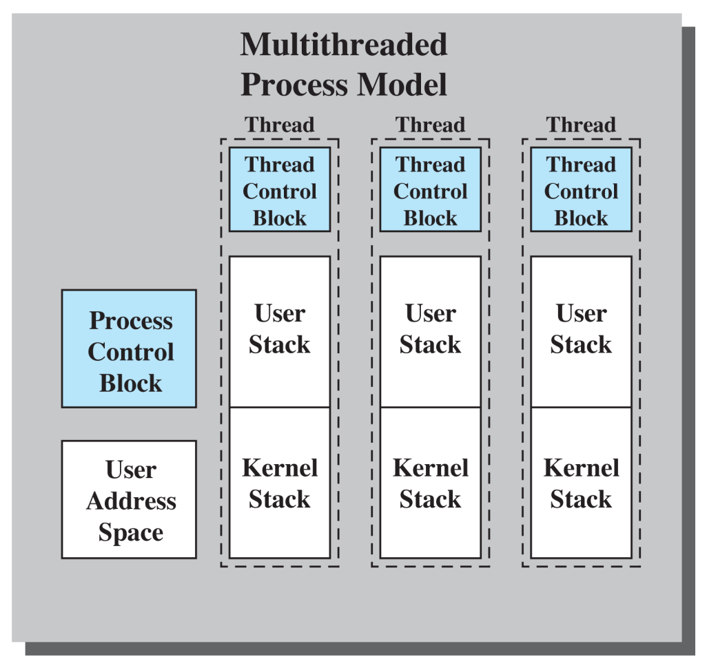

# Besturingssystemen

- Theorie: 50%
  - Vragen uit vragenlijst
- Labo: 50%

Ik ben een nuttige idioot en ik heb ook bij elke vraag de paginanummers geschreven :wink:.

# Hoofdstuk 1

## Vraag 1

> Wat is het verschil tussen symmetrische en asymmetrische multiprocessing? p15

Bij **asymmetrische multiprocessing** wordt de kernel van het besturingssysteem altijd uitgevoerd op een bepaalde **master** processor. Hij is verantwoordelijk voor scheduling en heeft volledige controle over het geheugen.

Dit heeft als gevolg dat de andere processoren enkel gebruikersprogramma's en hulpprogramma's kunnen uitvoeren. Als één van deze processoren dan een dienst nodig heeft (I/O ofzo), zal hij een request moeten sturen naar de master. De master is dus de **bottleneck** in dit systeem, maar voor deze benadering zijn echter weinig aanpassingen nodig aan het besturingssysteem indien deze al multitasking voor één processor ondersteunt.

We kunnen op twee manieren doen aan **symmetrische multiprocessing**:

1. De kernel opbouwen uit **meerdere processen** of threads. Dan kunnen ze verdeeld worden over de verschillende processoren.
2. Elke processor een **volledige kopie** van het besturingsssysteem laten uitvoeren. (is wel iets complexer omtrent communicatie en synchronisatie)

Bij symmetrische multiprocessing kan de kernel dus uitgevoerd worden **op elke processor**. De complexiteit is hoger en deze werkwijze vraagt meer van ons systeem, door communicatie tussen processoren het synchroniseren van het aanspreken van bronnen. In ruil daarvoor krijgen we hogere fouttolerantie en betere uitbreidingsmogelijkheden krijgen. Als er een processor uitvalt, kan het systeem gewoon verder, maar dan met wat minder rekenkracht.

## Vraag 2

> Wat moet je voorzien om op een Unix-systeem Windows applicaties te kunnen uitvoeren? p12

Een **virtuele machine**. Deze zorgt ervoor dat we functioneel gebruik kunnen maken van software en hardware die niet noodzakelijk effectief aanwezig zijn op ons systeem. Hardware aanspreken via een virtuele machine vereist wel **veel meer software-instructies**, dus we moeten een afweging maken tussen efficiëntie en gebruiksvriendelijkheid.

De virtuele machine is in deze context een gestandaardiseerde API, aangeboden door het besturingssysteem. Programma's kunnen dan deze API aanspreken, onafhankelijk hoe het besturingssysteem deze implementeert. 

## Vraag 3

> Bespreek hoe je op Windows een Unix-applicatie kan uitvoeren? Wat wordt in deze context bedoeld met een subsysteem? p20-21

**Omgevingssubsystemen** zorgen voor interactie met de gebruiker en voorzien een API set waardoor we op Windows toepassingen kunnen ondersteunen die geschreven zijn voor andere besturingssystemen, zoals Unix bijvoorbeeld. Elk subsysteem heeft zijn eigen adresruimte.

Elk programma dat draait kan maar van één omgevingssubsysteem gebruik maken (het is wel logisch dat een windows programma geen UNIX system calls hoeft te doen hoop ik). Als we een Unix applicatie willen draaien, maken we dus gebruik van het POSIX-subsysteem, waarin de meeste UNIX-compatibele software kan worden gecompileerd en uitgevoerd. De API van ons POSIX-subsysteem wordt dus vertaald om toegang te krijgen tot de Executive.

## Vraag 4

> Geef vier mogelijke ontwerpen van kernels. Bespreek bij elk hun voor- en nadelen en of ze nog gebruikt worden. p16-18, 22-24

- **Monolithische kernel**:

Vroegere besturingssystemen hadden **één kolossale, monolithische kernel**. Alles was eigenlijk één grote hoop code, waar ook alle functionaliteit bij elkaar zat. Bovendien werd de hele kernel uitgevoerd in **dezelfde gedeelde geheugenruimte**, zonder enige beperking tot toegang aan de hardware. Alhoewel zulke systemen moeilijk te overtreffen zijn in efficiëntie, maken ze het onderhoud en de uitbreiding van het huidige systeem zeker niet eenvoudig.

- **Gelaagde kernel**: 

We delen het systeem op in **hiërarchisch gescheiden** lagen. Met de hardware helemaal vanonder en de gebruikersinterface helemaal vanboven. Elk niveau is afhankelijk van de lager gelegen niveaus, die door middel van **interfaces** hun onderliggende complexiteit verbergen. Dit zou dus ook de uitbreiding van het systeem makkelijker moeten maken. 

Dit model is verre van perfect. De **volledige kernel draait in kernelmodus**, waardoor elke laag rechtstreekse toegang heeft tot de hardware, waardoor een fout in één laag alles kan verkloten. Verder is het in dit model ook moeilijk om beveiliging te implementeren.  Dit model wordt dus niet echt concreet gebruikt op het niveau van een globaal besturingssysteem, maar bijvoorbeeld wel in kleinere deelmodules, zoals I/O-subsystemen

* **Microkernel**

Ook wel het client/server model genoemd. In dit model staat de kernel enkel in voor de **meest essentiële** functies van het besturingssysteem. De kernel wordt zo klein mogelijk gehouden. Alle andere taken worden worden gedaan door processen, ook wel **servers** genaamd. De servers worden in user-mode uitgevoerd, waardoor ze voor de microkernel eigenlijk hetzelfde zijn als eender welke toepassing. Alle berichtgeving tussen serverprocessen moet via de kernel. Alle interactie gebeurt eigenlijk met het doorgeven van berichten. 

Deze structuur vergemakkelijkt modulaire ontwikkeling van de kernel en servers aanzienlijk. Onderdelen kunnen bovendien ook weggelaten worden. Alle **hardware-afhankelijkheid zit in de microkernel**. Verder is deze benadering ook uiterst geschikt voor gedistribueerde systemen.

Microkernel-systemen zijn in het algemeen **niet zo efficiënt**, onder andere door het overmatig uitwisselen van berichten. Systeemaanroepen zijn ook trager In moderne systemen gebruikt men wel verschillende modules, maar vermijdt men problemen met het definiëren van lagen en de communicatie ertussen. Elke module wordt monolithisch geïmplementeerd.

* **Modulaire kernel**

Een **kleine kern** zorgt voor de diensten noodzakelijk voor andere **modules**. Elke module van de kernel kan **onafhankelijk** van de ander modules geïmplementeerd worden, op voorwaarde dat zijn **interface** ongewijzigd blijft. Dit soort ontwerp wordt gebruikt in systemen zoals Linux, FreeBSD en Solaris. 

Ook al is de kernel van Linux redelijk monolithisch geïmplementeerd, maakt het toch gebruik van **loadable kernel modules**. Deze kunnen dynamisch geladen worden, gelinkt worden aan de kernel, en weer verwijderd worden. Door deze modules moet bij kleine toevoegingen ook niet telkens de hele kernel opnieuw gecompileerd worden. 


## Vraag 5

> Gegeven onderstaande figuur:


> Geef van elke component in de “executive” aan wat de werking ervan is. p20

De **executive** is het deel van het Windows NT besturingssysteem dat in kernel mode uitgevoerd wordt.

* Hardware abstraction layer

  * Staat in voor de **vertaling** tussen algemene opdrachten en processorspecifieke instructies. De hogere niveaus zijn dus afhankelijk van de HAL in plaats van de hardware.

* Microkernel

  * Het meest essentiële component. Hij beheert de **scheduling** en **synchronisatie** van processen, handelt **traps** en **interrupts** af, en zorgt voor **herstel** na stroomonderbreking. Hij blijft **altijd in het geheugen** geladen, en kan nooit door andere componenten onderbroken worden.

* Executive diensten 

  * I/O-manager: verwerkt I/O-verzoeken en is gelaagd opgebouwd om bijvoorbeeld stuurprogramma's dynamisch te laden

  - Cache manager: beheert de schijfcache

  - Security reference monitor: controleert alle toegang

  - Object Manager: maakt en verwijdert objecten

  - Process Manager: beheert proces- en threadobjecten

  - Virtual Memory Manager: doet de vertaling tussen fysieke en virtuele geheugenadressen.

  - Windows & Graphics (Vanaf NT 4.0): bevatten de scherminterface en de grafische stuurprogrammas (voor NT 4.0 werden ze in gebruikersmodus uitgevoerd)


# Hoofdstuk 2

## Vraag 6

> Wat is het verschil tussen een programma en een proces? Wat zijn de oorspronkelijke twee definities voor een proces?p28

Een **programma** is een passieve entiteit. Simpelweg een verzameling van instructies. Een **proces** is daarentegen de effectieve uitvoering van een afzonderlijk programma. Een programma is dus passief en een proces is actief.

**Wat zijn de oorspronkelijke twee definities voor een proces?**

* Een eenheid voor de verdeling van processorinstructies en het eigendom van bronnen
* Een uitvoeringspad (spoor) door een programma


//TODO toevoeging van wim?

## Vraag 7

> Waarom is het model met twee procestoestanden actief en niet actief niet interessant? Wat is het probleem dat je hier zal tegenkomen? p30

Het model is te simpel. Sommige processen in de toestand 'niet actief' zijn klaar om uitgevoerd te worden, terwijl anderen aan het wachten zijn op bijvoorbeeld een I/O bewerking. De scheduler moet dus telkens in de wachtrij op zoek gaan naar een proces dat niet aan het wachten is.

## Vraag 8

> Geef alle toestanden waarin een thread zich kan bevinden? Bespreek wanneer een thread van de ene toestand in de andere zal terechtkomen. p30-31


- **Nieuw** (new)
  - Nieuw &rarr; Gereed: Een nieuw proces wordt toegevoegd aan de lijst van uitvoerbare processen.
- **Gereed** (ready)

  - Gereed &rarr; Actief: De scheduler kiest één van de processen in de toestand 'gereed' om uit te voeren.

- **Actief** (running)
  - Actief &rarr; Einde: Het proces wordt afgebroken of het geeft zelf aan dat het voltooid is.
  - Actief &rarr; Gereed: Als het proces te lang bezig is (indien threshold van besturingssysteem), wordt het onderbroken. Het proces kan dit ook bijvoorbeeld doen met _sleep()_.
  - Actief &rarr; Geblokkeerd: Een proces wordt geblokkeerd als hij vraagt om iets waarop hij moet wachten. (meestal in de vorm van een system call naar I/O of wachten op een kindproces.)
- **Geblokkeerd** (blocked)
  - Geblokkeerd &rarr; Gereed: Als het ding waarop het proces aan het wachten was klaar is.
- **Einde** (exit)

## Vraag 9

> Voor processen hebben we een model met 7 toestanden, dewelke? Teken het toestandsdiagram en geef aan hoe en wanneer er van toestand zal worden gewisseld. p32-33


1. **Blocked &rarr; Blocked/Suspend**: 
   * Als er geen proces *ready* is, of er meer plaats nodig is, worden geblokkeerde processen uit het hoofdgeheugen geswapt om ruimte te maken voor andere processen.
2. **Blocked/Suspend &rarr; Ready/Suspend**
   * Hetgene waarop het proces wachtte is gebeurd. Het proces zelf zit niet in het hoofdgeheugen, maar zijn toestandsinformatie moet wel beschikbaar zijn.
3. **Ready/Suspend &rarr; Ready**
   * Het besturingssysteem swapt processen terug naar het hoofdgeheugen als er geen ander proces op *ready* staat, of het huidige proces een hogere prioriteit heeft dan andere processen in de toestand *ready*.
4. **Ready &rarr; Ready/Suspend**
   * Het besturingssysteem onderbreekt het liefst geblokkeerde processen, maar als er veel geheugen nodig is of de prioriteit van het huidige proces is hoger dan de anderen, is dit soms de enige optie.
5. **Active &rarr; Ready/Suspend**
   * Wordt soms uitgevoerd bij het preëmptief ingrijpen, om hoofdgeheugen vrij te maken.
6. **Blocked/Suspend &rarr; Blocked**
   * Dit is normaal gezien niet zo verstandig, maar wordt soms pro-actief gedaan voor processen met hoge prioriteit. Of als er net veel geheugen is vrijgekomen en het ding waarop het proces wacht bijna klaar is.
7. **New &rarr; Ready/Suspend** en **New** &rarr; **Ready**
   * Zijn twee opties voor het activeren van nieuwe processen. De keuze wordt bepaald door de job scheduler. Unix en Windows hebben dit niet, en plaatsen elk nieuw proces gewoon in het geheugen.
   * New &rarr; Ready/Suspend
     * Zo vroeg mogelijk adresruimte en tabellen voor het beheer van het proces toekennen. Het systeem beschikt dan over een grote verzameling niet geblokkeerde processen waardoor geswapt moet worden.
   * New &rarr; Ready
     * **Just-in-time** benadering, overhead wordt beperkt. 

## Vraag 10

> Wat wordt er bedoeld met het procesbeeld? Geef aan hoe dit er uitziet en beschrijf ook wat er zich in elk deel bevindt. Het PCB mag je hier buiten beschouwing laten. p33-34

Het **procesbeeld** is de verzameling van het **programma**, de **gegevens** en de **stackgebieden**. Voordat een proces uitgevoerd wordt moet het hele procesbeeld dus in het hoofdgeheugen geladen worden. Als het programma zich in onderbroken toestand bevindt wordt het hele procesbeeld als een aaneengesloten blok geheugen op de schijf opgeslagen.

- Geheugentabellen
  - Beheren het hoofdgeheugen en het secundaire geheugen
- I/O-tabellen
  - Worden door het besturingssysteem om I/O apparaten te beheren.
- Bestandstabellen
  - Worden niet door het besturingssysteem, maar door het bestandsbeheersysteem bijgehouden en bevatten info over over bestanden zoals naam, locatie, status en attributen.
- Procestabellen
  - Worden bijgehouden om processen te beheren.

## Vraag 11

> De info in het PCB kan je in drie categorieën onderverdelen. Dewelke? Bespreek ook wat er zich zoal in elk deel van het PCB bevindt. p34-36

PCB = Process control block, een blok geheugen in de geheugenruimte van het proces zelf met informatie omtrent procesbeheer.

- Procesidentificatie
  - Het proces krijgt een uniek nummer (een **pid**), deze is een index in de primaire procestabel. De procesidentificatie kan ook verwijzingen bevatten naar andere processen (bv. ouderprocessen).
- Processortoestandsinformatie
  - Bestaat uit de inhoud van alle processorregisters. Als het proces actief is zit deze inhoud natuurlijk in de registers van de processors. Als het proces onderbroken wordt, zal deze info in het procesbesturingsblok worden opgeslagen zodat het later weer hersteld kan worden.
- Procesbesturingsinformatie
  - Extra informatie die het besturingssysteem nodig heeft voor het beheren van processen. Zoals onder meer:
    - Scheduling- en toestandsinformatie
    - Structurele informatie
    - De locaties van alle delen van het procesbeeld
    - Verwijzingen naar andere geheugentabellen
    - Welke bronnen zijn aangevraagd door en toegewezen aan het proces
    - Informatie over privileges (geheugen en instructies)
    - Eventuele limieten en quota
    - Informatie over vlaggen (_sig, signal, blocked_)

## Vraag 12

> Welke stappen moet het besturingssysteem ondernemen om een nieuw proces aan te maken? p36

1. Eerst en vooral maken we een unieke **procesidentificatiecode** (pid) aan en voegen we een nieuwe entry toe in primaire procestabel. 
2. We **wijzen ruimte toe** aan alle delen van het procesbeeld. Het besturingssysteem moet dus weten hoe veel ruimte er nodig is. 
3. Dan initialiseren we het **procesbesturingsblok** (PCB), eigenlijk vooral de procesbesturingsinformatie. Verder moeten we de **juiste koppelingen instellen**, zoals het proces in de wachtrij van 'gereed' of 'gereed/onderbroken' stoppen en de juiste prioriteit geven.
4. Tot slot kunnen we eventuele gegevensstructuren aanmaken of andere gegevensstructuren uitbreiden.

## Vraag 13

> Welke opportuniteiten kan het besturingssysteem gebruiken om van proces te wisselen? Bespreek zo gedetailleerd mogelijk op welke momenten de scheduler aan bod kan komen. Geef bij elke mogelijke opportuniteit ook aan of er van proces zal/kan/moet gewisseld worden en geef zo mogelijk ook een aantal voorbeelden om je antwoord te staven. p36-38

1. **Interrupts**

   - _Klokinterrupts_: klok die periodiek decrementeert, wanneer hij nul is zal het proces worden onderbroken zodat het niet te lang draait. De scheduler zal dan een ander proces selecteren. (asynchroon)
   - _I/O-interrupts:_ verwittigen het besturingssysteem van een I/O-gebeurtenis. De processen die wachten kunnen onderbroken worden, waarna de scheduler een meer prioritair proces kan selecteren. (asynchroon)
   - _Paginafouten_: verwijzing naar geheugenelementen die zich niet in het geheugen bevinden. Het besturingssysteem moet optreden om de gezochte pagina op te halen. De scheduler moet een ander proces selecteren, want het huidige kan niet verder. (synchroon)

2. **Traps / exceptions**

   Een trap is een speciaal soort interrupt die wordt gegenereerd binnen het actieve proces. Dit kan bijvoorbeeld als je user mode een kernelinstructie probeert uit te voeren. Of er wordt gewisseld van proces hangt af van het soort trap. Als je bijvoorbeeld een dangling pointer volgt naar de geheugenruimte van een ander proces, zal je huidige proces direct stopgezet moeten worden en zal de scheduler een nieuw proces selecteren.  (synchroon)

3. **Systeemaanroepen / software-interrupts**

   Systeemaanroepen zijn de interface tussen het besturingssysteem en de gebruikersprogramma's. Ze worden enkel veroorzaakt op het verzoek van het actieve proces. 

   Het operating system neemt over en doet een context switch, een mode switch naar kernel mode en voert een interrupt search routine uit. Wanneer de interrupt afgehandeld is komt de scheduler aan bod en kan deze opteren om van proces te wisselen. Dit gebeurt dan waarschijnlijk als er een ander proces is met hogere prioriteit of als het huidige proces geblokkeerd is. De procesbesturingsinformatie van het huidige proces en het geselecteerde proces wordt bijgewerkt. De vertaling van virtuele naar fysieke adressen wordt aangepast (tabellen in MMU). Dan moet ten slotte de processortoestandsinformatie van het geselecteerde proces ingeladen worden en teruggewisseld worden naar user-mode. 

De scheduler komt vrijwel altijd aan bod wanneer het besturingssysteem zijn taak heeft afgehandeld.


## Vraag 14

> Wat is het verschil tussen een synchrone en asynchrone interrupt? p37

Een **synchrone** interrupt moet onmiddellijk worden uitgevoerd. De uitvoering van het programma waaruit de interrupt is ontstaan kan niet doorgaan zolang het besturingssysteem geen actie ondernomen heeft. Het programma wordt geblokkeerd tot de interrupt afgehandeld is. Voorbeeld: paginafout

Een **asynchrone** interrupt kan daarentegen onmiddellijk worden uitgevoerd, maar ook uitgesteld worden. Het programma wordt niet geblokkeerd en de uitvoering kan doorgaan. Voorbeeld: I/O-interrupt

## Vraag 15

> Geef een aantal voorbeelden die aanleiding zullen geven tot het wisselen van proces. Geef een aantal voorbeelden die wellicht geen aanleiding zullen geven tot een proceswissel. p36

**Zal het leiden tot een proceswissel, ja of nee? - Wim**

* I/O-interrupt: dan kan het op basis van prioriteit
* Klokinterrupt: dan kan het wanneer het kwantum opgebruikt is
* Bij een paginafout zal het sowieso
* Traps: afhankelijk van het soort trap: waarschijnlijk wel, maar als het een probleem is dat kan verholpen worden waarschijnlijk niet.
* Systeemaanroep: dat zal afhangen van de situatie waarin u zich bevindt. Bij het ene al wel eens meer dan bij het andere.


## Vraag 16

> Hoe zal men bij een microkernel-architectuur een systeemaanroep afhandelen? p38

**Berichtgestuurd**: in besturingssystemen met een microkernel of client/server architectuur werkt de interface tussen client- en serverprocessen met het uitwisselen van berichten. Er wordt een kanaal tot stand gebracht tussenbeide. Wanneer een clientproces dan een aanvraag doet, laat het zich vrijwillig blokkeren tot het antwoord beschikbaar is. Als ze alle vragen hebben beantwoord, dragen de serverprocessen de controle over aan de scheduler.

## Vraag 17

> Hoe zal men bij een monolithisch kernelontwerp een systeemaanroep afhandelen? p38

**Proceduregestuurd**: Elke systeemaanroep komt overeen met een bibliotheekprocedure. De parameters (of adres naar een lijst van parameters) worden in een register gezet en trap gegenereerd, waarna het systeem in kernelmodus wordt gezet en de controle aan het besturingssysteem wordt overgedragen. Die kijkt met welke interne procedure de systeemaanroep overeenkomt en voert hem uit. Het doel is hier om systeemaanroepen meer te doen lijken op gewone procedures.

## Vraag 18

> Waarom hebben software interrupts een veel lagere prioriteit dan hardware interrupts? p39

Het uitvoeren van systeemaanroepen voor een toepassing is doorgaans minder dringend dan het op tijd bedienen van een I/O-controller, alvorens zijn interne buffers overflowen en er data verloren gaat.

## Vraag 19

> Er wordt steeds gezegd dat wanneer een proces tegen een I/O-bewerking aanloopt, het proces geblokkeerd wordt. Hoe kan het besturingssysteem dat weten? p39

In de interruptcyclus van de instructiecyclus checkt de processor door middel van de aanwezigheid van een interruptsignaal of er interrupts zijn opgetreden. Er wordt dus periodiek gecontroleerd op interrupts.


## Vraag 20

> Bespreek de stappen bij het afhandelen van een interrupt wanneer de scheduler ervoor opteert om de uitvoering verder te zetten binnen het reeds actieve proces. Wat wordt er hier bedoeld met een moduswissel en een contextwissel? p40

1. De context van het proces wordt opgeslagen (dit gebeurt hardwarematig)
2. De programmateller wordt gezet op het beginadres van de interruptroutine
3. Contextwissel naar kernel mode
4. De interruptroutine wordt uitgevoerd
5. Er wordt teruggewisseld naar user mode en de context van het proces wordt teruggezet. Zo wordt dus automatisch de controle terug overgedragen aan het eerder onderbroken proces.

Het overschakelen naar gebruikersmodus (of kernelmodus) is een **moduswissel**. Bij een **contextwissel** wordt de inhoud van de registers, waaronder ook de programmateller (de processortoestandsinformatie) gewisseld. In dit geval wordt deze hersteld naar de context van het onderbroken proces, op het moment dat deze voor het laatst uit de toestand _actief_ werd gewisseld.


## Vraag 21

> Bespreek de stappen bij het afhandelen van een interrupt wanneer de scheduler ervoor opteert om de uitvoering niet verder te zetten binnen het reeds actieve proces. Welke stappen zijn nodig om een proceswissel door te voeren? p40-41


**Bespreek de stappen bij het afhandelen van een interrupt wanneer de scheduler ervoor opteert om de uitvoering niet verder te zetten binnen het reeds actieve proces.**

Het besturingssysteem zal hier wel wat meer werk moeten doen. Tijdens het wisselen kan het systeem geen andere dingen doen, dus deze keuze brengt wat overhead met zich mee.

1. De context van het oude proces wordt opgeslagen (dit gebeurt hardwarematig)

2. De programmateller wordt gezet op het beginadres van de interruptroutine

3. Contextwissel naar kernel mode

4. De interruptroutine wordt uitgevoerd

5. Nu wordt er gewisseld naar een nieuw proces in plaats van het vorige

   

**Welke stappen zijn nodig om een proceswissel door te voeren?**

1. Selectie van een nieuw proces als volgend actief proces
2. Zijn procesbesturingsblok bijwerken
3. Gegevensstructuren voor geheugenbeheer bijwerken
4. Terugschakelen naar gebruikersmodus en de context wisselen naar die van het geselecteerde proces.

## Vraag 22

> Wat zijn de nadelen van een procesloze kernel? Welke delen van een Unix- en een Windows kernel zijn procesloos? p41-42

Er moeten zeer vaak context- en proceswisselingen uitgevoerd worden, wat niet geweldig is voor de prestaties. 

Je hebt een aantal gebruikersprocessen en de kernel. Het principe van processen is enkel van toepassing op de processen, en niet op de kernel. De kernel is één monolithisch blok code dat een vaste plaats in het geheugen heeft. Bij een interrupt zal je naar kernel mode moeten overschakelen, een contextwissel moeten doen en waarschijnlijk ook een proceswissel. 


**Welke delen van een Unix- en een Windows kernel zijn procesloos?**

Ik vroeg Wim of hij dit wist.

> Beste Martijn
>
> Uiteraard weet ik dat. Dat is de code voor interruptafhandeling (cfr. de microkernel) en de code voor proceswisseling (cfr. sheduler). 
>
> Je kan moeilijk de code voor het wisselen van een proces in een proces gaan stoppen want dat zou betekenen dat je van proces moet wisselen om de code voor proceswisseling uit te voeren, wat natuurlijk tegenstrijdig is. 
>
> Dat zijn ook de delen van het OS die nooit het geheugen verlaten. Dus interruptafhandeling en proceswisseling.
>
> Met vriendelijke groet,
>
> Wim

## Vraag 23

> Hoe wordt er van binnen een Unix besturingssysteem doorgaans van proces gewisseld? Hoe komt het dat dit vrij efficiënt verloopt?  p42


Een proceswissel verloopt als volgt:

1. Binnen het proces zelf wordt de context opgeslagen
2. Een ander proces wordt geselecteerd
3. De besturing wordt overgedragen aan een routine voor proceswisseling, waarvan de uitvoering plaatsvindt buiten alle processen om


**Hoe komt het dat dit vrij efficiënt verloopt? **

Alle software van het besturingssysteem wordt uitgevoerd in de context van een gebruikersproces. Het besturingssysteem wordt beschouwd als een verzameling van systeemaanroepen. Bij elk proces bevat het procesbeeld dus de programma-, gegevens- en stackgebieden voor kernelprogramma's. 

Dit betekent dus dat wanneer er een van proces gewisseld moet worden, de context niet moet gewisseld worden om het besturingssysteem zijn ding te kunnen laten doen.

## Vraag 24

> Hoe wordt er binnen een microkernelgeoriënteerd besturingssysteem van proces gewisseld? Wat zijn hier de voor- en nadelen? p42

De belangrijkste besturingssysteemfuncties worden gestructureerd als aparte processen, uitgevoerd in kernelmodus. Een kleine hoeveelheid code zorgt dan voor de proceswisseling. 

**Nadeel**

Overhead door veel proceswisselingen, want er moet voor elke besturingssysteemfunctie geswitcht worden naar het proces voor deze functie, want in tegenstelling tot de typische Unix-methode, bevat het huidige proces niet de context van de besturingssysteemfuncties.

**Voordelen**

Het besturingssysteem is hier een verzameling van verschillende modules, met eenvoudige interfaces. De processen die deze modules uitvoeren kunnen aangepaste prioriteit verweven worden met andere processen, ze moeten bovendien niet allemaal in kernelmodus uitgevoerd worden. 

In een systeem met meerdere processoren kan een deel van de besturingssysteemprocessen bijvoorbeeld aan een specifieke processor toegekend worden.

## Vraag 25

> Wat is de herdefinitie van een proces en de definitie van een thread? p43

Vroeger was een proces een eenheid voor de verdeling van processorinstructies en de eigendom van bronnen. Toen was elke proces dus eigenlijk ook één thread.

We splitsen deze definitie op:

* We definiëren een **thread** als de eenheid van verdeling van **processorinstructies**
* Een **proces** is dan een eenheid voor het eigendom van bronnen

## Vraag 26

> Geef het procesbeeld van een multithreaded proces met drie threads. Welke delen worden er over de grenzen van een thread gedeeld.



Elke **thread** beschikt over een afzonderlijke stack en een afzonderlijk besturingsblok, waarin onder meer de contextinformatie wordt opgeslagen. Scheduling wordt uitgevoerd per individuele thread, hierdoor moet dus ook de meeste toestandsinformatie bijgehouden worden op het threadniveau. 

Op het **procesniveau**, dus over de grenzen van de threads heen is er nog steeds een procesbesturingsblok en gebruikersadresruimte. Alle threads delen de toestand en de bronnen van hun proces. Ze hebben ook toegang tot dezelfde bestanden geheugengegevens. De programmacode wordt ook gedeeld, dus toepassingen kunnen meer actieve threads hebben binnen dezelfde adresruimte, waardoor de processor beter bezig gehouden kan worden.

## Vraag 27

> Geef voor- en nadelen van multithreading. Welke zijn de mogelijke implementaties (enkel vernoemen volstaat)? p43-46


**Voordelen**

* Alle threads **delen** de **toestand** en de **bronnen** van hun proces. Doordat ook **programmacode** wordt gedeeld, kunnen toepassingen veel meer actieve threads hebben binnen dezelfde adresruimte. Hierdoor kan de processor beter bezig gehouden worden.
* De **interprocescommunicatie** is makkelijker door het gedeeld geheugengebruik, en vereist geen tussenkomst van de kernel.
* Het **creëren en wisselen** van threads binnen een proces heeft veel minder overhead dan hetzelfde doen met verschillende processen.
* Als er één thread blokkeert moet **niet** speciaal **het hele proces geblokkeerd** worden, want je kan dan gewoon naar een andere thread wisselen.

**Nadelen**

* Eén nadeel is dat threads die gebruik maken van hulpfuncties, deze reëntrant moeten uitvoeren. Elke simultane uitvoering van die functie mag enkel beroep doen op een aparte verzameling van lokale variabelen om de toestand van de functie bij te houden.
* Multithreading is niet altijd toepasbaar of implementeerbaar
* (deze is mijn mening) Soms is het niet nuttig om een bepaald algoritme te implementeren met multithreading, omdat de overhead door het wisselen van threads soms groter is dan de performantiewinst door multithreading. Dit hangt natuurlijk af van het algoritme dat je wilt implementeren.

**Mogelijke implementaties**

* User-level threads
  * Green threads (solaris)
  * Fiber-bibliotheek (Windows)
  * GNU Portable Threads
* Kernel-level thread
  * Thread pools (apache v2 webserver)
* Combinatie van beide


## Vraag 28

> Wat zijn de voor- en nadelen met user level threading? p46

**Voordelen**

* Ze kunnen ondersteund worden op **elk besturingssysteem**
* **Efficiëntere** threadwisselingen, omdat er niet gewisseld moet worden naar kernelmodus.
* Je kan het **scheduling algoritme** aanpassen naar behoren van de toepassing, want alle stuff voor threadbeheer zit binnen de adresruimte van het proces.

**Nadelen**

* Als één thread een blokkerende systeemaanroep doet, dan worden **alle threads** van dat proces **geblokkeerd**. 
* Werkt niet goed samen met multiprocessing, want binnen elk proces kan er maar **één thread actief** zijn.

## Vraag 29

> Wat zijn de voor- en nadelen van kernel level threading? p47

De scheduling door de kernel wordt uitgevoerd op basis van threads, niet op basis van processen.

**Voordelen**

* Als er meerdere processoren zijn, kunnen er **meerdere threads** van **hetzelfde proces** tegelijk geactiveerd worden.
* Een geblokkeerde thread **blokkeert** de andere threads van hetzelfde proces **niet**.
* We kunnen als een proces wordt aangemaakt direct meerdere threads aanmaken die wachten op werk. Dit is een **thread-pool**. Als er een taak moet uitgevoerd worden nemen we dan gewoon een vrij thread uit de pool en steken hem terug als het werk gedaan is. 

**Nadelen**

* Een nadeel is dat het **wisselen** naar een andere thread een **modus en context switch** vereist. Je moet dus oppassen dat je niet te veel threads aanmaakt, dit wordt in sommige implementaties ook beperkt.

## Vraag 30

> Wat is het verschil tussen coöperatieve- en preempted multitasking? Wanneer kan een proces preemptief worden onderbroken? p51

Bij preempted multitasking kunnen threads preëmptief door **timeslices** onderbroken worden. Dit betekent dat het besturingssysteem het lopende proces kan stoppen en de processor aan een ander proces met hogere prioriteit toewijzen. Het probleem is hier wel dat het kan dat processen met lage prioriteit constant worden onderbroken door processen met hogere prioriteit.

Op systemen zonder *timeslicing* moet een thread vrijwillig de controle over de processor overgeven om andere threads een kans te geven. Dit is **cooperative multitasking**. Het besturingssysteem zal dus nooit een switch initiëren. Threads kunnen dan de controle afgeven als ze geblokkeerd zijn of ze kunnen periodiek andere threads de controle over laten nemen. Als er een belangrijke thread moet uitgevoerd worden, moet deze dus wachten totdat de huidige klaar is.


## Vraag 31

> Geef het procestoestandsdiagram van een klassiek Unix besturingssysteem en bespreek elke toestandsovergang (cfr. vraag 9). Waarom is dit niet geschikt voor realtime-applicaties?

niet te kennen

## Vraag 32

> Een proces in een Windows heeft drie zaken? Benoem ze en bespreek waarvoor ze dienen.p56

* **Access token**
  * Wordt ook wel het *primaire token* genoemd. Dit wordt gebruikt om te checken of de gebruiker bepaalde bewerkingen mag uitvoeren met beveiligde objecten.  
* **Virtuele adresruimte**
  * Deze wordt door de virtual memory manager module van de executive beheerd. Het is logisch dat een proces geheugen moet kunnen aanspreken hoop ik.
* **Objecttabel met handles**
  * Deze handles verwijzen naar objecten, zoals bijvoorbeeld naar elke thread die het proces omvat. Elk element in de tabel bevat toegangsrechten van het object en statusinformatie. Als je in user mode zit, zal je de access token nagekeken worden alvorens toegang verleend wordt.

## Vraag 33

> Geef het toestandsdiagram van een Windows thread? Bespreek de toestanden en de mogelijke overgangen. p58

[tekening]


- **Ready** 
  - Ready &rarr; Running: De scheduler kiest één van de processen in de toestand 'gereed' om uit te voeren.
  - De ready thread met de hoogste prioriteit bevindt zich in de **stand-by** toestand
- **Stand-by**
  - De *ready* thread met de hoogste prioriteit staat op *stand-by*, dit is de thread die als volgende effectief uitgevoerd zal worden. Als de prioriteit van de *stand-by* thread hoog genoeg is kan de actieve thread preëmptief onderbroken worden.
- **Running** 
  - Running &rarr; Terminated: De thread word afgebroken of het geeft zelf aan dat het voltooid is.
  - Running &rarr; Gereed: Als het proces te lang bezig is (indien threshold van besturingssysteem), wordt het onderbroken. Het proces kan dit ook bijvoorbeeld doen met _sleep()_.
  - Running &rarr; Geblokkeerd: Een proces wordt geblokkeerd als hij vraagt om iets waarop hij moet wachten. (meestal in de vorm van een system call naar I/O of wachten op een kindproces.)
- **Waiting** 
  - De thread is geblokkeerd of aan het wachten
  - Waiting &rarr; Ready: als na het wachten de bronnen beschikbaar zijn
  - Waiting &rarr; Transition: als na het wachten de bronnen nog niet beschikbaar zijn
- **Transition**
  - Transition &rarr; Ready: als de bronnen beschikbaar zijn
- **Terminated** 
  - De thread is beëindigd


## Vraag 34

> Geef het toestandsdiagram van een besturingssysteem dat gebruikmaakt van user level threads en een lichtgewichtproces (cfr. Solaris). Wat zijn de verschillende toestanden en de mogelijke overgangen? Bespreek wanneer er van toestand zal worden gewisseld en geef ook aan in welke toestand de user-level thread en het lichtgewichtproces zich moeten bevinden om uitgevoerd te worden. p54-55

[tekening]


<u>User-level threads</u>

Verschillende toestanden:

* **Active**
  * Active &rarr; Sleeping: Als een primitieve voor synchronisatie opgeroepen wordt, zal de thread slapen totdat de voorwaarde voor de synchronisatie is voldaan.
  * Active &rarr; Stopped: een thread kan gestopt worden door zichzelf of door een andere user-level thread.
  * Active &rarr; Runnable: een thread kan preëmptief onderbroken worden als een andere thread met hogere prioriteit uitvoerbaar wordt. Hij kan ook zichzelf preëmptief onderbreken om de controle over te dragen aan een andere thread met gelijke prioriteit.
* **Runnable**
  * Runnable &rarr; Stopped
  * Runnable &rarr; Active
* **Sleeping**
  * Sleeping &rarr; Runnable
  * Sleeping &rarr; Stopped
* **Stopped**
  * Stopped &rarr; Runnable


<u>Lightweight processen</u>

Een user-level thread kan gebonden zijn aan een lightweight proces. Als hij niet gebonden is aan één lightweight proces, zal hij in de toestand actief aan eentje gekoppeld worden. In de toestand actief van de user-level thread kan het corresponderende lightweight proces dan ook verschillende toestanden aannemen. De thread wordt dus pas effectief uitgevoerd als zowel de user-level thread als het lightweight proces op actief staan. Als de thread dan een blokkerende system call doet, wordt het lightweight proces geblokkeerd, maar blijft de user-level thread op actief. 

Verschillende toestanden:

* **Runnable**
* **Running**
* **Stopped**
* **Blocked**


## Vraag 35

> Bespreek onderstaande figuur. Hoe worden de verschillende componenten aan elkaar gekoppeld. p48


Sommige besturingssystemen combineren user-level en kernel-level threads. In dit geval worden verschillende user-level threads gegroepeerd gekoppeld aan een kleiner of gelijk aantal kernel-level threads. Het creëren van threads gebeurt in de user space, want dit is efficiënter.

 **Hoe worden de verschillende componenten aan elkaar gekoppeld?**

De user-level threadbibliotheek moet communiceren met de kernel. Dit gebeurt via **lightweight processen**. Voor de bibliotheek zien deze eruit als virtuele processoren, waar dan een user-level thread aan gekoppeld kan worden. Het besturingssysteem gebruikt dan het lightweight proces om een kernel-level thread aan onze thread te koppelen.


## Vraag 36

> Bespreek elke gegeven situatie en geef ook aan waar ze ideaal voor geschikt zijn, m.a.w. waar en wanneer zullen ze worden gebruikt p49


* **Process 1**
  * Heeft één user level thread, gebonden aan één lightweight proces. 
  * Dit is eigenlijk hetzelfde als een traditioneel unix proces. Je gebruikt dit als gelijktijdigheid binnen het proces niet nodig is.
* **Process 2**
  * Heeft meerdere user-level threads, allemaal gebonden met hetzelfde lightweight proces. Er kan maar één user-level thread tegelijk uitgevoerd worden, om inefficiënte threadwisselingen op kernelniveau te vermijden. 
  * Deze methode komt overeen met de zuivere user-level benadering van multithreading en wordt gebruikt voor programma's met logische parallelliteit, zoals een toepassing met meerdere vensters, waarvan er slechts één actief kan zijn.
* **Process 3**
  * Meerdere user level threads, gekoppeld aan een kleiner of gelijk aantal lightweight processen. 
  * Dit is nuttig als threads geblokkeerd kunnen worden, bijvoorbeeld in I/O-intensieve applicaties.
* **Process 4**
  * Meerdere user-level threads die 1-op-1 gekoppeld zijn aan meerder lightweight processen. 
  * Dit komt overeen met de zuivere kernel-level benadering van multithreading en is nuttig bij CPU intensieve applicaties die bijvoorbeeld parallelle matrixbewerkingen moeten uitvoeren.
* **Process 5**
  * Hetzelfde als process 3, maar heeft één extra user-level thread gebonden aan één lightweight proces, verbonden aan één processor. 
  * Dit wordt gebruikt bij applicaties met een real-time component. 


# Hoofdstuk 3 (labo)

## Vraag 37

> Waarom krijg je bij het schrijven van data naar een filedescriptor die geopend werd met de O_SYNCvlag een heel trage verwerkingssnelheid (2 redenen)?

Antwoord van the man himself:

> Wanneer je de vlag niet meegeeft zal een proceswissel niet steeds noodzakelijk zijn. Het proces roept via een software-interrupt de systeemaanroep aan, er treedt een modewissel en contextwissel op (cfr. de CPU-registers worden, in Linux althans, op de kernelstack bewaard) en de code van de systeemaanroep wordt in kernelmode uitgevoerd. Zonder de O_SYNC-vlag leidt dit veelal tot een zuivere geheugenoperatie door het wegschrijven van 1 of meerdere bytes van de user-buffer naar de kernel-buffer. De tijd die hiervoor nodig is is zeer beperkt en na de systeemaanroep is een proceswissel dus niet steeds aan de orde. Wanneer de kernelbuffer echter vol komt, moet er een I/O-operatie gestart worden en zal het gebruikersproces moeten worden geblokkeerd tot wanneer alle bytes uit de userbuffer werden gekopieerd.
>
> Bij het zetten van de O_SYNC-vlag heb je dus naast meer I/O-operaties ook steeds een extra proceswissel wat het vertragend effect nog versterkt. Iedere write-systeemaanroep wordt verplicht om een I/O-operatie te starten en het bijhorende proces te blokkeren tot wanneer de bijhorende I/O-interrupt het geblokkeerde proces deblokkeert.

## Vraag 38

> Wat zijn de voor- en nadelen van (kernel/user) buffering? In de kernel wordt er default gebruikgemaakt van buffering en in het gebruikersprogramma stel je het zelf in. Bemerk dat wanneer je opeenvolgende schrijfopdrachten doet met slechts 1 byte, je per definitie geen buffering gebruikt.

Antwoord van the man himself:

> Buffering beperkt het aantal I/O-opdrachten naar de schijf. De blokgroottes die naar schijf worden geschreven zijn niet bepalend voor de schijfprestaties, het aantal lees/schrijfoperaties per seconde (IOPS ook wel eye-ops uitgesproken, bij een klassieke magnetische disk een hondertal, bij een solid state schijf veel meer maar dan nog) daarentegen wel. Dus meer lees- of schrijfopdrachten beperkt de snelheid van het computersysteem in zijn geheel (i.e. veel meer processen in geblokkeerde toestand die aan het wachten zijn op een I/O-interrupt, ook het oplossen van paginafouten verloopt trager).
>
> Buffering zorgt dat lees/schrijfopdrachten plaatsvinden op een geheugenbuffer en wanneer die dreigt vol te lopen zal het OS die moeten flushen. Er wordt dus van heel veel kleine I/O-opdrachten één grote I/O-opdracht gemaakt die dan daadwerkelijk naar schijf zal worden geschreven.
>
> Het nadeel is wel dat je ten eerste geheugen zal moeten toekennen om die buffers te voorzien en twee dat er ook wel wat werkt kruipt in het constant in de gaten houden van de buffergrootte zodat die tijdig kan worden leeggemaakt (bij schrijven) of opgevuld (bij lezen). Buffering vereist ook complexe algoritmes die de buffers op juiste moment moeten aanvullen of leegmaken.

## Vraag 39

> Wanneer zal de systeemaanroep read resulteren in een geblokkeerd proces en wanneer niet. Idem voor een write-systeemaanroep. Geef nog een aantal andere systeemaanroepen die doorgaans een proces zullen blokkeren en dus bijgevolg een proceswissel zullen veroorzaken.

Antwoord van the man himself:

> Wanneer de buffer net moeten worden opgevuld, zal het OS het proces moeten blokkeren tot wanneer de achterliggende I/O-opdracht de buffer terug aangevuld heeft. Wanneer de buffer nog voldoende gevuld is zal het OS onmiddellijk de leesopdracht kunnen beantwoorden zonder te moeten wisselen van proces.
>
> waitpid en bv. write (bij een volle buffer die moet geflusht worden) zijn voorbeelden van systeemaanroepen die een geblokkeerd proces en dus een proceswissel zullen veroorzaken.

## Vraag 40

> Geef een kort C-codefragment waarmee je een zombie-proces aanmaakt. Wanneer een proces een zombieproces wordt, welk deel van het proces houdt de kernel dan nog in het geheugen bij en waarom?

Antwoord van the man himself:

```c
int main(){
  int pid;
  if ( (pid=fork()) < 0){
    perror(argv[0]);
    exit(1);
  }
  else if (pid == 0){
    //child
    exit(0);
  }
  //parent
  sleep(60);
  //niet wachten, geen waitpid dus
}
```

> Wanneer een proces klaar is komt het in Unix in de status zombie terecht vooraleer het wordt afgebroken. Het proces kan echter uitsluitend worden afgebroken wanneer de parent zijn exitstatus leest. Doet de parent dit niet, wordt het proces niet volledig beëindigd en blijft het in de toestand zombie. Als de parent zelf beëindigd wordt, wordt het kind naast een zombie ook een orphan dat geadopteerd wordt door het init-proces. Het init-proces zal de exit-status van het kind lezen waardoor vervolgens ook het kindproces kan worden ontmanteld.
>
> De exit-status van een proces wordt in Linux bijgehouden in het PCB (process control block) dat dus zolang het in de status “zombie” vertoefd in het geheugen blijft.
>
> Bij een daemon-proces zal je dus bij het niet correct lezen van de exit-statussen van de kinderen een ganse waslijst met zombie-processen maken die op zich 0% CPU tijd krijgen (dus geen probleem voor de scheduler) en ook 0% geheugen toegewezen krijgen. Iedere zombie neemt wel een plaats in de globale procestabel in beslag en bovendien blijft de volledige procesbesturingsinformatie achter in het geheugen! Dit is dus niet onschuldig!

## Vraag 41

> Na de systeemaanroep fork kan de uitvoering worden verdergezet in ofwel het kind ofwel de ouder. In welke van de twee zal de uitvoering hoogstwaarschijnlijk worden verdergezet en waarom? Wanneer zal dit niet het geval zijn?

Antwoord van the man himself:

> Wanneer je een systeemaanroep aanroept wordt er naar kernelmode geschakeld om de software interrupt (systeemaanroep) af te handelen. Hierna komt de scheduler (ook in kernelmode) aan bod om te kijken of er door de interrupt-afhandeling geen meer prioritaire processen werden gedeblokkeerd en zich dus in de toestand “gereed” bevinden. Dit is hier onmogelijk want de enige manier dat er preemptief van proces kan worden gewisseld is wanneer er na het afhandelen van de systeemaanroep processen gedeblokkeerd werden met een hogere prioriteit. Dus zal de uitvoering gewoon worden verdergezet in het proces dat aan zet was voor de onderbreking, de parent dus. Er is slechts één manier waarbij het kind als eerste aan bod zou kunnen komen en dat is dat bij het aanroepen van de systeemaanroep alle toegewezen tijd door de parent werd opgebruikt. Dan en enkel dan zal het kind als eerste aan bod komen

## Vraag 42

> Linux kent geen fork-systeemaanroep. Hoe komt het dat je hem wel kan gebruiken?

Antwoord van the man himself:

> Linux gebruikt de glibc-POSIX API. Die staat in voor de vertaling van courante Unix-systeemaanroepen naar Linux-specifieke systeemaanroepen.

## Vraag 43

> In welke situatie maak je gebruik van een named pipe en kan je dus geen unnamed pipe gebruiken?

Antwoord van the man himself:

> Unamed pipes of anonieme pipes kan je uitsluitend gebruiken voor IPC (interprocescommunicatie) tussen processen met verwantschap (ouder, kind, broer, kleinkind,…). Bij processen zonder verwantschap moet je gebruikmaken van een named pipe, i.e. een object op het bestandssysteem dat je een naam moet geven (vandaar ook de naam).

## Vraag 44

> Zijn POSIX-threads (of pthreads genoemd) kernel level threads of user level threads? Hoe kom je tot dit besluit?

Antwoord van the man himself:

> Linux kent uitsluitend tasks en maakt eigenlijk geen onderscheid tussen threads en processen. Bij het gebruik van POSIX-threads merk je op dat er achter de schermen een clone-systeemaanroep wordt gebruikt en waar dus een nieuw proces mee wordt aangemaakt waarbij alles gedeeld wordt behalve dan de userstack. Ook wanneer je kijkt met de opdracht top -H zie je hier twee processen staan waarbij het dus eerder aanleunt bij de definitie van kernelthreads dan bij de definitie van user level threads. Ter info bij user level threads is het besturingssysteem niet op de hoogte van het gebruik van threads. De scheduler kan dus onmogelijk een user level thread voor uitvoering selecteren. Alle beheer van user level threads komt dus terecht bij de applicatie zelf. Het proces moet dus de nodige code bevatten om zelf te switchen tussen threads. Blokkeert één user level thread op een I/O-bewerking, dan blokkeert het volledige proces. Ook al kunnen andere threads binnen dat proces wel verder doen.

# Hoofdstuk 4

## Vraag 45

> Aan welke vier randvoorwaarden moet ieder geheugenbeheersysteem voldoen? 109-110


1. Er moeten **zo veel mogelijk processen in het hoofdgeheugen** geladen zijn om de CPU optimaal bezig te houden. In de realiteit is er nooit genoeg plek voor alles en zullen we gebruik moeten maken van **swapping** of **virtueel geheugen**.
2. De CPU en het besturingssysteem moeten de **verwijzingen** in de code van een programma kunnen **vertalen** in adressen van het **fysieke geheugen**.
3. Processen mogen **niet zonder toestemming** aan de **geheugenruimte** van andere processen komen. Dit mechanisme moet wel flexibel genoeg zijn zodat het wel mogelijk is om verschillende processen toegang te geven tot gedeelde stukken geheugen, zoals gedeelde instructies of gegevensstructuren. 
4. Het geheugenbeheersysteem moet de logische modulaire indeling van gegevens in programma's kunnen **vertalen** naar de **ééndimensionale** adresruimte van het geheugen. (dit gaat met segmentatie)

## Vraag 46

> Bespreek de werking van vaste partitionering (vaste grootte en verschillende grootte). Wat zijn de voor- en nadelen van dit systeem? Hoe zal het besturingssysteem procesbeelden gaan plaatsen in een systeem met vaste partitionering. p110-111


Helemaal aan het begin of het einde van het hoofdgeheugen wordt een vast deel geclaimd door het besturingssysteem. De rest van het geheugen moeten we op de één of andere manier indelen. Bij vaste partitionering wordt het geheugen verdeeld in **gebieden met vaste begrenzing**. Het besturingssysteem moet niet veel doen buiten bijhouden welke partities nog beschikbaar zijn. Het **aantal partities** dat werd ingesteld door het systeem **beperkt** wel het **aantal actieve processen**. 

De partities die worden gebruikt kunnen van **gelijke** of **ongelijke** grootte zijn. 

Bij partities van **gelijke grootte** doen zich direct twee problemen voor:

* Elk procesbeeld (zelfs hele kleine) bezet een hele partitie. Deze verspilling van ruimte wordt ook wel **interne fragmentatie** genoemd. Bij veel kleine processen wordt er dus ontzettend veel geheugen verspild.
* Het procesbeeld kan te groot zijn om in één partitie te passen. Dan moeten er **overlay** technieken gebruikt worden zodat alleen de instructies en gegevens die op dat moment nodig zijn in de partitie worden gehouden. Een **overlay driver** zou er dan voor moeten zorgen dat de juiste dingen op het juiste moment in de partitie gestoken worden. (dit is kut want dat moet je zelf programmeren). 


Bij partities van **ongelijke grootte** heb je meer flexibiliteit. Steek gewoon elk proces in de kleinste partitie waar hij in past. Dan heb je wel een wachtrij nodig. In plaats van een wachtrij per partitie bij te houden, maak je beter één grote wachtrij, waar dan het eerstvolgende proces in de kleinst beschikbare partitie waarin hij past wordt gestoken. Zie hieronder.


## Vraag 47

> Bespreek de werking van dynamische partitionering. Wat zijn de voor- en nadelen? Welke zijn de verschillende plaatsingsalgoritmen en bespreek de werking en functie van elk algoritme. p111-112

**Bespreek de werking van dynamische partitionering. Wat zijn de voor- en nadelen? **

Dynamische partitionering gebruikt een **variabel aantal partities** met ieder een **variabele grootte**. Een proces krijgt dus exact de hoeveelheid geheugen die hij nodig heeft. Processen die niet meer in de toestand 'ready' staan worden dan geswapt om plek te maken voor processen die in de toestand 'ready/suspend' staan. Als er twee partities naast elkaar vrijkomen, worden ze samengevoegd. Een groot nadeel is dat er zich op den duur **externe fragmentatie** zal voordoen. De figuur hieronder bespaart mij wat woorden. In het slechtste geval zit er tussen elke twee processen een blok verspild geheugen waar niks inpast.

<center>Externe fragmentatie</center>


**Welke zijn de verschillende plaatsingsalgoritmen en bespreek de werking en functie van elk algoritme.**

Om regelmatige compactie te vermijden wegens hoge performantieimpact, maken we gebruik van plaatsingsalgoritmen om te bepalen waar we ons nieuwe proces moeten zetten. 

* **Best-fit** kiest het blok met de grootte die het meest lijkt op de van het nieuwe proces.
  * Is verassend slecht, het geheugen wordt snel verdeeld in te kleine blokken.
* **First-fit** loopt het geheugen af en neemt het eerste blok waar het proces in past.
  * Is meestal de beste oplossing, maar toch wordt gemiddeld zeker één derde van het geheugen onbruikbaar.
* **Next-fit** doet hetzelfde als first fit, maar gaat telkens verder vanaf waar hij de vorige keer gestopt is.
* **Worst-fit** neemt het grootst beschikbare blok

## Vraag 48

> Hoe gebeurt adresvertaling bij dynamische partitionering? p113-114

Om het leven van de programmeurs net dat kleine beetje makkelijker te maken, mogen zij gebruikt maken van **logische adressen**. Dan hoeven zij zich niet bezig te houden met waar in het hoofdgeheugen ze nu precies moeten zitten. In het geval van dynamische partitionering wordt er gebruikt gemaakt van **relatieve adressen**. Alle adressen worden dan uitgedrukt ten opzichte van een bepaald punt, meestal het begin van het programma.

Deze logische adressen moeten natuurlijk nog omgezet worden in **fysieke adressen** die begrijpbaar zijn voor de processor en het besturingssysteem. Een klein processortje, genaamd de **memory management unit** zorgt voor de vertaling in beide richtingen.


In het geval van een systeem met dynamische partitionering loopt de vertaling als volgt. Wanneer het proces in het hoofdgeheugen komt, worden zijn toegekende begin- en eindadressen in het **base register** en het **bounds register** gestoken. Nu is de vertaling simpel. Bij elk relatief adres wordt de inhoud van het base register opgeteld. Het resultaat is een fysiek adres en wordt vergeleken met het bounds register. Ligt het resultaat erbuiten, wordt er een interrupt gegenereerd. 


## Vraag 49

> Bij dynamische partitionering kan je voor het geheugengebruik een bitmap of een gelinkte lijst bijhouden (maak een schets)? Hoe gebeurt dit en wat zijn de voor- en nadelen van beide systemen? p115

[tekening]

**Bitmap**


* Het geheugen wordt verdeeld in kleine **blokjes van gelijke grootte**. Voor elk blokje wordt een bit bijgehouden die vertelt of het blokje vrij is. 
* Kleinere blokjes betekent dus een grotere bitmap, grotere blokjes is meer geheugenverspilling. 
* Wanneer een proces van $n$ aansluitende blokken geheugen nodig heeft, zal het geheugenbeheersysteem op zoek moeten gaan naar $n$ opeenvolgende nullen in de bitmap. Dit is natuurlijk niet zo efficiënt.


**Linked list**


We kunnen onze vrije blokjes ook bijhouden in een gelinkte lijst. We kunnen dan kiezen of we alleen de vrije blokken bijhouden, of alleen de bezette blokken. 

Elke van beide in een aparte lijst is ook een mogelijkheid, dan kunnen we de lijsten sorteren op grootte.

 De beste optie is blijkbaar om alleen de vrije blokken op te nemen in een dubbelgelinkte lijst, waar zowel op het begin als het einde van elke blok informatie staat over de grootte en de status van dat blok.

## Vraag 50

> Bespreek de werking van paginering (zonder virtueel geheugen). Wat is het verschil tussen paginering en vaste partitionering? Hoe gebeurt de adresvertaling bij paginering (maak een schets)? p117-118

Paginering lijkt op vaste partitionering, de partities zijn echt een stuk kleiner. Een proces kan ook meerdere partities bezetten. Er is geen externe fragmentatie en de interne fragmentatie blijft beperkt tot het laatste stukje van de laatste pagina van elk proces. 

Bij paginering verdelen we:

* Het hoofdgeheugen in **frames**, dit zijn kleine vaste blokken met gelijke grootte
* Alle procesbeelden in **pagina's**, van dezelfde grootte als de frames. 

Elk logisch adres bestaat dan uit een paginanummer en een relatieve positie binnen die pagina. De vertaling naar een fysiek adres gebeurt in de **memory management unit**.

<p float="left">
  
  
</p>

Voor de grootte van pagina's en frames nemen we een macht van twee, dan kunnen we logische adressen beschouwen als relatieve adressen die verwijzen naar het begin van het programma. 

Hebben we:

* $2^m$ logische adresruimte
* Pagina's van woorden met grootte $2^n$ 

Dan bevatten:

* De $m-n$ meest significante bits van een adres het paginanummer
* De $n$ minst significante bits de offset ten opzichte van het begin van de pagina

<p float="left">
  
  
</p>

In de figuur zie je dus dat de linkerbits van het logische adres (het paginanummer), worden gebruikt als index in de procespaginatabel om het framenummer te vinden. Dit nummer wordt bij de rechterbits toegevoegd om het fysieke adres te bekomen. Het coole is hier dat alleen het besturingssysteem toegang heeft tot die tabel. Elk proces heeft zijn eigen tabel, dus het programma kan onmogelijk een adres gebruiken buiten zijn toegewezen frames. 

**Wat is het verschil tussen paginering en vaste partitionering? **

Dit heb ik eigenlijk al gezegd, maar nu zet ik het in een lijstje.

* De partities bij paginering zijn kleiner
* Processen bij paginering bezetten verschillende partities die niet aaneengesloten hoeven te zijn
* Bij paginering doet zich geen externe fragmentatie voor
* De interne fragmentatie wordt beperkt tot een deel van de laatste pagina van het proces


Ik heb er een sport van gemaakt om de hd-versie van de afbeeldingen van Wim zijn cursus te vinden op google images (om mijn samenvatting cool te maken). Ik vraag me af wat de implicaties omtrent copyrightwetgeving zijn in dit geval, aangezien alle afbeeldingen van deze vraag vermoedelijk onder het intellectuele eigendom van Pearson vallen.

## Vraag 51

> Bespreek de werking van segmentatie (zonder virtueel geheugen)? Wat is het verschil tussen dynamische partitionering en segmentatie? Waarom wordt dit model voor de gebruiker bewust zichtbaar wordt gehouden. Geef een voorbeeld waar je handig gebruik kan maken van segmenten. Hoe gebeurt de adresvertaling bij segmentatie (maak een schets)? p119-120

[tekening]

**Bespreek de werking van segmentatie (zonder virtueel geheugen)? Wat is het verschil tussen dynamische partitionering en segmentatie?**

Segmentatie lijkt op dynamische partitionering in de zin dat er ook blokken van **verschillende groottes** worden gebruikt. Het verschil is dat bij segmentatie een proces **meerdere blokken** kan gebruiken. Elk logisch adres bestaat uit een **segmentnummer** en een **relatieve positie** binnen het segment. De koppeling tussen dit logisch adres en het fysieke geheugen gebeurt in de **segmenttabel**. Het besturingssysteem houdt er eentje bij voor elk proces. Segmentatie **vermijdt interne fragmentatie**, maar lijdt wel nog hevig aan externe fragmentatie, dat in deze context **checkerboarding** wordt genoemd.


**Hoe gebeurt de adresvertaling bij segmentatie (maak een schets)?**

<p float="left">
  
  
</p>

Het **segmentnummer** wordt uit de linkerbits van het logische adres gehaald, dit wordt op zijn beurt gebuikt als index in de processegmenttabel. Hier vinden we het fysieke adres en de lengte van het segment. Nu tel je de rechterbits van het logische adres (de offset binnen het segment) op bij het beginadres van het segment en krijg je het adres dat je zocht. Als de offset groter is dan de grootte van het segment, wordt er natuurlijk een interrupt gegenereerd.


**Waarom wordt dit model voor de gebruiker bewust zichtbaar gehouden?**

Segmentatie biedt een manier om de **modulaire** manier van softwareontwikkeling door te trekken naar het geheugengebruik. De compiler kan bijvoorbeeld segmenten aanmaken die logisch overeenkomen met de modules van het programma. 

Segmentatie maakt **sharing** van procedures of data tussen meerdere processen ook gemakkelijker, met zelfs verschillende types protectie per segment.

Bovendien kan de lengte van segmenten in de loop van de uitvoering van het proces veranderen, wat een hele boel problemen oplost. 


## Vraag 52

> Bespreek de stappen die moeten ondernomen worden wanneer bij adresvertaling wordt vastgesteld dat een deel van het proces zich niet in het geheugen bevindt? p121

1. Er wordt een logisch adres tegengekomen dat zich niet in het hoofdgeheugen bevindt.
2. Dan genereert de processor een interrupt die een **page fault** aangeeft. 
3. Het besturingssysteem plaatst een I/O-request om het stuk van het procesbeeld dat niet werd gevonden op te halen.
4. Het gewenste stuk wordt binnengehaald in het hoofdgeheugen en er wordt een I/O-interrupt gegenereerd.
5. Die zorgt ervoor zorgt dat het besturingssysteem de paginatabellen bijwerkt. 
6. Het betrokken proces wordt terug op 'ready' gezet of direct uitgevoerd indien mogelijk. De toestand was opgeslagen in het PCB blok, dus we kunnen exact verder vanwaar we gestopt waren.


## Vraag 53

> Wat zijn de drie voordelen van het gebruik van virtueel geheugen? Wat is het nadeel van het gebruik van virtueel geheugen? p122

**Voordelen**

1. Er is ruimte voor meer processen, doordat we ze maar partieel inladen.
2. Elk proces kan meer geheugen aanspreken dan het totale hoofdgeheugen. 
3. Het geheugen wordt efficiënter benut en we sparen I/O-operaties omdat we niet direct het hele proces inladen.

**Nadelen**

Het gebruik van virtueel geheugen veroorzaakt best veel **overhead**. Elke keer dat we een logisch adres opvragen dat zich niet in het hoofdgeheugen bevindt, krijgen we een page fault en een I/O-interrupt en moeten we gaan swappen. 

## Vraag 54

> Welke twee parameters moet het besturingssysteem in de gaten houden om te zien of er bij het gebruik van virtueel geheugen te veel dan wel te weinig paginafouten optreden? Wat wordt er bedoeld met “thrashing”? Hoe kan het besturingssysteem oordeelkundig inschatten welke pagina’s in de toekomst nodig zullen zijn en welke niet? p122

* $L$: de gemiddelde tijd tussen opeenvolgende paginafouten
* $S$: de gemiddelde tijd die nodig is om een pagina te vervangen

Zolang $L>S$, zal de disk waarop geswapt wordt niet al te hard belast worden. Als $L<S$, betekent dat dat er meer paginafouten zijn dan het besturingssysteem en het I/O-mechanisme kunnen handlen. In dit geval zal ons systeem dan lijden aan **thrashing**. De processor besteedt dan meer tijd aan het swappen, dan aan het uitvoeren van instructies. Dit is dus waarom je pc tering traag wordt als je RAM bijna vol is. 


**Hoe kan het besturingssysteem oordeelkundig inschatten welke pagina’s in de toekomst nodig zullen zijn en welke niet?**

Het besturingssysteem zal op basis van historiek in het recente verleden, oordeelkundig moeten schatten welke stukken wel en niet zullen gebruikt worden in de nabije toekomst. Dankzij het principe van **lokaliteit** weten we dat als we een blok moeten swappen uit het geheugen, de kans groot is dat we naburige blokken in de nabije toekomst ook nodig zullen hebben. 

# Zelftest 1 labo

**Vraag 1**

> Leg uit wat het verschil is tussen statisch en dynamisch linken? Enkel de uitleg
> volstaat.

Bij statisch linken wordt alle code in één groot uitvoerbaar bestand geplaatst. Bij dynamisch linken worden voor alle onbekende symbolen stubs in de uitvoerbare code voorzien. De code zelf bevindt zich in een externe library die bij het starten van het proces aan de virtuele adresruimte wordt toegevoegd. De dynamische linker zal ervoor zorgen dat bij de iedere aanroep van een functie waarvan de code niet beschikbaar is, de code uit de bibliotheek zal uitgevoerd worden. Het voordeel van dynamisch linken is dat een bibliotheek maar één keer in het geheugen moet worden geladen en dat die dan in de adresruimte van ieder proces die hem nodig heeft kan ondergebracht worden (cfr. shared memory). Het kost wel meer tijd om uit te voeren omdat de dynamisch linker bij iedere stub de code in de bibliotheek moet gaan zoeken.

**Vraag 2**

> Hoe kan je een terminal venster leeg maken?

```
clear
```

**Vraag 3**

Hoe kan je met het commando man informatie opvragen over de informatie
in het bestand /etc/passwd?

```bash
man 5 passwd # sectie 5 in de manpage van passwd
```

**Vraag 4**

Met het commando man kan je informatie opvragen over externe Linux/Unix-
opdrachten. Hoe kan je best info opvragen over interne opdrachten zoals
echo, printf, set, cd, ...

```
help echo
help printf
```

**Vraag 5**

Welk commando kun je gebruiken om:
a. gegevens te sorteren?

```
sort
```

b. het verschil tussen twee bestanden te bekijken?

```
diff
```

c. een bestand of directory te zoeken?

```
find
```

d. duplicate regels uit een bestand te verwijderen?

```
sort {file-name} | uniq -u
```

e. enkel de 10 eerste lijnen uit een bestand op het scherm te tonen?

```
head
```

f. enkel de 10 laatste lijnen uit een bestand op het scherm te tonen?

```
tail
```

g. een string te zoeken in een tekstbestand?

```
grep
```

h. het aantal lijnen, woorden en karakters van een bestand te tonen?

```
wc
```

**Vraag 6**

De inhoud van de /dev-map bevat bestanden die je in twee groepen kan onderverdelen. Block special device files voor harde schijven en andere “mass storage devices” en character special device files voor de overige randapparatuur waar een device-node voor werd voorzien (niet elke device heeft immers een device node).

Wat is het essentiële verschil tussen een block- en character special device files?

> Een block special device heeft meer besturingssysteem nodig aangezien er gebufferd wordt. Bij een character special device gebeurt dit niet. Het heeft dus eigenlijk dus niets te maken met het soort devices wat volgens sommige bronnen het geval is. Het heeft te maken met de manier van programmeren. Block special devices zijn complexer te maken en vandaar dat ze ook schaarser zijn.

Bedankt Wim, maar nu weet ik eigenlijk nog steeds niet wat ze zijn. //TODO

**Vraag 7**

Wat is de betekenis van de twee getallen die naast een device node vermeld staan?

Het major nummer identificeert de device driver die door het OS gebruikt moet worden. Het minor nummer geeft aan welke instantie er gebruikt van maakt.

Een device node met major nummer 8 en minor nummer 2 moet je lezen als “De tweede instantie die gebruik maakt van de door het systeem gekende driver met als nummer 8”. Achter de schermen zal er binnen de kernel wel ergens een tabel bijgehouden worden waar het major nummer zal gebruikt worden als index om zo de device driver te vinden. De combinatie van beide is uniek. Het major nummer geeft aan welke driver er moet gebruikt worden en het minor nummer identificeert dan weer het device dat er gebruik van maakt.

**Vraag 8**

Gebruik het commando find om een overzicht te krijgen van zowel de character special device files als de block special device files. Probeer het eerst door twee opdrachten te geven en daarna door de twee opdrachten te groeperen in één opdracht.

```bash
find /dev -type b
```

```bash
find /dev -type c
```

```bash
find /dev -type b && find /dev -type c # hihi ik weet dat dit illegaal is
```

**Vraag 9**

Leg uit wat het verschil is tussen een hard link en een soft link. Wat zijn de voor- en nadelen van beide.

**Hardlink**
Een inode bevat alle info over een filesysteemobject. Datum en tijdstip van laatste wijziging, de grootte, het uid van de eigenaar, de toegangsrechten, enzovoort. Ook bevat de inode een verwijzing naar de datablokken. Wanneer je aan een filesysteemobject een extra naam toekent op een eventueel andere locatie, dan is dat een hardlink. Ze delen dezelfde inode dus wanneer je een hardlink verwijdert wordt de naam verwijderd. Enkel wanneer de laatste naam (link) verwijderd wordt, wordt de inode verwijderd en dus ook de bijhorende data. Vandaar ook de naam van de syscall om iets verwijderen...unlink!

Een hardlink is dus niet op het eerste zicht zichtbaar. Enkel met “ls -l” kan je zien hoeveel hardlinks er zijn. Bij het aanmaken van een directory worden automatisch twee hardlinks toegevoegd, nl “.” En “..”. De “.” is een hardlink naar de nieuwe map, de “..”
is een verwijzing naar de bovenliggende map.

**Symlink, softlink of logische link...**
Bij een symlink wordt een nieuwe inode aangemaakt met een verwijzing naar de naam van het filesysteemobject. Een verwijzing naar de naam, niet naar de inode! Dit is duidelijk zichtbaar bij een “ls -l” opdracht aangezien je uiterst links lrwxrwxrwx zal terugvinden en uiterst rechts “linknaam -> naam”.

Hardlinks hebben als nadeel:

- Niet mogelijk voor directories. Anders kan je lussen maken in je bestandssysteem. Een opdracht zoals find kan het verschil niet zien tussen de link en het origineel aangezien er gewoon geen verschil is. Een hardlink is een extra naam die je toekent.
- Niet mogelijk over de grenzen van schijfpartities/schijven/USB- sticks/etc. Dus een hardlink kan je enkel maar leggen naar objecten binnen hetzelfde bestandssysteem.
- Minder zichtbaar voor gebruikers

Hardlinks hebben als voordeel:

- Neemt geen extra plaats in op schijf. Er wordt geen nieuwe inode
  aangemaakt!
- De voordelen van een symlink zijn de nadelen van een hardlink en
  omgekeerd.

**Vraag 10**

Maak in je home-directory een softlink aan naar /etc/passwd en een hardlink naar /etc/group (probeer dit met het commando cp als met commando ln).

Hoe kan je zien of het wel degelijk over een hardlink gaat en niet over een kopie?

```
ln -s /etc/passwd
ln /etc/group
```

met `ls -l` zie je welke de soft link is. Als je kijkt staat er een 2 naast group, er zijn dus 2 verwijzingen naar group (hardlinks). Je kan normaal gezien niet het verschil tussen een normale file en een hardlink zien.


**Vraag 11**

Waarom is een pseudo random generator met een beperkt aantal bits geen goede random generator?

```
Je doet meestal een modulo met het random getal. Als je nu een random generator hebt die tot 10 gaat en je pakt modulo 7, dan hebben 0, 1, 2 en 3 dubbel zo veel kans om voor te komen als de rest van de getallen. Neem dus veel bits.
```

**Vraag 12**

Hoe kan je met het commando head en bijhorende optie 4 bytes uit /dev/random halen en deze bytes gewoon zonder te converteren naar het scherm schrijven?

```bash
hexdump /dev/random | head -c 4 # als je gewoon zonder hexdump doet, worden de bytes omgezet in hun ascii waarden
```

**Vraag 13**

Wat is pathname expansion? Wat zijn de verschillende metatekens die je bij
pathname expansion kan gebruiken?

```bash
ls /etc/{resolv.conf,hosts,passwd}
echo file{1..5}.txt
* 0 of meer willekeurige tekens
? één willekeurig teken
[ ... ] een karakter uit het bereik dat zich tussen de vierkante haken bevindt
[^...] een karakter dat zich niet in het bereik bevindt
[!...] hetzelfde als [^...]
```

**Vraag 14**

Hoe kan je met het commando “ls -l” een overzicht geven van alle bestandsnamen die bestaan uit minstens twee letters gevolgd door een cijfer gevolgd door een willekeurig aantal karakters?

```bash
ls -l ??[0-9]*
```

**Vraag 15**

Wanneer je “echo _” ingeeft, welk proces zorgt dan dat die _ wordt omgezet
naar bestandsnamen?

```
Bash zal dit omzetten. Echo krijgt nooit dat sterretje te zien behalve wanneer er zich geen enkel object zich in die map zou bevinden.
```

**Vraag 16**

Maak met touch een bestand aan met als naam passwd in je huidige werkdirectory. Zoek nu met het commando find naar alle bestands- en directorynamen, te beginnen bij /, die beginnen met het woord pass gevolgd door 0 of meerdere willekeurige tekens? Zorg dat find hier het \*-teken omzet naar 0 of meerdere willekeurige tekens.

```bash
find / -type f -name “pass*”
```

**Vraag 17**

Genereer met brace expansion alle hexadecimale getallen van 00 tot FF.

```bash
echo { {0..9},{A..F} } { {0..9},{A..F} }
```

**Vraag 18**

Wat doet het commando sync? Wat wordt er bedoeld met mounten en unmounten?

```
Sync zal alle buffers naar I/O-devices gaan flushen. I/O-opdrachten worden door hun traag karakter beter gegroepeerd om efficiëntieredenen. Het is beter om 1 I/O-opdracht te hebben van 1000 bytes dan 1000 opdrachten
van 1 bytes! Door het uitstellen van I/O-opdrachten treedt er ook een probleem op, nl. de toestand in het geheugen wijkt hoe langer hoe meer af van wat er zich in op het I/O-device bevindt! Het OS moet hiermee rekening houden en wanneer je wil dat het “nu” gebeurt, gebruik je sync!

Het commando mount zorgt ervoor dat je een extern bestandssysteem koppelt aan een locatie in de hoofddirectory.
“mount /dev/sdb1 /mnt” zorgt ervoor dat de inhoud van het device /dev/sdb1 getoond wordt in de map /mnt.

Het unmounten gebeurt met de opdracht umount (niet unmount maar umount) en zorgt dat je een extern bestandssysteem verwijdert uit de hoofddirectory. Bij deze opdracht zullen alle bijhorende I/O-buffers worden
geflusht.
“umount /dev/sdb1” zal het device /dev/sdb1 ontkoppelen. Je kan i.p.v. het device evengoed het mountpoint of koppelpunt opgeven. “umount /mnt” zal na de mount opdracht hierboven ook de ontkoppeling doorvoeren.
```

**Vraag 19**

Welke filedescriptoren worden er gebruikt voor standaard invoer, standaard uitvoer en het standaardfoutenkanaal? Wat is het essentiële verschil tussen de twee uitvoerkanalen?

```
0 => stdin
1 => stdout
2 => stderr

Persoonlijk vind ik de naam stderr niet zo goed gekozen. Eigenlijk is het een tweede uitvoerkanaal dat gewoon niet gebufferd wordt. Omdat fouten zo snel mogelijk naar scherm moeten worden geschreven en niet moeten
worden opgespaard is dat ook de reden waarom men in eerste instantie dat tweede kanaal in het leven heeft geroepen vanwaar ook de naam die men eraan gegeven heeft.

Er zijn een aantal commando’s die beide uitvoerkanalen gebruiken om de uitvoer op te splitsen.
“strace ls -l” bijvoorbeeld zal stdout gebruiken voor de uitvoer van ls, terwijl de syscalls die gegeneerd worden door ls -l door strace zullen worden weggeschreven naar stderr.
```

**Vraag 20**

Waarvoor dient /dev/null? Hoe kan je de gebufferde uitvoer van een willekeurige opdracht naar /dev/null schrijven? Hoe kan je de niet-gebufferde uitvoer van een willekeurige opdracht naar /dev/null schrijven? Hoe kan je ervoor zorgen dat ze nu allebeide naar /dev/null worden gestuurd?

```
/dev/null is de vuilbak
met een >

```

**Vraag 21**

Wanneer is het handig om gebufferde uitvoer om te zetten naar niet gebufferde uitvoer? Wanneer is het nodig om niet-gebufferde uitvoer naar gebufferde uitvoer om te zetten?

```
Gebufferd => niet-gebufferd?
Wanneer je bv. een foutmelding naar het scherm wil schrijven:
echo “fout!” 1>&2”
Niet-gebufferd => gebufferd
Bij het gebruik van een pipe voor interprocescommunicatie wordt enkel de
gebufferde uitvoer doorgegeven naar de invoer van de volgende opdracht
in de pipeline.
du /proc 2>&1 >/dev/null | wc -l (de fouten worden geteld want de
gewone uitvoer wordt weggegooid maar daarvoor werd de foutenuitvoer
eerst gebufferd gemaakt)
```

**Vraag 22**

Wat is een pipe? Wat wordt doorgelaten en wat niet?

```bash
#enkel de standaarduitvoer (gebufferde) wordt doorgegeven
#je kan ook process substitution gebruiken:
wc -l < <(grep root /etc/passwd)
```

**Vraag 23**

Tel hoeveel fouten het commando “du /proc” oplevert en maak hierbij gebruik van een pipe?

```
du /proc 2>&1 >/dev/null | wc -l

```

**Vraag 24**

Gegeven “strace shuf -i 1-10 -n 5”. Strace schrijft de uitvoer van het commando shuf naar stdout. De systeemaanroepen die het commando shuf aan het besturingssysteem heeft gericht worden naar stderr gestuurd. Herschijf de bovenstaande opdracht zodat nu uitvoer van shuf naar /dev/null wordt gestuurd en waarbij de systeemaanroepen kunnen worden overlopen door een pipe naar het commando less.

```
strace shuf -i 1-10 -n 5 2>&1 >/dev/null | less
```

**Vraag 25**

Open de manpagina van de opdracht tr. Maak ook een bestand aan met uitsluitend leestekens en kleine letters. Hoe kan je met tr alle tekst uit dit bestand omzetten naar een hoofdletters? Het commando tr kent geen bestandparameters waardoor je met input en output redirection zal moeten werken. Bemerk ook dat het een slecht idee is om binnen een proces van een bestand te lezen en er ook naartoe te schrijven. Maak dus gebruik van een tijdelijk bestand dat je na tr met de opdracht cp naar het originele bestand kopieert (en waardoor dus het oorspronkelijk bestand overschreven wordt).

```bash
tr [:lower:] [:upper:] < klein.txt > temp.txt && cp temp.txt klein.txt

#wim deed het een klein beetje anders
tr a-z A-Z < bestand > tempfile
cp tempfile bestand
```

**Vraag 26**

Hoe wordt het regeleinde aangegeven in Windows en hoe wordt dit gedaan in Linux? Het gebruik van het Linux-formaat in Windows geeft problemen, dewelke? Het gebruik van het DOS-formaat geeft dan weer nog grotere problemen in Linux. Waarom?

```
In Windows wordt het regeleinde gegeven via de combinatie carriage return
newline of in POSIX-notatie “\r\n”. In Linux wordt een regeleinde gegeven
door een newline of kortweg “\n”.

Wanneer je een bestand opent in Windows (in een primitieve editor) dat in Linux werd gemaakt dan zal je zien dat door het ontbreken van de carriage return lijnen onder mekaar worden gezet maar dat er niet noodzakelijk aan het begin van de lijn zal begonnen worden.
De layout zal er bv. zo uitzien.
.......................................
																			...........................
																																 	........................
Wanneer je scriptbestanden aanmaakt in Windows en die zomaar overneemt in Linux dan krijg je foutmeldingen wanneer de scriptaal het regeleinde (\n dus) neemt als einde van een opdrachtlijn. Wanneer het einde van de opdracht gegeven wordt door een kommapunt “;” dan is dit minder een probleem.

De reden van de problemen is dat de carriage return dan als deel van de opdracht genomen wordt en dat kan leiden tot foutmeldingen die weinig begrijpbaar zijn want een “\r” is nu eenmaal een onzichtbaar teken.
```

**Vraag 27**

Gebruik het commando od om de inhoud van het bestand /etc/passwd hexadecimaal, in groepjes van 1 byte, op het scherm te tonen. Doe hetzelfde met het commando xxd en vergelijk de uitvoer van beide commando’s. Bekijk uitvoerig de manpagina’s van beide opdrachten!

```
od -x -t x1 /etc/passwd
xxd -g 1 /etc/passwd
```

**Vraag 28**

Bij vraag 12 werd er gevraagd om 4 bytes (32 bits) te lezen van /dev/random. Zet die uitvoer met het commando od nu om naar een decimaal getal. Hoe zet je het om naar een strikt positief getal? (unsigned dus)

```bash
head -c4 /etc/random | od -td4
head -c4 /etc/random | od -An -td4 # zonder adresprefix
head -c4 /etc/random | od -An -tu4 # unsigned int
```

**Vraag 29**

Gebruik het commando cut (zie manpage) om alle gebruikersnamen (1e veld) uit het wachtwoordenbestand te halen?

```bash
cut -d : -f1 /etc/passwd
# -d splitst elke lijn in velden gescheiden door ":"
# f1 zorgt dat alleen het eerst veld geprint wordt
```

**Vraag 30**

Hoe kan je het bestand /etc/passwd sorteren op het eerste veld? Zie de manpage van sort.

```bash
sort -t : -k1,1 /etc/passwd # zelfde logica als vorige commando
```

# Zelftest 2 labo

**Vraag 1**

Zoek naar alle bestanden of symlinks met een grootte van 1M of die de voorbije 24u werden gewijzigd.

**Vraag 2**

Geef hieronder de opdracht of pipeline van opdrachten om de bovenstaande uitvoer te ordenen op basis van het inodenummer (grootste eerst, kleinste laatst).

**Vraag 3**

Volgens de manpagina van find kan je met de optie -o op twee dingen testen en zal de naam van het object uitgeprint worden wanneer een van de twee voorwaarden voldaan is. Ook kan je haakjes gebruiken om dit te doen (let wel, in BASH moet je die wel escapen met een \ om aan te geven dat die haken voor find bedoeld zijn). Geef een overzicht van alle bestanden in de map /etc die een grootte hebben kleiner dan 10K of groter dan 100K.

**Vraag 4**

Geef van alle bestanden die zich bevinden in de /etc directory bevinden en die een grootte hebben van minder dan 10K het aantal lijnen. Doe dit op twee manieren: a. Met de optie -exec van find b. Door alle namen via een pipe door te geven naar het commando xargs die dan op iedere bestandsnaam het commando wc uitvoert.

**Vraag 5**

Bij het bovenstaande heb je wellicht geen rekening gehouden met bestandsnamen die spaties bevatten. Bij find kan je vragen om de bestandsnamen af te sluiten met een null-karakter i.p.v. een newline (\n) door middel van de optie -print0. Gebruik nu opnieuw xargs met bijhorende parameters om op iedere null-terminated bestandsnaam “wc -l” toe te passen.

**Vraag 6**

Gebruik het commando shuf om 16 getallen te genereren tussen 10 en 50 en gebruik xargs om die uit te schrijven in een raster van 4 bij 4.

**Vraag 7**

Zelfde vraag als hierboven maar doe dit nu met printf (2 karakter per getal) en command substitution. Je zal zien dat dit een betere uitlijning geeft wanneer je “%2d” gebruikt voor ieder getal.

**Vraag 8**

Hoe worden lijneindes aangegeven in Windows en hoe gebeurt dit in Unix/Linux? Waarom is het belangrijk om te werken met tekstbestanden/scripts/… die regeleindes hebben overeenkomstig het besturingssysteem? Geef enkele voorbeelden waar het fout kan gaan.

**Vraag 9**

Geef de reguliere expressie om te testen of een lijn een getal bevat. Geef nu de reguliere expressie om te testen of een lijn uitsluitend een getal bevat. Maak een testbestand aan waar je enkele lijnen naartoe wegschrijft die voldoen en die niet voldoen. Test vervolgens met het commando grep uit of de reguliere expressie die je hebt uitgedacht, voldoet.

**Vraag 10**

Een geldig e-mailadres voldoet aan de volgende regel “naam@domeinnaam” waarbij zowel de naam als de domeinnaam kan bestaan uit verschillende delen gescheiden door punten. De (domein)naam bestaat uitsluitend uit letters en/of cijfers. Test opnieuw uit of een regel van een tekstbestand uitsluitend een geldig e-mailadres bevat (dus tussen het begin en het einde van de regel bevindt zich een e-mailadres).

**Vraag 11**

Waarvoor dient in een script de shebang-lijn? (i.e. #!/bin/bash)?

**Vraag 12**

Wat is het type van iedere variabele in BASH?

**Vraag 13**

Wanneer is het handig of zelfs noodzakelijk om bij het uitschrijven van een variabele de variabelenaam tussen accolades te plaatsen?

**Vraag 14**

Schrijf een BASH-script dat een getal inleest (geen controle nodig) en de derdemacht van dat getal naar het scherm schrijft (via arithmetic expansion).

Een intermezzo….de magie van process substition…

Bij interprocescommunicatie wordt meestal gebruikgemaakt van de verticale streep en voldoet een opdrachtregel aan de volgende syntax:

opdracht1 | opdracht2 | opdracht3

De uitvoer van opdracht1 wordt via een anonieme pipe naar het invoerkanaal van het proces waar opdracht2 in uitgevoerd wordt. Hetzelfde met de uitvoer van opdracht2 naar de invoer van opdracht3.

Hoe handig deze syntax is, er is één groot nadeel aan verbonden. Dat is dat iedere opdracht na de verticale streep uitgevoerd wordt in een subshell van de huidige shell. Dus wanneer bv. variabelen wil gaan inlezen via de opdrachtlijn:

echo 1 2 3 | read a b c echo \$a

kom je er altijd op uit dat als je de inhoud van de variabele a wil uitschrijven dat die precies niet bestaat. Dat is niet abnormaal aangezien je nu zou moeten weten dat het inlezen en dus ook het toekennen is gebeurd in een subshell en niet in de shell waar je de oorspronkelijke “echo 1 2 3” hebt laten uitvoeren.

Om dit wel mogelijk te maken zou je maar al te graag de volgorde van de opdrachten omdraaien en dat kan wanneer je gebruikmaakt van process substitution. De syntax is complexer als met de verticale streep maar is veel flexibeler te gebruiken. De bovenstaande opdracht kan als volgt worden geschreven:

read a b c < **<(echo 1 2 3)**

Het in het vetgedrukte gedeelte is proces substitution. Het eerste <-teken staat voor input redirection onmiddellijk gevolgd door een spatie, gevolgd door een <(opdracht). Let op, dit is aan elkaar geschreven en er kan zeker geen spatie staan tussen het <-teken en de openende ronde haak aangezien een <-teken omringd door spaties in BASH duidt op input redirection.

Wat er achter de schermen gebeurt is hetzelfde als met de verticale streep. Er worden twee kindprocessen aangemaakt die via een tijdelijke pipe met elkaar data uitwisselen. Hierbij wordt de <(opdracht) vervangen door een tijdelijk bestand dat zich in de /dev map bevindt en dat eigenlijk een gateway is naar de leesfiledescriptor van de pipe. Dus net zoals met I/O kan je eenvoudigweg via een bestand toegang krijgen tot een structuur in de kernel.

Even terzijde maar >(opdracht) kan ook. Hier zal je dus een tijdelijk bestand zien verschijnen in de /dev map dat een gateway is naar schrijffiledescriptor van de pipe.

Enkele voorbeelden:

```
ls <(:) >(:) #hier zie je de tijdelijke bestanden voor interprocescommunicatie

grep -E “^pass” <(ls -lR /etc)

grep -E “^pass” < <(ls -lR /etc)
```

De laatste twee opdrachten geven identieke uitvoer. Bij de eerste opdracht zal <(ls -lR) vervangen worden door een tijdelijk bestand dat zich in de /devmap bevindt en waarvan grep gewoon van leest. Bij de tweede opdracht wordt er gewerkt met input redirection waarbij de invoer voor het commando grep komt van het tijdelijke bestand in de /dev-map. Onnodig om te zeggen dat de input redirection onnodig is!

Heb je bv. een kopie gemaakt van een map, dan kan je heel eenvoudig controleren of de inhoud van het origineel en van de kopie hetzelfde is. Dit kan door:

diff <(ls -lR origineel) <(ls -lR kopie)

Zoals onmiddellijk duidelijk wordt is dit met de verticale strepen heel wat lastiger om niet te zeggen onmogelijk! Hier worden achter de schermen drie kindprocessen aangemaakt en leest diff van zowel het ene kind (ls -lR origineel) als van het tweede kind (ls -lR kopie). Beide ls-processen hebben een pipe naar het commando diff en voor iedere pipe wordt een tijdelijk bestand voorzien waardoor diff kan lezen van die pipes alsof het van reguliere bestanden leest.

**Vraag 15**

Het commando read splitst op basis van de inhoud van de IFS-variabele. Zijn er meer variabelen dan dat er elementen zijn, dan zullen de overtollige variabele leeg zijn. Zijn er minder variabelen dan dat er elementen zijn dan zal de laatste variabele het restant van de lijn bevatten.

IFS-wijzigen om bv. read te laten splitsen op basis van iets anders dan whitespace kan gewoon door de volgende constructie:

IFS=. read a b c d <<< string

De <<< is string input redirection en betekent dus dat je van plan bent om niet van een bestand te lezen maar van een string.

IFS=. read a b c d <<< “192.168.16.16”

echo $a

Wanneer je IFS een waarde toekent vóór een commando dan zal IFS enkel en alleen gewijzigd zijn voor dat commando en dus niet voor de rest van het script! Dus dan gaat het om een wijziging in de context van dat commando.

Schrijf een script dat een IPv4-adres inleest en dat daarna dat IPv4-adres opsplitst in vier variabelen. Daarna check je of ieder van deze variabelen bestaat en of dat het een getal voorstelt en of dat dat getal binnen de grenzen [0-255] ligt. Indien deze voorwaarde niet voldaan is, dan is het geen geldig IPv4-adres! Het script eindigt met een passende foutboodschap wanneer er geen geldig IPv4 adres werd ingelezen. (Met een reguliere expressie testen op de geldigheid van een IPv4-adres is niet eenvoudig maar de constructie hierboven maakt het makkelijker)

**Vraag 16**

Schrijf nu hetzelfde script als hierboven maar geef het IP-adres als een parameter mee met het script. Als de parameter niet wordt meegegeven, dan wordt verondersteld dat het IP-adres dat je moet checken 192.168.16.8 is.

**Vraag 17**

Gebruik stringoperatoren om alle klinkers uit een woord te vervangen door een punt. (probeer dit ook eens uit via de externe opdracht tr)

**Vraag 18**

Hoe kan je van een getal dat de bestandsgrootte in bytes voorstelt en waarbij digit grouping gebruikt wordt, bv. 131.273.678, één getal maken en dat getal in kilobytes naar het scherm schrijven. Hieronder volgen enkele oefeningen op C en systeemaanroepen:

**Vraag 19**

Schrijf in C een eigen versie van het commando du. De bestandsgrootte kan je opvragen met de syscall stat.

**Vraag 20**

Schrijf in C een eigen versie van het commando “wc -l” dat van de laatste 100 bytes van de bestanden die meegegeven worden op de commandolijn het aantal lijnen bepaalt. In BASH zou je dit als volgt schrijven …. tail -c 100 bestand1 bestand2| wc -l. Doe dit zonder pipe en zonder execve syscalls maar dus louter met open/read/write/close/…!

**Vraag 21**

Doe nu hetzelfde als vorige vraag waar je wel gebruikmaakt van kindprocessen en een pipe als IPC. Gebruik ook execve of gelijkaardige syscalls om de programma’s aan te roepen.

**Vraag 22**

Gegeven volgende situatie:


C1 en C2 zijn kindprocessen van P. C3 is een kindproces van C1.

De werking is als volgt: Zowel de parent P als child C3 genereren een willekeurig getal. De parent stuurt zijn getal naar C1 en child C3 stuurt zijn willekeurig getal naar C2. Child C2 vermenigvuldigt het ontvangen getal van C3 met twee en stuurt dat getal door naar C1. C1 telt het getal van de parent P samen met het getal ontvangen van child C2 en schrijft de som naar het scherm.

Schrijf een volledig C-programma dat alle processen aanmaakt en ervoor zorgt dat C1 de som van g1 en g2\*2 naar het scherm schrijft.

# Labo opgaven

## Commando's die ik vergeet

```bash
> cal # kalender
> mktemp 'XXX' # maakt random bestand aan met 3 tekens (dat nog niet bestaat)
> echo $$ # pid van bash shell opvragen
> du # disk usage
```

lezen van string: <<<

lezen van commando: process substitution

declare -A array: dictionary maken

## 1 - Inleiding

1. Welke toetsencombinatie heb je nodig om een runnend programma (een proces dus) te onderbreken?

`ctrl + C`

2. Hoe kan je een runnend programma pauzeren? (Het hervatten van een programma zullen we later zien)

`ctrl + Z`

3. Wanneer een programma vraagt om gegevens in te typen, met welke toetsencombinatie kan je dan aangeven dat de invoer stopt?

`ctrl + D`

4. Wanneer je op de commandolijn een aantal woorden intikt, hoe kan je dan het laatste woord verwijderen?

`ctrl + W`

5. In een shell kan je aan “auto completion” doen door gebruik te maken van de tab-toets. Tik de letters “les” in, en tik vervolgens op de tab-toets. Je merkt dat er automatisch less verschijnt. Nu kan het zijn dat er nog opdrachten zijn die met less beginnen. Tik nogmaals op de tab-toets om te kijken welke opdrachten er met less beginnen. Een ander handigheidje is “reverse search” om eerder ingetypte commando’s te suggereren tijdens het typen. Gebruik hiervoor “CTRL+r”.

## 2 - Compileren in de Shell

1. Met de opdracht man kan je alle info over een welbepaalde opdracht achterhalen. Zo zal de opdracht “man ls” de info tonen van de ls-opdracht. Man toont de informatie a.d.h.v. een pager, een programma dat de informatie niet alleen op het scherm toont maar dat ook gebruikersinteractie toelaat. Zo kan je scrollen, zoeken naar bepaalde woorden, etc. Standaard is de pager ingesteld op het commando less. Dit betekent dat wanneer je wil weten hoe je voorwaarts moet zoeken in een manpagina, je dit moet gaan zoeken bij het commando less en niet bij het commando man. Vraag de manpagina op van het commando less en ga na hoe je een tekst die met less wordt getoond kan afsluiten. Hoe kan je voorwaarts zoeken in een manpagina?

```bash
/zoekopdracht
```

en dan `n` om naar het volgende en `shift + n`om naar het vorige resultaat te gaan.

2. Hoe kan je zorgen dat er bij het zoeken in een manpagina geen rekening wordt gehouden met het verschil tussen hoofd- en kleine letters?

```
volgens google gewoon als je je zoekopdracht in kleine letters intikt
```

3. Bekijk de manpagina van het commando man en ga na hoeveel secties er gekend zijn.

```
13
```

4. Wanneer je de opdracht “man read” intikt krijg je de info te zien van het commando read. Er is echter ook een systeemaanroep read aanwezig. Hoe kan je aan man meegeven dat je niet de info wenst te zien van het commando read maar wel van de systeemaanroep read?

```
//TODO
```

5. Met de opdracht “ls” krijg je van een directory een overzicht van alle bestanden en subdirectories te zien. Wanneer je geen directory opgeeft, wordt de huidige werkdirectory genomen. Wat doen de opties -l en -h?

```bash
ls -l #toont meer details zoals rechten enzo
ls -h #toont hidden files
```

6. Bekijk met “ls /” de inhoud van de hoofddirectory.

7. In punt 5 en 6 heb je gemerkt dat de uitvoer voorzien wordt van kleuren. Zo worden bv. directories in het donkerblauw gekleurd en symbolische links in het lichtblauw. Dit gedrag is te wijten aan het feit dat er voor ls een alias gedefinieerd is die telkens ls vervangt door “ls --color=auto”. Ga met de opdracht “alias” na welke andere aliassen er bestaan.

```
nog een aantal andere aliassen voor ls en grep met opties
```

8. Met de opdracht “cd” kan je van werkdirectory veranderen. Wanneer je geen directorynaam opgeeft wordt je home-directory de nieuwe werkdirectory. Voer “cd /tmp” uit en keer daarna terug naar je home-directory.

9. Een directory aanmaken kan via de opdracht “mkdir”. Maak in je home-directory een directory aan met als naam ‘c’ waar je toekomstige C-programma’s naartoe kan kopiëren.

10. Een bestand kopiëren gebeurt via de opdracht “cp”. De eerste parameter is de bron, de tweede de bestemming. Een bestand verplaatsen doe je via de opdracht “mv”.

```c
#include <stdio.h>
int main(){
	printf(“Hello ik ben MARTIJN!!!!!!”);
	return 0;
}
```


Static is dus veel groter

## 3 - Profiler programma’s

Schrijf een C-programma dat via malloc een tabel van 2000 gehele getallen aanmaakt en deze getallen daarna gewoon uitschrijft. Je hoeft bewust het in beslag genomen geheugen niet vrij te geven. Compileer het programma en voer het daarna uit d.m.v. “valgrind ./prog”. Herschrijf nu het programma waar je het gealloceerde geheugen vrijgeeft en controleer opnieuw met valgrind of het programma nog geheugenlekken vertoond.

```c
include <stdlib.h>

int main(){

        int* pointer = malloc(1000*sizeof(int));
        for(int i = 0; i<1000;i++){
                pointer[i] = i;
        }
        free(pointer);
        return 0;
}

```

## 4 - Een eerste programmeeropdracht

De bedoeling is een eigen versie van het commando “lspci -n” te programmeren in de programmeertaal C. Dit commando overloopt alle mogelijke PCI-adressen en gaat na of er zich een apparaat bevindt. Bevindt er zich een apparaat, dan wordt het adres (busnummer, devicenummer en functienummer) naar het scherm geschreven, samen met het vendorID en het deviceID. 

Ik weet niet hoe de fuck ik dit werkende heb gekregen, maar het werkt.

```c
#include <stdint.h>
#include <stdio.h>
#include <sys/io.h>

int main()
{
    iopl(3);
    ioperm(0, 255, 1);
    int uit = 0;
    int aan = 0;
    for (uint32_t bus = 0; bus <= 255; bus++) {
        for (uint32_t dev = 0; dev <= 32; dev++) {
            for (uint32_t fun = 0; fun <= 7; fun++) {
                uint32_t f = fun << 8;
                uint32_t d = dev << 11;
                uint32_t b = bus << 16;
                uint32_t getal = 0 | f | d | b | 1 << 31;
                outl(getal, 0xcf8);
                unsigned int ding = inl(0xcfc);
                if (ding == 0xffffffff) {
                    uit++;
                } else {
                    aan++;
                    int vendor = ding & 0x0000ffff;
                    int device = ding >> 16;
                    printf("%.2x.%.2x.%x  --- VendorID: %x, deviceId: %x \n", bus, dev, fun, vendor, device);
                }
            }
        }
    }
    printf("Devices uit: %d \nDevices aan: %d\n", uit, aan);

    return 0;
  // ik het het error gedeelte wel geskipt sorry
}
```

Output van mijn programma:

```
00.00.0  --- VendorID: 8086, deviceId: 1237 
00.01.0  --- VendorID: 8086, deviceId: 7000 
00.01.1  --- VendorID: 8086, deviceId: 7111 
00.02.0  --- VendorID: 15ad, deviceId: 405 
00.03.0  --- VendorID: 8086, deviceId: 100e 
00.04.0  --- VendorID: 80ee, deviceId: cafe 
00.05.0  --- VendorID: 8086, deviceId: 2415 
00.06.0  --- VendorID: 106b, deviceId: 3f 
00.07.0  --- VendorID: 8086, deviceId: 7113 
00.0b.0  --- VendorID: 8086, deviceId: 265c 
00.0d.0  --- VendorID: 8086, deviceId: 2829 
Devices uit: 67573 
Devices aan: 11
```

Output van `lspci -n`

```
00:00.0 0600: 8086:1237 (rev 02)
00:01.0 0601: 8086:7000
00:01.1 0101: 8086:7111 (rev 01)
00:02.0 0300: 15ad:0405
00:03.0 0200: 8086:100e (rev 02)
00:04.0 0880: 80ee:cafe
00:05.0 0401: 8086:2415 (rev 01)
00:06.0 0c03: 106b:003f
00:07.0 0680: 8086:7113 (rev 08)
00:0b.0 0c03: 8086:265c
00:0d.0 0106: 8086:2829 (rev 02)
```


## 5 - I/O-Systeemaanroepen

1. Schrijf een C-programma dat een bestand van ongeveer 10MB aanmaakt met willekeurige lettertekens gelegen in het gesloten interval [a..z].

   ```c
   #include <fcntl.h>
   #include <stdio.h>
   #include <stdlib.h>
   #include <sys/io.h>
   #include <sys/stat.h>
   #include <sys/types.h>
   #include <unistd.h>
   
   int main()
   {
       int buffer[2000000];
       for (int i = 0; i < 2000000; i++) {
           char randomletter = 'a' + (rand() % 26);
           buffer[i] = randomletter;
       }
       int fd = open("random.txt", O_WRONLY | O_CREAT);
   
       write(fd, buffer, 2000000);
       return 0;
   }
   ```

2. Tot nog toe werd er niets gezegd over de optimale buffergrootte. De bedoeling is een Cprogramma te ontwikkelen dat het hierboven aangemaakte bestand verschillende keren inleest en dit met buffergroottes van 1, 2, 4, 8, 16, 32, 64, 128, 256, 512, 1024, 2048, 4096 en tot slot 8192 bytes. De uitvoer van het programma moet er ongeveer zo uitzien:

   ```
   BUF_SIZ= 1 Time=3.60
   BUF_SIZ= 2 Time=1.79
   BUF_SIZ= 4 Time=0.98
   ...
   BUF_SIZ=2048 Time=0.00
   BUF_SIZ=4096 Time=0.00
   BUF_SIZ=8192 Time=0.00
   ```

   ```c
   #include <fcntl.h>
   #include <pthread.h>
   #include <stdio.h>
   #include <stdlib.h>
   #include <sys/io.h>
   #include <sys/stat.h>
   #include <sys/types.h>
   #include <unistd.h>
   
   int main()
   {
   
       int fd = open("random.txt", O_RDONLY);
   
       for (int i = 1; i <= 8192; i *= 2) {
           unsigned char buffer[i];
           double start = clock();
   
           read(fd, buffer, 2000000);
           double time = (clock() - start) / (CLOCKS_PER_SEC / 1000000);
           printf("BUF_SIZ: %i TIME: %lf µs\n", i, time);
       }
   
       return 0;
   }
   ```

3. Doe nu hetzelfde maar voor de write-systeemaanroep. Maak voor iedere verschillende buffergrootte een bestand aan van ongeveer 10MB (cfr. vraag 1). Nadat je de tijd voor  een gegeven buffergrootte hebt opgemeten moet je vanzelfsprekend het aangemaakte bestand terug verwijderen. Een bestand verwijderen kan je doen m.b.v. de unlinksysteemaanroep.

   ```
   
   ```

5. Bestudeer gronding de werking van de shell-opdracht cat en schrijf in C een eigen versie van cat. Bekijk bv. wat er gebeurt wanneer je de opdracht “cat /etc/passwd - /etc” opgeeft of wanneer cat geen argumenten meekrijgt. Wanneer je een directory opgeeft als argument, geeft cat een foutmelding. Dit gedrag hoef je niet na te bootsen.

   ```c
   #include <fcntl.h>
   #include <stdio.h>
   #include <stdlib.h>
   #include <string.h>
   #include <sys/stat.h>
   #include <sys/types.h>
   #include <unistd.h>
   
   int main(int argc, char** argv)
   {
       unsigned char buffer[BUFSIZ];
       if (argc == 1) { // geen argumenten,  stdin naar stdout
   
           read(0, buffer, BUFSIZ);
           write(1, buffer, strlen(buffer));
       }
       if (argc == 2) { // 1 argument, bestand naar stdout
           char* file = argv[1];
           int fd = open(file, O_RDONLY);
           read(fd, buffer, BUFSIZ);
           write(1, buffer, strlen(buffer));
       }
     if(argc > 2){
       //todo you get the point
     }
   
       return 0;
   }
   ```


7. Schrijf een C-programma met als naam watchfile.c dat één argument, een bestand, op de opdrachtlijn verwacht. Het programma loopt in een oneindige lus en schrijft telkens een boodschap naar het scherm wanneer het bestand dat op de opdrachtlijn werd meegegeven werd gewijzigd. Wanneer er geen argument werd opgegeven of het argument is geen gewoon bestand wordt een foutboodschap getoond en wordt het programma afgesloten met exit-status 1.

   [stackoverflow post](https://stackoverflow.com/questions/9376975/c-linux-check-if-file-is-updated-changed-modified)

   Ik vond dit heel moeilijk in de les, maar eigenlijk valt het goed mee. Je moet gewoon weten waar je moet kijken in de manpaginas: doe `man 2 stat`

   ```c
   #include <stdio.h>
   #include <string.h>
   #include <sys/stat.h>
   #include <sys/types.h>
   #include <unistd.h>
   
   int main(int argc, char** argv)
   {
       int last_changed;
       char message[] = "File changed\n";
   
       if (argc == 2) {
           struct stat sb;
           while (1) {
               if (stat(argv[1], &sb) != -1) { // stat steekt alls bestandsinfo in een struct
                   int changed = sb.st_mtim.tv_sec;
                 // in de manpage van stat vind je de velden van de struct stat
                 // st_mtim is de tijd van laatste wijziging
                 // om de een of andere reden moet je daar ook nog tv_sec achter zetten (staat ook in de 
                 // manpage)
                   if (changed != last_changed) {
                     // nu kijk je dus gewoon of die tijd aangepast is
                     // en schrijf je naar stdout als er iets is veranderd
                       write(1, message, strlen(message));
                       last_changed = changed;
                   }
               }
           }
   
       } else {
           perror("fout aantal argrumenten");
           return 1;
       }
   
       return 0;
   }
   ```

   

## 6 - Processen en POSIX-threads

### Processen

2. Schrijf een programma dat drie kindprocessen aanmaakt en zorg ervoor dat ieder kindproces zijn proces-ID naar het scherm schrijft en daarna stopt. Het proces-ID kan je m.b.v. de systeemaanroep `getpid()` opvragen en een proces kan je beëindigen met de functie `exit(int exitstatus)`. De exitstatus van een correct beëindigd proces is steeds 0 terwijl een waarde verschillend van 0 duidt op een fout

   ```c
   #include <stdio.h>
   #include <sys/types.h>
   #include <unistd.h>
   
   int main()
   {
       if (fork() == 0) {
           printf("%d\n", getpid());
           exit(0);
       } else if (fork() == 0) {
           printf("%d\n", getpid());
           exit(0);
       } else if (fork() == 0) {
           printf("%d\n", getpid());
           exit(0);
       }
   
       return 0;
   }
   ```


3. Schrijf een C-programma writestring.c dat het proces-ID naar het scherm schrijft gevolgd door de string die als enige parameter wordt meegegeven en vervolgens 10 seconden wacht vooraleer te eindigen. 

   * Herschrijf nu opdracht 2 waarbij het kindproces de systeemaanroep execv gebruikt om “writestring hello” uit te voeren. Opgelet: In het ouderproces moet je wachten tot wanneer het kindproces klaar is, waarna je nog een boodschap naar het scherm schrijft. Dit doe je door gebruik te maken van de systeemaanroep waitid of waitpid. 

     ```c
     #include <stdio.h>
     #include <stdlib.h>
     #include <sys/types.h>
     #include <sys/wait.h>
     #include <unistd.h>
     
     int main(int argc, int** argv)
     {
         char* args[] = { "writestring", "hello", 0 };
         if (fork() == 0) {
             if (execv("./writestring", args) == -1)
                 perror("Could not execve");
     
             exit(0);
         } else if (fork() == 0) {
             if (execv("./writestring", args) == -1)
                 perror("Could not execve");
     
             exit(0);
     
         } else if (fork() == 0) {
             if (execv("./writestring", args) == -1)
                 perror("Could not execve");
     
             exit(0);
         } else {
             wait(NULL);
             wait(NULL);
             wait(NULL); // ik weet niet hoe legaal dit is
             printf("Tering\n");
         }
     
         return 0;
     }
     ```

   * Idem als deel 1 maar maak nu gebruik van de systeemaanroep execl. De laatste C-string-parameter moet (char *)0 zijn om het einde van de opsomming aan te geven. Bemerk dat gewoon 0 schrijven niet voldoende is en zelfs fout is. Wanneer de grootte van een int verschillend is van de grootte van een char *, zal het aantal argumenten dat doorgegeven wordt aan execl verkeerd zijn.

     ```c
     //skip sorry
     ```


4. Schrijf een C++-programma met als naam watchfiled.cc dat alle bestanden in de gaten houdt die opgesomd zijn in het tekstbestand watchfile.txt. Telkens wanneer een opgesomd bestand in het tekstbestand wordt gewijzigd, wordt een boodschap naar het scherm geschreven. Het C++-programma loopt in een oneindige lus die telkens het bestand watchfile.txt lijn per lijn inleest en nagaat of het bestand dat zich op een gegeven lijn bevindt reeds in de gaten wordt gehouden. Wanneer dit niet zo is wordt een kindproces aangemaakt dat watchfile (zie Sectie V, opdracht 7) uitvoert op het “nieuwe” bestand.

   ```c
   // dit werkt nog niet 
   #include <fcntl.h>
   #include <stdio.h>
   #include <stdlib.h>
   #include <sys/stat.h>
   #include <sys/types.h>
   #include <unistd.h>
   
   int main()
   {
       while (1) {
           FILE* fp;
           char* line = NULL;
           size_t len = 0;
           ssize_t read;
   
           fp = fopen("watchfile.txt", "r");
           while ((read = getline(&line, &len, fp)) != -1) {
               char* args[] = { "watchfile", line };
               // printf("%s", line);
               if (fork() == 0) {
                   if (execv("./watchfile", args) < 0) {
                   }
               }
           }
           fclose(fp);
       }
   
       return 0;
   }
   ```


6. Pas de gegeven code aan zodat het ouderproces het grootste van de gegeneerde getallen bepaalt en vervolgens ieder kindproces op de hoogte brengt wie de winnaar is, ttz. welk proces het grootste getal heeft gegenereerd. De uitvoer met zes kindprocessen ziet er als volgt uit:

   ```
   Process 1819 is the winner
   I'm the winner!
   Process 1819 is the winner
   Process 1819 is the winner
   Process 1819 is the winner
   Process 1819 is the winner
   ```

   ```c
   #include <stdio.h>
   #include <stdlib.h>
   #include <sys/stat.h>
   #include <sys/types.h>
   #include <sys/wait.h>
   #include <unistd.h>
   
   #define MAX 50
   typedef struct { // we maken een struct
       int pid; // pid van het huidige proces
       int fd_PC[2]; // filedescriptoren van parent naar child
       int fd_CP[2];// filedescriptoren van child naar parent
       int getal; // random getal dat we gaan genereren
   } data;
   
   int main(int argc, char** argv)
   {
       data d[MAX];
       pid_t pid;
       pid_t winner_pid;
       int winner_num = 0;
   
       if (argc != 2) {
           printf("(Only) One argument expected!\n");
           exit(1);
       } else {
           int i;
           for (i = 0; i < atoi(argv[1]); i++) {
               if (pipe(d[i].fd_CP) < 0) {
                   perror(argv[0]);
                   return 1;
               }
               if (pipe(d[i].fd_PC) < 0) {
                   perror(argv[0]);
                   return 1;
               }
               d[i].pid = fork();
   
               if (d[i].pid == 0) { // child
                   close(d[i].fd_PC[1]);
                   close(d[i].fd_CP[0]);
                 	// random nummer maken en sturen naar parent
                   srand(getpid());
                   int number = rand();
                   write(d[i].fd_CP[1], &number, sizeof(int));
   
                 	// lezen van parent en kijken of ik de winnaar ben
                   int winnaar;
                   read(d[i].fd_PC[0], &winnaar, sizeof(int)); // getal lezen van parent door pipe
                   if (winnaar == getpid()) {
                       printf("ik win\n");
                   } else {
                       printf("Proces %d wint\n", winnaar);
                   }
                   return 0;
   
                   // exit(0);
               }
               close(d[i].fd_PC[0]); // ongebruikte filedescriptoren sluiten
               close(d[i].fd_CP[1]);
           }
       }
   
     	// van alle kinderen de winnaar bepalen
       for (int i = 0; i < atoi(argv[1]); i++) {
           int number;
           read(d[i].fd_CP[0], &number, sizeof(int));
           if (number > winner_num) {
               winner_num = number;
               winner_pid = d[i].pid;
           }
       }
       for (int i = 0; i < atoi(argv[1]); i++) {
           write(d[i].fd_PC[1], &winner_pid, sizeof(int));
       }
       for (int i = 0; i < atoi(argv[1]); i++) {
           waitpid(d[i].pid, NULL, 0);
       }
       return 0;
   }
   ```

   

### Posix-threads

1. Schrijf een programma dat gebruikmaakt van vier threads die elk een verschillend cijfer naar het scherm schrijven. Wanneer een thread het bijhorend cijfer 100 keer naar het scherm heeft geschreven, stopt de thread.

   ```c
   #include <pthread.h>
   #include <stdio.h>
   #include <stdlib.h>
   void* write_number(void* num)
   {
       int getal = *((int*)num);
       for (int i = 0; i < 100; i++) {
           printf("%d", getal);
       }
       printf("\n");
       free(num);
   }
   
   int main()
   {
       pthread_t thread[4];
       for (int i = 0; i < 4; i++) {
   
           int* arg = malloc(sizeof(*arg));
           *arg = i;
           int err = pthread_create(&thread[i], NULL, write_number, arg);
       }
   
       for (int i = 0; i < 4; i++) {
           int err = pthread_join(thread[i], NULL);
       }
   
       return 0;
   }
   ```

2. Genereer 1.000.000 willekeurige reële getallen die je bijhoudt in een tabel. Schijf nu twee functies die zoeken naar respectievelijk het kleinste getal en het grootste getal en deze getallen als return-waarde teruggeven. Schrijf nu een hoofdprogramma dat gelijktijdig zoekt naar het grootste en het kleinste getal in een tabel van 1.000.000 reële getallen. Schrijf beide getallen naar het scherm.

   ```c
   #include <limits.h>
   #include <pthread.h>
   #include <stdio.h>
   #include <stdlib.h>
   #define n 1000000
   void* vind_kleinste(void* tab)
   {
       int* tabel = ((int*)tab);
       int kleinste = INT_MAX;
       for (int i = 0; i < n; i++) {
           if (tabel[i] < kleinste) {
               kleinste = tabel[i];
           }
       }
       printf("\n");
       int* k = malloc(sizeof(kleinste));
       *k = kleinste;
       return k;
   }
   void* vind_grootste(void* tab)
   {
       int* tabel = ((int*)tab);
       int grootste = 0;
       for (int i = 0; i < n; i++) {
           if (tabel[i] > grootste) {
               grootste = tabel[i];
           }
       }
       printf("\n");
       int* k = malloc(sizeof(grootste));
       *k = grootste;
       return k;
   }
   
   int main()
   {
       srand(time(NULL));
   
       int tab[n];
       for (int i = 0; i < n; i++) {
           tab[i] = rand();
       }
   
       pthread_t kleinste;
       pthread_t grootste;
   
       pthread_create(&kleinste, NULL, vind_kleinste, (void*)tab);
       pthread_create(&grootste, NULL, vind_grootste, (void*)tab);
   
       int* kl;
       pthread_join(kleinste, (void**)&kl);
       printf("kleinste: %d\n", *kl);
       int* gr;
       pthread_join(grootste, (void**)&gr);
       printf("grootste: %d\n", *gr);
   
       return 0;
   }
   ```

3. Multithreading kan ook leiden tot snelheidswinst. Een mooi voorbeeld hiervan is bv. een matrixvermenigvuldiging. Om de snelheidswinst op te merken maak je best gebruik van twee vierkante matrices met 1000 rijen en 1000 kolommen. Ook gebruik je best vier tot acht threads om de het resultaat te berekenen. Gebruik voor de dimensie en ook voor het aantal threads constanten. 

   Wanneer er bijvoorbeeld acht threads worden gebruikt, kan je het resultaat als volgt berekenen. De eerste thread laat je de 0de, de 8ste, de 16de, … rij van het resultaat bepalen. De tweede thread ontfermt zich over de 1ste, 9de, 17de, … rij van het resultaat. Iedere thread berekent dus DIM/8 rijen van het eindresultaat waarbij de rijen op een afstand van het aantal threads van elkaar liggen. 

   Om het opvullen van een matrix vlot te laten verlopen, geef je het element op ide rij en op de jde kolom de waarde i+j. Dit kan eenvoudig worden geprogrammeerd a.d.h.v. een dubbele for-lus. Doe dit voor beide matrices en merk op dat je dus identieke matrices met elkaar vermenigvuldigt. 

   Schrijf ook een programma dat geen Pthreads gebruikt om duidelijk het verschil in snelheid te zien.

   ```c
   // Het verschil is dat het trager is met threads en dat maakt mij boos
   #include <pthread.h>
   #include <stdio.h>
   #include <stdlib.h>
   #include <time.h>
   #define n 1000
   struct mat {
       int a[n][n];
       int b[n][n];
       int res[n][n];
   };
   struct args {
       struct mat* matrix;
       int start;
   };
   void* calc_rowset(void* ar)
   {
       struct args* argumenten = ((struct args*)ar);
       struct mat* com = argumenten->matrix;
   
       int start = argumenten->start;
   
       for (int row = start; row < n; row += 8) {
           for (int i = 0; i < n; i++) {
               int sum = 0;
               for (int s = 0; s < n; s++) {
                   sum += com->a[row][s] * com->b[s][i];
               }
               com->res[row][i] = sum;
           }
       }
       free(ar);
   }
   void multi()
   {
       struct mat* ar = malloc(sizeof(*ar));
   
       for (int i = 0; i < n; i++) {
           for (int j = 0; j < n; j++) {
               ar->a[i][j] = i + j;
               ar->b[i][j] = i + j;
           }
       }
   
       pthread_t threads[8];
       for (int i = 0; i < 8; i++) {
   
           struct args* deze = malloc(sizeof(*deze));
           deze->matrix = ar;
           deze->start = i;
           pthread_create(&threads[i], NULL, calc_rowset, (void*)deze);
       }
   
       for (int i = 0; i < 8; i++) {
           pthread_join(threads[i], NULL);
       }
   
       printf("multi checksum: %d\n", ar->res[10][10]);
       free(ar);
   }
   void single()
   {
       struct mat* ar = malloc(sizeof(*ar));
   
       for (int i = 0; i < n; i++) {
           for (int j = 0; j < n; j++) {
               ar->a[i][j] = i + j;
               ar->b[i][j] = i + j;
           }
       }
   
       for (int i = 0; i < n; i++) {
           for (int j = 0; j < n; j++) {
               int sum = 0;
               for (int s = 0; s < n; s++) {
                   sum += ar->a[s][j] * ar->b[i][s];
               }
               ar->res[i][j] = sum;
           }
       }
       printf("normaal checksum: %d\n", ar->res[10][10]);
       free(ar);
   }
   int main()
   {
       // multithreaded
       clock_t begin = clock();
   
       multi();
   
       clock_t end = clock();
       double time_spent = (double)(end - begin) / CLOCKS_PER_SEC;
       printf("multi time: %lf\n", time_spent);
   
       // single thread
       begin = clock();
   
       single();
   
       end = clock();
       time_spent = (double)(end - begin) / CLOCKS_PER_SEC;
       printf("single time: %lf\n", time_spent);
       return 0;
   }
   ```

   

4. niet

### Thread synchronisatie


### Memory mapped I/O


## 7 - Programmeren in Bash

### Patterns, expansions en het opzoeken van hulp

1. Met welk van de commando’s cp, dd, ln, mktemp, touch en cat kan je vlug een aantal (lege) bestanden aanmaken waarvan de namen als parameters van het commando worden opgegeven?

```
touch
```

2. Wat verschijnt er op het scherm indien je de opdracht head /etc/passwd uitvoert? Zoek nu de verwante opdracht voor het tonen van de laatste lijnen van een bestand. Hoe kan je steeds de laatste lijnen van een bestand op het scherm laten verschijnen wanneer er een ander proces achteraan het bestand lijnen toevoegt?

```bash
$ head /etc/passwd
=> eerste 10 lijnen van de password file

$ tail /etc/passwd

$ tail -f
```

3. Waarvoor dient de optie -rf bij de opdracht rm? Maak met een editor een bestand aan met als naam “-rf”. Hoe kan je het bestand “-rf“ verwijderen?

```bash
r = recursive
f = force

# het lukt mij niet om een bestand genaamd -rf te maken
$ rm -- -rf
## dubbele dash betekent "end of options"
```

4. Welke opties moet je toevoegen aan het commando wc om enkel de grootte van een bestand te tonen zonder extra informatie?

```bash
$ wc -c
```

5. In Bash zijn er ook Bash-builtin opdrachten zoals cd, set, pwd, exec, printf en : waarvoor er geen aparte man-pagina’s beschikbaar zijn. Een overzicht kan je bekomen door man builtin of door de man-pagina van Bash op te vragen. Zoek informatie op over het gebruik van de opdrachten cd, set, pwd, exec, printf en :.

```bash
$ help cd

$ help :
=> No effect; the command does nothing.  A zero exit code is returned.
```

6. Wat doet het commando sync?

```bash
sync - Synchronize cached writes to persistent storage
```

7. Hoe kan je met het commando dd een afbeelding maken van een USB-pen? Welke device-file heb je hiervoor nodig? Bekijk de uitvoer van de opdracht “fdisk -l”

```bash
$ dd if=/dev/usb/disk/sdX of=/path/to/backup.img bs=4M
# stackoverflow

dd if=/dev/random bs=64 count=1 #dit doorgeven aan od om random 64 bit getal te berekenen

```

8. Hoe kan je met dd een kopie maken van de eerste 512 bytes van de vaste schijf? Bekijk met het commando strings welke tekststrings in die 512 bytes verscholen zitten.

```bash
$ dd if=/dev/sda of=/root/Documents/lol bs=512 count=1
=>
	1+0 records in
	1+0 records out
	512 bytes copied, 0.000303232 s, 1.7 MB/s

$ strings lol
=>
  ZRr=
  `|f
  \|f1
  GRUB
  Geom
  Hard Disk
  Read
  Error

```

9. Gebruik het commando find om een lijst van bestanden te krijgen die de afgelopen 24u nog werden aangepast.

```bash
$ find / -mtime 1 -ls
```

10. Met het commando wodim kan je van op de opdrachtlijn een CD/DVD-branden. Met het commando genisoimage kan je een ISO-bestand aanmaken. Hoe kan je van de inhoud van de /root directory een ISO-bestand maken?

```bash
$ genisoimage -D -o root.iso /root

=>
4.68% done, estimate finish Fri Mar  4 13:25:59 2022
  9.36% done, estimate finish Fri Mar  4 13:25:59 2022
 14.02% done, estimate finish Fri Mar  4 13:25:59 2022
 18.69% done, estimate finish Fri Mar  4 13:25:59 2022
 23.37% done, estimate finish Fri Mar  4 13:25:59 2022
 28.04% done, estimate finish Fri Mar  4 13:25:59 2022
 32.70% done, estimate finish Fri Mar  4 13:25:59 2022
 37.38% done, estimate finish Fri Mar  4 13:25:59 2022
 42.06% done, estimate finish Fri Mar  4 13:25:59 2022
 46.73% done, estimate finish Fri Mar  4 13:25:59 2022
 51.39% done, estimate finish Fri Mar  4 13:26:00 2022
 56.07% done, estimate finish Fri Mar  4 13:26:00 2022
 60.73% done, estimate finish Fri Mar  4 13:26:00 2022
 65.41% done, estimate finish Fri Mar  4 13:26:00 2022
 70.08% done, estimate finish Fri Mar  4 13:26:01 2022
 74.75% done, estimate finish Fri Mar  4 13:26:01 2022
 79.42% done, estimate finish Fri Mar  4 13:26:01 2022
 84.10% done, estimate finish Fri Mar  4 13:26:01 2022
 88.78% done, estimate finish Fri Mar  4 13:26:01 2022
 93.44% done, estimate finish Fri Mar  4 13:26:01 2022
 98.11% done, estimate finish Fri Mar  4 13:26:01 2022
Total translation table size: 0
Total rockridge attributes bytes: 0
Total directory bytes: 1132544
Path table size(bytes): 6162
Max brk space used 46a000
107024 extents written (209 MB)

```

11. Bij vraag 10 zal je merken dat de namen van de bestanden/directories werden gewijzigd. Je kunt dit vermijden door de image in Joliet-formaat weg te schrijven.

```bash
$ mount root.iso /mnt #om te lezen
$ cd /mnt
=>
_a___         _bash_hi  _bash_pr  c       close    _cshrc    desktop   download  _esmtp_q  _local       music     _pki    _ssh     template      _vbox001.pid  videos    _vscode
anaconda.cfg  _bash_lo  _bashrc   _cache  _config  dead.let  document  _esd_aut  _lesshst  martijn.txt  pictures  public  _tcshrc  _vbox000.pid  _vboxcli.pid  _viminfo
# wordt afgeknipt op 8 tekens & alleen lowercase

$ genisoimage -J -D -o root.iso /root # De -J voor Joliet
$ umount /mnt # eerst effe de vorige unmounten
$ mount root.iso /mnt #om te lezen
$ cd /mnt
$ ls
=> _a___  anaconda-ks.cfg  c  close  dead.letter  Desktop  Documents  Downloads  martijn.txt  Music  Pictures  Public  root.iso  Templates  Videos

# ziet er beter uit

```

Naast reguliere expressies kent Unix ook patterns om een verzameling strings te beschrijven. De mogelijkheden van standaard patterns zijn veel beperkter dan bv. reguliere expressies en worden gebruikt zowel in opdrachten als in shellscripts. In recente Bash-versies werden deze patterns uitgebreid. Extended pattern matching kan worden aangezet met de opdracht “shopt –s extglob”. Bij het uitvoeren van een commando met een pattern wordt eerst een lijst met bestandsnamen gegenereerd die aan het opgegeven patroon voldoen. Dit wordt meestal “Pathname Expansion” genoemd. Meer uitleg kan je vinden in de man-pagina van Bash onder de rubriek “Pathname Expansion”. Maak voor onderstaande opdrachten de volgende lege bestanden aan: a, b, c, d, e, ab.c, a.b, b.a, b.c, c.d en d.e.

12. Voer de volgende opdrachten uit:

    1. `dir a*.* ` => `a.b ab.c`
    2. `dir a* ` => `a a.b ab.c`
    3. `dir *a ` => `a b.a`
    4. `dir a\* ` => `dir: cannot access 'a*': No such file or directory`
    5. Bemerk een belangrijk verschil met reguliere expressies. Bovendien wijkt de uitvoer af van de uitvoer van dezelfde commando’s in Windows.

13. Voorspel en controleer de uitvoer van de opdrachten:

    1. `printf "%s\n"[abcd] ` => `[abcd]`

    2. `printf "%s\n" [!abcd] ` => `e`

    3. `printf "%s\n" [^abcd]` => `e`

    4. `printf "%s\n" [a-d] ` =>

       ```
       a
       b
       c
       d
       ```

    5. `printf "%s\n" [abcd]*[abcd] ` =>

       ```
       a.b
       ab.c
       b.a
       b.c
       c.d
       ```

14. Voer de onderstaande commando’s uit.
    1. `printf "%s\n" [a-e] `
    2. `printf "%s\n" [a/-e] `
    3. `printf "%s\n" [a\-e] `
    4. `printf "%s\n" [!\!]*`
    5. Wat is de bedoeling van het \\-teken in deze opdrachten? Wat gebeurt er indien je het verkeerde /-teken gebruikt?

```bash
# \ is de escape-character, om de gereserveerde karakters als gewone karakters te kunnen gebruiken
# met / werkt het niet
```

15. Hoe kan je een lijst met bestandsnamen bekomen die precies uit één enkel karakter bestaan?

```bash
printf "%s\n" ?
```

16. Vraag een lijst met bestandsnamen die uit precies twee karakters bestaan. Vergelijk de uitvoer met die van de vorige opgave.

```bash
$ printf "%s\n" ??
ik heb geen bestanden met twee tekens
```

17. Voer volgende opdrachten uit:

    - `ls * `

    - `dir * `

    - `printf "%s\n" * `

    - `ls "*" `

    - `printf "%s\n" "*" `

Wat is het subtiele verschil in uitvoer tussen de eerste drie opdrachten? Verklaar dit verschil door nog een aantal bestanden aan te maken en beide commando’s opnieuw uit te voeren. Verklaar het belangrijke verschil tussen de eerste en de vierde opdracht. Verklaar ook de verschillende uitvoer van de twee laatste opdrachten.

```bash
# ls en dir doen zo map: files
# bij printf wordt gewoon alles achter elkaar gekletst

# de eerste toont alle files en folders die de wildcard matchen
# de vierde toont alle files en folders die "*" heten

# Ik heb geen files die "*" heten dus geen uitvoer
```

18. Zorg dat er geen bestanden in de werkdirectory staan waarvan de naam met abc begint. Verklaar dan het verschil in uitvoer tussen volgende opdrachten:

    - `ls abc* ` => `ls: cannot access 'abc*': No such file or directory`

    - `printf “%s\n” abc* ` => `abc*`

19. Voer de opdracht rm –f ?? uit. Verklaar daarna het verschil in uitvoer tussen volgende opdrachten:

    - `printf "%s\n" ??? `

    ```
    a.b
    b.a
    b.c
    c.d
    d.e
    ```

    - `printf "%s\n" ??e ` => `d.e`

    - `printf "%s\n" ?? ` => `??` (ja alle bestande met twee karakters zijn verwijderd dus daarom vinden we niks)

20. Enigszins verwant aan pathname expansion is de mogelijkheid tot brace expansion. Dergelijke uitdrukkingen bestaan uit een eventuele prefix, gevolgd door een rij strings tussen accolades (gescheiden door komma’s) en afgesloten met een eventuele suffix. Elke string binnen de accolades wordt gecombineerd met een prefix en een suffix. In tegenstelling tot pathname expansions genereert een brace expansion een rij strings, zonder dat gecontroleerd wordt of deze strings met bestaande bestanden overeenkomen. Zowel in de prefix, de elementenstrings of de suffix van een brace expansion kunnen (recursief) andere brace expansions opgenomen worden.

    Met welke brace expansion kan je alle getallen tussen 0 en 29 (grenzen inbegrepen) als argumenten aan een opdracht (bv. printf) meegeven? Hoe kan je deze brace expansion beknopt schrijven, door bv. een range te gebruiken?

```bash
$ echo {0..29}
```

21. Je kan brace expansions nesten. Genereer de hexadecimale voorstellingen van alle even gehele getallen kleiner dan 256.

```bash
$ printf '%x ' {0..255..2}
```

22. Wanneer het eerste karakter van een string een tilde(~) is, wordt er aan tilde expansion gedaan. Dit wil zeggen dat alle karakters tussen de tilde en de eerste slash beschouwd worden als een gebruikersnaam. Wat verschijnt er op het scherm wanneer je de volgende opdrachten uitvoert:

    - `echo ~root/ ` => `/root/`

    - `echo ~mail/ ` => `/var/spool/mail/`

    - `echo ~{mail,root}` => `/var/spool/mail /root`

Wat wordt door de shell het eerst vervangen, de tilde of de accolades?

```bash
De accolades, want anders zou het de derde uitvoer dit zijn:
/root/mail   /root/root
```

### Redirection, piping, ...

Zoals reeds bij deel V aangehaald werd, zal elk in de shell gestart programma beschikken over drie file descriptors: standaardinvoer (stdin), standaarduitvoer (stdout) en standaardfout (stderr). Gewone uitvoer wordt steeds naar standaarduitvoer gestuurd terwijl eventuele fouten terechtkomen op standaardfout. In de shell waarin je ingelogd bent is standaardinvoer meestal gelijk aan het toetsenbord (invoer wordt afgesloten met Ctrl-D voor end of file of eventueel Ctrl-C voor terminate), en worden beide uitvoerkanalen met het beeldscherm verbonden. Elk kanaal heeft een eigen nummer waarmee de shell de kanalen identificeert: 0 standaardinvoer 1 standaarduitvoer 2 standaardfout

23. Verwijder de werkbestanden tmp\*.txt, indien die reeds zouden bestaan. Voer hiertoe het commando rm -f tmp\*.txt uit. Voer daarna achtereenvolgens deze opdrachten uit:

```bash
du /etc
du /var > tmp.txt
du /etc 1> tmp.txt
du /var >> tmp.txt
du /etc 1>> tmp.txt
>tmp.txt du /etc # hierna is hij ineens kleiner
du /var > tmp1.txt > tmp2.txt
```

Bekijk na elke tussenstap

1. de uitvoer van het commando,
2. de toestand van de werkbestanden tmp\*.txt (bijvoorbeeld via de commando's wc tmp\*.txt of ls -l tmp\*.txt), \*
3. de inhoud van de werkbestanden tmp\*.txt (bijvoorbeeld via het commando cat tmp\*.txt of door de bestanden in een teksteditor te openen).

Wat besluit je na het vergelijken van de resultaten van elke tussenstap?

24. Verwijder eerst het werkbestand tmp.txt. Voer daarna volgende opdrachten uit:

```bash
set -o noclobber # zorgt ervoor dat je files niet overschrijft met >
echo test > tmp.txt
echo test > tmp.txt
echo test >| tmp.txt
set +o noclobber # nu zetten we noclobber terug uit
echo test > tmp.txt
set -C # hoofdletter verplicht!
echo test > tmp.txt
echo test >| tmp.txt
set +C
echo test > tmp.txt
```

Wat besluit je uit de uitvoer van de verschillende tussenstappen? Waar vind je informatie terug over de shell-variabele noclobber?

25. Foutmeldingen worden via een apart kanaal weergegeven, zodat er onderscheid gemaakt kan worden tussen gewone uitvoer en foutteksten. Voer achtereenvolgens volgende commando's uit en controleer de inhoud van het bestanden tmp\*.txt:

```bash
du /etc
du /etc 1>tmp.txt
du /etc 2>>tmp.txt
du /etc >tmp1.txt 2>tmp2.txt
```

26. Je kunt ook omleiden naar de vuilnisbak (/dev/null). Verklaar de uitvoer bij uitvoering van volgende opdrachten:

```bash
du /etc > /dev/null
cat /dev/null # geen uitvoer
# ik denk omdat de vuibak leeg is
```

27. Ga na wat het effect is van cat /dev/null > test.txt

```bash
# er zit niks in test.txt
```

28. Veronderstel dat een of ander programma continu informatie wegschrijft in een logbestand (dat hierdoor onbeperkt en continu in grootte toeneemt), en dat niemand geïnteresseerd is in dit logbestand. Hoe kun je vermijden dat je periodiek het bestand moet legen of verwijderen?

```bash
# naar /dev/null laten gaan veronderstel ik
```

29. Bekijk verdere mogelijkheden met de opdrachten:

```bash
du /etc >tmp.txt 2>&1
du /etc 2>&1 >tmp.txt
du /etc &>tmp.txt
du /etc 2>tmp.txt >tmp.txt
exec 3>tmp.txt ; du /etc >&3 2>&1 ; exec 3>&-
```

30. Verwijder eerst het werkbestand tmp.txt, indien dit reeds zou bestaan. Vergelijk daarna telkens de uitvoer en de inhoud van tmp.txt bij uitvoering van volgende commandoregels. Vergeet de spaties niet!

- ```
  du /etc ; du /var
  ```

- ```
  du /etc ; du /var > tmp.txt
  ```

- ```
  ( du /etc ; du /var ; ) > tmp.txt # de laatste twee lijken hetzelfde te doen
  ```

- ```
  { du /etc ; du /var ; } > tmp.txt
  ```

31. Hoe kan je ervoor zorgen dat de uitvoer van het commando printf "dit is een fout" niet als standaarduitvoer, maar als standaardfout wordt geïnterpreteerd? De tekst moet dus wel op het scherm getoond worden, maar mag niet doorgepipet worden naar een volgend commando.

```bash
printf "%s\n" "dit is een fout" 1>&2 |tr [:lower:] [:upper:]
# ik heb die tr erachter gezet zodat je ziet dat het werkt
# als je nu de 1>&2 weglaat zal de fout in drukletters getoond worden
```

32. Enkel de standaarduitvoer wordt normaal doorgepipet naar het volgende commando. Hoe kan je (met een wc-filter) het aantal foutmeldingen vragen bij het commando du /etc?

```bash
du /proc 2>&1 >/dev/null | wc -l
```

33. Hoe kun je met behulp van de head- en tail-commando's enkel de N-de lijn van een bestand tonen, voor een willekeurige N? Zorg er voor dat geen uitvoer wordt geproduceerd indien het gevraagde lijnnummer groter is dan het aantal lijnen in het bestand.

```bash
head -n 12 martijn.txt |tail -n 1
# ik weet niet hoe ik niks toon als het nummer te groot is
```

34. Met behulp van de eenvoudige opdracht dos2unix kun je de \<CR>\<LF> -sequenties in een bestand dat door een Windowstoepassing is aangemaakt, vervangen door enkele \<LF>-lijnscheidingstekens, zoals dit op UNIX verwacht wordt. Hoe kun je met behulp van de tr opdracht hetzelfde effect bereiken? Welke zijn de nadelen van deze benadering?

```bash
tr -d '\r' input.txt > out.txt
# tr werkt alleen met standaard invoer, je moet dus tijdelijke bestanden maken
```

35. Het commando uniq -d bestandsnaam is bedoeld om alle lijnen te tonen die meerdere keren voorkomen in een bestand. Echter, indien men dit commando toepast op een bestand met als inhoud:

```
het
is
mooi
het
geweest
is
```

dan wordt geen enkele lijn getoond. Hoe komt dit? Zoek een eenvoudige oplossing hiervoor, door gebruik te maken van een pipe

```bash
sort weer.txt |uniq -d
```

36. Het filter-commando grep toont alle lijnen van een bestand die aan een bepaald patroon voldoen. Op welke drie verschillende manieren (drie verschillende opties, met betrekking op de interpretatie van regular expressions) kan dit patroon opgegeven worden? Let erop dat het patroon door het grep-commando moet worden geïnterpreteerd en niet door de shell. Gebruik de drie mogelijkheden om alle lijnen van een bestand te zoeken die een woord bevatten uit de lijst: BEGIN END IF ENDIF In de man-pages van grep vind je een extra sectie over regular expressions.

```
//TODO
```

37. Installeer emacs (yum install emacs) en wijzig de werkdirectory naar /usr/share/emacs/versienummer/etc/tutorials. Voorspel de uitvoer van volgende commando's en test ze dan uit op de Emacs tutorial:

- `grep -E 'C\-[a-z] *' TUTORIAL`
- `grep -E '(C\-[a-z] *){2}' TUTORIAL`
- `grep '\(C\-[a-z] *\)\{2\}' TUTORIAL`

Het patroon moet tussen enkele of dubbele aanhalingstekens staan, zodat de shell de speciale tekens niet interpreteert, maar het patroon ongewijzigd doorgeeft aan het grepcommando.

38. Wat is de uitvoer van volgend commando?

```bash
grep -E '^.*$' TUTORIAL
```

Wat zijn de twee verschillen met

```bash
grep -E '^\.*$' T*
```

//TODO

39. Zoek de opties van het grep-commando die het gedrag van grep als volgt wijzigen:

- Er worden enkel lijnen getoond die niet aan het patroon voldoen.

- Deze patronen worden in een configuratiebestand opgeslagen, één lijn per patroon.

```bash
-v, --invert-match
# geen idee wat hij wilt zeggen met de tweede //TODO
```

40. Voorspel de uitvoer die je bij de volgende commando's verwacht en voer daarna pas de commando's effectief uit, om te controleren dat je prognose correct was.

```bash
grep -E '^$' TUTORIAL | wc -l # telt aantal lijnen die beginnen met TUTORIAL
grep -Ev '^$' TUTORIAL # print lijnen die niet beginnen met TUTORIAL
grep -E 'margin|direction' TUTORIAL | nl # print lijnen die margin of direction bevatten en zet er lijnnummers bij
nl TUTORIAL | grep -E 'margin|direction' # zet eerst nummer en dan filter
grep -E '^-+$' TUTORIAL | uniq -d # neemt alle lijnen die bestaan uit streepjes en haalt de herhaalde lijnen eruit
grep -E '^-+$' TUTORIAL | sort | uniq -d # haalt ook de gedupliceerden die niet achter elkaar staan eruit
grep -E '\--+' TUTORIAL | grep -Ev '^-+$' #
```

Een aantal van deze commando's zijn syntactisch correct, maar bevatten logische fouten. Welke?

```bash
#geen idee //TODO
```


41. Welke van onderstaande constructies kun je gebruiken indien de uitvoer van de opdracht te lang is om op één scherm getoond te worden? 

* du / 
* du / | less 
* du / | more 
* du / | cat 

```bash
less
```


42. Bekijk hoeveel keer je het commando man in het verleden (voor de huidige inlogsessie) reeds gebruikt hebt. Gebruik hiervoor het bestand .bash_history uit je home-directory en de commando's wc en grep

```bash
cat .bash_history | grep man | wc -w
```


43. In het bestand /etc/passwd worden de velden gescheiden door een :-teken. Het eerste veld bevat de gebruikersnaam en het derde veld het gebruikersID, terwijl het vierde veld het nummer van de primaire groep is waartoe de gebruiker behoort. 

    Sorteer het passwd-bestand met behulp van het sort commando, met het nummer van de primaire groep als sleutel. Zorg ervoor dat het sort commando enkel sorteert op het veld met de primaire groep (en niet op het restant van de lijn), en dit veld alfabetisch (niet-numeriek) sorteert. Bij deze sortering moet bijvoorbeeld gelden: 1 < 100 < 12. Geef de volledige commandolijn waarmee je deze opdracht hebt uitgevoerd. Voer dit commando vervolgens uit, waarbij je de uitvoer omleidt naar het bestand ~/passwd. 

    ```bash
    sort /etc/passwd -t : -k4 -d > ~/passwd
    ```

    Doe nu hetzelfde met het group-bestand. Dit bestand bevat onder meer als eerste veld de groepsnaam, terwijl het nummer van de groep nu in het derde veld staat. Sorteer opnieuw volgens dezelfde criteria, met het nummer van de groep als sleutel. Leid de uitvoer nu om naar het bestand ~/group.

    ```
    sort /etc/group -t : -k3 -d > ~/group
    ```

    

44. Gebruik het commando join met aangepaste opties om op basis van de daarnet gecreëerde bestanden ~/passwd en ~/group een lijst af te drukken met op elke lijn enkel drie velden: de gebruikers-ID, de volledige gebruikersnaam en de naam van de primaire groep waartoe de gebruiker behoort. Geef de volledige commandolijn waarmee je deze opdracht hebt uitgevoerd. Hoeveel uitvoerregels zijn er? Hoe heb je dit aantal geteld? Vergelijk met het aantal regels in het passwd bestand. Indien deze aantallen niet overeenkomen heb je ofwel bij deze vraag, ofwel bij de vorige een fout gemaakt.

    ```bash
    join -t : -1 4 -2 3 -o 1.3 1.1 2.1 passwd group
    ```


45. Sorteer het /etc/passwd bestand, met behulp van het sort commando. Gebruik als primaire sleutel het vierde veld van het bestand. Zorg ervoor dat je in numerieke volgorde sorteert (12 < 100). Regels met gelijke numerieke waarden voor het vierde veld moeten gesorteerd worden met het vijfde veld als secundaire sleutel, waarbij geen onderscheid mag gemaakt worden tussen hoofdletters en kleine letters, en voor de  sorteervolgorde nu de omgekeerd alfabetische volgorde moet genomen worden. Geef de volledige commandolijn waarmee je deze opdracht hebt uitgevoerd.

    ```bash
    sort -k4,4 -k1,1r /etc/passwd
    ```


46. Gebruik het cut commando met aangepaste opties om van het bestand /etc/passwd alle gebruikersnamen te tonen. Geef opnieuw de volledige commandolijn waarmee je deze opdracht hebt uitgevoerd.

    ```bash
    cut -d : -f 1 /etc/passwd
    ```


47. Het commando tee bestandsnaam neemt de standaardinvoer, geeft de invoer ongewijzigd door aan de standaarduitvoer, en kopieert de standaardinvoer tegelijkertijd naar het opgegeven bestand. Gecombineerd met een pipe laat dit je toe de uitvoer van een programma terzelfdertijd op het beeldscherm te bekijken, en te loggen voor later gebruik. Hoe kun je ervoor zorgen dat de uitvoer van een programma tegelijkertijd op het beeldscherm verschijnt, en wordt toegevoegd aan een bestaand bestand, zonder dat de oude inhoud van dat bestand wordt overschreven?

    ```
    door de -a optie (append)
    ```


48. Zoek naar alle bestanden in de /etc directory tree waarvan de naam begint met pass

    ```bash
    find /etc -name pass*
    ```


49. Je kunt ook meerdere testen combineren. Hoe vraag je alle subdirectory's (geen bestanden) waarvoor de naam begint met sh?

    ```bash
    find / -type d -name sh* #de 'd' staat voor directory
    ```


50. Gebruik het find-commando om een lijst te bekomen van alle bestanden in de /usr directory tree met een bestandsgrootte van minstens 1 megabyte. Bij het uitprinten (één lijn per bestand) moet je het volledig pad van de gevonden bestanden laten voorafgaan door de grootte van het bestand. Geef de volledige commandolijn waarmee je deze opdracht hebt uitgevoerd. Let er ook op dat je enkel bestanden in de lijst opneemt en geen directory's.

    ```bash
    find / -type f  -size +1M -printf '%s %p\n'
    ```


51. Gebruik het find-commando om een lijst te bekomen van alle bestanden in je persoonlijke map, die gedurende de laatste twee weken gewijzigd werden. Bij het uitprinten (één lijn per bestand) moet je het volledig pad van de gevonden bestanden laten voorafgaan door het tijdstip van de laatste wijziging. Geef de volledige commandolijn waarmee je deze opdracht hebt uitgevoerd. Let er ook op dat je enkel bestanden in de lijst opneemt en geen directory's.

    ```bash
    find ~ -type f  -mtime -14 -printf '%t %p\n'
    ```

    

52. Gebruik het find-commando om een lijst te bekomen van alle subdirectory's van /usr waarin zich C- of C++-headerbestanden (bestanden met suffix .h) bevinden. Gebruik een commandolijn van de gedaante 

    `find … | sort | uniq`

    Let erop dat enkel de namen van de directory's weergegeven worden.

    ```bash
    find /usr -type f -name *.h -printf '%h\n' | sort | uniq
    ```

53. Geef een lijst van alle directory's waar je als gewone gebruiker geen toegang toe hebt. Tip: gebruik cut en de foutuitvoer van het commando find.

    ```bash
    find . ! -perm -o=r # alle files die gebruikers in de 'others' groep niet kunnen lezen
    # ik weet niet hoe ik dit met cut moet doen //TODO
    ```

54. Toon alle bestanden van de map /etc die rwx-rechten hebben voor de huidige gebruiker.

    ```bash
    find /usr -type f -writable -executable -readable
    ```

    

### Shellvariabelen

55. Naast gekende shellvariabelen, zoals PATH, kun je zelf shellvariabelen toevoegen. Tenzij je de declare-opdracht gebruikt, zijn ze steeds van het type string. Er wordt onderscheid gemaakt tussen hoofdletters en kleine letters. Voer de volgende commando's uit: 

    ```bash
    printf "PATH %s\n" $PATH 
    printf "dag %s\n" $dag 
    dag=jan 
    printf "dag %s\n" $dag 
    set # toont alle shellvariabelen
    ```

56. Definieer zelf de variabele date met een willekeurige datum als inhoud. Wat is het verschil tussen \$date, \$(date) en \${date}? Onderzoek dit met behulp van het commando echo. Je kunt bijvoorbeeld je eerste script schrijven met de volgende regels:

    ```bash 
    date="18/5/2016"
    echo '$date:' $date # roept de shellvariabele 'date' op
    echo '${date}:' ${date} # roept de shellvariabele 'date' op
    echo '$(date):' $(date) # runt het commando 'date'
    ```

 

57. Bash ondersteunt vanaf versie 3 de mogelijkheid tot indirecte adressering: je kunt de inhoud van een variabele opvragen door haar naam in een tweede variabele te stoppen, die je invult in \${!varnaam}. Dit is vergelijkbaar met pointers in C en C++. Vul de inhoud van de variabele `een` willekeurig op, en geef aan de variabele `twee` als inhoud de string 'een'. 

    ```
    een = "azemrkjnazer"
    twee = 'een'
    ```

    Voorspel het resultaat van:

    ```bash
    echo ${een} #"azemrkjnazer"
    echo ${twee} # "een"
    echo ${!twee} #"azemrkjnazer"
    echo ${$twee} #"azemrkjnazer" nope het geeft ${$twee}: bad substitution
    ```

    In oudere versies van Bash kun je dit gedrag simuleren d.m.v. de opdracht eval. Hoe? //TODO


58. Bekijk de inhoud van de shellvariabelen PS1, PS2, SHLVL, RANDOM, SECONDS en PWD, en zoek de betekenis ervan op in info bash of man bash, sectie Shell Variables. Vraag de inhoud van deze variabelen eerst interactief op (met echo) en schrijf vervolgens een script om de inhoud van deze variabelen op het scherm te tonen. Kan je de verschillen verklaren? 

    ```
    echo $PS1
    echo $PS2
    echo $SHLVL
    echo $RANDOM
    echo $SECONDS
    echo $PWD
    ```

    Gewoon in console geeft

    ```bash
    [root@localhost oef]# echo $PS1
    [\u@\h \W]\$
    [root@localhost oef]# echo $PS2
    >
    [root@localhost oef]# echo $SHLVL
    1
    [root@localhost oef]# echo $RANDOM
    27874
    [root@localhost oef]# echo $SECONDS
    3979629
    [root@localhost oef]# echo $PWD
    /root/oef
    ```

    In een script:

    ```bash
    
    
    2
    17726
    0
    /root/oef #ik weet niet echt waarom de uitvoer anders is //TODO
    ```


59. Hoe kun je commentaar toevoegen in een script? 

    ```bash
    #zo
    ```


60. Hoe kun je de variabele PATH zodanig wijzigen dat je bij het aanroepen van een shellscript (dat zich in de actieve directory bevindt), niet steeds naar de actieve directory moet verwijzen? Zorg ervoor dat je oplossing werkt in eender welke directory. Het script moet dus steeds gezocht worden in de werkdirectory, zonder telkens de waarde van PATH aan te passen.

    ```bash
    #!/bin/bash
    PATH=$(pwd)
    echo $PATH
    ```


61. Hoe kun je ervoor zorgen dat wanneer bij de cd-opdracht een relatieve padnaam (dus niet beginnend met /) als argument opgegeven wordt, niet alleen de huidige werkdirectory als prefix uitgeprobeerd wordt, maar ook een aantal vaste directory's?

    ```bash
    # Door deze toe te voegen aan de CDPATH variabele
    ```

    

62. Hoe kun je met eenzelfde opdracht regelmatig heen en terug schakelen tussen twee mappen als actieve directory? 

    ```bash‹
    cd -
    ```

    


63. Je kunt met het commando read tegelijkertijd meerdere variabelen inlezen via het standaard invoerkanaal. Test dit uit met:

    ```
    read a b c d
    ```

    Kan je dit aanpassen zodat de gegevens uit een bestand gelezen worden? Probeer dit ook eens met een script op te lossen, en merk op dat de variabelen enkel in het script bestaan! 

    ```bash
    #!/bin/bash
    FILENAME="woorden.txt"
    exec 3<>$FILENAME # we steken de bestandsnaam in file descriptor 3
    read -u 3 a b c d # 1 lijn lezen, 1 woord per variabelen, de rest van de woorden komen in de laatste variabele
    
    echo $a
    echo $b
    echo $c
    echo $d
    exec 3>&- # file descriptor sluiten
    
    ```

    

64. Achterhaal de waarde van de bijzondere variabele IFS. Merk op dat echo \$IFS je niet veel wijzer maakt; echo "\$IFS" (met aanhalingstekens) verraadt echter al dat er een newlinekarakter in de waarde staat. De eigenlijke waarde van IFS kun je vinden met 

    ```bash
    printf %q "$IFS" # geeft ' \t\n'
    ```

    Zoals je weet uit vorige oefeningen, zorgt \$' ' hierin voor interpretatie van de escapes. Standaard bevat IFS dus een spatie, een tab en een regeleinde. Deze karakters worden door read gebruikt voor het splitsen van invoervelden, ongeveer zoals o.a. de operator << in C++ en de Scanner-klasse in Java. 

    Je kunt de waarde van IFS ook (tijdelijk) wijzigen, hetzij door een functie te gebruiken, hetzij door de IFS-variabele vóór het commando in te stellen. Gebruik het commando read om een aantal variabelen in te lezen gesplitst op spaties, dubbelepunten en komma's. Ga de werking na met read.

65. Het wijzigen van IFS kan voor verwarring zorgen. Voer volgend script uit:

    ```bash
    IFS=':'
    x=ik:ben:groot
    echo x = $x
    echo x = "$x"
    echo x = '$x'
    grep -E ^x= < <(set)
    grep -E ^x < <(set)
    declare -p x
    declare -p ${!x*}
    
    #output geeft:
    x = ik ben groot
    x = ik:ben:groot
    x = $x
    x=ik:ben:groot
    x=ik:ben:groot
    declare -- x="ik:ben:groot"
    declare -- x="ik:ben:groot"
    
    ```


66. Je kunt de standaarduitvoer van een commando ook toekennen aan een variabele. Daarbij maak je gebruik van **command substitution**. Dit is vooral zinvol wanneer de uitvoer van een commando uit slechts één regel bestaat. Indien je slechts een deel van de uitvoer aan de variabele wilt toekennen, dan kun je proberen dit er met cut uit te halen. Voorspel de inhoud van de variabele t na volgende commando's: 

    ```bash
    t=$(du /etc/passwd) # 4	/etc/passwd
    t=$(cut -f1 < <(du /etc/passwd)) # 4
    t=$(cut -f1 < <(wc -l /etc/passwd)) # 47 /etc/passwd
    t=$( cut -d " " -f2 < <(wc -l /etc/passwd)) # /etc/passwd
    t=$(wc -l < /etc/passwd) # 47 
    tab=( $(wc -l /etc/passwd) ) 
    echo ${tab[1]} # /etc/passwdm
    ```

    

### Arithmetic expansion

67. Normaal worden alle variabelen door de shell als strings beschouwd. Toch kun je met behulp van een specifiek intern commando rekenkundige bewerkingen op variabelen toepassen. Dit laat je niet alleen toe om optellingen (+), aftrekkingen (-), vermenigvuldigingen (*), gehele delingen (/ en %) en machtsverheffingen (**) uit te voeren, maar ook om bitoperaties (<<, >>, &, |, ^, ! en ~) of logische testoperaties (&& en ||) toe te passen. Zoek dit specifiek commando op in info bash of man bash; lees de secties Arithmetic Expansion en Arithmetic Evaluation. Pas het gevonden commando toe om het product van twee variabelen, x en y in een variabele z te stoppen. 

    ```bash
    #arithmetic expansion doe je zo $((expression))
    #!/bin/bash
    x=5
    y=10
    z=$((x*y))
    echo $z
    ```

    Welk intern (builtin) commando kun je hiervoor als alternatief gebruiken?

    ```bash
    expr
    ```

    

68. Hoe kun je in een script, met behulp van de variabele SECONDS, de uitvoeringstijd bepalen van een groep commando's? Pas dit bijvoorbeeld toe om de uitvoeringstijd (in seconden) te bepalen van de tijdrovende instructie

    ```
    ls -lR / > /dev/null 2>&1
    ```

    ```bash
    #!/bin/bash
    SECONDS=0
    ls -lR / > /dev/null 2>&1
    echo $SECONDS
    ```

    


69. Hoe kun je in een shellscript het dertiende argument aanspreken? 

    ```bash
    #!/bin/bash
    echo "Dertiende argument: ${13}"
    # gewoon $13 werkt niet, want dan neemt hij $1 en zet hij er een 3 achter
    # je kan dit testen met 
    bash 69.sh een twee drie vier vijf zes zeven acht negen tien elf twaalf dertien
    echo "Dertiende argument: ${13}" # geeft "dertien"
    echo "Dertiende argument: $13" # geeft "een3"
    ```

70. Veronderstel dat een variabele x als waarde de index van een positionele parameter bevat. Hoe kun je de waarde van deze positionele parameter bekomen?

    ```bash
    #!bin/bash
    x=2
    echo ${!x}
    ```

71. Gebruik het script dat 3 argumenten verwacht. Hoe kun je bij het aanroepen van dit script enkel het eerste en derde argument opgeven? 

    ```bash
    #!/bin/bash
    echo $1
    echo $2
    echo $3
    echo "aantal argumenten is: $#"
    
    # in command line
    bash 71.sh een "" drie
    #geeft als output
    een
    
    drie
    aantal argumenten is: 3
    
    ```

72. In Bash zijn speciale variabelen gedefinieerd, waarvan men in shellscripts gebruik kan maken. Lees de sectie Special Parameters in man bash. Zo staat \$0 voor de naam van het script, \$\$ voor het (unieke) proces-ID of PID van het script en \$# voor het aantal argumenten ervan. Schrijf een script dat zijn eigen naam en proces-ID uitschrijft, evenals zijn totale aantal argumenten, gevolgd door het eerste en het laatste argument. 

    ```bash
    #!/bin/bash
    echo "naam: $0"
    echo "PID: $$"
    echo "aantal $#"
    echo "eerste: $1"
    echo "laatste: ${!#}"
    ```

73. Verder bevatten de shellvariabelen \$* en \$@ alle argumenten van het script als één string. Hoe kun je deze gebruiken om, na bijvoorbeeld één of meerdere shift-opdrachten, weer de oorspronkelijke toestand van de positionele parameters te bekomen?

    ```bash
    #!/bin/bash
    x=$@  # Of x=$*
    # … code …
    shift
    # … code …
    set -- $x
    ```

74. Tussen \$* en \$@ bestaat een subtiel verschil, dat men in shellscripts dikwijls nuttig kan aanwenden, vooral in combinatie met for- en while-lussen. Maak de volgende twee scripts:

    **74a**

    ```bash
    ./74b $*
    ./74b $@
    ./74b "$*"
    ./74b "$@"
    IFS=:
    ./74b $*
    ./74b $@
    ./74b "$*"
    ./74b "$@" //TODO nog is bekijken
    ```

    **74b**

    ```bash
    echo $#
    echo $1
    echo $2
    ```

    Roep vervolgens 74a op met minimum twee argumenten

75. Wat geldt voor scripts, geldt ook voor functies. Een functie heeft dus net zoals een script een exit-status. De return-opdracht zal bij een bash-functie echter de exit-status beïnvloeden en dus in tegenstelling tot wat je verwacht niet de teruggeefwaarde bepalen. Wil je iets teruggeven, gebruik dan bij het aanroepen van een functie **command** **substitution** en binnen de functie **echo/printf**. Schrijf een niet-recursieve functie die de faculteit van een getal dat als parameter wordt meegegeven, teruggeeft. 

    ```bash
    #!/bin/bash
    
    faculteit(){
            num=$1
            res=1
            while [ $num -ge 1 ]
            do
                    res=$(($res*$num))
                    num=$((num - 1))
            done
            echo $res
    
    }
    
    faculteit $1
    ```

76. Een functie kan ook uitvoerparameters simuleren. Schrijf een functie wissel die twee scriptparameters van waarde omwisselt. 

    ```bash
    #!/bin/bash
    
    wissel(){
    	local temp1=$1
    	local temp2=$2
    	eval "$1=${!temp2} $2=${!temp1}"
    }
    
    a=7
    b=12
    
    wissel a b  #opgelet, hier geen $-tekens gebruiken!
    
    printf "%d %d \n" $a $b //TODO nog is bekijken
    ```


### Parameter expansion

77. De bijzondere notaties \${variabele=waarde} en \${variabele-waarde} bieden een snelle oplossing voor het toewijzen of opvragen van een waarde aan een variabele indien die nog niet gedefinieerd zou zijn. Indien een variabele wel gedefinieerd is, maar leeg, dan biedt deze notatie geen oplossing. Welk alternatief heb je hiervoor, dat beide situaties aankan? Schrijf deze zo compact mogelijk. 

    ```bash
    ${variabele:=waarde}
    ```

78. Schrijf een shellscript dat de laatste aantal lijnen van het bestand .bash_history in je home directory naar standaarduitvoer uitschrijft. De waarde van aantal wordt als enige argument meegegeven. Indien deze waarde ontbreekt, moeten er 10 lijnen uitgeschreven worden. Gebruik het commando tail. 

    ```bash
    #!/bin/bash
    
    if [ $# -eq 0 ]; then
            aantal=10
    else
            aantal=$1
    fi
    
    tail -n ${aantal} ~/.bash_history >&1
    
    ## oké wim heeft me gebeat, je kan dit veel veel makkelijker
    #!/bin/bash
    tail -n ${1-10} ~/.bash_history
    ```

    

    Bekijk voor de volgende 4 vragen zeker [dit](#Stringmanipulaties)

79. Vul een variabele `x` op met de waarde /usr/share/emacs/24.5/etc/tutorials/TUTORIAL.nl. Met welke stringoperatoren kun je x opsplitsen in een directorypad en een bestandsnaam? Los dit op twee manieren op. Hoe kun je deze twee substrings toekennen aan de variabelen dir en file? 

    ```bash
    #!/bin/bash
    
    x="/usr/share/emacs/24.5/etc/tutorials/TUTORIAL.nl"
    dir=${x%/*}
    file=${x##*/}
    #  ${x  <-- from variable x
    #  ##   <-- greedy front trim
    #  *    <-- matches anything
    #  /    <-- until the last '/'
    #  }
    printf "directory=%s bestandsnaam=%s\n" $dir $file
    ```

80. Vul een variabele x op met de regel "dit is een \<b>eenvoudige\<\b> en \<b>nuttige\<\b> oefening". Gebruik de stringoperatoren om de woorden eenvoudige en nuttige uit de variabele te halen. Probeer dit op twee methodes. 

    ```bash
    #!/bin/bash
    x="dit is een <b>eenvoudige</b> en <b>nuttige</b> oefening"
    eerste=$x
    eerste=${eerste#*<b>}
    eerste=${eerste%%</b>*}
    echo "$eerste"
    
    tweede=$x
    tweede=${tweede##*<b>}
    tweede=${tweede%</b>*}
    echo "$tweede"
    ```

    Het kan ook ~~makkelijker~~ korter volgens Wim

    ```bash
    #vanaf Bash v2
    temp=${x/<\/b>*/""}		#geeft de string die ontstaat als je in de variabele de eerste en langste substring die aan pattern </b> voldoet, vervangt door string "".
    vet1=${temp/*<b>/""}		#geeft de string die ontstaat als je in de variabele de eerste en langste substring die aan pattern *<b> voldoet, vervangt door string "".
    temp=${x/*<b>/""}
    vet2=${temp/<\/b>*/""}
    echo "$vet1 *** $vet2"
    
    ```

    

81. Indien je in de stringoperatoren de variabele \$@ of \$* gebruikt, kun je op een relatief eenvoudige manier de laatste positionele parameter opvragen met: 

    ```bash
    echo ${@:$#:1}
    ```

    Hoe vraag je op een analoge manier de voorlaatste positionele parameter op? 

    ```bash
    echo ${@:$#-1:1}
    ```

82. Los vorige vraag op door gebruik te maken van:

    1. het mechanisme van indirecte adressering en

       ```bash
       #!/bin/bash
       pos=$(($#-1))
       echo ${!pos}
       ```

    2. de opdracht eval
    
       ```bash
       #!/bin/bash
       pos=$(($#-1))
       eval echo \${$pos}
       ```

### Arrays

83. Vanaf versie 2 kent Bash arrays of tabellen. Helaas kunnen deze in Bash v2 en Bash v3 enkel met niet-negatieve (64-bit) integers geïndexeerd worden. Bash v4 laat associatieve arrays toe, vergelijkbaar met de hashes van Perl. Lees de sectie Arrays in man bash of info bash. Om de mogelijkheden van (niet-associatieve) arrays verder uit te diepen, maak je een array waarbij de gebruikte indices elkaar niet numeriek opvolgen, bijvoorbeeld: 

    ```bash
    data=( 0 1 2 3 4 )
    data[20]=20
    declare -p data # ter controle
    grep ^data= < <(set) # alternatieve controle
    ```

    Vraag volgende informatie op, telkens met één statement: 

    * alle getallen van deze array 

      ```bash
      echo ${data[@]}
      ```

    * het aantal getallen in de array 

      ```bash
      echo ${#data[@]}
      ```

    * het getal met index 2 uit de array 

      ```bash
      echo ${data[2]}
      ```

    * het getal met index 5 uit de array (is leeg in ons voorbeeld)  

      ```bash
      echo ${data[5]}
      ```

    * het getal met index 20 uit de array 

      ```bash
      echo ${data[20]}
      ```

    Pas deze vragen eveneens toe op de builtin array BASH_VERSINFO. *geen zin in sorry*

84. Getallen op een bepaalde positie (≠ index) in een array a kun je opvragen door de volledige array a[@] door te geven aan de slice-operatie \${variable:offset:length}. Herneem de vorige oefening en bepaal in één statement

    * het getal op positie 2 in de array 
    * het getal op positie 5 in de array 
    * het getal op positie 20 in de array (onbestaand) 
    * het laatste getal uit de array 

    ```bash
    echo ${data[@]:2:1} ${data[@]:5:1} ${data[@]:20:1} ${data[@]:${#data[@]-1}:1}
    ```

85. Je kunt een array ook initialiseren met de uitvoer van een commando. Wat is de inhoud van regel indien je volgende toekenning uitvoert (zonder IFS te wijzigen)? 

    ```bash
    regel=( $(wc /etc/passwd) ) # Array met waarden, bestandsnaam en word count en char count enzo
    ```

86. Hoe vraag je de bestaande indices van een array op? Hoe genereer je hieruit een tweede array, geïndexeerd door opeenvolgende gehele getallen en met als waarden de indices van een eerste? Pas toe op de array uit vorige oefening, en op de builtin array BASH_VERSINFO. 

    ```bash
    #!/bin/bash
    data=( 0 1 2 3 4 )
    data[20]=20
    
    indices=${!data[@]}
    echo ${indices}
    ```

87. Schrijf een script met als naam weekdag dat als enig argument een getal meekrijgt (0 t.e.m. 6) en de corresponderende weekdag (in het Nederlands) uitschrijft. De waarde 0 komt hierbij overeen met zondag. Met welke parameter kun je dit script gebruiken om de weekdag van vandaag te bekomen?

    ```bash
    #!/bin/bash
    dagen=(zondag maandag dinsdag woensdag donderdag vrijdag zaterdag)
    dag=$(date +%w)
    echo ${dagen[$dag]}
    ```

88. Vul een associatieve array op met als indices de namen van de weekdagen en als bijhorende waarden de corresponderende dagnummers (zondag → 0). Controleer met behulp van declare -p. Toon daarna het weekdagnummer van een specifieke weekdag. Verwijder vervolgens dit arrayelement. Geef ten slotte het aantal resterende arrayelementen weer en genereer een overzicht van de weekdagnamen (één per regel). 

    ```bash
    #!/bin/bash
    declare -A dagen
    dagen[zondag]=0
    dagen[maandag]=1
    dagen[dinsdag]=2
    dagen[woensdag]=3
    dagen[donderdag]=4
    dagen[vrijdag]=5
    dagen[zaterdag]=6
    
    declare -p dagen
    echo dinsdag: ${dagen[dinsdag]}
    unset dagen[dinsdag]
    
    echo array na verwijderen dinsdag:
    printf "%s\n" "${!dagen[@]}"                           
    ```


### Herhalingsinstructies

#### Output van een commando verwerken in een script

89. Ontwikkel een shellscript dat als (enige) parameter een bestandsnaam heeft. Als output moet het script het gemiddelde aantal karakters per regel en het gemiddelde aantal woorden per regel uitschrijven. Gebruik de output van het commando wc en probeer met de diverse methodes die hierboven aangehaald werden (behalve de tweede) om deze output op te splitsen. Opgelet: de shell behandelt alle getallen als integers. Niettemin kun je er, met behulp van wat wiskunde, voor zorgen dat delingen correct worden afgerond. Hoe?

```bash
#!/bin/bash

if (($#!=1));then
        echo "Fout aantal argumenten" >&2
        exit 1
fi

if [[ ! -f "$1" || ! -r "$1" ]];then
        echo "$1 is geen bestand of is niet leesbaar!" >&2
        exit 1
fi

array=( $( wc $1) )

echo gemiddeld aantal woorden per lijn $(( (array[1]+ array[0]/ 2) /array[0] ))
echo gemiddeld aantal chars per lijn $(( (array[2] + array[0]/2) /array[0] ))

read lijnen woorden kars rest < <(wc "$1")

a=$(wc "$1")
read lijnen woorden kars rest <<< "$a" #string input redirection

read -a array < <(wc "$1")

```

90. Wat moet je doen opdat de read-instructie lijnen niet alleen in woorden zou opsplitsen op basis van spaties, tabs en regeleinden, maar ook op basis van :-tekens?

```bash
IFS=$':' #Internal Field Separator
```

91. Ontwikkel een script om de gebruikersnaam (veld 1 van /etc/passwd) te bepalen aan de hand van een gebruikers-ID (veld 3 van /etc/passwd) dat je als (enige) parameter aan het script meegegeven hebt.

    Je kunt de output van het commando grep zowel met cut, read als met een array analyseren.

```bash
#!/bin/bash

if [[ $# -ne 1 ]]
then echo foute aantal args
exit 1
fi

IFS=":"
arr=($(grep $1 /etc/passwd))
echo ${arr[0]}
```


#### While en until

92. Ontwikkel een script dat het commando tail n simuleert. Als eerste argument moet een bestandsnaam opgegeven worden en als tweede argument mag het aantal regels opgegeven worden. Ontbreekt het tweede argument, dan worden de 10 laatste regels weergegeven. Realiseer dit op twee manieren:
    - Gebruik een while-lus met een read-commando om het bestand te overlopen en een array om de gegevens cyclisch op te slaan.
    - Gebruik geen array, maar bepaal vooraf het aantal lijnen van het bestand.


```bash
#!/bin/bash
file=$1
if [[ ($# -ne 2) && ($# -ne 1)  ]]  
then exit 1
fi

file=$1
aantal=$2
if [[ $# -eq 1 ]]
        then aantal=10
fi

count=($(wc -l $file))
len=${count[0]}

i=0
IFS="\n"
while read line; do
            
if [[ $i -ge $((len - aantal)) ]]
        then echo $line
        fi  
            
        ((i++))

done < tmp.txt
```


93. Hoe kun je met behulp van de while- of until-lus een aantal commando's oneindig lang laten uitvoeren? Onderbreek de uitvoering met Ctrl+C.

    ```bash
    #!/bin/bash
    while true; do
            echo pipi
    done
    ```

94. Het bestand ping.out bevat de output van een Windows batch file:

    ```
    ping -n 1 AL005951
    ping -n 1 AL005952
    …
    ```

    Indien toestel xxxxxxxx actief is, wordt het commando ping beantwoord met regels van de vorm: 

    ```
    Pinging xxxxxxxx [141.96.126.137] with 32 bytes of data: 
    Reply from 141.96.126.137: bytes=32 time=1322ms TTL=124
    ```

    Je kunt niet-actieve toestellen herkennen aan het feit dat het commando niet wordt beantwoord zoals bij actieve. De foutboodschappen die dan gegenereerd worden zijn divers. Maak een Bash-script dat uit ping.out een inventaris opmaakt van alle nietactieve toestellen (één lijn per toestel). Het script moet ook een samenvattende regel weergeven die zowel het aantal actieve als het totaal niet-aantal toestellen vermeldt. Zorg ervoor dat het script onafhankelijk is van de precieze foutboodschappen die nietactieve toestellen produceren. Construeer twee oplossingen, al dan niet gebruikmakend van associatieve arrays (enkel beschikbaar in Bash v4). 

    ```bash
    #!/bin/bash
    file="ping.out"
    declare -A offline
    
    while read line; do
    
            if [[ $line =~ ^Pinging* ]]
            then
                    device=${line#Pinging }
                    device=${device%% [*}
                    offline["$device"]=1
            fi
     
            if [[ $line =~ ^Reply* ]]
            then
                    unset offline["$device"]
            fi
    done < $file
    
    declare -p offline #lijst tonen
    ```

95. Gebruik (enkel) het bestand /etc/passwd om voor alle groepsnummers het aantal gebruikers met hetzelfde primaire groepsnummer te tellen. Realiseer dit op twee manieren: 

    * Gebruik een while-lus met een read-commando om het bestand te overlopen en arrays om de gegevens op te slaan. 

      ```bash
      #!/bin/bash
      
      declare -A ids
      while read line ;do
              IFS=":"
              list=($line)    
              id=${list[3]}
      
              if [[ -z ${ids["$id"]} ]]
              then
                      ids["$id"]=1
              else
                      ids["$id"]=$(( ids["$id"] + 1 ))
              fi
                      
      done < /etc/passwd
      
      declare -p ids
      ```

    * Sla eerst de gegevens geordend op in een tijdelijk bestand, en verwerk vervolgens dit bestand. 

      ```bash
      #!/bin/bash
      
      cut -d : -f4 /etc/passwd | sort  > sorted.txt
      cat sorted.txt
      #de rest heb ik effe geen zin in
      ```

96. Gebruik de bestanden /etc/group en /etc/passwd om een overzicht te maken van alle groepen, gevolgd door de volledige lijst van gebruikers die deze groep als primaire groep hebben. Gebruik een while-lus met een read-commando om het bestand /etc/group te overlopen en grep om de gebruikers op te sporen.

    ```bash
    #godverdomme ik heb het echt gehad met telkens die zelfde klotebestanden
    ```

97. Ontwikkel een script met juist twee parameters. De eerste parameter is de naam van een directory tree, de tweede parameter stelt een aantal bytes voor. Het script genereert de naam van alle bestanden in de directory tree waarvan de grootte de waarde van de tweede parameter overschrijdt. Bovendien wordt het totale aantal bestanden dat aan deze voorwaarde voldoet en het totale aantal bytes in deze bestanden gerapporteerd. Tip: Gebruik het find-commando met passende opties om de individuele bestanden te vinden. Gebruik de optie -printf om de noodzakelijke informatie op te vragen tijdens het zoeken.

    ```bash
    #!/bin/bash
    
    totaal=0
    bytes=0
    IFS=§
    while read name size; do
            echo $name $size
            ((totaal++))
            ((bytes += size))           
            done < <(find $1 -type f -size +$2b -printf '%p§%s\n' 2>/dev/null)
    
    
    echo aantal: $totaal, totaal aantal bytes: $bytes
    ```


#### For

98. Ontwikkel een script met als parameters een bestandnaam en een willekeurig aantal strings (minstens één). Alle stringparameters die voorkomen in het bestand moeten regel voor regel naar standaarduitvoer worden weggeschreven; de volgorde is hierbij niet van belang.

    ```bash
    #!/bin/bash
    bestand=$1
    shift
    
    for woord in $@ ;do
            if grep -q $woord $bestand
            then echo $woord 
            fi
    done
    ```

    

99. Bepaal voor een groep, waarvan het groepsnummer als enige parameter wordt meegegeven, de volledige lijst van gebruikersaccounts die behoren tot deze groep (ook als niet-primaire groep). Construeer twee oplossingen: 

    * Schrijf eerst alle gebruikersnamen weg naar een tijdelijk bestand; dubbels zijn voorlopig toegestaan. Filter vervolgens de dubbels hieruit en schrijf de resulterende gebruikerslijst uit. 

      ```bash
      #ik weiger
      ```

    * Gebruik een associatieve array, met de gebruikersnamen als sleutels. 

      ```
      
      ```

100. Ontwikkel een script dat alle parameters uitschrijft die meer dan één keer voorkomen in de argumentenlijst van het script. De volgorde waarin de minstens dubbel voorkomende parameters worden uitgeschreven heeft geen belang (sorteren mag), maar je moet er wel voor zorgen dat parameters die meer dan twee keer voorkomen toch slechts eenmaal weggeschreven worden. Laat als eerste parameter ook eventuele opties -i of -I (van ignore case) toe, die desgewenst aangeven dat er geen onderscheid mag gemaakt worden tussen hoofdletters en kleine letters. Tip: denk terug aan instructies uit voorgaande oefeningen!

     ```bash
     #!/bin/bash
     if [ "$1" = "-i" ] || [ "$1" = "-I" ] 
             then
             shift
             for arg; do
                     echo ${arg,,}
             done | sort | uniq -d
     else
             for arg; do
                     echo $arg
             done | sort | uniq -d
     fi
     ```

     

101. Ontwikkel een script dat een beperkte versie van het commando wc simuleert. Het script moet het aantal regels en de bestandsnaam afdrukken van elk bestand dat als parameter meegegeven wordt. Het script mag enkel interne Bash-instructies (if, for, case, let, while, read enz.) gebruiken, en behalve echo geen externe commando's; het gebruik van awk, sed, perl en wc in het bijzonder is niet toegelaten. Je zult bijgevolg elk bestand regel voor regel moeten inlezen en deze tellen. Het script moet bovendien een samenvattende regel weergeven met het totale aantal regels. Indien geen enkele parameter meegegeven wordt, neem je alle bestanden in de huidige werkdirectory in beschouwing. Los dit zo beknopt mogelijk op met de speciale notaties voor shellvariabelen

     ```
     
     ```

     

102. Ontwikkel een script dat een directory maakt waarvan het pad als (enige) parameter aan het script meegegeven wordt. Indien tussenliggende directory's ook nog niet zouden bestaan, moeten deze eveneens gecreëerd worden. Het script simuleert bijgevolg mkdir -p. Het mag enkel interne Bash-instructies (if, for, case, let, while, read enz.) gebruiken, en bovendien het commando mkdir, zij het zonder de optie -p. Zorg ervoor dat zowel absolute als relatieve (t.o.v. de huidige directory) padnamen worden ondersteund. Tip: gebruik / als scheidingsteken. 

     ```
     
     ```

103. Enerzijds kun je met behulp van het commando ps -e informatie opvragen over alle processen die actief zijn. De vier kolommen in de output tonen respectievelijk het proces-ID (PID), de TTY device file van de (pseudo-)terminal, de CPU time, en het commando dat het proces opgestart heeft. Anderzijds kun je met behulp van het commando kill -KILL pid een proces met willekeurig proces-ID afbreken. Ontwikkel een script dat alle processen afbreekt waarvan het commando één van de strings bevat die als parameters bij het oproepen van het script meegegeven wordt. Indien geen enkele parameter meegegeven wordt, moet het script een gesorteerde lijst weergeven van alle unieke commandonamen van actieve processen. Behalve de interne instructies (if, for, case, let, while, read enz.) mag je ook de externe commando's grep, sort en uniq gebruiken. Om problemen te vermijden, schrijf je bij het testen de kill-opdracht uit naar standaarduitvoer i.p.v. deze daadwerkelijk uit te voeren.

     ```
     
     ```

104. Ontwikkel een script dat (zonder getopt te gebruiken) alle opties die aan het script worden meegegeven naar standaarduitvoer wegschrijft, één per regel. Je moet dus alle karakters die voorkomen in parameters die beginnen met een minteken verzamelen, en deze één voor één verwerken. Bekommer je niet om opties die meerdere keren zouden voorkomen. Voor de argumentenlijst -Ec -rq /etc/passwd -a moet het script dus als uitvoer E, c, r, q en a produceren. 

     Tip: gebruik een lus en stringoperatoren.

     ```
     
     ```

105. Ontwikkel een script dat als eerste parameter een bestandsnaam heeft, en als tweede parameter de naam van een HTML-tag (em, strong, code enz.). Geef een overzicht van alle strings in het bestand die tussen de opgegeven tag staan. Je mag ervan uitgaan dat de tag maximaal één keer voorkomt per regel (zowel de open- als sluittag) en dat de sluittag op dezelfde regel staat als de opentag. Zorg er ook voor dat elke string slechts één keer wordt weergegeven.

     ```
     
     ```

106. Een for-lus kan ook gebruikt worden om de elementen van een array op te vragen. Met for i in \${a[@]} doorloopt de variabele i alle waarden die in de array a zijn opgeslagen. Vanaf Bash v3 kun je ook de indices(of sleutels) opvragen met for i in \${!a[@]}.

     Pas deze constructie toe op oefening 95.

     ```
     
     ```


#### Break en continue

107. Ontwikkel een script dat in een directory tree (de eerste parameter) op zoek gaat naar alle bestanden waarvan de naam voldoet aan een bepaald patroon (de tweede parameter) en met behulp van grep in de inhoud van deze bestanden op zoek gaat naar een reguliere expressie (de derde parameter). Van zodra een van de bestanden in een bepaalde directory de expressie bevat, moet de zoektocht in deze directory worden beëindigd. Gebruik een geneste for-lus, waarbij de buitenste for-lus recursief op zoek gaat naar alle directory's, en de binnenste for-lus alle bestanden in een specifieke directory afloopt (niet recursief). In beide lussen wordt de woordenlijst samengesteld op basis van een find-commando met geschikte opties

     

109. Herneem oefening 105, maar zorg er nu ook voor dat een tag meermaals kan voorkomen op eenzelfde regel. Je mag wel nog steeds veronderstellen dat de sluittag steeds op dezelfde regel staat als de opentag.

     ```
     
     ```

110. Herneem oefening 97. Overloop nu de array d.m.v. een oneindige while-lus, die je onderbreekt met break.

     ```
     
     ```

111. Ontwikkel een script dat een recursieve versie van het UNIX commando wc simuleert. Behalve de interne instructies (if, for, case, let, while, read enz.) mag je ook de externe commando's echo, wc en find gebruiken. Het script kan opgeroepen worden met 0 tot 3 opties (-l, -w en -c, niet noodzakelijk in die volgorde), gevolgd door een willekeurig aantal parameters. Indien er geen enkele optie meegegeven wordt, wordt aangenomen dat alle drie de opties werden vermeld. De parameters kunnen zowel bestandsnamen als namen van directory's zijn; worden geen parameters meegegeven, dan neemt het script de werkdirectory in beschouwing. De optie -l staat voor het afdrukken van het aantal regels, -w voor het aantal woorden en -c voor het aantal karakters. Deze aantallen worden berekend 

     * voor elk bestand dat als parameter meegegeven wordt, 
     * voor elk bestand in de tree van een directory die als parameter meegegeven wordt en 
     * tot slot voor alle bestanden samen. 

     ```
     
     ```

     

112. Het bestand pagefile.out bevat de uitvoer van een Windows batch file: 

     ```
     dir \\AL005951\c$\pagefile.sys
     dir \\AL005952\c$\pagefile.sys
     …
     ```

     Elk van de 2.901 dir-opdrachten werd beantwoord met regels van de vorm:

     ```
     C:\WINDOWS\system32>dir \\AL005951\c$\pagefile.sys
     Volume in drive \\AL005951\c$ is WINNT
     Volume Serial Number is D0A0-4386
     Directory of \\AL005951\c$
     02/08/00 02:12 146.800.640 pagefile.sys
      1 File(s) 146.800.640 bytes
      577.850.880 bytes free
     ```

     De regel met de woorden bytes free vermeldt de beschikbare ruimte op het volume C:. Maak een script dat een tekstbestand genereert met de namen van alle toestellen die minder dan 80 MB vrij hebben op de C: schijf, één per regel.

     ```
     
     ```

     


# To do

- regex
- dynamisch linken
- file descriptor
- bash minteken
- lseek
- execl execv
- zelf du schrijven ... cp zonder memory mapping
- input redirection
-

# Bash overzicht

## Process substitution

```bash
wc -l < <(ls ~)
```


## Arrays

```bash
# Declare an array with 6 elements
array0=(one two three four five six)
# Print first element
echo $array0 # => "one"
# Print first element
echo ${array0[0]} # => "one"
# Print all elements
echo ${array0[@]} # => "one two three four five six"
# Print number of elements
echo ${#array0[@]} # => "6"
# Print number of characters in third element
echo ${#array0[2]} # => "5"
# Print 2 elements starting from forth
echo ${array0[@]:3:2} # => "four five"
# Print all elements. Each of them on new line.
for i in "${array0[@]}"; do
    echo "$i"
done
```


## Dictionaries

```bash
declare -A sounds
sounds[dog]="bark"
sounds[cow]="moo"
```

## Redirection

```bash
python hello.py > output.txt   # stdout to (file)
python hello.py >> output.txt  # stdout to (file), append
python hello.py 2> error.log   # stderr to (file)
python hello.py 2>&1           # stderr to stdout
python hello.py 2>/dev/null    # stderr to (null)
python hello.py &>/dev/null    # stdout and stderr to (null)
```

## Speciale variabelen

```bash
$?	#Exit status of last task
$!	#PID of last background task
$$	#PID of shell
$0	#Filename of the shell script
$_	#Last argument of the previous command
```

## Bash if test flags

| Flag   | Betekenis                   |
| ------ | --------------------------- |
| `-eq`  | is equal to                 |
| `-ne`  | is not equal to             |
| `-gt`  | is greater than             |
| `-ge`  | is greater than or equal to |
| `-lt`  | is less than                |
| `-le`  | is less than or equal to    |
| `-z`   | is zero, of lege string     |
| `-n`   | not null                    |
| `-e`   | file exists                 |
| ``-f`` | file is a regular file      |
| `-d`   | file is a directory         |


## Indirecte adressering

Ik zal het gewoon even verduidelijken aan de hand van een voorbeeld

```bash
drol=toilet
toilet=wcpapier

echo ${drol}  # normal, drol to toilet
# output: toilet

echo ${!drol} # indirection, drol to toilet to wcpapier
# output: wcpapier
```

dit is gelijkaardig aan `*var` in C/C++

 `${!drol}` betekent eigenlijk: geef mij de inhoud van de variabele met als naam de inhoud van `drol`

## Vim shenanigans

### Line numbers

```bash
#je kan line numbers aan of uitzetten in vim met 
:set number! 
#of korter
:set nu!
```

### Automatisch shebang toevoegen

Je kan door aan je `.vimrc` een functie toe te voegen, ervoor zorgen dat elke `sh`-file die je aanmaakt begint met 

```bash
#!/bin/bash
```

voeg deze code toe aan je `.vimrc`. Ik heb dit gepikt van github, maar ik denk ook dat dit je file automatisch executable maakt.

```bash
function! Hashbang(portable, permission, RemExt)
let shells = { 
        \    'awk': "awk",
        \     'sh': "bash",
        \     'hs': "runhaskell",
        \     'jl': "julia",
        \    'lua': "lua",
        \    'mak': "make",
        \     'js': "node",
        \      'm': "octave",
        \     'pl': "perl", 
        \    'php': "php",
        \     'py': "python",
        \      'r': "Rscript",
        \     'rb': "ruby",
        \  'scala': "scala",
        \    'tcl': "tclsh",
        \     'tk': "wish"
        \    }

let extension = expand("%:e")

if has_key(shells,extension)
	let fileshell = shells[extension]

	if a:portable
		let line =  "#! /usr/bin/env " . fileshell # ik heb dit veranderd naar "#!/bin/"
	else 
		let line = "#! " . system("which " . fileshell)
	endif

	0put = line

	if a:permission
		:autocmd BufWritePost * :autocmd VimLeave * :!chmod u+x %
	endif


	if a:RemExt
		:autocmd BufWritePost * :autocmd VimLeave * :!mv % "%:p:r"
	endif

endif

endfunction

:autocmd BufNewFile *.* :call Hashbang(1,1,0)

```


## Regex overview

| Symbol      | Meaning                                                      | Example                                                      |
| ----------- | ------------------------------------------------------------ | ------------------------------------------------------------ |
| `*`         | matches any number of repeats of the character string or RE preceding it, including *zero* instances |                                                              |
| `.`         | matches any one character, except a newline                  |                                                              |
| `^`         | matches the beginning of a line, but sometimes, depending on context, negates the meaning of a set of characters in a regular expression. |                                                              |
| `$`         | at the end of an RE matches the end of a line                | `XXX$` matches `XXX` at the end of a line                    |
| `[]`        | enclose a set of characters to match in a single RE          | `[a-z0-9]` matches any single lowercase letter or any digit. |
| `\`         | escapes a special character, which means that character gets interpreted literally | A `$` reverts back to its literal meaning of `$`, rather than its RE meaning of end-of-line. Likewise a `\\` has the literal meaning of `\` |
| `\<...\>`   | mark word boundaries.                                        | `\<the\>` matches the word "the," but not the words "them," "there," "other," etc. |
| `[:alnum:]` | matches alphabetic or numeric characters. This is equivalent to `A-Za-z0-9` |                                                              |
| `[:alpha:]` | matches alphabetic characters. This is equivalent to `A-Za-z` |                                                              |
| `[:upper:]` | matches uppercase alphabetic characters. This is equivalent to `A-Z`. |                                                              |


### Stringmanipulaties

| Manipulatie                    | Betekenis                                                    |
| ------------------------------ | ------------------------------------------------------------ |
| `${#variabele}`                | geeft de lengte van de waarde van de variabele in karakters  |
| `${variabele#pattern}`         | verwijdert de **kortst** mogelijke substring vooraan de variabele die aan het pattern voldoet |
| `${variabele##pattern}`        | verwijdert de **langst** mogelijke substring vooraan de variabele die aan het pattern voldoet |
| `${variabele%pattern}`         | verwijdert de **kortst** mogelijke substring achteraan de variabele die aan het pattern voldoet |
| `${variabele%%pattern}`        | verwijdert de **langst** mogelijke substring achteraan de variabele die aan het pattern voldoet |
| `${variabele:offset}`          | geeft de deelstring vanaf positie *offset*                   |
| `${variabele:offset:length}`   | geeft de deelstring vanaf positie *offset* met *length* tekens |
| `${variabele/pattern/string}`  | geeft de string die ontstaat als je in de variabele de eerste en langste substring die aan pattern voldoet, vervangt door *string*. |
| `${variabele//pattern/string}` | geeft de string die ontstaat als je in de variabele alle substrings die aan *pattern* voldoen, vervangt door *string*. |
| `${variabele/#pattern/string}` | geeft de string die ontstaat als je de langste substring vooraan de variabele, die aan *pattern* voldoet, vervangt door *string* |
| `${variabele/%pattern/string}` | geeft de string die ontstaat als je de langste substring achteraan de variabele, die aan *pattern* voldoet, vervangt door *string*. |
| `${variabele^}`                | converteert de eerste letter van de string naar uppercase    |
| `${variabele,}`                | converteert de eerste letter van de string naar lowercase    |
| `${variabele^^}`               | converteert de volledige string naar uppercase               |
| `${variabele^^}`               | converteert de volledige string naar lowercase               |


# Booster sessies

## Tee

[15 pt] De shell-opdracht tee schrijft de uitvoer naar het scherm en naar een aantal bestanden waarvan de namen op de opdrachtlijn worden meegegeven. Zonder parameters heeft tee dezelfde werking als cat, ttz. alles wordt van standaard invoer naar standaard uitvoer geschreven. Wanneer het minteken als bestandsnaam wordt opgegeven, wordt de uitvoer nogmaals naar standaard uitvoer geschreven. Zo zal de opdracht “tee a - b -“ alles van standaard invoer naar het bestand a, het bestand b en driemaal naar standaard uitvoer schrijven.

Schrijf in de programmeertaal C een eigen versie van de opdracht tee gebruikmakend van systeemaanroepen. Het gebruik van streams (printf, scanf, ...) is NIET toegelaten! De code zelf schrijf je weg in het bestand 2.c.

Opgelet: Maak geen gebruik van het /etc/passwd bestand of aanverwanten. De bestanden die je opgeeft, worden overschreven! Gebruik enkel nieuwe bestanden om uit te testen.


```c
#include <unistd.h>
#include <fcntl.h>
#include <sys/stat.h>
#include <sys/types.h>
#include <stdio.h>
#include <stdlib.h>
#include <string.h>

int main(int argc, char **argv){
	/* 1 alle bestanden openen en de filedescriptor bijhouden in een array */
	
	int *fds=malloc(sizeof(int)*(argc-1));
	int teller=0;
	for(int i=1;i<argc;i++){
		if (strcmp(argv[i],"-")==0) { 
			fds[teller++]=1;
			continue;
		} 
		fds[teller]=open(argv[i],O_WRONLY|O_CREAT);
		if (fds[teller]<0){
			perror(argv[i]);
			continue;
		}
		teller++;
	}
	fds[teller++]=1;

	/* 2 inlezen van stdin en wegschrijven naar elke uitvoer filedescriptor£*/

	char buffer[BUFSIZ];

	int n=read(0,buffer,BUFSIZ);
	while ( n!=0){
		for (int i=0;i<teller;i++){
			write(fds[i],buffer,n);
		}
		n=read(0,buffer,BUFSIZ);
	}
	if (n<0){
		perror(argv[0]);
	}

	for (int i=0;i<teller;i++){
		if (fds[i]==1) 
			continue;
		if (close(fds[i])<0){
			perror(argv[i]);
			continue;
		}
	}
	free(fds);
	return 0;
}
```


## Pagefile

```bash
#!/bin/bash
#texec {fd}< pagefile.out
while read -r lijn; do
    array=( $lijn )
    if [[ "${array[0]}" =~ ADirectory ]];then
        comp=s${array[-1]}
        comp=${comp%c$}
        comp=${comp//\\/}
    fi

    if [[ "${array[2]}" =~ free ]];then
    #echo ${array[0]}
        grootte=${array[0]//./}
        if ((grootte<80%x1024%1024));then
        echo $comp
        fi
    fi
done < pagefile.out
```


## Wc in bash

```bash
#!/bin/bash
function printerr(){
	echo "Usage wc [-1] [-w] [-c] [file|directory] [file2|directory2" >&2
}

lijnen=0
woorden=0
kars=0
while [[ -n "$1" ]]; do
  case "$1" iin
    -1) lijnen=1
    	;;
    -w) woorden=1
    	;;
    -c) kars=1
    	;;
		[^-]*) [[ ! -f "$1" && ! -d "$1" ]] && { printerr ; exit 1 ; }
			;;
		-*) printerr
			exit 1 
			;;
	esac
	shift
done
	exit 1
	
	# todo de rest
```

