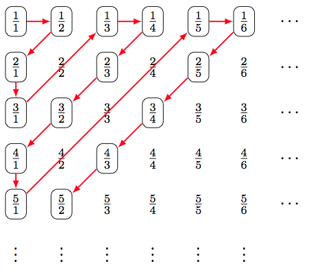
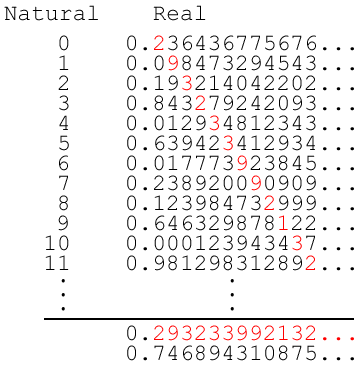

# Discrete wiskunde

# H1 - Verzamelingen, relaties en functies

## Getalverzamelingen

$\mathbb{Z}$ is een **ring**: gesloten voor +, x en -

$\mathbb{Q}$ is een **veld**: gesloten voor +, -, x, en /

$\mathbb{R}$ is ook een veld.

$\mathbb{C}$ is een algebraïsch gesloten veld: je kan alle veeltermvergelijkingen met één onbekende oplossen

## Bewerkingen met verzamelingen

Een paar nuttige eigenschappen
$$
A \cap (B \cap C) = (A \cap B)\cap C \\\
A \cap (B \cup C) = (A \cap B)\cup (A \cap C) \\\
A \backslash ( B \cap C) = (A \backslash B) \cup (A\backslash C) \\\
(B \cap C)^c = B^c \cup C^c
$$

$$
A \cup (B \cup C) = (A \cup B)\cup C \\\
A \cup (B \cap C) = (A \cup B)\cap (A \cup C) \\\
A \backslash ( B \cup C) = (A \backslash B) \cap (A\backslash C) \\\
(B \cup C)^c = B^c \cap C^c
$$

 **Inclusie en exclusie**
$$
\abs{A \cup B} = \abs{A} +\abs{B} - \abs{A\cap B} \\\
\abs{A \cup B \cup C} = \abs{A} +\abs{B} + \abs{C} - \abs{A\cap B} - \abs{A\cap C} - \abs{B\cap C} + \abs{A \cap B \cap C}
$$

$$
\abs{A_1 \cup A_2 \cap \space... \space A_n } = 
\sum _{i=1}^{n}|A_{i}|-\sum _{1\leqslant i<j\leqslant n}|A_{i}\cap A_{j}|+\sum _{1\leqslant i<j<k\leqslant n}|A_{i}\cap A_{j}\cap A_{k}|-\cdots +(-1)^{n-1}\left|A_{1}\cap \cdots \cap A_{n}\right|
$$

## Relaties en functies

**Functie**: Uit elk element in $A$ vertrekt ten hoogste één pijl naar B

**Totale relatie**: Uit elk element van $A$ vertrekt minstens één pijl

**Partiële relatie**: als niet uit elk element van $A$ een pijl vertrekt

**Totale functie**: uit elk element van $A$ vertrekt exact één pijl (= **afbeelding**)

**Surjectie**: er komt in elk element in $B$ minstens één pijl toe

**Injectie**: er komt in elk element in $B$ hoogstens één pijl toe

**Bijectie**: uit elk element in $A$ vertrekt exact één pijl en er komt in elk element van $B$ exact één pijl toe. (=  totale functie die zowel injectief als surjectief is)

### Bewijzen

(op de simpelst mogelijke manier als geheugensteun)

$\abs{\mathbb{N}} = \abs{\mathbb{Z}}$

Twee veramelingen hebben dezelfde kardinaliteit als er een bijectie tussen bestaat.

Dan maken we een bijectie van $\mathbb{Z}$ naar $\mathbb{N}$: neem $\frac{n}{2}$ als $n$ even is en $-\frac{n-1}{2}$ als $n$ oneven is.

---

$\abs{\mathbb{N}} = \abs{\mathbb{Q}}$

Doe dit:

Als je de getallen die je al hebt gehad overslaat, is deze relatie een bijectie.

---

$\mathbb{R}$ is overaftelbaar

Het volstaat om te bewijzen dat $[0, 1]$ overaftelbaar is.

Je maakt dus een nieuw getal waarvan de eerste decimaal verschillend is van de eerste de decimaal van het eerste getal, de tweede van de tweede, etc.

Dan kan je altijd een nieuw getal vinden dat nog niet in je lijst staat.

## Orderelaties

Een relatie is een (partiële) orderelatie als hij aan de volgende voorwaarden voldoet:

* Reflexiviteit: elk element heeft een relatie met zichzelf.
* Antisymmetrie: als $x$ een relatie heeft met $y$, en $y$ dezelfde relatie heeft met $x$, is $x$ gelijk aan $y$. 
* Transitiviteit: als $x$ een relatie heeft met $y$ , en $y$ met $z$. Dan heeft $x$ een relatie met $z$.

Een relatie is een **totale orderelatie** als hij nog aan een vierde eigenschap voldoet:

* Voor alle $x$ en $y$ is er een relatie tussen $x$ en $y$ of tussen $y$ en $x$ (of beide)

Een **strikte orderelatie** is antireflexief i.p.v. reflexief:

* Antireflexiviteit: er zijn geen elementen die een relatie met zichzelf hebben.

Voorbeeld van de cursus:

De relatie $\leq$ in $\mathbb{N}$ is een totale orderelatie, want twee elementen kunnen steeds vergeleken en geordend worden. (hiermee valt de eigenschap van antisymmetrie ook iets beter te begrijpen)

## Equivalentierelaties

Een relatie is een **equivalentierelatie** als als hij aan de volgende voorwaarden voldoet

* Reflexiviteit: elk element heeft een relatie met zichzelf.
* Symmetrie: als $x$ een relatie heeft met $y$ heeft y $y$ dezelfde relatie heeft met $x$.
* Transitiviteit: als $x$ een relatie heeft met $y$ , en $y$ met $z$. Dan heeft $x$ een relatie met $z$.

Het verschil met een orderelatie is de symmetrie.

Voorbeeld uit de cursus:

De relatie 'heeft dezelfde absolute waarde' is een equivalentierelatie. De relatie 'is gehuwd met' is geen equivalentierelatie (niet reflexief)

# H2 - Modulorekenen

### Fundamentele stelling van de rekenkunde

Elk geheel getal groter dan 1 kan op een unieke manier geschreven worden als een product van priemgetallen
$$
{\displaystyle n=p_{1}^{n_{1}}p_{2}^{n_{2}}\cdots p_{k}^{n_{k}}=\prod _{i=1}^{k}p_{i}^{n_{i}}}
$$
Het aantal delers van $n$:
$$
{\displaystyle (n_1 + 1).(n_2+1). ..(n_k+1)=\prod _{i=1}^{k}(n_i + 1)}
$$

ggd en kgv ga ik hier niet opschrijven, maak gewoon de oefeningen. 

## Rekenen in $\mathbb{Z}_n$

### Rekenregels

Kort samengevat. Je mag bij alle bewerkingen waarvan je een modulo moet nemen de modulo van het tussenresultaat nemen om het rekenwerk te vergemakkelijken.

Voorbeeld:

(204.1028) mod 32 = ((204 mod 32) . (1038 mod 32)) mod 32 

= (12.14) mod 32 = 168 mod 32 = 8

### Pseudorandom getallen genereren

Met de **lineaire conguentiemethode**

gebruikt 4 getallen:

* Modulus: $m$
* Factor: $a$
* Increment: $c$
* Seed: $x_0$

Dan kunnen we pseudorandom getallen genereren met:
$$
x_{i+1} = (a.x_i + c) \mod m \quad \quad (i \in \mathbb{N})
$$
Een **Lehmer pseudorandomgenerator** heeft als $m$ een priemgetal of een macht van een priemgetal, $c=0$, $ggd(m, x_0) = 1$ en $a$ is geen nuldeler van $\mathbb{Z}_m$.

* Neem je $m = 2^k$, met $k > 2$. Dan is de maximale periode $\frac{m}{4}$. Als $a \stackrel{8}{=} \pm3$ dan is de periode gelijk aan $\frac{m}{4}$.

* Heeft maximale periode ($m-1$) indien $m$ priem is en $a$ een generator is voor $\mathbb{Z}_m$. ($a, a^2, a^3, ...$ doorloopt alle elementen van $\mathbb{Z}_m$, behalve natuurlijk 0). 

**Hull-dobell theorema**. De periode van een pseudorandom generator is maximaal en gelijk aan m als.

* $c \neq 0$

* $ggd(c,m)=1$

* $a-1$ is deelbaar door alle priemfactoren van $m$

* $a-1$ is deelbaar door 4 als $m$ deelbaar is door 4

  

  :warning: Let op bij de de laatste voorwaarde hier. Als het tweede deel van de voorwaarde niet voldaan is, hoeft het eerste deel ook niet voldaan te zijn (wat het leven soms wel een stuk makkelijker maakt).

## Elementaire vergelijklingen bij modulorekenen

We skippen effe vergelijkingen van de vorm $a + x \stackrel{n}{=} b$. Die hoef ik hopelijk niet uit te leggen.
