# Gegevensstructuren

Onderwerpen uit de slides aangevuld met knowledge uit het boek (als je 70 paginas een boek kunt noemen).

Oke kleine heads-up, op de slides over het examen staat bij de te kennen leerstof:

> Bewijzen of afleidingen die tijdens de les uitgewerkt zijn.

tering

## H1 - Onderwerp en doel

We defineren enkele termen die ons helpen onderscheid te maken tussen verschillende datastructuren

* Containers en woordenboeken

Bij een **container** speelt de sleutel van de gegevens geen rol. Gevens in een container kunnen ofwel opgevraagd worden in een bepaalde volgorde (toevoegvolgorde, prioriteit) of op basis van hun plaats in de structuur. **Woordenboeken** daarentegen ondersteunen operaties zoals zoeken, toevoegen en verwijderen. Woordenboeken laten ook vaak operaties toe die de volgorde van de sleutels gebruiken, op voorwaarde dat er op de één of andere manier een rangorde toegekend wordt aan iedere sleutel.

* Continue en gelinkte datastructuren

Dit slaat op de layout van de datastructuur in het geheugen. Wanneer de data in een continue regio in het geheugen opgeslagen wordt, dan spreken we van een **continue datastructuur**. Denk aan arrays, hashmaps en heaps. Dit soort datastructuur maakt hevig gebruik van ruimtelijke lokaliteit. Spijtig genoeg moet de grootte van deze structuren meestal op voorhand vastgelegd worden. Elk element van een **gelinkte datastructuur** bevat een pointer naar zijn opvolger. Hierdoor hoeven we de grootte van de structuur niet op voorhand vast te leggen.

* Lineaire en niet-lineaire datastructuren

Een andere manier van onderscheid te maken. **Lineaire datastructuren** kunnen grafisch weergegeven worden op een as. Bij **niet-lineaire gegevensstructuren** zoals bomen of grafen is echter een voorstelling in meerdere dimensies nodig.


## H2 - Efficientie van algoritmen

Aangezien het onbegonnen werk is rekening te houden met elke processorarchitectuur, programmeertaal en compiler om de efficiëntie van een algoritme te bepalen, is de exacte tijdsduur van een algoritme berekenen praktisch onmogelijk. We bepalen een schatting van de uitvoeringstijd louter op basis van het algoritme en op $n$ (het aantal gegevens). We beperken on tot drie gevallen:

* **Beste geval** (best-case running time)
  * Niet echt super nuttig. Als we de performantie van een sorteeralgoritme testen is het een beetje nutteloos om te gaan kijken hoe goed het omgaat met al gesorteerde gegevens. 
* **Slechtste geval** (worst-case running time)
  * Het slechtste geval is meestal het belangrijkste. Omdat we weten dat het algoritme gegarandeerd **nooit slechter** zal presteren.
* **Gemiddeld geval** (average-case) running time
  * Is moeilijk te bepalen. Bovendien is de definitie van gemiddeld een beetje vaag. Om dit soort analyse mogelijk te maken moeten er vaak een aantal onrealistische veronderstellingen gemaakt worden.
  * Klein leuk feitje. Als de gemiddelde performantie van een algoritme zeer goed is, maar het slechtste geval vreselijk slecht, dan spreken we van een *Las Vegas* algoritme. Want we nemen het risico.

### Insertion sort

We bepalen als voorbeeld de uitvoeringstijd van `insertion_sort`

```c++
void insertion_sort(vector<T>& v) {
// Stijgend rangschikken
  for(int i = 1 ; i < v.size(); i++) {
  // De eerste i getallen staan reeds in volgorde
    T h = move(v[i]);
    int j = i − 1;
    while (j >= 0 && h < v[j]) {
      v [j + 1] = move(v[j]) ;
      j−−;
    }
    v[j + 1] = move(h) ;
  }
}
```

We splitsen de code op in primitieve operaties en kijken hoe vaak elke operatie wordt uitgevoerd:

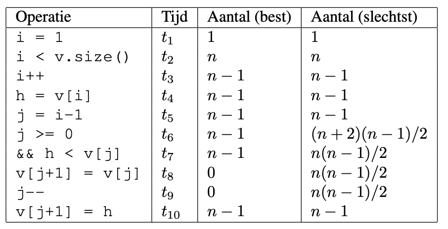

In het best-case scenario wordt de while-loop dus nooit uitgevoerd. Dit is als ge gegevens in de vector al stijgend gerangschikt zijn. Het slechtste doet zich voor als de vector dalend gerangschikt is, dan zal de while-loop telkens $i$ keer herhaald worden. Je kan dit nu voorstellen als een veelterm van de tweede graad. Kijk maar in de cursus ;) 

 

### Asymptotische benadering

We kunnen de uitvoeringstijd van een algoritme op 3 manieren asymptotisch benaderen. In de tekeningen is $f(n)$ de looptijd van ons algoritme en $g(n)$ een arbitraire functie.

| Asymtotische bovengrens                                      | Asymptotische ondergrens                                     | Asymptotische boven- en ondergrens                           |
| ------------------------------------------------------------ | ------------------------------------------------------------ | ------------------------------------------------------------ |
| 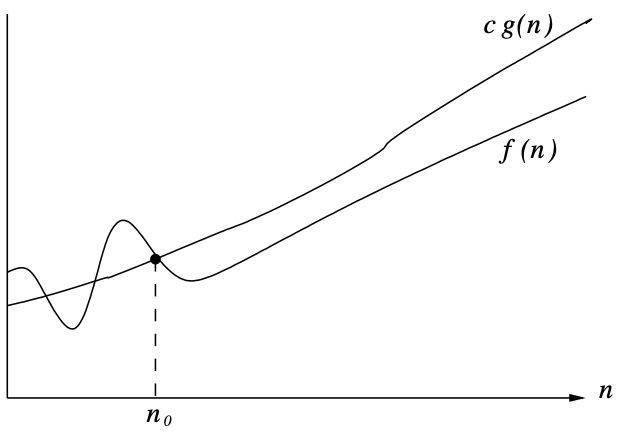  |   | 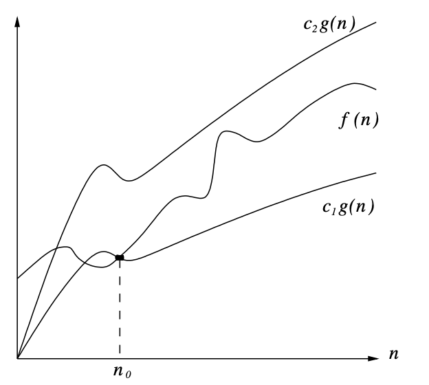  |
| We weten dat voor een grote $n$ de uitvoeringstijd niet sneller zal stijgen dan een bepaalde functie. $O(g(n))$ | We weten dat de uitvoeringstijd minstens zo snel zal stijgen als een bepaalde functie. $\Omega(g(n))$ | Wanneer dezelfde functie zowel een boven als ondergrens voor $f(n)$ vormt. $\Theta(g(n))$ |


### P en NP

Men defineert defineert de verzameling P als alle problemen die oplosbaar zijn in polynomiale tijd. Dus in $O(n^\alpha)$. Problemen waarbij dit niet mogelijk (of alvast nog niet bekend) is, noemen we NP (Nondeterministic Polynomial). Een groot vraagteken is of P en NP gelijk zijn (dus dat alle problemen zouden kunnen opgelost worden in polynomiale tijd). Moest je dit kunnen aantonen kun je blijkbaar 1000 000\$ winnen. Voorlopig gaan we er van uit dat $P \neq NP$.


### Andere criteria

De asymptotische benadering van de uitvoeringstijd is natuurlijk niet het enige belangrijke maatstaf bij de beoordeling van een algoritme. We leven in de echt wereld en moeten rekening houden met een aantal andere zaken:

* Kost van implementeren en testen
* De asymptotische benadering is een *benadering*
  * Constante factoren spelen geen rol in deze benadering, maar in de praktijk wel. In de realiteit zijn twee $O(n)$ algoritmen niet speciaal even snel
  * De benaderingen gelden alleen voor vodoende grote $n$. Soms is een 'slecht' algoritme dus beter voor kleine bewerkingen.
  * Soms is de benadering in het slechtste geval *te slecht* en kan het ons een vertekend beeld geven.
  * We veronderstellen dat elke input even waarschijnlijk is, maar in de realiteit kan je vaak met voorkennis over de data een algoritme een stuk efficiënter maken.
* Soms gebruiken algoritmen te veel geheugen, wat hun voordeel in uitvoeringstijd tenietdoet omdat het geheugen van de computer te klein is.
* Algoritmen kunnen verbazinwekkend verschillende performantie hebben door de geheugenhiërarchie van de computer. Denk aan lokaliteit en caches.
* Parallelle verwerking kan de werktijd van ons algoritme versnellen. Als het aantal verwerkingseenheden samen groeit met $n$ bijvoorbeeld. Denk aan routers in een netwerk.
* Toegang tot het geheugen is een relatief trage operatie. Agoritmen die veel in het geheugen zitten zijn doorgaans trager.

## H3 - Containers

In het eerste hoofdstuk legde ik je het verschil uit tussen een container en een woordenboek. Nu focussen we ons nu dus even op containers. 


### Tabel

Omdat computers nu eenmaal zo werken, moeten we als we gegevens in een tabel (array) opslaan, op voorhand weten hoe groot deze moet zijn. Dit probleem kunnen we (tot kost van de performantie) door een nieuwe tabel te maken wanneer de huidige te klein is. Gewoonlijk maakt men wanneer de array te klein is een nieuwe van twee maal de grootte. De geamorticeerde efficiëntie van deze operatie is nog steeds $0(1)$ aangezien de kost om $n$ elementen $3n$ bedraagt. Zie hieronder voor een beetje meer info. Ik weet nog niet goed of we dit echt moeten kunnen aantonen. Oke het is vorig jaar gevraagd blijkbaar.

**Operaties**

| Operatie                              | Cost             |
| ------------------------------------- | ---------------- |
| Element opvragen                      | $O(1)$           |
| Toevoegen (als we genoeg plek hebben) | $O(1)$           |
| n elementen toevoegen                 | $3n$ (gemiddeld) |

#### Geamorticeerde efficiëntie

> **Amortized efficiency** is a very important concept: instead of looking at a single operation, we look at a sequence of operations and calculate the average efficiency. This is commonly used when an single operation could be slow in some rare situations

Oké, hoe bewijzen we nu dat de geamorticeerde efficiëntie van een element toevoegen aan een dymanische tabel nog steeds gelijk is aan $0(1)$. 
$$
\sum_{i=1}^n t_i = n + \sum_{j=0}^{\lceil log(n)\rceil - 1}2^j < n + 2n = 3n
$$

Met $t_i$ bedoelen we de tijd om de $i$-de toevoegoperatie uit te voeren. $\sum_{i=1}^n t_i$ is dus de tijd die $n$ toevoegoperaties in beslag nemen. We kunnen deze opsplitsen in 2 gevallen:

* De array is niet vol: de operatie duurt '1' lang. Voor $n$ operaties duurt het dus $n$ lang.
* De array is vol: er staan $i-1$ elementen in de array. Dan verdubbelen we de grootte van de array. Dit moeten we dus elke keer als het aantal elementen in de array een macht van twee is doen. Van daar de :$\sum_{j=0}^{\lceil log(n)\rceil - 1}2^j$ (dit is een meetkundige reeks)

Wikipedia:

> For ${\displaystyle r\neq 1}$, the sum of the first *n*+1 terms of a geometric series, up to and including the *r* n term, is:

$$
{\displaystyle a+ar+ar^{2}+ar^{3}+\cdots +ar^{n}=\sum _{k=0}^{n}ar^{k}=a\left({\frac {1-r^{n+1}}{1-r}}\right),}
$$

Als ik het vorige ding invul in de formule krijg ik $n-1$ als antwoord, maar dat komt waarschijnlijk omdat ik geen rekening heb gehouden met die ceil (dit ding $\lceil \rceil$) bij de $log(n)$. In ieder geval, $\sum_{j=0}^{\lceil log(n)\rceil - 1}2^j$ is een meetkundige reeks en we weten dat zijn som zeker kleiner is dan $2n$. 

### Linked List

Bij een gelinkte lijst is elk element toegankelijk, maar niet direct toegankelijk. Als we een bepaald element zoeken, zullen we altijd vanaf de eerste knoop moeten beginnen en de pointer naar zijn opvolger volgen. We hebben natuulijk ook dubbel gelinkte lijsten, maar dat verhaal ken je hopelijk al.

**Operaties**

| Operatie                                 | Cost   |
| ---------------------------------------- | ------ |
| Eerste element opvragen                  | $O(1)$ |
| Element verwijderen (dat al gevonden is) | $O(1)$ |
| Element opvragen                         | $O(n)$ |


### Stack

Je kan een stapel implementeren gebruik makende van een tabel, dan heb je wel een stack pointer nodig omdat je de grootte van je tabel niet zomaar bij elke operatie kan gaan zitten aanpassen. Een element verwijderen is dan gewoon je stack pointer een plaatsje terugschuiven. 

Je kan een stack ook perfect implementeren met een gelinkte lijst. Alle operaties blijven dan nog steeds $O(1)$. Bovendien kan je stapel dan ook niet zomaar vol zijn zoals bij een array.

Een stack wordt zeer vaak gebruikt en is handig om gegevens bij te houden waarvoor de volgorde van verwijderen onbelangrijk is.

**Operaties**

| Operatie                         | Cost   |
| -------------------------------- | ------ |
| Toevoegen (Push)                 | $O(1)$ |
| Verwijderen (Pop)                | $O(1)$ |
| Testen of hij leeg is            | $O(1)$ |
| Bovenste gegeven opvragen (peek) | $O(1)$ |

Een stack werkt volgens het first in last out principe.

### Queue

Simpelweg een stack met twee pointers. Als we herhaaldelijk elementen toevoegen en verwijderen komen we bij een tabelgebaseerde implementatie wel lichtjes in de problemen. Onze queue schuift dan telkens verder naar het einde van de tabel en zal deze ook snel bereiken. Dit kunnen we oplossen door een ringvormige tabel te gebruiken. Dit betekent simpelweg dat als we de index van het laatste element van de tabel bereiken, de volgende toevoegings- of verwijderingsoperatie we terug uitkomen bij de eerste.

Het is natuulijk ook weer mogelijk om een gelinkte lijst te gebruiken voor de implementatie voor je queue. Dan moet je simpelweg een extra pointer naar het laatste element bijhouden. Als je ook langs de achterkant van de queue elementen wilt verwijderen zal je een dubbelgelinkte lijst nodig hebben.

**Operaties**

| Operatie              | Cost   |
| --------------------- | ------ |
| Toevoegen             | $O(1)$ |
| Verwijderen           | $O(1)$ |
| Testen of hij leeg is | $O(1)$ |

Een queue werkt volgens het first in first out principe.

### Deque

Indien je het nog niet wist. Deque staat voor *double ended queue*. Een deque is een combinatie van een stack en een queue. Je kan nu vanvoor en vanachter elementen toevoegen of verwijderen.

**Operaties**

| Operatie                                       | Cost   |
| ---------------------------------------------- | ------ |
| Toevoegen                                      | $O(1)$ |
| Verwijderen                                    | $O(1)$ |
| Het boeit eigenlijk niet, alles is toch $O(1)$ |        |


### Boom


We defineren een boom simpelweg als een verzameling van **knopen** (nodes of vertices) en **takken** (edges) waarmee de knopen aan elkaar verbonden zijn. De takken hebben geen bepaalde richting, daarenboven is het belangrijk dat er geen lussen mogen bestaan. Een boom heeft ook niet noodzakelijk een wortel.

Verder verklaren zal ik nog enkele termen verduidelijken om de rest van dit onderdeel een beetje verstaanbaarder te maken:

* **Wortel**: het bovenste bolletje, de knoop zonder ouders.
* **Blad**: Eén van de onderste bolletjes. Een knoop zonder kinderen.
* **Deelboom**: je kan elke knoop van een boom zien als een wortel van een nieuwe boom, dit is een deelboom van onze boom
* **Diepte** van een knoop: het aantal takken tussen deze knoop en de wortel.
* **Hoogte** van een knoop: lengte van de langste weg van deze knoop tot een blad.
* **Graad**: het aantal kinderen van een knoop

We focussen ons vooral op binaire bomen, waar elke knoop twee kinderen kan hebben. Er zijn ook andere bomen, maar daar zal ik verder op ingaan moest dat nodig zijn verder in de cursus (niet dus).


#### Voorstelling

Je kan als het aantal knopen vastligt, een boom opslaan in een tabel. Meestal zijn bomen dynamische structuren, dus gaan we gebruik maken van pointers. Een binaire boom heeft typisch naar ieder van zijn kinderen een pointer. Als een boom geen kinderen of maar een deel van het mogelijke kinderen heeft, zullen deze voorgesteld worden door *nullpointers*. Verder kan je ook als er veel kinderen onbreken de knopen in de boom bijvoorbeeld pointers geven naar zijn ouders om sommige algoritmes sneller te maken.

Als we een boom met een variërend aantal gevens willen opslaan, kunnen we best elke knoop een gelinkte lijst van zijn kinderen laten bijhouden. Dit heeft als gevolg dat elke knoop een wijzer bevat naar zijn kind en een wijzer naar zijn rechterbuur. Probeer het je even voor te stellen. De desbetreffende knoop zit in de lijst van zijn ouder, en in een gelinkte lijst duidt elk element zijn opvolger aan. Dus heeft elke knoop ook een wijzer naar zijn rechterbuur.


#### Systematisch overlopen van bomen

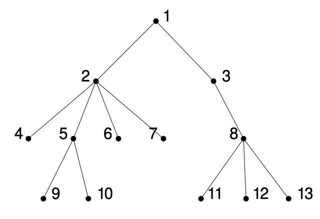

Bij tabellen kunnen we gemakkelijk sequentieel alle gegevens in volgorde uitlezen. Spijtig genoeg is dat niet zo simpel bij bomen. De manier waarop we een boom doorlopen hangt af van hoe wij beslissen om de boom te doorlopen. We maken onderscheid tussen drie mogelijke manieren:

* **Depth first**: 
  
  We bekijken de wortel en gaan telkens recursief verder naar beneden. Deze omschijving is een beetje vaag, aangezien er verschillende mogelijkheden zijn. Kijk gewoon naar de naam. We gaan dus altijd direct diep in de boom gaan bij deze manier. We hebben dus een aantal recusief gedefineerde manieren om een boom depth first te doorlopen:
  
  * Pre-order: wortel - linkse deelboom - rechtse deelboom (Polish notation)
    * {1, 2, 4, 5, 8, 9, 3, 6, 7, 10, 11} (bij de boom hierboven)
  * In-order: linkse deelboom - wortel - rechtse deelboom
    * {4, 2, 8, 5, 9, 1, 6, 3, 10, 11, 7}
  * Reverse in-order: rechter deelboom - wortel - linkse deelboom (zegt de cursus precies niks over)
  * Post-order: linkse deelboom - rechtse deelboom - wortel  (Reverse polish notation)
    * {4, 8, 9, 5, 2, 6, 11, 10, 7, 3, 1}
    * Is nuttig op een stack machine blijkbaar
  
* **Breadth-first**: op een gegeven niveau lezen we eerst alle knopen op dat niveau alvorens dieper te gaan. Deze methode maakt geen gebruik van de recusieve eigenschap van de boom. 

* **Best first**: We kennen een bepaalde prioriteit toe aan de kinderen (e.g. Monte Carlo tree search)


### Graaf


Een graaf bestaat uit **knopen** (vertices) en **verbindingen** (edges). De knopen stellen objecten voor waartussen verbindingen kunnen bestaan. Meestal mag er maar één verbinding zijn tussen twee knopen. Is dit niet het geval, spreken we van een **multigraaf** hier is het ook toegestaan dat knopen een verbinding hebben met zichzelf. Als verbindingen een bepaalde richting hebben, spreken we van een **gerichte graaf**. Bij een ongerichte graaf stelt de **graad** van een knoop het aantal buren van die knoop voor. Bij gerichte grafen spreken we van een in- en uitgraad. Waarbij de ingraad dan het aantal inkomende verbindingen is en de uitgraad het aantal puisten op de reet van uw moeder.

We kunnen grafen in een computer op twee manieren voorstellen:

**Adjacency matrix** (burenmatrix): een N x N matrix waarbij het gewicht van de verbinding tussen 2 nodes op plaats [node1, node2] staat. Deze manier is zeer efficiënt om snel te testen of er een verbinding bestaat tussen twee knopen, maar neemt spijtig genoeg snel veel geheugen in beslag. We gebruikten deze manier dus best om een *dichte graaf*, met relatief veel verbindingen voor te stellen. Bij een ongerichte graaf komt elke verbinding twee keer voor in de matrix.

**Adjacency lists ** (burenlijsten): Voor elke node houden we een lijst met zijn buren bij. Dit is efficienter voor grafen met weinig verbindingen.


## H4 - Priority queues

Priority queue = een queue die elementen teruggeeft op basis van hun prioriteit.

Soms willen we de elementen in een wachtrij niet behandelen volgens de volgorde dat ze erin zijn beland, maar volgens een prioriteit die wij ze toekennen. We kunnen dit op 2 manieren:

* **Gerangschikte tabel**: we rangschikken de gegevens volgens prioriteit. Dan wordt het element met de hoogste prioriteit verwijderen $O(1)$ en een element toevoegen $O(n)$
* **Ongeordende tabel**: Dan wordt toevoegen $O(1)$ en het element met de hoogste prioriteit verwijderen $O(n)$, want we moeten elke keer de hele tabel doorzoeken om hem te vinden.

Er bestaat ook een compromis tussen deze twee. Een (binaire) heap. Ik zal je iets verder naar beneden laten zien dat zowel toevoegen als verwijderen dan in $O(\log n)$ tijd kan gebeuren.


### Heap

Een heap is een boomstructuur die door zijn regelmatige vorm gemakkelijk in een tabel opgeslagen kan worden. Een heap is een **complete binaire boom**, waarvan de elementen voldoen aan de **heap-voorwaarde**\*. Alle niveaus, behalve dan eventueel de laatste zijn volledig gevuld. Op het laatste niveau moet dan ook het kind aan de linkerkant zitten.

Zoals je ziet maakt een heap het gemakkelijk om snel het grootste (of het kleinste) element op te vragen.


> *Heap-voorwaarde
>
> **Max heap**: the value of the parent is larger than (or equal to) the value of the children 
>
> **Min heap**: the value of the parent is smaller than (or equal to) the value of the children

Op een volledig gevuld niveau $i$ zijn er  $2^i$ knopen. Een volledig gevulde boom met hoogte $h$ heeft dan:
$$
\sum_{i=0}^h 2^i = 2^{h+1} - 1
$$
knopen. Omdat het laatste niveau niet noodzakelijk is gevult zal $n$ liggen tussen:
$$
2^{h} - 1 <n\leq 2^{h+1} - 1 \\
2^{h} <n\leq 2^{h+1} 
$$
Als we dan het logaritme nemen van bijde kanten, krijgen we $h =  \lfloor log(n) \rfloor$

Omdat een heap zo regelmatig is kunnen we die gewoon in een array steken:

* De ouder van $i$ vinden we terug op $\lfloor (i-1)/2 \rfloor$ 
* De kinderen van $i$ vinden we terug op: $2i+1$ en $2i+2$

Er zijn ook $d$-heaps. Is dit belangrijk? //TODO


#### Bewerkingen op heaps

| Bewerking                                    | Beschrijving                                                 | Tijdscomplexiteit |
| -------------------------------------------- | ------------------------------------------------------------ | ----------------- |
| Element toevoegen                            | Achteraan op de heap toevoegen, en daarna het element omhoog laten komen tot het op een juiste plek staat (*bubble up*). In het slechtste geval moet hij helemaal tot bovenaan. | $O(log(n))$       |
| Root node vervangen                          | Als dan de heap voorwaarde niet is voldaan zal hij omlaag moeten zakken totdat hij juist staat. In het slechtste geval helemaal tot onderaan (*bubble down*) | $O(log(n))$       |
| Root node verwijderen                        | Om de heap compleet te houden zetten we dan het laatste element vooraan en doen we een bubble down. | $O(log(n))$       |
| Element van een willekeurige knoop vervangen | Als het nieuwe element de heapwoorwaarde verstoort, zal hij naar onder of naar boven moeten bubbelen. | $O(log(n))$       |


#### Constructie van een heap (met bewijzen)

We kunnen een heap op twee manieren opbouwen. Aan de ene kant door gewoon elementen blijven toe te voegen, of door verschillende deelheaps samen te voegen. Je kan misschien al raden dat de tweede manier efficiënter is.

**Heap bouwen door elementen toe te voegen**

Oké we kunnen gemakkelijk beredeneren dat $n$ elementen toevoegen aan een heap $T(n)$ kost. We moeten voor de eerste twee toevoegingen maximaal 1 tje omhoog bubbelen. Voor de volgende 4 moeten we in het slechtste geval 2 keer omhoog bubbelen. Enzovoort...
$$
T(n) \leq \sum_{i=0}^h 2^i.i \text{ (dit stond om de een of andere reden niet in de cursus)} \\ 
T(n) \leq 2.1 + 4.2 + 8.3 + \cdots + 2^{h-2}(h-2) + 2^{h-1}(h-1) + 2^{h}(h) \\
2T(n) \leq 4.1 + 8.2 + 16.3 + \cdots + 2^{h-1}(h-2)  + 2^{h}(h-1) + 2^{h+1}(h)
$$
Als we nu de eerste van de tweede aftrekken, maar begin niet van het begin. Doe het zo:
$$
\quad\quad\quad\quad\quad\quad\quad\quad\space
2T(n) = 4.1 + 8.2 + 16.3 + \cdots + 2^{h-1}(h-2)  + 2^{h}(h-1) + 2^{h+1}(h)\\
T(n) = 2.1 + 4.2 + 8.3 + 16.4+ \cdots  + 2^{h-1}(h-1) + 2^{h}(h) \\
\quad\quad\quad
2T(n) - T(n) = -2\space\space-4\space\space-8\space\space-16- \space\space\cdots\space\space -2^{h-1}\quad \quad\quad- 2^h + 2^{h+1}.h
\quad\quad\quad\quad\space
\\
$$
De termen van $-2$ tot $-2^h$ vormen (als we vanvoor een $-1$ toevoegen) een meetkundige reeks: $\sum_{i=0}^h 2^i = 2^{h+1} -1$. 
$$
2T(n) - T(n) = 1 -( 1+2+4+8+16+ \cdots +2^{h-1} + 2^h) + 2^{h+1}.h
$$

$$
T(n) = 2T(n) - T(n) \leq 1 -(2^{h+1}-1) + 2^{h+1}.h
\\ 
T(n) = 2T(n) - T(n) \leq 2 + 2^{h+1}(h-1)
$$

We weten dat $2^h \leq n < 2^{h+1}$, onthoud dat $h$ de hoogte is en $n$ het aantal elementen. Dan kunnen we de log nemen van het vorige en komen we dit uit:
$$
T(n) \leq 2 + 2n\log_2 n
$$
Een heap opbouwen door middel van elementen toevoegen is dus $O(n\log n)$

**Heap opbouwen door kleinere heaps samen te voegen**

In de plaats van de elementen één voor één toe te voegen, gaan we kleinere heaps maken en ze samenvoegen. In theorie toch. Data in een array kunnen we eigenlijk direct voorstellen als een heap, deze is alleen nog niet gesorteerd. We bekijken dan beginnend van vanonder elke deelheap.

Hoe doen we dat dan:


We kijken ter illustratie naar de afbeelding. Stel je voor dat hij nu niet zou voldoen aan de heapvoorwaarde. Of nee, laten we zeggen dat we van deze data een min heap willen maken.

* We beginnen helemaal onderaan. Bekijk de deelheap (17,2,7). Om deze juist te zetten moeten we enkel 17 en 7 van plaats wisselen.
* Nu gaan we en niveau hoger (naar 19). Nu moeten we weeral enkel de wortel naar beneden laten bubbelen. 
* Je moet dus niet elke heer heel de boom doorlopen.

Het aantal operaties die je nu moet uitvoeren bedraagt.
$$
T(n) = \sum_{i=0}^h 2^i(h-i) \\
$$
Dit komt doordat er op elk niveau $2^i$ elementen zijn. Elk element moet dan hoogstens $h-i$ plaatsen zakken om op de juiste plek terecht te komen. Op het zicht lijkt dit $O(n \log n)$, maar als we een gelijkaardige strategie als bij het vorige onderdeel toepassen, kunnen we het tegendeel aantonen:
$$
\quad\quad\quad\quad\quad\quad\quad2T(n) = 2h + 4(h-1) + 8(h-2) + \cdots + 2.2^{h-1}+ 2^{h} \\
T(n) = h + 2(h-1) + 4(h-2) +8(h-3) + \cdots + 2^{h-1} \\
T(n) = -h + 2 +4+8+\cdots + 2^{h-1} + 2^h \\
T(n) = -h - 1 + (1 + 2 +4+8+\cdots + 2^{h-1} + 2^h)\\
T(n) = -h-1 + 2^{h+1} - 1
$$
We weten dat $h = \log n$, dus $T(n) = O(n)$

### Merging heaps

Soms willen we twee heaps samenvoegen. Sommige andere soorten heaps zijn hier goed in. Hieronder ga ik in detail over coole datastructuren die merge-operaties vergemakkelijken.


#### Binomial queue

= een bos van **binomial trees**

Een binomiaalboom wordt gekenmerkt door zijn hoogte. Voor elke hoogte is er maar 1 binomiaalboom. Deze bestaat uit 2 bomen van de vorm van één niveau lager. Ik heb mijn artistieke skills bovengehaald om het even te verduidelijken op de tekening. Ik vind het wel een beetje dom dat ze het onnodig achtten er een boom van niveau 1 bij te zetten in de slides. De tweede boom is dus steeds het meest linkse kind van de eerste deelboom.


We kunnen een prioriteitswachtrij dus voorstellen door een bos van binomiaalbomen, waarvan er van elk niveau hoogstens eentje is (want als er 2 zijn kunnen we ze samenvoegen.)

Bij $n$ elementen zijn er dus $log(n)$ bomen nodig, deze bomen volgen allemaal de heap-eigenschap.

##### Operaties

| Operatie                      | Beschrijving                                                 | Tijdscomplexiteit |
| ----------------------------- | ------------------------------------------------------------ | ----------------- |
| Minimum/maximum vinden        | Dan moet je alle rootknopen van de bomen vergelijken. Er zijn $log(n)$ bomen, dus $log(n)$ rootknopen. Als we de plaats van het minimum onthouden kunnen we er ook $O(1)$ van maken. | $O(\log n)$       |
| 2 bomen samenvoegen           | Die met de kleinste root kind maken van die met de grootste root. (zie hieronder) | $O(1)$            |
| 2 binomial queues samenvoegen | Omdat er $\log n$ bomen zijn.                                | $O(\log n)$       |
| Prioriteit verminderen*       | Naar de wortel toe bewegen                                   | $O(\log n)$       |
| Verwijderen*                  | Prioriteit verminderen en minimum verwijderen combineren.    | $O(\log n)$       |

\* *vereisen beide dat het element eerst gevonden wordt*

Je kan gemakkelijk 2 bomen van dezelfde grootte mergen in 1 operatie (boom met de grootste root links):

 


#### Pairing heap

Een boom die de heap-eigenschap volgt, maar niet speciaal compleet is. We gaan een pariting heap typisch implementeren gebruik makende van pointers. Elke node houdt een pointer bij naar zijn linkerkind en zijn rechterbuur.


##### Operaties

| Operatie                        | Beschrijving                                                 | Tijdscomplexiteit                              |
| ------------------------------- | ------------------------------------------------------------ | ---------------------------------------------- |
| 2 heaps samenvoegen             | Als we 2 pairing heaps mergen, zetten we de boom met de grootste root links en omdat elke node een pointer heeft naar zijn buur, kunnen we gemakkelijk alles verzetten. (zie afbeelding hieronder) | $O(1)$                                         |
| Prioriteit van element verlagen | Splits de boom vanaf dat element. Dit is nu de wortel van zijn eigen boom. Pas de prioriteit aan en merge hem opnieuw in de boom. (dit gaat niet als je de prioriteit moet verlagen, want dan klopt die deelboom op zich niet) | $O(1)$ (indien je het element al had gevonden) |
| Wortel verwijderen              | De boom valt dan uit elkaar in een aantal deelbomen. Deze kan je dan samenvoegen. Als je dom bent voeg je ze dan een voor één toe tot je weer een boom hebt ($O(n)$), maar je kan ze ook eerst per 2 samenvoegen en daarna al deze boompjes samenvoegen. | $O(\log n)$ als je slim bent                   |
| Willekeurige knoop verwijderen  | De deelheap van deze knoop loskoppelen, dan moet je op die deelheap enkel de wortel verwijderen en kan je hem vervolgens terug samenvoegen met de oorspronkelijke heap. | $O(\log n)$                                    |


Heaps zijn nuttig bij discrete event simulation. Maar dat wist je misschien al.


## H5 - Basic dictionaries

Woordenboeken gebruiken sleutels om gegevens te vinden. We willen de slieutels liefst ook op goede plaats zetten om de gegevens snel terug te kunnen vinden. We veronderstellen ook dat de sleutels verschillend zijn.

In dit hoofdstuk houden we ons enkel bezig met lineaire woordenboekstructuren. (met tabellen of gelinkte lijsten)


### Tabel

We steken ons woordenboek dus in een array. Dit kan op verschillende manieren

#### Rechtstreeks addresseerbare tabel

Als we een 1-op-1 verband kunnen vinden tussen de sleutels en indices, hoeven we de sleutels nieteens op te slaan. Dan spreken we van een *directly addressable table*. 

Alle woordenboekoperaties zijn hier $O(1)$. Moet je toch meerdere gegevens per sleutel willen ondersteunen, kan je op de overeenkomstige tabelindex een gelinkte lijst voorzien.

#### Ongeordende tabel

We kunnen een woordenboek opslaan in een niet gerangschikte array.

**Operaties**

| Operatie    | Beschrijving                                                 | Tijdscomplexiteit |
| ----------- | ------------------------------------------------------------ | ----------------- |
| Zoeken      | Alle sleutels moeten sequentieel overlopen worden            | $O(n)$            |
| Toevoegen   | Gewoon achteraan die lijst keilen                            | $O(1)$            |
| Verwijderen | We gaan er van uit dat het element al gevonden is. We vervangen hem gewoon door het element achteraan in de lijst. | $O(1)$            |

#### Tabel geordend volgens zoekkans

We kunnen de performantie verhogen door elementen waarvan we weten dat die vaker gezocht gaan worden vooraan te zetten. De optimale volgorde van de tabel is dan als de sleutels in dalende waarschijnlijkheid gerangschikt zijn. Meestal weten we natuurlijk niet op voorhand welke sleutels vaker gebruikt gaan worden. Hier zijn enkele oplossingen voor.

*  De frequentie bijhouden waarmee elke element wordt gezocht. Dan de gegevens rangschikken volgens dalende frequentie.
* Als een element gevonden wordt, hem verwisselen met zijn voorganger. Elke keer dat je iets opzoekt wordt de tabel dus efficiënter. Het duurt wel even voordat de elementen in een goede volgorde staan, dus dit is een beetje stom als de waarschijnlijkheid verandert met de tijd.

#### Gerangschikte tabel

**Operaties**

| Operatie    | Beschrijving                                                 | Tijdscomplexiteit |
| ----------- | ------------------------------------------------------------ | ----------------- |
| Zoeken      | We kunnen binair zoeken. Als je niet weet wat dat is mag aan mijn hond z'n reet komen likken hij vindt dat heel lekker (vraag me niet waarom ik dat weet). | $O(\log n)$       |
| Toevoegen   | Nadat we de juiste plek voor het element hebben gevonden, moeten we in het slechtste geval heel de tabel opschuiven. | $O(n)$            |
| Verwijderen | Zelfde als toevoegen                                         | $O(n)$            |


### Gelinkte lijst 

We kunnen ook een linked-list als woordenboek gebruiken. Dit gaat weeral op een paar manieren.

#### Ongeordende lijst

**Operaties**

| Operatie    | Beschrijving                                                 | Tijdscomplexiteit |
| ----------- | ------------------------------------------------------------ | ----------------- |
| Zoeken      | We moeten heel de lijst overlopen                            | $O(n)$            |
| Toevoegen   | Gewoon vooraan toevoegen                                     | $O(1)$            |
| Verwijderen | Als we het element gevonden hebben, hem er gewoon tussenuit flikkeren. Bij een gewone gelinkte lijst hebben we wel de voorloper nodig. | $O(1)$            |

#### Lijst geordend volgens zoekkans

We kunnen ook weer de meer gebruikte elementen naar vooraan schuiven. Wat niet kon bij arrays is als een element opgeroepen wordt, hat direct helemaal vooraan te zetten. Dit blijkt in de praktijk toch minder goed te zijn dan de eerste methode.

#### Gerangschikte lijst

**Operaties**

| Operatie    | Beschrijving                                                 | Tijdscomplexiteit |
| ----------- | ------------------------------------------------------------ | ----------------- |
| Zoeken      | We kunnen niet rechtstreeks aan de elementen, dus we moeten toch heel de lijst overlopen om het juiste element te vinden. | $O(n)$            |
| Toevoegen   | Ook weer heel de lijst overlopen om de juiste plek te vinden | $O(n)$            |
| Verwijderen | Zelfde als toevoegen                                         | $O(n)$            |

Een gerangschikte linked-list voor een woordenboek is dus tering nutteloos waarom staat dit zelfs in de cursus.

## H6 - Hash Tables

Ik ga even veronderstellen dat je weet wat een hashfunctie is. We gaan uit onze index een sleutel afleiden door middel van een hashfunctie. Met die index kunnen we dus rechtstreeks ons element uit de tabel halen. Het probleem is natuurlijk een hashfunctie vinden die de sleutels mooi verdeelt over de tabel, zonder conflicten te veroorzaken. Als we de sleutels op voorhand weten, kunnen we naturlijk een hashfunctie maken die een uniek resultaat oplevers voor elke sleutel. Dit is niet mogelijk als we super veel mogelijke sleutels hebben (strings bijvoorbeeld). 

Hoe gaan we dan om met die conflicten? Lees verder en ik zal je verrijken met deze kennis.


### Chaining

Hier volgen een aantal methodes die omgaan met conflicten door middel van gelinkte lijsten. 

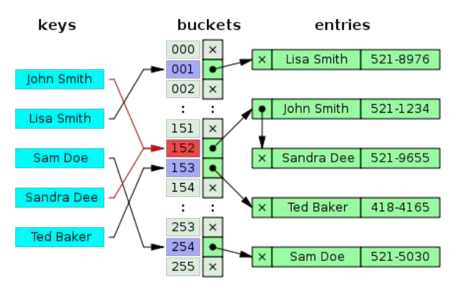

#### Separate chaining

We zetten alle sleutels die op dezelfde index terechtkomen in een gelinkte lijst.

**Operaties**

| Operatie    | Beschrijving                                                 | Tijdscomplexiteit |
| ----------- | ------------------------------------------------------------ | ----------------- |
| Zoeken      | In het slechtste geval (wanneer al de elementen in één bucket zitten). Neem $n$, het aantal elementen en $m$ het aantal vakjes. En $\alpha = \frac{n}{m}$. Dan is de gemiddelde zoektijd $\Theta(\alpha +1)$, met 1 de constante tijd die de hashfunctie nodig heeft. Als $m \approx n$, hebben we dus $O(1)$ | $O(1)$            |
| Toevoegen   | Vanvoor toevoegen. (draagt ook bij aan temporale lokaliteit) | $O(1)$            |
| Verwijderen | Aangezien zoeken $O(1)$, gewoon het gevonden element wegyeeten. | $O(1)$            |

We moeten dus gewoon ervoor zorgen dat de grootte van onze hashtabel evenredig is met het aantal opgeslagen sleutels. Als $m$ en $n$ te hard verschillen zullen we dus geen $O(1)$ hebben.


#### Coalesced chaining

Het verschil tussen separate chaining en coalesced chaining is simpel. Bij het vorige kon elke vakje enkel een lijst met elementen bevatten. Coalesced chaining gebruikt daarentegen een **tabel van lijstknopen**. Hij kan hierin niet alleen een waarde opslaan, maar ook een **verwijzing naar een andere element**.


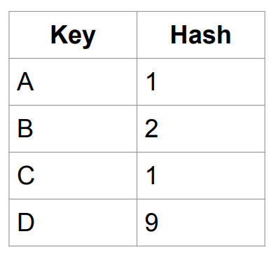

| 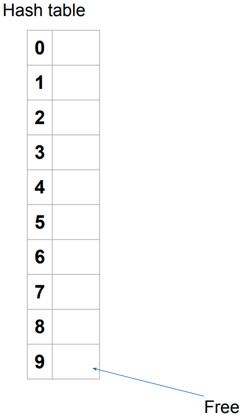  | 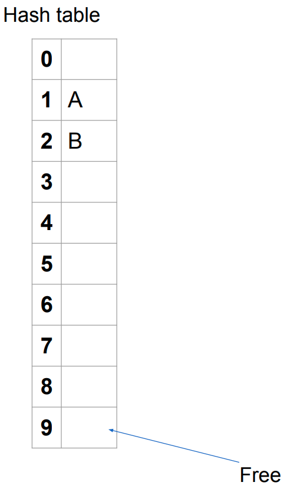  | 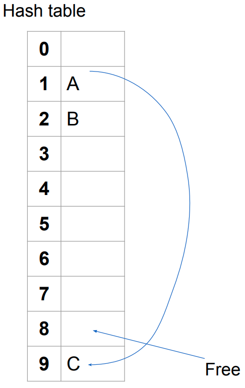  | 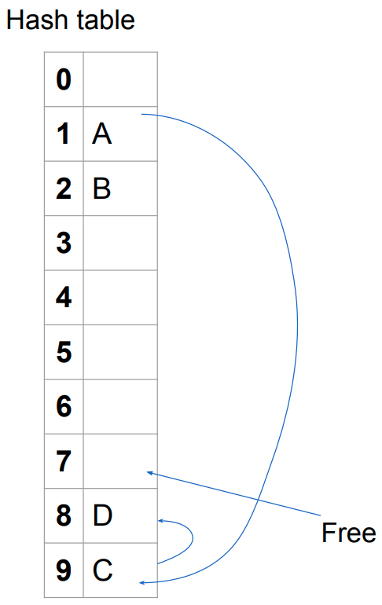  |
| ------------------------------------------------------------ | ------------------------------------------------------------ | ------------------------------------------------------------ | ------------------------------------------------------------ |
| We houden op voorhand een pointer bij naar een lege plaats die gebruikt kan worden bij collisions | We voegen A en B toe, er is nog geen collision. Extra zin om de tabel te alignen ik heb autisme. | C heeft dezelfde hash als A, we smijten hem dus op het vrije plekje, verzetten de pointer naar een ander vrij plekje | Plek 9 is al bezet, dus we zetten D op de vrije plek waarnaar de pointer wees. Vak 9 heeft nu ook een pointer naar D. |

In hoeverre ik het begrijp heeft elk vakje in de tabel dus plaats voor een **waarde** en een **pointer**. Als we een element toevoegen en het waarde-vakje op de plek van de hash van dat element is leeg, dan zetten we het element daar. Als er **al een waarde** staat, maar de pointer is leeg, zetten we de **pointer naar een ander leeg vakje** (die pointer wordt zo te zien op voorhand al bijgehouden) en zetten we die waarde erin. Als we een waarde willen toevoegen, maar de plek van de hash **bevat al een waarde en een pointer**, dan **volgen we de pointer**, mogelijks meermaals, totdat we bij een vakje zonder pointer komen en **zetten de pointer** naar het lege vakje daarin. (waarna we dat lege vakje vullen natuurlijk).

Coalesced (samengevoegd volgens google translate) wijst op het feit dat een plaats die opgevuld is bij een collision deel uit kan maken van **verschillende lijsten**. Het grote voordeel aan deze methode is dat we geen knopen dynamisch hoeven aan te maken. 


**Adres- en overflow zone**

Een kleine variant op coalesced chaining maakt gebruik van een **overflow zone**, als er zich een collision voordoet, zal het desbetreffende element hierin geplaatst worden. Als er geen collision is, zal het element in de **adreszone** geplaatst worden. Pas als alle geheugenruimte in de overflowzone is opgebruikt zetten we onze lijsten verder in de adreszone.

**Operaties**

| Operatie    | Beschrijving                                                 | Tijdscomplexiteit |
| ----------- | ------------------------------------------------------------ | ----------------- |
| Zoeken      | Begint in de adreszone. We vertrekken op de plek van de hash van de te zoeken sleutel en volgen de ketting tot we de juiste hebben gevonden of uitkomen op een leeg vakje. | $O(1)$*           |
| Toevoegen   | Heb ik grotendeels uitgelegd. Alleen heb ik niet gezegd hoe de pointer naar de lege plaats bepaald wordt. Meestal wordt **de laatste lege plaats** in de tabel hiervoor gebruikt.  Wordt deze gevult, gaan we omhoog naar de vorige lege plaats. Dit is perfect als we een adres- en overflow zone gebruiken. Bij gewone coalesced chaining gaan hierdoor de laatste knopen snellen opvullen en de lijsten sneller samenklitten. | $O(1)$*           |
| Verwijderen | Verwijderen is moeilijk, dus we gebruiken liefst **lazy deletion**. We markeren simpelweg een element als verwijderd, als er een element op die plaats wilt staan, dan vervangen we het. Dit beïnvloedt de zoektijd wel negatief (door die sleutels die daar voor niks staan). Als we vaak willen verwijderen kunnen we beter separate chaining gebruiken. | $O(1)$*           |

\* *Neem deze met een korrel zout. De worst case kan eigenlijk super slecht zijn. Dit is in de praktijk niet zo omdat we bij een goede verdeling bijna altijd onze sleutel direct vinden*

Het komt erop neer dat coalesced chaing **het snelste** is van alle soorten hashtabellen. Zolang onze grootteverhouding goed ligt toch ($\alpha > 0.6$). 


#### Open adressering

In tegenstelling tot coalesced chaining, waar de conflicten worden opgelost met pointers, gaan we bij open addressering de alternatieve plaats voor de sleutel **berekenen**. We ruilen dus plaats voor tijd. We maken geen gebruik van een overflow zone, want de alternatieve plaatsen liggen vast. Het is ook belangrijk om op voorhand een idee te hebben van het aantal gegevens, aangezien ze allemaal in de tabel moeten passen. Onze bezettingsgraad $\alpha = \frac{n}{m}$ kan dus nooit groter zijn dan 1.

| Operatie    | Beschrijving                                                 | Tijdscomplexiteit |
| ----------- | ------------------------------------------------------------ | ----------------- |
| Zoeken      | We berekenen weeral de hash om op de juiste plaats in de tabel uit te komen. Als deze plaats niet de juiste sleutel bevat, voeren we een bepaalde berekening uit om een andere plaats te zoeken. | $O(1)$*           |
| Toevoegen   | Als we door te zoeken een lege plaats vinden, zetten we het element daar. | $O(1)$*           |
| Verwijderen | We moeten weer doen aan lazy deletion. Moraal van het verhaald: gebruik seperate chaining als je vaak elementen moet verwijderen. | $O(1)$*           |

\**Eigenlijk weet ik de worst case performance niet. Op zich is die niet echt zo belangrijk.*

Wanneer bij open adressering de tabel **bijna vol** is zal, zoals je misschien wel kan raden, de performantie dramatisch **verslechteren**. Doordat we geen pointers moeten bijhouden, zal de totale in beslag genomen **geheugenruimte** toch aanzienlijk **kleiner** zijn dan bij andere soorten hashtabellen.


#### Bepalen van zoeksequenties

Hoe moeten we nu de alternatieve plaats voor een element berekenen bij het voordoen van een collision? Hier hebben we drie vershillende manieren voor. Elke techniek garandeert dat (als dat nodig blijkt) de hele tabel wordt doorzocht. De indices die uit deze wiskundige berekeningen komen zullen dan gewoon de indices van de tabel in een andere volgorde zijn.

* **Lineair testen** (linear probing)

$$
(h(s)+i)\bmod m \quad \text{ voor } i=0, \cdots, m-1
$$


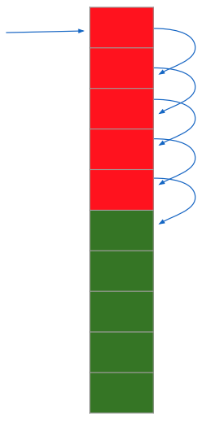Met $h$ de hashfunctie en $s$ de sleutel. Als onze sleutel niet gevonden wordt op plaats $h(s)$, gaan we simpelweg **een plaats verder** in de lijst en kijken daar. Aangezien $m$ de grootte van onze tabel is, komen we na het laatste element terug bij het begin uit. Het voordeel aan deze methode is de eenvoud, maar er doet zich **primaire clustering** voor. Om het simpel te beschrijven. Als we een collision hebben, gaan we dus ons element op de volgende plaats in de tabel zetten. Nu is er twee keer zo veel kans dat er zich een collision voordoet. En als deze zich voordoet, wordt het element weer achteraan dit blok gezet. Er ontstaan dus blokken van elementen die de performantie benadelen omdat we elke keer het hele blok moeten doorzoeken om de juiste sleutel te vinden. 


* **Kwadratisch testen** (quadratic probing)

$$
(h(s)+ c_1i+c_2i^2)\bmod m \quad \text{ voor } i=0, \cdots, m-1
$$

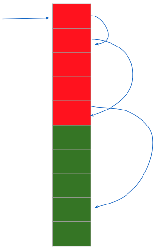Het principe hij is hetzelfde als bij de vorige methode, enkel gaan we iets grotere sprongen maken. $c_1$ en $c_2$ zijn hier constanten verschillend van nul. We moeten er wel voor zorgen dat de constanten en tabelgrootte  $m$ aan bepaalde voorwaarden voldoen zodat de functie nog steeds uiteindelijk alle elementen van de tabel overloopt. Bij kwadratisch testen heb je geen last van primaire clustering, maar doet zich wel een een lichtere veriant voor, genaamd **secundaire clustering**. Verdere uitleg acht ik hier overbodig. Je kan er je hopelijk wel iets bij voorstellen aan de hand van de tekening.


## H7 - Binary Search Trees


## H8 - External data structures


## Mogelijke examenvragen

1. Wat zijn de verschillende technieken om collisions op te vangen bij hashtabellen?
2. Toon aan dat bij een binaire zoekboom de voorloper van een knoop met twee kinderen geen rechterkind heeft.
3. Gegeven een zekere toepassing, welke datastructuur zou je gebruiken? Wat zijn de nadelen?
4. Gegeven een binaire zoekboom, voeg een element toe, verwijder een element, geef een mogelijke toevoegvolgorde die in deze boom resulteert.


### Vragen van vorig jaar

1. Vraag over hashtables waarbij dat je moet toevoegen, verwijderen en rehashen
2. Een vraag waarbij je de 1000 grootste elementen moet gaan opslaan in een datastructuur (heap was hier het beste blijkbaar)
3. Uitleggen wat threaded trees zijn en hoe je moet toevoegen/verwijderen
4. Bewijs dat het verdubbelen van een array geamortiseerd O(1) is


### Voorgaande jaren

2019 en ouder, dus ik weet nog niet of we alles hiervan moeten kennen.

1. Bespreek toevoegen van sleutels bij binaire zoekbomen, en ook bij 'threaded trees'. Wat is de efficiëntie van deze operatie, als de bomen n knopen bevatten? Verklaar (zonder bewijs)
2. Binaire bomen overlopen hoe? En efficiëntie en verband boom en bin boom
3. methodes van open adressering bespreken + performantie (zonder berekening)
4. leg uit "zoeken in een gesorteerde tabel" en wat is de efficiëntie van dit algoritme
5. Leg uit wat een selectieboom is. performantie van toevoegen, verwijderen enz.. En een implementatievoorbeeld.
6. Wat zijn threaded trees? Welke operaties kan men er efficiënt mee uitvoeren? Bijvraag: Is het niet onefficïent dat je al die pointers naar de juiste plaats moet laten wijzen? Antwoord: nee, dit kan gebeuren tijdens de constructie in O(1), dit staat blijkbaar zo in de cursus
7. Bespreek verwijderen van sleutels bij binaire zoekbomen en threaded trees. Efficientie als boom n gegevens bevat. Verklaar.
8. In detail hashtabellen met chaining uitleggen Bijvraag: Er is een andere soort chaining en wat kan je er me over zeggen?
9. Leg de minst efficiënte methode om een heap op te bouwen uit. En geef zijn efficiëntie. 
10. hoe verwijder je een element uit bin. zoekboom en threaded boom? Geef performantie.
11. Bespreek de performantie van open adressering bij hashing.
12. Bespreek performantie van open adressering. (dus ook uitleggen wat dit is, waar dit gebruikt wordt en welke vormen er zijn)
13. Binaire bomen overlopen hoe? Implementatie en efficiëntie en verband boom en bin boom
14. Bespreek de performantie van zoeken in binaire zoekbomen
15. Hoe kan je binaire bomen systematisch overlopen? Hoe wordt dit geïmplementeerd? Wat is de performantie? Wat is de link tussen algemene bomen overlopen en hun binair equivalent?
16. Hoe zoeken in geordende tabellen + efficiëntie
17. Bespreek de performantie van zoeken bij een gerangschikte tabel, zo uitgebreid mogelijk
18. Bespreek hashfuncties zo uitgebreid mogelijk. (Vaste hashfuncties: hashfamilies, wat bij strings groter dan processorwoord? optimalisatie daarvan)
19. Geef de performantie van open adresseren van Hashtabellen. De 3 manieren van testenvergelijken.
20. Heap als prioriteitswachtrij, wat zijn de operaties en verklaar de performantie 
21. Wat zijn threaded trees, bespreek in detail de operaties die ze ondersteuen. Wat is hun performantie.


### 2018

1. Wat is de performantie van de selectie operatie in beste en slechtste geval? (voor elke implementatie afhankelijk van grootte van k, formules bij implementatie van quicksort kunnen opstellen)
2. Bespreek het algoritme van Dijkstra. Wat is de efficiëntie?
3. Bespreek hashfuncties zo uitgebreid mogelijk. (Vaste hashfuncties: hashfamilies, wat bij strings groter dan processorwoord? optimalisatie daarvan)
4. Bespreek mergesort zo uitgebreid mogelijk, verklaar ook de performantie (geen bewijs)
5. Bespreek de performantie van zoeken in binaire zoekbomen
6. Bespreek diepte-eerst zoeken in een graaf (zowel ongericht als gericht), Welke verbindingen zijn er? Verklaar de performantie. Waar wordt het gebruikt (geen details)?
