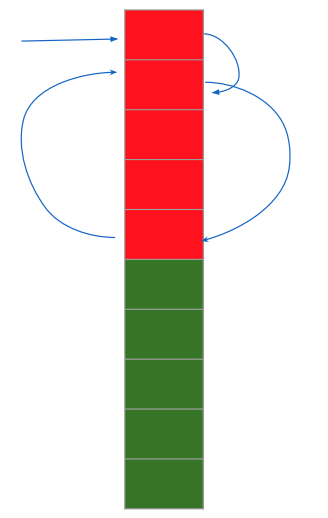
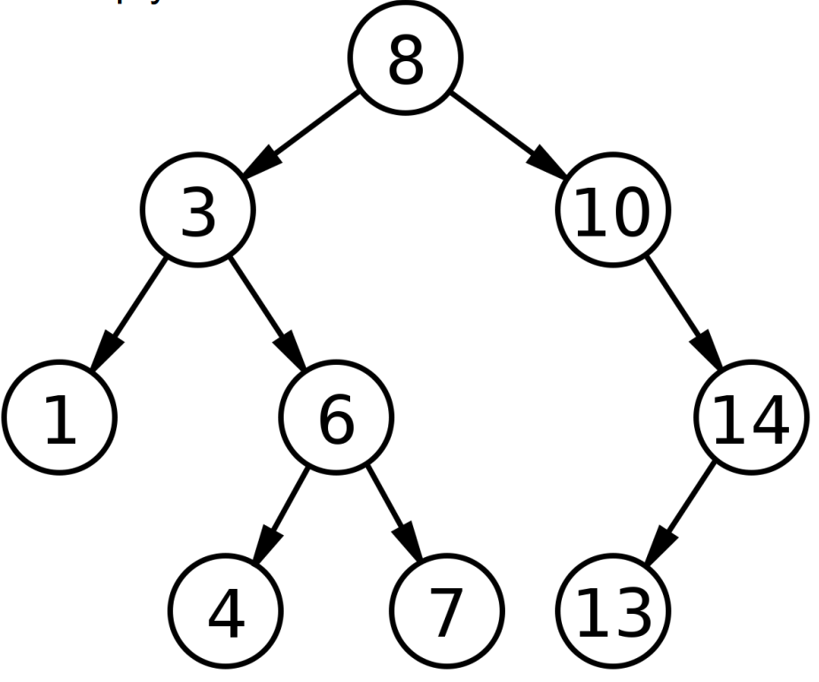
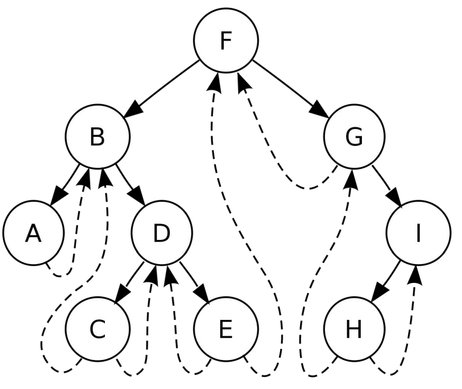
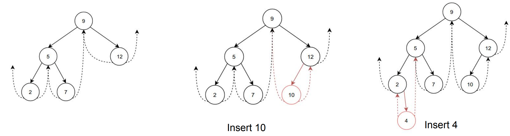
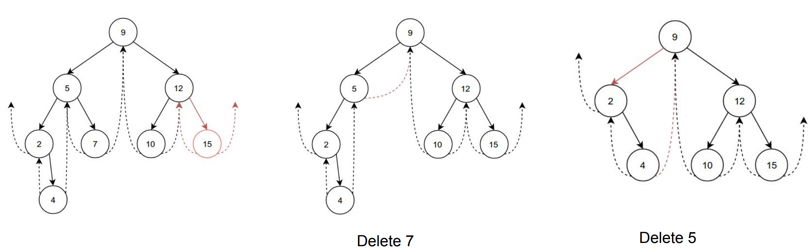
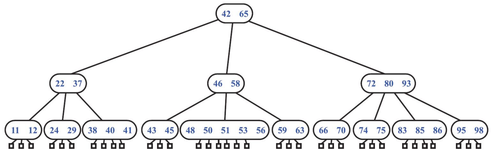
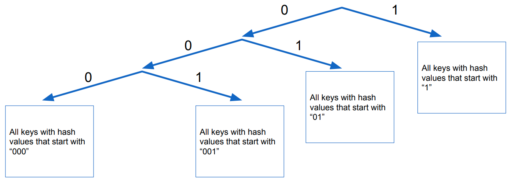
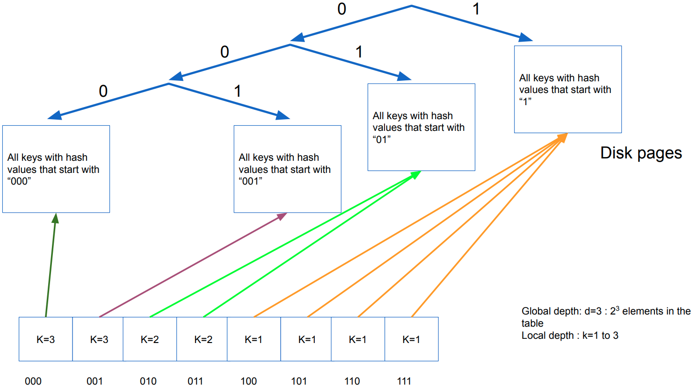
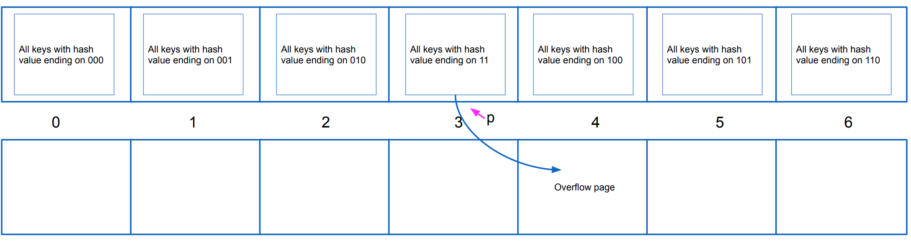

# Gegevensstructuren

Onderwerpen uit de slides aangevuld met knowledge uit het boek (als je 70 paginas een boek kunt noemen).

Oke kleine heads-up, op de slides over het examen staat bij de te kennen leerstof:

> Bewijzen of afleidingen die tijdens de les uitgewerkt zijn.

tering

## H1 - Onderwerp en doel

We defineren enkele termen die ons helpen onderscheid te maken tussen verschillende datastructuren

* Containers en woordenboeken

Bij een **container** speelt de sleutel van de gegevens geen rol. Gevens in een container kunnen ofwel opgevraagd worden in een bepaalde volgorde (toevoegvolgorde, prioriteit) of op basis van hun plaats in de structuur. **Woordenboeken** daarentegen ondersteunen operaties zoals zoeken, toevoegen en verwijderen. Woordenboeken laten ook vaak operaties toe die de volgorde van de sleutels gebruiken, op voorwaarde dat er op de één of andere manier een rangorde toegekend wordt aan iedere sleutel.

* Continue en gelinkte datastructuren

Dit slaat op de layout van de datastructuur in het geheugen. Wanneer de data in een continue regio in het geheugen opgeslagen wordt, dan spreken we van een **continue datastructuur**. Denk aan arrays, hashmaps en heaps. Dit soort datastructuur maakt hevig gebruik van ruimtelijke lokaliteit. Spijtig genoeg moet de grootte van deze structuren meestal op voorhand vastgelegd worden. Elk element van een **gelinkte datastructuur** bevat een pointer naar zijn opvolger. Hierdoor hoeven we de grootte van de structuur niet op voorhand vast te leggen.

* Lineaire en niet-lineaire datastructuren

Een andere manier van onderscheid te maken. **Lineaire datastructuren** kunnen grafisch weergegeven worden op een as. Bij **niet-lineaire gegevensstructuren** zoals bomen of grafen is echter een voorstelling in meerdere dimensies nodig.


## H2 - Efficientie van algoritmen

Aangezien het onbegonnen werk is rekening te houden met elke processorarchitectuur, programmeertaal en compiler om de efficiëntie van een algoritme te bepalen, is de exacte tijdsduur van een algoritme berekenen praktisch onmogelijk. We bepalen een schatting van de uitvoeringstijd louter op basis van het algoritme en op $n$ (het aantal gegevens). We beperken on tot drie gevallen:

* **Beste geval** (best-case running time)
  * Niet echt super nuttig. Als we de performantie van een sorteeralgoritme testen is het een beetje nutteloos om te gaan kijken hoe goed het omgaat met al gesorteerde gegevens. 
* **Slechtste geval** (worst-case running time)
  * Het slechtste geval is meestal het belangrijkste. Omdat we weten dat het algoritme gegarandeerd **nooit slechter** zal presteren.
* **Gemiddeld geval** (average-case) running time
  * Is moeilijk te bepalen. Bovendien is de definitie van gemiddeld een beetje vaag. Om dit soort analyse mogelijk te maken moeten er vaak een aantal onrealistische veronderstellingen gemaakt worden.
  * Klein leuk feitje. Als de gemiddelde performantie van een algoritme zeer goed is, maar het slechtste geval vreselijk slecht, dan spreken we van een *Las Vegas* algoritme. Want we nemen het risico.

### Insertion sort

We bepalen als voorbeeld de uitvoeringstijd van `insertion_sort`

```c++
void insertion_sort(vector<T>& v) {
// Stijgend rangschikken
  for(int i = 1 ; i < v.size(); i++) {
  // De eerste i getallen staan reeds in volgorde
    T h = move(v[i]);
    int j = i − 1;
    while (j >= 0 && h < v[j]) {
      v [j + 1] = move(v[j]) ;
      j−−;
    }
    v[j + 1] = move(h) ;
  }
}
```

We splitsen de code op in primitieve operaties en kijken hoe vaak elke operatie wordt uitgevoerd:


In het best-case scenario wordt de while-loop dus nooit uitgevoerd. Dit is als ge gegevens in de vector al stijgend gerangschikt zijn. Het slechtste doet zich voor als de vector dalend gerangschikt is, dan zal de while-loop telkens $i$ keer herhaald worden. Je kan dit nu voorstellen als een veelterm van de tweede graad. Kijk maar in de cursus ;) 

 

### Asymptotische benadering

We kunnen de uitvoeringstijd van een algoritme op 3 manieren asymptotisch benaderen. In de tekeningen is $f(n)$ de looptijd van ons algoritme en $g(n)$ een arbitraire functie.

| Asymtotische bovengrens                                      | Asymptotische ondergrens                                     | Asymptotische boven- en ondergrens                           |
| ------------------------------------------------------------ | ------------------------------------------------------------ | ------------------------------------------------------------ |
|   |   |   |
| We weten dat voor een grote $n$ de uitvoeringstijd niet sneller zal stijgen dan een bepaalde functie. $O(g(n))$ | We weten dat de uitvoeringstijd minstens zo snel zal stijgen als een bepaalde functie. $\Omega(g(n))$ | Wanneer dezelfde functie zowel een boven als ondergrens voor $f(n)$ vormt. $\Theta(g(n))$ |


### P en NP

Men defineert defineert de verzameling P als alle problemen die oplosbaar zijn in polynomiale tijd. Dus in $O(n^\alpha)$. Problemen waarbij dit niet mogelijk (of alvast nog niet bekend) is, noemen we NP (Nondeterministic Polynomial). Een groot vraagteken is of P en NP gelijk zijn (dus dat alle problemen zouden kunnen opgelost worden in polynomiale tijd). Moest je dit kunnen aantonen kun je blijkbaar 1000 000\$ winnen. Voorlopig gaan we er van uit dat $P \neq NP$.


### Andere criteria

De asymptotische benadering van de uitvoeringstijd is natuurlijk niet het enige belangrijke maatstaf bij de beoordeling van een algoritme. We leven in de echt wereld en moeten rekening houden met een aantal andere zaken:

* Kost van implementeren en testen
* De asymptotische benadering is een *benadering*
  * Constante factoren spelen geen rol in deze benadering, maar in de praktijk wel. In de realiteit zijn twee $O(n)$ algoritmen niet speciaal even snel
  * De benaderingen gelden alleen voor vodoende grote $n$. Soms is een 'slecht' algoritme dus beter voor kleine bewerkingen.
  * Soms is de benadering in het slechtste geval *te slecht* en kan het ons een vertekend beeld geven.
  * We veronderstellen dat elke input even waarschijnlijk is, maar in de realiteit kan je vaak met voorkennis over de data een algoritme een stuk efficiënter maken.
* Soms gebruiken algoritmen te veel geheugen, wat hun voordeel in uitvoeringstijd tenietdoet omdat het geheugen van de computer te klein is.
* Algoritmen kunnen verbazinwekkend verschillende performantie hebben door de geheugenhiërarchie van de computer. Denk aan lokaliteit en caches.
* Parallelle verwerking kan de werktijd van ons algoritme versnellen. Als het aantal verwerkingseenheden samen groeit met $n$ bijvoorbeeld. Denk aan routers in een netwerk.
* Toegang tot het geheugen is een relatief trage operatie. Agoritmen die veel in het geheugen zitten zijn doorgaans trager.

## H3 - Containers

In het eerste hoofdstuk legde ik je het verschil uit tussen een container en een woordenboek. Nu focussen we ons nu dus even op containers. 


### Tabel

Omdat computers nu eenmaal zo werken, moeten we als we gegevens in een tabel (array) opslaan, op voorhand weten hoe groot deze moet zijn. Dit probleem kunnen we (tot kost van de performantie) door een nieuwe tabel te maken wanneer de huidige te klein is. Gewoonlijk maakt men wanneer de array te klein is een nieuwe van twee maal de grootte. De geamorticeerde efficiëntie van deze operatie is nog steeds $0(1)$ aangezien de kost om $n$ elementen $3n$ bedraagt. Zie hieronder voor een beetje meer info. Ik weet nog niet goed of we dit echt moeten kunnen aantonen. Oke het is vorig jaar gevraagd blijkbaar.

**Operaties**

| Operatie                              | Cost             |
| ------------------------------------- | ---------------- |
| Element opvragen                      | $O(1)$           |
| Toevoegen (als we genoeg plek hebben) | $O(1)$           |
| n elementen toevoegen                 | $3n$ (gemiddeld) |

#### Geamorticeerde efficiëntie

> **Amortized efficiency** is a very important concept: instead of looking at a single operation, we look at a sequence of operations and calculate the average efficiency. This is commonly used when an single operation could be slow in some rare situations

Oké, hoe bewijzen we nu dat de geamorticeerde efficiëntie van een element toevoegen aan een dymanische tabel nog steeds gelijk is aan $0(1)$. 
$$
\sum_{i=1}^n t_i = n + \sum_{j=0}^{\lceil log(n)\rceil - 1}2^j < n + 2n = 3n
$$

Met $t_i$ bedoelen we de tijd om de $i$-de toevoegoperatie uit te voeren. $\sum_{i=1}^n t_i$ is dus de tijd die $n$ toevoegoperaties in beslag nemen. We kunnen deze opsplitsen in 2 gevallen:

* De array is niet vol: de operatie duurt '1' lang. Voor $n$ operaties duurt het dus $n$ lang.
* De array is vol: er staan $i-1$ elementen in de array. Dan verdubbelen we de grootte van de array. Dit moeten we dus elke keer als het aantal elementen in de array een macht van twee is doen. Van daar de :$\sum_{j=0}^{\lceil log(n)\rceil - 1}2^j$ (dit is een meetkundige reeks)

Wikipedia:

> For ${\displaystyle r\neq 1}$, the sum of the first *n*+1 terms of a geometric series, up to and including the *r* n term, is:

$$
{\displaystyle a+ar+ar^{2}+ar^{3}+\cdots +ar^{n}=\sum _{k=0}^{n}ar^{k}=a\left({\frac {1-r^{n+1}}{1-r}}\right),}
$$

Als ik het vorige ding invul in de formule krijg ik $n-1$ als antwoord, maar dat komt waarschijnlijk omdat ik geen rekening heb gehouden met die ceil (dit ding $\lceil \rceil$) bij de $log(n)$. In ieder geval, $\sum_{j=0}^{\lceil log(n)\rceil - 1}2^j$ is een meetkundige reeks en we weten dat zijn som zeker kleiner is dan $2n$. 

### Linked List

Bij een gelinkte lijst is elk element toegankelijk, maar niet direct toegankelijk. Als we een bepaald element zoeken, zullen we altijd vanaf de eerste knoop moeten beginnen en de pointer naar zijn opvolger volgen. We hebben natuulijk ook dubbel gelinkte lijsten, maar dat verhaal ken je hopelijk al.

**Operaties**

| Operatie                                 | Cost   |
| ---------------------------------------- | ------ |
| Eerste element opvragen                  | $O(1)$ |
| Element verwijderen (dat al gevonden is) | $O(1)$ |
| Element opvragen                         | $O(n)$ |


### Stack

Je kan een stapel implementeren gebruik makende van een tabel, dan heb je wel een stack pointer nodig omdat je de grootte van je tabel niet zomaar bij elke operatie kan gaan zitten aanpassen. Een element verwijderen is dan gewoon je stack pointer een plaatsje terugschuiven. 

Je kan een stack ook perfect implementeren met een gelinkte lijst. Alle operaties blijven dan nog steeds $O(1)$. Bovendien kan je stapel dan ook niet zomaar vol zijn zoals bij een array.

Een stack wordt zeer vaak gebruikt en is handig om gegevens bij te houden waarvoor de volgorde van verwijderen onbelangrijk is.

**Operaties**

| Operatie                         | Cost   |
| -------------------------------- | ------ |
| Toevoegen (Push)                 | $O(1)$ |
| Verwijderen (Pop)                | $O(1)$ |
| Testen of hij leeg is            | $O(1)$ |
| Bovenste gegeven opvragen (peek) | $O(1)$ |

Een stack werkt volgens het first in last out principe.

### Queue

Simpelweg een stack met twee pointers. Als we herhaaldelijk elementen toevoegen en verwijderen komen we bij een tabelgebaseerde implementatie wel lichtjes in de problemen. Onze queue schuift dan telkens verder naar het einde van de tabel en zal deze ook snel bereiken. Dit kunnen we oplossen door een ringvormige tabel te gebruiken. Dit betekent simpelweg dat als we de index van het laatste element van de tabel bereiken, de volgende toevoegings- of verwijderingsoperatie we terug uitkomen bij de eerste.

Het is natuulijk ook weer mogelijk om een gelinkte lijst te gebruiken voor de implementatie voor je queue. Dan moet je simpelweg een extra pointer naar het laatste element bijhouden. Als je ook langs de achterkant van de queue elementen wilt verwijderen zal je een dubbelgelinkte lijst nodig hebben.

**Operaties**

| Operatie              | Cost   |
| --------------------- | ------ |
| Toevoegen             | $O(1)$ |
| Verwijderen           | $O(1)$ |
| Testen of hij leeg is | $O(1)$ |

Een queue werkt volgens het first in first out principe.

### Deque

Indien je het nog niet wist. Deque staat voor *double ended queue*. Een deque is een combinatie van een stack en een queue. Je kan nu vanvoor en vanachter elementen toevoegen of verwijderen.

**Operaties**

| Operatie                                       | Cost   |
| ---------------------------------------------- | ------ |
| Toevoegen                                      | $O(1)$ |
| Verwijderen                                    | $O(1)$ |
| Het boeit eigenlijk niet, alles is toch $O(1)$ |        |


### Boom


We defineren een boom simpelweg als een verzameling van **knopen** (nodes of vertices) en **takken** (edges) waarmee de knopen aan elkaar verbonden zijn. De takken hebben geen bepaalde richting, daarenboven is het belangrijk dat er geen lussen mogen bestaan. Een boom heeft ook niet noodzakelijk een wortel.

Verder verklaren zal ik nog enkele termen verduidelijken om de rest van dit onderdeel een beetje verstaanbaarder te maken:

* **Wortel**: het bovenste bolletje, de knoop zonder ouders.
* **Blad**: Eén van de onderste bolletjes. Een knoop zonder kinderen.
* **Deelboom**: je kan elke knoop van een boom zien als een wortel van een nieuwe boom, dit is een deelboom van onze boom
* **Diepte** van een knoop: het aantal takken tussen deze knoop en de wortel.
* **Hoogte** van een knoop: lengte van de langste weg van deze knoop tot een blad.
* **Graad**: het aantal kinderen van een knoop

We focussen ons vooral op binaire bomen, waar elke knoop twee kinderen kan hebben. Er zijn ook andere bomen, maar daar zal ik verder op ingaan moest dat nodig zijn verder in de cursus (niet dus).


#### Voorstelling

Je kan als het aantal knopen vastligt, een boom opslaan in een tabel. Meestal zijn bomen dynamische structuren, dus gaan we gebruik maken van pointers. Een binaire boom heeft typisch naar ieder van zijn kinderen een pointer. Als een boom geen kinderen of maar een deel van het mogelijke kinderen heeft, zullen deze voorgesteld worden door *nullpointers*. Verder kan je ook als er veel kinderen onbreken de knopen in de boom bijvoorbeeld pointers geven naar zijn ouders om sommige algoritmes sneller te maken.

Als we een boom met een variërend aantal gevens willen opslaan, kunnen we best elke knoop een gelinkte lijst van zijn kinderen laten bijhouden. Dit heeft als gevolg dat elke knoop een wijzer bevat naar zijn kind en een wijzer naar zijn rechterbuur. Probeer het je even voor te stellen. De desbetreffende knoop zit in de lijst van zijn ouder, en in een gelinkte lijst duidt elk element zijn opvolger aan. Dus heeft elke knoop ook een wijzer naar zijn rechterbuur.


#### Systematisch overlopen van bomen


Bij tabellen kunnen we gemakkelijk sequentieel alle gegevens in volgorde uitlezen. Spijtig genoeg is dat niet zo simpel bij bomen. De manier waarop we een boom doorlopen hangt af van hoe wij beslissen om de boom te doorlopen. We maken onderscheid tussen drie mogelijke manieren:

* **Depth first**: 
  
  We bekijken de wortel en gaan telkens recursief verder naar beneden. Deze omschijving is een beetje vaag, aangezien er verschillende mogelijkheden zijn. Kijk gewoon naar de naam. We gaan dus altijd direct diep in de boom gaan bij deze manier. We hebben dus een aantal recusief gedefineerde manieren om een boom depth first te doorlopen:
  
  * Pre-order: wortel - linkse deelboom - rechtse deelboom (Polish notation)
    * {1, 2, 4, 5, 8, 9, 3, 6, 7, 10, 11} (bij de boom hierboven)
  * In-order: linkse deelboom - wortel - rechtse deelboom
    * {4, 2, 8, 5, 9, 1, 6, 3, 10, 11, 7}
  * Reverse in-order: rechter deelboom - wortel - linkse deelboom (zegt de cursus precies niks over)
  * Post-order: linkse deelboom - rechtse deelboom - wortel  (Reverse polish notation)
    * {4, 8, 9, 5, 2, 6, 11, 10, 7, 3, 1}
    * Is nuttig op een stack machine blijkbaar
  
* **Breadth-first**: op een gegeven niveau lezen we eerst alle knopen op dat niveau alvorens dieper te gaan. Deze methode maakt geen gebruik van de recusieve eigenschap van de boom. 

* **Best first**: We kennen een bepaalde prioriteit toe aan de kinderen (e.g. Monte Carlo tree search)


### Graaf


Een graaf bestaat uit **knopen** (vertices) en **verbindingen** (edges). De knopen stellen objecten voor waartussen verbindingen kunnen bestaan. Meestal mag er maar één verbinding zijn tussen twee knopen. Is dit niet het geval, spreken we van een **multigraaf** hier is het ook toegestaan dat knopen een verbinding hebben met zichzelf. Als verbindingen een bepaalde richting hebben, spreken we van een **gerichte graaf**. Bij een ongerichte graaf stelt de **graad** van een knoop het aantal buren van die knoop voor. Bij gerichte grafen spreken we van een in- en uitgraad. Waarbij de ingraad dan het aantal inkomende verbindingen is en de uitgraad het aantal puisten op de reet van uw moeder.

We kunnen grafen in een computer op twee manieren voorstellen:

**Adjacency matrix** (burenmatrix): een N x N matrix waarbij het gewicht van de verbinding tussen 2 nodes op plaats [node1, node2] staat. Deze manier is zeer efficiënt om snel te testen of er een verbinding bestaat tussen twee knopen, maar neemt spijtig genoeg snel veel geheugen in beslag. We gebruikten deze manier dus best om een *dichte graaf*, met relatief veel verbindingen voor te stellen. Bij een ongerichte graaf komt elke verbinding twee keer voor in de matrix.

**Adjacency lists ** (burenlijsten): Voor elke node houden we een lijst met zijn buren bij. Dit is efficienter voor grafen met weinig verbindingen.


## H4 - Priority queues

Priority queue = een queue die elementen teruggeeft op basis van hun prioriteit.

Soms willen we de elementen in een wachtrij niet behandelen volgens de volgorde dat ze erin zijn beland, maar volgens een prioriteit die wij ze toekennen. We kunnen dit op 2 manieren:

* **Gerangschikte tabel**: we rangschikken de gegevens volgens prioriteit. Dan wordt het element met de hoogste prioriteit verwijderen $O(1)$ en een element toevoegen $O(n)$
* **Ongeordende tabel**: Dan wordt toevoegen $O(1)$ en het element met de hoogste prioriteit verwijderen $O(n)$, want we moeten elke keer de hele tabel doorzoeken om hem te vinden.

Er bestaat ook een compromis tussen deze twee. Een (binaire) heap. Ik zal je iets verder naar beneden laten zien dat zowel toevoegen als verwijderen dan in $O(\log n)$ tijd kan gebeuren.


### Heap

Een heap is een boomstructuur die door zijn regelmatige vorm gemakkelijk in een tabel opgeslagen kan worden. Een heap is een **complete binaire boom**, waarvan de elementen voldoen aan de **heap-voorwaarde**\*. Alle niveaus, behalve dan eventueel de laatste zijn volledig gevuld. Op het laatste niveau moet dan ook het kind aan de linkerkant zitten.

Zoals je ziet maakt een heap het gemakkelijk om snel het grootste (of het kleinste) element op te vragen.


> *Heap-voorwaarde
>
> **Max heap**: the value of the parent is larger than (or equal to) the value of the children 
>
> **Min heap**: the value of the parent is smaller than (or equal to) the value of the children

Op een volledig gevuld niveau $i$ zijn er  $2^i$ knopen. Een volledig gevulde boom met hoogte $h$ heeft dan:
$$
\sum_{i=0}^h 2^i = 2^{h+1} - 1
$$
knopen. Omdat het laatste niveau niet noodzakelijk is gevult zal $n$ liggen tussen:
$$
2^{h} - 1 <n\leq 2^{h+1} - 1 \\
2^{h} <n\leq 2^{h+1} 
$$
Als we dan het logaritme nemen van bijde kanten, krijgen we $h =  \lfloor log(n) \rfloor$

Omdat een heap zo regelmatig is kunnen we die gewoon in een array steken:

* De ouder van $i$ vinden we terug op $\lfloor (i-1)/2 \rfloor$ 
* De kinderen van $i$ vinden we terug op: $2i+1$ en $2i+2$

Er zijn ook $d$-heaps. Is dit belangrijk? //TODO


#### Bewerkingen op heaps

| Bewerking                                    | Beschrijving                                                 | Tijdscomplexiteit |
| -------------------------------------------- | ------------------------------------------------------------ | ----------------- |
| Element toevoegen                            | Achteraan op de heap toevoegen, en daarna het element omhoog laten komen tot het op een juiste plek staat (*bubble up*). In het slechtste geval moet hij helemaal tot bovenaan. | $O(log(n))$       |
| Root node vervangen                          | Als dan de heap voorwaarde niet is voldaan zal hij omlaag moeten zakken totdat hij juist staat. In het slechtste geval helemaal tot onderaan (*bubble down*) | $O(log(n))$       |
| Root node verwijderen                        | Om de heap compleet te houden zetten we dan het laatste element vooraan en doen we een bubble down. | $O(log(n))$       |
| Element van een willekeurige knoop vervangen | Als het nieuwe element de heapwoorwaarde verstoort, zal hij naar onder of naar boven moeten bubbelen. | $O(log(n))$       |


#### Constructie van een heap (met bewijzen)

We kunnen een heap op twee manieren opbouwen. Aan de ene kant door gewoon elementen blijven toe te voegen, of door verschillende deelheaps samen te voegen. Je kan misschien al raden dat de tweede manier efficiënter is.

**Heap bouwen door elementen toe te voegen**

Oké we kunnen gemakkelijk beredeneren dat $n$ elementen toevoegen aan een heap $T(n)$ kost. We moeten voor de eerste twee toevoegingen maximaal 1 tje omhoog bubbelen. Voor de volgende 4 moeten we in het slechtste geval 2 keer omhoog bubbelen. Enzovoort...
$$
T(n) \leq \sum_{i=0}^h 2^i.i \text{ (dit stond om de een of andere reden niet in de cursus)} \\ 
T(n) \leq 2.1 + 4.2 + 8.3 + \cdots + 2^{h-2}(h-2) + 2^{h-1}(h-1) + 2^{h}(h) \\
2T(n) \leq 4.1 + 8.2 + 16.3 + \cdots + 2^{h-1}(h-2)  + 2^{h}(h-1) + 2^{h+1}(h)
$$
Als we nu de eerste van de tweede aftrekken, maar begin niet van het begin. Doe het zo:
$$
\quad\quad\quad\quad\quad\quad\quad\quad\space
2T(n) = 4.1 + 8.2 + 16.3 + \cdots + 2^{h-1}(h-2)  + 2^{h}(h-1) + 2^{h+1}(h)\\
T(n) = 2.1 + 4.2 + 8.3 + 16.4+ \cdots  + 2^{h-1}(h-1) + 2^{h}(h) \\
\quad\quad\quad
2T(n) - T(n) = -2\space\space-4\space\space-8\space\space-16- \space\space\cdots\space\space -2^{h-1}\quad \quad\quad- 2^h + 2^{h+1}.h
\quad\quad\quad\quad\space
\\
$$
De termen van $-2$ tot $-2^h$ vormen (als we vanvoor een $-1$ toevoegen) een meetkundige reeks: $\sum_{i=0}^h 2^i = 2^{h+1} -1$. 
$$
2T(n) - T(n) = 1 -( 1+2+4+8+16+ \cdots +2^{h-1} + 2^h) + 2^{h+1}.h
$$

$$
T(n) = 2T(n) - T(n) \leq 1 -(2^{h+1}-1) + 2^{h+1}.h
\\ 
T(n) = 2T(n) - T(n) \leq 2 + 2^{h+1}(h-1)
$$

We weten dat $2^h \leq n < 2^{h+1}$, onthoud dat $h$ de hoogte is en $n$ het aantal elementen. Dan kunnen we de log nemen van het vorige en komen we dit uit:
$$
T(n) \leq 2 + 2n\log_2 n
$$
Een heap opbouwen door middel van elementen toevoegen is dus $O(n\log n)$

**Heap opbouwen door kleinere heaps samen te voegen**

In de plaats van de elementen één voor één toe te voegen, gaan we kleinere heaps maken en ze samenvoegen. In theorie toch. Data in een array kunnen we eigenlijk direct voorstellen als een heap, deze is alleen nog niet gesorteerd. We bekijken dan beginnend van vanonder elke deelheap.

Hoe doen we dat dan:


We kijken ter illustratie naar de afbeelding. Stel je voor dat hij nu niet zou voldoen aan de heapvoorwaarde. Of nee, laten we zeggen dat we van deze data een min heap willen maken.

* We beginnen helemaal onderaan. Bekijk de deelheap (17,2,7). Om deze juist te zetten moeten we enkel 17 en 7 van plaats wisselen.
* Nu gaan we en niveau hoger (naar 19). Nu moeten we weeral enkel de wortel naar beneden laten bubbelen. 
* Je moet dus niet elke heer heel de boom doorlopen.

Het aantal operaties die je nu moet uitvoeren bedraagt.
$$
T(n) = \sum_{i=0}^h 2^i(h-i) \\
$$
Dit komt doordat er op elk niveau $2^i$ elementen zijn. Elk element moet dan hoogstens $h-i$ plaatsen zakken om op de juiste plek terecht te komen. Op het zicht lijkt dit $O(n \log n)$, maar als we een gelijkaardige strategie als bij het vorige onderdeel toepassen, kunnen we het tegendeel aantonen:
$$
\quad\quad\quad\quad\quad\quad\quad2T(n) = 2h + 4(h-1) + 8(h-2) + \cdots + 2.2^{h-1}+ 2^{h} \\
T(n) = h + 2(h-1) + 4(h-2) +8(h-3) + \cdots + 2^{h-1} \\
T(n) = -h + 2 +4+8+\cdots + 2^{h-1} + 2^h \\
T(n) = -h - 1 + (1 + 2 +4+8+\cdots + 2^{h-1} + 2^h)\\
T(n) = -h-1 + 2^{h+1} - 1
$$
We weten dat $h = \log n$, dus $T(n) = O(n)$

### Merging heaps

Soms willen we twee heaps samenvoegen. Sommige andere soorten heaps zijn hier goed in. Hieronder ga ik in detail over coole datastructuren die merge-operaties vergemakkelijken.


#### Binomial queue

= een bos van **binomial trees**

Een binomiaalboom wordt gekenmerkt door zijn hoogte. Voor elke hoogte is er maar 1 binomiaalboom. Deze bestaat uit 2 bomen van de vorm van één niveau lager. Ik heb mijn artistieke skills bovengehaald om het even te verduidelijken op de tekening. Ik vind het wel een beetje dom dat ze het onnodig achtten er een boom van niveau 1 bij te zetten in de slides. De tweede boom is dus steeds het meest linkse kind van de eerste deelboom.


We kunnen een prioriteitswachtrij dus voorstellen door een bos van binomiaalbomen, waarvan er van elk niveau hoogstens eentje is (want als er 2 zijn kunnen we ze samenvoegen.)

Bij $n$ elementen zijn er dus $log(n)$ bomen nodig, deze bomen volgen allemaal de heap-eigenschap.

##### Operaties

| Operatie                      | Beschrijving                                                 | Tijdscomplexiteit |
| ----------------------------- | ------------------------------------------------------------ | ----------------- |
| Minimum/maximum vinden        | Dan moet je alle rootknopen van de bomen vergelijken. Er zijn $log(n)$ bomen, dus $log(n)$ rootknopen. Als we de plaats van het minimum onthouden kunnen we er ook $O(1)$ van maken. | $O(\log n)$       |
| 2 bomen samenvoegen           | Die met de kleinste root kind maken van die met de grootste root. (zie hieronder) | $O(1)$            |
| 2 binomial queues samenvoegen | Omdat er $\log n$ bomen zijn.                                | $O(\log n)$       |
| Prioriteit verminderen*       | Naar de wortel toe bewegen                                   | $O(\log n)$       |
| Verwijderen*                  | Prioriteit verminderen en minimum verwijderen combineren.    | $O(\log n)$       |

\* *vereisen beide dat het element eerst gevonden wordt*

Je kan gemakkelijk 2 bomen van dezelfde grootte mergen in 1 operatie (boom met de grootste root links):

 


#### Pairing heap

Een boom die de heap-eigenschap volgt, maar niet speciaal compleet is. We gaan een pariting heap typisch implementeren gebruik makende van pointers. Elke node houdt een pointer bij naar zijn linkerkind en zijn rechterbuur.


##### Operaties

| Operatie                        | Beschrijving                                                 | Tijdscomplexiteit                              |
| ------------------------------- | ------------------------------------------------------------ | ---------------------------------------------- |
| 2 heaps samenvoegen             | Als we 2 pairing heaps mergen, zetten we de boom met de grootste root links en omdat elke node een pointer heeft naar zijn buur, kunnen we gemakkelijk alles verzetten. (zie afbeelding hieronder) | $O(1)$                                         |
| Prioriteit van element verlagen | Splits de boom vanaf dat element. Dit is nu de wortel van zijn eigen boom. Pas de prioriteit aan en merge hem opnieuw in de boom. (dit gaat niet als je de prioriteit moet verlagen, want dan klopt die deelboom op zich niet) | $O(1)$ (indien je het element al had gevonden) |
| Wortel verwijderen              | De boom valt dan uit elkaar in een aantal deelbomen. Deze kan je dan samenvoegen. Als je dom bent voeg je ze dan een voor één toe tot je weer een boom hebt ($O(n)$), maar je kan ze ook eerst per 2 samenvoegen en daarna al deze boompjes samenvoegen. | $O(\log n)$ als je slim bent                   |
| Willekeurige knoop verwijderen  | De deelheap van deze knoop loskoppelen, dan moet je op die deelheap enkel de wortel verwijderen en kan je hem vervolgens terug samenvoegen met de oorspronkelijke heap. | $O(\log n)$                                    |


Heaps zijn nuttig bij discrete event simulation. Maar dat wist je misschien al.


## H5 - Basic dictionaries

Woordenboeken gebruiken sleutels om gegevens te vinden. We willen de slieutels liefst ook op goede plaats zetten om de gegevens snel terug te kunnen vinden. We veronderstellen ook dat de sleutels verschillend zijn.

In dit hoofdstuk houden we ons enkel bezig met lineaire woordenboekstructuren. (met tabellen of gelinkte lijsten)


### Tabel

We steken ons woordenboek dus in een array. Dit kan op verschillende manieren

#### Rechtstreeks addresseerbare tabel

Als we een 1-op-1 verband kunnen vinden tussen de sleutels en indices, hoeven we de sleutels nieteens op te slaan. Dan spreken we van een *directly addressable table*. 

Alle woordenboekoperaties zijn hier $O(1)$. Moet je toch meerdere gegevens per sleutel willen ondersteunen, kan je op de overeenkomstige tabelindex een gelinkte lijst voorzien.

#### Ongeordende tabel

We kunnen een woordenboek opslaan in een niet gerangschikte array.

**Operaties**

| Operatie    | Beschrijving                                                 | Tijdscomplexiteit |
| ----------- | ------------------------------------------------------------ | ----------------- |
| Zoeken      | Alle sleutels moeten sequentieel overlopen worden            | $O(n)$            |
| Toevoegen   | Gewoon achteraan die lijst keilen                            | $O(1)$            |
| Verwijderen | We gaan er van uit dat het element al gevonden is. We vervangen hem gewoon door het element achteraan in de lijst. | $O(1)$            |

#### Tabel geordend volgens zoekkans

We kunnen de performantie verhogen door elementen waarvan we weten dat die vaker gezocht gaan worden vooraan te zetten. De optimale volgorde van de tabel is dan als de sleutels in dalende waarschijnlijkheid gerangschikt zijn. Meestal weten we natuurlijk niet op voorhand welke sleutels vaker gebruikt gaan worden. Hier zijn enkele oplossingen voor.

*  De frequentie bijhouden waarmee elke element wordt gezocht. Dan de gegevens rangschikken volgens dalende frequentie.
* Als een element gevonden wordt, hem verwisselen met zijn voorganger. Elke keer dat je iets opzoekt wordt de tabel dus efficiënter. Het duurt wel even voordat de elementen in een goede volgorde staan, dus dit is een beetje stom als de waarschijnlijkheid verandert met de tijd.

#### Gerangschikte tabel

**Operaties**

| Operatie    | Beschrijving                                                 | Tijdscomplexiteit |
| ----------- | ------------------------------------------------------------ | ----------------- |
| Zoeken      | We kunnen binair zoeken. Als je niet weet wat dat is mag aan mijn hond z'n reet komen likken hij vindt dat heel lekker (vraag me niet waarom ik dat weet). | $O(\log n)$       |
| Toevoegen   | Nadat we de juiste plek voor het element hebben gevonden, moeten we in het slechtste geval heel de tabel opschuiven. | $O(n)$            |
| Verwijderen | Zelfde als toevoegen                                         | $O(n)$            |


### Gelinkte lijst 

We kunnen ook een linked-list als woordenboek gebruiken. Dit gaat weeral op een paar manieren.

#### Ongeordende lijst

**Operaties**

| Operatie    | Beschrijving                                                 | Tijdscomplexiteit |
| ----------- | ------------------------------------------------------------ | ----------------- |
| Zoeken      | We moeten heel de lijst overlopen                            | $O(n)$            |
| Toevoegen   | Gewoon vooraan toevoegen                                     | $O(1)$            |
| Verwijderen | Als we het element gevonden hebben, hem er gewoon tussenuit flikkeren. Bij een gewone gelinkte lijst hebben we wel de voorloper nodig. | $O(1)$            |

#### Lijst geordend volgens zoekkans

We kunnen ook weer de meer gebruikte elementen naar vooraan schuiven. Wat niet kon bij arrays is als een element opgeroepen wordt, hat direct helemaal vooraan te zetten. Dit blijkt in de praktijk toch minder goed te zijn dan de eerste methode.

#### Gerangschikte lijst

**Operaties**

| Operatie    | Beschrijving                                                 | Tijdscomplexiteit |
| ----------- | ------------------------------------------------------------ | ----------------- |
| Zoeken      | We kunnen niet rechtstreeks aan de elementen, dus we moeten toch heel de lijst overlopen om het juiste element te vinden. | $O(n)$            |
| Toevoegen   | Ook weer heel de lijst overlopen om de juiste plek te vinden | $O(n)$            |
| Verwijderen | Zelfde als toevoegen                                         | $O(n)$            |

Een gerangschikte linked-list voor een woordenboek is dus tering nutteloos waarom staat dit zelfs in de cursus.

## H6 - Hash Tables

Ik ga even veronderstellen dat je weet wat een hashfunctie is. We gaan uit onze index een sleutel afleiden door middel van een hashfunctie. Met die index kunnen we dus rechtstreeks ons element uit de tabel halen. Het probleem is natuurlijk een hashfunctie vinden die de sleutels mooi verdeelt over de tabel, zonder conflicten te veroorzaken. Als we de sleutels op voorhand weten, kunnen we naturlijk een hashfunctie maken die een uniek resultaat oplevers voor elke sleutel. Dit is niet mogelijk als we super veel mogelijke sleutels hebben (strings bijvoorbeeld). 

Hoe gaan we dan om met die conflicten? Lees verder en ik zal je verrijken met deze kennis.


### Chaining

Hier volgen een aantal methodes die omgaan met conflicten door middel van gelinkte lijsten. 


#### Separate chaining

We zetten alle sleutels die op dezelfde index terechtkomen in een gelinkte lijst.

**Operaties**

| Operatie    | Beschrijving                                                 | Tijdscomplexiteit |
| ----------- | ------------------------------------------------------------ | ----------------- |
| Zoeken      | In het slechtste geval (wanneer al de elementen in één bucket zitten). Neem $n$, het aantal elementen en $m$ het aantal vakjes. En $\alpha = \frac{n}{m}$. Dan is de gemiddelde zoektijd $\Theta(\alpha +1)$, met 1 de constante tijd die de hashfunctie nodig heeft. Als $m \approx n$, hebben we dus $O(1)$ | $O(1)$            |
| Toevoegen   | Vanvoor toevoegen. (draagt ook bij aan temporale lokaliteit) | $O(1)$            |
| Verwijderen | Aangezien zoeken $O(1)$, gewoon het gevonden element wegyeeten. | $O(1)$            |

We moeten dus gewoon ervoor zorgen dat de grootte van onze hashtabel evenredig is met het aantal opgeslagen sleutels. Als $m$ en $n$ te hard verschillen zullen we dus geen $O(1)$ hebben.


#### Coalesced chaining

Het verschil tussen separate chaining en coalesced chaining is simpel. Bij het vorige kon elke vakje enkel een lijst met elementen bevatten. Coalesced chaining gebruikt daarentegen een **tabel van lijstknopen**. Hij kan hierin niet alleen een waarde opslaan, maar ook een **verwijzing naar een andere element**.


|   |   |   |   |
| ------------------------------------------------------------ | ------------------------------------------------------------ | ------------------------------------------------------------ | ------------------------------------------------------------ |
| We houden op voorhand een pointer bij naar een lege plaats die gebruikt kan worden bij collisions | We voegen A en B toe, er is nog geen collision. Extra zin om de tabel te alignen ik heb autisme. | C heeft dezelfde hash als A, we smijten hem dus op het vrije plekje, verzetten de pointer naar een ander vrij plekje | Plek 9 is al bezet, dus we zetten D op de vrije plek waarnaar de pointer wees. Vak 9 heeft nu ook een pointer naar D. |

In hoeverre ik het begrijp heeft elk vakje in de tabel dus plaats voor een **waarde** en een **pointer**. Als we een element toevoegen en het waarde-vakje op de plek van de hash van dat element is leeg, dan zetten we het element daar. Als er **al een waarde** staat, maar de pointer is leeg, zetten we de **pointer naar een ander leeg vakje** (die pointer wordt zo te zien op voorhand al bijgehouden) en zetten we die waarde erin. Als we een waarde willen toevoegen, maar de plek van de hash **bevat al een waarde en een pointer**, dan **volgen we de pointer**, mogelijks meermaals, totdat we bij een vakje zonder pointer komen en **zetten de pointer** naar het lege vakje daarin. (waarna we dat lege vakje vullen natuurlijk).

Coalesced (samengevoegd volgens google translate) wijst op het feit dat een plaats die opgevuld is bij een collision deel uit kan maken van **verschillende lijsten**. Het grote voordeel aan deze methode is dat we geen knopen dynamisch hoeven aan te maken. 


**Adres- en overflow zone**

Een kleine variant op coalesced chaining maakt gebruik van een **overflow zone**, als er zich een collision voordoet, zal het desbetreffende element hierin geplaatst worden. Als er geen collision is, zal het element in de **adreszone** geplaatst worden. Pas als alle geheugenruimte in de overflowzone is opgebruikt zetten we onze lijsten verder in de adreszone.

**Operaties**

| Operatie    | Beschrijving                                                 | Tijdscomplexiteit |
| ----------- | ------------------------------------------------------------ | ----------------- |
| Zoeken      | Begint in de adreszone. We vertrekken op de plek van de hash van de te zoeken sleutel en volgen de ketting tot we de juiste hebben gevonden of uitkomen op een leeg vakje. | $O(1)$*           |
| Toevoegen   | Heb ik grotendeels uitgelegd. Alleen heb ik niet gezegd hoe de pointer naar de lege plaats bepaald wordt. Meestal wordt **de laatste lege plaats** in de tabel hiervoor gebruikt.  Wordt deze gevult, gaan we omhoog naar de vorige lege plaats. Dit is perfect als we een adres- en overflow zone gebruiken. Bij gewone coalesced chaining gaan hierdoor de laatste knopen snellen opvullen en de lijsten sneller samenklitten. | $O(1)$*           |
| Verwijderen | Verwijderen is moeilijk, dus we gebruiken liefst **lazy deletion**. We markeren simpelweg een element als verwijderd, als er een element op die plaats wilt staan, dan vervangen we het. Dit beïnvloedt de zoektijd wel negatief (door die sleutels die daar voor niks staan). Als we vaak willen verwijderen kunnen we beter separate chaining gebruiken. | $O(1)$*           |

\* *Neem deze met een korrel zout. De worst case kan eigenlijk super slecht zijn. Dit is in de praktijk niet zo omdat we bij een goede verdeling bijna altijd onze sleutel direct vinden*

Het komt erop neer dat coalesced chaing **het snelste** is van alle soorten hashtabellen. Zolang onze grootteverhouding goed ligt toch ($\alpha > 0.6$). 


### Open adressering

In tegenstelling tot coalesced chaining, waar de conflicten worden opgelost met pointers, gaan we bij open addressering de alternatieve plaats voor de sleutel **berekenen**. We ruilen dus plaats voor tijd. We maken geen gebruik van een overflow zone, want de alternatieve plaatsen liggen vast. Het is ook belangrijk om op voorhand een idee te hebben van het aantal gegevens, aangezien ze allemaal in de tabel moeten passen. Onze bezettingsgraad $\alpha = \frac{n}{m}$ kan dus nooit groter zijn dan 1.

| Operatie    | Beschrijving                                                 | Tijdscomplexiteit |
| ----------- | ------------------------------------------------------------ | ----------------- |
| Zoeken      | We berekenen weeral de hash om op de juiste plaats in de tabel uit te komen. Als deze plaats niet de juiste sleutel bevat, voeren we een bepaalde berekening uit om een andere plaats te zoeken. | $O(1)$*           |
| Toevoegen   | Als we door te zoeken een lege plaats vinden, zetten we het element daar. | $O(1)$*           |
| Verwijderen | We moeten weer doen aan lazy deletion. Moraal van het verhaald: gebruik seperate chaining als je vaak elementen moet verwijderen. | $O(1)$*           |

\**Eigenlijk weet ik de worst case performance niet. Op zich is die niet echt zo belangrijk.*

Wanneer bij open adressering de tabel **bijna vol** is zal, zoals je misschien wel kan raden, de performantie dramatisch **verslechteren**. Doordat we geen pointers moeten bijhouden, zal de totale in beslag genomen **geheugenruimte** toch aanzienlijk **kleiner** zijn dan bij andere soorten hashtabellen.


#### Bepalen van zoeksequenties

Hoe moeten we nu de alternatieve plaats voor een element berekenen bij het voordoen van een collision? Hier hebben we drie vershillende manieren voor. Elke techniek garandeert dat (als dat nodig blijkt) de hele tabel wordt doorzocht. De indices die uit deze wiskundige berekeningen komen zullen dan gewoon de indices van de tabel in een andere volgorde zijn.

* **Lineair testen** (linear probing)

$$
(h(s)+i)\bmod m \quad \text{ voor } i=0, \cdots, m-1
$$


Met $h$ de hashfunctie en $s$ de sleutel. Als onze sleutel niet gevonden wordt op plaats $h(s)$, gaan we simpelweg **een plaats verder** in de lijst en kijken daar. Aangezien $m$ de grootte van onze tabel is, komen we na het laatste element terug bij het begin uit. Het voordeel aan deze methode is de eenvoud, maar er doet zich **primaire clustering** voor. Om het simpel te beschrijven. Als we een collision hebben, gaan we dus ons element op de volgende plaats in de tabel zetten. Nu is er twee keer zo veel kans dat er zich een collision voordoet. En als deze zich voordoet, wordt het element weer achteraan dit blok gezet. Er ontstaan dus blokken van elementen die de performantie benadelen omdat we elke keer het hele blok moeten doorzoeken om de juiste sleutel te vinden. 


* **Kwadratisch testen** (quadratic probing)

$$
(h(s)+ c_1i+c_2i^2)\bmod m \quad \text{ voor } i=0, \cdots, m-1
$$

Het principe hij is hetzelfde als bij de vorige methode, enkel gaan we iets grotere sprongen maken. $c_1$ en $c_2$ zijn hier constanten verschillend van nul. We moeten er wel voor zorgen dat de constanten en tabelgrootte  $m$ aan bepaalde voorwaarden voldoen zodat de functie nog steeds uiteindelijk alle elementen van de tabel overloopt (bij de eerste afbeelding gaat dit fout). Bij kwadratisch testen heb je geen last van primaire clustering, maar doet zich wel een een lichtere veriant voor, genaamd **secundaire clustering**. Verdere uitleg acht ik hier overbodig. Je kan er je hopelijk wel iets bij voorstellen aan de hand van de tekening.


* **Dubbele hashing** (double hashing)

Dit is de beste vorm van open adressering, want de zoeksequenties benaderen het ideaal van uniforme hashing een stuk beter.
$$
(h(s) + ih'(s))\bmod m \quad \text{ voor } i=0, \cdots, m-1
$$
Hier is $h'()$ een andere hashfunctie. We moeten er enkel voor zorgen dat de uitvoer van $h'()$ en $m$ relatief priem zijn, anders overlopen we de tabel telkens op hetzelfde patroon zonder alle elementen te bereiken. De zoeksequentie is door het invoeren van de tweede hashfunctie nu voor iedere sleutel anders. Gebruik zeker niet dezelfde functie voor $h()$ en $h'()$, want dan krijg je weer clustering bullshit.


#### Performantie

We gaan nu dus niet de drie manieren van open adressering zitten analyseren. We gebruiken een iets algemenere aanpak. We veronderstellen het ideale geval van **uniforme hashing**. Dat betekent dat elke sleutel dus even veel kans heeft om in eender welk vakje terecht te komen. Dit vergemakkelijkt de analyse zodat domme studenten zoals wij hem ook kunnen uitvoeren (eerlijk gezegd vind ik het nog steeds niet zo simpel hoor, misschien ben ik wel een heel domme student).

We splitsen onze analyse op in twee delen:

* Hoeveel testen hebben we gemiddeld nodig om een *afwezige* sleutel te vinden?
* Hoeveel testen hebben we gemiddeld nodig om een *aanwezige* sleutel te vinden?

**Afwezige sleutel**

We nemen $p_i$ als de kans dat er exact $i$ testen moeten gebeuren. Dan het gemiddelde aantal testen:
$$
\sum_{i=1}^{n+1}ip_i
$$
Dit is dus gewoon de som van elke mogelijke hoeveelheid testen die kan worden uitgevoerd, telkens maal zijn kans. We nemen nu $q_i$ als de kans dat er *minstens* $i$ testen gebeuren. Dan kunnen we onze som vereenvoudigen:
$$
\sum_{i=1}^{n+1}ip_i = \sum_{i=1}^{n+1} i(q_i - q_{i+1})  \quad\quad (1) \\
= 1(q_1 - q_2) + 2(q_2- q_3) + 3(q_3-q_4) + \cdots = \sum_{i=1}^{n+1}q_i
$$
*(1) als $q_i$ de kans is dat er minstens $i$ testen worden uitgevoerd, en $q_{i+1}$ de kans dat er nog één extra moet worden uitgevoerd, dan is het wel logisch dat het verschil van deze twee gelijk is aan $p_i$, dus exact de kans dat $i$ testen moeten worden uitgevoerd.*

Nu moeten we bepalen wat die $q_i$ nu precies is. We weten al dat er sowieso altijd één test moet worden uitgevoerd, dus $q_1 = 1$, de kans dat er minstens één test wordt uitgevoerd. De kans dat er 2 testen worden uitgevoerd is dan $\frac{n}{m}$, want er zijn $n$ plekken bezet in onze tabel van $m$ plaatsen, maal de kans dat er minstens 1 test wordt uitgevoerd, maar die is 1. 
$$
q_3 = (\frac{n}{m})(\frac{n-1}{m-1})
$$
We hebben al een vakje uitgeprobeert, dus de kans dat we een derde test moeten doen (als we er al twee hebben gedaan), bedraagt dan $\frac{n-1}{m-1}$. De kans dat er *minstens* 3 keer getest moet worden is dan $q_3$.

We zetten dit patroon verder en bekomen:
$$
q_i = (\frac{n}{m})(\frac{n-1}{m-1})\cdots(\frac{n-i+2}{m-i+2}) \quad\text{ voor } 1<i\leq n+1
$$
 $n\leq m$, dus is $\frac{n-j}{m-j}$ kleiner dan $\frac{n}{m}$ voor alle positieve $j$ kleiner dan $n$. Dus:
$$
q_i \leq \left( \frac{n}{m} \right)^{i-1} = \alpha^{i-1} \quad\text{ voor } 1<i\leq n+1
$$
Anders verwoord: $\frac{n-1}{m-1} \leq \frac{n}{m}$ en $\frac{n-2}{m-2} \leq \frac{n}{m}$ tot aan $\frac{n-i+2}{m-i+2}\leq \frac{n}{m}$. Alle termen zijn kleiner dan $\frac{n}{m}$, dus we kunnen het product van die termen simpelweg vereenvoudigen tot een macht van $\frac{n}{m}$.

We steken dit terug in onze som om het gemiddelde aantal testen te bekomen:
$$
\sum_{i=1}^{n+1}q_i \leq \sum_{i=1}^{n+1}\alpha^{i-1}< \sum_{i=1}^{\infty}\alpha^{i-1} = \sum_{i=0}^{\infty}\alpha^{i} = \frac{1}{1-\alpha}
$$
We gebruiken in de laatste stap dus weer de formule voor de som van een meetkundige reeks. Onze bezettingsgraad $\alpha$ is natuurlijk altijd kleiner dan 1, want er kunnen niet meer dingen in onze tabel zitten dan er plaats is. Als onze bezettingsgraad 1 benadert zal het gemiddelde aantal testen dus ongelofelijk groot worden. Logischerwijze moeten we dus ook oneindig keer testen als onze tabel vol is ($\alpha = 1$).

Dit bewijs geldt natuurlijk dus ook voor als we een sleutel willen toevoegen, want we moeten dan eerst de tabel doorlopen tot we de desbetreffende sleutel niet hebben gevonden.


**Aanwezige sleutel**

Hoeveel testen moeten we doen om een aanwezige sleutel te vinden. De stappen die we moeten doorlopen om die sleutel te vinden zullen dezelfde zijn als wanneer hij werd toegevoegd. Op het moment dat de sleutel werd toegevoegd, bevatte de tabel $i$ sleutels, dan was het gemiddelde aantal testen:  $\frac{1}{1-\alpha}$. Of toch, de $\alpha$ op dat moment: $\frac{i}{m}$
$$
\frac{1}{1-\alpha} = \frac{1}{1-\frac{i}{m}} =\frac{m}{m-i}
$$
Het gemiddelde aantal testen voor een aanwezige sleutel is dan:
$$
\frac{1}{n}\sum_{i=0}^{n-1}\frac{m}{m-i} = \frac{m}{n}\sum_{i=0}^{n-1}\frac{1}{m-i}\quad \text{ (1)}
\\=\frac{1}{\alpha}\sum_{k=m-n+1}^{m}\frac{1}{k}
$$
 *(1) de termen van onze som gaan van $\frac{1}{m-0}$ tot $\frac{1}{m-n+1}$, dit is hetzelfde als $\frac{1}{k}$ van $m$ tot $m-n+1$ te laten gaan*.


$$
\frac{1}{\alpha}\sum_{k=m-n+1}^{m}\frac{1}{k} < \frac{1}{\alpha}\int_{m-n}^m \frac{dx}{x} = 
\frac{1}{\alpha} [\ln (m) - \ln (m-n)] \\
= \frac{1}{\alpha} \ln \left(\frac{m}{m-n}\right) =\frac{1}{\alpha} \ln \left(\frac{1}{1-\alpha}\right)
$$
Als $\alpha$ dichtbij 1 komt, zal de performantie weer vreselijk slecht worden.

We moeten er dus voor zorgen dat we altijd een voldoende grote plek voorzien voor onze tabel. Spijtig genoeg weten we dit niet altijd op voorhand. Dan kan je kiezen om seperate chaining te gebruiken, of je kan kiezen voor rehashing. Als we een tabel gaan **rehashen**, maken we een nieuwe tabel van ongeveer dubbel de grootte van de originele. We voorzien dan ook een nieuwe, passende hashfunctie voor deze tabel. We moeten dan elk element één voor één in de nieuwe tabel plaatsen, dit kost dan weer $O(m)$. Gelukkig is net zoals bij arrays de geamorticeerde performantie $O(1)$ per toevoegoperatie. Nu moet gewoon niet de pech hebben dat er op een cruciaal moment je tabel gerehashed moet worden. 

Nog een kleine opmerking. We gaan niet rehashen als onze tabel bijna vol zit. Als je niet weet waarom dan moet je het vorige stuk opnieuw lezen, deze keer met je vinger in je reet. We gaan typisch rehashen wanneer $\alpha$ een bepaalde waarde bereikt (zeker niet meer dan 0.5).


### Hashfuncties

 Een hashfunctie die sleutels omzet naar tabelindices moet **snel** zijn en **zo weinig mogelijk conflicten** veroorzaken. Bovendien moet voor deze functie elke berekende tabelindex **even waarschijnlijk zijn voor elke sleutel**.

De waarschijnlijkheid dat 2 sleutels dezelfde hash opleveren moet gelijk zijn aan $\frac{1}{m}$. Dit noemt men **enkelvoudig uniforme hashing**.

Er bestaan zoals je misschien al had kunnen raden een aantal verschillende manieren om een hash te berekenen. We zullen er nu een paar overlopen.

#### Vaste hashfuncties

We hebben twee simpele soorten vaste hashfuncties die doorgaans zeer goed werken.

**Delen**

* $h(s) = s \bmod m$
* Eenvoudig en efficiënt
* Oppassen met de keuze van $m$ (grootte van de tabel)
  * Is $m$ even, komen alle even sleutels of even indices en andersom voor oneven sleutels
  * Als $m=2^i$, dan is de index gelijk aan de laatste $i$ bits van $s$. Je ziet wel hoe dit problemen kan opleveren.
  * Bij $m=10^i$ doet zich een gelijkaardig probleem voor als we werken met decimale getallen.
* Neem dus voor $m$ een priemgetal dat niet te dicht bij een macht van 2 ligt. Je kan natuurlijk in de praktijk je hashfunctie eerst eens testen alvorens je de hele netwerkinfrastructuur van je bedrijf naar de klote helpt.

**Vermenigvuldigen**

* $h(s) = \lfloor m(sC - \lfloor sC \rfloor)\rfloor$
  * $C$ ligt strikt tussen 0 en 1. 
  * $sC - \lfloor sC \rfloor$ is simpelweg het stuk na de komma van $sC$
* We vermenigvuldigen dus basically de grootte van onze tabel $m$ met een kommagetal en ronden dat af.
* Hier boeit de waarde van $m$ dus niet zo hard. We nemen graag $m= 2^i$ want dat is super makkelijk te implementeren in een cpu. (met bitshifts enzo)

**Universele hashing**

* Het kan altijd dat een bepaalde applicatie net de sleutels gebruikt die bij dezelfde tabelindex uitkomen. De enige manier om dit te vermijden is om elke keer dat we een tabel maken een andere hashfunctie te nemen.
* $h_{a,b}(s) = ((as +b) \bmod p ) \bmod m$
* We kiezen elke keer dat we een lijst maken een nieuwe hashfunctie met:
  *  $p$ een priemgetal groter dan het aantal mogelijke sleutels
  * $0<a< p$ en $0<b< p$
  * $s$ de sleutel natuurlijk en $m$ de grootte van de tabel.


**Wat als onze sleutel zeer lang is?**

We kunnen hem behandelen als een (zeer groot) geheel getal. Dit is niet efficiënt, niet doen. We kunnen elk afzonderlijk woord optellen of xor'en. Dit is dom want verschillende volgordes van dezelfde woorden leveren dan hetzelfde resultaat. Er zijn toch wel een paar minder opties.

* Horner
  * We kunnen strings beschouwen als grote getallen in een tastelsel met radix $r$.
  * $p(x) = a_1 + a_2x + a_3x^3 + \cdots$
  * Onze $a$'tjes kunnen dan bijvoorbeeld de letters van de string zijn, de radix is het getal dat we in $x$ gaan invullen. Hier wordt typisch een priemgetal voor gekozen.
* Onafhankelijke hashfuncties
  * We kunnen ook voor elk deel van de grote sleutel een andere hashfunctie gebruiken
  * $h(s) = (h_1(e_1) + h_2(e_2) + \cdots + h_k(e_k))\bmod m$
  * En die resultaten dan combineren
  * Dit is efficiënt bij strings, want je kan waarden van deze hashfuncties vooraf in tabellen opslaan.

## H7 - Binary Search Trees

### Binaire zoekbomen



We willen gegevens opslaan waarvan de sleutels **geordend** kunnen worden. Het zou ook leuk zijn om gemakkelijk het eerste of laatste gegeven te kunnen vinden, of de voorloper of opvolger van een gegeven op te kunnen vragen. Tevergeefs zijn hashtabellen hier niet zo goed in. Ookal zijn ze goed in woordenboekoperaties, kunnen ze niet zo goed om met gerangschikte gegevens. Dit om dezelfde redenen als waarom arrays hier niet geweldig goed in zijn.

Als we in een array binair zoeken, dan vormt de schematische voorstelling van de keuzes die leiden tot onze gezochte sleutel een boomstructuur. Wat als we daar nu een gegevensstructuur van zouden kunnen maken? :thinking:  

Bing bang boom en je hebt een binaire zoekboom

Onze sleutels in de binaire zoekboom voldoen aan enkele voorwaarden:

* Alle sleutels in de **linkse deelboom** van een knoop zijn **kleiner** of gelijk aan de sleutel van deze knoop
* Alle sleutels in de **rechtse deelboom** van een knoop zijn **groter** of gelijk aan de sleutel van deze knoop

Als we de boom [in-order](#Systematisch overlopen van bomen) overlopen krijgen we de sleutels gerangschikt van klein naar groot. Dit gebeurt in $\Theta(n)$. Wat zeer snel is voor rangschikken door vergelijken van willekeurige sleutels.


### Zoeken in een BST

We kunnen zoeken in een BST gemakkelijk **recursief** implementeren door de inherente recursiviteit van de bomen. We vergelijken de te zoeken sleutel met de sleutel van de wortel. Is de sleutel kleiner dan de wortel, gaan we verder in de linkerdeelboom. Is hij groter, gaan we naar de rechterdeelboom. Dit herhalen we tot we aan een lege deelboom komen of we de sleutel gevonden hebben.

Zoeken kost in het slechtste geval $O(h)$ operaties, met $h$ de hoogte van de boom. Oftewel de langste weg van de wortel tot een blad.

Om het **minimum** te vinden daal je telkens in de linkerdeelboom totdat je aan een blad komt. Voor het **maximum** ga je naar rechts.

Om de **opvolger** (dus het nummertje dat erna komt) van een sleutel te vinden, hebben we twee mogelijkheden:

* De rechtse deelboom van de knoop is niet leeg
  * De kleinste sleutel in zijn rechterdeelboom is de opvolger, je kan de methode van hierboven hergebruiken
* De rechtse deelboom van de knoop is leeg
  * Deze knoop bevat dus het maximum van alles onder hem. Om de voorloper te vinden gaan we omhoog in de boom totdat we een 'afslag' naar rechts tegenkomen. We hebben dus ouderwijzers nodig.

Om de voorloper te vinden doen we hetzelfde, maar omgekeerd. Beide operaties zijn weer $O(h)$.


### Toevoegen

Als we een element toevoegen aan een BST, dan moeten we ervoor zorgen dat de basiseigenschap van de sleutels van de boom intact houden. We zoeken dus naar de sleutel tot we bij een lege deelboom komen en vervangen deze dan door een nieuwe knoop zonder kinderen.

#### Duplicaten

Wat doen we als we meerdere keren dezelfde sleutel in een boom willen ondersteunen? Drie opties:

* Altijd in de rechtse steken (niet doen want je boom wordt scheef en dan kan hij omvallen oei)
* Voor dezelfde sleutels één knoop met een gelinkte lijst. Verspilt wel veel plaats als we niet veel duplicaten hebben.
* Een boolean in elke knoop voorzien. Deze zegt of het duplicaat naar links of naar rechts moet. Elke keer dat er een duplicaat voorbijkomt draaien we de boolean om. Zo blijft de boom gebalanceerd
* We kunnen de logische waarde van hierboven ook genereren met een randomgenerator.


### Performantie

De lengte van de afgelegde weg bij zoeken in een boom is maximum gelijk aan de hoogte van de boom. Spijtig genoeg kan het dat onze boom gehandicapt is en helemaal scheef is. $O(n)$ dus in het slechtste geval. 

Omdat we slechts domme studenten zijn, gaan we niet de gemiddelde hoogte van de boom bepalen. We gaan de **gemiddelde diepte** bepalen van een te zoeken knoop. Dan weten we hoeveel stappen we gemiddeld moeten doen om een knoop te vinden. 

We defineren $D(n)$. Dit staat voor de gemiddelde inwendige weglengte van alle mogelijke bomen met $n$ knopen. Dus de gemiddelde lengte van alle mogelijke paden in alle mogelijke bomen van $n$ knopen.

We vertrekken van de wortel, dit is de $i$-de knoop van de boom:

* Links van de wortel zitten $i-1$ knopen
* Rechts van de wortel zitten $n-i$ knopen

Het aantal paden vanaf het linkerkind van de knoop is $D(i-1)$. Voor het rechterkind is dit $D(n-i)$. 
$$
D(n) = n-1 + \frac{1}{n} \sum_{i=1}^n (D(i-1) + D(n-i))
$$
 Omdat we telkens van het linker of rechterkind vertrekken, tellen we voor elke node (behalve de root) eigenlijk één niveau te weinig. Daarom moeten we nog $n-1$ toevoegen aan de som.
$$
D(n) = n-1 + \frac{1}{n} \sum_{i=1}^n (D(i-1) + D(n-i)) \\
= n-1 + \frac{1}{n}(D(0) + D(n-1) + \cdots + D(n-1) + D(0)) \quad (1) \\
= n-1 + \frac{2}{n} \sum_{i=0}^{n-1} D(i)
$$
*(1) Zoals je kan zien zijn $D(i-1)$ en $D(n-i)$ hetzelfde, ze lopen enkel in de andere richting. Onze som is dus twee keer alle mogellijke $D$'tjes tot $n-1$.* 

Nu doen we iets grappigs. Echt gek dat iemand hierop is gekomen. We nemen $D(n)$ en vermenigvuldigen hem met $n$. Dan nemen we $D(n-1)$ en vermenigvuldigen hem met $n-1$. 
$$
nD(n)= n^2-n + 2\sum_{i=1}^{n-1} D(i)\\
(n-1)D(n-1) = (n-1)^2 - (n-1) + 2\sum_{i=1}^{n-2} D(i)\\
$$
Als we deze twee van elkaar aftrekken kunnen we de som wegwerken:
$$
nD(n) - (n-1)D(n-1) = n^2-n -(n-1)^2 + (n-1) + 2D(n-1) \\
nD(n) = 2n - 2 + (n+1)D(n-1)\\
nD(n) < 2n + (n+1)D(n-1)
$$
We delen door $n(n+1)$
$$
\frac{D(n)}{n+1} < \frac{2}{n+1} + \frac{D(n-1)}{n}
$$
Dan stellen we $f(n) = \frac{D(n-1)}{n}$ en krijgen we:
$$
f(n+1) < f(n) + \frac{2}{n+1} \\
f(n) < f(n-1) + \frac{2}{n} \\
f(n) \leq f(n-1) + \frac{1}{n}
$$
We weten dat voor elke stap, $f(n)$ niet meer dan $\frac{1}{n}$ kan stijgen. Want $f(n)$ is kleiner dan of gelijk aan zijn voorganger en $\frac{1}{n}$ samen. Dit betekent dat de afgeleide van $f(n)$ niet meer kan zijn dan $\frac{1}{n}$. Welke functie heeft die afgeleide? Goed geraden! Het is $\ln n$. $f(n)$ wordt langs boven begrensd door $\ln n$. 

* $f(n)$ is dus $O(\log n)$. 
* Omdat we $f(n)$ moeten vermenigvuldigen met $n$ om terug aan onze $D$ te raken is $D(n)$ dus $O(n \log n)$. 
* $D(n)$ is de gemiddelde diepte van alle nodes. 
* De gemiddelde diepte van één node is dus $O(\log n)$


### Verwijderen

We kunnen doen aan **lazy deletion**. Dit is vaak oke, maar kan vervelend zijn omdat zoek- en verwijderoperaties telkens rekening moeten houden met de als verwijderd aangeduide knopen.

Willen we een knoop *echt* verwijderen, dan is dit iets ingewikkelder. We splitsen dit op in een paar gevallen

* De knoop heeft geen kinderen
  * We kunnen hem gewoon verwijderen (en zijn pointer in de ouder leegmaken)
* De knoop heeft één kind
  * Dan wordt zijn ouder de nieuwe ouder van dat kind (dan is hij geadopteerd, net als jij)
  * Als de verwijderde knoop de wortel is, dan wordt zijn kind de wortel
* De knoop heeft twee kinderen
  * Dit betekent dat de opvolger van de knoop ergens in zijn rechterdeelboom zit
  * De opvolger heeft sowieso geen linkerkind, omdat hij de opvolger is van de te verwijderen knoop
  * We plaatsen de inhoud van de opvolger in de te verwijderen knoop, zonder zijn pointers aan te passen
  * Nu hebben we onze boom niet verneukt yeey.


### Threaded tree



Elke binaire boom heeft steeds $n+1$ nullpointers aan zijn bladeren. We verspillen dus veel ruimte. **Threaded trees** zijn hier de oplossing voor. De nullpointers van de bladeren worden als volgt ingevuld:

* De **rechtse** nullpointer bevat nu een pointer naar de **opvolger** van de knoop (in order)
* De **linkse** nullpointer bevat nu een pointer naar de **voorganger** van de knoop (in order)

Nu moeten we ook nog wel 2 bits bijhouden om aan te duiden of de pointers van een knoop wijzen naar kinderen of naar een voorganger of opvolger. Nu hebben we ook geen pointers naar de ouders meer nodig om bijvoorbeeld verwijderen te kunnen ondersteunen. We kunnen nu bovendien de boom **in-order** overlopen **zonder** gebruik te moeten maken van **recursie** (spaart stackoperaties uit).

#### Toevoegen



Willen we een element toevoegen, gaat dat eigenlijk best gemakkelijk:

*We stellen even dat de toe te voegen knoop een linkerkind wordt, het is gewoon omgekeerd als hij een rechterkind moet zijn*

* We zoeken het juiste plekje
* De linkerpointer van de ouder bevat de voorganger van de ouder, maar die moet nu de voorganger van het kind worden. We geven hem gewoon door aan de linkerpointer van de nieuwe node.
* De linkerpointer van de ouder laten we naar de nieuwe node wijzen
* De rechterpointer van de node laten we naar zijn ouder wijzen, want dat is zijn opvolger

#### Verwijderen

Bij het verwijderen van een knoop zonder kinderen doen we het omgekeerde als bij toevoegen. In het geval van daarnet moeten we dus gewoon de linkerpointer van de verwijderde knoop in de linkerpointer van de ouder steken.



Merk op: Bij de derde afbeelding is `5` verwijderd. Hiervoor moeten we dus zijn voorganger kennen. Om een knoop met kinderen te verwijderen moet je dus de pointer naar hem (die zijn voorganger bevat) indien deze bestaat, laten wijzen naar zijn opvolger. 

Omdat we moeten zoeken naar de te verwijderen knoop en naar zijn voorganger, vereist verwijderen $O(h)$ operaties.

Onthoud dit: De efficiëntie van operaties op een boom hangt dus af van de hoogte van de boom.

### Randomized search trees

*Dit lijken ze in de slides over te slaan, dus ik zal mijn uitleg beknopt houden*.

Een gewone binaire zoekboom kan afhankelijk van de toevoegvolgorde van de elementen heel scheef worden, bovendien draagt het verwijderen van elementen hier verder aan bij. Randomized search trees maken gebruik van een randomgenerator om het effect van de toevoegvolgorde te neutraliseren.

In het boek worden enkel *treaps* besproken.

#### Treap

Een treap is een combinatie van een tree en een heap. We geven buiten een sleutel, elk element ook een **prioriteit**. De orde van deze prioriteiten moet dan voldoen aan de **heapvoorwaarde**. Onze nieuwe treap moet wel niet voldoen aan de structuurvoorwaarde van een heap. Er mogen gaatjes in zitten. Als alle sleutels en prioriteiten verschillend zijn is er van elke combinatie maar één treap mogelijk. De **structuur** van de treap **hangt niet af van de toevoegvolgorde**, maar van de random gegenereerde prioriteiten.

Hierdoor is de verwachtingswaarde van de efficiëntie van woordenboek bij treaps $O(\log n)$, beter dan gewone zoekbomen dus.


### Hashtabel of BST?

Tijd voor de epic battle? Wie behaalt de victory royale?

|                    | Hashtabel                                                    | BST                                                          |
| ------------------ | ------------------------------------------------------------ | ------------------------------------------------------------ |
| **Operaties**      | Enkel woordenboekoperaties. Wel eenvoudiger. Ordening van sleutels is niet speciaal nodig. | Laat operaties toe waar de volgorde van de sleutels een rol speelt. Kan ook zoeken naar een niet volledig gespecifcieerde sleutel (een range bijvoorbeeld) |
| **Performantie**\* | Woordenboekoperaties gemiddeld $O(1)$                        | Operaties gemiddeld $O(\log n)$                              |
| **Geheugen**       | Statisch en vereist opeenvolgende geheugenplaatsen. Grootte moet op voorhand geschat kunnen worden, want rehashing is duur. | Dynamische structuur, geheugen mag meer gefragmenteerd zijn en de grootte hoeft niet op voorhand ingeschat te worden. |

\**Beide zijn in het slechtste geval $O(n)$, maar enkel bij BST's kunnen we ervoor zorgen dat het slechtste geval $O(\log n)$ wordt*

## H8 - External data structures

Als onze **gegevens te groot zijn** om in het interne geheugen te passen, moeten we ze in een **extern geheugen** plaatsen. Hoe moeten we deze gegevens nu organiseren om efficiënte woordenboekoperaties en eventueel sequentiële operaties toe te laten. De toegangssnelheid tot de gegevens wordt nu voornamelijk bepaald door de snelheid waarmee schijfoperaties uitgevoerd worden. Denk aan rotational latency en seek time bij harde schijven. We gaan typisch eens we de informatie hebben gelokaliseerd, lezen en schrijven van een schijf in **grote blokken**. Dit omdat individuele schijfoperaties duur zijn. De performantie van een programma wordt dus sterk beïnvloed door het aantal schijfoperaties.

We hebben dus speciale gegevensstructuren nodig die rekening houden met al deze voorwaarden.


### B-Trees



Een B-tree is een uitwendige evenwichtige zoekboom. Ze worden vaak gebruikt in databanksystemen. Aangezien de kostprijs van operaties wordt bepaald door de hoogte van de boom, zorgen we ervoor dat een B-tree **altijd perfect in evenwicht** blijft. Om de hoogte nog kleiner te maken, ondersteuenen B-trees bomen met **meer dan 2 kinderen per knoop**. Informatieoverdracht van en naar een schijf gebeurt in pagina's dus we zorgen ervoor dat een knoop een volledige schijfpagina ($2^{11}$ - $2^{16}$ bytes) inneemt. We geven de knoop dus zo veel kinderen als er in de schijfpagina passen. (vaak tot duizenden).

Om een operatie uit te voeren op een knoop moeten we hem toch **eerst inlezen in het geheugen**. We houden dan om dit te versnellen **ruimte vrij voor de meest gebruikte knopen**, waaronder zeker de wortel en soms ook het volledige eerste niveau. 

Zeker nog belangrijk om te vermelden is dat **alle bladeren** bij een B-tree **dezelfde diepte** hebben. Na operaties die dit evenwicht verstoren wordt het aantal kinderen van de knopen gemanipuleerd om toch dit evenwicht te behouden.


#### Definitie

We stellen een aantal voorwaarden op om een B-tree van orde $m$, met $m>2$ te definiëren:

* Elke inwendige knoop heeft maximum $m$ kinderen.
* Elke inwendige knoop heeft ten minste $\lceil \frac{m}{2} \rceil$ kinderen.
* Elke inwendige knoop met $k+1$ kinderen bezit $k$ sleutels.
* De bladeren bevatten hoogstens $m-1$ en minstens $\lceil \frac{m}{2} \rceil -1$ sleutels.
* Alle bladeren zitten op hetzelfde niveau.
* De wortel heeft ten minste twee kinderen, behalve als hij een blad is.

Elke knoop bevat:

* Een getal $k$ dat het aantal sleutels in de knoop aanduidt (niet elke knoop heeft kinderen)
* Een tabel voor maximum $m$ pointers naar de kinderen van de knoop
* Een tabel voor maximaal $m - 1$ sleutels, stijgend gerangschikt en natuurlijk een tweede tabel met de values of een pointer er naartoe. De $k$ aantal sleutels in een inwendige knoop verdelen het sleutelbereik in $k+1$ deelgebieden, waarvan elk in een deelboom zit met als wortel een kind van de knoop.
* Een boolean die aanduidt of de knoop een blad is of niet. We hebben dus geen nullpointers nodig voor ontbrekende kinderen.


#### Eigenschappen

Stel dat onze boom hoogte $h$ heeft. Wat is dan (als hij dus aan alle eigenschappen hierboven voldoet) het minimaal aantal sleutels $n$ dat hij bevat?

De wortel van de (minimale) boom heeft 1 sleutel, en dus twee kinderen. Elk van die kinderen heeft op zijn beurt $g=\lceil \frac{m}{2} \rceil$ kinderen. De kinderen van de kinderen hebben op hun beurt ook $g$ kinderen. Enzovoort enzoverder. Het aantal knopen is dus ten minste:
$$
1+2+2g+\cdots + 2g^{h-1} = 1 + \sum_{i=0}^{h-1} g^i\\
= 1 + 2\frac{(1-g^h)}{(1-g)}
$$
Elke knoop bevat ten minste $g-1$ sleutels, behalve de wortel, die heeft er één. We moeten dus het deel van de kinderen hiermee vermenigvuldigen:
$$
n \geq 1+2(g-1) \frac{(1-g^h)}{(1-g)}\\ = 1 - 2(1-g)\frac{(1-g^h)}{(1-g)} \\= 1 - 2(1-g^h) \\= 2g^h -1
$$
Dus als we het even mooi naast elkaar zetten.
$$
n \geq 2g^h -1 \\
\frac{n+1}{2} \geq g^h \\
h \leq \log_{\lceil \frac{m}{2} \rceil}\frac{n+1}{2}  \quad(1)
$$
*(1) $g=\lceil \frac{m}{2} \rceil$*

De hoogte is dus $O(\log n)$, zoals bij een BST, maar de constante is een factor $\log_{\lceil \frac{m}{2} \rceil}$ kleiner. Dit heeft een grote impact aangezien we met grote hoeveelheden data werken.


#### Zoeken

Zoeken verloopt gelijkaardig als in een bst, alleen moet bij elke knoop de gesorteerde tabel met sleutels overlopen worden. Dit kan met binary search, maar blijkbaar omdat de schijf zo traag is, kan gewoon lineair zoeken efficiënter zijn. Als we bij een interne node de juiste sleutel niet vinden, gaan we tot op de plek waar de sleutel zou moeten staan in deze tabel en kijken naar het overeenkomstige plekje in de tabel met pointers naar zijn kinderen.

Dit werkt omdat, zoals eerder vermeld, de sleutels in een interne node eigenlijk ook ranges zijn om te laten zien naar welk van zijn kinderen je moet gaan om een sleutel te vinden. 

Om het nog anders te verwoorden. Als een interne node sleutels 2,5 en 9 heeft en je zoekt de node met sleutel 3, zal hij je naar het tweede kind sturen. (ik weet niet of dit een correcte B-tree zou zijn, maar hey, het gaat om de gedachte).

We zoeken dan totdat we de sleutel of een leeg vakje vinden. Dit kost dus $O(\log_{\lceil \frac{m}{2} \rceil}m)$ schijfoperaties $O(m)$ CPU operaties voor elke node.

#### Toevoegen

We voegen telkens toe als blad, want als we de nieuwe sleutel toevoegen als interne knoop, moet daar een nieuwe deelboom voor worden aangemaakt. We zoeken dus naar de sleutel en voegen hem toe in het blad waar we uitkomen. Als dan net de limiet voor het aantal sleutels van dit blad $\lceil \frac{m}{2} \rceil$ is bereikt, splitsen we de lijst van sleutels in twee en voegen de sleutel die in het midden van de lijst zit toe aan de lijst van de ouder. In het slechtste geval moet dit gebeuren voor alle niveaus (we moeten dus telkens omhoog gaan en opsplitsen). Als we de wortel bereiken en deze heeft ook te veel sleutels, splitsen we zijn lijst in 2 en maken we weer van zijn middelste element een nieuwe ouder. In dit geval is dat dus de nieuwe wortel.

B-trees **groeien** dus **langs boven**. Zo blijven ze gebalanceerd.

Een node splitsen kost drie schijfoperaties. Als we van het worst-case scenario van hierboven uitgaan kost dat $O(h) =  O(\log_{\lceil \frac{m}{2} \rceil}n)$ diskoperaties. Bovendien kost een node splitsen $O(m)$ cpu-operaties.

We kunnen ook om het splitsen zo lang mogelijk uit te stellen, als de lijst van sleutels waar de waarde in toegevoegd moet worden vol is, deze zijn hoogste waarde in de ouder steken en de sleutel die bij de ouder zat aan zijn rechterbuur geven. (linkerbuur als we het doen met zijn kleinste waarde)


#### Verwijderen

Om te verwijderen in een b-tree hebben we twee mogelijkheden.

* De node is een blad
  * We kunnen de sleutel gewoon verwijderen
  * Als het aantal keys in dat blad dan te klein wordt kunnen we het omgekeerde doen van hierboven
  * We kunnen ook ons blad sleutels van zijn buur laten nemen. (roteren)
* Het is een interne node
  * We zullen de sleutel moeten vervangen met zijn voorloper (die in een blad zit)
  * Lazy deletion is ook een optie


### B+ Tree

Er zijn enkele nadelen aan B-trees. Zo maken ze bijvoorbeeld onnodig plaats vrij voor pointers in de bladeren, een interne knoop verwijderen is kut, de voorganger en opvolger zoeken kost $O(\log_{\lceil \frac{m}{2} \rceil}n)$ diskoperaties.

B+ Trees lossen een aantal van deze problemen op. **Interne knopen worden enkel gebruikt als index** om het zoeken te versnellen. **Alle gegevens** worden **in de bladeren** opgeslagen. De bladeren zitten ook aan elkaar verbonden en vormen een gelinkte lijst met stijgende keys. Zoeken naar de opvolger vereist nu dus hoogstens één schijfoperatie.

Oké ik ga de puntjes met voor- en nadelen gewoon oplijsten uit de slides:

* We kunnen meer sleutels opslaan in de interne nodes, want ze bevatten geen values meer
* Bladeren hebben geen lege pointers meer (weer extra plaats)
* We kunnen gemakkelijk de opvolger van een sleutel vinden
* Interne knopen en bladeren hebben een verschillende structuur, dat kan ingewikkeld zijn om te programmeren, niet dat dat ons tegenhoudt ;)

B-trees en B+ trees worden vaak gebruikt in databases om indexen op te slaan.


### Uitwendige hashing

Net als bij het vorige onderdeel, willen we onze datastructuur uitbreiden zodat hij deftig werkt op een harde schijf. Hier zijn verschillende methodes voor.

We kunnen simpelweg een disk page toekennen aan elk element in onze hashtabel. Dan kunnen we gemakkelijk de juiste pagina ophalen aan de hand van een sleutel. Als er veel collisions zijn, kan het dan wel dat we veel disk pages moeten ophalen. Er wordt ook veel ruimte verspild als veel pagina's zo goed als leeg zijn.

#### Binary trie

Een binary trie is een soort zoekboom waar we de bits van onze hashwaarde gaan gebruiken als wijzers. Bij 0 slaan we links af en bij 1 slaan we rechts af. In de bladeren houden we dan wijzers naar disk pages bij. De hashwaarde is dus een soort gids om ons te laten navigeren door de trie.



In de volgende twee manieren van uitwendige hashing gebruiken we de trie, maar eigenlijk niet. We kunnen de trie eigenlijk veel efficiënter opslaan, en dat kan ook weer op verschillende manieren. Hierover straks meer.

#### Extendible hashing



We gaan de trie in een lijst opslaan. Deze bevat een vakje voor elke mogelijke combinatie van de $d$ laatste bits van de hashwaarde, met daarbij telkens een wijzer naar de juiste schijfpagina. 

##### Zoeken

Neem een hash van de sleutel, daarmee vind je in de tabel het adres van de pagina. Dan moet je in de pagina lineair of binair zoeken naar de juiste key.

##### Toevoegen

Vind de pagina en voeg de sleutel eraan toe. Als die vol is, splitsen we hem in twee volgens de volgende bit van de gehashte sleutel. Als $k$ (de bitsequentie die tot die pagina leidt) gelijk is aan $d$ (het aantal achterste bits van de hash die we bekijken), dan moeten we $d$ incrementeren. Nu wordt onze tabel dus dubbel zo groot.

##### Verwijderen

Zoek de sleutel en verwijder hem, als twee paginas dan samen minder dan het maximum aantal sleutels bevatten kunnen we ze mergen. Je ziet het natuurlijk al aankomen, we moeten oppassen dat we dan niet als een pagina net op het randje van volheid zit elementen herhaaldelijk toevoegen en verwijderen. Want dan wordt de pagina de hele tijd opgesplitst en gemerged.


#### Linear hashing

We hebben nieteens een hashtabel nodig om de trie weg te werken. We gebruiken simpelweg pagina's met **opeenvolgende logische adressen**. De laatste $d$ bits van de hash zijn dan het adres van de pagina.

Als een pagina vol is gaan we splitsen, maar niet hoe je verwacht. We gaan de pagina's altijd in dezelfde volgorde splitsen. Eerst de eerste, dan de tweede, ... Dit is nodig om de adressen van de paginas altijd overeen te laten komen met onze $d$ bits van de hash. We houden dus voor de te volle pagina een overflow pagina bij totdat we in onze reeks splitsingen aan de te volle pagina komen. Dan worden zijn sleutels verdeeld over de oude en de nieuwe pagina.

##### Zoeken

Stel je voor dat we een hash hebben: `10101110`.  Moeten we nu in pagina 10 (2 dus) of in pagina 110 (6 dus) kijken. We houden bij tot welke pagina we al hebben gesplitst. Dit is in dit geval pagina 11 (3 dus). 10 is kleiner dan 11, dus deze pagina is al gesplitst (is dus eigenlijk 010 en 110 geworden). 11 is niet groter dan 110, dus we moeten naar pagina 110 gaan.



##### Verwijderen

We lokaliseren de pagina van de desbetreffende sleutel en halen hem eruit. Te dun bevolkte pagina's worden samengevoegd in dezelfde volgorde dat ze gesplitst zijn. 

## To do

* Slide 128 oefening hashing
* Bloom filter?
* Slide 193-... B-trees en B+ trees oefeningen operaties


Dingen die fout lijken in de cursus:

* p 62, ze laten de $-2$ weg en bekomen een ongelijkheid, maar in de volgende stap is het geen ongelijkheid.

## Mogelijke examenvragen

1. Wat zijn de verschillende technieken om collisions op te vangen bij hashtabellen?
2. Toon aan dat bij een binaire zoekboom de voorloper van een knoop met twee kinderen geen rechterkind heeft.
3. Gegeven een zekere toepassing, welke datastructuur zou je gebruiken? Wat zijn de nadelen?
4. Gegeven een binaire zoekboom, voeg een element toe, verwijder een element, geef een mogelijke toevoegvolgorde die in deze boom resulteert.


### Vragen van vorig jaar

1. Vraag over hashtables waarbij dat je moet toevoegen, verwijderen en rehashen
2. Een vraag waarbij je de 1000 grootste elementen moet gaan opslaan in een datastructuur (heap was hier het beste blijkbaar)
3. Uitleggen wat threaded trees zijn en hoe je moet toevoegen/verwijderen
4. Bewijs dat het verdubbelen van een array geamortiseerd O(1) is


### Voorgaande jaren

2019 en ouder, dus ik weet nog niet of we alles hiervan moeten kennen.

1. Bespreek toevoegen van sleutels bij binaire zoekbomen, en ook bij 'threaded trees'. Wat is de efficiëntie van deze operatie, als de bomen n knopen bevatten? Verklaar (zonder bewijs)
2. Binaire bomen overlopen hoe? En efficiëntie en verband boom en bin boom
3. methodes van open adressering bespreken + performantie (zonder berekening)
4. leg uit "zoeken in een gesorteerde tabel" en wat is de efficiëntie van dit algoritme
5. Leg uit wat een selectieboom is. performantie van toevoegen, verwijderen enz.. En een implementatievoorbeeld.
6. Wat zijn threaded trees? Welke operaties kan men er efficiënt mee uitvoeren? Bijvraag: Is het niet onefficïent dat je al die pointers naar de juiste plaats moet laten wijzen? Antwoord: nee, dit kan gebeuren tijdens de constructie in O(1), dit staat blijkbaar zo in de cursus
7. Bespreek verwijderen van sleutels bij binaire zoekbomen en threaded trees. Efficientie als boom n gegevens bevat. Verklaar.
8. In detail hashtabellen met chaining uitleggen Bijvraag: Er is een andere soort chaining en wat kan je er me over zeggen?
9. Leg de minst efficiënte methode om een heap op te bouwen uit. En geef zijn efficiëntie. 
10. hoe verwijder je een element uit bin. zoekboom en threaded boom? Geef performantie.
11. Bespreek de performantie van open adressering bij hashing.
12. Bespreek performantie van open adressering. (dus ook uitleggen wat dit is, waar dit gebruikt wordt en welke vormen er zijn)
13. Binaire bomen overlopen hoe? Implementatie en efficiëntie en verband boom en bin boom
14. Bespreek de performantie van zoeken in binaire zoekbomen
15. Hoe kan je binaire bomen systematisch overlopen? Hoe wordt dit geïmplementeerd? Wat is de performantie? Wat is de link tussen algemene bomen overlopen en hun binair equivalent?
16. Hoe zoeken in geordende tabellen + efficiëntie
17. Bespreek de performantie van zoeken bij een gerangschikte tabel, zo uitgebreid mogelijk
18. Bespreek hashfuncties zo uitgebreid mogelijk. (Vaste hashfuncties: hashfamilies, wat bij strings groter dan processorwoord? optimalisatie daarvan)
19. Geef de performantie van open adresseren van Hashtabellen. De 3 manieren van testenvergelijken.
20. Heap als prioriteitswachtrij, wat zijn de operaties en verklaar de performantie 
21. Wat zijn threaded trees, bespreek in detail de operaties die ze ondersteuen. Wat is hun performantie.


### 2018

1. Wat is de performantie van de selectie operatie in beste en slechtste geval? (voor elke implementatie afhankelijk van grootte van k, formules bij implementatie van quicksort kunnen opstellen)
2. Bespreek het algoritme van Dijkstra. Wat is de efficiëntie?
3. Bespreek hashfuncties zo uitgebreid mogelijk. (Vaste hashfuncties: hashfamilies, wat bij strings groter dan processorwoord? optimalisatie daarvan)
4. Bespreek mergesort zo uitgebreid mogelijk, verklaar ook de performantie (geen bewijs)
5. Bespreek de performantie van zoeken in binaire zoekbomen
6. Bespreek diepte-eerst zoeken in een graaf (zowel ongericht als gericht), Welke verbindingen zijn er? Verklaar de performantie. Waar wordt het gebruikt (geen details)?
