# Examenvragen computerhardware

In dit document doe ik mijn best om een zo goed mogelijk antwoord te geven op de examenvragen van computerhardware. Wim heeft wat vragen geschrapt yeeeeeey. :tada: :tada:


# Hoofdstuk 2

## Vraag 1

> **Welke zijn de onderdelen van een CPU (pagina 55-56)? Geef een korte beschrijving van wat een datapad is en op welke manier instructies er op uitgevoerd worden. (pagina 56-58) Wat wordt er bedoeld met een CISC-architectuur? (pagina 60-61)**

```
sleutelwoorden:

CPU: Control unit, alu, registers
Allemaal aangesloten op bus
I/O apparaten: disk, printer
hoofdgeheugen

data path: hoopje registers, via inputbussen verbonden aan rekeneenheid(en) + bus die van rekeneeinheiden terugkeert om resultaat weg te schrijven

instucties uitvoeren: fetch-decode-execute
instructie ophalen, pc incrementen, type van instructie bepalen, bepalen waar eventueel geheugenwoord zich bevindt, eventueel geheugenwoord in register steken, instructie uitvoeren, terug naar stap 1

CISC: complex instruction set computing
```


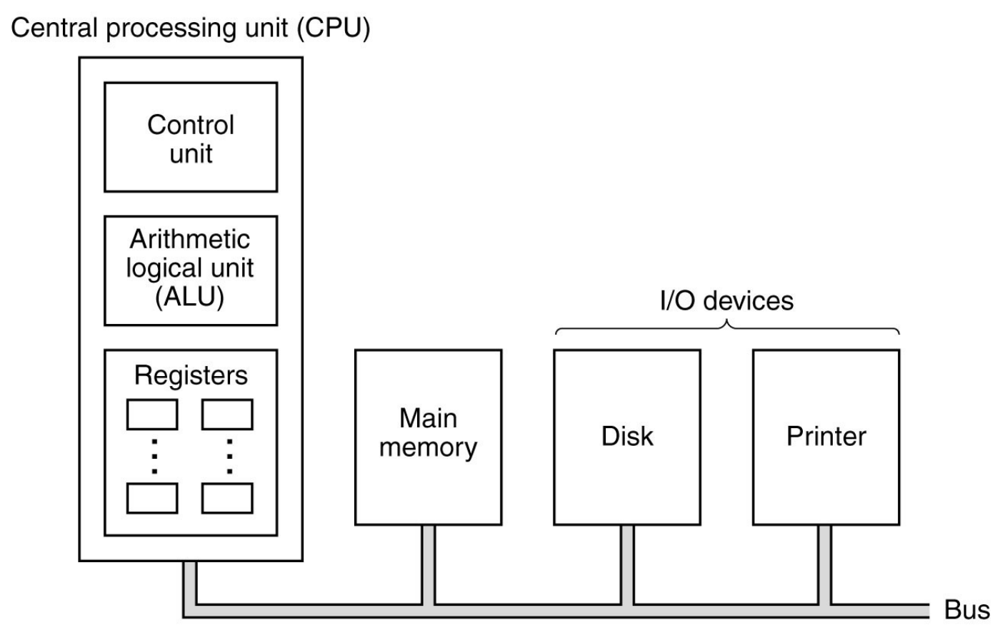

* Bus: verbindt alle componenten (een verzameling van parallelle draden)
* Control unit: haalt instructies uit het hoofdgeheugen en ondervindt hun type
* ALU (arithmetic logic unit): doet bewerkingen zoals optellingen, boolean AND die nodig zijn om instructies uit te voeren
* Registers: kleine geheugens met hoge snelheid waarin je bepaalde informatie en tijdelijke resultaten kunt opslaan. Elk register kan één getal bevatten. Ze zijn super snel, want ze zitten in de CPU
  * Program counter (PC): een register dat wijst naar de volgende instructie die moet worden opgehaald uit het hoofdgeheugen (bevelenteller in het nederlands denk ik)
  * Instruction register (IR): bevat de instructie die momenteel wordt uitgevoerd
  * Er zijn ook nog andere registers, sommige meer 'general purpose', andere hebben een specifieker nut, andere worden gerbuikt door het besturingssysteem om de computer te besturen.

**Datapad**

(ik veronderstel dat hij *data path* bedoelt)

Oke ik ben dom, hij heeft het gewoon vertaald. Ik dacht dat hij het engelse woord *pad* bedoelde.

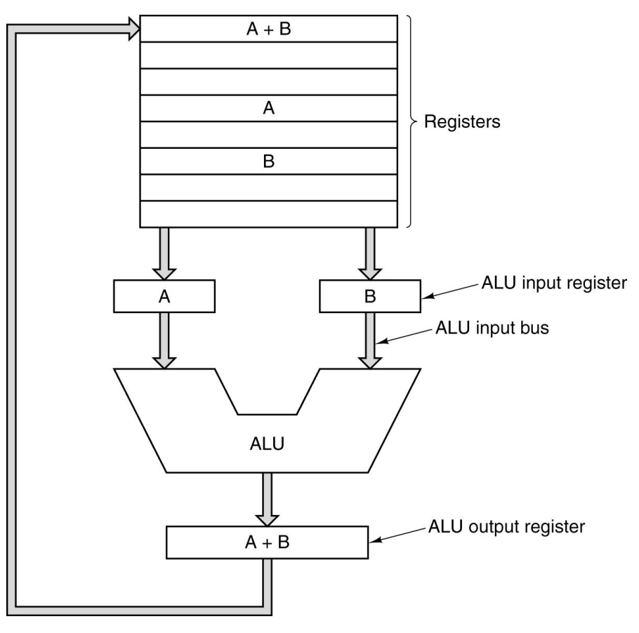

Het *data path* bestaat typisch uit de **registers**, de **ALU** en meerdere bussen die de onderdelen verbinden. De registers zijn verbonden met 2 **ALU input registers** (A en B). Daar wordt de input voor de ALU bijgehouden terwijl de ALU nog met iets anders bezig is. Nadat er een bewerking is uitgevoerd wordt het resultaat opgeslagen in het **ALU output register**. Dit resultaat kan dan weer opgeslagen worden in één van de registers. 

> Een datapad is een hoopje registers dat via een aantal inputbussen verbonden is met één of meerdere rekeneenheden. Met een bus die van de rekeneenheid terugkeert naar dezelfde registers om het resultaat te kunnen wegschrijven.
>
> - Wim

**Op welke manier kunnen er instructies op uitgevoerd worden?**

Volgens de **fetch-decode-execute** cyclus:

1. Fetch volgende instructie uit het geheugen naar de instruction register
2. Verander de program counter zodat hij wijst naar de volgende instructie
3. Bepaalt het type van de instructie die zonet is opgehaald
4. Als de instructie een *word* uit het geheugen nodig heeft, bepaal waar die zich bevindt
5. Haal de *word* op en steek ze (indien nodig) in een CPU register
6. Voer de instructie uit
7. Ga terug naar stap 1 en begin met de uitvoer van de volgende instructie

**CISC Architectuur**

CISC: complex instruction set computer

Doordat er telkens krachtigere computers nodig waren, waren er ook telkens krachtigere instructies nodig. Een CISC architectuur kan typisch met een instructie meerdere low-level operaties uitvoeren. Bovendien probeerden wetenschappers met RISC het gat tussen high-level programmeertalen en wat de machines konden kleiner te maken. CISC is de tegenhanger van RISC, waar ik het ongetwijfeld nog over ga hebben. 


## Vraag 2

> **Wat is de achterliggende gedachte bij een RISC-architectuur? (pagina 62-63) Aan welke voorwaarden moeten instructies voldoen en waarom moeten ze aan die voorwaarden voldoen? (pagina 63-65) Beschrijf hoe een klassieke 5-traps RICS-pipeline functioneert.(pagina 66-67) Hoe werd de pipeline bij de Pentium CPU geïmplementeerd? (pagina 68)**

```
sleutelwoorden:
RISC: reduced instruction set computing -> kleine instructies, zo veel mogelijk starten/sec

Voorwaarden:
	- instructie rechtstreeks op hardware (niet omgezet naar microinstructies)
	- maximaliseer instructies starten (parallel)
	- instructie makkelijk te decoderen (regelmatigere instructies, weten hoeveel geheugen, betere performance)
	-	enkel loads & stores gebruiken geheugen (is traag)
	- veel registers (gewoon geheugen is traag)
	
5 stage: 
Instruction fetch unit -> uit geheugen halen
Instruction decode unit -> bepaalt ook type vd operanden
operand fetch unit -> 
Instruction execution unit -> typisch operanden door datapad
write back unit -> naar juiste register

pentium: u (hoofdpipeline) v (alleen simpelere instructies)
IFU samen, splitst dan zelfde als 5stage pipeline
alleen sommige instructies konden parallel, beste geval 2x zo snel
```

**RISC**

= reduced instruction set computer

De gedachte is om instructies zo klein mogelijk te maken, minder lettend op de tijd om één instructie uit te voeren. De focus lag meer op zo veel mogelijk instructies te starten per seconde, wat heel goed bleek te zijn voor performance. 

**Aan welke voorwaarden moeten instructies voldoen? En waarom?**

* Alle instructies worden rechtstreeks uitgevoerd door de hardware, zodat ze niet moeten omgezet worden naar microinstructies. Dit zorgt voor hogere snelheid
* Maximaliseer de hoeveelheid instructies die gestart worden (ze kunnen dan vaak parallel worden uitgevoerd)
* Instructies moeten gemakkelijk zijn om te decoderen. (Weten hoeveel resources een instructie nodig heeft is belangrijk. Als je dit gemakkelijker kan maken door instructies regelmatiger en kleiner te maken, is dat veel beter voor de performance)
* Alleen *loads* en *stores* mogen aan het geheugen komen (want normaal geheugen is traag)
* Er moeten ruim genoeg registers zijn (want normaal geheugen is traag) 


**5-stage RISC pipeline**

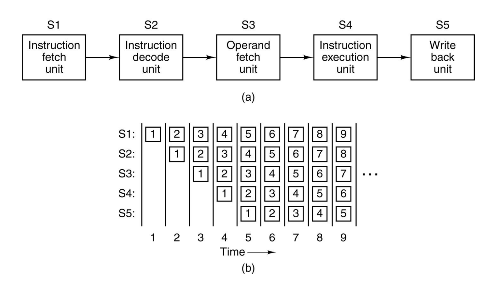

Het ophalen van een instructie duurt vaak het langst, dus zou het nuttig zijn als we de volgende instructie al kunnen ophalen, terwijl de vorige nog wordt uitgevoerd. 

1. Haalt instructie uit het geheugen en steekt ze in een buffer tot hij nodig is

2. Decodeert de instructie, bepaalt zijn type en operanden die hij nodig heeft

3. Zoekt een haalt de operanden op 

4. Voert de effectieve instructie uit, typisch door de operanden door het datapad te sluizen

5. Schrijft het resultaat terug naar het juiste register

   

> **Hoe werd de pipeline bij de Pentium CPU geïmplementeerd?**

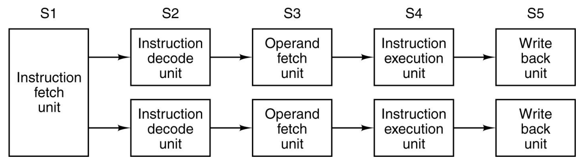

Vrij gelijkaardig aan deze figuur. De verdeling van het werk tussen stap 2 en 3 was lichtjes anders. De hoofdpipeline (**u pipeline**) kon een arbitraire pentiuminstructie uitvoeren, de tweede pipeline (**v pipeline**) kan alleen simpele integerinstructies uitvoeren. Er waren regels die bepaalden of een bepaald paar instructies compatiebel was om in parallel uitgevoerd te worden. Was dit niet het geval, dan werd de eerste uitgevoerd (in de u pipeline) en werd de tweede bijgehouden en gepaard met de volgende instructie. 

Zo konden compilers voor pentium programmas compileren die tot 2 keer zo snel waren als oudere compilers. 


## Vraag 3

> Wat is het verschil tussen een GPU en een vector processor? Leg uit hoe ze beide functioneren. Wat streven ze allebei na? Wat wordt er bedoeld met een multiprocessor en met een multicomputer? (pagina 69-73)
>

```
sleutelwoorden:
GPU -> intructie op meerdere SIMD (single instruction multiple data stream) processors tegelijk
Vec pr -> vector register = meerdere registers waarop in 1 instructie op allemaal uitgevoerd

allebei vaak zelfde instructie op verschillende data, moet snel

multiprocessor -> tightly coupled, delen geheugen
multicomputer -> loosely coupled, ieder eigen geheugen
```

**GPU**

Maakt gebruik van SIMD (Single instruction stream multiple data stream). Een GPU moet heel vaak dezelfde simpele operaties uitvoeren (pixels, textures enzo). Elke instructie wordt op meerdere SIMD processors uitgevoerd. Hierdoor kan een GPU vele malen meer (simpele) instructies per seconde uitvoeren dan een klassieke CPU.

**Vector processor**

Een vector processor maakt gebruikt van een **vector register**, een set van gewone registers die serieel in één instructie uit het geheugen geladen kunnen worden. Als we dan bijvoorbeeld twee vectoren optellen, worden ze door een gepipelinede opteller gevoerd die de waarden paar per paar optelt. Het resultaat kan dan opgeslagen worden in een vector register of direct doorgesluisd worden als operand voor een volgende bewerking.

**Wat streven ze allebei na?**

Om snel dezelfde instructie herhaaldelijk op een rij van data uit te voeren.

**Wat wordt er bedoeld met een multiprocessor en met een multicomputer?**

*Multiprocessor* = een systeem met meerdere processoren die een geheugen delen (*tightly coupled*)

*Multicomputer* = Een systeem met meerdere intergeconnecteerde processoren met ieder hun eigen geheugen.  (*loosely coupled*)

## Vraag 4

> Wat is BCD-codering? (pagina 74) Wat is het verschil tussen big endian notatie en little endian notatie. Geef een voorbeeld waarbij je illustreert dat wanneer beide architecturen gegevens met elkaar zouden uitwisselen het omdraaien van de bytes niet werkt. (pagina 76-78, zie voorbeeld les)

```
sleutelwoorden:
BCD = binary coded decimal
big endian -> big end first, little endian -> little end first
// TODO oefening maken
```

**BCD** = binary coded decimal

Een decimaal getal in binaire voorstelling geschreven

| Little Endian               | Big Endian                  |
| --------------------------- | --------------------------- |
| Gebruikt door intel         | Gebruikt door IBM           |
| De kleinste byte komt eerst | De grootste byte komt eerst |

Een mooi plaatje ter illustratie:


> Geef een voorbeeld waarbij je illustreert dat wanneer beide architecturen gegevens met elkaar zouden uitwisselen het omdraaien van de bytes niet werkt.

Een simpel voorbeeld uit het boek. Als je bij deze figuur kijkt, is (c) het resultaat van bytes van big naar little endian te sturen. Je kan niet zomaar aan het antwoord (d) geraken door alle bits om te draaien.

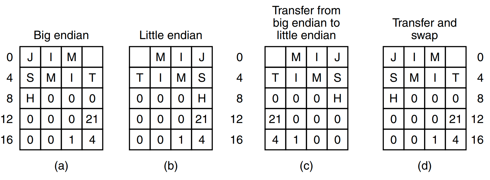

## Vraag 5

> **Beschrijf kort het idee achter cache-geheugens. Op basis van welk principe dragen cache geheugens bij tot prestatieverbeteringen? Geef enkele voorbeelden (minstens drie) om dit te verduidelijken. Welke mogelijkheden zijn er om cache-geheugens te voorzien en welk verband is er met de Harvard architectuur? (pagina 82-85…)**

```
sleutelwoorden: snel klein + traag groot = goed & goedkoper
ruimtelijke & tijdelijke lokaliteit
ruimtelijke: array, queue
tijdelijke: loop

mogelijkheden: unified & split cache
harvard: split, instructies en data eigen cache, goed voor pipeline
```

We willen in een pc snel en groot geheugen, dat is in de realiteit niet mogelijk. Je moet kiezen, ofwel snel, ofwel groot. De oplossing is klein, snel geheugen combineren met groot, traag geheugen. 

**Ruimtelijke localiteit**

Als een programma een stuk geheugen opvraagt is de kans groot het volgende stuk geheugen dat hij nodig heeft daarbij in de buurt ligt. Als er dus iets wordt opgevraagd uit het grote, trage geheugen gaan we ook al een aantal aanliggende geheugenvelden in de cache stoppen, want de kans is groot dat we ze later toch nodig hebben.

**Temporale localiteit**

Als je een bepaald stuk geheugen recent hebt gebruikt, is de kans groot dat je het in de toekomst opnieuw nodig hebt.


**Op basis van welk principe dragen cache geheugens bij tot prestatieverbeteringen? Geef enkele voorbeelden (minstens drie) om dit te verduidelijken.**

1. We printen de letters van een string uit. De letters staan achtereenvolgend in het geheugen. Wanneer een letter ophalen, zetten we een bepaald aantal volgende letters in de cache. Aangezien uitlezen uit het cachegeheugen sneller is, loopt ons programma nu sneller.
2. We hebben een programma dat manipulaties uitvoert op een matrix. In plaats van elke keer opnieuw een getalletje uit het geheugen uit te lezen, kunnen we beter al een deel (of de gehele) matrix in de cache stoppen. De kans is groot dat we niet één getal uit de matrix nodig hebben.
3. Cachegeheugens komen niet alleen voor in processoren. Stel je voor, het is een gezellige avond en je hebt zin om heel de avond lang naar Taylor Swift te luisteren. Wanneer je het eerste liedje opzet, zal Spotify al een aantal volgende liedjes klaarzetten zodat je ononderbroken naar je favoriete artiest kunt luisteren. (neem deze misschien met een korrel zout, ik denk dat misschien caching en buffering ofzo door elkaar haal, maar het principe is hetzelfde)


**Welke mogelijkheden zijn er om cache-geheugens te voorzien en welk verband is er met de Harvard architectuur?**

* Unified cache: instructies en data gebruiken dezelfde cache
* Split cache: instructies en data hebben ieder hun eigen cache = **Harvard Architectuur**
  * dit is nuttig bij gepipelinede CPUs, waar het programma instructies uitvoert en op hetzelfde moment data ophaalt

## Vraag 6

> **Hoe is een sector van een harde schijf opgebouwd? (zie extern pdf-document)Wat wordt er in termen van een harde schijf bedoeld met heads, cylinders en sectors? (pagina 88- 89) Wat is het voordeel om sporen onder te verdelen in zones? (pagina 90) Wat zijn de twee belangrijkste eigenschappen die bijdragen tot de performantie van een harde schijf? (pagina 89) Bespreek**

```
sleutelwoorden:
sector opbouw: sync bits, veld met id info, CRC van id, gap om tijd te geven, data, crc van data, nog gap
head: kopje dat leest
cylinder: doorsnede van laagjes op straal
sector: blokje met data (512 bytes)

voordeel zones: schijf kleiner naar midden, densiteit oneven = verspilling -> opl: meer sectoren in zones naar buiten toe

twee eigenschappen: seek (arm verzetten), rotational latency (schijf draaien)

```

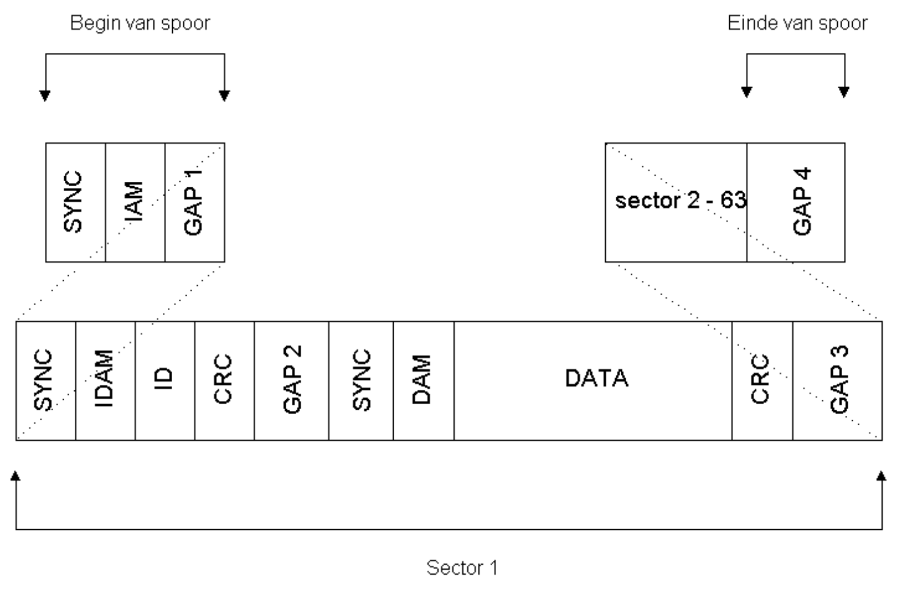

* SYNC: synchronisatiebits
* IAM (index adress markering): geeft aan dat er sectoren volgen
* IDAM (ID adres markering): geeft aan dat het volgende veld een id is
* ID: 4 bytes die de sector identificeren (kop, cylinder, sector, sectorvlag)
* CRC (Cyclic redundancy check): basically een modulo van de voorgaande velden die wordt gebruikt om te checken of er niets kapot is
* GAP 2: geeft tijd om CRC te verifiëren
* DAM (data adres markering): toont dat er data komt
* Data: de data (512 bytes)
* CRC (deze keer van de data)
* GAP 3: het aantal en grootte van bitcellen in de sector kan variëren, dus we laten wat extra ruimte voor de zekerheid
* GAP 4: duidt het einde van het spoor aan

**Heads**

Het kopje dat de data van de magneetschijf uitleest

**Cylinders**

Een harde schijf bestaat uit meerdere lagen van schijven. De koppen bewegen allemaal tegelijk (ze zitten aan elkaar vast). Een cylinder is gewoon de doorsnede van alle laagjes op een bepaalde straal. 

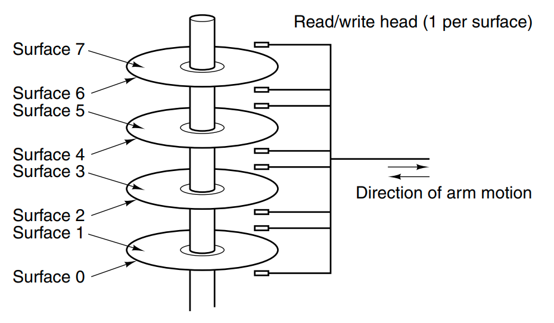

**Sectors**

Een schijf wordt opgedeeld in blokjes data, sectors genaamd. Deze zijn typisch 512 bytes.


**Wat is het voordeel om sporen onder te verdelen in zones?**

Vroeger had je een bepaald aantal sectoren over de omtrek van de schijf. Naarmate je dichter naar het midden van de schijf ging, werden die natuurlijk veel denser. Dat is niet handig, want ge gebruikt de schijf niet optimaal. Door de schijf te verdelen in zones, en als je van binnen naar buiten gaat op de schijf, het aantal sectoren per zone te laten toenemen, maak je beter gebruik van de schijf om er zo veel mogelijk foto's van je lelijke kinderen op te kunnen krijgen.


**Wat zijn de twee belangrijkste eigenschappen die bijdragen tot de performantie van een harde schijf? (pagina 89) Bespreek**

* Seek: de tijd die het duurt om de arm naar de juiste positie te verplaatsen (5-10 ms)
* Rotational latency: de tijd dat het duurt om de schijf naar de juiste positie te draaien (3-6 ms)

Een sector (512 bytes) uitlezen duurt typisch (volgens het boek dat al een aantal jaar oud is) 3.5 μs. Het is dus belangrijk om de seek en rotational latency zo laag mogelijk te maken


## Vraag 7

> **De IDE-interface kende lange tijd een beperking op schijfcapaciteiten tot 504 MB. Leg uit hoe dit komt (zie slides). Hoe heeft men dit opgelost en wat is momenteel de maximum schijfcapaciteit en leg uit hoe men tot dat getal komt? (zie les) Wat was de maximumoverdrachtsnelheid van deze interface (zie les)? Wat is de opvolger van de IDE/ATA-interface? (pagina 91-92)**

```
sleutelwoorden:
IDE -> integrated drive electronics
waarom max 504 -> bios gaf CHS(cylinder head sector rechtstreeks door aan disk), hardwired
oplossing -> liegen -> cylinder#/16, head#*16 => 8064MB mogelijk
max: 133MB/s
opvolger: EIDE (extended...), heeft lba's (logical block addressing), disk controller moet ze maar omzetten
```

IDE = integrated drive electronics

Waarom 504 MB? Toen was dit astronomisch groot. Met 4 bits voor de head (dus max 16 heads), 6 bits voor de sector (max 63 sectors) en 10 bits voor de cylinder (max 1024 cylinders). Dat komt uit op 1032192 sectors, ofwel 504 megabytes. De reden dat er maar 63 sectoren kunnen zijn is mogelijks door een programmeur, die het een grappig vond om de sector indices vanaf 1 te laten starten. De BIOS gaf dus het CHS (Cylinder-head-sector) rechtstreeks door aan de harddisk. Dit zat hardwired in de bios, dus kunnen we niet hoger gaan.

**Hoe heeft men dit opgelost en wat is momenteel de maximum schijfcapaciteit en leg uit hoe men tot dat getal komt?**

Deze vraag is een beetje dubbelzinnig, ik veronderstel dat Wim ons vraagt om uit te leggen welke whacky shit ze toen hebben bedacht om het probleem te omzeilen, en niet de echte oplossing die nu wordt gebruikt.

**Hoe heeft men dit TOEN opgelost?**

Omdat ze de BIOS calling conventies van toen niet wouden (of konden voor backwards compatibility) veranderen, gingen disk controllers liegen. Bij schijven die een andere geometrie hadden dan de bios mee kon werken, werd het CHS door de disk controller vertaald naar het effectieve CHS van de schijf. Om een harde schijf met meer dan 1024 cylinders te kunnen gebruiken, delen we het nummer van de cylinder door 16 en vermenigvuldigen we het nummer van de head met 16. Zo kunnen we gaan tot 8064 MB. (Als je dit beter kan uitleggen, laat iets weten)

**Wat was de maximumoverdrachtsnelheid van deze interface?**

133MB/s

**Wat is de opvolger van de IDE/ATA-interface?**

Hierna kwam **EIDE** (extended IDE) met support voor LBA's (Logical block addressing). Ze gingen gewoon elke sector een nummer geven en dan moet de controller van de harde schijf dat maar weten om te zetten in head, cylinder en sector adressen. De limiet hier was dan 128GB. 


## Vraag 8

> **SCSI, voor wat staat het en wat zijn de belangrijkste verschillen met de IDE-interface? In welke grootteorde liggen de overdrachtsnelheden die men via de SCSI-interface haalt? Wat is de moderne opvolger van de SCSI-interface? (pagina 92-94, zie les)**

```
sleutelwoorden:
SCSI -> small computer system interface
is ook een bus met SCSI controller, 7 apparaten (15 wide), elk apparaat 2 aansuitingen (in en out)
is sneller

opvolger: raid
```

**SCSI** (uitgesproken als scuzzy): Small computer system interface

SCSI is niet alleen een hard-disk interface, maar een bus waarop een SCSI controller en tot 7 (of 15 voor wide scsi) apparaten kunnen aangesloten worden (CD-ROM, scanners, ...) Elk apparaat heeft 2 aansluitingen (input en output). Bovendien is SCSI veel sneller.

SCSI gaat ongeveer van 5 - 640 MB/sec. Pittig snel dus.

**Wat is de moderne opvolger van de SCSI-interface? **

**RAID** (redundant array of inexpensive disks). Sowieso in één van de volgende vragen meer uitleg hierover.


## Vraag 9

> Uit wat zijn SSD’s opgebouwd? Wat zijn de belangrijkste verschillen tussen harde schrijven en SSD’s? Wat zijn de voor- en nadelen van beide opslagmedia? (pagina 97-99 en slides)

```
sleutelwoorden:
flash cellen: kapotte transistor die lading behoudt

verschillen:
 - ssd sneller
 - hdd geodkoper
 - ssd gaat minder lang mee (100.000 writes, dus wear leveling), hdd gaat langer mee
 - ssd geen bewegende onderdelen
```

**Uit wat zijn SSD’s opgebouwd?**

Uit vele solid state flash memory cellen. De flash cel is bedacht door een slimme man die had ontdekt dat kapotte transistors vast kunnen blijven steken op een 0 of een 1. Kort uitgelegd, de flash cel is een aangepaste transistor die zijn lading behoudt, zelfs als er geen stroom meer is in het systeem.

**Wat zijn de belangrijkste verschillen tussen harde schrijven en SSD’s? Wat zijn de voor- en nadelen van beide opslagmedia?**

| SSD                                                          | Harde schijf                 |
| ------------------------------------------------------------ | ---------------------------- |
| Twee tot drie keer sneller                                   | typisch 100MB/sec            |
| 3 dollar / GB (toen, nu al minder)                           | Goedkoper (een paar cent/GB) |
| Een cel kan typisch maar 100.000 writes aan, dus er wordt aan *wear leveling*\* gedaan om hem zo lang mogelijk mee te laten gaan | Verslijt minder snel         |
| Geen bewegende onderdelen                                    | Wel bewegende onderdelen     |

\* *wear leveling*: Er wordt een map bijgehouden van alle logische blokken van de schijf, wanneer er nieuwe data wordt weggeschreven, wordt de data weggeschreven naar de minst gebruikte blokken van de schijf. Zo kunnen we hem zo lang mogelijk mee laten gaan.

**Extra**

Sommige SSDs hebben *multilevel flash cells*. Dit betekent dat de lading in één flashcel meer dan 2 ladingsniveaus kan bevatten. Er wordt dan een sequentie van stroompjes met toenemend voltage aangebracht om te bepalen welke lading de cel bevat. Een typische multilevel cel kan vier ladingsniveaus bevatten. Waardoor er dus twee bits per cel kunnen opgeslagen worden.


## Vraag 10

> Waarvoor staat RAID? Waarom werd RAID bedacht en wat is de tegenhanger van RAID? Vermeld zeker en vast de verschillen tussen beide en ook hun voor- en nadelen. Bespreek de algemene werking van RAID. RAID-0, RAID-1, RAID-2, RAID-3, RAID-4 en  RAID-5 zijn allen implementaties van RAID. Bespreek per implementatie of deze nog gebruikt wordt, hoeveel schijven er minimum vereist zijn en hoe het werkt. Wat wordt er bij RAID-4 bedoeld met de schrijfstraf? Veronderstel dat je RAID-3 gebruikt met 4 schijven en dat de derde schijf crasht. Hoe kan je de data op de gecrashte schijf reconstrueren? (pagina 94-97)

```
sleutelwoorden
RAID -> redundant array of inexpensive disks (i ook independent)
waarom -> toename disk snelheid dan cpu -> parrallel processing I/O sneller + redundantie voor betrouwbaarheid & fouttolerantie

RAID-0 ->strips verdelen over schijven, minder reliable (veel schijven), snellere io, min 1 drive
RAID-1 -> alles verdubbelen (samen met raid 0 of niet), min 2
RAID-2 -> rot sync, hamming code, moeilijk en kut
RAID-3 -> simpelere raid2, pariteitsbit op laatste, min 3
RAID-4 -> strips, pariteitsstrip op laatste schiif, min 3
RAID-5 -> vorige zonder bottleneck, pariteitsstrips verdelen
1 en 5 worden gebruikt

schrijfstraf -> RAID-4 elke write alles lezen voor pariteit, met kleine optimalisatie  pariteitsschijf lezen + oude data & nieuwe data pariteit berekenen, toch altijd pariteitsschijf lezen

Reconstrueren: pariteitsbit 1 als oneven aantal 1-bits
```

**Waarvoor staat RAID?**

*Redundant array of inexpensive disks*: de 'i' kan ook staan voor independent. Omdat mensen vonden dat de disks ook wel duur konden zijn.


**Waarom werd RAID bedacht en wat is de tegenhanger van RAID? **

Disk snelheid ging niet zo snel vooruit als CPU snelheid. Dus men had het idee om parallel processing te gebruiken om I/O te versnellen. Buiten snellere processing zorgt RAID ook voor hogere betrouwbaarheid en fouttolerantie.

Tegenhanger: **SLED** (Single Large Expensive Disk)

Alhoewel RAID leuk is, heb je wel meer overhead, dus minder effectief bruikbare schijfruimte. SLED is ook gewoon simpeler.


**Bespreek de algemene werking van RAID. RAID-0, RAID-1, RAID-2, RAID-3, RAID-4 en  RAID-5 zijn allen implementaties van RAID. Bespreek per implementatie of deze nog gebruikt wordt, hoeveel schijven er minimum vereist zijn en hoe het werkt.**

| RAID-niveau                                                  | Werking                                                      | Min.  Drives |
| ------------------------------------------------------------ | ------------------------------------------------------------ | ------------ |
| 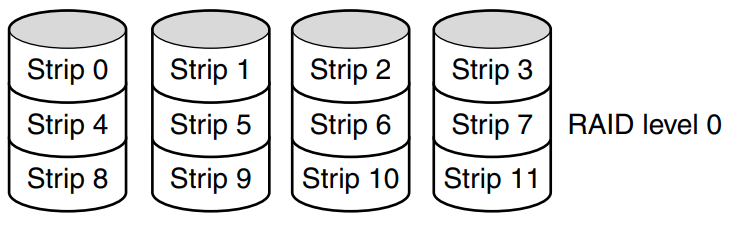 | De data wordt opgedeeld in strips van een bepaald aantal sectoren, verdeeld over $n$ schijven. Dit noemt men **striping**. Is minder reliable dan 1 schrijf, want je hebt $n$ keer zo veel kans dat er een schijf kapot gaat en je alles kwijt bent. Maar het werkt goed als je grote hoeveelheden data in één keer nodig hebt. Wordt niet echt veel gebruikt. | 1            |
| 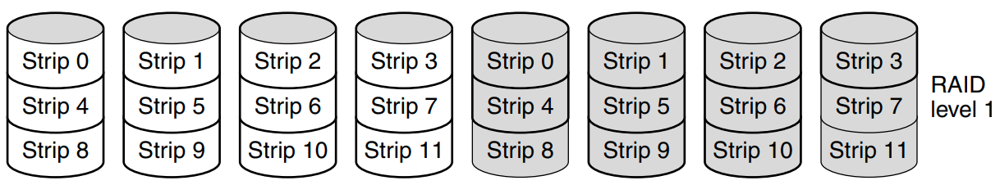 | Zelfde als RAID-0, alleen wordt alles verdubbeld. Write performance is hetzelfde als op 1 schijf, maar read kan tot 2 keer zo snel gaan. Goeie fault tolerance, want als een schijf kapot gaat, kun je hem gewoon vervangen en alle data terugzetten. (wikipedia zegt dat RAID-1 geen striping gebruikt). Wordt wel vaak gebruikt. | 2            |
| 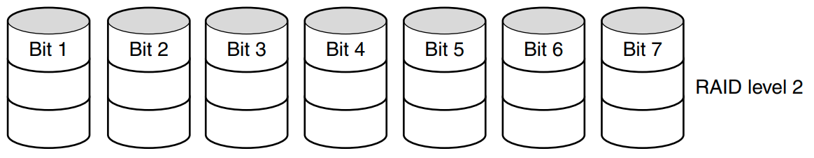  | Alle schijven worden rotationeel gesynchroniseerd (wordt daarom niet vaak gebruikt). Als we dan bijvoorbeeld onze data in nibbles van 4 bits opsplitsen en 3 bits hamming code toevoegen, kunnen we woorden van 7 bits verdelen over 7 schijven. Er is enorm veel overhead, dus dit is alleen nuttig met heel veel schijven. Is duur en moeilijk te implementeren, dus wordt niet vaak gebruikt. | 3            |
|   | Simpelere versie van RAID-2. We hebben een aantal schijven, op de laatste schijf staat een pariteitsbit voor elk woord (verdeeld over de vorige schijven). Als er een schijf wegvalt, kunnen we d.m.v. de laatste schijf met pariteitsbits de data herstellen. (omdat we weten op welke positie die bits stonden). Heeft hoge data rates, maar kan niet goed veel kleine I/O operaties afhandelen. Wordt ook niet vaak gebruikt. | 3            |
| 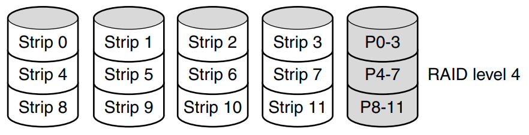  | Werkt weer met strips. Er wordt per laag een laag met pariteitsbits per strip bijgehouden op een aparte schijf. Als één sector wordt aangepast, moeten alle schijven opnieuw gelezen worden om de pariteitsbits te herberekenen. (= bottleneck en wordt niet vaak gebruikt hierdoor) | 3            |
| 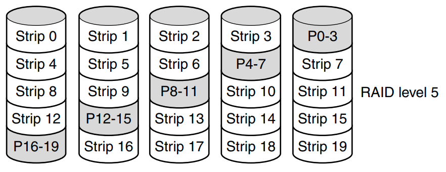  | Deze bottleneck wordt weggewerkt in RAID-5, door de pariteitsbits te verdelen over alle  schijven. Het enige probleem is dat het nu zeer complex is om de data van een weggevallen schijf te herconstrueren. Is één van de meest gebruikte vormen van RAID. | 3            |

**Wat wordt er bij RAID-4 bedoeld met de schrijfstraf?** 

Elke kleine update heeft 2 reads en 2 writes nodig. De oude user data en oude pariteitsdata lezen, waaruit met de nieuwe data de nieuwe pariteitsdata berekend kan worden. (dit is een kleine optimalisatie op elke keer alle schijven lezen voor de pariteit, maar nog steeds best traag).


**Veronderstel dat je RAID-3 gebruikt met 4 schijven en dat de derde schijf crasht. Hoe kan je de data op de gecrashte schijf reconstrueren?**

De bits zijn verdeeld over 3 schijven, met een pariteitsbit op de 4de. Stel je voor dat we 010 hebben als data. Dan is de pariteitsbit 1 (want we hebben een oneven aantal 1-bits). De 3de schijf valt weg, dus nu hebben we 01X als data. Omdat de pariteitsbit gelijk is aan 1, weten we dat op X en nul moest staat. Dit proces wordt dan doorlopen voor elk woord.


## Vraag 11

> Wat is een I/O-bus? Welke zijn de componenten waaruit ieder device bestaat? Geef elke stap in het communicatieproces tussen CPU en harde schijf bij het opvragen van een sector. Wie vraagt wat aan wie en hoe wordt de transactie beëindigd? Wat is de taak van de busarbiter en hoe worden prioriteiten over de devices verdeeld? (pagina 108-110)

```
sleutelwoorden:
I/O bus -> verbindt io apparaten met cpu
componenten -> controller & apparaat zelf
stappen -> 
	- cpu cmd naar disk controller (geeft seeks.. aan schijf), 
	- juiste spoor & sector gevonden? 
	- byte stream sturen naar controller
	- controller splitst ze in units en schrijft naar geheugen (als zonder cpu = DMA, direct memory access)
	- overdracht klaar contr stuurt interrupt naar cpu
	- cpu start interrupt handler (errors checken, extra stuff als nodig, op het einde tegen OS zeggen io klaar)

busarbiter -> beslist wie io bus mag gebruiken, io apparaten meestal voorrang (draaien enzo)
```

**Wat is een I/O-bus?**

De I/O bus is een deel van een computer dat input- en outputapparaten verbindt met de CPU. 

**Welke zijn de componenten waaruit ieder device bestaat?**

Elk apparaat bestaat uit een *controller* en het *I/O apparaat* zelf. 

**Geef elke stap in het communicatieproces tussen CPU en harde schijf bij het opvragen van een sector. Wie vraagt wat aan wie en hoe wordt de transactie beëindigd?**

De CPU stuurt een commando naar de *disk controller*, die dan *seeks* en andere bevelen aan de schijf geeft. Wanneer het juiste spoor en de juiste sector gevonden zijn, begint de schijf de data in een stream naar de controller te sturen. De controller breekt de bitstream in aparte *units* en schrijft elke unit naar het geheugen. Als de controller dit doet zonder tussenkomst van de CPU wordt dit *DMA* (Direct Memory Access genoemd). Wanneer de overdracht klaar is, stuurt de controller een interrupt naar de CPU. De CPU stopt hetgene waar hij mee bezig is en start een *interrupt handler* om te controleren op errors, extra actie te ondernemen wanneer nodig en ten slotte, door te geven aan het besturingssysteem dat de I/O opdracht voltooid is.

**Wat is de taak van de busarbiter en hoe worden prioriteiten over de devices verdeeld?**

De *bus arbiter* beslist welk apparaat gebruik mag maken van de I/O bus. Als de CPU en een I/O apparaat tegelijk de bus willen gebruiken, krijgt het I/O apparaat meestal voorrang, want schijven en andere bewegende apparaten kunnen niet zomaar stilgelegd worden.


## Vraag 12

> Na verloop van tijd is men overgeschakeld naar systemen met meerdere bussen, waarom heeft men een meer “lokale” bus toegevoegd? Bespreek kort de werking van PCI/PCIe. Wat zijn de voornaamste redenen dat men tegenwoordig overschakelt van parallelle naar seriële bussen? (pagina 111-112)

```
sleutelwoorden:
waarom lokale -> cpu traffic niet over pci bus
werking pci (peripheral component interconnect) (PCI bus + memory bus, PCI bridge ertussen)
	-> apparaten buiten cpu rechtstreeks op bus
	-> cpu eigen aansluiting
pcie ->point-to-point netwerk, packet switching, 32 lanes/apparaat (niet synchroon)
waarom serieel -> brede verbinding is niet sneller (door skew), serieel = hogere frequentie en uiteindelijk sneller
```

**Na verloop van tijd is men overgeschakeld naar systemen met meerdere bussen, waarom heeft men een meer “lokale” bus toegevoegd?**

De CPU heeft een eigen *lokale bus* om met de geheugencontroller te praten. Zo hoeft CPU memory traffic niet over de PCI bus te gaan.

**Bespreek kort de werking van PCI/PCIe.** 

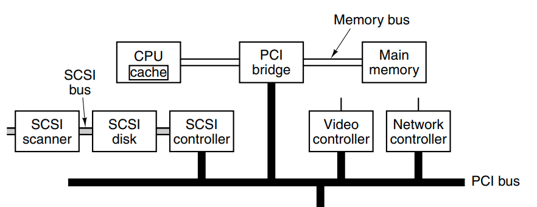

Bij de **PCI** (Peripheral component interconnect) bus worden de andere apparaten dan de CPU rechtstreeks op de PCI bus aangesloten.

**PCIe** (-express) is eigenlijk totaal anders dan PCI. Het is eigenlijk helemaal geen bus meer, maar een point-to-point netwerk van seriële verbindingen dat gebruik maakt van *packet switching*. (meer zoals het internet dan een traditionele bus). Een apparaat kan tot 32 lijnen (*lanes*) hebben. Deze lijnen zijn niet synchroon (zie volgende paragraaf waarom dit belangrijk is). 

**Wat zijn de voornaamste redenen dat men tegenwoordig overschakelt van parallelle naar seriële bussen?**

Je zou denken dat een 64-bit brede verbinding sneller is dan eentje van 1 bit. Door verschillen in de tijd die de 64 bits erover doen  om te verplaatsen, *skew* genaamd, moeten er lage snelheden gebruikt worden. Bij een seriële verbindingen veel hogere snelheden gebruikt worden die meer dan compenseren voor het verlies aan parallellisme. (denk aan PCIe 3.0 -> 16GB/sec)


## Vraag 13

> Bespreek de werking van een laser-printer. Wat is de taak van de embedded CPU? Hoe gaat men grijstinten afdrukken? Bespreek grondig wat het probleem is bij het afdrukken van kleuren? (pagina 122-125)

```
sleutelwoorden:
werking
	- drum opladen, bedekt met fotosensitief materiaal
  - lijn per lijn stukjes ontladen (achthoekige spiegel)
  - nog geladen stukjes trekken zwart poeder aan
  - draai trommel en lijn met poeder wordt tegen papier gedrukt
  - trommel ontladen + schoonmaken
  - opnieuw
embedded CPU:
	- neemt commando's (pcl, pdf) ipv bitmaps
grijstinten:
	- halftoning -> cellen van 6X6 deels gevuld met pixels
kleuren:
	- monitor = stralen, papier = reflectie
	- monitor 256 intensiteiten, printer halftone
	- monitor donkere achtergrond, printer lichte
	- RGB gamut (kleurenverzameling) monitor en CMYK gamut printer zijn verschillend

```

**Bespreek de werking van een laser-printer.**

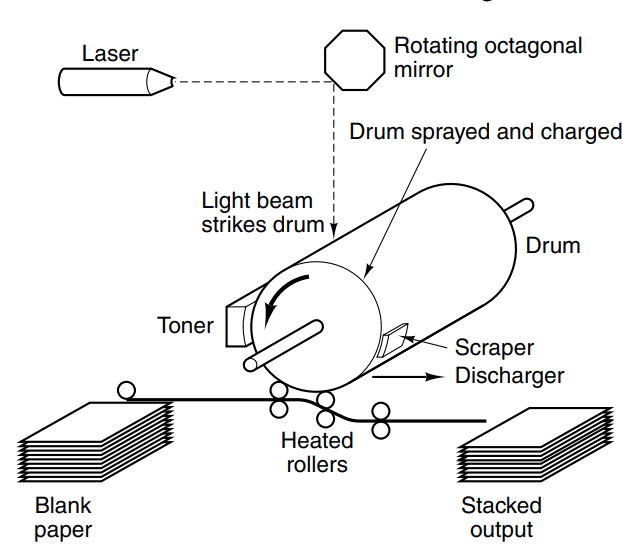

De trommel (drum) wordt voor elke paginacyclus tot 1000 volt geladen en bedekt met photosensitief materiaal. Op de trommel worden lijn per lijn kleine stukjes ontladen door een laser die op een achthoekige spiegel wordt gereflecteerd. Wanneer de trommel verder draait, komt elke lijn voorbij de toner, waar de stukjes die nog geladen zijn een speciaal zwart poeder aantrekken. De trommel rolt verder en de lijn met poeder wordt tegen het papier gedrukt. Dan wordt de trommel ontladen en schoongemaakt. Hierna begint de cyclus opnieuw.

**Wat is de taak van de embedded CPU?**

De *embedded CPU* neemt commando's aan die de te printen pagina's beschijven (in tegenstelling tot voorgemaakte bitmaps van de CPU van de computer). Deze worden gegeven in gespecialiseerde programmeertalen zoals PCL of PDF. 

**Hoe gaat men grijstinten afdrukken? **

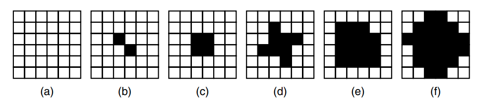

Men maakt gebruik van **halftoning**. Een afbeelding wordt opgesplitst in *halftone cells*, typisch 6x6 pixels. Door deze dan maar deels op te vullen met zwarte pixels, zien onze ogen ze als grijstinten.


**Bespreek grondig wat het probleem is bij het afdrukken van kleuren?**

Het boek geeft hier 4 mooie puntjes die verduidelijken dat het niet triviaal is om iets dat er goed uitziet op een monitor mooi geprint te krijgen.

1. Kleurenmonitors gebruiken lichtstralen, maar printers moeten het doen met het licht dat van het blad reflecteert.
2. Monitors hebben 256 intensiteiten per kleur, maar printers moeten *halftone* gebruiken.
3. Monitors hebben een donkere achtergrond, papier een lichte.
4. De RGB *gamut*\* en de *CMYK*\* gamut van een printer zijn verschillend

\**gamut*: de complete verzameling van kleuren die een printer kan printen of een monitor kan tonen

\**CMYK*: Cyan, magenta, yellow en black (key)

 

## Vraag 14

> Wat zijn de verschillende soorten touchscreens? Wat wordt bedoeld met ghosting (gebruik een schets om te tonen wat het probleem is)? (pagina 113-115)

```
sleutelwoorden:
resistief, capacitief, infrarood
ghosting -> 2 punten tegelijk aanraken, kunnen er 4 zijn (teken een vierkant)
```

**Resistieve touchscreens**

Twee laagjes, eentje met horizontale draadjes, eentje met verticale draadjes. Als je erop duwt maken ze contact en kan de positie van je vinger bepaald worden.

**Infrarood touchscreens**

Er worden bv. links en vanboven aan het scherm infrarood stralen gestuurd uit een led of laser. Aan de overkant, rechts en vanonder staan sensoren die dan kunnen zien waar je vinger de lichtstralen onderbreekt. 

**Capacitieve touchscreens**

Een horizontaal en verticaal roostertje van microscopische draadjes worden gescheiden door een isolerende laag. Dit heeft dezelfde werking als een condensator (capacitor). Op de plek waar je vinger het scherm aanraakt verandert dan de capaciteit. Het voordeel is dat je bij dit soort touchscreens (mutual capacitance) geen last hebt van *ghosting*. Waarom is misschien een beetje buiten de scope van deze vraag. Ik heb [iets](https://inst.eecs.berkeley.edu//~ee16a/sp15/Lecture/Lecture_12.pdf) gevonden met meer info maar ik snap het niet echt.

**Wat wordt bedoeld met ghosting?**

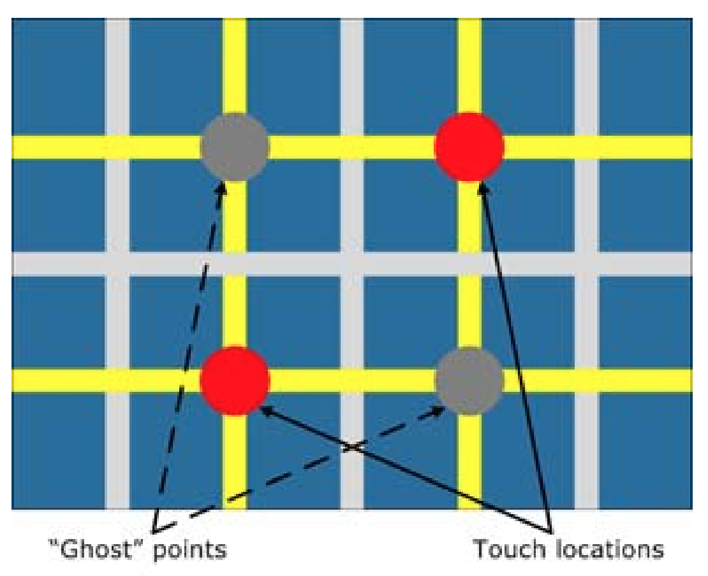

We raken het scherm aan op de twee rode punten. De gele lijnen zijn de onderbroken lichtstralen of draadjes die contact maken. Ons systeem kan niet weten of we op de rode of op de grijze puntjes duwen, want exact dezelfde coördinaten worden doorgegeven.


## Vraag 15

> Wat is ASCII-encodering? Hoe werd ASCII later uitgebreid? Wat is Unicode en bespreek de beperkingen ervan (gebruik de juiste terminologie)? Bespreek gedetailleerd UTF-8 (opbouw, werking, gebruik,…). (pagina 137-142) 

```
ASCII -> american standard code for information exchange
7 bits text encoderen
uitbreiden naar latin-1 voor ü enzo, later code pages (nog niet genoeg, pages vervelend, niet mixen)

unicode -> 16-bits; code point voor elk karakter of symbool (diakritisch bv ¨ eigen code point, software combineert met buren, meer last op software), 65536 toch niet genoeg

UTF-8 (universal character set transformation format)
	- variable length encoding
	- eerste bit op 1 als er nog bytes volgen
	- op 0? -> ascii past in 7
	- internet standaard
	- 2 miljard mogelijke tekens

```

**Wat is ASCII-encodering? **

ASCII (American Standard Code for Information Interchange) is een manier om text te encoderen in 7 bits. 41 = A, 42 = B, enzovoort. ASCII was origineel bedoeld voor dataoverdracht, dus de karakters bevatten *control characters* die geen tekens voorstellen (bv start of heading *SOH* of acknowledgement *ACK*). Later werd ASCII uitgebreid tot **Latin-1** met extra latijnse karakters zoals ü en é. Dit was nog steeds niet genoeg voor veel talen, dus later hebben ze geprobeerd te werken met **code pages**. Elke code page was een set van 256 karakters voor een bepaalde taal. Dit was vervelend omdat je geen karakters van verschillende pages door elkaar kon gebruiken enzo.

**Wat is Unicode en bespreek de beperkingen ervan (gebruik de juiste terminologie)?**

Bij **unicode** heeft elk karakter of symbool een unieke 16-bit waarde, genaamd een **code point**. Diakritische tekens zoals accenten hebben een eigen code point. Het is dan de taak van de software om ze te combineren met hun geburen om het juiste teken te vormen. Dit gebruikt een beetje meer rekenkracht, maar bespaart ruimte voor de encodering. Uiteindelijk bleken 65.536 code points toch niet genoeg om iedereen blij te maken.

**Bespreek gedetailleerd UTF-8 (opbouw, werking, gebruik,…)**

**UTF-8** (UCS Transformation Format), waar UCS staat voor Universal Character Set (basically unicode) maakt gebruik van variable length encodering (1 tot 4 bytes). Er kunnen dus ongeveer 2 miljard tekens mee voorgesteld worden. Als er meer dan één byte gebruikt wordt om een teken voor te stellen, wordt de voorste bit op 1 gezet om aan te tonen dat er nog bytes volgen. Als deze bit op 0 staat, is ons teken maar 1 byte lang. Handig, want met de 7 bits die we nu hebben kunnen we alle ASCII-tekens voorstellen. UTF-8 is de dominante standaard op het internet. Omdat we nog zo veel ruimte hebben kunnen we zeker nog voor aanzienlijke tijd tekens blijven toevoegen.


Ik denk dat het boek dit misschien niet goed uitlegt (of ik ben een retard), maar zo te zien wordt in byte 1 niet alleen de eerste bit op 1 gezet als er meer dan 1 byte nodig is om het teken te encoderen. Het boek geeft ook een voorbeeld met 6 bytes, maar dit was alleen deel van de originele proposal, en wordt in de UTF-8 standard niet gebruikt. 


# Hoofdstuk 3

## Vraag 16

> Maak een schets van een half adder en een full adder. Waarom is een half adder niet voldoende? Wat is een ripple carry adder en wat is een carry select adder? (pagina 165- 166)

```
sleutelwoorden:
half adder tekenen -> OR en XOR op A en B 
full adder tekenen -> 2 half adders, uitvoer eerste naar 2de A, 2de B neemt carry, carry van beide in OR naar buiten
half adder niet voldoende -> neemt geen carry, kan geen treintje maken
ripple carry adder -> allemaal full adders achter elkaar zetten
carry select adder -> woord in twee splitsen, grote deel 2 maal berekenen (want je weet c nog niet) en op het einde juiste kiezen
```


| Half adder                                                   | Full adder                                                   |
| ------------------------------------------------------------ | ------------------------------------------------------------ |
| 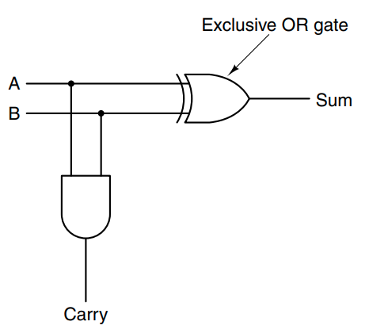 | 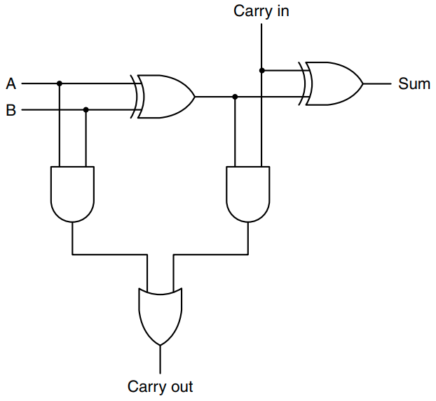 |

**Waarom is een half adder niet voldoende?** **Wat is een ripple carry adder?** **Wat is een carry select adder?**

Met een **half adder** kan je twee bits optellen, als je 1+1 doet is het resultaat 0 en wordt de carry op 1 gezet. Hier stopt het, want je kan niet verder gaan in je optelling doordat de half adder geen carry aanneemt. Een **full adder** neemt een carry aan van de vorige optelling. Als je een rij full adders achter elkaar zet, krijg je een **ripple carry adder**. De carry out van de vorige wordt aangesloten op de carry in van de volgende. Hij krijgt zijn naam omdat hij als het ware de carry door laat rippelen. Dit is traag omdat je telkens moet wachten op de carry van de vorige optelling. We kunnen dit proces versnellen door een **carry select adder** te maken. Neem als voorbeeld een getal van 32 bits, we splitsen het op in twee stukken van 16 bits. Normaal gezien zouden we alleen aan het tweede stuk kunnen beginnen als we weten wat de waarde van de carry van de eerste 16 bits is. Dit lossen we op door simpelweg beide mogelijkheden te berekenen voor de 16 hoogste bits. Deze zijn tegelijk klaar met de optelling van de eerste 16. We moeten nu enkel kijken wat de waarde van de carry van de eerste is om te weten welke van de twee uitkomsten we moeten kiezen. Onze optelling is nu twee keer zo snel. Je kan dit nu bijvoorbeeld opnieuw doen per 8 bits om de optelling 4 keer zo snel te maken.


## Vraag 17

> Gegeven onderstaande figuur. Bespreek de werking van deze 1-bit ALU. Hoe kan je aan de hand van deze schakeling een 16-bit ALU maken? (pagina 166-167)

```
sleutelwoorden
decoder -> functie kiezen, sluit delen af met AND gates
full adder -> optelling
logical unit -> and en or enzo

16-bit alu maken -> achter elkaar zetten en carry doorgeven
```

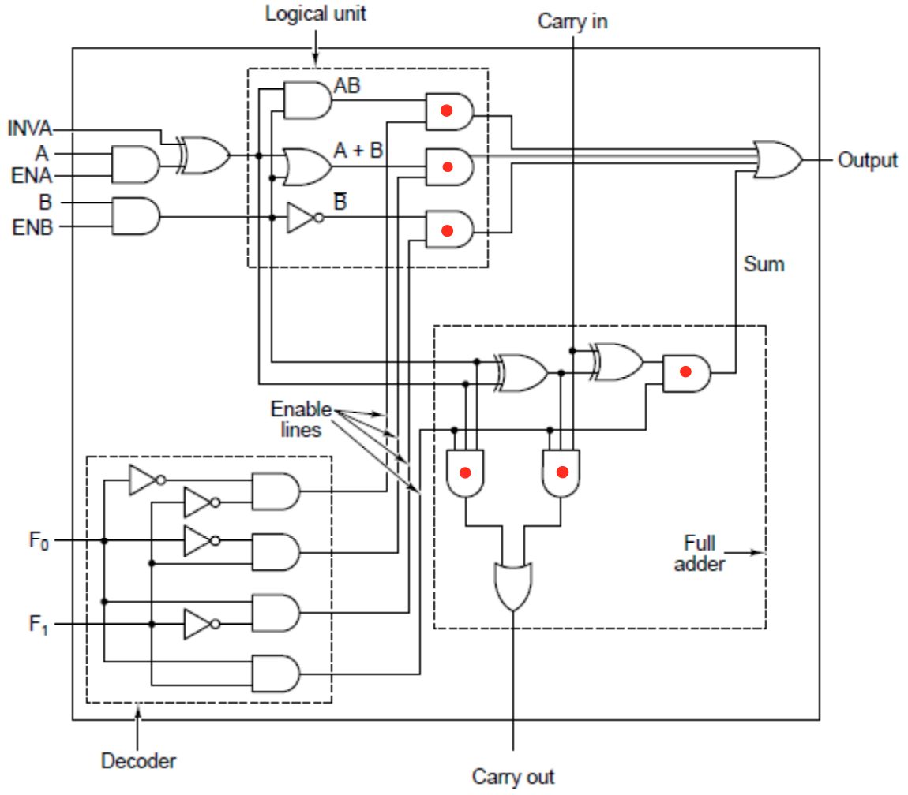 

De **decoder** neemt twee bits aan, door de schakeling van AND en NOT gates wordt voor elke waarde exact één van de vier lijnen (enable lines) op 1 gezet. Zo wordt bepaald of we $A$ AND $B$, $A$ OR $B$, $\overline{B}$ of $A$ + $B$ uitvoeren. Na elke bewerking staat nog een AND :red_circle: samen met het resultaat van de decoder om te bepalen of het resultaat van de berekening moet doorgevoerd worden. 

**Logical unit**

$A$ en $B$ komen links boven binnen, in de logical unit worden de AND, OR en NOT uitgevoerd. De A + B hier is een OR.

**Full adder**

Hier wordt de optelling gedaan.

**Input (links boven)**

Als we INVA activeren, nemen we $\overline{A}$. Met ENA en ENB kunnen we kiezen of A en B geactiveerd worden.

**Hoe kan je aan de hand van deze schakeling een 16-bit ALU maken?**

Door 16 1-bit ALU's achter elkaar te zetten en telkens de carry out van de voorgaande ALU op de carry in van de volgende te zetten.

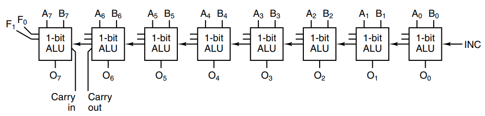

## Vraag 18

> Gegeven onderstaande figuur. Bespreek de werking van dit 12-bit geheugen. Wat is de functie van iedere signaallijn? Wat is de functie van de non inverting buffers? Hoeveel signaallijnen zou een equivalent 12-bit register hebben? (pagina 174-177)

```
sleutelwoorden
cs -> chip select (of we deze gebruiken)
oe -> output enable
A -> adres input
O -> output

non inverting buffers -> driehoekjes = schakelaar met oe, want zelfde lijnen voor in en output
12 bit register -> 12*2 (in en uit per bit), clock, clear, power, ground = 28 
```

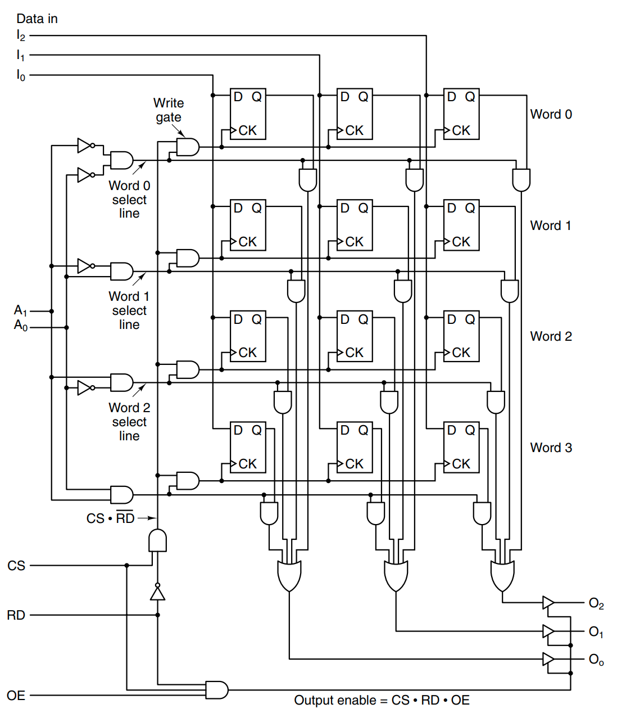

**Bespreek de werking van dit 12-bit geheugen.**

Dit geheugen maakt gebruik van 3-bit woorden, telkens opgeslagen in 3 flip-flops Elk woord is adresseerbaar en elke operatie leest of schrijft een woord. Omdat we als input een waarde en een adres krijgen, kunnen we meer data opslaan met minder schakelingen.

**Wat is de functie van iedere signaallijn?**

* $I_0, I_1$ en $I_2$: input van data
* $A_0$ en $A_1$: input van het adres van het woord dat je wil lezen of schrijven
  * De vier AND gates (word select) vormen een decoder voor het adres, enkel het gekozen woord wordt gelezen of geschreven.
* $CS$: Chip select
  * Er kan alleen gelezen of geschreven worden als deze op 1 staat
* $RD$: Read of write
  * 1 voor read, de inputlijnen ($I_0,$ ...) worden hier niet gebruikt
  * 0 voor write, de outputlijnen ($O_0,$ ...) worden hier niet gebruikt, er komt nu ook een 1 binnen op de write gates.
* $OE$: output enable
  * In de realiteit worden dezelfde lijnen gebruikt voor output en input, dus we gebruiken deze lijn om de output aan of uit te zetten
* $O_0, O_1$ en $0_2$: output van data

**Wat is de functie van de non inverting buffers?**

Dit zijn de driehoekjes rechts onder. Ze komen logisch overeen met een soort schakelaar. Als de output enable lijn high is, zullen ze stroom doorlaten, en andersom bij low. Omdat zoals daarnet verteld, in de realiteit dezelfde lijnen voor in- en output gebruikt worden, willen we niet dat ons inputsignaal ons outputsignaal verstoord of omgekeerd.

**Hoeveel signaallijnen zou een equivalent 12-bit register hebben?**

12 input, 12 output, clock, clear, power en ground = 28 lijnen


## Vraag 19 (wordt zeker gesteld op examen)

> Geef drie mogelijke indelingen voor een geheugenchip. Wat zijn de voor- en nadelen van elk dergelijk ontwerp? (pagina 178 – 179)

> Vraag 19 heb ik qua formulering aangepast omdat iemand mij in de feedback-sectie heeft laten weten dat dit niet zo zinvol is om deze waarden van buiten te leren. Dat is inderdaad niet de bedoeling en de vraag werd dus geherformuleerd. - Wim

Je moet dus de getallen en lettertjes niet vanbuiten kennen. Wel kunnen uitleggen hoe elk ontwerp werkt. Zie hieronder voor een oplossing van Wim.

```
sleutelwoorden:
eerst volledig adres
later rij & kolom (minder pinnen) -> RAS en CAS geven aan of pinnen rij of kolom bevatten, ook burst mode
nog later extra controlelijnen voor banks, parallel mogelijk als verschillende banks
1D -> 3D
```

**Volledig adres**

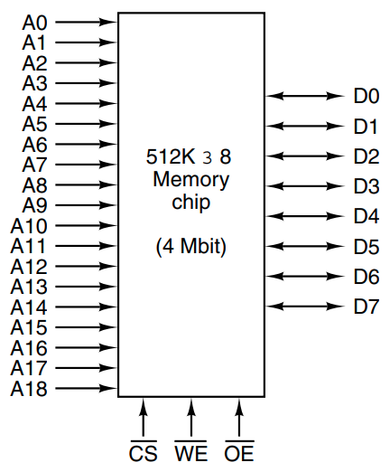

Het volledige adres wordt op de A-lijnen gegeven. Dit schaalt moeilijk, want je moet elke keer dat je de grootte van de chip verdubbelt een adreslijn toevoegen. Je kan wel in één keer iets opvragen, want je hoeft niet te sukkelen met rij- en kolomadressen.

**Rij- en kolomadres**

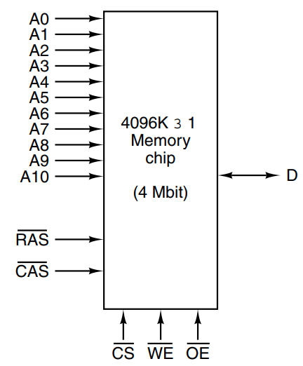

De chip neemt een rijadres, dan wordt de RAS (row access strobe) geactiveerd. Dan wordt een kolomadres aan de chip gegeven. Vervolgens wordt de CAS (column access strobe) geactiveerd en wordt de bit op die plek geoutput. Dit is een beetje traag omdat we telkens twee operaties moeten doen om één ding uit het geheugen te lezen. Om dit te versnellen kunnen we eerst een rijnummer ingeven en vervolgens meerdere kolomnummers om een rij aan bits uit te lezen. (burst mode)

**Memory banks**

We splitsen ons geheugen op in geheugenbanks. We doen hetzelfde als de vorige manier, maar we voegen extra controlelijnen om aan te geven welke bank we willen aanspreken. Zo kunnen we zelfs parallelle aanvragen mogelijk maken, zolang ze verschillende geheugenbanks aanspreken.


### Antwoord van Wim himself

In het begin werd het volledige adres ineens aangeboden aan de geheugenchip waarna men is overgeschakeld naar het opgeven van een rij- en kolomadres om het aantal pinnen te beperken. Hiervoor moet er dan wel twee controlesignalen worden toegevoegd, i.e. RAS en CAS, om aan te geven of de adreslijnen het rijadres dan wel het kolomadres bevatten. Hier wordt nuttig gebruik van gemaakt bij burstmode om een rijadres aan te bieden gevolgd door meerdere kolomadressen. Dus zolang er niet gewisseld wordt van rij blijft men kolomadressen aanbieden en bijgevolg gaat men dus de adresfase in tijd halveren. 

Een laatste indeling is dezelfde als de tweede met uitzondering dat er nu nog meer extra controlelijnen worden toegevoegd om de geheugenbank aan te duiden waarop de vraag aan het geheugen betrekking heeft. Hierdoor zijn parallelle aanvragen mogelijk zolang ze maar betrekking hebben op verschillende geheugenbanken. Dus van een 1-dimensioneel ontwerp is men geëvolueerd naar een driedimensioneel ontwerp.

## Vraag 20

> Wat is ROM-geheugen en wat is RAM-geheugen? Met RAM bedoelt men doorgaans “Random Access Memory”. Wat bedoelt men in deze context met “Random Access”? Wat is een betere invulling voor dit acroniem? Geef een overzicht van alle RAMgeheugens. Geef aan welke asynchroon werken en welke synchroon zijn. Wat is het verschil tussen synchrone en asynchrone geheugens? Bespreek (pagina 180-183)

```
sleutelwoorden
ROM -> read only memory 
RAM -> beter read and modify (meestal stroom weg data weg)
random access -> alles direct bereiken
SRAM -> static ram, flipflops, snel&duur
DRAM -> dynamic, transistor + cond, lading moet ververst worden
	- FPM DRAM, fast page mode, async, matrix, rij dan veel kolommen
	- EDO DRAM, extended data output, async, pipeline
	- SDRAM, sync, volgt klok, cpu zegt hoeveel cycli
	- DDR SDRAM, double data rate, 2x output per cyclus, rising & falling edge
	
verschil:
	- sync volgt klok (betere controle + performance)
	- async niet, controlesignalen
```

**ROM-geheugen**

ROM (read-only memory) dient om data bij te houden, zelfs als de stroom wegvalt. ROM-geheugen wordt typisch bij de productie gevuld met data en kan dan later niet herschreven worden

**RAM-geheugen**

Geheugens waarvan geschreven en gelezen kan worden. Typisch wordt de data niet behouden als we de stroom uitzetten.

**Random access memory**

Met random access wordt bedoeld dat elke geheugenlocatie direct bereikt kan worden. Dit is niet zo een goeie naam, want alle geheugenchips hebben deze eigenschap. Een beter invulling voor de afkorting zou **Read And Modify** zijn.


**Geef een overzicht van alle RAMgeheugens. Geef aan welke asynchroon werken en welke synchroon zijn.**

* **SRAM** (Static RAM)

  Asynchroon

  Gebruikt flip-flops. Zijn zeer snel en behouden hun inhoud zolang de stroom aan is, maar niet zo'n grote capaciteit. Populair voor cachegeheugen.

* **DRAM** (Dynamic RAM)

  Gebruikt geen flip-flops. In elke cel zit een transistor en en kleine condensator. De lading hieruit lekt weg, dus moet elke paar milliseconden ververst worden. Ze zijn trager, maar kunnen meer data opslaan. 

  * **FPM DRAM** (Fast-page mode DRAM)

    ​	Asynchroon

    Georganiseerd als een matrix van bits. De hardware presenteert een rijadres waarna er door de kolomadressen word gelopen.

  * **EDO DRAM** (Extended data output DRAM)

    ​	Asynchroon

    Ophaaltaken kunnen gepipelined worden.

  * **SDRAM** (Synchronous DRAM)

    ​	Synchroon
  
    Volgt de klok van de cpu. De cpu zegt hoeveel klokcycli hij moet draaien en op elke volgende cyclus output hij data.
  
  * **DDR SDRAM** (Double Data Rate SDRAM)
  
    ​	Synchroon
    
    Zelfde als SDRAM, maar produceert output twee keer per klokcyclus (op de rising en de falling edge)


**Wat is het verschil tussen synchrone en asynchrone geheugens? Bespreek**

Asynchrone geheugens maken gebruik van een controlesignaal dat de chip zegt wanneer hij moet reageren. Synchrone geheugens volgen de clock, dit zorgt doorgaans voor betere controle en performance.


## Vraag 21

> Welke invloed hebben de breedte van de adres- en databus op de werking van een CPU? Wat is het verband met de woordlengte van de CPU? (zie les en pagina 190-191)

```
sleutelwoorden:
adresbus -> meer geheugen rechtstreeks bereiken
databus -> meer bits in 1 keer overdragen
kunnen samen -> multiplexed bus

woordlengte -> grootte van getal dat in cpu past //TODO verband
```

Hoe breder de **adresbus** (dus meer adreslijnen), hoe meer geheugen de CPU rechtstreeks kan bereiken. Hoe breder de **databus**, hoe meer bits er kunnen overgedragen in één operatie. Als we meer geheugen willen, hebben we meer adreslijnen nodig. Als we onze performance willen verhogen, voegen we typisch meer datalijnen toe. Dit kan je volgens het boek niet eeuwig blijven doen omdat het geen '*clean design*' is. Een mogelijke oplossing is om dezelfde lijnen te gebruiken voor data en adressen in een **multiplexed bus**.

Volgens het internet komt de breedte van de adres- en databus overeen met de **woordlengte**. Of niet, volgens [deze dude](https://www.quora.com/Why-should-the-data-bus-width-be-matched-to-the-word-size-of-the-CPU#:~:text=*%20The%20data%20bus%2C%20which%20is,of%2032%20to%20512%20bits.) moet de breedte van de databus *minimum* zo groot zijn als de woordlengte. En zou dus gelijk moeten zijn aan het aantal bits waarmee het cachegeheugen werkt. [Deze man](https://stackoverflow.com/a/11475310/13289356) zegt dat de adresbus vaak smaller is dan het aantal adresbits. Pfff

Hoe groter de woordlengte van de cpu, hoe groter de getallen zijn waar hij in één operatie mee kan rekenen. Dat is in ieder geval zeker.


## Vraag 22

> Wat bedoelt men met bus master, bus slave, bus driver, bus tranceiver? Waarom kunnen de I/O-pinnen van een microcontroller niet rechtstreeks worden verbonden met een  bus? Wat bedoelt men met wired-OR? Maak een schets en bespreek. (online les + pagina 189) 

```
master: start bus transfer
slave: wacht
driver: hiermee is master verbonden = versterker
receiver = aansluiting voor slave
transceiver = voor devices die master en slave kunnen zijn, worden meestal in wired or (open collector) aangesloten

niet rechtstreeks? -> pinnen zijn niet hetzelfde

wired OR -> meerdere apparaten op open collector lijn, ontstaat boolean or van de signalen
```


* **Bus master**
  * Apparaat dat op een bus zit aangesloten, actief is en bus transfers kan starten.
* **Bus slave**
  * Wacht (in tegenstelling tot master) op een request
* **Bus driver**
  * Basically een digitale versterker omdat het signaal van de master vaak niet sterk genoeg is om door een dikke vette lange bus met veel apparaten te raken.
* **Bus receiver**
  * Hiermee zijn de slaves op de bus aangesloten
* **Bus transceiver**
  * Een bus receiver en bus driver in één, voor apparaten die zowel slave als master kunnen zijn.

**Waarom kunnen de I/O-pinnen van een microcontroller niet rechtstreeks worden verbonden met een bus?**

Omdat ze meestal gewoon niet overeen komen. Bijvoorbeeld: sommige cpu's hebben drie pinnen die encoderen of de cpu een memory read, memory write, I/O read, I/O write, etc. Terwijl de bus dan een aparte lijn heeft voor memory read, memory write, I/O read, I/O write. Je zou dan een decodeercircuit moeten maken om de drie bits van de cpu om te zetten naar aparte signalen voor op de buslijnen.


**Wat bedoelt men met wired-OR? Maak een schets en bespreek.**


Als meerdere apparaten op een open-collector lijn deze lijn op hetzelfde moment activeren, ontstaat er een boolean OR van alle signalen. Dit noemt men een **wired-OR**. //TODO misschien wat meer info en de tekening zuigt


## Vraag 23

> Gegeven volgende synchrone bus. Geef de functie van iedere signaallijn en bespreek de werking als je weet dat de klokfrequentie 100MHz bedraagt en als je weet dat het geheugen 15ns nodig heeft om data op te halen. (pagina 194-196)

```
sleutelwoorden:
adres en data doen wat ze zeggen
MREQ: geheugen of io aangesproken (0 voor geheugen)
RD: read of write (0 voor read)

werking:
T1: cpu zet adres op lijn, adres stabiel, MREQ en RD
T2: wachten op data, wait op 0 tot geheugen klaar is
T3: data ready, wait op 1, geheugen zet data op lijnen, cpu leest ze naar register
```

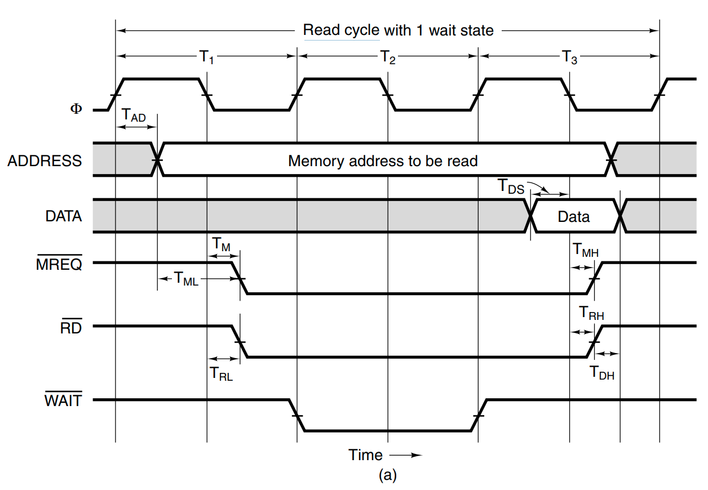

* **Clock**
* **ADDRESS**: Bevat het adres van het geheugen dat aangesproken wordt
* **DATA**: bevat de data
* **MREQ**: Geeft aan of geheugen of een I/O device wordt aangesproken
* **RD**: Geeft aan of het gaat om een read of een write
* **WAIT**: wordt geactiveerd om de cpu te vertellen om te wachten (want de data is er nog niet)

De bus kan met deze parameters in 3 cycli een woord uitlezen.

Werking:

* $T_1$
  * Cpu zet adres van het woord dat hij wilt op de adreslijn
  * Wanneer de adreslijn stabiel is, worden $\overline{RD}$ en $\overline{MREQ}$ geactiveerd om aan te geven dat het om een read gaat op het geheugen
* $T_2$ 
  * Omdat het 15 nsec duurt voordat het stabiel is (al deels in $T_1$) kan de gevraagde data nog niet voorzien worden in $T_2$, de $\overline{wait}$ line wordt geactiveerd en plaatst **wait states** totdat het geheugen klaar is.
* $T_3$
  * Wanneer hij zeker is dat hij de data zal hebben, zet het geheugen $\overline{wait}$ uit. 
  * Het geheugen zet de data op de datalijnen
  * De cpu leest de datalijnen en zet de waarden op een intern register


## Vraag 24

> Gegeven volgende synchrone bus: Maak van deze bus een asynchrone bus. Welke signaallijnen moeten weg en welke komen erbij? Bespreek de werking van de door jou voorgestelde asynchrone bus. (pagina 194-196)

```
sleutelwoorden:
klok weg, wait weg
MSYN (master sync) en SSYN (slave sync) toevoegen (beide inverse signalen)
om te tekenen -> klokpulsen weg, dan MSYN, data en SSYN vanachter

stappen:
	- master zet adres op lijn
	- RD en MREQ voor read/write en memory/io
	- master zet MSYN op 0, slave werkt 
	- slave klaar? hij zet SSYN op 0 als hij de data op de databus heeft gezet
	- master maakt adreslijnen leeg, zet MSYN op 1
	- slave ziet MSYN, zet SSYN op 1, einde
	
```


**Maak van deze bus een asynchrone bus**

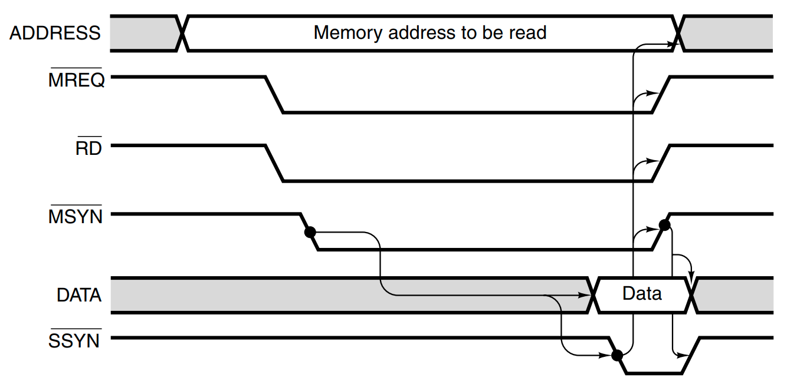

**Welke signaallijnen moeten weg?**

De klok ($\phi$) en de $\overline{wait}$-lijn.

**Welke komen erbij?**

$\overline{MSYN}$ en $\overline{SSYN}$ 

**Bespreek de werking van de door jou voorgestelde asynchrone bus.**

* De master bus zet het adres op de adreslijn.
*  $\overline{RD}$ (read of write) en $\overline{MREQ}$ (I/O of geheugen), worden aangezet 
* Master bus zet $\overline{MSYN}$ (master synchronisation) aan, wanneer de slave dit ziet werkt hij zo snel hij kan
* Wanneer de slave klaar is zet hij $\overline{SSYN}$ aan, als de master dit ziet, weet hij dat de data klaar is.
* De master maakt de adreslijnen leeg en zet  $\overline{RD}$, $\overline{MREQ}$ en  $\overline{MSYN}$ uit.
* Wanneer de slave ziet dat $\overline{MSYN}$ uit is, zet hij $\overline{SSYN}$ uit een zitten we terug bij het begin.


## Vraag 25

> Maak een schets van een gecentraliseerde bus arbiter gebruikmakend van daisy chaining met twee prioriteitsniveaus. Wat bedoelt men met een gecentraliseerde arbiter? Op welke manier kan een device een aanvraag indienen? Hoe kan je er voor zorgen dat het verkiezingsproces voor het volgende device reeds kan starten terwijl een ander device de bus gebruikt? Waar zou je de CPU plaatsen in deze schakeling? (pagina 196-197)

```
tekening: twee requestlijnen naar arbiter met apparaten in wired or, apparaat op 1 van de twee
twee grantlijnen: gaan door alle apparaten in serie

gecentraliseerde arbiter: één apparaat dat op aanvragen antwoordt, in tegenstelling tot ...
aanvraag indienen: requestlijn activeren, wired or dus arbiter weet niet wie, cpu stuurt grant die via daisy chaining door alles gaat en device dat heeft gevraagd antwoordt

verkiezing starten terwijl transfer bezig: derde lijn, device zet hem aan als hij grant accepteert, dan kan volgende master al geselecteerd worden

CPU plaatsing: laagste prioriteit, hij kan altijd wachten, draaiende dingen niet
```

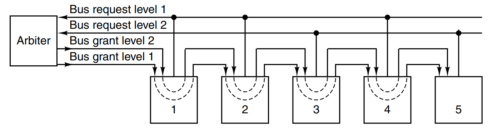

**Wat bedoelt men met een gecentraliseerde arbiter?**

In tegenstelling tot gedecentraliseerde busarbitratie hebben we één apparaat (de arbiter) dat op aanvragen voor toegang tot de bus antwoordt en beslist welk apparaat de bus mag gebruiken.

**Op welke manier kan een device een aanvraag indienen?**

Door de requestlijn te activeren (in dit geval zijn er wel meerdere). Op elke requestlijn zitten de devices in wired-OR aangesloten. De arbiter weet dus niet welk van de devices het request heeft gedaan. De cpu stuurt een grant op de grant lijn, die dan eerst langs apparaat 1 gaat, dan 2, ... Het eerste apparaat in de rij dat effectief een grant heeft aangevraagd, zal hem dan ontvangen en toegang tot de bus krijgen. Dit noemt men **daisy chaining**.

**Hoe kan je er voor zorgen dat het verkiezingsproces voor het volgende device reeds kan starten terwijl een ander device de bus gebruikt?**

Door **een derde lijn** toe te voegen die apparaten kunnen activeren wanneer ze de grant geaccepteerd hebben en toegang krijgen tot de bus. Dan kunnen apparaten toegang tot de bus vragen terwijl het eerste apparaat hem nog gebruikt. Tegen de tijd dat het eerst apparaat klaar is, zal de volgende bus master al geselecteerd zijn en kan de volgende ronde beginnen.

**Waar zou je de CPU plaatsen in deze schakeling? **

Op de laagste prioriteit, want de CPU kan altijd wachten, veel I/O devices met draaiende onderdelen kunnen dit niet.

##  Vraag 26

> Wat is de meest eenvoudige manier om zonder daisy chaining aan gedecentraliseerde busarbitrage te doen? (pagina 198)

Als we voor elke device een request line maken. Alle devices luisteren ook naar de request lines van de andere devices, dus op het einde van elke buscyclus weet het apparaat dat een request stuurt of hij de requester is met de hoogste prioriteit. Voor deze methode hebben we meer buslijnen nodig, maar geen arbiter. Het aantal devices is ook beperkt door het aantal buslijnen

```
sleutelwoorden:
request line voor elk device, alle devices luisteren dus ze weten of zij aanvraag met hoogste prioriteit zijn
-> meer buslijnen, maar geen arbiter nodig, devices beperkt door aantal buslijnen
```


## Vraag 27

> Bespreek stap voor stap hoe een interrupt afgehandeld wordt op de 80x86 m.b.v. de 8259A prioriteitsinterruptcontroller. Begin vanaf het moment dat een device via een IRQlijn interrupt geeft en stop van zodra de CPU aan de 8259A meldt dat hij afgehandeld is. Waarvoor dienen de andere signaallijnen zoals A0, RD, WR,… van de 8259A? (pagina 200)

```
- device activeert IR
- 8259A zet INT aan
- als cpu kan afhandelen -> INTA (acknowledge)
- 8259A zegt welk apparaat (op D, databus) 
- cpu gebruikt dit om te zoeken in interrupt vector
- interrupt klaar, software zet speciale code op register van 8259A -> hij zet INT uit (behalve als nog een interrupt)

andere lijnen -> A0 (adres), RD(read), WR(write), CS (chip select)
-> om registers 8259A aan te spreken (gebruikt buscycli)
```

(tekening gegeven)

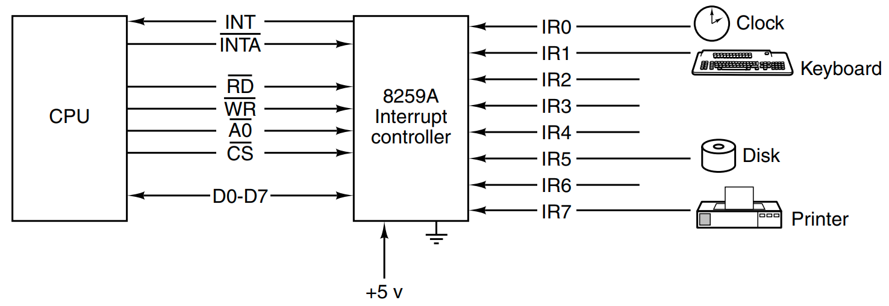

**Bespreek stap voor stap hoe een interrupt afgehandeld wordt op de 80x86 m.b.v. de 8259A prioriteitsinterruptcontroller.**

* Het device activeert de inputlijn (IR)
* Wanneer één of meer inputlijnen geactiveerd zijn, zet de 8259A de INT (interrupt) lijn aan. Deze is rechtstreeks verbonden met de interrupt pin op de cpu
* Als de cpu de interrupt kan afhandelen, stuurt hij een signaal op INTA (interrupt acknowledge) terug naar de 8259A
* De 8259A zegt welk apparaat de interrupt heeft gestuurd door zijn nummer op de databus te zetten
* De hardware van de CPU gebruikt dit getal om de procedure die gedraaid moet worden te vinden in de **interrupt vector**
* Wanneer de software klaar is met de interrupt af te handelen zet hij een speciale code in één van de registers van de 8259A, waardoor hij INT uitzet (behalve als er nog een interrupt moet afgehandeld worden)

**Waarvoor dienen de andere signaallijnen zoals A0, RD, WR,… van de 8259A?**

RD (read), WR(write), A0(adreslijn), CS(chip select), deze worden gebruikt door de cpu om de registers van de 8259A aan te spreken gebruik makend van gewone buscycli.


## Vraag 28

> Geef zoveel mogelijk eigenschappen/kenmerken van de i7-CPU (algemeen, uitbereidingsmogelijkheden, warmteproblematiek, interruptmechanismes, energieconsumptie,..). (pagina 201-206)

```
sleutelwoorden:
algemeen ->
8088 backwards, 64-bit, multicore, hyperthreaded cores, 4 instructies tegelijk, L1 (split), L2(unified), L3(unified), elke core eigen L1 en L2 (kan stale zijn, dus snooping = luisteren)

uitbreiding -> QPI (quick path interconnect), meer dan 6 cores mogelijk
warmte -> tot 150 watt, sleep mode met 5 gradaties, geleidende verpakking & koeling, thermal throttling (cyclussen skippen)

interrupts -> backwards met 8088 of nieuwe APIC (advanced programmable interrupt controller)

energie-> 150 watt = veel, kut met batterijen
```

**Algemeen** 

* Backwards compatible met 8088
* 64-bit registers
* Nieuwe instructies voor cryptografische bewerkingen
* multicore CPU (2 tot 6 of meer in de toekomst)
* Cores zijn hyperthreaded (meerdere hardware threads kunnen tegelijk actief zijn)
* Kan tot 4 instructies in één keer uitvoeren
* 3 cacheniveaus: 
  * L1 (32KB instruction, 32KB data)
  * L2 (256KB unified)
  * L3 (4-15MB unified, gedeeld door alle cores)
  * Elke core heeft zijn eigen L1 en L2, dus kan het soms dat er oude (*stale*) waarden inzitten. Daarom doet elke core aan *snooping* (op de memory bus luisteren en pakken als er iets voorbij komt dat hij heeft)

**Uitbereidingsmogelijkheden**

* Er is ruimte voorzien voor meer dan 6 cores
  * Kunnen via de *QPI* (Quick Path Interconnect) port aangesloten worden

**Warmteproblematiek**

* Verbruikt 17- 150 Watt, ongeveer even veel als een gloeilamp, warmte wordt beperkt door:
  * Warmtegeleidende verpakking en koeling
  * Kan in *sleep mode* gezet worden (zijn 5 gradaties in, waar dan tussenin sommige functies zoals snooping nog aan blijven)
  * *Thermal throttling* wordt gebruikt als de andere koelsystemen niet genoeg zijn en er snel warmte weg moet
    * CPU alleen elke *n*de klokcyclus laten draaien
* Kan volgens het boek gebruikt worden als *camp stove* 

**Interruptmechanismes**

* Kan interrupts op dezelfde manier gebruiken als de 8088 (backwards compatibility)
* Kan een nieuw systeem, genaamd *APIC* (Advanced programmable interrupt controller) gebruiken.

**Energieconsumptie**

* 17- 150 watt, niet handig bij apparaten met batterijen


## Vraag 29

> Hoe wordt “pipelining” voorzien op de DDR3 SDRAM geheugenbus? Welke verschillende fasen zijn er en maak/bespreek een schets. Leg uit hoe, waar en waardoor er overlap van geheugenaanvragen kan optreden. (pagina 206-208)

```
meerdere banks parallel

activate: open rij & maak klaar (1 tussen deze en volgende)
read/write: aanvraag naar verschillende woorden binnen rij of burst mode (opeenvolgend in rij) (col)
precharge: sluit rij en bereidt voor (cyclus na vorige)

tekening: CK, CMD (act, read, write), addr (row, col), Data (data)
//TODO tekening oefenen

overlap: act bank 1 direct na act bank 0
```

**Hoe wordt “pipelining” voorzien op de DDR3 SDRAM geheugenbus?**

Doordat de DDR3 DRAMs zijn georganiseerd in meerdere **banks** (blokken geheugen, typisch 8) binnen de chip. Deze banks kunnen in parallel aangesproken worden (max 4 tegelijk). Door een geheugenaanvraag in 3 fasen te splitsen kunnen we deze ook gaan pipelinen.

**Welke verschillende fasen zijn er en maak/bespreek een schets.**

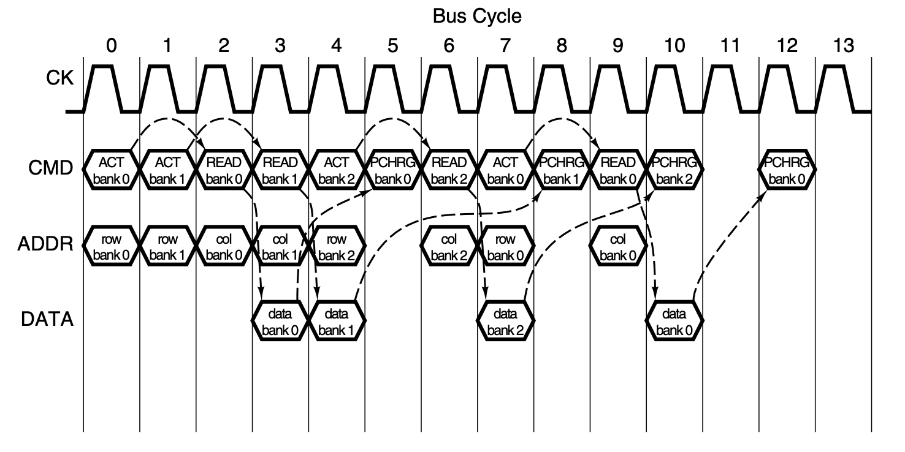

4 signaalpaden:

* Clock (CK): We volgen de klok, dit is dus synchrone ram
* Command(CMD): het type commando dat opgedragen wordt aan de DRAM (ACT, READ, ...) 
* Address (ADD): het adres (rij of kolom) van het geheugen dat wordt aangesproken
* Data: de data die komt vanuit het geheugen


Een memory request heeft 3 stappen:

1. **ACTIVATE**: opent een DRAM geheugenrij, dit maakt hem klaar voor volgende geheugenaanvragen.

2. **READ** of **WRITE**: hier kunnen meerdere aanvragen naar individuele woorden gedaan worden binnen de geopende rij. Of een aanvraag naar meerdere opeenvolgende woorden binnen de huidige rij (burst mode).

3. **PRECHARGE**: sluit de huidige rij en bereidt de DRAM voor voor de volgende ACTIVATE

**Leg uit hoe, waar en waardoor er overlap van geheugenaanvragen kan optreden. **

Op de tekening kan je dit duidelijk zien. Omdat er meerdere banks zijn, kan het dat twee geheugenaanvragen op de DDR3 interface gepipelined worden. Als we bijvoorbeeld een aanvraag doen naar bank 0 en direct daarna eentje naar bank 1, komt de ACT van bank 1 direct na die van bank 0, en daarna pas de read van bank 0. In de volgende cyclus kan dan de data van bank 0 al worden verstuurd terwijl de read van bank 1 bezig is. //TODO verduidelijking


## Vraag 44

> Maak een schets van een PIO-module met drie 8-bit digitale I/O-poorten. Welke signaallijnen zijn er? Er zijn 4 adressen nodig, waarvoor worden die adressen gebruikt? (pagina 233)

```
PIO -> parallel input/output
tekening
	- rechts A,B,C (8 bits breed, beide richtingen)
	- CS, WR, RD, RESET
	- A0-A1 (adreslijnen, 4 mogelijke adressen)
	- D0-D7 (databus)
	
//TODO tekening oefenen
4 adressen: komen overeen met 4 interne registers, spreken A, B, C en poortconfiguratieregister aan
poortconfiguratieregister -> alle mogelijke combinaties in/output voor A,B,C instellen
```


(tekening dus niet gegeven)

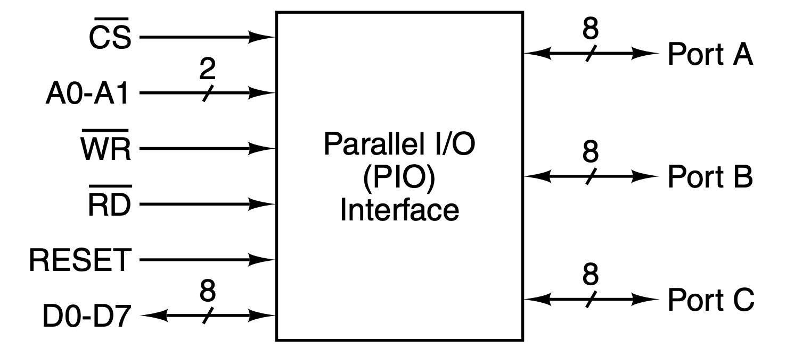

**Welke signaallijnen zijn er?**

* Chip select (CS): voor als we meerdere PIO interfaces combineren om een grotere te maken
* Adreslijnen (A0-A1): hierover straks meer
* Write en Read (WR en RD): om aan te geven of het om een read of write gaat
* RESET: om de chip te resetten
* D0-D7: verbinding met databus
* Port A-B-C: digitaal signaal in/output

**Er zijn 4 adressen nodig, waarvoor worden die adressen gebruikt?**

De adressen selecteren elk één van de vier *interne registers*, die op hun beurt overeenkomen met de poorten A, B, en C of het poortconfiguratieregister. Door de juiste waarden in te stellen in het *poortconfiguratieregister* kunnen we eender welke combinatie van in- of output toelaten voor elk van de poorten.


## Vraag 45

> Veronderstel dat je op een CPU met 16-adreslijnen een 2048 bytes ROM-module wil aansluiten, een 2048 bytes RAM-module en een PIO-module met drie I/O-registers. Voorzie voor deze modules ‘handige’ adressen en geef de geheugenmap van de CPU. Wat wordt er bedoeld met memory mapped I/O? Wat wordt er bedoeld met partiële adresdecodering en waarom wordt het ontraden? (pagina 234-235) 

```
16-adreslijnen -> 0000 tot FFFF (2 bytes)
rom op begin -> 0000 (hoogste bit altijd 0)
Ram op midden-> 8000 (hoogste twee bits altijd 10)
PIO op het einde -> drie registers -> FFFF -3 = FFFC (hoogste twee bits altijd 11)

memory mapped io -> io geheugenadres geven ipv buslijn, behandelen als geheugen
partiele adresdecodering, in dit geval alleen eerste twee bits lezen en we weten welk apparaat, maar we verspillen super veel adresruimte
```

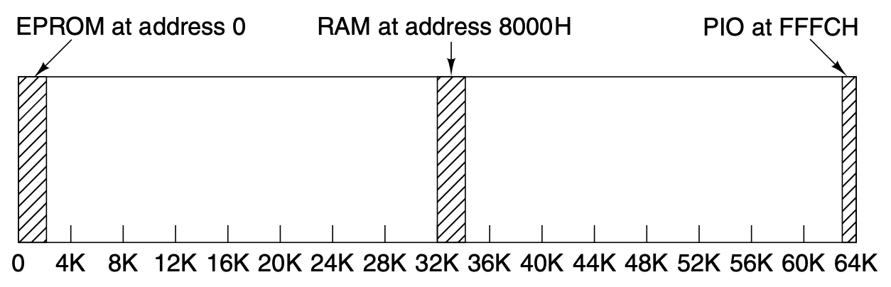

Door onze **ROM** helemaal vooraan te plaatsen weten we dat al zijn adressen van de vorm 0000 0xxx xxxx xxxx zullen zijn. 

Gelijkaardig voor **RAM**, door hem op 8000h te laten beginnen: 0000 0xxx xxxx xxxx

We zetten de adressen voor de **PIO** helemaal op het einde, zodat ze van de vorm 1111 1111 1111 11xx zijn.


**Wat wordt er bedoeld met memory mapped I/O?**

In tegenstelling tot een aparte buslijn aan te leggen om aan te geven dat een I/O apparaat wordt aangesproken, kunnen we onze I/O apparaten een geheugenadres geven en ze behandelen alsof er iets uit het geheugen wordt opgehaald. In het verhaal van onze PIO kunnen we 4 bytes geheugenruimte vrijmaken voor de 3 poorten en het controleregister.

**Wat wordt er bedoeld met partiële adresdecodering en waarom wordt het ontraden?**

We gaan maar een deel van het adres lezen om te weten wat we moeten doen. In dit geval kunnen we door louter de eerste twee bits uit te lezen weten of we de ROM (00), RAM(10), of PIO(11) willen aanspreken. Dit heeft bijvoorbeeld wel als gevolg dat elk adres dat begint met een 0 de ROM aanspreekt. Als we de overblijvende adressen willen gebruiken, mogelijk in de toekomst, kunnen we deze techniek beter niet toepassen.


# Hoofdstuk 4

## Vraag 46

> Via welke twee registerparen kunnen er op de MIC-1 geheugenoperaties plaatsvinden? Wat is het verschil tussen beide? Welk probleem treedt er op wanneer je weet dat er slechts één adresbus voorhanden is en hoe wordt het opgelost? Wanneer kunnen er binnen een datapadcyclus geheugenoperaties gestart worden en wanneer zal het resultaat beschikbaar zijn? Wat wordt er bedoeld met sign extension en waar/waarom wordt het op de MIC-1 toegepast? (pagina 249-250)

```
- MDR (memory data register) en MAR (memory address register) 32-bit read en write
- PC en MBR(memory buffer register) 8-bit alleen read

MAR woordadressen (4 bytes) en PC byteadressen, komen niet overeen 
geheugen kent alleen bytes, opl -> 0de bit van MAR op 2de bit adresbus (dan spreekt het adres bytes aan), bovenste 2 bits MAR weggooien

wanneer geheugenoperatie starten -> einde datapadcyclus, resultaat pas baschikbaar op einde volgende cyclus

sign extension -> in dit geval 8-bit signed int naar 32)bit signed int, als negatief aanvullen met 1tjes
waarom -> B-bus is 32-bit, MBR maar 8 en die moeten op de b bus geraken
```

**Via welke twee registerparen kunnen er op de MIC-1 geheugenoperaties plaatsvinden?**

* Een 32-bit woordadresseerbare poort
  * MAR (memory address register)
  * MDR (memory data register)
* 8-bit byteadresseerbare poort
  * PC (program counter) leest de low-order byte van MBR (memory buffer register)

**Wat is het verschil tussen beide?**

De tweede kan enkel lezen.

**Welk probleem treedt er op wanneer je weet dat er slechts één adresbus voorhanden is en hoe wordt het opgelost?**

MAR bevat woordadressen en PC bevat byteadressen. Als we een 2 in PC steken lezen we byte 2 uit het geheugen, als we een 2 in MAR steken lezen we byte 8-11 (één woord) uit. Het probleem is dat MAR moet kunnen werken met woordadressen, maar het fysieke geheugen enkel werkt met bytes. We kunnen dit simpel oplossen Door bit 0 van MAR op lijn 2 (1 op 3, 2 op 4, ...) aan te sluiten. En de bovenste twee bits van MAR weg te flikkeren (we hebben ze toch niet nodig voor ons kutgeheugen van 4GB).  

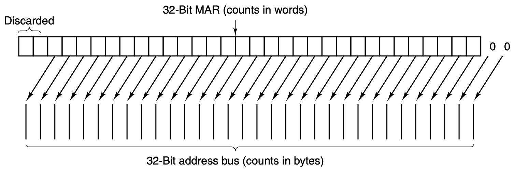

**Wanneer kunnen er binnen een datapadcyclus geheugenoperaties gestart worden en wanneer zal het resultaat beschikbaar zijn?**

Een geheugenoperatie kan gestart worden op het **einde** van de datapadcyclus. Het resultaat is pas beschikbaar op het einde van de **volgende** cyclus.


**Wat wordt er bedoeld met sign extension en waar/waarom wordt het op de MIC-1 toegepast?**

Om van een 8-bit signed integer een 32-bit signed integer te maken en de zelfde numerische waarde te behouden moeten we doen aan **sign extension**. Als de hoogste bit van ons 8 bit getal een 1 is zetten we er allemaal 1tjes voor, als deze 0 is zetten we er nullen voor. 

Omdat we de 8-bit waaren van het MBR register op de B-bus willen krijgen. De B-bus werkt enkel met 32-bit getallen. 


## Vraag 47

> Gegeven de microarchitectuur van de MIC-1. Leg gedetailleerd uit hoe een datapadcyclus op de MIC-1 verloopt. Enerzijds wordt er gevraagd welke signalen er naar het datapad gestuurd worden en welke timing er hierbij gebruikt wordt en anderzijds hoe het adres van de volgende micro-instructie zal worden bepaald. Waarom is de MPC een virtueel register? (pagina 251, 253-257)

```
sleutelwoorden: 4 tijsintervallen
1. control store zet bevel in mir (w lang)
2. register wordt op b bus gezet, alu & shifter operatie gekozen (x lang)
3. alu en shifter doen hun ding (y lang)
4. resultaat via C naar registers, N en Z zijn gezet, volgende commando in MPC (z lang)

adres volgende -> NEXT_ADDRESS veld van de huidige microinstructie
als JAMN of JAMZ aanstaat zal de z en/ of de n flip-flop in de high bit van MPC ge-ORed worden
bij de laatste microinstructie -> allemaal nullen met JMPC op 1 -> dan volgende grote instruct van MBR naar MPC

waarom mpc virtueel? waarden evengoed rechtstreeks door naar control store, zolang ze op falling edge daar zijn is er geen probleem (dan kan MIR z'n ding doen)
	
```

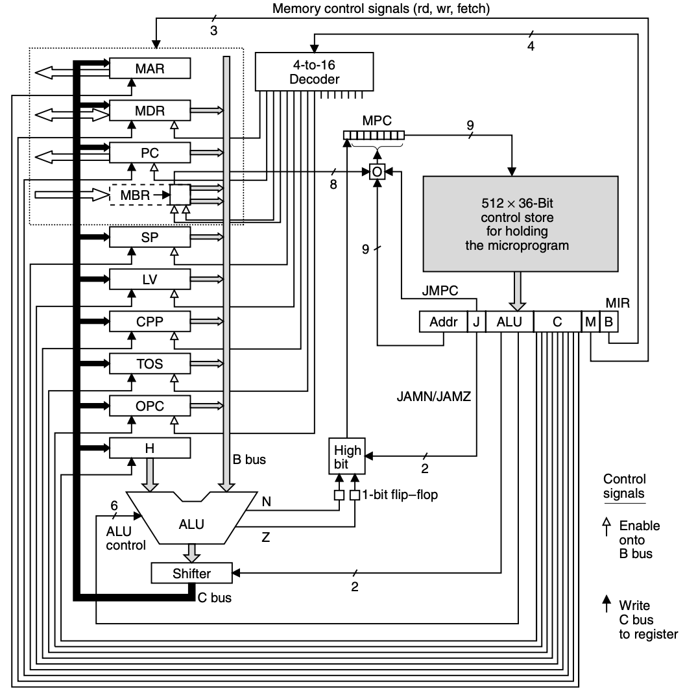

We zullen ons verhaal beginnen bij de **MIR** (Microinstruction register). De MIR bevat de huidige microinstrucie die de signalen naar het datapad zal aansturen. We maken onderscheid tussen zes signaalgroepen:

1.  **Addr**: 
2. **J** (Jam): 
3. **ALU**: bevat 8 bits, 6 om de ALU functie te selecteren en 2 om de shifter aan te sturen
4. **C**: laat individuele registers de ALU-output uit de C-bus laden
5. **M**: besturen geheugenoperaties
6. **B**: bestuurt de decodeerder die beslist wat er op de B-bus gezet wordt


**Leg gedetailleerd uit hoe een datapadcyclus op de MIC-1 verloopt.**

Om de uitleg te verduidelijken spreken we een aantal tijdsintervallen af:

* $\Delta w$: De laadtijd van MIR 
* $\Delta x$: de tijd om de registers te laden op de B-bus
* $\Delta y$: de tijd om door de ALU en shifter te gaan
* $\Delta z$: de tijd om het resultaat door de C-bus terug naar de registers te sturen

Elke keer als je een van deze symbolen ziet, zitten we die hoeveelheid tijd verder in het verhaal.


We splitsen de werking op in subcycli:

1. De MIR wordt gevuld met het woord uit de control store waarnaar MPC wijst + $\Delta w$
2. Meerdere signalen begeven zich naar het datapad
   * Een register wordt op de B-bus gezet
   * De ALU ontvangt welke operatie hij moet uitvoeren
   * \+$\Delta x$
3. De ALU en shifter doen hun ding + $\Delta y$
4. De waarden van de ALU, N, Z en de shifter zijn stabiel
   * N en Z worden opgeslagen in een paar 1-bit flip-flops
   * De resultaten worden naar de registers geladen
   * MPC (volgende instructie) wordt ingeladen
   * \+$\Delta z$

Alle resultaten zijn opgeslagen en de resultaten van vorige geheugenoperaties zijn beschikbaar. Dit proces herhaalt zich totdat de persoon in kwestie genoeg diamonds heeft gehakt in minecraft en zijn pc uitzet.


**Hoe wordt het adres van de volgende micro-instructie bepaald?**

In het beste geval vind je het adres van de volgende miscroinstructie in het NEXT_ADDRESS veld van de huidige microinstructie.

Microinstructies worden niet in de volgorde dat ze in de control store staan uitgevoerd. De berekening van de volgende microinstructie begint nadat MIR ingeladen en stabiel is.

* NEXT_ADDRESS word gekopieerd naar MPC, tegelijk wordt het JAM veld geïnspecteerd (gebeurt in 'High-bit' op de figuur)
  * JAMN = 1: de N flip-flop word ge-ORed in de hoogste bit van MPC 
    * De n flag geeft aan dat het resultaat van de alu negatief was
  * JAMZ = 1: de Z (zero) flip-flop word ge-ORed in de hoogste bit van MPC
    * De z flag geeft aan dat het resultaat van de alu nul was
  * Beide aan: Dan worden N en Z ge-ORed in de hoogste bit van MPC
  * Beide uit: er gebeurt niets extra
* (N en Z zijn de ALU flags, we hebben ze nodig omdat we op dit punt niet meer weten of de inhoud van de ALU correct is)
* Bij de laatste microinstructie gaat het NEXT_ADDRESS veld bestaan uit allemaal nullen, met JMPC op 1. Dit geeft aan dat MBR naar MPC gekopieerd moet worden.

**Waarom is de MPC een virtueel register?**

Omdat al zijn inputs even goed rechtstreeks doorgevoerd kunnen worden naar de control store. Het is niet nodig om ze effectief op te slaan in MPC. Zolang de waarden aanwezig zijn in de control store op de falling edge van de clock wanneer MIR is geselecteerd en wordt uitgelezen, hebben we geen probleem. 


## Vraag 48

> Waarom wordt er voor lokale variabelen gebruikgemaakt van een stapel? Waarom kan je dus niet aan elke variabele een uniek adres toekennen?

Als we onze variabelen binnen een procedure elk een geheugenadres toekennen, en de procedure dan zichzelf oproept, zijn we genaaid. De procedure overschrijft zijn eigen waarden. Door de lokale variabelen op een stapel te zetten kan onze recursief opgeroepen procedure zijn variabelen gewoon bovenop de stack keilen zonder die van de vorige te verkloten.

```
variabelen eigen geheugenadres -> zichzelf overschrijven bij zichzelf oproepen
beter op stack
```


## Vraag 49

> Wat wordt er bedoeld met de datapadlengte? Welke drie zaken worden er toepast op de MIC-1 om tot de MIC-2 te komen (gewoon benoemen en wat uitleg over geven, zeker geen MAL-code voorzien)? (pagina 285-287)

```
lengte -> aantal microinstructies per ISA instructie

interpreter loop samenvoegen met microcode (branch achteraan sequence)
three bus architectuur -> twee volledige bussen (A en B) elk register met elk ander optellen in 1 cyclus
IFU -> onafhankelijk instructies ophalen, neemt last van ALU af, IFU kan zelf de PC incrementeren
```

**Wat wordt er bedoeld met de datapadlengte?**

Het aantal microinstructies dat moet uitgevoerd worden per ISA instructie.


**Welke drie zaken worden er toepast op de MIC-1 om tot de MIC-2 te komen**

1. De Interpreter Loop samenvoegen met de Microcode
   * Bij elke set microinstructies die eindigt door te branchen naar Main1, kunnen we Main1 achteraan deze sequentie steken in plaats van aan het begin van de volgende instructie.
2. Three-Bus Architectuur
   * We geven de ALU twee volledige inputbussen, een A- en B-bus, nu kunnen we elk register met elk ander register optellen in één cyclus
3. Instruction Fetch Unit (een gespecialiseerde unit om instructies uit het geheugen te halen)
   * Als een instructie extra velden nodig heeft (operanden), moeten deze expliciet, byte per byte gefetched worden. Dit houdt de ALU ten minste één cyclus per byte bezig (PC incrementeren en de resulterende index of offset berekenen). 
   * Door een instruction fetch unit (IFU) in te voeren die deze taken overneemt van de ALU kunnen we onze performantie aanzienlijk verhogen. Onze IFU kan dan zelfstandig PC incrementeren en bytes van de bytestream halen voordat ze nodig zijn. 


## Vraag 50

> Maak een schets van de IFU die men bij MIC-2 gebruikt? Beschrijf welke registers er zijn en hoe de interne werking verloopt? Voorzie voor de interne buffer een FSM. Waarom wordt de C-bus door de IFU constant in de gaten gehouden? (pagina 288-290)

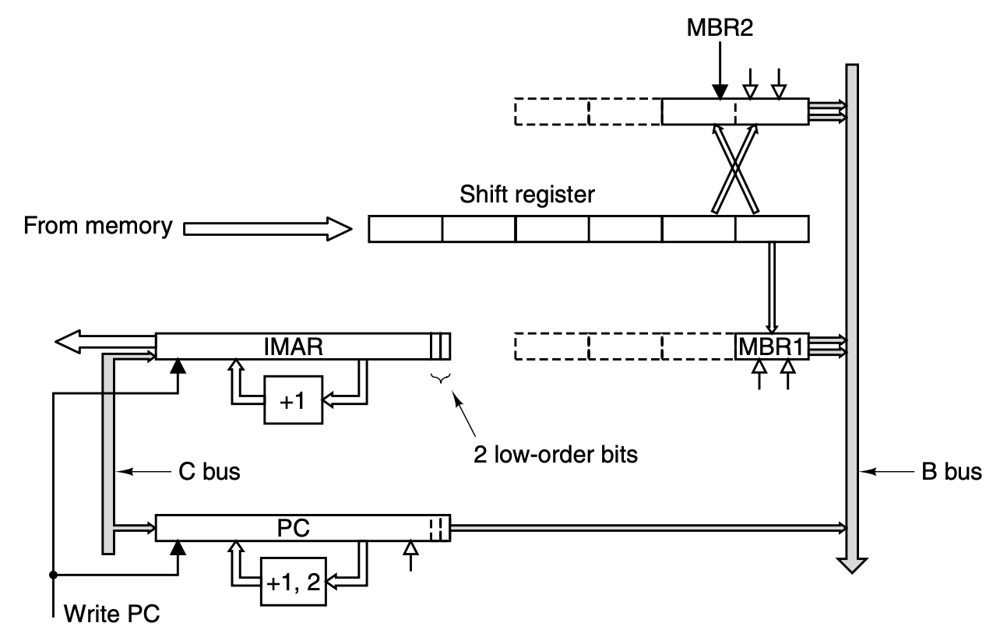

```
MBR1: 1 byte, naar b bus
MBR2: 2 bytes, naar b bus
shift register: 6 blokken, gekruist op MBR2
IMAR: bevat woordadres (eigen incrementer)
PC: (eigen incrementer, 1 of 2 bytes), gaat naar b bus
C bus: gaat naar IMAR en PC
nog een lijntje naar IMAR en PC om naar PC te schrijven

FSM: 6 bollen
word fetched = + 4
read MBR1 = -1
read MBR2 = -2

C bus in de gaten -> als naar PC geschreven wordt -> jump of return ofzo naar ander adres -> IMAR heeft adres nodig om nieuwe waarden in shift te stoppen + oude uit shift weg
```


* **Shift register**: bevat een wachtrij van bytes uit het geheugen om MBR1 en MBR2 te voorzien van data
  * Schuift vanzelf 1 byte op wanneer MBR1 wordt uitgelezen
  * Schuift vanzelf 2 bytes op wanneer MBR2 wordt uitgelezen
* **MBR1**: (memory buffer register): Bevat telkens de oudste byte uit het shift register
* **MBR2**: bevat telkens de oudste twee bytes uit het shift register (worden gekruist omdat het een big endian systeem is)
* **IMAR**: beschikt over een eigen incrementer om telkens het volgende woord uit te lezen. Hier zit dus het adres van het woord dat ingelezen zal worden en in het shift register geplaatst zal worden.
* **PC**: programmateller

**Voorzie voor de interne buffer een FSM.** (finite state machine)

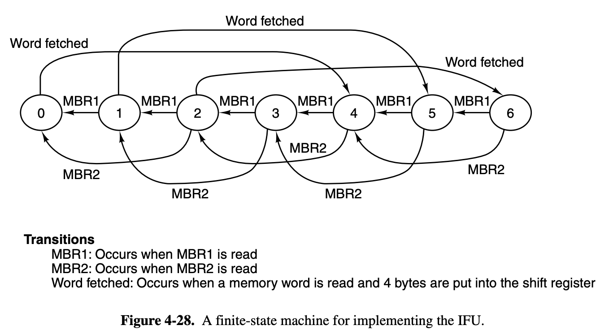

Mini uitleg. De nummertjes zijn hoeveel bytes zich in shift register bevinden. Deze is 6 bytes groot. Als we een woord ophalen komen er 4 bytes bij. Stoppen we een byte in MBR1, dan gaat er een byte weg. Stoppen we twee bytes in MBR2, gaan er twee bytes weg. Dit diagram toont simpelweg alle mogelijkheden.

**Waarom wordt de C-bus door de IFU constant in de gaten gehouden?**

We moeten weten wanneer de programmateller (PC) aangepast wordt. Dit gebeurt bij een methode oproepen, jump of return, etc. Als dit gebeurt is alles in het shift register ongeldig en moeten we snel nieuwe datawaarden inladen. Dit doen we door de nieuwe waarde van PC te kopieren naar IMAR.


## Vraag 51

> Gegeven de micro-architectuur van de MIC-2 Welke drie zaken moet men toevoegen om van dit ontwerp naar een gepipelinede versie met vier stages te evolueren en waarom? Welke vier fasen kent de MIC-3? (pagina 295- 299)

```
3 registers: A,B en C -> splitst op
1 toer = nu 3 cycli maar we kunnen de klok sneller laten tikken en instructies pipelinen

4 fasen
instructie ophalen
registers naar A en B schrijven (operanden voorzien)
ALU operatie in C stoppen
write back naar registers
(sidenote: gevoelig aan RAW)
```

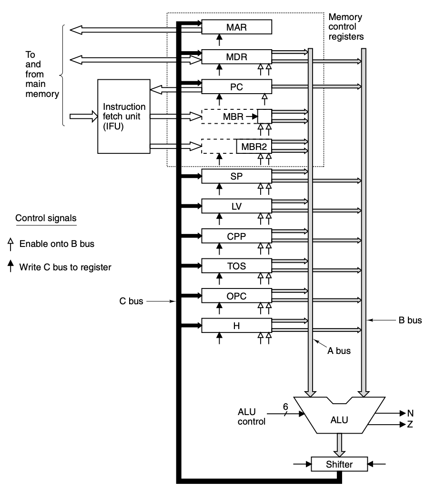

**Welke drie zaken moet men toevoegen om van dit ontwerp naar een gepipelinede versie met vier stages te evolueren en waarom?**

3 registers:

* A latch register
* B latch register
* C latch register

Deze registers splitsen het datapad in 3 stukken. We zetten De A en B registers vlak voor de ALU, op de A en B bus. Het C register plaatsten we na de shifter. Op deze manier kan er bijvoorbeeld al een nieuwe waarde op de A bus gezet worden terwijl de ALU nog bezig is met het vorige commando. Alhoewel we nu drie klokcycli nodig hebben om het datapad te doorlopen, is door het opsplitsen de delay per deel kleiner, waardoor we hogere kloksnelheden kunnen hanteren. Daarenboven kunnen we danzij deze opsplitsing ook instructies gaan pipelinen.


**Welke vier fasen kent de MIC-3? **

* Instructie ophalen
* Operanden voorzien (in A en B dus)
* ALU & shifter operations
* Writeback to the registers

Deze architectuur is gevoelig aan RAW (read after write) dependence. Dus als een microstap een register wilt lezen dat nog niet geschreven is.

## Vraag 52

> Gegeven de microarchitectuur van de MIC-4 Bespreek de werking van iedere fase van deze microarchitectuur. Leg daarnaast ook uit hoe een ISA-level instructie opgesplitst wordt in micro-operaties en welke problemen hierbij kunnen optreden. Wat is het verschil tussen een micro-instructie en een microoperatie? (pagina 300-303)

```
1. instructie ophalen
2. ROM geindexeerd op opcode, geeft index van eerste microoperatie in volgende stap (bevat ook lengte om verschil te maken tussen operanden en opcodes)
3. microoperaties worden gequeued tot final bit op 1, staan mooi achter elkaar
4. MIR1 vult A en B latch registers met operanden (van source registers)
5. MIR2 geeft aan welke ALU bewerking wordt gedaan
6. MIR3 verzekert write-back
7. MIR4 stuurt eventuele memory operaties aan

hoe ISA instructie opsplitsen:
decoder stuurt adres eerst microoperatie, queueing unit blijft queuen to final bit op 1
probleem als er een microbranch is, dan kan de pipeline niet verder (goto bit, rommel opruimen)
```

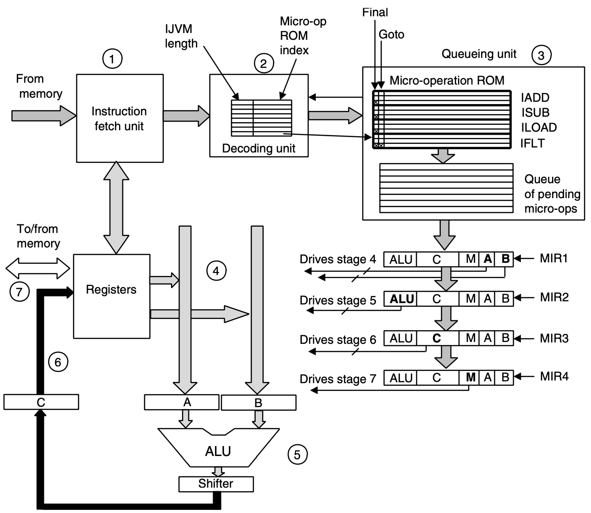

1. Instructies en operanden worden opgehaald en doorgestuurd naar de decoder

2. Decodeert de instructies

   1. Bevat een ROM array, geïndexeerd volgens de opcode van de intructies. Deze bevat de lengte van de instructie (om een verschil te kunnen maken tussen operanden en opcodes) en de index van de instructie in de volgende stap.

3. Hier bevinden de microoperaties zich, in een stukje ROM-geheugen en RAM-geheugen voor het implementeren van een queue

   1. Meer uitleg hieronder
   
4. MIR1: om de source registers in de latch registers A en B te stoppen.

5. MIR2: opdracht geven aan de ALU om één of andere berekening uit te voeren

6. MIR3: doelregisters aanduiden (write back verzekeren)

7. MIR4: start eventuele geheugenoperaties

   

**Leg daarnaast ook uit hoe een ISA-level instructie opgesplitst wordt in micro-operaties en welke problemen hierbij kunnen optreden.**

Onze decoding unit heeft een lijst van de opcodes. Wanneer hij een instructie krijgt, zal hij naar de queueing unit de index sturen van de eerste micro-operatie. Hij heeft een lijst met microoperaties en zal vanaf het startadres micro-operaties beginnen queuen totdat hij aan een operatie komt waar de final bit op 1 staat.

Problemen doen zich voor als er een microbranch voorkomt. Dan zal de pipeline niet verder kunnen gaan. De pipeline moet worden stopgezet en de rommel moet worden opgeruimd.

**Wat is het verschil tussen een micro-instructie en een micro-operatie?**

Iedere microinstructie duidt zijn opvolger aan (NEXT_ADDRESS, JAMN en JAMZ). Bij een micro-operatie staan ze mooi in volgorde dus is dit niet nodig. De final bit duidt de laatste instructie aan en de goto bit geeft aan of er een microbranch is (hayek).

## Vraag 53

> Wat is het idee achter cachegeheugens waardoor performantiewinst geboekt wordt? Geef hierbij een aantal voorbeelden. Geef twee mogelijke implementaties van cachegeheugens en bespreek de werking ervan. Met welke berekening kan je achterhalen op welke lijn een cachelijn zich zou moeten bevinden? Wat zijn de mogelijkheden bij schrijfoperaties? (pagina 304-310)

**Wat is het idee achter cachegeheugens waardoor performantiewinst geboekt wordt? Geef hierbij een aantal voorbeelden.**

```
idee -> klein snel, dingen die vaak nodig zijn hierin = winst
tijdelijke en ruimtelijke localiteit. arrays, queues, lussen

direct-mapped -> elk blok geheugen mapt op een lijn, om de aantal cachelijnen blokken terug bij het begin

set-associative-> meerdere direct mapped naast elkaar, dus meerdere entries per blok
	LRU (least recently used)-> bijhouden welke entry langst niet gebruikt is, die vervangen
	
berekening -> line bits uit adres halen om met index van de tabel bij de juiste lijn te raken //TODO meer info

schrijfoperaties -> 
	write back: wachten met schrijven bij hit, bij miss typisch wel lijn ophalen = write allocation
	write through: direct schrijven bij hit, typisch niks doen bij miss om het simpel te houden
```

Een cache houdt de meest recent gebruikte geheugenwoorden in een klein,  supersnel geheugen om toegang ertoe te versnellen. Als een groot genoeg percentage van de geheugenwoorden die de cpu nodig heeft in de cache zitten, kan er enorme performantiewinst geboekt worden.

<u>Ruimtelijke localiteit</u>

> Opeenvolgende adressen bevatten opeenvolgende instructies. - Wim
>

Als iets nodig hebt uit het geheugen, is de kans groot dat het volgende dinge dat je nodig hebt daar in de buurt zit. Kijk bijvoorbeeld naar arrays of queues. De elementen zitten mooi in volgorde in onze gegevensstructuur. Als we een element uit deze structuren gaan halen is ligt het volgende element er vlak naast in het geheugen.

<u>Temporale localiteit</u>

Als je iets recent nodig had is de kans groot dat je het in de toekomst opnieuw nodig hebt.

Lussen zijn hier een goed voorbeeld van. Een stapel ook, want je zit constant te werken rond de stack pointer.

**Geef twee mogelijke implementaties van cachegeheugens en bespreek de werking ervan.**

<u>Direct-mapped caches</u>

| Direct-mapped cache (a)                                      | 32-bit virtueel adres (b)                                   |
| ------------------------------------------------------------ | ----------------------------------------------------------- |
| 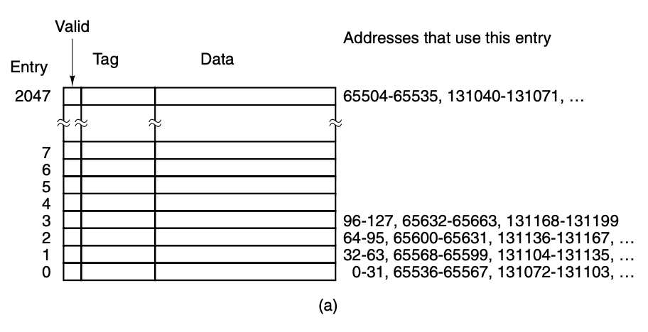 | 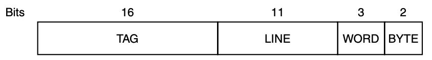 |

In elke rij van de direct-mapped cache zit exact één cachelijn uit het hoofdgeheugen. (a) Elke entry bestaat uit een:

* *Valid* bit: Zegt of deze lijn valid data bevat (staan allemaal op *invalid* bij system boot)
* *Tag* veld: bevat het adres waar de lijn vandaan komt in het hoofdgeheugen
* *Data* veld: bevat een kopie van de data in het geheugen

Een geheugenadres (b) (geproduceerd door de cpu) bestaat uit:

* *Tag* veld: zelfde als de tag bits in de cachelijn
* *Line* veld: geeft aan welk cache-item de nodige data bevat (als deze aanwezig is)
* *Word* veld: zegt welk woord binnen de lijn nodig is
* *Byte* veld: zegt welke byte binnen het woord nodig is (wordt meestal niet gebruikt)

Wat ze volgens mij in het boek niet zo goed uitleggen, is wat direct-mapped nu precies betekent. Als je een bepaald geheugenadres hebt, kan die maar op exact één plek in de cache uitkomen. Dus als als onze cpu een geheugenadres produceert, is er maar één plek in de cache om de corresponderende data te vinden. De figuur hieronder illustreert dit concept iets beter.


Een nadeel aan direct mapped caches zijn collisions. Als je bijvoorbeeld een cache hebt van 64KB, dan komt elke X + k*65.536 uit op hetzelfde cache-item. Dit zie je ook duidelijk op de tekening hierboven. De cache kan dus nooit (op de tekening) een stuk data uit adres 0 en adres 4 tegelijk bevatten.

<u>Set-associative caches</u>

Een 4-way set associative cache. 


Een set-associative cache houdt $n$ items bij voor elk geheugenadres. Nadat de juiste cachelijn is bepaald, moeten we ook nog tussen $n$ entries zoeken welke we nodig hebben. Wanneer we een nieuw stuk data in de cache willen steken, moeten we dus ook nog bepalen welke van de entries er weg moet. Hiervoor gebruikt met het **LRU (least recently used)** algoritme. Dit algoritme rangschikt onze entries op basis van welke het meest recent is geraadpleegd. Wanneer we een entry moeten vervangen, kijken we naar onze lijst en vervangen we diegene op het einde van de lijst (de oudste). 


**Met welke berekening kan je achterhalen op welke lijn een cachelijn zich zou moeten bevinden?**

Als de cpu een geheugenadres produceert, worden de *line* bits eruit gehaald om (via een index) de juiste cachelijn te vinden. Als deze lijn op *valid* staat, worden de *tag* bits van het cacheitem en het geheugenadres vergeleken. Als deze overeenkomen, hebben we een **cache hit** en kan het geheugenwoord uit de cache gelezen worden. Als het item niet op *valid* staat of de *tag* bits niet overeenkomen, hebben we een **cache miss**. In dit geval wordt de lijn uit het hoofdgeheugen gehaald en in de cache gestoken, in plaats van wat er daarvoor stond.

bij een set-associative cache gebeurt hetzelfde, maar zitten er op elke lijn $n$ entries. Elke entry van deze lijn word vergeleken met de *tag* bits. //TODO klopt dit wel?

**Wat zijn de mogelijkheden bij schrijfoperaties? **

Wanneer de cpu wilt schrijven, vormt dit een probleem voor onze cachegeheugens. Als de cpu een woord schrijft, en deze zit in het cachegeheugen, moet ofwel de cachelijn geupdate worden, ofwel wegegooid worden. Bijna alle systemen kiezen voor de eerste optie. Doordat ons woord nu al in de cache zit, kunnen we in principe wachten (totdat het door LRU weggesmeten wordt) met dit woord in het hoofdgeheugen te updaten. 

* Als we toch direct het hoofdgeheugen updaten, noemen we dit **write through**. Deze aanpak is simpeler en betrouwbaarder, maar vergt meer write traffic naar het geheugen. 

* Doen we dit niet, hebben we een iets ingewikkelder alternatief, genaamd **write back**. Het hoofdgeheugen wordt dus pas aangepast als de lijn uit de cache verdwijnt. Dit is sneller, maar vergt extra geheugenadministratie.

In de vorige paragraaf spreken we alleen over wat te doen wanneer de te schrijven lijn al in de cache zit. Als dit niet het geval is zijn er ook weer twee mogelijkheden. 

* De data naar de cache brengen bij een write miss. Deze methode noemt men **write allocation** en wordt meestal gebruikt bij write back systemen
* De data niet naar de cache brengen. Dit wordt meestal gedaan bij write through systemen om het systeem zo simpel mogelijk te houden.


## Vraag 54

> Waarom vormen (on)voorwaardelijke spronginstructies in combinatie met pipelining een probleem? Wat is meest eenvoudige manier om dit op te lossen zonder gebruik te maken van een geschiedenistabel? (pagina 310-312)

```
decoderen in tweede stap pipeline, oh nee het is een sprong, volgende instructie al opgehaald, tijd verspild

vroeger: wachten
alle jumps naar achter nemen -> loops
alle jumps naar voor niet nemen -> errors
```

Stel je een pipeline voor waar het decoderen van de instructie pas in de tweede stap gebeurt. Onze fetch unit moet dan al beslissen waar hij de volgende instructie moet halen, zonder dat hij weet wat de huidige instructie is. Als hij dan in de volgende cyclus ontdekt dat de huidige instructie een spronginstructie is, heeft hij de volgende instructie voor niets opgehaald. In sommige systemen wordt deze foute instructie zelfs uitgevoerd.

In oude systemen werd er gewacht totdat de locatie waarnaar er gesprongen moet worden bekend was, maar dit is super inefficiënt, aangezien de meeste programma's vol if-statements zitten. 

De gemakkelijkste manier om hier mee om te gaan is door twee veronderstellingen te maken:

* Sprongen naar achter worden altijd genomen
  * Deze zijn meestal loops, dus deze veronderstelling is het grootste deel van de tijd correct.
* Sprongen naar voor worden nooit genomen
  * Sprongen naar voor zijn meestal bij errors. Deze komen veel minder vaak voor dan niet errors. Deze veronderstelling is dus ook meestal correct


## Vraag 55

> Wat is dynamische sprongvoorspelling? Geef drie mogelijke implementaties (één voorspellingsbit, twee voorspellingsbits, …). Welke techniek analoog aan cachegeheugens kan je hier ook toepassen? Geef voor de implementatie met twee voorspellingsbits het FSM. Aan de hand van welke formule kan je de lijn gaan achterhalen waar voor een gegeven spronginstructie de voorspellingsbits te vinden zijn. Wat gebeurt er wanneer een spronginstructie niet voorkomt? (pagina 312-314)

```
dynamische sprongvoorspelling -> voorspellen op basis van vorige sprongen, verandert at runtime

3 implementaties: 
- een voorspellingsbit: bit setten als sprong genomen wordt, altijd fout op einde van loop
- twee voorspellingsbits: pas bij 2 foute voorspellingen veranderen
- branch history shift register: k bit register invoeren waar 0 of 1 in wordt geschoven op basis van sprong
	tabel met k bit key, wanneer we moeten voorspellen zoeken in de tabel en kijken wat er toen werd gedaan
	
cache -> directly mapped of set-associative met index

FSM -> 00 (sprong niet nemen) 01 (nog 1 sprong niet nemen) 10 (nog 1 sprong nemen) 11 (sprong nemen)
dan pijltje vanuit elk bolletje (was sprong) (was geen sprong)

formule -> 2^n lijnen, n+2 low order bits uit sprong destination, 2 bits naar rechts schuiven  gebruiken als index

sprong komt niet voor ->  forward/backward, lijn vervangen

```

Lees alsjeblieft [deze](https://stackoverflow.com/questions/11227809/why-is-processing-a-sorted-array-faster-than-processing-an-unsorted-array) stackoverflow post. Deze man heeft echt de mooiste uitleg voor branch prediction.

**Wat is dynamische sprongvoorspelling?**

Voorspellen of een voorwaardelijke spronginstructie uitgevoerd gaat worden op basis van vorige spronginstructies.

**Geef drie mogelijke implementaties.**

We houden een history table bij, die een log van voorwaardelijke sprongen bijhoudt wanneer ze voorkomen. Wanneer onze spronginstructie plots terug verschijnt, kunnen we hem opzoeken in de tabel. Dit kunnen we op twee manieren doen:

<u>Eén voorspellingsbit</u>

We houden in onze tabel één bit bij om aan te duiden of de sprong genomen is of niet. Als de tabel de foute voorspelling gaf, wordt deze aangepast.

<u>Twee voorspellingsbits</u>

Op het einde van een lange loop gaat ons algoritme met één bit altijd de foute voorspelling doen. Erger nog, hij gaat de bit aanpassen en bij de volgende loop gaat de eerste iteratie ook fout voorspeld worden. Dit probleem kunnen we oplossen door twee voorspellingsbits in te voeren. Eentje die zegt wat we de vorige keer hebben gedaan, en eentje die zegt wat we moeten doen. Ons algoritme gaat dan pas een andere voorspelling maken als hij twee keer de foute heeft gedaan. 

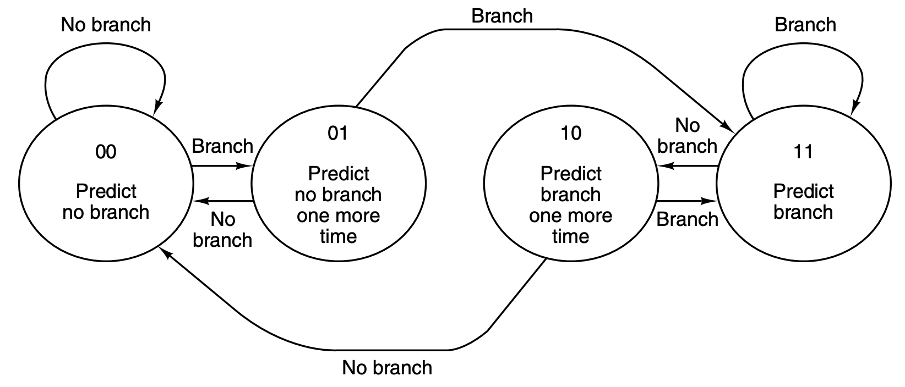

<u>Branch history shift register</u>

Dit is een andere aanpak dan de twee voorgaande. We houden in een speciaal register (van $k$ bits) bij of de $k$ voorgaande voorwaardelijke spronginstructies uitgevoerd werden, onafhankelijk van welke instructies ze waren. Onze entries in de history table hebben dan ook een $k$ bit key. We vergelijken ons shift register met de entries en als we een overeenkomst vinden, wordt de voorspelling in die entry uitgevoerd. Verassingwekkend genoeg werkt deze techniek in de praktijk best goed.

**Welke techniek analoog aan cachegeheugens kan je hier ook toepassen?**

We kunnen een tabel maken zoals bij direct mapped cachegeheugens of zelfs zoals bij n-way set associative caches, waar we meerdere tabellen gebruiken.

**Aan de hand van welke formule kan je de lijn gaan achterhalen waar voor een gegeven spronginstructie de voorspellingsbits te vinden zijn.**

Bij een tabel met $2^n$ entries de n+2 low order bits uit het target adres van de branch en twee bits naar rechts verschuiven. Werkt op dezelfde manier als caches. We gebruiken dit n-bit getal als index voor de tabel. Als we een entry vinden met hetzelfde adres als het adres waarnaar we mogelijks gaan branchen, hebben we een hit en kunnen we een voorspelling maken.

**Wat gebeurt er wanneer een spronginstructie niet voorkomt?**

Dan kunnen we de forward/backward regel gebruiken. En dan zoals bij caches de lijn vervangen.


## Vraag 56

> . Wat is statische sprongvoorspelling? (pagina 315) 

```
statisch -> op voorhand, niet at runtime (compiler doet het werk), speciale branchinstructies
	- compiler branches laten zoeken, speciale instructie plaatsen
	- simulatie, gedrag bijhouden, geven aan compiler
```

We gaan onze compiler voorzien van speciale branchinstructies die de hardware vertellen welke branch de compiler denkt dat er genomen moet worden. Dit kan op twee manieren:

* Slimme compiler: de compiler zoekt uit welke branches er waarschijnlijk genomen gaan worden. Bij een for loop van 1000000 iteraties kan de compiler dan bijvoorbeeld zo een instructie aan de hardware meegeven.
* Simulatie: we draaien het programma op een simulator en houden het branchgedrag bij. We geven deze informatie aan de compiler, die dan de speciale instructies gebruikt om de hardware te zeggen wat hij moet doen.

De voorspellingen van de sprongen liggen dus op voorhand vast.

## Vraag 57

> Wat er wordt er in computerterminologie bedoeld met een scorebord? Waarvoor dient het en uit welke delen bestaat het? (pagina 315-317)

```
scorebord -> voor elk register hoeveel keer het gebruikt wordt
delen -> counter voor elk register
	source: klein getal, inc bij read, dec als commando gedaan
	destination: 1-bit counter als naar register geschreven wordt

nut -> als decoder commando decodeert, weten of uitgevoerd kan worden
pipelining, dynamisch inplannen, out of order execution
```

**Wat er wordt er in computerterminologie bedoeld met een scorebord?**

Een scorebord is een apparaat dat voor elk register bijhoudt hoe vaak het gebruikt wordt als source of destination. 

**Uit welke delen bestaat het? **

* Voor elk register is er een kleine counter die aangeeft hoeveel keer dat register in gebruik is als source.
  * Incrementeert als een instructie met dit register als operand wordt gestart
  * Decrementeert als de instructie eindigt
* Een 1-bit counter voor elk register om aan te geven of hij wordt gebruikt als destination
  * Want je kan natuurlijk niet van 2 plekken tegelijk schrijven naar een register

**Waarvoor dient het?**

Als onze decode unit een commando decodeert, moet hij weten of hij het commando wel kan uitvoeren. Als de huidige instructie bijvoorbeeld de waarde van een register nodig heeft, maar die waarde is nog niet berekend, zal onze cpu de uitvoering moeten uitstellen. Om het gebruik van de registers bij te houden maken we dus gebruik van een **scorebord**. 

Dankzij het scorebord kunnen instructies dynamisch ingepland worden om out of order execution mogelijk te maken. Dit omdat het scorebord inzicht geeft in de data dependencies van elke instructie.


## Vraag 58

> Gegeven de volgende (micro-)instructies:

```assembly
R3 = R0*R1
R4 = R0+R2
R5 = R0+R1
R6 = R1+R4
R7 = R1*R2
R1 = R0-R2
```

> Ga er van uit dat je beschikt over een superscalaire architectuur waarbij per klokcyclus twee instructies kunnen worden ge-issued. Veronderstel ook dat het volledig uitvoeren (van het decoderen tot de writeback-fase dus) van een optel- of aftrekinstructie, opgehaald in cyclus n, tegen het einde van cyclus n+2 klaar is. Voor een vermenigvuldigingsopdracht is het resultaat pas bekend op het einde van cyclus n+3. 
>
> Geef het scorebord voor de het uitvoeren van deze instructies wanneer alles instructies mooi in volgorde worden uitgevoerd. Welke dependencies kom je tegen en hoe worden ze al dan niet opgelost (geen code, gewoon omschrijven)? Waarom worden instructies ook mooi in volgorde beëindigd? (pagina 315-320)

```
//TODO deze is tekenen
WAR
RAW
WAW
```


 **Welke dependencies kom je tegen en hoe worden ze al dan niet opgelost**?

Bij deze architectuur zullen we enkele regeltjes moeten toepassen om problemen met depencies te voorkomen.

* WAR (write after read)
  * Als er naar een operand geschreven wordt, instructie niet starten
* RAW (read after write)
  * Als het uitkomstregister gelezen wordt, instructie niet starten
* WAW (write after write)
  * Als naar het uitkomstregister geschreven wordt, instructie niet starten 

**Waarom worden instructies ook mooi in volgorde beëindigd? **

Dit is nodig voor het geval dat er een interrupt zich voordoet. Als de instructies niet in volgorde zouden eindigen is het moeilijk om de huidige staat van de machine op te slaan om deze later te kunnen herstellen. 

We kunnen in ons systeem dus altijd met zekerheid zeggen dat bij een interrupt alle instructies tot op een bepaald punt uitgevoerd zijn, en die daarna niet. Deze karakteristiek noemen we een **precise interrupt**. 

## Vraag 59

> Gegeven onderstaand codefragment:

```c
evensum=0;
oddsum=0;
i=0;
while (i<limit){
	k=i*i*i;
	if (k%2==0)
		evensum+=k;
	else
		oddsum+=k;
	i++;
}
```

> Wat is een basisblok en deel bovenstaande code op in basisblokken. Veronderstel dat evensum en oddsum de enige variabelen zijn die zich niet in registers bevinden. Wat is speculatieve uitvoering en welke problemen kunnen er zich voordoen. Hoe kunnen ze worden opgelost? Wat is het gevaar bij het toepassen van speculatieve uitvoering op onderstaand probleem? (pagina 320-323)

```c
if (x>0) z=y/x;
```

```
basisblok -> lineair stuk bevelen zonder branches
programma door control statements gesplitst in branches

speculatieve uitvoeren -> uitvoeren voordat we weten of het moet
	kan dat we iets uitvoeren dat niet mag 
	- onomkeerbaar resultaat: scratch registers
	- exceptions (bv cache miss): speculative load, als cache miss niet naar geheugen gaan
  - crash -> bv code hierboven: poison bit toevoegen en programma nog niet laten crashen
  
code hier -> deling door nul laat programma crashen als het speculatief wordt uitgevoerd
```

**Wat is een basisblok?**

Een **basisblok** is een lineaire sequentie van bevelen die bij omzetting naar assembleertaal geen branches bevat. Ons programma wordt eigenlijk door de control statements (ifs enzo) opgesplitst in basisblokken.

**Deel bovenstaande code op in basisblokken.**

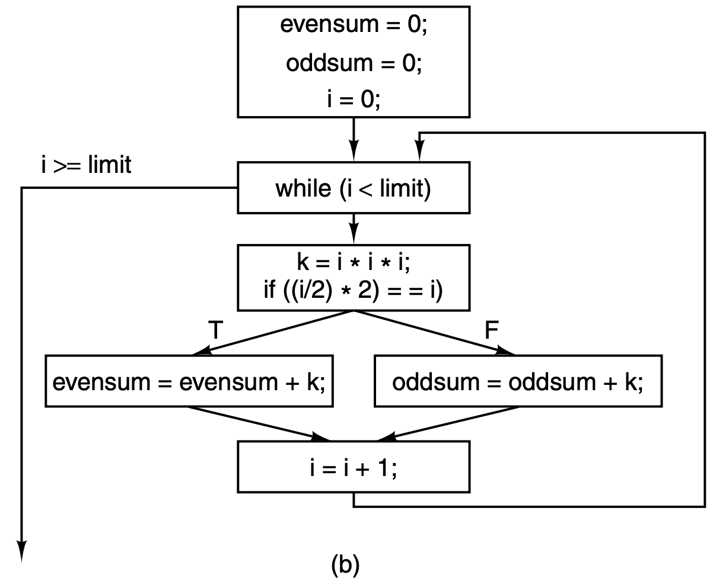

**Wat is speculatieve uitvoering en welke problemen kunnen er zich voordoen. Hoe kunnen ze worden opgelost?**

Code uitvoeren voordat het bekend is of dit zelfs nodig is, staat bekend als **speculatieve uitvoering**. 

* Als een instructie een onomkeerbaar resultaat heeft (bijvoorbeeld het resultaat van een optelling wegschrijven wanneer dit eigenlijk niet nodig is)
  * Oplossing: De registers die gebruikt worden door de speculatieve renamen zodat alleen scratch registers worden aangepast. Dan is er geen probleem als de code uiteindelijk niet nodig is. Als dit wel het geval is, kopieren we de inhoud van de scratch registers naar de werkelijke destination registers.
* Als een speculatief uitgevoerde instructie een exception veroorzaakt. (bijvoorbeeld een cache miss, die dan onnodig de cpu ophoudt om het woord in het hoofdgeheugen te gaan ophalen)
  * We voorzien een speciale `SPECULATIVE-LOAD` instructie die de hardware vertelt om na een cache miss gewoon op te houden. Als die waarde niet in de cache zat en dan toch nodig blijkt te zijn, kan die later nog opgehaald worden. 
* Het kan dat een speculatief uitgevoerde instructie het programma doet crashen. Dit is een groot probleem als deze code bijvoorbeeld in een if-statement zat met de bedoeling om dit te voorkomen. 
  * Neem bijvoorbeeld `if(x>0) z=y/x`. Als x gelijk is aan 0 en de tweede instructie speculatief uitgevoerd wordt, zal het programma crashen. 
  * Om dit te voorkomen voegen we een **poison bit** toe aan elk register. Deze bit wordt geset als een speculatieve instructie faalt, in plaats van een trap te veroorzaken.


**Wat is het gevaar bij het toepassen van speculatieve uitvoering op onderstaand probleem?**

```c
if (x>0) z=y/x; // zie hierboven
```


## Vraag 60

> Bespreek het principe van een VLIW-processor. Wat is het verschil met een superscalaire architectuur? Wat is predicated execution en wat is het voordeel er van? Wat is saturated arithmetic? (pagina 555-556, predicated execution/saturated arithmetic 559)

```
VLIW -> instructie met meerdere opcodes & operanden, in één keer uitvoeren

verschil -> hier alle in één grote superscalair kleine pipelinen

predicated execution -> elke deelinstructie krijgt testregister, of het wordt uitgevoerd of niet, sprongen voorkomen

saturated arithmetic -> niet overflowen, maar dichtstbijzijnde juiste waarde pakken (geen exception)
```

**Bespreek het principe van een VLIW-processor.**

Bij een **VLIW (very long instruction word)** processor bevat een instructie typisch meerdere opcodes en operanden. De architectuur is dan zo gemaakt dat hij deze instructie, bestaande uit meerdere bewerkingen, in één keer kan uitvoeren. 

**Wat is het verschil met een superscalaire architectuur?**

Bij een superscalaire architectuur gaan we typisch meerdere kleine instructies starten in één klokcyclus, die vervolgens gepipelined uitgevoerd worden. Bij VLIW hebben we één grote instructie die meerdere bewerkingen in één keer kan doen. Hiervoor gebruiken we een compiler die bepaalt welke instructies tesamen uitgevoerd zullen worden, in tegenstelling tot de superscalaire architectuur, waar de instructies dynamisch ingepland worden.

**Wat is predicated execution en wat is het voordeel er van?**

Bij predicated exectution wordt de instructie enkel uitgevoerd als een bepaalde voorwaarde is voldaan. In de context van VLIW specifieert elke operatie een register dat getest wordt alvorens de operatie uitgevoerd wordt. Als de low-order bit van dat register geset is, wordt de instructie uitgevoerd. Is dit niet zo, dan wordt hij overgeslagen. Bij VLIW kan elk van de tegelijk uitgevoerde instructies apart voorzien worden van een predikaat.

Door gebruik te maken van predicated execution kunnen we veel voorwaardelijke sprongen voorkomen, met performantiewinst als gevolg. //TODO er zijn denk ik nog voordelen

**Wat is saturated arithmetic?**

Wanneer een operatie een uitkomst produceert die niet weergeven kan worden door overflow, wordt er in plaats van een exception te gooien, het dichtstbijzijnde geldige getal gebruikt. Vb met een 8-bit unsigned integer: 130+130 wordt 255.


## Vraag 61

> Bespreek de drie mogelijkheden om aan multithreading te doen. Wanneer wordt er van thread gewisseld? Welke problemen ontstaan er bij het gebruik van een gedeelde pipeline? Wat zijn de voor- en nadelen van iedere vorm van on chip-multithreading? (pagina 562-564)

(Alle drie zijn vormen van on-chip multithreading)

```
fine grained -> elke cyclus, 
minstens even veel threads als pipeline stages nodig
even veel threads als aantal cycli geheugenstall -> cpu constant bezig
elke thread eigen set registers

course grained -> altijd als er gewacht moet worden
altijd 1 cyclus verspild

simultaneous ->
superscalair, thread kan meerdere operaties blijven starten tot hij moet wachten, dan direct switchen
helpt functionele eenheden bezig te houden

problemen -> commandos van verschillende threads in pipeline (welke is van wie)

```

**Fine-grained multithreading**

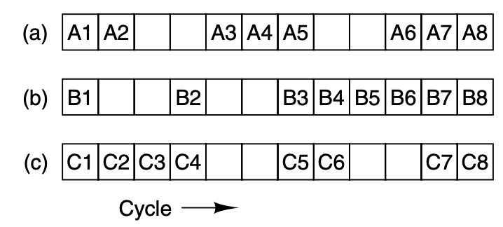

Bij deze vorm van multitheading gaan we simpelweg van elke thread om de beurt (round robin) één instructie uitvoeren. We wisselen dus elke instructie van thread. Nemen we de drie threads van hierboven, ziet dat er zo uit:

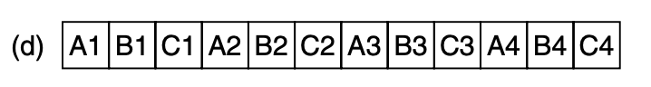

**Coarse-grained multithreading**

Bij course-grained multithreading zijn er meerdere mogelijkheden.

Een mogelijkheid is om pas van thread te wisselen als een commando wachttijd veroorzaakt. De drie threads van hierboven worden dus op deze manier uitgevoerd. We verspillen dus soms een cyclus.

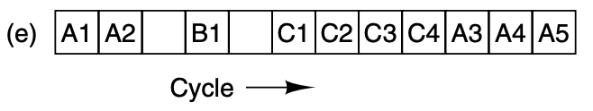

We kunnen ook van thread wisselen bij elk commando dat mogelijk een wachttijd veroorzaakt. Dit maakt het mogelijk om dead cycles te voorkomen.


**Simultaneous multithreading**

Dit is een verfijning op course-grained multithreading voor superscalaire CPUs. Een enkele thread kan meerdere instructies per cyclus blijven starten zolang hij kan, maar wanneer hij moet wachten, wordt er direct overgeschakeld naar de volgende thread. 

Onze drie threads worden dan op deze manier uitgevoerd:

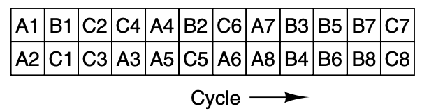

**Welke problemen ontstaan er bij het gebruik van een gedeelde pipeline?**

Als er commando's van verschillende threads in de pipeline terecht komen, weten we niet welk commando bij welke thread hoort.

Bij fine-grained multithreading moeten we aan elke operatie een thread identifier toevoegen.

Bij course-grained multithreading kunnen we wachten totdat de pipeline vrij is alvorens naar een andere thread te gaan. Dit is alleen nuttig als we niet super snel van threads wisselen. (aanzienlijk langer dan de pipeline)


**Wat zijn de voor- en nadelen van iedere vorm van on chip-multithreading?**

* Fine-grained multithreading
  * Je hebt altijd minstens even veel threads nodig als stages in de pipeline, zodat er geen commando's van verschillende threads in de pipeline komen en conflicten veroorzaken.
  * Als we even veel threads hebben als het aantal cycli dat een geheugenstall duurt, kunnen we de cpu constant bezig houden, de wachttijden van het geheugen worden dan volledig gemaskeerd.
  * Omdat verschillende threads niets met elkaar te maken hebben, heeft elke thread zijn eigen set registers nodig. Het aantal mogelijke threads ligt dus aan het ontwerp van de chip.
* Coarse-grained multithreading
  * Hier hebben we niet zo veel threads nodig als pipeline stages.
  * Bij de eerste methode verliezen we bij elke stall één cyclus
* Simultaneous multithreading
  * Van deze lijst de beste manier om multithreading te doen op een superscalaire cpu
  * Helpt om alle functionele eenheden bezig te houden. Als een instructie niet gestart kan worden omdat een bepaalde functionele eenheid bezet is, kunnen we een instructie van een andere thread kiezen in de plaats. Zo wordt alles optimaal gebruikt
  
  


## Vraag 62

> Bij hyperthreading op de i7 (simultane multithreading) worden bronnen gedeeld op drie verschillende manieren. Dewelke en wat is voordeel/nadeel ervan? Welke zaken zijn per thead uniek en worden dus niet gedeeld en waarom kunnen ze niet gedeeld worden? Wat probleem treedt er op met betrekking tot cachegeheugens (geen tekening en geen voorbeelden uit de pipeline van de i7 zijn hier nodig, gewoon bespreken) (pagina 566- 567)


```
partitioned resource sharing

full resource sharing

threshold sharing

uniek -> program counter, register map en interrupt controller, elke thread heeft ze constant nodig

probleem -> elke thread 3/4 cache nodig, apart oke, samen constant misses
```

**Bij hyperthreading op de i7 (simultane multithreading) worden bronnen gedeeld op drie verschillende manieren. Dewelke en wat is voordeel/nadeel ervan?**

* Partitioned resource sharing
  * De resources strikt verdelen tussen twee threads
  * Gemakkelijk te implementeren
  * Geen overhead
  * Houdt de threads uit elkaars haar
  * Als een thread resources niet gebruikt die een andere thread zou kunnen gebruiken, mag hij dat niet. Zo wordt er wel wat verspild
* Full resource sharing
  * Elke thread kan de resources verkrijgen die hij nodig heeft
  * Zorgt ervoor dat resources niet meer liggen te niksen wanneer een andere thread ze zou kunnen gebruiken.
  * Het kan dat één thread zo resource hungry is dat hij de andere vertraagt of zelft helemaal stillegt.
* Threshold sharing
  * Het compromis tussen de vorige twee. Elke thread kan dynamisch resources verkrijgen, totop een bepaald maximum.
  * Laat flexibiliteit toe zonder het gevaar dat één thread alle resources inpikt.

**Welke zaken zijn per thread uniek en worden dus niet gedeeld en waarom kunnen ze niet gedeeld worden?**

De programmateller, register map en interrupt controller. Ze kunnen niet gedeeld worden omdat elke thread ze de hele tijd nodig heeft.

**Welk probleem treedt er op met betrekking tot cachegeheugens**.

Als we bijvoorbeeld twee threads hebben die ieder 3/4 van het cachegeheugen nodig hebben om goed te kunnen functioneren. Als we deze twee apart draaien, zullen ze perfect werken (op een paar cache misses na). Als we de threads samen draaien, zullen ze beide constant cache misses hebben en kan onze performantie veel slechter zijn dan wanneer we niet aan multithreading doen.

# Labo's

Een paar dingen die ik nuttig vind om de labo-oefeningen beter te begrijpen.

## De Von Neumann cyclus

Bij het uivoeren van een programma zal de processor elke insctructie uitvoeren volgens de Von Neumann cyclus. Dit verloopt in 3 stappen:

1. **Instruction fetch**
   * CPU zet het adres van de volgende instructie op de adresbus
   * Het geheugen plaatst dan die instuctie op de databus
   * CPU haalt de instructie van de databus en plaatst die in zijn instructieregister (IR)
2. **Instruction decoding**
   * Onze instructie zit nu in de IR
   * De CPU decodeert deze om te achterhalen welke instructie er moet uitgevoerd worden en welke GPR's (General purpuse registers) er gebruikt moeten worden
3. **Execute**
   * We voeren de instructie uit
   * Tijdens de instructie kunnen er een aantal vlaggen worden gezet 
     * *Zero flag*: als het resultaat nul is
     * *Overflow flag*: als het resultaat groter is dan in het register past
     * *Carry flag*: als we twee 8-bit getallen optellen kan dit een 9-bit getal geven. In de carry steekt dan het nummertje dat te veel is.
     * *Negative flag*: geeft aan dat het getal negatief is (tekenbit bij 2-complement)


## Instructies

Waaruit kan een instructie bestaan.

Elke instructie heeft een **opcode** (operation code). Dit is het bitpatroon dat zegt wat de instructie doet. Bij de instructie kunnen ook operanden zitten die bij die opcode horen.

Om met instructies te werken is het nuttig om een beetje te weten over hoe de adressering en de instructies van de 8051 samengaan.

### Adresseringsmodi

Instructies kunnen op verschillende mogelijkheden gebruikmaken van adressering. Dus op verschillende manieren verschillende dingen aanspreken. 

| Soort                 | Structuur                        | Voorbeeld                                                    |
| --------------------- | -------------------------------- | ------------------------------------------------------------ |
| Register adressering  | [opcode + r]                     | add A, R7                                                    |
| Directe adressering   | [opcode] [direct adres]          | mov P1, A                                                    |
| Indirecte adressering | [opcode + i]                     | mov A,@R0 (zet niet de inhoud R0, maar de inhoud van het vakje waarnaar R0 wijst in A) |
| Immediate adressering | [opcode] [immediate data]        | mov A,#12d (als we dus gewoon een getal zelf schrijven in de code) |
| Relatieve adressering | [opcode] [relatieve offset]      | sjmp verder (als we een aantal posities verder of terug moeten, max 127 verder of 128 terug) |
| Absolute adressering  | [opcode] [absoluut adres]        | ajmp verder (om verder te springen)                          |
| Long adressering      | [opcode] [MSB adres] [LSB adres] | ljmp en lcall (alleen voor lange doeladressen)               |


### Overzicht instructies

Ik ga iets minder in detail dan Wim. Dit is eerder een geheugensteun voor tijdens de oefeningen.

| Instructie | Nut                                                          | Voorbeeld         |
| ---------- | ------------------------------------------------------------ | ----------------- |
| mov        | Dataoverdracht                                               | mov A, R1         |
| movx       | Dataoverdracht van of naar extern datageheugen               | movx A,@DPTR      |
| movc       | Dataoverdracht van of naar programmageheugen                 | movc A,@A+DPTR    |
| xch A, R6  | Verwisselen met de accumulator                               |                   |
| push       | Iets op de stack zetten (Gebruik niet push A maar wel push ACC als de inhoud van de accumulator op de stack moet worden geplaatst!) | push dadr         |
| pop        | Iets van de stack halen                                      | pop dadr          |
| anl        | AND (kan ook op enkele bits gebruikt worden)                 | anl A, R1         |
| orl        | OR(kan ook op enkele bits gebruikt worden)                   | orl A, dadr       |
| xrl        | XOR (kan ook op enkele bits gebruikt worden)                 | xrl A,#2H         |
| clr        | Clear, leegmaken (kan ook op enkele bits gebruikt worden)    | clr A             |
| cpl        | Complement (inverteren) (kan ook op enkele bits gebruikt worden) | cpl A             |
| swap       | Hoogste en laagste nibble verwisselen                        | swap A            |
| RL         | Rotate left (1 plaats naar links bitshiften)                 | RL A              |
| RR         | Rotate right (1 plaats naar rechts bitshiften)               | RR A              |
| RLC        | RL, maar de hoogste bit wordt op de carry gezet. De waarde die al op de carry stond wordt op de laagste bit van A gezet | RLC A             |
| RRC        | Hetzelfde, in de andere richting                             | RRC A             |
| setb       | Een bit op 1 zetten (nuttig voor bijvoorbeeld de carry)      | setb C            |
| /          | Als je een / voor een bitadres zet neem de de inverse        | anl C,/bitadr     |
| add        | Optellen (zonder rekening te houden met de carry)            | add A, #2         |
| addc       | Optellen (de inhoud van de carry wordt erbij opgeteld)       | addc A,#2         |
| subb       | Aftrekken (houdt altijd rekening met de carry, dus als je die niet wilt gebruiken eerst 'clr C' doen) | subb A, R1        |
| mul        | vermenigvuldigen (ACC met B-register, het grote deel van de uitkomst komt in B) De carry wordt altijd op 0 gezet. Pariteitsvlag wordt gezet als de hoeveelheid enen oneven is | mul AB            |
| div        | deelt A door B, quotient in A, rest in B. Bij deling door 0 worden OV en CY-bit gezet. Er gebeurt niets met AC | div AB            |
| inc        | incrementeren met 1                                          | inc DPTR          |
| dec        | decrementeren met 1 (dec DPTR gaat niet)                     | inc A             |
| jmp        | onvoorwaardelijke sprong (assembleerder kiest zelf tussen één van de volgende 3) (jmp $ maakt een oneindige loop) | jmp adres         |
| ajmp       | absolute sprong                                              | ajmp adres        |
| ljmp       | lange sprong                                                 | ljmp adres        |
| sjmp       | kleine sprong                                                | sjmp rel          |
| jc         | Jump als de carry op 1 staat                                 | jc rel            |
| jnc        | Jump als de carry op 0 staal                                 | jnc rel           |
| jb         | Jump als bit aanstaat                                        | jb bitadr,rel     |
| jnb        | Jump als bit niet aanstaat                                   | jnb bitadr,rel    |
| jz         | Jump als accumulator op 0 staat                              | jz rel            |
| jnz        | Jump als accumulator niet op 0 staat                         | jnz rel           |
| djnz       | Decrement en jump als het aangegeven register niet op 0 staat (om for loops te maken) | djnz R1, rel      |
| cjne       | Compare en jump if not equal. Als de eerste twee operanden niet gelijk zijn, springen naar de derde operand | cjne A, dadr, rel |
| call       | subroutine oproepen (assembleerder kiest tussen lcall en acall) | call adres        |
| lcall      | ik weet niet wat het verschil is tussen de twee help         | lcall adres_16    |
| acall      |                                                              | acall adres_11    |
| ret        | Return, moet je altijd zetten op het einde van een subroutine |                   |
| reti       | Return, maar bij een interrupt                               |                   |


Handig tabelletje van Wim om te zien welke instructies vlaggen kunnen aanpassen.

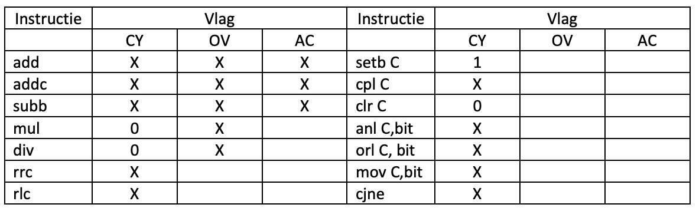


## I/O op de C8051F120

### De Crossbar

Je kan niet alle I/O mogelijkheden tegelijk gebruiken. Om bepaalde functies aan het zetten maken we gebuik van deze conversietabel. Hier zien we welke bits van XBR0, XBR1 en XBR2 we moeten aanzetten om bepaalde functies te kunnen gebruiken.

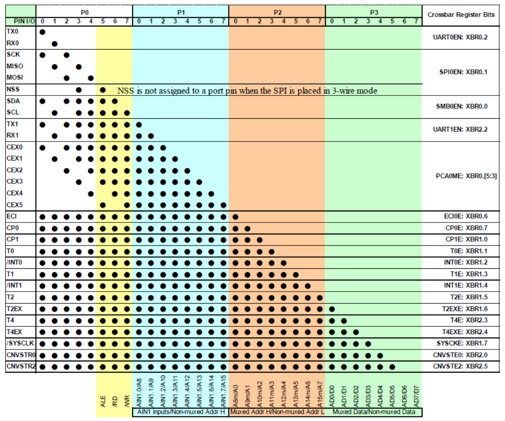

voorbeeld:

```assembly
…
mov SFRPAGE,#0FH ; alle configuratieregisters van de digitale crossbar bevinden zich in SFR-pagina F.
mov XBR2,#40H ; de crossbar wordt aangezet.
mov XBR0,#04H ; UART0 naar buiten brengen.
mov XBR2,#04H ; idem voor UART1
mov XBR1,#04H ; idem voor externe interruptlijn 0
…
```


### I/O Poorten

Om een poort in te stellen als in- of output gebruiken we het PxMDOUT register (met x het poortnummer). We zetten een poort op 0 voor uitvoer, en op 1 voor invoer. Bij het opstarten of resetten staan alle poorten default op invoer.

Bijvoorbeeld:

```assembly
...
mov SFRPAGE,#0FH ; alle configuratieregisters van de digitale crossbar bevinden zich in SFR-pagina F.
mov XBR2,#40H ; de crossbar aanzetten.
mov P3MDOUT,#00H ; Alle pinnen van poort 3 = invoer
mov P3,#0FFh ; Om poort 3 te gebruiken als invoerpoort moeten alle invoerpinnen na configuratie op een logische 1 gezet worden. 
...
```

Je kan ook individuele pinnen van de poorten aanspreken:

```assembly
…
mov SFRPAGE,#0FH ; alle configuratieregisters van de digitale crossbar bevinden zich in SFR-pagina F.
mov XBR2,#40H ; de crossbar aanzetten.
mov P5MDOUT,#10H ; Pin P5.4 = uitvoer
…
```


### Analoge I/O


## Timers en counters

### TMOD

Via het TMOD register kunnen we timer/counters 0 en 1 configureren

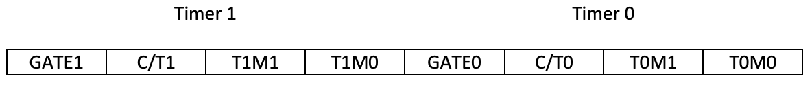

* **Gate**: Deze bit zetten betekent dat de timer/counter enkel kan gestart worden als /INT1=1 (INT0 bij timer 0). Externe interruptlijn 1 kan er dus voor zorgen dat de timer/counter vergrendeld wordt. 
* **C/T**: Op 0 zetten om de timer functie te gebruiken, 1 voor de counter
* **TxMx**: om te kiezen welke modus we gebruiken:

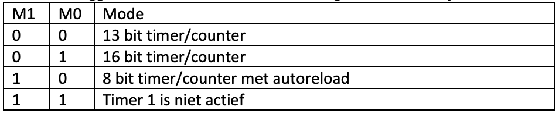

### TCON

Het timer/counter controleregister.


* **TF1/TF0:** Wordt op 1 gezet als de timer overflowt
* **TR1/TR0**: Zorgt ervoor dat het tellen start in TH1 en TL1

### CKCON

Het klokcontroleregister. We gebruiken dit register om de klok te delen als hij te snel tikt, zodat we grotere tijdsintervallen kunnen tellen.

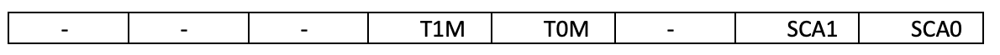

* **T1M/T0M**: om te kiezen of we de systeemklok gebruiken of delen door de waarden in SCA1 en SCA0
* **SCA1/SCA0**: hier passen we de snelheid aan waarop er geteld wordt:
  * 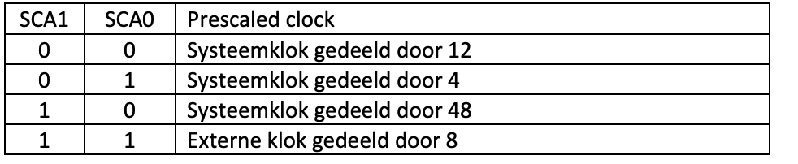 
  * De systeemklok is gelijk aan 24,5 MHz gedeeld door 8!

### Timermodi

* Mode 1
  * Bij het starten van een timer/counter in mode 1 worden er pulsen geteld in de 2 telregisters THx en TLx. Het register THx bevat de meest significante byte van de tellerwaarde, TLx de minst significante byte. 
* Mode 2
  * 8 bit timer/counter met autoreload
  * Wanneer het tijdsinterval voldoende klein is, kan een 8 bit timer volstaan. Bovendien kan er dan gebruik gemaakt worden van de autoreload functionaliteit. 
  * Bij het overlopen van de timer/counter wordt de autoreload-waarde, die zich in THx bevindt, naar TLx gekopieerd.


### Werkwijze

Op het voorbeeld van Wim willen we om de 60ms de waarde van P2.1 omwisselen. Om dit te kunnen doen moeten we eerst weten hoe veel **klokpulsen** er zitten in 60ms.

Aantal klokpulsen = klokfrequentie * tijdsinterval

We gebruiken de systeemklok: $\frac{24,5.10^6}{ 8} .60 .10^{−3} =183750$ klokpulsen. (De klokfrequentie is 24,5MHz/8). Ons getal is te groot en past niet in onze 16 bit timer. We gaan onze instellingen dus zo aanpassen dat we delen door 48 (3828 klokpulsen). Nu gaat onze time 48 keer zo traag. Maar dat is dan weer te lang om onze tijd te meten. We weten dat de timer overflowt op FFFFh. Dus we moeten zorgen dat hij op een bepaald getal start om exact na 60ms te overflowen. Dit getal is FFFFh - 3828d, oftewel FFFFh - EF4h = F10Bh


Hier doet onze Wim het even voor.

```assembly
...
mov P2MDOUT,#0FFH 	; P2.1 =>uitvoer. De overige pinnen zijn don’t cares
mov SFRPAGE#00H 		; alle timerregisters bevinden zich in SFRpagina 0
mov TMOD,#01H 			; Timer 0 mode 1 (16 bit timer)
mov CKCON,#02H 			; SYSCLK nog eens extra delen door 48
mov TH0,#0F1H 			; TH0=F1H
mov TL0,#0BH 				; TL0=0BH
setb TR0 						; timer 0 starten
loop: jnb TF0, $ 		; wacht 60 ms
	clr TF0 					; Timer overflow vlag wissen
	cpl P2.1 					;polariteit P2.1 omwisselen
	clr TR0 					; timer 0 stoppen
	mov TH0,#0F1H 		; telregisters opnieuw instellen
	mov TL0,#0BH
	setb TR0 					; timer 0 opnieuw starten
	jmp loop 					; oneindige lus
END
```


## Interrupts

### Notes bij de uitleg van Wim

Pagina 147 in de datasheet.

Om een interrupt te maken zoek je op deze pagina op welke plek in de interruptvector je het adres moet zetten van de code die de interrupt afhandelt. Als je een interrupt oproept wordt ook automatisch geswitcht naar de juiste sfrpage. Pas op met `cseg`. Als de assembler iets zegt van memory overlap moet je die wat verzetten. ET4 is niet bit-addresseerbaar. Timer 4 staat op sfrpage 2.

Je kan geen code delen tussen je hoofdprogramma en interrupt service routines.

### Het IE-register

(interrupt enable)

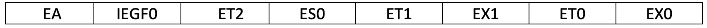

* EA 
  * Enable all interrupts. Het op nul zetten van dit bit betekent dat geen enkele interrupt de programmacode kan onderbreken. Het zetten van dit bit laat interrupts toe. Welke interrupts toegelaten worden is afhankelijk van de individuele settings van iedere interruptbron (te vinden in IE, EIE1 en EIE2 registers). 
* ET2: Timer 2 interrupt enable 
* ES0: UART0 interrupt enable 
* ET1: Timer 1 interrupt enable 
* EX1: External interrupt 1 enable 
* ET0: Timer 0 interrupt enable 
* EX0: External interrupt 0 enable

### Het IP-register

(interrupt priority denk ik)

We kunnen met dit register bepaalde interrupts een hogere prioriteit geven dan andere.


### Voorbeeld

Net als bij het vorige codefragment willen we hier de waarde op P2.1 elke 60ms laten wisselen, maar deze keer met het gebruik van een interrupt.

```assembly
cseg at 0000H 				; Schrijf onderstaande code in het programmageheugen te beginnen bij adres 0000H
jmp main 							; onvoorwaardelijke sprong naar het hoofdprogramma
cseg at 000BH 				; interrupt vector voor timer 0
jmp ISRTR0 						; onvoorwaardelijke sprong naar het label ISRTR0
cseg at 0050H 				; Schrijf onderstaande code in het programmageheugen te beginnen bij adres 0050H
main: clr EA
	mov WDTCN ,#0DEH 		;uitschakelen van de watchdog timer
	mov WDTCN,#0ADH
	setb EA
	setb ET0 						;interrupts van timer 0 toelaten
	mov SFRPAGE,#0FH
	mov XBR2,#40H 			; crossbar aanzetten
	mov P2MDOUT,#0FFH 	; P2.1 =>uitvoer. De overige pinnen zijn don’t cares
	mov SFRPAGE#00H 		; alle timerregisters bevinden zich in SFRpagina 0
	mov TMOD,#01H 			; Timer 0 mode 1 (16 bit timer)
	mov CKCON,#02H 			; SYSCLK nog eens extra delen door 48
	mov TH0,#0F1H 			; TH0=F1H
	mov TL0,#0BH 				; TL0=0BH
	setb TR0 						; timer 0 starten
	jmp $ 							; oneindige lus en wachten op interrupts

ISRTR0: cpl P2.1 			; polariteit P2.1 omwisselen
	clr TR0 						; timer 0 stoppen
	mov TH0,#0F1H 			; telregisters opnieuw instellen
	mov TL0,#0BH
	setb TR0 						; timer 0 opnieuw starten
	RETI 								; einde ISR
END
```


## Eigenschappen van de 8051

Een paar eigenschappen uit de pdf van onze lieve Wim. Kan handig zijn om te weten en om een beetje meer voeling te krijgen met de microcontroller.

* CPU met uitgebreide instructieset (111 instructies ; bit- en byte-bewerkingen) 
* 32 digitale GPIO-lijnen (general purpose I/O) verdeeld over vier 8-bitpoorten (P0, P1, P2 en P3). 
* Twee timer/counters die in vier modes kunnen geprogrammeerd worden: 
  * Mode 0: 13-bit timer/counter
  * Mode 1: 16-bit timer/counter 
  * Mode 2: 8-bit timer met autoreload 
  * Mode 3: Bijzonder geval (opsplitsing naar drie timer/counters) 
* Een full duplex serieel kanaal met instelbare baudrate (hoe snel de informatie over het kanaal verstuurd wordt). Voor het genereren van de baudrate zijn er diverse mogelijkheden 
* Twee externe interruptlijnen. Naast deze externe interruptlijnen zijn er nog tal van interne interruptbronnen. Zo zijn er interne interrupts voorzien voor het serieel kanaal en de twee timers. 
* 128 Bytes interne RAM waarvan een aantal adressen bitadresseerbaar zijn. 
* 4 KB interne ROM. Naast deze versie zijn er tevens 8051-varianten die gebruik maken van EPROM en EEPROM. 
* Uitbreidbaar met 64 KB datageheugen en 64 KB programmageheugen.


### Vergelijking met C8051F120

Aangezien de 8051 een beetje oud is zijn er wat uitbreidingen voorzien op de C8051F120.

* Een 8051-compatibele CPU 
* 128 KB onchip FLASH programmageheugen 
* 8448 bytes (8 KB + 256 bytes) onchip datageheugen 
* 20 interruptbronnen • Een 24,5 MHz interne oscillator 
* Wat analoge onchip periferie waaronder: 
  * Een 10/12-bit en een 8-bit ADC13 
  * 2 x 12-bit DAC’s14
  *  … 
* Onderstaande Digitale I/O 
  * 2 full duplex seriële kanalen met instelbare baudrate 
  * 5 Timer/counters. De werking van timers 0 en 1 is volledig analoog aan de werking van timers 0 en 1 van de 8051. 
  * 64 digitale GPIO-lijnen verdeeld over acht 8-bitpoorten (P0, P1, P2,…, P7) 
  * … 
* …

## Registers

| Symbool        | Naam                         | Functie                                                      |
| -------------- | ---------------------------- | ------------------------------------------------------------ |
| ACC            | Accumulator                  | Hier worden meestal tussenresultaten van rekenkundige operaties ingestoken |
| P              | B-register                   | Hulpregister bij vermenigvuldigen en delen                   |
| PSW            | Program status word          | Statusregister van de ALU                                    |
| SP             | Stack pointer                | Wijst naar de laatst ingevulde positie van de stack(preincrement). Bij het opstarten of bij een reset is de default waarde van SP 07H. |
| DPTR           | Data Pointer                 | Dit 16-bit register wordt gebruikt voor het indirect adresseren van het extern datageheugen. |
| P0, P1, P2, P3 | I/O registers                | Deze registers worden gebruikt voor het inlezen en het wegschrijven van data naar een GPIO-poort of pin |
| IE             | Interrupt enable control     | Wordt gebruikt om in te stellen welke interrupts het programma kunnen onderbreken. |
| IP             | Interrupt priority control   | Bij het gelijktijdig optreden van twee interrupts zal dit register worden geraadpleegd om te bekijken welke van de twee interrupts het meest prioritair is |
| TMOD           | Timer mode register          | Voor het instellen van de werkingsmodi van de 2 timers/counters. |
| TCON           | Timer controle register      | Statusregister van de twee timers/counters. Wanneer een timer overloopt zal in dit register een vlaggetje gezet worden om deze gebeurtenis vast te leggen. |
| TH0/TL0        | Timer registers voor timer 0 | Dit zijn de telregisters van timer/counter0. Er wordt geteld op het ritme van de klok (timer) of op het ritme van een extern signaal (counter) |
| TH1/TL1        | Timer registers voor timer 1 | Dit zijn de telregisters van timer/counter1. Er wordt geteld op het ritme van de klok (timer) of op het ritme van een extern signaal (counter) |


### Layout van PSW

(van links naar rechts, groot naar klein)

| Bit   | Afkorting | Nut                                                          |
| ----- | --------- | ------------------------------------------------------------ |
| PSW.7 | CY        | Carry-flag                                                   |
| PSW.6 | AC        | Auxiliary carry. Dit vlaggetje wordt gezet wanneer er bij een optelling een overdracht plaatsvindt na de eerste vier bits. |
| PSW.5 | F0        | De functie van dit vlaggetje kan door de gebruiker zelf worden ingevuld. |
| PSW.4 | RS1       | M.b.v. deze bits kan de programmeur instellen welke registerbank hij wil gebruiken. Er zijn in totaal 32 GPR-registers verdeeld over vier registerbanken van telkens acht registers. Op een gegeven moment kan er slechts één registerbank worden benut. Wanneer er dus nood is aan meer dan acht registers kunnen deze bits gemanipuleerd worden om het aantal registers uit breiden naar 16, 24 of zelfs 32. |
| PSW.3 | RS2       | Samen met de vorige. Deze twee bits samen bepalen welke registerbank je gebruikt: 00 voor bank 0, 01 voor bank 1, ... In elke bank kan je gebruikmaken van R0, R1, R2 enzo, maar ze komen dan overeen met andere registers. |
| PSW.2 | OV        | Overflow flag                                                |
| PSW.1 | /         | is gereserveerd                                              |
| PSW.0 | P         | pariteit-vlag. Deze vlag wordt gezet wanneer de accumulator een oneven aantal enen bevat. Deze vlag is nul bij een even aantal enen. |


## Oefeningen

### Reeks 4 oefening 1

Een klok maken op de 7seg display met minuten en seconden. Deze oefening maakt gebruik van interrupts.

```assembly
$include (c8051f120.inc)

cseg at 0000H

jmp main

cseg at 000BH ; interrupt vector timer 0

jmp ISR_TR0

cseg at 0044H

main:clr EA
	 mov WDTCN,#0DEH
	 mov WDTCN,#0ADH
	 setb EA
	 setb ET0

	 mov SFRPAGE,#0Fh
	 mov XBR2,#40H
	 mov P0MDOUT,#0FFH
	 mov P1MDOUT,#0FFH
	 mov P2MDOUT,#0FFH
	 mov P4MDOUT,#0FFH

	 mov SFRPAGE,#00H
	 mov TMOD,#01H ; timer 0 mode 1
	 mov CKCON,#02H ; /48
	 mov TH0,#06H	 	
	 mov TL0,#0C6h  ; 06C6=>FFFF (~1s)
	 setb TR0

	 mov 20H,#3FH
	 mov 21H,#06H
	 mov 22H,#5BH
	 mov 23H,#4FH
	 mov 24H,#66H
	 mov 25H,#6Dh
	 mov 26H,#7Dh
	 mov 27H,#07H
	 mov 28H,#7FH
	 mov 29H,#6FH

	 mov R2,#00d
	 mov R3,#00d
	 mov R4,#00d
	 mov R5,#00d

schrijf: 
		 mov A,#20H	  ; Eenheden A=20H
         add A,R2  	  ; A=A+R2 => [20H,29H]
         mov R0,A
         mov P0,@R0 ; P0=*R0 => P0=*(A+R2) => P0=tab[R2]

         mov A,#20H	  ; Tientallen A=20H
         add A,R3  	  ; A=A+R3 => [20H,29H]
         mov R0,A
         mov P1,@R0 ; P1=*R0 => P1=*(A+R3) => P1=tab[R3]

         mov A,#20H	  ; Eenheden minunten A=20H
         add A,R4  	  ; A=A+R4 => [20H,29H]
         mov R0,A
         mov P2,@R0 ; P2=*R0 => P2=*(A+R4) => P2=tab[R4]

         mov A,#20H	  ; Tientallen minuten A=20H
         add A,R5  	  ; A=A+R5 => [20H,29H]
         mov R0,A
         mov SFRPAGE,#0FH
         mov P4,@R0 ; P4=*R0 => P4=*(A+R5) => P4=tab[R5]
         mov SFRPAGE,#00H
         jmp schrijf

ISR_TR0: 
	   clr tf0
	   mov TH0,#06H	 	
	   mov TL0,#0C6h  ; 06C6=>FFFF (~1s)
	   inc R2
	   cjne R2,#10d,einde
	   mov R2,#00d
	   inc R3
	   cjne R3,#06d,einde
	   mov R3,#00d
	   inc R4
	   cjne R4,#10d, einde
	   mov R4,#00D
	   inc R5
	   cjne R5,#06d,einde
	   mov R5,#00d
einde: reti 
```


## Boostersessies


### Booster 1

Vraag over de werking van de stack op praktijkexamen.

Logische schakeling omzetten naar assembleertaal.

program status word? 33.41

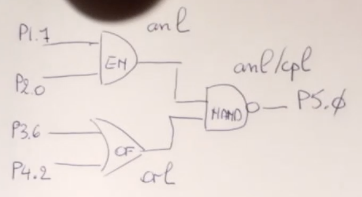

```assembly
org 0000H

jmp main

org 0080H

main: clr EA
      mov WDTCN,#0DEH
      mov WDTCN,#0ADH
      setb EA

      mov SFRPAGE,#0FH
      mov XBR2,#40H
      mov P5MDOUT,#01H ; P5.0 = output
start: 
      mov C,P1.7
	   anl C,P2.0
      mov F0,C
      mov C,P3.6
      orl C,P4.2
      anl C,F0
      cpl C
      mov P5.0,C
      jmp start
```

Oplossing, maar met de carry als uitvoer

```assembly
org 0000H

jmp main

org 0080H

main: clr EA
      mov WDTCN,#0DEH
      mov WDTCN,#0ADH
      setb EA

      mov SFRPAGE,#0FH
      mov XBR2,#40H
start: ;logische EN
       mov A,P2  ; ACC.0=P2.0
       rr A      ; ACC.7=P2.0
       anl A,P1  ; ACC.7=P2.0 & P1.7
	    push ACC
      ; logische OF  
      mov A,P3   ; ACC.6=P3.6 
      rl A       ; ACC.7=P3.6
      push ACC
      mov A,P4   ; ACC.2=P4.2
      rr A       ; ACC.1=P4.2
      rr A       ; ACC.0=P4.2
      rr A       ; ACC.7=P4.2
      pop B
      orl A,B    ; ACC.7=P4.2 | P3.6
      pop B      ; resultaat logische EN => B
      ;logische NAND
      anl A,B
      cpl A      ; /(ACC.7=P4.2 | P3.6)&(ACC.7=P2.0 & P1.7)
      rlc A      ; C=/(ACC.7=P4.2 | P3.6)&(ACC.7=P2.0 & P1.7)
      jmp start
```

altijd checken op syntaxfouten met assembleerder

rekenkundige bewerkingen alleen op de accumulator

geen bits naar een byte kopieren


We gaan een getal vermenigvuldigen met 124 zonder de mul-instructie te gebruiken.

```assembly
org 0000H
;x 124
mov A,#147
push ACC
mov B,#0
;x 4
         mov R2,#2
maal4:   clr C
         rlc A
         push ACC
         mov A,B
         rlc A
         mov B,A
         pop ACC
         djnz R2, maal4

         pop 00H  ; 147 => R0
         push ACC ; tussenresultaat naar stapel
         push B
         mov A,R0  ; A bevat 147
         mov B,#0
         mov R2,#7
maal128: clr C
         rlc A
         push ACC
         mov A,B
         rlc A
         mov B,A
         pop ACC 
         djnz R2,maal128
         pop 00H  ; R0 bevat MSB van maal 4
         pop 01H  ; R1 bevat LSB van maal 4
		  
         subb 	A,R1
         push Acc
         mov A,B
         subb A,R0
         mov B,A
         pop Acc
jmp $


```


Zet de procedure geef_laatste_element om naar assembly. 

```c
void geef_laatste_element(int *t,int n,int *l){
		*l=t[n-1];
}

int main(){
	int tab[]={1,2,7,9};
	int getal;
	geef_laatste_element(tab,4,&getal);
	while(1);
	return 0;
}
```


```assembly


org 0000H

	; hoofdprogramma eerst
	; local variable frame
    mov A,#1   ;tab
    push Acc
    mov A,#2
    push Acc
    mov A,#7
    push Acc
    mov A,#9
    push Acc
    mov A,#0   ;getal
    push Acc
    ; einde local variable frame
    ; start aanroep procedure
    ; -----------------
    ;        getal         <--- SP
    ; -----------------
    ;         9       
    ; -----------------
    ;         7
    ; -----------------
    ;         2
    ; ------------------
    ;         tab        
    mov R0,SP
    push 00H
    ;-----------------
    ;         ------------ 
    ; -----------------   |
    ;        getal     <--|
    ; -----------------
    ;         9       
    ; -----------------
    ;         7
    ; -----------------
    ;         2
    ; ------------------
    ;         tab       
    
    mov R0,#4
    push 00H
    ;         4            <--SP
    ; -----------------
    ;         ------------ 
    ; -----------------   |
    ;        getal     <--|
    ; -----------------
    ;         9       
    ; -----------------
    ;         7
    ; -----------------
    ;         2
    ; ------------------
    ;         tab       
    mov A,SP
    subb A,#6
    push Acc
    ;         ---------------
    ; ----------------       |
    ;         4              |
    ; -----------------      |
    ;         ------------   |
    ; -----------------   |  |
    ;        getal     <--|  |
    ; -----------------      |
    ;         9              |
    ; -----------------      |
    ;         7              |
    ; -----------------      |
    ;         2              |
    ; ------------------     |
    ;         tab       <--  |
    call gle
    ;mov SP,#07H
    jmp $
gle: push 00H
     mov R0,SP
     push 01H
     push 02H
     push Acc
 
    ;     oude R0             <--R0
    ; ----------------------
    ;     MSB return addr
    ; ----------------------
    ;     LSB return addr
    ; -----------------
    ;         ---------------
    ; ----------------       |
    ;         4              |
    ; -----------------      |
    ;         ------------   |
    ; -----------------   |  |
    ;        getal     <--|  |
    ; -----------------      |
    ;         9              |
    ; -----------------      |
    ;         7              |
    ; -----------------      |
    ;         2              |
    ; ------------------     |
    ;         tab       <--  |
    dec R0 
    dec R0
    dec R0
    mov 01H,@R0      ; R1=pointer naar eerste element tab
    ; 01 is het directe adres van R1
    dec R0
    mov 02H,@R0      ; R2=4
    dec R0
    mov A,@R0     
    mov R0,A         ; R0=pointer naar getal
    dec R2           ; [n-1]
    mov A,R1
    add A,R2
    mov R1,A         ; R1 is nu pointer naar laatste element
    mov A,@R1
    mov @R0,A
    pop ACC
    pop 02H
    pop 01H
    pop 00H   
    ret
   
```


### Booster 2

Als de carry bit geset is gaat je psw op 80H staan.

if (i < 5) in assembly

```assembly
cjne R0, #5, label

;cjne doet niet alleen een jump als de operanden niet gelijk zijn, maar set ook de carry:
dest >= src  ->  C = 0
dest < src   ->  C = 1
;dus 
R0 >= 5  ->  C = 0
R0 < 5   ->  C = 1

```


```c
int bepaalSom(int *tab,int n){
	if (n==0){
		return 0;
	}
	else {
		return tab[n-1]+bepaalSom(tab,n-1);
	}
}

int main(){
	int tab[]={1,5,7,9,3,-1,'A'};
	register int b=bepaalSom(tab,7); // zodat hij b niet op de stack, maar in een register steekt
	while(1);
}
```


```assembly

;twee mogelijkheden, ttz returnwaarde op de stack of returnwaarde in een vast register (hier B)

org 0000H
	;begin local variable frame
	mov A,#1
    push Acc
	 mov A,#5
    push Acc
    mov A,#-1
    push Acc
    mov A,#4
    push Acc
	 mov A,#19
	 push Acc
	;einde local variable frame
    mov A,#5
    push Acc
    mov A,SP
	subb A,#5
    push Acc

    ;         ---------------
    ; -----------------     |
    ;         5             |
    ; -----------------     | 
    ;         19            |
    ; -----------------      |
    ;         4              |         'A'            |
    ; -----------------      |
    ;         -1             |
    ; -----------------      |
    ;         5              |
    ; ------------------     |
    ;         tab(1)    <--  |
    call bepaalSom
    mov SP,#7
    jmp $

bepaalSom: push 00H 
           mov R0,SP
    ;       oude R0        <--R0/SP
    ; ----------------
    ;     MSB return
    ; ----------------
    ;     LSB return       
    ; ----------------       
    ;         ---------------   
    ; -----------------      |
    ;         5              |
    ; -----------------      | 
    ;         19             |
    ; -----------------      |
    ;         4              |         'A'            |
    ; -----------------      |
    ;         -1             |
    ; -----------------      |
    ;         5              |
    ; ------------------     |
    ;         tab(1)    <--  |
    push 01H
    push 02H
    push Acc
    dec R0
    dec R0
    dec R0
    mov 01H,@R0     ; startadres tabel in R0
    dec R0
    mov 02H,@R0     ; parameter n => R2
    cjne R2,#00,recursie
    mov B,#0
    pop Acc
    pop 02H  
    pop 01H
    pop 00H
    ret

recursie: dec R2
          push 02H
          push 01H
          call bepaalSom
          ;argumenten van de stack halen
          dec SP
          dec SP
          ;nu verder doen met uitrekenen
          mov A,R1
          add A,R2
          ; A bevat nu pointer naar laatste tabelelement
		     mov R1,A
          mov A,B      ; B is het register waar de som naartoe moet worden geschreven
          add A,@R1
          mov B,A      ; resultaat naar B
          pop Acc
          pop 02H  
          pop 01H
          pop 00H
          ret
      
      
```

Een eenvoudige regel waar je zeker bij het schrijven van subroutines in het achterhoofd moet houden is dat wanneer het C-programma twee pointers gebruikt, het assembleertaalprogramma ook twee pointers zal hebben. Aangezien de programmeertaal C eigenlijk een meer leesbare vorm is van assembleertaal is dat eigenlijk ook niet meer dan logisch. Wanneer het C-programma een lus heeft, dan moet je assembleertaalprogramma ook een lus hebben. Dus controleer je oplossing of alle zaken die in de C-code aanwezig zijn, ook aanwezig zijn in het assembleertaalprogramma.

```assembly
org 0000H
;src array
mov 30H,'a'
mov 31H,'b'
mov 32H,'c'
mov 33H,'d'
mov 34H, #0

mov A,#30H
push ACC
mov A,#50H
push ACC
call strcpy
dec SP
dec SP
jmp $

strcpy:
;   return MSB   <- sp
;---------
;   return LSB
;---------
;   adres dest
;---------
;   adres src
;---------
;   ... ; elementen van de arrays
;---------
; zaken die nodig zijn om te rekenen op stack plaatsen
push 00H
mov R0, SP
push 01H
push 02H
push ACC
dec R0
dec R0
dec R0
mov 01H,@R0   ; R1 bevat dest-adres
dec R0
mov 02H,@R0
mov 00H,R2    ; R0 bevat src-adres
mov A,@R0     ; A bevat *R0 of *src
jz einde
mov @R1,A     ;*src=*dest
inc R0
inc R1
;hier recursie aanroep, dus terug zoals bij de main twee argumenten 
;naar de stack en in dezelfde volgorde
push 00H      ; src-adres naar stack, net zoals in de main
push 01H      ; dest-adres naar stack
call strcpy
; niet vergeten, de twee argument voor de aanroep moeten eraf
dec SP
dec SP
;twee argumenten voor de aanroep zijn er nu af, dus gewoon stoppen
einde:
      pop Acc
      pop 02H
		 pop 01H
      pop 00H
      ret


loop:
mov A,@R0
mov @R1,A
inc R0
inc R1
jnz loop
pop ACC
pop 02H
pop 01H
pop 00H
ret


```


```assembly
org 0000H
;src array
mov A, #'a'
push ACC
mov R1,SP  ; adres eerste kar van src onthouden
mov A, #'b'
push ACC
mov A, #'c'
push ACC
mov A, #'d'
push ACC
mov A, #0
push ACC
; lege dest array
mov A, #0
push ACC
mov R2,SP  ; adres eerst kar van dest onthouden in R2
mov A, #0
push ACC
mov A, #0
push ACC
mov A, #0
push ACC
mov A, #0
push ACC

push 01H  ; adres src -> stack
push 02H  ; adres dest -> stack
call strcpy
mov SP,#07H ;reset
jmp $

strcpy:
;   return MSB   <- sp
;---------
;   return LSB
;---------
;   adres dest
;---------
;   adres src
;---------
;   ... ; elementen van de arrays
;---------
; zaken die nodig zijn om te rekenen op stack plaatsen
push 00H
mov R0, SP
push 01H
push 02H
push ACC
dec R0
dec R0
dec R0
mov 01H,@R0   ; R1 bevat dest-adres
dec R0
mov 02H,@R0
mov 00H,R2    ; R0 bevat src-adres
mov A,@R0     ; A bevat *R0 of *src
jz einde
mov @R1,A     ;*src=*dest
inc R0
inc R1
;hier recursie aanroep, dus terug zoals bij de main twee argumenten 
;naar de stack en in dezelfde volgorde
push 00H      ; src-adres naar stack, net zoals in de main
push 01H      ; dest-adres naar stack
call strcpy
; niet vergeten, de twee argument voor de aanroep moeten eraf
dec SP
dec SP
;twee argumenten voor de aanroep zijn er nu af, dus gewoon stoppen
einde:
      pop Acc
      pop 02H
		 pop 01H
      pop 00H
      ret


loop:
mov A,@R0
mov @R1,A
inc R0
inc R1
jnz loop
pop ACC
pop 02H
pop 01H
pop 00H
ret


```


## Praktijkexamen

Wat info uit de aankondiging van Wim

* Bij vraag 1 wordt er gewoon gevraagd wat dat die code doet. Aangezien die neg instructie erbij staat en dat je ook ziet dat er negatieve getallen in voorkomen plaats je eens in AX een paar kleine negatieve getallen en een paar positieve getallen. Bv. -1 (of in binair 1111) en 1 (binair 0001). kijk wat de uitvoer is na de laatste instructie. Neem enkel kleine getallen, probeer dit niet met 32-bit getallen want dan wordt dit ondoenbaar. 

* Bij vraag 2, hetzelfde, neem twee vier bit getallen, plaats die in AX en BX en kijk wat AX en BX zijn na de derde instructie.

* Bij vraag 3, mag je 8051 vervangen door c8051f120, dat geeft geen invloed. Er wordt gewoon gevraagd om in 8051-assembleertaal enkel het hoogstnodige te schrijven om een getal te delen door 2 op een zo efficiënt mogelijke manier. Dus geen volledig programma dat begint met cseg at ... maar gewoon de regels die de accumulator delen door 2.

* Vraag 4 is een recursieve functie die je moet omzetten naar 8051-assembleertaal. Als je hier c8051f120 schrijft i.p.v. 8051 moet je bij de start enkel de watchdogtimer uitzetten en voor de rest is de vraag dezelfde. Wanneer er zou gevraagd worden om het te doen met een local variable frame dan ziet het hoofdprogramma er uit zoals hieronder. Met vaste adressen in het datageheugen, zoals hier gevraagd, is het hoofdprogramma makkelijker.

```assembly
cseg at 0000H

jmp main

cseg at 0080H
main: clr EA
     mov WDTCN,#0DEH
     mov WDTCN,#0ADH
     setb EA
     ; local variabel frame aanmaken, eerst source tabel naar stack
     
     mov A, #'a' ; je kan inderdaad letters ook zo meegeven
     push ACC
     mov R0, SP ;adres van src bijhouden
     mov A, #'b'
     push ACC
     mov A, #'c'
     push ACC
     mov A, #'d'
     push ACC
     mov A, #0
     push ACC ; 5 plaatsen voorzien voor dst tabel
     dec SP
     mov R1, SP ;adres van dst bijhouden
     dec SP
     dec SP
     dec SP
     dec SP
     push 01H ; parameters van rechts naar links naar de stack
     push 00H      
     call strcpy
     jmp $
```

* Bij vraag 5 zal je in tegenstelling tot vorig jaar de crossbar moeten aanzetten, je gebruikt immers pinnen uit het bereik van P0.0 t.e.m. P3.7. Dat verreist een wisseling van SFRPAGE naar F en dan nog een paginawissel naar 0 om timer 0 te configureren en later ook om TR0 te kunnen aan- of uitzetten.

Dus enkele nuttige tips:

- Schrijf je programma gestructureerd, interruptvlaggen bij mekaar, onmiddellijk daaronder de crossbar-instellingen en onmiddellijk daaronder de digitale I/O-poortinstellingen (P0MDOUT, P3MDOUT, ....)
- Voor het configureren van I/O, bekijk de SFR-pagina en zorg er voor dat je in de juiste zit
- lees de opgave goed en kijk of je bij het omzetten van C-code en C-functies gebruik moet maken van een local variable frame dan wel van vaste adressen
- bekijk ook of je een subroutine moet schrijven of gewoonweg een programma. Bij een programma moet je bijna niets doen met de stack. Gewoon de code schrijven zoals ze gevraagd werd aub en niet moeilijker maken dan ze is
- Bij inzichtvragen probeer uit met kleine getallen
- Meng nooit interruptcode met code uit het hoofdprogramma
- Zorg dat het hoofdprogramma eindigt met een oneindige lus
- Zorg dat je goed kunt zoeken/lezen in de datasheet, ik heb al een paar keer laten vallen dat ik wel eens dingen zou durven vragen die je moet gaan zoeken in de datasheet
- ....


De laatste oefening (boostersessie 2) van daarnet was een uitdaging, zelfs voor mij, en is zeker niet het genre oefening die ik zelfs maar zou durven vragen. Het oefeningenexamen kan het volgende bevatten:

* I/O-poorten, timers, analoog naar digitaal omzettingen al dan niet met externe signalen en al dan niet via interrupts

* een hoeveelheid aan (kleine) vragen waar je het antwoord kan vinden in de datasheet, of kleine weetjes

* oefeningen in het genre van deze morgen, inclusief recursieve functies/procedures. De C-code zal telkens gegeven zijn en er zal ook bij vermeld worden of je voor een functie de waarde op de stack moet bewaren dan wel gebruik kan maken van een vast register om de returnwaarde in te stoppen. 

Probeer zeker de programmeervragen uit het voorbeeldexamen op te lossen! Ook een combinatie-oefening zoals het digitaal schema met interruptlijnen of bits die een timer starten is mogelijk.


## Examen vorig jaar

Enkele nuttige pagina’s in de datasheet: 

* Overzicht interrupt vectoren (pagina 147) 
* Overzicht Special Function Registers (pagina 138 onderaan) 
* Overzicht verschillende instructies (pagina 121)

### Vraag 1

(5 pt) Gegeven het volgende 80x86-codefragment:

```assembly
cwd
neg AX
adc DX, DX
```

Wat is de betekenis van het bovenstaande codefragment indien je weet dat AX=input en DX=output en dat de instructie neg AX wordt uitgevoerd als:

```c
if (AX ==0) {
	carry=0;
	} 
else {
	carry=1;
	}
AX= -AX; (AX wordt dus vervangen door zijn tweecomplement)
```

De instructie cwd (convert word to double word) zal het tekenbit van de accumulator AX dupliceren over het volledige register DX (cfr. sign extension). Wanneer het getal in AX negatief is, zal DX de waarde 0xffff bevatten. Wanneer het een positief getal bevat, is dit `0x0000`. 

Ter info, het tekenbit is het meest beduidende bit van het register. Een getal in 2- complementsnotatie voldoet aan de voorwaarde $− x = x +1$ . Om dus bv. de voorstelling van -7 te bepalen, moet je het complement nemen van het getal 7 en er 1 bij optellen. 

Tot slot is de werking van de instructie adc gelijk aan de werking van de 8051-instructie addc (add with carry). 

**Vul in het bestand 1.asm drie gehele getalwaarden in. M.a.w. wat zit er in DX wanneer het getal dat zich in AX bevindt, positief, negatief of gelijk is aan 0. Schrijf de waarde van DX in decimale voorstelling en als geheel getal!**

```
positief: carry is één, DX is eerst 0000, en dan 0001 -> 1
negatief: carry is één, DX is eerst 1111, dan 1111+1111+1= 1111 -> -1
nul: carry is nul, DX blijft 0000 -> 0
```


### Vraag 2

(5 pt) Gegeven het volgende 80x86-codefragment:

```assembly
xor AX, BX
xor BX, AX
xor AX, BX 
```

Schrijf in het bestand 2.asm in één tekstregel wat de functie is van bovenstaand codefragment.

```
Het wisselt de inhoud van AX en BX.
```


### Vraag 3

(5 pt) Schrijf in 3.asm een 8051-assembleertaalcodefragment (enkel de nodige instructies en geen volledig programma dus) dat op een zo efficiënt mogelijke manier het getal dat zich in de accumulator bevindt deelt door 2.

```assembly
rrc A
```


### Vraag 4

```c
void strcpy(char *dest, char* src){
  if (*src!=0){
    *dest=*src;
     src++;
     dest++;
     strcpy(dest,src);
  }
}
void main(void) {
  char src [5]={‘a’,’b’,’c’,’d’,0};
  char dst [5];
  strcpy(dst,src);
  while(1){ };
}
```

In het hoofdprogramma heeft de array src als startadres 30H en de array dst 50H. De ASCII-waarde van de letter ‘a’ is 61H en voor de overige letters gewoon oplopend. ‘b’ heeft dus als ASCII-waarde 62H, ‘c’ 63H, enz. . 

Zet bovenstaande C-code letterlijk (zonder iets aan te passen of iets te optimaliseren) om naar assembleertaal en schrijf dit volledige programma weg in het bestand 4.asm. Zorg dat er bij het uitvoeren van de subroutine strcpy geen enkel register permanent gewijzigd wordt.

Mijn oplossing:

```assembly
org 0000H
jmp main
org 0020H

main:
; array aanmaken
mov R0, #30H
mov A, #61H
mov R1, #4
loop:
	mov @R0, A
	inc A
	inc R0
	djnz R1, loop
mov @R0, #0
; array aanmaken klaar
; de tweede array wordt aangemaakt, maar niet op nul gezet, dus ik doe hier gewoon niks.

;src en dst op stack zetten
mov A, #50H
push ACC
mov A, #30H ;we gaan src eerst nodig hebben, dus ik zet hem als laatst op de stack
push ACC

call strcpy
jmp $

strcpy:
	push 00H
	mov R0, SP
	dec R0
	dec R0
	dec R0 ; R0 laten wijzen naar het dest adres

	;we gebruiken R0, R1, R2 en A, dus smijten we ze even op de stack (R0 is al gedaan)
	push 01h
	push 02h
	push Acc

	mov A, @R0 ; src adres in A zetten
	mov R1, A
	mov A, @R1 ; src waarde in A stoppen

	jz einde ;als de src waarde 0 is skippen we dit stuk (de if-statement)
	dec R0 ; R0 decrementen zodat hij wijst naar het adres van dst (op de stack)
	push Acc
	mov A, @R0 
	mov R1, A ;dst adres in R1 zetten
	pop Acc
	mov @R1, A ; inhoud van src kopieren naar dst
	

	mov A, @R0
	inc A ; dst adres eentje opshuiven en op de stack zetten
	push Acc
	inc R0 ; R0 wijst nu naar src adres
	mov A, @R0
	inc A ;src adres eentje opschuiven en op de stack zetten
	push Acc

	call strcpy
	pop Acc ; ik doe hier nog 2 keer extra acc om de stack pointer terug op het returnadres te krijgen
	pop Acc ; kan je eigenlijk vervangen door dec SP
	pop Acc
	pop 02h;  ik zie aan de oplossing dat ik deze 4 ook had kunnen weglaten, want de code hieronder wordt sowieso uitgevoerd
	pop 01h
	pop 00h
	ret 

einde:
	pop Acc
	pop 02h
	pop 01h
	pop 00h
	ret
```


### Vraag 5

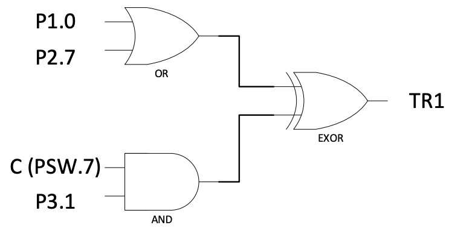

Schrijf een volledig 8051-assembleertaalprogramma dat continue deze logische schakeling doorloopt (veronderstel gerust dat er geen andere poortpinnen gebruikt worden). Wanneer TR1 op 1 gezet wordt, wordt de timer uiteraard gestart en wordt er op poortpin P0.5 een blokgolf van 10 KHz uitgestuurd. De schakeling wordt ondertussen verder doorlopen. Veronderstel dat de klokfrequentie van de CPU 25 MHz bedraagt en veronderstel ook dat de frequentie voor timer 1 nog eens intern gedeeld wordt door 12.

 De werkingsmode van timer 1 doet er niet toe. Werk dus gerust met een 16-bit timer of met een 8-bit timer al naargelang je eigen voorkeur. De code zelf schrijf je weg in 5.asm!


## Oefeningen

Mijn oplossingen voor sommige oefeningen.

### Reeks 6

**Oef 1**

Schrijf een eerste subroutine voor het bepalen van het product van twee getallen. De twee getallen worden voor het aanroepen van de subroutine op de stapel geplaatst. Bij deze oefening mag je gebruikmaken van de MUL-instructie. De uitvoer van de subroutine bevindt zich in de accu(LSB) en in het B-register(MSB).

```assembly
org 0000H
jmp main
org 0020H

main:
mov A, #20
push Acc
mov B, #5
push B
call vermenig
jmp $

vermenig:
	mov R0, SP ; we zetten onze stack pointer in R0, deze wijst op dit moment naar het returnadres
	dec R0 ; ik gebruik hier R0 eigenlijk als stack pointer
	dec R0 ; het returnadres is twee bytes, dus ik decrementeer R0 twee keer
	mov B, @R0 ;R0 wijst naar de waarde 5
	dec R0
	mov A, @R0 ;R0 wijst naar de waarde 20
	mul AB
	ret ;aangezien onze stack pointer nog steeds naar het returnadres wijst kunnen we gewoon returnen
```


**Oef 2**

Schrijf een recursieve subroutine die de faculteit berekent van het getal dat zich in de accu bevindt. Het resultaat komt terecht in het B-register. 

```c
int faculteit(int n){
  if(n == 0) return 1;
  else return n*faculteit(n-1);
}
```

```assembly
org 0000H
jmp main
org 0020H

main:
mov A, #5
push ACC
call faculteit
pop ACC
jmp $

faculteit:
	push 00h ; zet de inhoud van R0 op de stack
	mov R0, SP
	push ACC
	push B
	dec R0
	dec R0
	dec R0 ; wijst nu op ons getal

	mov A, @R0
	jnz recursie
	mov @R0, #1  ;aan dit stuk komen we dus pas wanneer ons getal nul is (basisgeval)
	
	pop B
	pop ACC
	pop 00H
	ret
	
	
recursie:
	dec A
	push Acc
	call faculteit
	pop B 
	inc A
	mul AB
	mov @R0, A
	pop B
	pop ACC
	pop 00H
	ret ; deze ret gaat dus telkens returnen naar de call 8 lijnen terug, en op het einde terug naar de call in main
```

