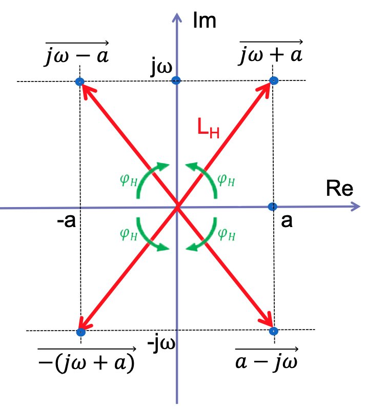
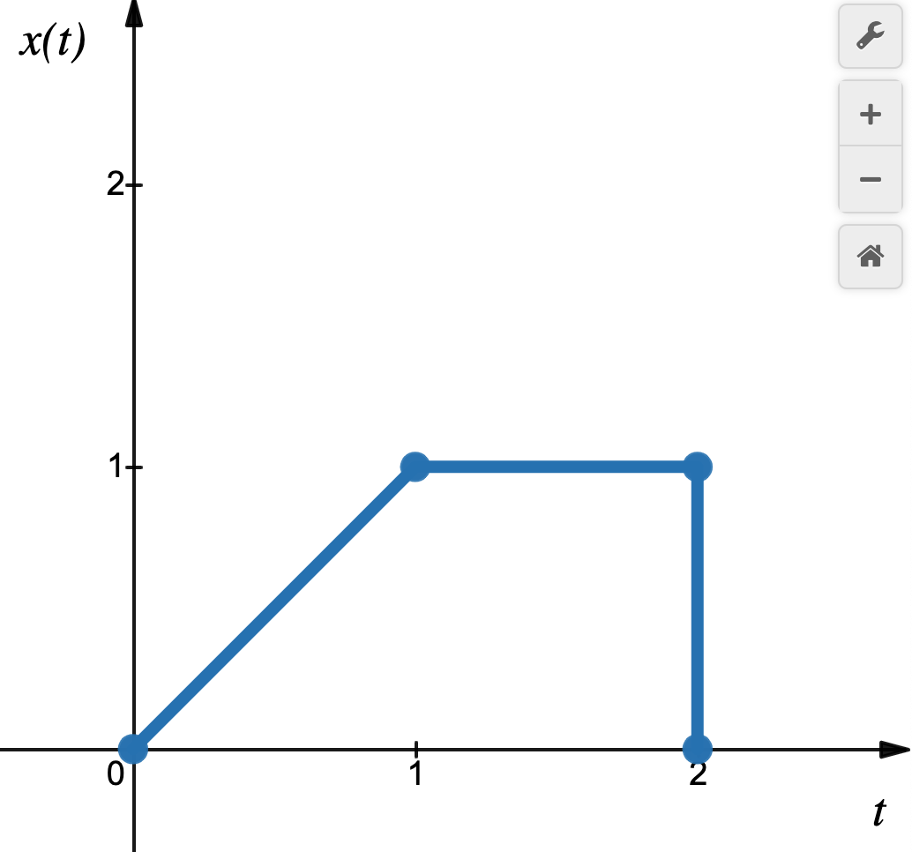
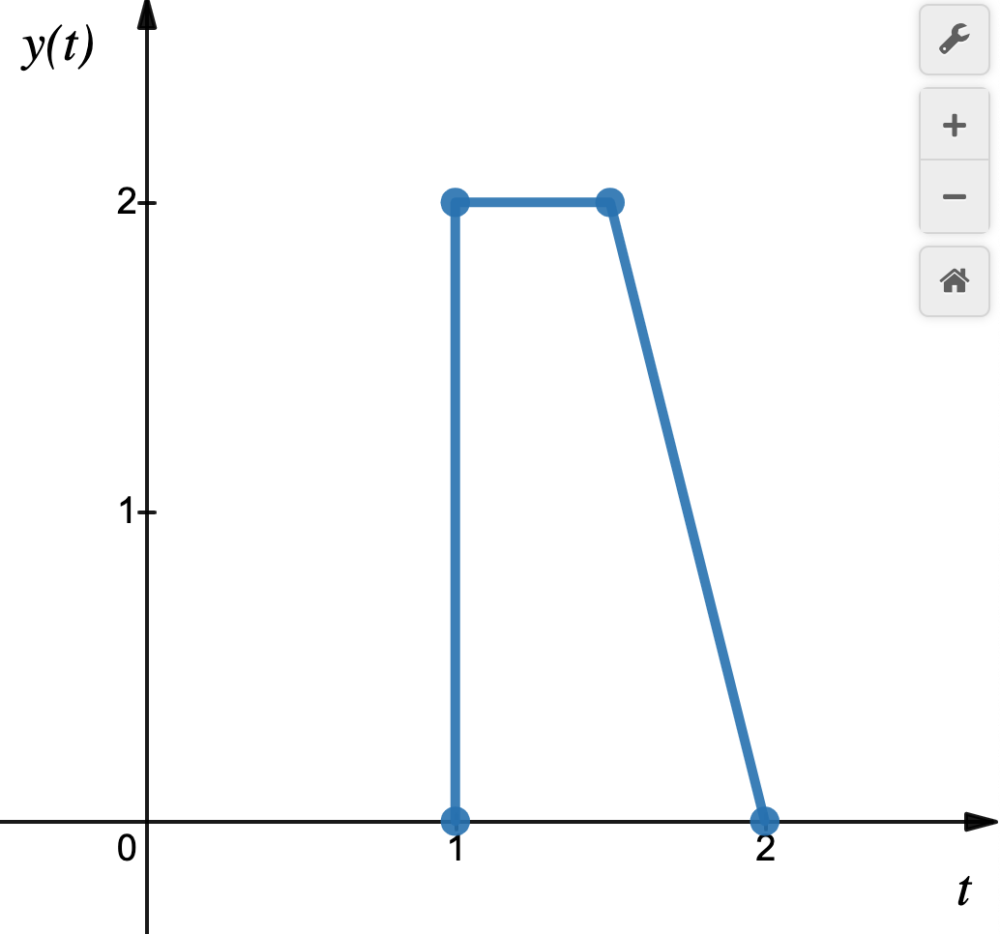
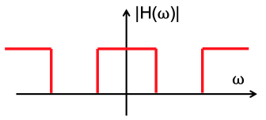
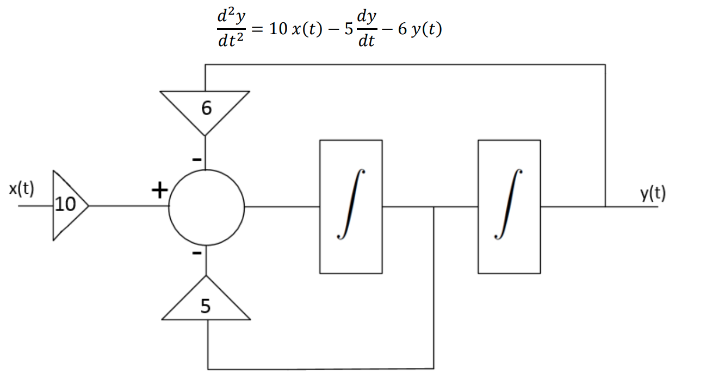
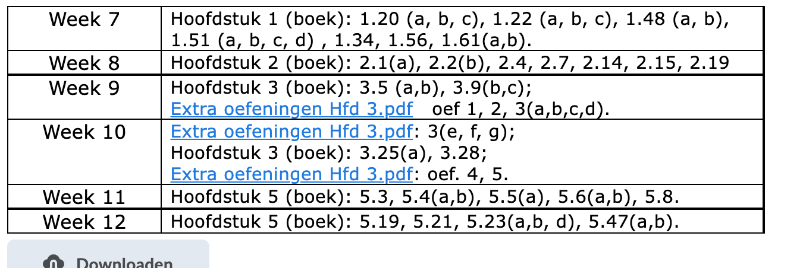

# Samenvatting Sisy

Ik filter de dingen die ik nuttig vind om te onthouden uit de slides en geef mogelijks een klein beetje uitleg waar nodig. 

## H1 - Introductie

### Complexe getallen

$z=a+jb$  met $j^2 = -1$

$ z = \abs{z}e^{j\theta}$

$\abs{z} = \sqrt{a^2 + b^2}$ en $\theta = arctan \frac{b}{a}$ 

$ a = \abs{z}cos(\theta)$ en $b = \abs{z}sin(\theta)$

$e^{j\theta} = cos(\theta) + j.sin(\theta)$

$cos(\theta) = \frac{e^{j\theta} + e^{-j\theta}}{2}$ en $sin(\theta) = \frac{e^{j\theta} - e^{-j\theta}}{2j}$ (Euler)

Spiraalvormig signaal in het complexe vlak = gedempte sinusoidale trilling:

$ e^{st} = e^{\sigma t}.e^{j \omega t} = e^{\sigma t}.(cos(\omega t) + jsin(\omega t))$

### Even/oneven signalen

Elk signaal kan geschreven worden als de som van een even en een oneven signaal

$ x(t) = x_e(t) + x_0(t)$

$x_e(t) = \frac{1}{2}(x(t) + x(-t))$

$x_o(t) = \frac{1}{2}(x(t) - x(-t))$

### Periodieke signalen

Als de verhouding van de periodes geen rationaal getal is, is het resulterende signaal niet periodiek.

### Energie en vermogen

$$
E = \int_{-\infty}^{+\infty}\abs{x(t)}^2dt \space \space \space Joule
$$

$$
P = \lim_{T\to \infty}\frac{1}{T}\int_{\frac{-T}{2}}^{\frac{T}{2}}\abs{x(t)}^2 dt \space \space \space Watt
$$

De energie van een **vermogensignaal** = $\infty$ 

Het vermogen van een **energiesignaal** = 0

Bij periodieke signalen moet je per periode kijken

### Basissignalen

**De heaviside functie**

 

**De diracfunctie**

De *oppervlakte* van de Diracfunctie is **1**.

Als je een sample neemt uit een signaal is dat hetzelfde als een **vermenigvuldiging** met de diracfunctie op het gewenste **tijdstip**.

> De diracfunctie is de **afgeleide** van de heaviside functie

**Nuttige eigenschap**

$$
\int_{a}^{b}\phi(t)\delta(t-t_0)dt = 
\begin{equation}
    \begin{cases}
      \phi(t_0) \quad  a<t_0<b \\
      0 \quad \quad \space \space \space a<b<t_0 \quad \text{ of } \quad t_0<a<b   \\
      ??? \quad \space \space \space  a=t_0 \quad of \quad b=t_0
      
    \end{cases}\,.
\end{equation}
$$

$$
\delta(at) = \frac{1}{\abs{a}}\delta(t)
$$

$$
\delta(-t) = \delta(t)
$$

$$
x(t).\delta(t) = x(0).\delta(t)
$$

### Systemen

#### Soorten systemen

Een systeem is een entiteit die een of meerdere signalen manipuleert om hieruit een of meerdere nieuwe signalen te creëren. 

**Deterministisch / stochastisch**

* Als de in- en uitgang van een systeem deterministische signalen zijn, wordt het systeem **deterministisch** genoemd 

* Als de in- en uitgang van een systeem random signalen zijn, wordt het systeem **stochastisch** genoemd.

  

**Geheugenloos / causaal**

* Een systeem is **geheugenloos** als de uitgang op een bepaald tijdstip enkel afhankelijk is van de ingang op datzelfde tijdstip, en dit voor alle tijden. 
  * y(t0) hangt enkel af van *x(t0), ∀t0 ∊]-∞, +∞[*
* Een systeem is **causaal** als de uitgang op een bepaald tijdstip afhangt van de ingang op datzelfde en/of vorige tijdstippen. 
  * Een systeem is niet causaal als de uitgang op een bepaald tijdstip ook afhangt van toekomstige ingangen. 

In deze cursus dus altijd causaal, aangezien we de tijd gebruiken als onafhankelijke veranderlijke.

**Additief / homogeen**

* Een systeem wordt **additief** genoemd als *T{x~1~+x~2~} = y~1~ + y~2~ , ∀ x~1~, x~2~*
* Een systeem wordt **homogeen** genoemd als *T{ax} = ay , ∀ x, a*
* Een systeem wordt lineair genoemd als het zowel additief als homogeen is. Dus: *T{ax~1~+bx~2~} = ay~1~ + by~2~*
  * = **superpositie **eigenschap

**Tijdsvariant / tijdsinvariant**

* Een systeem is **tijdsinvariant** als een tijdsverschuiving van het ingangssignaal eenzelfde tijdsverschuiving van het uitgangssignaal geeft. Het antwoord van het systeem op een willekeurige ingang is onafhankelijk van het moment waarop deze wordt aangelegd. Als *T{x(t)} = y(t) dan T{x(t-t~0)~} = y(t-t~0~) , ∀t*
  * = **stationair**
* Systemen die niet tijdsinvariant zijn, worden logischerwijze **tijdsvariant** genoemd
  * = **niet-stationair**

#### Stabiliteit

**BIBO-stabiliteit** (Bounded Input – Bounded Output)

> Als men een eindige ingang aanlegt aan het systeem, moet de uitgang ook eindig blijven. De uitgang van het systeem zal niet divergeren als de ingang ook niet divergeert.

Een systeem is stabiel als:
$$
\int_{-\infty}^{+\infty}\abs{h(t)}dt < \infty
$$
met $h(t$) het impulsantwoord

#### Feedback

Oh yeey nu kunnen we feedback geven op de cursus

sike :joy:

Bij een feedbacksysteem wordt de output van het signaal teruggekoppeld naar de input. That's it. (voor nu denk ik)

## H2 - LTI Systemen in continue tijd

Lineaire TijdsInvariante Systemen in Continue Tijd

### Impulsantwoord

Als een LTI systeem geëxciteerd wordt door een ingang *x(t) = $\delta$(t)*, dan heet de uitgang ervan het **impulsantwoord** ( = impulsrespons)

Elke continue functie kan geschreven worden als een oneindige som van oneindig dicht bij elkaar gelegen in de tijd verschoven impulsen met elk een eigen gewichtsfactor.

$$
x(t) = \int_{-\infty}^{+\infty}x(\tau)\delta(t-\tau)d\tau
$$

= een impuls op het tijdstip **$\tau$** vermenigvuldigd met de waarde van het signaal op het tijdstip $\tau$ 

We kunnen dan dit signaal beschrijven door oneindig veel impulsjes op te tellen.

### Convolutie

$$
y(t) = \int_{-\infty}^{+\infty}x(\tau).h(t-\tau)d\tau = x(t) * h(t) = convolutie
$$

Een LTI-systeem is dus volledig gekarakteriseerd door zijn impulsantwoord.

$x(t) * h(t)$ is **commutatief**, **associatief** en **distributief**

#### Tekenen

Grafische interpretatie van de convolutie

1. a. Teken *x(τ)* en *h(τ)* (τ = tijdsveranderlijke) 
   1. Teken *h(-τ)* 
   2. Teken *h(t-τ)* met t een parameter 
2. Vermenigvuldig *x(τ)* en *h(t-τ)* en dit voor alle *τ* 
3. Integreer het onder 2 bekomen product (= oppervlakte onder de curve) = *y(t)*, *t* = parameter 
4. Kies een andere *t*-waarde en herhaal vanaf 1.1 tot alle *t*-waarden van -∞ tot +∞ gepasseerd zijn

#### Periodieke convolutie

neem gewoon de integraal van 0 tot $T_0$

#### Stabiliteit

Een LTI-systeem is stabiel als  $\int_{-\infty}^{+\infty}\abs{h(t)}dt < \infty$, dus als het impulsantwoord uitsterft.

#### Stapantwoord

$$s(t) = \int_{-\infty}^{+\infty}h(\tau)d\tau$$ = de integraal van het impulsantwoord.

#### Nuttige eigenschappen

Een signaal wordt volledig beschreven door zijn impulsantwoord:
$$
x(t)*\delta(t) = x(t)
$$
Hetzelfde als je het impuls verschuift:
$$
x(t)*\delta(t-t_0) = x(t-t_0)
$$
Als je de formule van convolutie bekijkt (het $h(t − \tau)$ gedeelte), en als $h$ de heaviside functie neemt, dan hoef je convolutieintegraal maar tot $t$ te nemen. (want hij is 0 bij $\tau > t$)
$$
x(t)*u(t) = \int_{-\infty}^{t}x(\tau)d\tau
$$
Hetzelfde als je de heaviside over de tijd verschuift:
$$
x(t)*u(t-t_0) = \int_{-\infty}^{t-t_0}x(\tau)d\tau
$$

### Eigenfuncties en eigenwaarden

Indien $UIT = \lambda.IN$ dan is $IN$ een eigenfunctie van de operatie en $\lambda$ een eigenwaarde (λ ∊ℂ)

Bij een LTI-systeem met impulsantwoord $h(t)$ en ingangssignaal $x(t) = e^{st}$ (gedempte sinusoïdale)

Dan:
$$
y(t)= x(t) * h(t) 
= \int_{-\infty}^{+\infty}h(\tau).e^{s(t - \tau)}d\tau  
=e^{st}. \int_{-\infty}^{+\infty}h(\tau).e^{-s \tau}d\tau  
= \lambda.e^{st} 
= \lambda.x(t)
$$
Signalen van de vorm $e^{st}$ zijn dus eigenfuncties van LTI-systemen 

De eigenwaarde wordt dan bepaald als: $\lambda =\int_{-\infty}^{+\infty}h(\tau).e^{-s \tau}d\tau \in \mathbb{c} $

###  Blokjes

Oftewel: **Simuleren van dynamische systemen in continue tijd  (simuleren van differentiaalvergelijkingen)**

| Naam                                    | Blokje                                                       |
| --------------------------------------- | ------------------------------------------------------------ |
| Integrator ( uit = $\int_{0}^{t}in.dt$) |  |
| Versterking a (vermenigvuldigen met a)  |  |
| Ingaande signalen optellen              |  |

## H3 - Laplace

Gedempte sinusoidale trilling: $ e^{st} = e^{\sigma t}.e^{j \omega t} = e^{\sigma t}.(cos(\omega t) + jsin(\omega t))$

LTI-systeem met impulsantwoord $h(t)$ en ingangssignaal $x(t) = e^{st}$, dan is:
$$
y(t)= x(t) * h(t) 
= \int_{-\infty}^{+\infty}h(\tau).e^{s(t - \tau)}d\tau  
=e^{st}. \int_{-\infty}^{+\infty}h(\tau).e^{-s \tau}d\tau  
= \lambda.e^{st} 
= \lambda.x(t)
$$
De eigenwaarde wordt dan bepaald als: $\lambda =\int_{-\infty}^{+\infty}h(\tau).e^{-s \tau}d\tau \in \mathbb{c} $

We zouden convolutie kunnen omzetten in een product als we een ingangssignaal zouden kunnen omvormen naar een som van gedempte sinusoidalen:

### Laplace-transformatie

$$
X(s) = L\{x(t\}) = \int_{-\infty}^{+\infty}x(t)e^{-st}dt
$$

### Eigenschappen

Tijdverschuiving:
$$
L\{x(t - T\}) = \int_{-\infty}^{+\infty}x(t - T)e^{-st}dt
\xRightarrow[met \space \tau=t-T]{} 
\int_{-\infty}^{+\infty}x(\tau)e^{-s( \tau + T)}d(\tau + T) 
= e^{-sT} \int_{-\infty}^{+\infty}x(\tau)e^{-s\tau}d\tau
$$

$$
= e^{-sT}X(s)
$$

Convolutie:
$$
y(t) = x_1*x_2 \xrightarrow[L - tf_0]{} Y(s) = X_1(s).X_2(s)
$$
Afleiden:
$$
L\{\frac{dx}{dt}\} = s.X(s)
$$

$$
L\{\int_{-\infty}^{t}x(\tau)d\tau\} = \frac{1}{s}X(s)
$$

### Inverse Laplace-transformatie

$$
X(s) = L^{-1}\{x(t\}) = \frac{1}{2\pi j} \int_{c -j\infty}^{c+j\infty}X(s)e^{-st}ds 
\xRightarrow[]{} niet \space oplossen, \space is \space te \space moeilijk
$$

$x(t)$ = signaal, $X(s)$ = gewichtsfactor, $c$ = demping en $e^{st}$ = gedempte sinusoidale trilling

**Hoe oplossen?** 

**Methode 1**: opsplitsen in partieelbreuken en oplossen met de tabel

**Methode 2**: $x(t) = \sum$ van de residu's van de polen van $X(s)$

Residu van enkelvoudige pool:
$$
\lim_{s \to p}(s-p)X(s)e^{st}
$$
Residu van m-voudige pool:
$$
\lim_{s \to p}\{\frac{d^{m-1}}{ds^{m-1}}[(s-p)^m X(s) e^{st}]\}.\frac{1}{(m-1)!}
$$

### De systeemfunctie

= de verhouding van de Laplacegetransformeerden van de in- en uitgang van een systeem.

* Als je de in- en uitgang van een systeem kent, kan je de systeemfunctie bepalen
* De systeemfunctie is de laplacegetransformeerde is van het impulsantwoord
* Waaruit volgt:
  * Het impulsantwoord karakteriseert het systeem volledig
  * Dus de systeemfunctie ook

PAS OP: $h(t) = \frac{x(t)}{y(t)} \neq H(s)$  (je moet altijd grote letters gebuiken voor de Laplacegetransformeerde zo te zien)

> "Dit is je reinste onzin" - Jan Beyens (quote van de eeuw)

#### Relatie met differentiaalvergelijkingen

Als je van een differentiaalvergelijking de bilaterale Laplacetransformatie neemt en de eigenschap $ L\{\frac{dx}{dt}\} = s.X(s)$ toepast, kan je het linker en het rechterlid gewoon door elkaar delen om de systeemfuntie te bekomen.

//todo misschien wat meer info hier

#### Relatie met stabiliteit

Een LTI-systeem kan alleen BIBO stabiel zijn als zijn impulstantwoord absoluut integreerbaar is. Dit kan alleen als alle polen van de systeemfunctie een negatief reëel deel hebben.

Als je dit tekent, is een systeem enkel stabiel als alle polen van de systeemfunctie in het linkerhalfvlak liggen.

### Unilaterale Laplacetransformatie

Definitie:
$$
X(s) = L\{x(t\}) = \int_{0-}^{+\infty}x(t)e^{-st}dt
$$
Alle bewerkingen zijn hetzelfde als de bilaterale, behalve afleiden:
$$
L\{x(t)\} = X(s) 
\xrightarrow[]{}
L\{\frac{dx}{dt}\} = s.X(s)- x(0^-)
$$
Zo kan je nu differentiaalvergelijkingen met beginvoorwaarden oplossen.

Voor de tweede orde:
$$
L\{\frac{d^2x}{dt^2}\} =
s^2X(s) - s.x(0^-) - x'(0^-)
$$
Je kan dit ook veralgemenen naar hogere ordes.

Een klein voorbeeldje om te schetsen dat het niet zo moeilijk is:
$$
\frac{d^2y}{dt^2} + 4\frac{dy}{dt} + 8y(t) = 0
$$
Wordt:
$$
s^2Y(s) - sy(0) - y'(0) + 4(sY(s)-y(0)) + 8Y(s) = 0
$$
Bij de oefeningen zijn y(0) en y'(0) gegeven, dus kan je dit gemakkelijk oplossen naar Y(s) en dan met de tabel van de laplacegetransformeerden uitwerken.

## H4 - Fourier-analyse

### The basics

#### Exponentiële vorm

$$
T_0 = \space \text{periode} \newline
f_0 = \frac{1}{T_0} \text{ = fundamentele frequentie} \newline 
2\pi f_0 = \omega_0 \space \text{ = fundamentele pulsatie} \newline
$$

$$
\text{Dan geldt: } \newline
x(t) = \sum_{k=-\infty}^{+\infty}c_ke^{jk\omega_0t}
$$

Elk willekeurig signaal $x(t)$ is dus eigenlijk een oneindige **som** van:

* Complexe sinusoïdalen met pulsaties die veelvouden zijn van de grondpulsatie ($e^{jk\omega_0t}$)

* Met een gewichtsfactor $ c_k$ 

met wat omvormingen vind je $c_k$:
$$
c_k = \frac{1}{T_0}\int_{T_0}x(t)e^{-jk\omega_0t}dt
$$
**Gelijkstroomcomponent**
$$
c_0 = \frac{1}{T_0}\int_{T_0}x(t)dt
$$
Als $x(t)$ reëel is, wat betekent dat $x(t) = \bar{x}(t)$, met  $\bar{x}(t)$ het complex toegevoegde, dan geldt:
$$
x(t) = \sum_{k=-\infty}^{+\infty}c_ke^{jk\omega_0t}  = 
\sum_{k=-\infty}^{+\infty}\bar{c}_ke^{-jk\omega_0t}
\xrightarrow[]{}
\bar{c_k} = c_{-k}
$$

#### De trigonometrische notatie

$$
x(t) = \frac{a_0}{2}+\sum_{k=1}^{\infty}(a_kcosk\omega_0t + b_ksink\omega_0t)
$$

$$
c_k = \frac{1}{T_0}\int_{T_0}x(t)e^{-jk\omega_0t}dt =
\frac{1}{T_0}\int_{T_0}x(t)(cosk\omega_0t + sink\omega_0t)dt
$$

$$
c_k = \frac{1}{2}(a_k-jb_k) \quad \quad c_{-k} = \frac{1}{2}(a_k+jb_k) \newline
\frac{a_0}{2}=c_0 \quad \quad a_k = c_k + c_{-k} \quad \quad b_k = j(c_k - c_{-k}) \newline
$$

als x(t) reëel is, dan zijn $a_k$ en $b_k$ ook reëel en
$$
a_k = 2Re[c_k] \quad b_k = -2Im[c_k]
$$
Als $x(t)$ even is: $b_k$ = 0 -> alleen cosinustermen

als $x(t)$ oneven is: $a_k$= 0 -> alleen sinustermen

#### Harmonische notatie

$$
x(t) = c_0 + \sum_{k=1}^{\infty}c_kcos(k\omega_0t - \theta_k) \quad \omega_0= \frac{2\pi}{T_0}
\newline c_0 = \text{DC-component (gelijkstroomcomponent, gemiddelde waarde)}
\newline c_1 = \text{ de fundamentele component}
\newline c_k = \text{ de harmonische amplitude}
\newline \theta_k = \text{de harmonische fase}
$$

Relatie met trigonometrische notatie:
$$
c_0 = \frac{a_0}{2} \quad \quad c_k = \sqrt{a^2_k + b^2_k} \quad \quad \theta_k = tan^{-1}\frac{a_k}{b_k}
$$
:warning: $c_k$ bij de harmonische notatie = $2.c_k$ van de complex exponentiële notatie

### Convergentie

#### Dirchlet voorwaarden

een periodiek signaal heeft een Fourierreeks als het aan een bepaald aantal voorwaarden voldoet:

1. $x(t)$ is absoluut integreerbaar over een willekeurige periode

   dus $\int_{T_0}\abs{x(t)}dt < \infty$

2. $x(t)$ heeft een eindig aantal maxima en minima in een eindig interval

3. $x(t)$ heeft een eindig aantal discontinuïteiten in een eindig interval, elk van de discontinuïteiten is eindig

### Amplitude- en fasespectrum

Het uitzetten van de gewichtsfactoren van de verschillende sinusoidale termen die bijdragen tot ons signaal in functie van de pulsatie

Wat is dat? We kijken per pulsatie wat de gewichtsfactor is die we nodig hebben voor die sinusoidale met die pulsatie om samengeteld te worden tot ons signaal. Elk reeel signaal heeft een **even** amplitudespectrum en een **oneven** fasespectrum.

### Vermogen

Vermogen van een periodiek signaal:
$$
P = \frac{1}{T_0} \int_{T_0}\abs{x(t)}^2t = \sum_{k=-\infty}^{+\infty}\abs{c_k}^2
$$

### Fouriertransformatie

$$
X(\omega) = \int_{-\infty}^{+\infty}x(t)e^{-j\omega t}dt
$$

Inverse fouriertransformatie
$$
x(t) = \frac{1}{2\pi}\int_{-\infty}^{+\infty}X(\omega)e^{j\omega t}d\omega
$$
Een signaal $x(t)$ heeft een fouriertransformatie als het voldoet aan de [voorwaarden van dirchlet](#Dirchlet voorwaarden)

#### Eigenschappen

$$
\text{Lineariteit} \xrightarrow[\quad]{}F\{ax(t) + by(t)\} = aX(\omega) + bY(\omega) \newline
\text{Tijdverschuiving} \xrightarrow[\quad]{} F\{x(t-\tau )\} = e^{-j \omega t}X(\omega) \newline
\text{Frequentieverschuiving} \xrightarrow[\quad]{} F^{-1}\{x(\omega - \omega_0) )\} = e^{j \omega_0 t}x(t)\newline 
\text{Convolutie} \xrightarrow[\quad]{}  F\{x(t) * y(t)\} = X(\omega).Y(\omega) \newline
\text{Parseval} \xrightarrow[\quad]{} \int_{-\infty}^{+\infty}\abs{x(t)}^2dt = 
\frac{1}{2\pi}\int_{-\infty}^{+\infty}\abs{X(\omega)}^2d\omega \quad \text{= energie van een signaal} \newline
\text{Dualiteit} \xrightarrow[\quad]{} x(t)\xrightarrow[F]{}X(\omega)
\xLeftrightarrow[]{}X(t)\xrightarrow[F]{}2\pi.x(-\omega)
$$

Voorbeeldje van dualiteit (je moet een beetje omgekeerd denken)

### Fourier-analyse van systemen

$$
H(\omega) = Y(\omega)/X(\omega) = F\{h(t)\} = \text{frequentieantwoord}
$$

Wat wil dit zeggen? Als een sinusoidaal signaal door een systeem gaat, is de uitgang ook een sinusoidaal signaal met dezelfde frequentie. Het enige wat verandert is de amplitude en de fase. (hoe sterk het signaal is en hoe veel hij opschuift). 

Wat ik ook niet begreep is wat die $\abs{H(\omega)}$ nu eigenlijk betekent. Maar het is echt gewoon de absolute waarde, of in dit geval ($H(\omega)$ is complex), de modulus: $\sqrt{Re(H(\omega))^2 + Im(H(\omega))^2}$. Verder nog: $\varphi_h(\omega) = Arctan(\frac{Re(H(\omega))}{Im(H(\omega))})$

Nog een klein dingetje:

Ik zou dit eens bekijken, het werd op een examen van een vorig jaar letterlijk gevraagd.

### Bandbreedte

Meest gebruikte definitie = **3dB-bandbreedte** (half power bandwidth) = positieve frequentie bij dewelke het amplitudespectrum $\abs{H(\omega)}$ gedaald is tot een waarde $\frac{\abs{H(0)}}{\sqrt{2}}$.

Dit heet de half power bandwidth omdat het vermogen $P = H^2$. Dus als je het vermogen gedeelt door twee, kom je dus bij die $\sqrt{2}$. We gaan dus eigenlijk vanaf het punt dat we aan de helft van het vermogen zitten, hogere frequenties niet meer meetellen.

$$
dB = 20\log_{10}\abs{H} = 10\log_{10}P
$$

### BODE-diagrammen

King marti's ez guide to bodediagrammen :tm:

**Stap 1**

Je krijgt een systeemfunctie gegeven. Omdat een bodediagram logaritmisch is, kunnen we gewoon elke factor afzonderlijk tekenen en daarna alle grafiekjes optellen. Maak een lijstje van alle factoren (bv. $(s+10), \frac{1}{s+1}$ enz.)

**Stap 2**

Voor elk type factor ziet de grafiek er hetzelfde uit. Er zijn maar een paar mogelijkheden, dus hier een handig overzicht.

| Type            | Magnitude \|H\|                                              | Fase $\varphi_h$                                            |
| --------------- | ------------------------------------------------------------ | ----------------------------------------------------------- |
| $s+a$           | $20\log(a)$ tot $a$, daarna +20dB per dec                    | 45° op $a$, 0° op vorige dec, 90° op volgende dec :warning: |
| $\frac{1}{s+a}$ | $-20\log(a)$ tot $a$, daarna -20dB per dec (hetzelfde als $s+a$ spiegelen t.o.v de y-as) | (hetzelfde als $s+a$ spiegelen t.o.v de y-as)               |
| $s$             | 0 op $\omega = 1$, altijd +20dB per dec                      | altijd 90°                                                  |
| $\frac{1}{s}$   | 0 op $\omega = 1$, altijd -20dB per dec                      | altijd -90°                                                 |
| $a$             | altijd $20\log(a)$                                           | altijd 0°                                                   |

:warning: Je moet een beetje oppassen bij $s+a$ als je de fase wilt tekenen. Kijk naar de tekening: $j\omega + a$ komt overeen met $s + a$ en gaat dus van 0° naar 90°. Bij $s-a$ gaan we van 180° naar 90°, want $a$ is negatief. Hetzelfde voor de rest.

**Stap 3**

Nu moet je gewoon de som maken van je grafiekjes voor $\abs{H}$ en $\varphi_h$.

## H5 - Sampling

Sampling is basically een signaal in kleine stukjes kappen zodat je het in een digitaal medium kan opslaan.

### Nyquist-Shannon

We kunnen een signaal moduleren met een oneindige reeks van impulsen (de impulstrein :train: toet toet). Als we dan onze impulstrein omzetten in een fourierreeks en de frequentieverschuivingseigenschap toepassen krijgen we:
$$
\hat{F}(\omega) = \frac{1}{T}\sum_{n=-\infty}^{\infty}F(\omega - n\omega_s)
\newline \text{met samplepulsatie } \omega_s 
$$
Samplepulsatie is een kutwoord. Sample rate klinkt logischer.

Je kan het signaal enkel reconstrueren als $\omega_s > 2B$ , maar logischerwijze willen we $\omega_s$ zo hoog mogelijk.

### Aliasing

Als $\omega_s$ te laag is krijg je aliasing, dan gebeuren er allemaan vreemde dingen. Om dit tegen te gaan kunnen we het signaal filteren met een **anti-aliasing** filter alvorens het te samplen. In dit geval is dat een low pass filter.

### Signaalreconstructie

We kunnen een ideale reconstructie doen met de **Shannon-filter**, maar dan moeten we wel op voorhand alle samples kennen.

#### De Zero Order Hold (ZOH)

> Dit is het wiskundig model voor de praktische reconstructie uitgevoerd door een Digitaal naar Analoog Convertor (DAC). De waarde van elke sample wordt eenvoudigweg vastgehouden gedurende Ts tot aan de volgende sample. Men bekomt aldus een stuksgewijs constant signaal.

## Examen 

### Mogelijke examenvragen

Deze vragen zijn ofwel op een vorig examen geweest, of onze Jan heeft gezegd dat hij ze waarschijnlijk gaat stellen op het examen.

**1. Gegeven een tekening (amplitudespectrum en fasespectrum) van het frequentieantwoord van een systeem. Bepaal de uitgang. Ingang x(t) = cos(50t)**

Deze oefening is poepsimpel. De eerste grafiek toont de amplitudewijziging die het signaal ondergaat wanneer hij door het systeem gaat. 2 dus ($\omega$ = 50). Je moet het signaal vermenigvuldigen met 2. De tweede tekening toont de faseverschuiving die het signaal ondergaat wanneer hij door het systeem gaat. ($-\frac{\pi}{2}$ Bij $\omega$ = 50). Het uitgangssignaal is dus $2\cos(50t - \frac{\pi}{2})$. Je hoeft nieteens te rekenen. We maken gebruik van [Eigenschap amplitude- en fasewijziging](#Fourier-analyse van systemen)

**2. Gegeven een impulsantwoord h(t), zoek de systeemfunctie H(s). Geef de differentiaalvergelijking die de dynamica van dit systeem beschrijft.**

Om de systeemfunctie H(t) te vinden neem je de Laplacegetransformeerde van h(t). Om de differentiaalvergelijking te vinden gebruik je $H(s) = \frac{Y(s)}{X(s)}$ . Zet alles met $Y(s)$ links en alles met X(s) rechts. Vervang ten slotte $Y(s)$ door $y(t)$, $sY(s)$ door $\frac{dy}{dt}$, $s^2Y(s)$ door $\frac{d^2y}{dt^2}$, ... idem ditto voor $X(t)$.

 

**3. Teken een simulatieschema voor een systeem op basis van integratoren**

Dit dus tekenen vanuit die differentiaalvergelijking. Ik ga dit niet uitleggen, maak gewoon wat oefeningen.

**4. Gegeven een simulatieschema. Geef de systeemfunctie**

Dus je moet eerst de differentiaalvergelijking uit het simulatieschema halen (omgekeerde van vraag 3). Daarna kan je door de Laplacegetransformeerde van de differentiaalvergelijking te berekenen met $H(s) = \frac{Y(s)}{X(s)}$ het omgekeerde doen van in vraag 2.

**5. Gegeven een tekening van een filter, welke filter is dit.**

En dan moet je zeggen: laagdoorlaat of hoogdoorlaat of één van die. Leer dit maar vanbuiten, er zijn er maar 4. 

Oké, geheugensteuntje. $\omega$ is de pulsatie. Als je naar het eerste figuurtje kijkt, zit ons vierkantje op de lage pulsaties. We gaan dus alleen lage frequenties doorlaten. De bandpass laat maar een bepaald deel van de frequenties door (pass). En de bandstop stopt een deel van de frequenties (die gaatjes). 

**6. Gegeven een systeemfunctie H(s), teken het bodediagram.**

Deze komt sowieso op het examen (heeft Jan gezegd in de les). Maak er gewoon een paar en alles komt goed.

[stappenplan](#BODE-diagrammen)

**7. Gegeven een signaal. Wat is het amplitudespectrum en het fasespectrum.**

H4, slide 11 en 12 //TODO

**8. $H(s) = \frac{1}{1-s}$ Wat is het gedrag van $\varphi(\omega)$**

Kan eender welke vorm zijn van $1+s$, zie [tekening](#BODE-diagrammen). 

**9. Een wiel draait aan $x$ toeren per seconden, een scherm flitst $y$ keer per seconde, wat is het schijnbare toerental?**

ik vind het gemakkelijk om bij deze opdracht gewoon een aantal frames te tekenen. dan weet je al direct in welke richting het wiel lijkt te draaien. Deel $x$ door $y$ om te weten hoe veel toeren per frame er gebeuren. Als het wiel tussen een halve en een hele toer per frame doet, lijkt het omgekeerd te gaan. 

*Voorbeeld*

Een wiel draait aan -9 toeren per seconde. Een scherm flitst 12 keer per seconde. Wat is het schijnbare toerental van het wiel?

* $\frac{-9}{12}$ toeren per frame = $\frac{-3}{4}$, dit is tussen 0.5 en 1
* Het wiel lijkt dus $\frac{1}{4}$ toeren per frame te doen
* Vermenigvuldig dit met het aantal frames per seconde om het schijnbare toerental te krijgen = 3 toeren/sec

### Vorige examenvragen (met mijn oplossing)

**Gegeven: $H(s) = \frac{s-10}{s(s+10)}$ is de systeemfunctie van een systeem in continue tijd. (2018)**

1. *Is dit systeem BIBO-stabiel? Verklaar.*
   1. Nee, de polen zijn niet strikt negatief
2. *Bereken en teken het impulsantwoord van dit systeem*
   1. Gewoon de inverse Laplacetransformatie doen
   2. $h(t) = (2e^{-10}-1)u(t)$ sorry geen zin om te tekenen
3. *Schrijf de differentiaalvergelijking die de dynamica van dit systeem beschrijft*
   1. Gebruik $H(s) = \frac{Y(s)}{X(s)}$, dan zet je $X(s).s$ om naar $x'$ enzovoort.
   2. $y'' + 10y' = x' -10x$
4. *Men legt aan de ingang van het systeem een signaal $x(t) = \delta(t)+10e^{10t}$ aan. Bereken en teken het uitgangssignaal $y(t)$*
   1. Gebruik $X(s).H(s) = Y(s)$
   2. Dan zet je $Y(s)$ om naar $y(t)$ met Laplace.
   3. $y(t) = e^{-10t}u(t)$
5. *Teken het bodediagram van het systeem (gebruik hiervoor de methode met de benaderende lijnstukken)*
   1. Antwoord coming soon in theatres near you

---

**Een wiel draait aan -9 toeren per seconde. Een scherm flitst 12 keer per seconde. Wat is het schijnbare toerental van het wiel?** (Januari 2021)

A. +4 toeren/sec 

**B**. +3 toeren/sec: $-\frac{9}{12}$ toeren per frame. Oftewel schijnbaar $\frac{3}{12}$. Doe dit terug maal twaalf voor het schijnbare toeren/sec.

C. -3 toeren/sec 

D. -4 toeren/ sec

---

**$H(s) = \frac{1}{s-1}$. Het gedrag van $\varphi(\omega)$ is?** (Januari 2021)

A. 180° voor 𝜔 = 0, 90° voor 𝜔 gaat naar oneindig 

B. 0° voor 𝜔 = 0, 90° voor 𝜔 gaat naar oneindig 

C. 0° voor 𝜔 = 0, -90° voor 𝜔 gaat naar oneindig 

**D**. -180° voor 𝜔 = 0, -90° voor 𝜔 gaat naar oneindig

Gebruik deze figuur: 

voor $j\omega-a$ gaan we normaal van 180° naar 90°, maar hij staat in de noemer. Als je mijn tabelletje hebt gelezen weet je dan dat je nog het tegengestelde moet nemen. Antwoord D dus.

---

**Wat is het functievoorschrift van y(t) in functie van x(t)?** (Januari 2021)

A. $y(t) = 2x(2(2-t))$

B. $y(t) = 2x(2-\frac{t}{2})$

C. $y(t) = 2x(-2t+\frac{3}{2})$

D. $y(t) = 2x(-\frac{t}{2}+3)$

Oke dit is een leuke vraag. Als we een grafiek tekenen, gaan we normaal eerst verschuiven, en dan schalen. Hier moeten we omgekeerd werken.

1. We maken ons ingangssignaal half zo lang: $x(2t)$
2. Verschuiven 2 vakjes naar rechts: $x(2(t-2))$
3. Spiegelen het (rond het verschoven nulpunt, 2): $x(-2(t-2))$
4. En tenslotte schalen we de amplitude: $2x(-2(t-2)) = 2x(2(2-t))$, optie **A** dus.

(ik denk dat je ook gewoon allemaal punten kan invullen om de oplossing te reverse-engineeren, als iemand zin heeft om dat te doen. Laat maar weten.)

---

**Welke filter is dit?** (Januari 2021)

A. Laagdoorlaatfilter 

B. Hoogdoorlaatfilter 

C. Bandpass-filter 

**D**. Bandstop-filter

Hopelijk vraagt hij dit. Gratis punten

---

**Wat is de systeemfunctie?**

Hoe ik dit onthou. $y(t)$ is de uitgang van de sommatie. Dus y(t) = som van 3 andere dingen (van boven naar onder):

1. $-\int y$
2. $\int x$
3. $x$

Als we nu de som van die dingen nemen en alles een keertje afleiden krijgen we: $dy = -y + x + dx$

Zet de xjes en ytjes ieder aan hun kant, doe de Laplace-transformatie: $Ys + Y = Xs + X$

De systeemfunctie: $H(s) = \frac{Y(s)}{X(s)} = \frac{s+1}{s+1} = 1$

---

**Welke vergelijking heeft de 4 punten op de tekening de oplossing?**

A. $x^4 + 1 = 0$ 

B. $x^4 − 1 = 0$ 

C. $x^4 + j=0$

D.  $x^4 − j=0$

Ik veronderstel dat de assen de reële en imaginaire as zijn. Dan veronderstel ik ook dat de straal van de cirkel 1 is. 

Als we nu punt het eerste puntje rechtsboven nemen: $P_1 = \frac{\sqrt{2}}{2} + \frac{\sqrt{2}}{2}j$ = $e^{\frac{\pi}{4}j}$

Doe die gewoon tot de 4de macht en je hebt je uitkomst: -1 -> $x^4 = -1$, dus $x^4 + 1 = 0$

---

**Het frequentieantwoord van $p(t)$ is gegeven in de tekening. Wat is het spectrum van $R(\omega) = P(\omega).P(\omega)$?**

$H(\omega) = \frac{Y(\omega)}{X(\omega)}$

$H(\omega)= \abs{H(\omega)}e^{j\varphi(\omega)}$

geen idee wat ik moet doen sorry

---

.png)

1. **Bepaal de systeemfunctie $H(s)$**

Impulsantwoord $\omega(t)$ = $u(t) + u(t-a)$

Als we Laplacetransformeren is de systeemfunctie $H(s) = \frac{1}{s} + e^{-as}\frac{1}{s}$

2. **Bepaal de uitgang $y(t)$ en teken.**

$y(t) = \omega(t)*h(t)$ 

$Y(s) = H(s).H(s)$

---

**Een lineair tijdsinvariant systeem heeft als impulsantwoord $h(t) = 10 . (e^{-2t} – e^{-3t}) . u(t)$.**

1. **Zoek de systeemfunctie**

Gewoon $h(t)$ Laplace transformeren= $\frac{10}{s+2} - \frac{10}{s+3} = \frac{10}{s^2 + 5s + 6}$

2. **Geef de differentiaalvergelijking die de dynamica van dit systeem beschrijft. (Gebruik als ingangsfunctie x(t) en als uitgangsfunctie y(t)) **

$\frac{Y(s)}{X(s)} = \frac{10}{s^2 + 5s + 6}$ 

$10X(s) = Y(s)s^2 + Y(s).5s + Y(s).6$

$10x(t) = y''(t) + 5y'(t) + 6y(t)$

3. **Teken een simulatieschema voor dit systeem op basis van integratoren.**

4. **Als de ingang x(t) = 3/5 . u(t), bepaal dan lim 𝑡 → +∞ 𝑦(𝑡). (Met andere woorden, wat zal de uitgang worden na voldoende lange tijd indien we aan de ingang een stapfunctie aanleggen met waarde 3/5** 

$y(t) = x(t)*h(t)$

$Y(s) = X(s).H(s)$

Neem de laplacegetransformeerde van x(t) en vermenigvuldig die met H(s). Dan kom je Y(s) uit. Die transformeer je terug en neem daarvan de limiet naar oneindig= 1.

---

**Gegeven:** $x(t) = \frac{1}{2}(\delta(t + 2\pi) + \delta(t − 2\pi))$.

**Wat is het amplitudespectrum en het fasespectrum?**

