# Statistiek

* Examen: 66%
  * 60% open vragen
  * 40% meerkeuze met standaard setting
* Matlab test: 33%
  * Op PC, open boek (enkel papier wel)

[Examen 2020 A](https://github.com/martijnmeeldijk/TI-oplossingen/blob/master/Schakeljaar/Examens%20/Examen_Statistiek_A_2020.pdf)

[Examen 2020 B](https://github.com/martijnmeeldijk/TI-oplossingen/blob/master/Schakeljaar/Examens%20/Examen_Statistiek_B_2020.pdf)


# ------------- Theorie -------------

## To do

* Anova Fber
* Combinaties van verdelingen

## Formularium: extended edition

De dingen die je ook zeker van buiten moet kennen, maar die uit sadisme niet op het formularium staan om de artificiële moeilijkheidsgraad van dit vak op peil te houden. 

**Kansrekenen**

Wetten:
$$
P(A \or B) = P(A) + P(B) - P(A \and B)\\
P(A \and B) = P(B) \cdot P(A \vert B)\\
P(A \and \overline B) = P(A) - P(A \and B)\\
\overline{A \and B} = \overline A \or \overline B
\quad \text{en} \quad 
\overline{A \or B} = \overline A \and \overline B
\\
$$
Regel van Bayes
$$
P(A_j \vert B) = \frac{P(A_j)P(B \vert A_j)}{\sum_{i=1}^n P(A_i)P(B\vert A_i)}
$$
(gebeurtenissen $A_i$ moeten elkaar uitsluiten)

**Beschrijvende statistiek**
$$
s^2 = \frac 1 {n-1}\sum_{i=1}^n (x_i - \overline x)^2\\
M_k = \frac 1 {n-1}\sum_{i=1}^n (x_i - \overline x)^k\\ \quad s^2\text{ is dus } M_2 \text{(centraal moment van de 2de orde)}
$$
**Verdelingsfuncties**

Wanneer is iets een geldige kans- of verdelingsfunctie?

| Kansfunctie f(x)       | Verdelingsfunctie F(x)                                       |
| ---------------------- | ------------------------------------------------------------ |
| Is nooit negatief      | Is nooit negatief en is niet-dalend                          |
| $\frac{dF}{dx} = f(x)$ | $P(a\leq x \leq b) = \int_a^b f(x)dx = P(x\leq b) - P(x \leq a) = F(b)- F(a)$ |
| De som is 1            | $\lim_{t \to +\infty} F(x) = 1$                              |

$$
\mu = \int_{-\infty}^{+\infty}xf(x)dx = \sum_i x_i f(x_i)\\
\sigma^2 =  \int_{-\infty}^{+\infty}x^2f(x)dx - \mu^2 = \sum_i x^2_i f(x_i) - \mu^2
$$
$$
M(t) = \sum_ie^{tx_i}f(x_i) = \int_{-\infty}^{+\infty}e^{tx}f(x)dx
$$

* $\mu = \left[\frac{dM}{dt}\right]_{t=0}$  
* $\sigma^2 = \left[\frac{d^2M}{dt^2}\right]_{t=0} - \mu^2$

* Mediaan: waarde voor $F(x) = \frac 1 2$
* Modus: maximum van $f(x)$

$$
E[ax + b] = aE[x]+b \quad \text{en} \quad V[ax+b]=a^2V[x]
$$

**Chebychev**
$$
P(\lvert x-\mu \rvert \geq k\sigma) \leq \frac{1}{k^2} \quad \xLeftrightarrow{} \quad 
P(\lvert x-\mu \rvert < k\sigma) \geq 1- \frac{1}{k^2}
$$
**Discrete verdelingen**

| Verdeling                   | Formule                                    | Wanneer gebruiken                                            |
| --------------------------- | ------------------------------------------ | ------------------------------------------------------------ |
| Bernoulli verdeling         | $P(x=i)= p^i(1-p)^{1-i}$                   | $x$ kan maar 2 waarden aannemen                              |
| Binomiale verdeling         | $P(x=i) = C^i_n p^i(1-p)^{n-i}$            | $x$ is het aantal keer dat verschijnsel $A$ optreedt bij $n$ experimenten. |
| Geometrische verdeling      | $P(x=i) = (1-p)^{i-1} \cdot p$             | Kans dat het verschijnsel $A$ pas optreedt bij de $i$-de waarneming. |
| Hypergeometrische verdeling | $P(x=i)=\frac{C^i_M C_{N-M}^{n-i}}{C^n_N}$ | $N$ elementen waarvan $M$ de eigenschap $A$ bezitten en $n$ getrokken elementen waarvan er $i$ de eigenschap $A$ bezitten |
| Poisson verdeling           | $P(x=i)= \frac{e^{-\lambda}\lambda^i}{i!}$ | Aantal keren dat $i$ optreedt in een tijdsinterval           |


**Combinaties van continue verdelingen**
$$
x_i \mapsto N(\mu_i, \sigma_i) \\
y = \sum a_i x_i + b \\
\mu_y = \sum a_i\mu_i + b\quad \text { en }\quad \sigma^2_y = \sum a_i^2\sigma_i^2
$$

$$
z_i \mapsto N(0,1)\\
\sum _{i=1}^n (z_i)^2 \mapsto \chi^2(n \text{ d.f.})
$$

$$
x \mapsto \chi^2(v_1 \text{ d.f.}), \quad y \mapsto \chi^2(v_2 \text{ d.f.})\\
x+y \mapsto \chi^2(v_1 + v_2 \text{ d.f.})
$$
**Eigenschap F-verdeling**
$$
F_{1-\alpha}(v_2, v_1) = \frac{1}{F_\alpha(v_1, v_2)}
$$
Bij een normale verdeling zijn het gemiddelde, de mediaan en de modus gelijk

**Voorspellingsintervallen**
$$
t = \frac{\overline x - x_{n+1}}{s\sqrt{\frac 1 n + 1}} \mapsto t(n-1 \text{ d.f.})
$$
**t-verdeling**

Bij $n\geq30$ benadert de t-verdeling $N(0,1)$.

**Betrouwbaarheidsinterval opstellen vanuit formules op het formularium**

//TODO

# 1 - Kansrekenen

## Wetten

**Elkaar uitsluitende gebeurtenissen**
$$
P(A\or B) = P(A) + P(B)
$$
**Onafhankelijke gebeurtenissen**
$$
P(A \and B) = P(A)\cdot P(B)
$$
**De optellingswet**
$$
P(A \or B) = P(A) + P(B) - P(A \and B)\\
 P(A \and B)= P(A) + P(B) - P(A \or B)
$$
**De vermenigvuldigingswet**
$$
P(A \and B) = P(B) \cdot P(A \vert B)= P(A) \cdot P(B \vert A) \\
P(A \vert B)= \frac{P(A)\cdot P(B \vert A)}{P(B)} \\
P(B \vert A) = \frac{P(A \and B)}{P(A)}
$$
\* *$P(A \vert B)$ is de kans dat A gebeurt, gegeven dat B gebeurt*

**Wetten van Morgan**
$$
\overline{A \and B} = \overline A \or \overline B
\quad \text{en} \quad 
\overline{A \or B} = \overline A \and \overline B
$$
**Nog een ding**
$$
P(A \and \overline B) = P(A) - P(A \and B)
$$
**Optellingswet++**
$$
P(A \or B \or C) = P(A) + P(B) + P(C) - P(A \and B) - P(A \and C) - P(B \and C) + P(A \and B \and C)
$$
**Vermenigvuldigingswet++**
$$
P(A \and B \and C) = P(A)P(B \vert A) \cdot P(C \vert(A \and B))
$$

## Combinaties

Als we uit $n$ verschillende elementen er $p$ kiezen zonder terugleggen, is het aantal mogelijke combinaties:
$$
C^p_n = \frac{n!}{p!(n-p)!}
$$

Ik vond het altijd een beetje moeilijk om dit toe te passen. Dus ik ga het hier even verduidelijken, want het staat niet echt expliciet in de cursus. De volgende twee formules moet je met een korrel zout nemen, aangezien ze een product zijn van mijn onderontwikkelde hersens. Oké ik denk dat ik misschien gewoon per ongeluk de hypergeometrische verdeling heb uitgevonden. Ik weet het niet meer. Ik moet gaan slapen want het is veel te laat, maar statistiek is zo leuk. Ik zou echt niets liever doen op een zomeravond terwijl al mijn vrienden die niet zo achterlijk waren om schakeljaar te doen zitten te chillen.

Dit gezegd zijnde verwijs ik u door naar het gedeelte [discrete verdelingen](#4---Discrete-verdelingen) want deze twee paragrafen zijn een shitshow geworden.

**Zonder terugleggen**

We trekken $p$ dingen uit een set van $n$ dingen. Dit heeft $C^p_n$ mogelijkheden. In de set zitten $w$ dingen die we willen. In onze trekking ($p$) zitten er dan $x$ dingen die we willen. Nu wil ik de kans bepalen dat $x$ gelijk is aan een bepaalde hoeveelheid.
$$
P(x = x_0) = \frac{C^{x_0}_w \cdot C^{p-{x_0}}_{n-w}}{C^p_n}
$$

* $C^{x_0}_w$: Aantal combinaties van dingen die we willen in onze trekking
* $C^{p-{x_0}}_{n-w}$: aantal combinaties van dingen die we niet willen in onze trekking
* $C^p_n$: Totaal aantal combinaties van dingen die we kunnen trekken

**Met terugleggen**

Omdat je telkens teruglegt kan je gewoon de kansen bepalen:

* $\frac w n$: de kans dat we iets pakken dat we willen
* $1 - \frac w n$: de kans dat we iets trekken dat we niet willen

$$
P(x = x_0) = C^{x_0}_p (\frac w n)^{x_0}(1- \frac w n)^{p - x_0}
$$


## Regel van Bayes

* Elke gebeurtenis $A_i$ kan een gebeurtenis $B$ als gevolg hebben. 
* Gebeurtenissen $A_i$ sluiten elkaar uit
* $P(B\vert A_i)$ is gekend
* We willen dus als $B$ zich voordoet weten wat de kans is dat één specifieke gebeurtenis $A_i$ hem voorafging

$$
P(A_j \vert B) = \frac{P(A_j)P(B \vert A_j)}{\sum_{i=1}^n P(A_i)P(B\vert A_i)}
$$


# 2 - Beschrijvende statistiek

Ik ga dit even overslaan ik weet niet echt wat ik moet neerschrijven


# 3 - Verdelingsfuncties van een populatie


## Definities

### Kansfunctie / dichtheidsfunctie

* Is nooit negatief


**Discrete veranderlijke**

De kansfunctie geeft de kans dat een discrete willekeurige variabele precies gelijk is aan een bepaalde waarde. De som van deze kansen is natuurlijk gelijk aan $1$.
$$
\sum_{i=1}^k f(x_i) = 1 
$$
**Continue veranderlijke**

Bij een continue veranderlijke bepaalt $f(x)$ de kans dat $x$ tussen $x$ en $dx$ ligt. Er geldt ook dat $P(x=c) = 0$, aangezien je bij een continue veranderlijke nooit een exacte waarde kan bekomen.
$$
P(a \leq x \leq b)= \int_a^b f(x)dx \quad \text{ en } \quad \int_{-\infty}^{+\infty} f(x)dx = 1
$$

### Cumulatieve distributiefunctie / verdelingsfunctie

* Is nooit negatief en is niet-dalend
* $ \lim_{t \to +\infty} F(t) = 1$ (bij continue veranderlijke)
* $\frac{dF}{dx} = f(x)$
* $P(a \leq x \leq b) = \int_{a}^b f(x)dx = P(x\leq b) - P(x \leq a) = F(b) - F(a)$

De verdelingsfunctie van een veranderlijke $x$ geeft voor elke waarde $t$ de kans dat $x$ kleiner of gelijk is aan $t$. Het is dus eigenlijk de som van alle kansen tot aan $t$.
$$
F(t) = P(x \leq t) = \sum_{x_i\leq t}f(x_i)
$$

$$
F(t) = P(x \leq t) = \int_{-\infty}^t f(x)dx
$$

## Momentenfunctie

De **momentenfunctie** is de verwachte waarde van $g(x) = e^{tx}$
$$
M(t) = \sum e^{tx}f(x_i)\\
M(t) = \int_{-\infty}^{+\infty} e^{tx}f(x) dx \\
\frac{dM}{dt} = E \bigg[ xe^{tx} \bigg]
$$


## Ongelijkheid van Chebychev

De kans dat $x$ meer dan $k$ keer de dispersie van het gemiddelde afwijkt is kleiner dan of gelijk aan $\frac{1}{k^2}$.
$$
P(\lvert x-\mu \rvert \geq k\sigma) \leq \frac{1}{k^2} \quad \xLeftrightarrow{} \quad 
P(\lvert x-\mu \rvert < k\sigma) \geq 1- \frac{1}{k^2}
$$


# 4 - Discrete verdelingen

### Uniform discrete verdeling

De kans op voorkomen is voor alle waarden hetzelfde. 
$$
f(i) = P(x=x_i)= \frac{1}{n} \\
\mu = \frac{n+1}{2} \\
\sigma^2 = \frac{n^2 - 1}{12}
$$


### Bernoulli verdeling

Met $p$ de kans dat gebeurtenis $A$ optreedt. $x$ kan slechts twee waarden aannemen.
$$
x = 0 \text{ met kans } 1-p \\
x = 1 \text{ met kans } p
$$

$$
f(i) = P(x=i)= p^i(1-p)^{1-i} \\
\mu = p \\
\sigma^2 = p(1-p)
$$

### Binomiale verdeling

$x$ is het aantal keer dat verschijnsel $A$ optreedt bij $n$ experimenten.
$$
f(i) = P(x=i) = C^i_n p^i(1-p)^{n-i}
$$

$$
f(i+1) = f(i)\cdot\frac{p}{(1-p)} \frac{(n-i)}{(i+1)}
$$

### Geometrische verdeling

* Wanneer gebruiken?
  * Sleutelwoord 'herhalen' 

$P(x=i)$ = de kans dat het verschijnsel $A$ pas optreedt bij de $i$-de waarneming. 
$$
f(i) = P(x=i) = (1-p)^{i-1} \cdot p
$$

### Hypergeometrische verdeling

* Wanneer gebruiken
  * Elementen trekken zonder teruglegging
  * Als je de kans wil bepalen dat er $i$ elementen tussen zitten die je wilt.

$$
f(i)= P(x=i)=\frac{C^i_M C_{N-M}^{n-i}}{C^n_N} \\
f(i) = 0 \text{ als } i>min(n,M) \\
\mu = \frac{nM}{N} \quad \text{en} \quad \sigma^2 = \frac{N-n}{N-1}n\frac{M}{N}\left( 1 - \frac{M}{N} \right)
$$

* $N$ elementen
* Waarvan $M$ de eigenschap $A$ bezitten
* $n$ getrokken elementen
* Waarvan er $i$ de eigenschap $A$ bezitten


### Poisson verdeling

* Wanneer gebruiken
  * $x$ is het aantal keer dat een bepaald verschijnsel optreedt in een tijdsinterval. 
  * Als het aantal successen in een interval onafhankelijk is van de successen in de andere intervallen
  * Als een groter interval een grotere kans op succes geeft


Als $n$ heel groot is en $p$ heel klein, kan je de poissonverdeling gebruiken om de binomiaalverdeling te benaderen. Dan is $\lambda = np$
$$
f(i) = P(x=i)= \frac{e^{-\lambda}\lambda^i}{i!}\\
f(i+1) = f(i)\cdot \frac{\lambda}{i+1}
$$


# 5 - Continue verdelingen

### Uniform continue verdeling

Dichtheidsfunctie $f(x) = k$

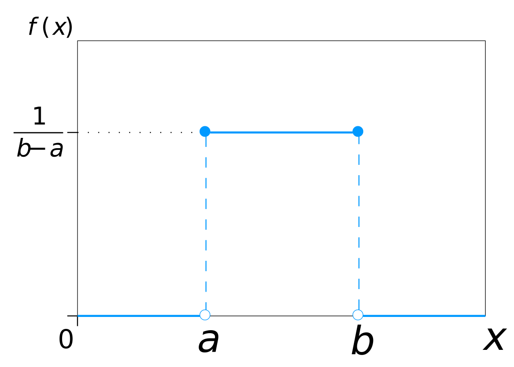
$$
f(x) = \frac{1}{b-a} \quad \forall x \in [a,b]
$$

### Exponentiele verdeling

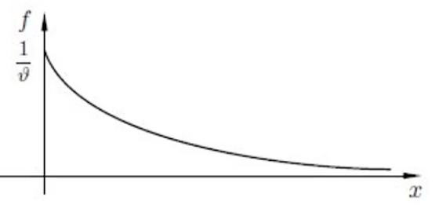
$$
f(x) = \frac{1}{\theta}e^{-\frac{x}{\theta}} \quad \text{ met } x \geq 0 \text{ en } \theta > 0
$$

$ \mu = \theta $

$\sigma^2 = \theta^2$

Wordt typisch gebruikt voor de levensduur van een toestel. 

### Normale verdeling

(oftewel Gaussdistributie)

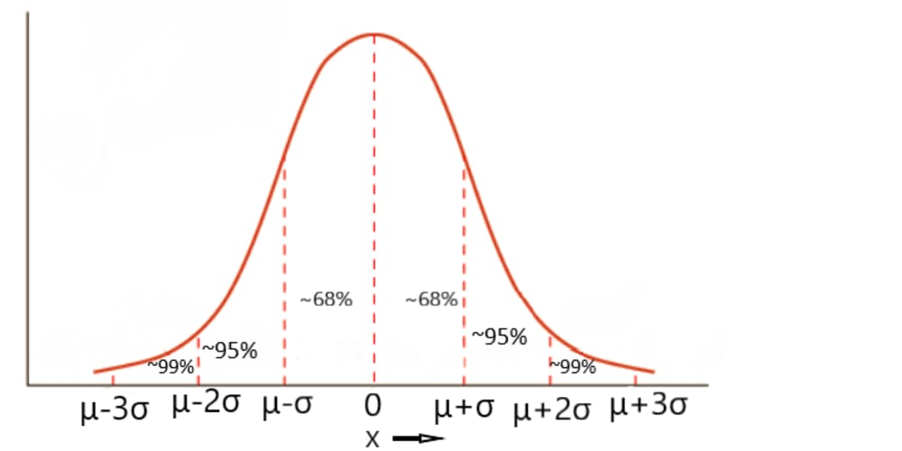
$$
f(x) = \frac{1}{\sigma \sqrt{2\pi}}\cdot e^{-\frac{(x-\mu)^2}{2\sigma^2}}
$$

* Maximum: $\mu$
* Buigpunten in: $x=\mu + \sigma$ en $x=\mu - \sigma$

Als $np \geq 5$ en $n(1-p) \geq 5$, benadert de normaalverdeling de binomiaalverdeling. Met $\mu = np$ en $\sigma = \sqrt{np(1-p)}$

Als je een berekening moet doen met een lineaire combinatie van verschillende normaalverdelingen, gebruik je dit:
$$
y= \sum a_ix_i + b \\
\mu_y = \sum a_i\mu_i + b\\
\sigma^2_y = \sum a^2_i \cdot \sigma^2_i
$$
Nu heb je een nieuwe normaalverdeling waarmee je verder kan rekenen. 

### De genormeerd normale verdeling

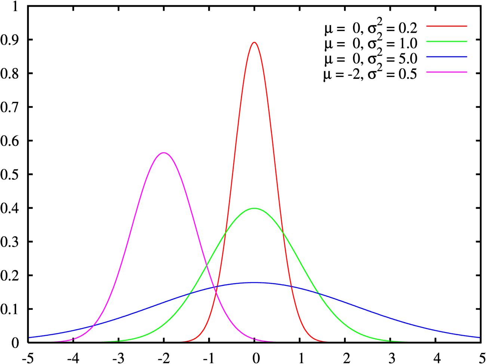

(de groene op de afbeelding)

Als je normale verdeling als gemiddelde $0$ en als standaardafwijking $1$ heeft, krijg je een genormeerd normale verdeling.
$$
\varphi(x) = \frac{1}{ \sqrt{2\pi}}\cdot e^{-\frac{1}{2}z^2}
$$

$$
P(z < z_1) = \Phi(z_1) = \int_{-\infty}^{z_1} \frac{1}{ \sqrt{2\pi}}\cdot e^{-\frac{1}{2}z^2} dz
$$

Als je te maken hebt met een gewone normaalverdeling, en kansen ofzo moet uitrekenen, zal je heb sowieso moeten omzetten naar een genormeerde. Doe dit zo:
$$
z = \frac{x-\mu}{\sigma}
$$
Nu is je gemiddelde $0$ en je standaardafwijking $1$.

### De $\chi^2$ verdeling

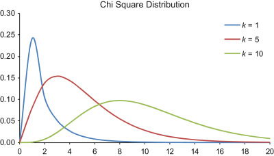
$$
x = \sum_{i=1}^{n}(z_i)^2
$$
$x$ is $\chi^2$-verdeeld, met $z_i$ een genormeerde normaalverdeling. De $\chi^2$-verdeling is eigenlijk een som van normaalverdelingen. Het aantal vrijheidsgraden is gelijk aan $n$ of $(n-k)$ als de $z_i$ gebonden zijn door $k$ vergelijkingen. 
$$
f(x) = \frac{1}{\Gamma(\frac{v}{2})2^{\frac{v}{2}}}x^{\frac{v}{2}-1}e^{-\frac{x}{2}} \\\\
\Gamma(t) = \int_0^{+\infty}e^{-x}x^t dx
$$

$$
\mu = v \quad \quad \sigma^2 = 2v
$$

Hoe meer vrijheidsgraden het hebt, hoe meer symmetrisch de curve wordt. Bij veel vrijheidsgraden $(v \geq 30)$ wordt de variabele $z=\frac{x-v}{\sqrt{2v}}$ benaderd door de standaardnormaalverdeling.

### De student-t verdeling

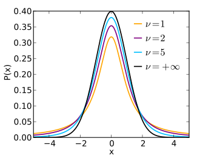
$$
x = \frac{z}{\sqrt{\frac{y}{v}}} \text{ is } t(v) \text{ verdeeld als } 

\; \left\{ \begin{array}{l}
z \text{ is } N(0,1) \text{ verdeeld}\\
y \text{ is } \chi^2(v) \text{ verdeeld }
\end{array}\right.
$$


### De $F$ verdeling


$$
x = \frac{\frac{u}{v_1}}{\frac{v}{v_2}}
$$
$x$ is $F(v_1, v_2)$ verdeeld als $u$ : $ \chi^2(v_1)$ en $v$ : $ \chi^2(v_2)$ verdeeld zijn. 

Nuttige eigenschap:
$$
F_{1-\alpha}(v_2, v_1) = \frac{1}{F_\alpha(v_1, v_2)}
$$
Als je bijvoorbeeld een berekening moet maken met $\alpha = 0.95$, kan je zo alsnog gebruik maken van de tabel met $\alpha = 0.05$

# 6 - Schattingstheorie

## Betrouwbaarheidsintervallen

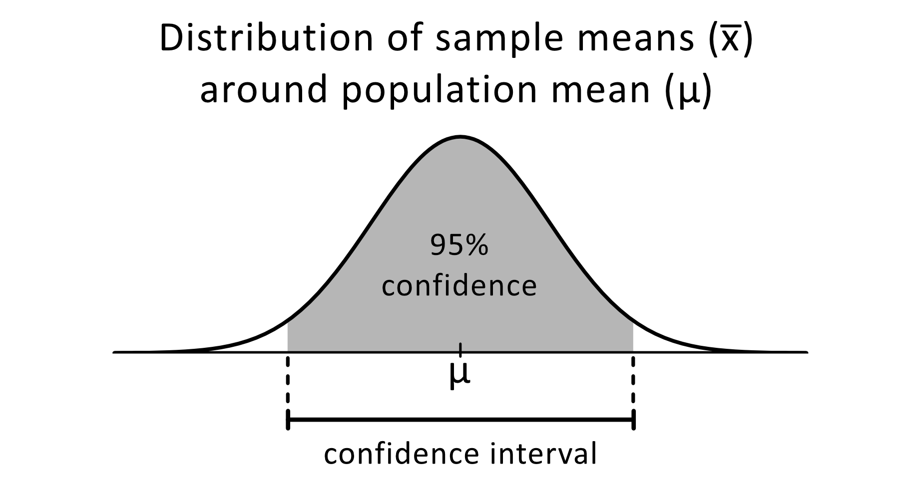

Wat is dat, een betrouwbaarheidsinterval? Even ter verduidelijking:

* $\mu$: het gemiddelde van de hele populatie
* $\bar{x}$: het steekproefgemiddelde

Het is eigenlijk nooit mogelijk om het gemiddelde van een hele populatie te weten. We moeten het doen met steekproeven op een deel van de populatie. Om dan toch een beeld te kunnen krijgen van het gemiddelde, willen we een interval opstellen waarvan we met een bepaalde maat van zekerheid kunnen zeggen dat deze $\mu$ zal bevatten. Dit noemen we een betrouwbaarheidsinterval.

Er zijn allemaal leuke bewijzen in de cursus, maar ik ga eerlijk zijn. Die kunnen mij echt geen tering schelen. 


### Normaal verdeelde populatie

#### $\sigma^2$ onbekend

Het $100(1-\alpha)$% betrouwbaarheidsinterval is:
$$
\sigma^2 \in \left[ \frac{(n-1)s^2}{\chi^2_{1-\frac\alpha2}} , \frac{(n-1)s^2}{\chi^2_{\frac\alpha2}}  \right]
$$
$n$: steekproefgrootte

$\alpha$: onbetrouwbaarheidsdrempel

$s^2$: steekproefvariantie


#### $\mu$ indien $\sigma$ gekend

Het $100(1-\alpha)$% betrouwbaarheidsinterval is:
$$
\mu \in \left[
\bar{x}-z_{\frac{1-\alpha}{2}}\frac{\sigma}{\sqrt n}, \quad
\bar{x}+z_{\frac{1-\alpha}{2}}\frac{\sigma}{\sqrt n}
\right]
$$


#### $\mu$ indien $\sigma$ onbekend

Het $100(1-\alpha)$% betrouwbaarheidsinterval is:
$$
\mu \in \left[
\bar{x}-t_{1-\frac{\alpha}{2}}\frac{s}{\sqrt n}, \quad
\bar{x}+t_{1-\frac{\alpha}{2}}\frac{s}{\sqrt n}
\right]
$$


#### Betrouwbaarheidsinterval voor $\frac{\sigma_2^2}{\sigma_1^2}$

Het $100(1-\alpha)$% betrouwbaarheidsinterval is:

$$
\frac{\sigma_2^2}{\sigma_1^2} \in 
\left[
\frac{1}{F_\frac \alpha 2 (n_2 - 1, n_1-1 \text{ d.f.})}\frac{s_2^2}{s_1^2}, \quad
F_\frac \alpha 2 (n_1 - 1, n_2-1 \text{ d.f.})\frac{s_2^2}{s_1^2}
\right]
$$


#### $\mu_1 - \mu_2$ met gekende $\sigma$'s

Het $100(1-\alpha)$% betrouwbaarheidsinterval is:

$$
\mu_1-\mu_2 \in \left[
\bar{x_1} - \bar{x_2} - z_{\frac{1-\alpha}{2}}\sqrt{\frac{\sigma_1^2}{n_1}+\frac{\sigma_2^2}{n_2}}, \quad
\bar{x_1} - \bar{x_2} + z_{\frac{1-\alpha}{2}}\sqrt{\frac{\sigma_1^2}{n_1}+\frac{\sigma_2^2}{n_2}}
\right]
$$


#### $\mu_1 - \mu_2$ met ongekende maar (ongeveer) gelijke $\sigma$'s

Het $100(1-\alpha)$% betrouwbaarheidsinterval is:
$$
\mu_1-\mu_2 \in \left[
\bar{x_1} - \bar{x_2} - t_{1-\frac{\alpha}{2}}s_p \sqrt{\frac{1}{n_1}+\frac{1}{n_2}}, \quad
\bar{x_1} - \bar{x_2} + t_{1-\frac{\alpha}{2}}s_p \sqrt{\frac{1}{n_1}+\frac{1}{n_2}}
\right]
$$


### Willekeurig verdeelde populatie

Bij $n \geq 30$ kan je alle betrouwbaarheidsintervallen hierboven voor $\mu$ gebruiken. Om een betrouwbaarheidsinterval voor $\sigma^2$ te maken werk je best met $n \geq 100$.


### Binomiaal verdeelde populatie

$p$: de kans dat een eigenschap optreedt

$p_b$: berekende kans (het aantal keren dat de eigenschap optreedt gedeeld door $n$)

Het $100(1-\alpha)$% betrouwbaarheidsinterval is:
$$
p \in \left[
p_b - z_{\frac{1-\alpha}{2}}\sqrt{\frac{p(1-p)}{n}}, \quad
p_b + z_{\frac{1-\alpha}{2}}\sqrt{\frac{p(1-p)}{n}}
\right]
$$
Als $p$ onbekend is mag je hem vervangen door $p_b$ in de formule.

Als de voorwaarden $(np \geq 5)$ en $(n(1-p) \geq 5)$ niet voldaan zijn mag je deze formule niet gebruiken. Dan moet je een andere formule waarvoor ik nu te lui ben om hem op te schrijven //TODO

Oké hij staat ook niet op het formularium dus de kans is klein dat ik hem hier zet.


### Voorspellingsintervallen

Een voorspellingsinterval geeft je een interval waarin de volgende meting met een bepaald % zekerheid in zal zitten.

$x_{n+1}$: de volgende meting

Er is $100(1-\alpha)$% kans dat:
$$
x_{n+1} \in \left[
\bar{x} - t_{1 - \frac a 2}s \sqrt{\frac 1 n + 1}
, \quad
\bar{x} + t_{1 - \frac a 2}s \sqrt{\frac 1 n + 1}

\right]
$$
Bij grote $n$ mag je $t_{1 - \frac a 2}$ vervangen door $z_{\frac{1-\alpha}{2}}$.


# 7 - Testen van hypothesen

## Methode

1. Bepalen numerieke gegevens a.d.h.v. een steekproef
2. Formuleren van de $H_0$-hypothese
3. Formuleren van alternatieve $H_1$-hypothese
4. Bepalen van **toetsingsgrootheid** en haar gekende distributie
5. Bepalen van onbetrouwbaarheidsdrempel voor $\alpha$ voor de test om daaruit een besluit te trekken:
   * $H_0$ aanvaarden
   * $H_0$ verwerpen

## Type I en Type II fouten

* **Type I fout**: $H_0$ ten onrechte verwerpen
* **Type II fout**: $H_0$ ten onrechte aanvaarden


## Testen van parameters van een populatie

### Normaal verdeelde populatie

#### Testen van de variantie

$H_0$: $\sigma^2 = \sigma_0^2$

De toetsingsgrootheid: $\chi^2_{\text{ber}} = \frac{(n-1)s^2}{\sigma^2}$ is $\chi^2(n-1 \text{ d.f.})$ verdeeld 


#### Testen van $\mu$ als $\sigma$ gekend

$H_0$: $\mu = \mu_0$

De toetsingsgrootheid $z_{\text{ber}} = \frac{\bar{x} - \mu_0}{\frac{\sigma}{\sqrt n}}$ is $N(0,1)$ verdeeld.


#### Testen van het $\mu$ als $\sigma$ ongekend

$H_0$: $\mu = \mu_0$

De toetsingsgrootheid $t_{\text{ber}} = \frac{\bar{x} - \mu_0}{\frac{s}{\sqrt n}}$ is $t(n-1 \text{ d.f.})$ verdeeld


#### Vergelijkingstest $\sigma_1^2$ en $\sigma_2^2$

$H_0$: $\sigma_1^2 = \sigma_2^2$

De toetsingsgrootheid $F_\text{ber} = \frac{s_1^2}{s_2^2}$ is $F(n_1-1, n_2 -1 \text{ d.f.})$ verdeeld.

(als de steekproeven onafhankelijk)


#### Testen van $\mu_1 - \mu_2$ met gekende $\sigma$'s

$H_0$: $\mu_1-\mu_2 = d_0$ 

De toetsingsgrootheid $z_\text{ber} = \frac{\bar x_1 - \bar x_2 - d_0 }{s_p \sqrt{\frac{\sigma^2}{n_1} + \frac{\sigma^2}{n_2}}}$ is $N(0,1)$ verdeeld.


#### Testen van $\mu_1 - \mu_2$ met ongekende $\sigma$'s

De toetsingsgrootheid $t_\text{ber} = \frac{\bar x_1 - \bar x_2 - d_0 }{s_p \sqrt{\frac{1}{n_1} + \frac{1}{n_2}}}$ is $t(n_1 + n_2 -2 \text{ d.f.})$ verdeeld met $s^2_p = \frac{(n_1 - 1)s^2_1 + (n_2 -1)s_2^2}{n_1 + n_2 -2}$

(als de steekproeven onafhankelijk en de std's ongeveer gelijk)


> :warning: Bij de twee bovenstaande gevallen moeten de twee populaties onafhankelijk zijn. Als dit niet het geval is (bijvoorbeeld twee onderzoeken op dezelfde personen), dan maak je simpelweg een nieuwe verdeling uit het verschil van de twee verdelingen. Deze beschouw je dan als één steekproef.  

### Willekeurig verdeelde populatie

Bij $n \geq 30$ kan je alle testen hierboven voor $\mu$ gebruiken. Om een betrouwbaarheidsinterval voor $\sigma^2$ te maken werk je best met $n \geq 100$ en een ietwat klokvormige verdeling.


### Binomiaal verdeelde populatie

$H_0$: $p=p_0$


Voor $np_o > 5$ en $n(1-p_0) > 5$ is de toetsingsgrootheid $z_\text{ber} = \frac{p_\text{ber} - p_o}{\sqrt{\frac{p_o(1-p_o)}{n}}}$ benaderd $N(0,1)$ verdeeld.


## Goodness of fit testen

### De $\chi^2$ test

Hiermee kunnen we nagaan of in een populatie een bepaalde discrete verdeling aanwezig is, met een bepaalde betrouwbaarheid.

Voor $n > 30$ en als alle $E[n_i] \geq 5$ (de verwachte waarden) :
$$
\chi^2_\text{ber} = \sum_{i=1}^k \frac{(n_i -E[n_i])^2}{E[n_i]} \text{ is } \chi^2(k-1-r \text{ d.f.}) \text{ verdeeld}
$$
Als $\chi^2_\text{ber} = 0$, dan is de steekproef afkomstig uit de bepaalde verdeling.

Als de voorwaarde $E[n_i] \geq 5$ niet is voldaan, zal je wat categorieën moeten samennemen. Check bijvoorbeeld de oplossing van oefening 10 van dit hoofdstuk.

$r$ is het aantal geschatte parameters. Als je bijvoorbeeld bij de poissonverdeling de parameter $\lambda$ moet schatten met $\bar x $, is $r$ gelijk aan $1$. Als je deze test wilt gebruiken bij een steekproef afkomstig uit een continue verdeling, zal je de steekproef moeten opdelen in ongeveer $\sqrt{n}$ klassen.

### De KS-test

Oftewel Kolmogorov-Smirnov test. We gaan testen of een bepaalde continue verdeling aanwezig is. Dus bijvoorbeeld kijken of een populatie normaal verdeeld is.

Ik heb nog geen enkele oefening in de cursus gezien waar je de berekening zelf moet doen. Yesss

Oké onze real G Seppe van het labo heeft mij uitgelegd wat de ks-test doet.


Beschouw deze afbeelding. De blauwe lijn is onze **steekproef**. We gaan simpelweg van klein naar groot bij elk element een trapje omhoog (een beetje oversimplified). Elke waarde in de blauwe lijn geeft dus eigenlijk het percentage van elementen van de steekproef die kleiner zijn dan die waarde. De rode lijn is een **bepaalde verdeling** waarmee we onze steekproef vergelijken. We berekenen nu een waarde $D_\text{ber}$. Deze geeft de **grootste afstand** tussen de blauwe en de rode lijn. Als deze **afstand klein** is, is natuurlijk de **kans groot** dat onze steekproef de rode verdeling volgt.


### Contingentietabellen

Als we een groep kunnen onderverdelen volgens twee kenmerken, kan je ze voorstellen in een matrix. Beschouw het volgende voorbeeld:

|                              | Neurts             | Geen neurts |
| ---------------------------- | ------------------ | ----------- |
| Door op algoritmen test      | $x_{11}$           | $x_{12}$    |
| Niet door op algoritmen test | $x_{21}$ (MArtijn) | $x_{22}$    |

Als je nu al die waarden gaat uitschrijven in een matrix krijg je een **contigentietabel**.

Voor meer info verwijs ik u vriendelijk door naar de cursus.


# 8 - ANOVA

## One-way Anova

We gebruiken Anova om het gemiddelde van **meer dan twee** populaties te testen, omdat we anders super veel t-testen moeten doen. Om een Anova test uit te voeren nemen we $n$ steekproeven, met ieder $k$ observaties, moeten deze allemaal uit **normaal verdeelde populaties** komen met **vergelijkbare varianties**.
$$
\begin{align}
X_{ij} &= \text{de j-de observatie binnen de -de steekproef}\\
\overline{X_{i}} &= \text{gemiddelde van steekproef i}\\
\overline{X} &= \text{gemiddelde van alles}
\end{align}
$$
Wat we nu dus willen berekenen is de totale variantie van alle steekproeven ten opzichte van $\overline X$. Deze bedraagt:
$$
\frac{1}{nk-1}\sum_{i=1}^{k} \sum_{j=1}^n (X_{ij} - \overline X)^2
$$
De term $(X_{ij} - \overline X)^2$ kunnen we omvormen:
$$
\sum_{i=1}^k \sum_{j=1}^n (X_{ij} - \overline X)^2 = \sum_{i=1}^k  n(X_{i} - \overline X)^2 +
\sum_{i=1}^k  (X_{ij} - \overline X_i)^2
$$
oftewel:
$$
\text{SST} = \text{SSTR} + \text{SSE}
$$

Dit in een mooi kadertje.

| Ding | Betekenis                                                    | Vrijheidsgraden |      |
| ---- | ------------------------------------------------------------ | --------------- | ---- |
| SSTR | De variatie tussen de verschillende steekproeven in vergelijking met het globale gemiddelde. Het aantal vrijheidsgraden hang dus af van het aantal steekproeven | $k-1$           | MSTR |
| SSE  | De variatie binnenin elke steekproef ten opzichte van hun lokale gemiddelde. Het aantal vrijheidsgraden is $kn - k$, omdat je voor alle $k$ steekproeven het gemiddelde berekent. | $k(n-1)$        | MSE  |
| SST  | Variatie over alles                                          | $kn-1$          | MST  |

SST = SSE + SSTR

We nemen dus nu eigenlijk de verhouding tussen de variatie tussen de steekproeven ($MSTR$) en binnen de steekproeven ($MSE$). Dit geeft onze toetsingsgrootheid: 
$$
f_\text{ber} = \frac{\text{MSTR}}{\text{MSE}} \quad : F(k-1,k(n-1) \text{ d.f.})
$$

Met als $H_0$: $\mu_0 = \mu_1 = \dots = \mu_n$

## Block design

Als de waarnemingen twee per twee voorkomen, dus als voor elke categorie in de kolommen en elke categorie in de rijen maar één waarneming is, maken we gebruik van block design. 

| Ding | Betekenis                                                    | Vrijheidsgraden |      |
| ---- | ------------------------------------------------------------ | --------------- | ---- |
| SSB  | De variatie van de gemiddelde waarde per blok tegenover het globale gemiddelde. Er zijn $n$ blokken, vandaar de vrijheidsgraad. | $n-1$           | MSB  |
| SSTR | De variatie tussen de verschillende steekproeven in vergelijking met het globale gemiddelde. Er zijn $k$ steekproeven. | $k-1$           | MSTR |
| SSE  | De variatie binnenin elke steekproef ten opzichte van hun lokale gemiddelde, per blok. Omdat we het gemiddelde per blok en per steekproef berekenen is het aantal vrijheidsgraden $(k-1)(n-1)$ | $(k-1)(n-1)$    | MSE  |
| SST  | Variatie over alles                                          | $kn-1$          | MST  |

SST = SSTR + SSE + SSB

Met als $H_0$: $\mu_0 = \mu_1 = \dots = \mu_n$

Hebben we als toetsingsgrootheid:
$$
f_\text{ber} = \frac{\text{MSTR}}{\text{MSE}} \quad : F(k-1,(k-1)(n-1) \text{ d.f.})
$$


## Two-way anova

Bij one-way Anova kan je de verschillen maar onderzoeken per factor. Als je de invloed van **combinaties van twee factoren** wilt onderzoeken, gebruik je two-way Anova. We testen dus niet alleen de invloed van elk van de factoren, maar ook van hun **interactie**.

| Ding | Betekenis                                            | Vrijheidsgraden              |      |
| ---- | ---------------------------------------------------- | ---------------------------- | ---- |
| SSA  | De variatie tussen de groepen, gesplitst op factor A | $a-1$                        |      |
| SSB  | De variatie tussen de groepen, gesplitst op factor B | $b-1$                        |      |
| SSI  | De interactie tussen A en B                          | $(a-1)(b-1)$                 |      |
| SSE  | De residuele kwadratensom                            | $n-1-(a-1)-(b-1)-(a-1)(b-1)$ |      |
| SST  | De totale kwadratensom                               | ?                            |      |

SST = SSA + SSB + SSI + SSE

Nu vind ik het wel een beetje vervelend dat het gewoon niet wordt uitgelegd in de cursus waar de vrijheidsgraden voor dit deel vandaan komen. 

Er zijn drie toetsingsgrootheden:

* $H_0:$ er is geen interactie tussen factor A en factor B: $f = \frac{\text{MSI}}{\text{MSE}}$
* $H_0:$ er is geen verschillend effect waar te nemen voor de verschillende niveaus van factor A: $f = \frac{\text{MSA}}{\text{MSE}}$
* $H_0:$  er is geen verschillend effect waar te nemen voor de verschillende niveaus van factor B: $f = \frac{\text{MSB}}{\text{MSE}}$

# 9 - Regressie

## Enkelvoudige lineaire regressie

We zoeken een rechte:
$$
y = \beta_0 + \beta_1x
$$
Aan de hand van berekeningen die mij eerlijk gezegd echt geen tering kunnen boeien, bekomen we schattingen $b_0$ en $b_1$:
$$
b_1 = \frac{\overline{xy} - \overline x \cdot \overline y}{\overline{x^2} - \overline{x}^2}\\
b_0 = \overline{y} - b_1 \overline{x}
$$


dus:
$$
y - \overline y = b_1(x- \overline x)
$$
Hiermee kan je je regressierechte opstellen.


## Correlatiecoëfficiënt van Pearson

$$
r = \frac{SS_{xy}}{\sqrt{SS_{xx} \cdot SS_{yy}}} \\
SS_{xx} = \sum_{i=1}^{n}(x_i - \overline{x})^2, \quad SS_{yy} = \sum_{i=1}^{n}(y_i - \overline{y})^2 \quad \text{en } SS_{xy} = \sum_{i=1}^n (x_i - \overline x)(y_i - \overline y)
$$

Hoe dichter deze bij 1 komt, hoe sterker de correlatie.

## Meervoudige lineaire regressie

Bij meervoudige lineaire regressie kan je veranderlijke $y$ afhangen van meerdere $x$'jes.

//TODO


# Extra

dit is handig


# --------------- Labo ---------------

## Oefening checklist

* Juiste $\alpha$?
* Eénzijdig of tweezijdig?
* Zijn de voorwaarden voor de gebruikte test voldaan?
* Zijn de steekproeven afhankelijk of niet? 
* Als deze dingen ook expliciet opschrijven
* Maak een tekening
  * op papier, maar ook in matlab voor functieonderzoek enzo
* Nulhypothese formuleren
* Altijd nalezen of het antwoord wel logisch mogelijk is

# Voorbeeldexamens

## 1ste zit 20-21, reeks A

> Bedankt Paolo om mij te wijzen op enkele fouten :wink:

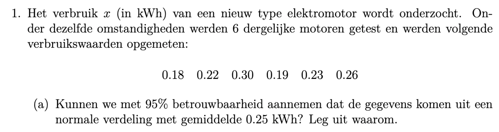

```matlab
A = [0.18 0.22 0.30 0.19 0.23 0.26]
test_cdf = makedist('Normal', 'mu', 0.25, 'sigma', std(A))
[h,p,d] = kstest(A, 'CDF', test_cdf)
% ja, p > 0.05
% misschien ook een tekening maken
```


```matlab
a_1 = norminv([0, 0.6], mean(A), std(A))
a_2 = norminv([0, 0.6], 0.25, std(A))
```

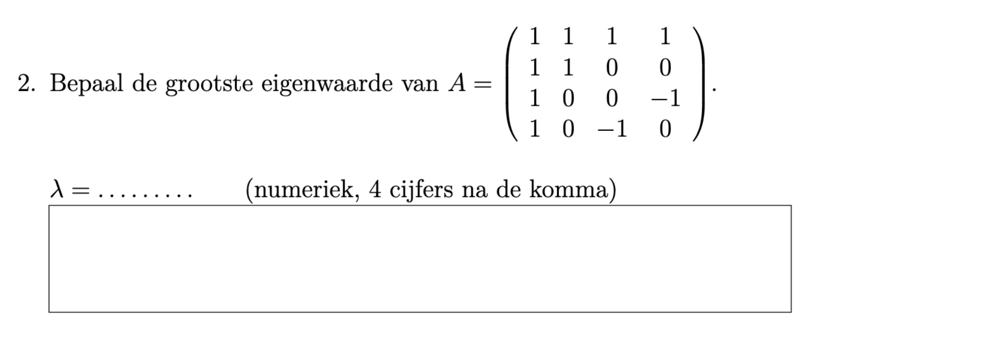

```matlab
A = [1 1 1 1
1 1 0 0
1 0 0 -1
1 0 -1 0]

max(eig(A))
```

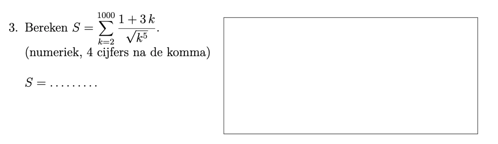

```matlab
s = [2 : 1000]
S = sum((1 + 3.*s)./sqrt(s.^5))
```

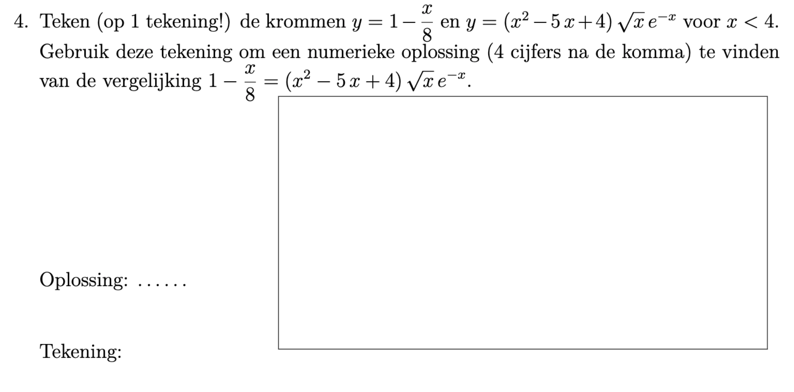

```matlab
f1 =@(x) 1-x./8
f2 =@(x) (x.^2 -5.*x+4).*sqrt(x).*exp(1).^(-x)
f3 =@(x) (x.^2 -5.*x+4).*sqrt(x).*exp(1).^(-x) - 1+x./8
fplot(f1, [0 4])
hold on
fplot(f2, [0 4])
fsolve(f3, 0) % 0.0942
fsolve(f3, 0.4) % 0.3753
% is het nu goed lars?
```

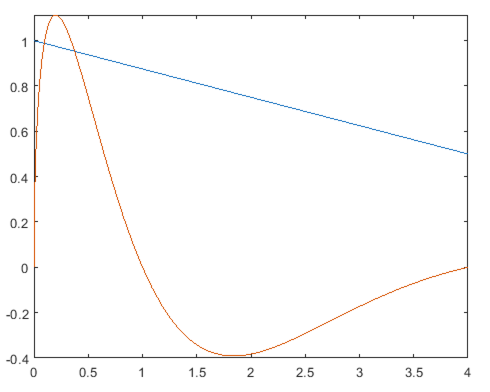

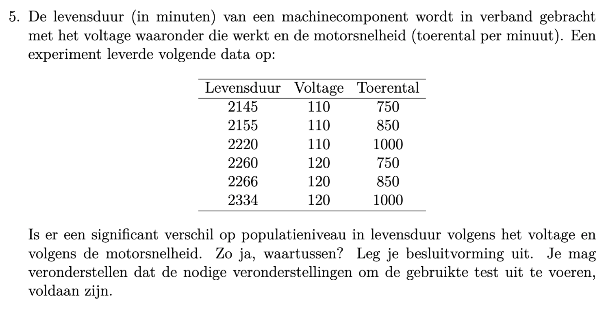

```matlab
in = [2145 110 750
2155 110 850
2220 110 1000
2260 120 750
2266 120 850
2334 120 1000]
leven= in(:,1)
voltage = [leven(1:3) leven(4:6)]
% de clue is dat je de gegevens hier moet herschikken zodat
% de kolommen ze opsplitsen volgens voltage
% en de rijen ze opsplitsen volgens toerental
% dan kan je block design anova doen

[p, table ,stats] = anova2(voltage, 1)
multcompare(stats)

multcompare(stats, 'Estimate','row')

[h,p,ci, stats]=ttest(in(1:3, 1),in(4:6, 1), "Alpha", 0.1) % je moet hier dus een gepaarde ttest doen
ci
std(in(:,1))
```

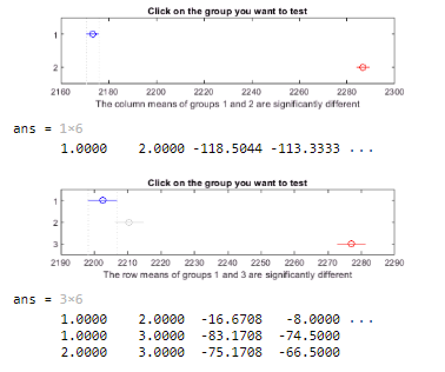

Volgens voltage zijn de gemiddeldes significant verschillend, volgens toerental zijn alleen die van 750 en 850 niet significant verschillend.


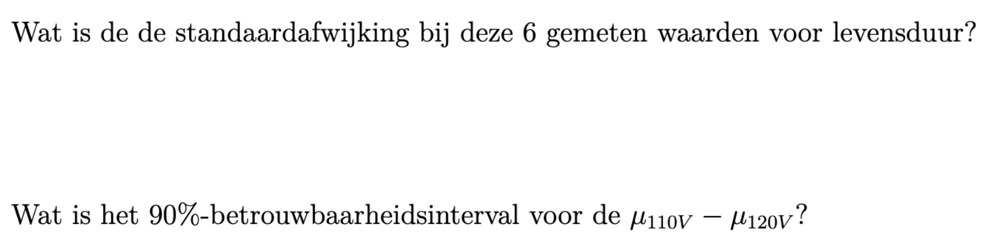

```matlab
std(in(:,1)) % = 72.0583
[h,p,ci, stats]=ttest2(in(1:3, 1),in(4:6, 1), "Alpha", 0.05) % =  [-206.0803 -20.5864]
```


## 1ste zit 20-21, reeks B

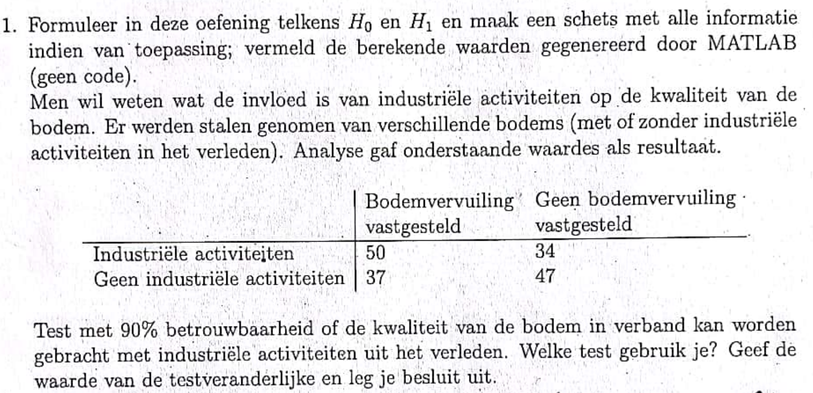

```matlab
n1 = 50
n2 = 34
N1 = 87
N2 = 81
x = [repmat('a', N1, 1); repmat('b',N2,1)];
y = [repmat(1, n1, 1); repmat(2,N1-n1,1); 
    repmat(1, n2, 1); repmat(2,N2-n2,1);];
[table, chi2, p] = crosstab(x,y)
```

$H_0$: Kwaliteit bodem en verleden industriële activiteiten zijn onafhankelijk

$H_1$: Kwaliteit bodem en verleden industriële activiteiten zijn afhankelijk

$p = 0.0447 < 0.1$, $H_0$ verwerpen. We gebruiken een $\chi^2$-test


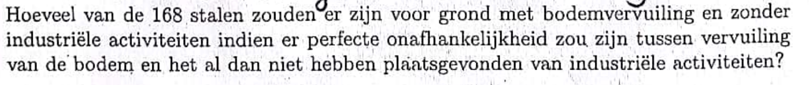

Schatter voor verwachte celfrequentie: $\frac{\text{totaal rij } i \times \text{totaal kolom} j}{n}$

```matlab
n = N1+N2
schatter = (50 + 37)*(37 + 47)/n % schatter = 43.5000
```

 


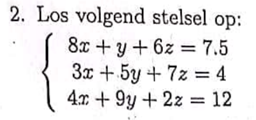

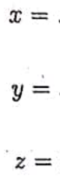

```matlab
A = [8 1 6 ; 3 5 7; 4 9 2]
B = [7.5 ; 4; 12]
x = A\B
% volgens tanja kan dit ook
D = [A, B]
rref(D)
```

$$
\begin{cases}
   
x&=    1.2931\\
  y&=  0.8972\\
  z&= -0.6236

\end{cases}
$$

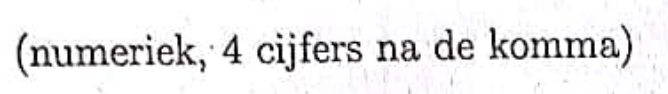

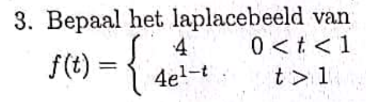

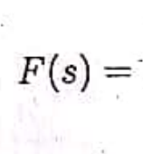

```matlab
syms t
f = heaviside(t)*(4)- heaviside(t-1)*(4)+ heaviside(t-1)*(4*exp(1-t))
laplace(f)

% tanja heeft haar functie een klein beetje anders gemaakt
% bij die van mij is hij 0 als t < 0, bij tanja is die dan 4
% maar de oplossing is toch hetzelfde dus het maakt zo te zien niet uit
4*heaviside(1-t) + 4*exp(1-t)*heaviside(t-1)
```

$$
F(s) = \frac{4\,{\mathrm{e}}^{-s} }{s+1}-\frac{4\,{\mathrm{e}}^{-s} }{s}+\frac{4}{s}
$$


```matlab
% ik neem hier effe a ipv x zodat matlab niet gaat zeiken door de vorige oefeningen
syms a
mat = [0 2 0; 2 a 0; 3 a a]
eigenwaardes = eig(mat)
fplot(eigenwaardes(1))
hold on
fplot(eigenwaardes(2))
fplot(eigenwaardes(3))
```

Dit geeft:
$$
\left(\begin{array}{c}
a\\
\frac{a}{2}-\frac{\sqrt{a^2 +16}}{2}\\
\frac{a}{2}+\frac{\sqrt{a^2 +16}}{2}
\end{array}\right)
$$
Je kan op de tekening zien dat ze elkaar nooit snijden, dus er is geen oplossing.

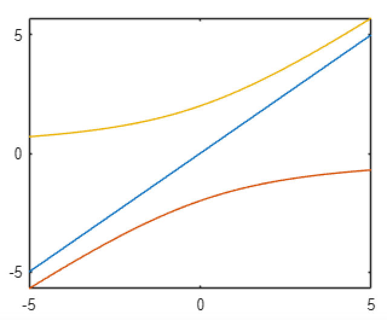

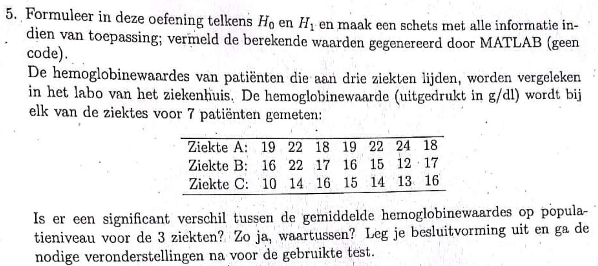

$H_0$: de gemiddeldes zijn gelijk


```matlab
hemo = [19 22 18 19 22 24 18;
    16 22 17 16 15 12 17;
    10 14 16 15 14 13 16]
% nodige tests
x = hemo(1, :)
test_cdf=makedist('Normal','mu',mean(x),'sigma',std(x));
[h,p,D] = kstest(x, test_cdf)
x = hemo(2, :)
test_cdf=makedist('Normal','mu',mean(x),'sigma',std(x));
[h,p,D] = kstest(x, test_cdf)
x = hemo(3, :)
test_cdf=makedist('Normal','mu',mean(x),'sigma',std(x));
[h,p,D] = kstest(x, test_cdf)

p = vartestn([hemo(1,:)' hemo(2,:)' hemo(3,:)'], 'TestType', 'LeveneAbsolute', 'Display', 'off')
% p = 0.7438 > 0.05

hemo = hemo'
[p, table, stats] = anova1(hemo)
multcompare(stats)
```

Er is geen significant verschil tussen $B$ en $C$, wel tussen de andere combinaties.

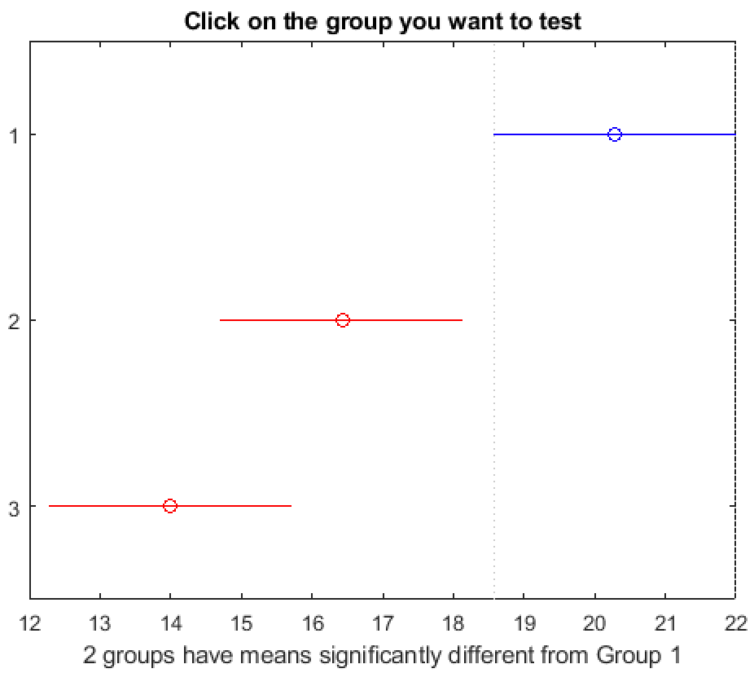


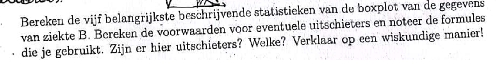

```matlab
B = hemo(:,2)'
Q1 = prctile(B, 25)
Q3 = prctile(B, 75)
inter = iqr(B)
ondergrens = Q1 - 1.5*inter
bovengrens = Q3 + 1.5*inter
boxplot(B)

% volgens Tanja is 12 geen uitschieter, maar hij ligt toch wel net buiten het interval hoor
```

22 en 12 zijn uitschieters, ze liggen buiten de grenzen. 

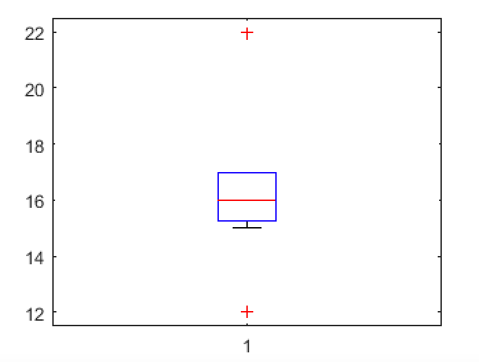

## 1ste zit 20-21, reeks C

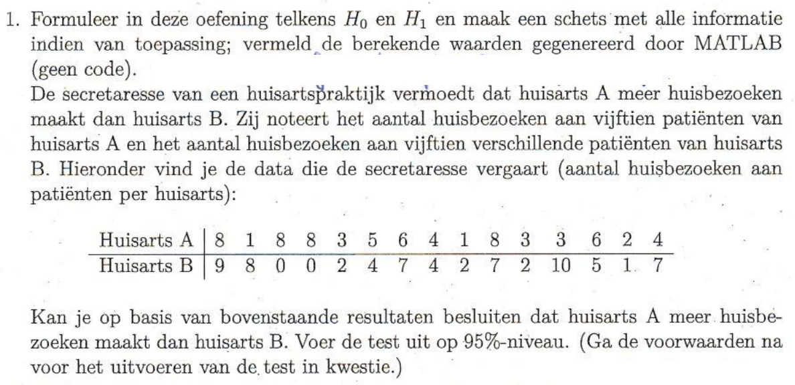

```matlab
A = [8 1 8 8 3 5 6 4 1 8 3 3 6 2 4]
B = [9 8 0 0 2 4 7 4 2 7 2 10 5 1 7]

test_cdf=makedist('Normal','mu',mean(A),'sigma',std(A));
[h,p,D] = kstest(A, test_cdf); % oke 
test_cdf=makedist('Normal','mu',mean(B),'sigma',std(B));
[h,p,D] = kstest(B, test_cdf); % oke
p = vartestn([A' B'], 'TestType', 'LeveneAbsolute', 'Display', 'off') % ook oke

[h, p ,ci, stats] = ttest2(A, B, 'Alpha',0.05 , 'Tail' , 'right') %p = 0.4513
% je moet hier de rechterstaart hebben omdat het eenzijdig is
```

$H_0$: de gemiddeldes zijn gelijk

 $p > \alpha$, dus accepteren.

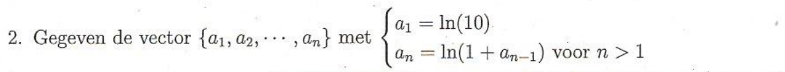

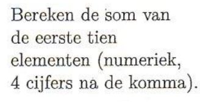 

```matlab
a = [log(10)]
m = 2
while m ~= 11
    a(m) = log(1+a(m-1));
    m = m + 1;
end
sum(a) % ans = 6.7583

% het kan nog makkelijker met een for-loopje
a = [1:10]
a(1) = log(10)
for n = 2:10
	a(n) = log(1+a(n-1));
end
sum(a)
```


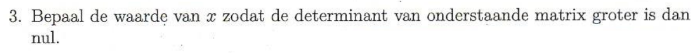

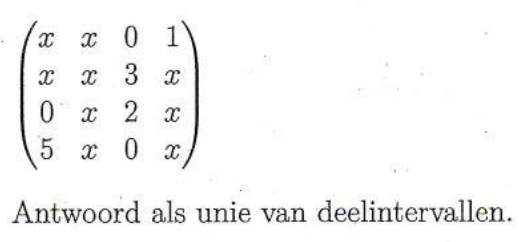

```matlab
syms x
mat = [x x 0 1
    x x 3 x
    0 x 2 x
    5 x 0 x]

eq = det(mat)
int = solve(eq > 0, x, 'ReturnConditions', true, 'Real', true)
int.conditions
```

$$
\left(\begin{array}{c}
x<-\frac{5}{2}\\
0<x\wedge x<1
\end{array}\right)
$$

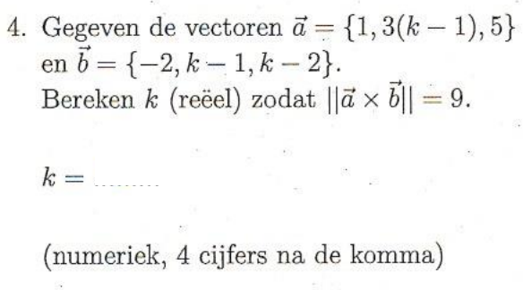

```matlab
syms k
a = [1 3*(k-1) 5]
b = [-2, k-1, k-2]
y = norm(cross(a,b))
solve(y == 9, 'Real', true)
var = vpa(ans)

%testen of het klopt
k = 1
eval(y) % = 9
k= 0.85163179316688410142613854673932
eval(y) % = 9
% er zijn dus 2 oplossingen zo te zien

```

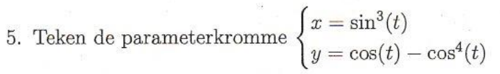

```matlab
t = 0:0.1:10;
x = sin(t).^3;
y = cos(t) - cos(t).^4;
plot(x, y)
axis equal % dit heb ik van de oplossing, best handig (zie tweede afbeelding)
```

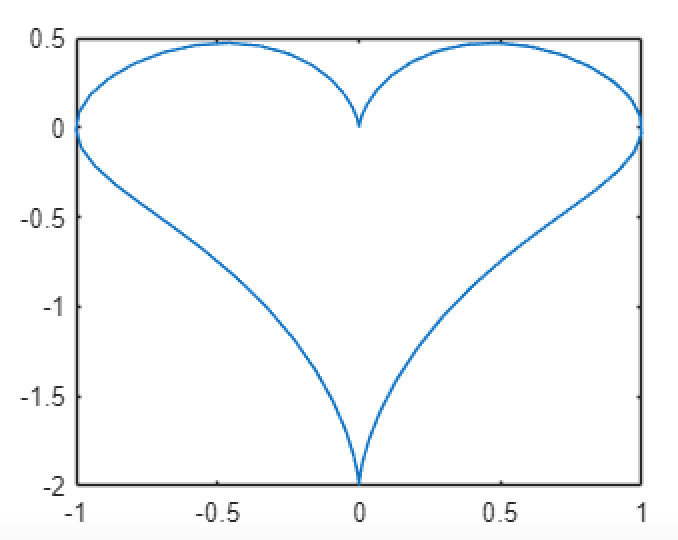

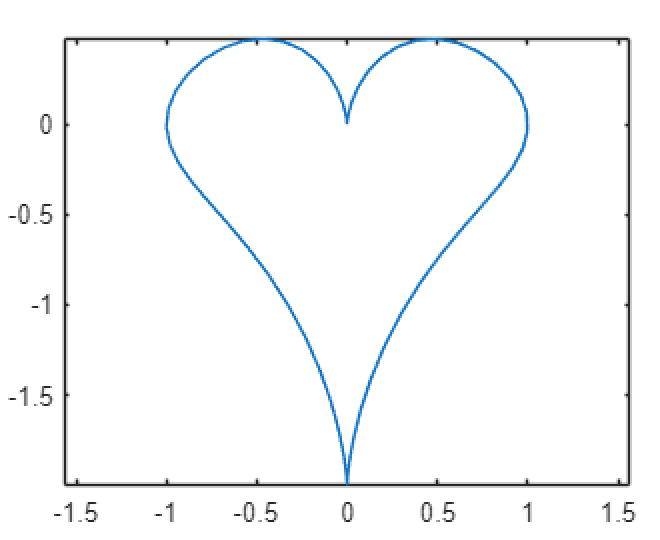

Dit noem ik nu is een wholesome matlab moment.

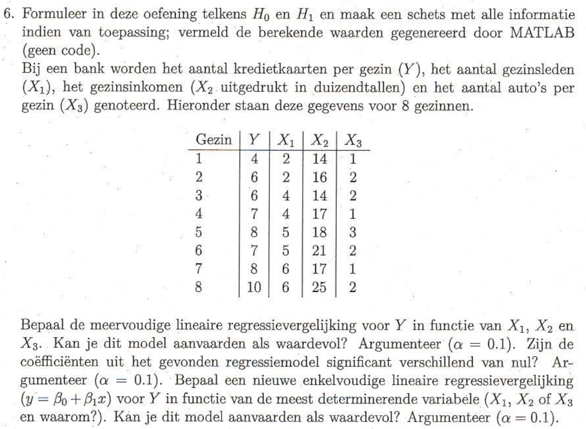

```matlab
Y = [4 6 6 7 8 7 8 10] % kredietkaarten
X1 = [2 2 4 4 5 5 6 6] % aantal gezinsleden
X2 = [14 16 14 17 18 21 17 25] % inkomen
X3 = [1 2 2 1 3 2 1 2] % aantal autos

X = [ones(size(Y))' X1' X2' X3']
[b , bint r, rint, stats] = regress(Y',X)
```

$$
y = 0.2861 +
    0.6346X_1+
    0.1995X_2+
    0.2716X_3
$$


```matlab
b = 4×1    
    0.2861
    0.6346
    0.1995
    0.2716

bint = 4×2    
   -3.1374    3.7095 % bevat 0
    0.0568    1.2124
   -0.0550    0.4541 % bevat 0
   -0.7308    1.2741 % bevat 0

stats = 1×4    
    0.8720    9.0874    0.0294    0.7037
   % dit is een matig model
```

We gaan nu dus een model maken met enkel $X_1$ als voorspeller.

```matlab
X = [ones(size(Y))' X1']
[b , bint r, rint, stats] = regress(Y',X, 0.1)
```

$$
y =    
    2.8714+
    0.9714X_1
$$

  

```matlab
b = 2×1    
    2.8714
    0.9714
bint = 2×2    
    0.8727    4.8701
    0.5273    1.4156
stats = 1×4    
    0.7506   18.0625    0.0054    0.9143
		% oke	  
```

Nu zijn er eigenlijk nog een paar voorwaarden die we moeten controleren als we echt dikke neurts willen zijn:

1. P-waarde F-test < $\alpha$

   $0.0054 < 0.1$ oké

2. Betrouwbaarheidintervallen voor $\beta_n$ bevatten geen 0

   Ook oké

3. De residues zijn normaal verdeeld

```matlab
test_cdf=makedist('Normal','mu',mean(r),'sigma',std(r));
[h,p,D] = kstest(r, test_cdf); % p = 0.4509 dus ook oké
```

4. Er mag geen trend zitten in de residues.

```matlab
scatter(1:8,r) % kijk zelf maar, ziet er oké uit
```

Ik ga dit model dus accepteren als waardevol. Ik weet niet waarom, maar Tanja doet al deze dingen niet in de verbetersleutel.

## 2de zit 20-21

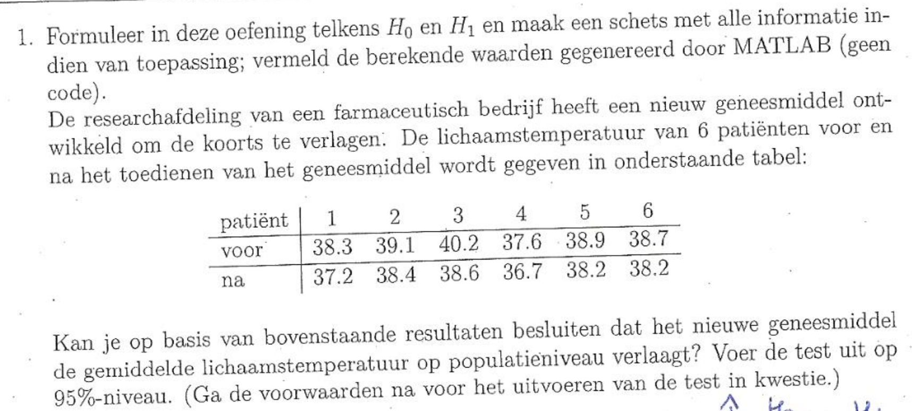

```matlab
voor = [38.3 39.1 40.2 37.6 38.9 38.7]
na =   [37.2 38.4 38.6 36.7 38.2 38.2]

test_cdf=makedist('Normal','mu',mean(voor),'sigma',std(voor));
[h,p,D] = kstest(voor, test_cdf)
test_cdf=makedist('Normal','mu',mean(na),'sigma',std(na));
[h,p,D] = kstest(na, test_cdf)
p = vartestn([voor' na' ], 'TestType', 'LeveneAbsolute', 'Display', 'off')

[h, p ,ci, stats] = ttest(voor, na, 'Alpha', 0.05 , 'Tail' , 'right')


```

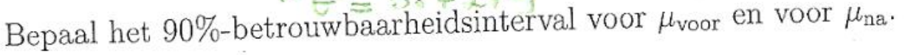

```matlab
% steekproefgemiddelde is t-verdeeld en de ttest geeft ook het betrouwbaarheidsinterval voor mu
[h, p ,ci, stats] = ttest(voor, mean(voor), "Alpha",0.1) % [38.0866 39.5134]
[h, p ,ci, stats] = ttest(na, mean(na), "Alpha",0.1) %[37.2624 38.5042]
```


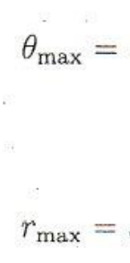

```matlab
syms th
r = 1 - cos(th).*sin(3.*th)
diff(r)
ding = solve(diff(r),0,'Real', true)
opl = vpa(ding(3)) % alleen die in het eerste kwadrant
% pas op dat je het maximum zeker hebt en niet het minimum
% theta =1.2868816403305746364928210807132
subs(r, opl)
% r = 1.1845043649140952478974858705339

%tekening
r = @(th)1 - cos(th).*sin(3.*th)
theta = 0:0.1:2*pi
polarplot(theta, r(theta))
% tanja haar oplossing is een beetje raar
% ze gebruikt fminbnd om dan het minimum van het tegengestelde van de
% functie te berekenen. Moet kunnen
```

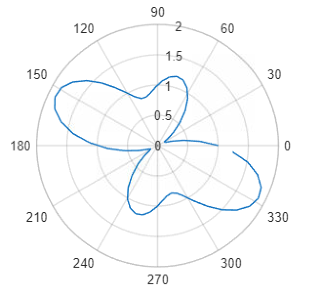

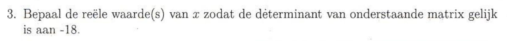

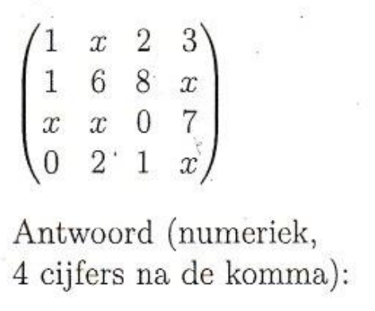

```matlab
syms x
mat =[1 x 2 3
      1 6 8 x
      x x 0 7
      0 2 1 x]
opl = solve(det(mat) == -18, 'Real', true)
vpa(opl) % = - 2.0357226804817474765241019752941
```

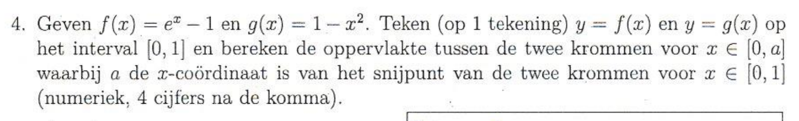

```matlab
f =@(x) exp(x) - 1
g = @(x) 1 - x.^2
com = @(x) exp(x) - 1 - 1 + x.^2
fplot(f, [0, 1])
hold on
fplot(g, [0, 1])
a = fsolve(com, 0) % a = 0.5373
% tanja doet a = vpasolve(f(x) == g(x), x)
% maar dan kan je a niet gewoon hier onder in steken
% dan moet je die copy pasten
opp = integral(g,0,a) - integral(f,0,a) % opp = 0.3115
```

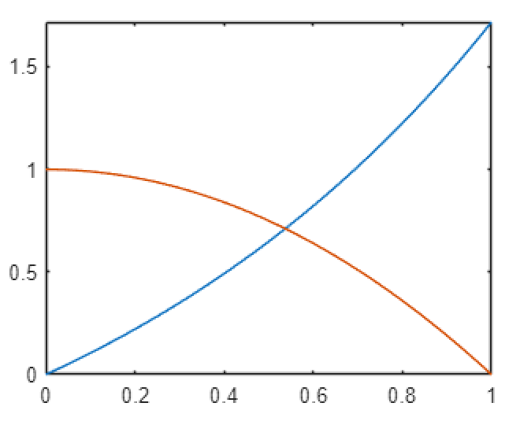


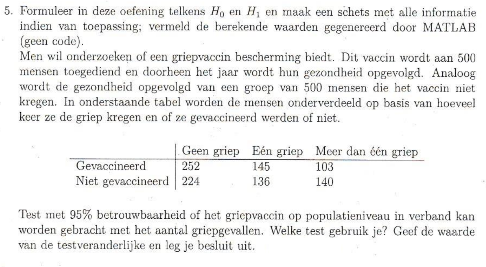

```matlab
n1 = 252; n2 = 145; n3 = 103;
N1 = n1+224; N2 = n2+136; N3 = n3+140;

x = [repmat('a', N1, 1); repmat('b',N2,1); repmat('c',N3,1)];

y = [repmat(1, n1, 1); repmat(2,N1-n1,1); 
    repmat(1, n2, 1); repmat(2,N2-n2,1);
    repmat(1, n3, 1); repmat(2,N3-n3,1);];
[table, chi2, p] = crosstab(x,y)
% p = 0.0227 < 0.05 dus er is een significant verband
% chi2 = 7.5691
```

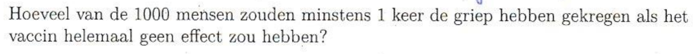

```matlab
    %no  %1  %meer
A = [252 145+103; % vax 
     224 136+140] % no vax
(A(1,1) + A(1,2))*(A(1,2) + A(2,2))/1000 + ...
    (A(1,1) + A(1,2))*(A(1,2) + A(2,2))/1000 % p94 in de cursus
% ans = 524

```


# Vervelende dingen

## Ks-test

```matlab
test_cdf = makedist('Normal', 'mu', mean(x), 'sigma', std(x))
[h, p, d] = kstest(x, 'CDF',test_cdf)
```

Om het te versimpelen, we maken een (test)normaalverdeling met als $\mu$ en $\sigma$ het gemiddelde en de standaardafwijking van onze steekproef. Deze testverdeling vergelijken we dan met onze steekproef. Als dan $h=0$, aanvaarden we de nulhypothese en kunnen we met 95% betrouwbaarheid zeggen dat onze steekproef normaal verdeeld is.

Je kan dit natuurlijk ook doen met andere verdelingen, maar dat ben ik in de oefeningen precies nooit tegengekomen.

## Anova

> :warning: Vergeet niet dat als je Anova wilt toepassen, de veranderlijke voor elk van de verschillende niveaus normaal verdeeld moet zijn met gelijke varianties.


### One-way Anova

* $H_0$: de populatiegemiddeldes voor alle steekproeven zijn gelijk
* $H_1$: niet alle gemiddeldes zijn gelijk
  * in dit geval moet je nog `multcompare` doen om te zien welke verschillend zijn van elkaar

```
[p, table, stats] = anova1(M)
```

Onze matrix $M$ bevat per kolom een steekproef. Onze `anova1` functie geeft een tabel terug voor elke combinatie van kolommen (één combinatie per rij). De laatste kolom van deze tabel bevat dan een p-waarde voor elke combinatie. Deze p-waarde is voor de nulhypothese die stelt dat het gemiddelde van deze twee groepen gelijk is.


### Two-way Anova

Wat willen we nu eigenlijk bereiken hiermee. Dat was mij vrij onduidelijk. Ik ga het proberen uitleggen aan de hand van een voorbeeld.

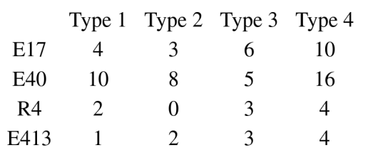

We hebben dus types snelwegen en types asfalt. Stel je nu even voor dat er wel meerdere metingen zijn per type asfalt en snelweg (anders is het block design). De nummertjes zijn het aantal herstellingen die gedaan moesten worden aan elke combinatie. We willen weten hoeveel invloed de snelweg of het type asfalt heeft op de hoeveelheid ongevallen, en of er interactie is tussen de twee, dus dat de snelweg en het soort asfalt elkaar beïnvloeden. We doen.

```
[p,table,stats] = anova2(A,rep)
```

* $p$ geeft 3 waarden:

  * p-waarde voor de kolommen: 
    * $H_0$:  de gemiddeldes voor aantal ongevallen zijn gelijk voor de verschillende asfalttypes
    * dit is hoeveel invloed het type asfalt heeft op het aantal herstellingen
    * Accepteer $H_0$ als $p < \alpha$
  * p-waarde voor de rijen
    * $H_0$: de gemiddeldes voor aantal ongevallen zijn gelijk voor de verschillende snelwegen
    *  dit is hoeveel invloed de snelweg heeft op het aantal herstellingen
    *  Accepteer $H_0$ als $p < \alpha$
  * p-waarde voor de interactie tussen de twee (als deze $< \alpha$ is er geen interactie). 
    * Als er interactie is tussen de twee mag je eigenlijk niet kijken naar de eerste twee p-waarden.

  De rest van de output boeit eigenlijk niet zo veel

  

### Verschil tussen de twee

Het verschil tussen de twee is het aantal onafhankelijke variabelen. One-way heeft er één, two-way heeft er twee. Laten we dat even kaderen. 

* Bij one way Anova zouden we bijvoorbeeld de relatie tussen de gebruikte schoenen (Nike, Adidas) en de looptijden van athleten bepalen.
* Bij two way Anova zouden we dan de relatie tussen het schoenmerk, de leeftijd en de looptijden bepalen.
  * Nu kan het natuurlijk dat de leeftijd van de loper ook invloed heeft op het schoenmerk, dit testen we natuurlijk ook. Kijk maar naar het voorbeeld hierboven.


### Multcompare

**Bij one-way anova**

```
M= 
[24 14 11 7 19
15 7 9 7 24
21 12 7 4 19
27 17 13 7 15            
33 14 12 12 10
23 16 18 18 20]

[p, table, stats] = anova1(M)
multcompare(stats)
```

Multcompare maakt een mooie grafiek voor alle gemiddeldes van de steekproeven. Die lijntjes zijn denk ik de intervallen waar de gemiddeldes in kunnen liggen. Als de lijntjes niet overlappen, zijn de gemiddeldes significant verschillend. Als ze overlappen, kunnen we met 95% (tenzij anders ingesteld) betrouwbaarheid zeggen dat de gemiddeldes gelijk zijn.

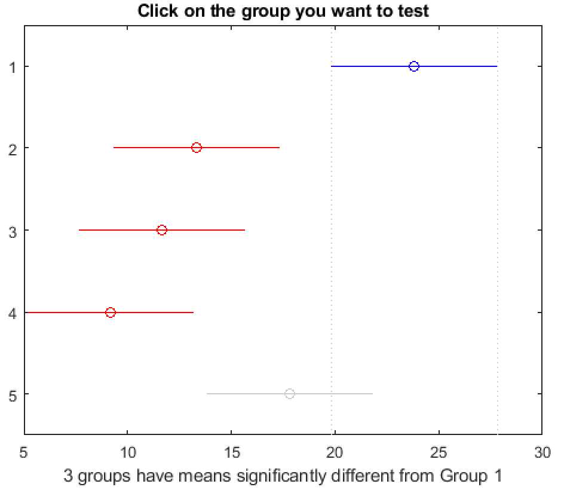

**Bij two-way anova**

Hetzelfde als bij anova1, maar je moet wel zien of je de gemiddeldes per rij of per kolom wilt vergelijken:

```matlab
multcompare(stats)
multcompare(stats, 'Estimate', 'Row') % per rij
```


## Corrcoef

* `[rho, p] = corrcoef(test1, test2)`
  * $p > \alpha$: dan is de correlatiecoëfficient met $(1-\alpha)$ betrouwbaarheid NIET significant verschillend van 0
  * $H_o$: er is geen correlatie

## Regress

* `[b, bint, r, rint, stats]= regress(y,X)`
  * `b` bevat de schatters, de eerste is een constante, de rest komen overeen met je kolommen
  * `bint`: bevat 95% betrouwbaarheidintervallen voor de schatters uit `b`
    * Als je het model wilt verbeteren haal je de schatters eruit waarvoor het interval $0$ bevat
  * `stats` bevat: $[R^2, F, p,s_2]$
    * $R^2$ dicht bij 1 is goed regressiemodel
    * $H_0$: het regressiemodel is niet significant
    * $p<\alpha: H_0$ verwerpen, regressiemodel is significant met $1-\alpha$ betrouwbaarheid
  * `r`: bevat de residues
    * `test_cdf=makedist('Normal','mu',mean(r),'sigma',std(r));` 
    * `[h,p]=kstest(r,'CDF',test_cdf)`
    * $H_0$: de residues zijn normaal verdeeld
    * Ze mogen ook geen trend volgen dus moet je er een scatterplot van maken: `scatter(1:10, r)`

# Oefeningen matlab

### Week 1

#### 1.4

Stel $z = \sqrt{2} e^{3 \pi j/5}$. Bepaal het reëel en imaginair deel. Bepaal (in graden) het argument
(=poolhoek) van het complex toegevoegde van (z+1).

```matlab
z = sqrt(2)*exp(1)^(3*pi*1j*0.20)
theta = angle(conj(z+1))
r = abs(conj(z+1))
rad2deg(angle(conj(z+1)))
```

#### 1.5

Voer op de meest handige manier de matrix A in die 18 rijen bevat.
$$
A = \begin{pmatrix}
1 & 3 & 5 & 7 & 9\\
1 & 3 & 5 & 7 & 9\\
\vdots & \vdots & \vdots & \vdots& \vdots \\
1 & 3 & 5 & 7 & 9\\

\end{pmatrix}
$$


```matlab
a = [1,3,5,7,9]
b = repelem(a,18,1)
```

#### 1.7

Bereken op een efficiënte manier: $1^2 + 2^2 + \cdots+ 100^2$

```matlab
array = 1:100
square = array.^2
s = sum(square)
```

#### 1.8

Bereken de oppervlakte van de driehoek met hoekpunten a(1, 2, 0), b(3, 0, -3) en c(5, 2, 6).

```matlab
a = [1, 2, 0]
b = [3, 0, -3]
c = [5, 2, 6]
ab = b-a
bc = c-b
c = cross(ab, bc)
opp = norm(c)/2
```

#### 1.9

Bereken het gemiddelde van de elementen uit de verzameling *{f(0), f(0.1),..., f(1)}* met
$$
f(t) = \frac{1}{1+\sqrt{t}} \text{ (zonder lussen)}
$$


```matlab
%t/(1+sqrt(t))
arr = 0:0.1:1
arr = arr./(1+sqrt(arr))
res = mean(arr)
```

#### 1.10

Een rechthoekige driehoek heeft een omtrek van 5 cm en de lengte van de schuine zijde is 2/3 van de som van de lengtes van de rechthoekszijden. Wat is de waarde van de zijden van deze driehoek?

```
//TODO
```


#### 1.14

Bereken $\tan(2\arccos(-\frac{1}{5}))$

```matlab
tan(2*acos(-1/5))
```

### Week 2

#### 1.11

Hoeveel van de volgende getallen zijn groter dan 0.5?
$$
sin(1), sin(2), sin(3),...,sin(1000)
$$


```matlab
arr = 1:1000
lol = sin(arr)
filtered = lol > 0.5
som = sum(filtered)
```

#### 1.13

$$
\text{Bereken: } \sum_{n=0}^{10}n!
$$


```matlab
arr = 0:10
arr = factorial(arr)
som = sum(arr)
```

#### 1.15

Een rechthoekige driehoek heeft een omtrek van 5 cm. Wat is de waarde van de zijden wanneer de driehoek maximale oppervlakte heeft.

```matlab
syms a b c
py = a^2 + b ^2 == c^2
omtr = a + b + c == 5
opp = a*b/2
b1 = solve(a^2 + b^2 == (5-a-b)^2)
vgl = subs(opp, b, b1)
afg = diff(vgl, a)
solve(afg, 0)
var2 = vpa(ans)
b = var2(1)
```

#### 1.17

Los op over $\mathbb{R}$: $2x^3 - x^2-15x+18 > 0$

```matlab
syms x 
eq = 2*x^3-x^2-15*x+18
opl = solve(eq > 0, x, 'ReturnConditions', true, 'Real', true)
opl.conditions
```

#### 1.18

Los op over $\mathbb{R}$: $x^5 - 5x = -2$

```matlab
syms x real
eq = x^5-5*x
opl = solve(eq == -2,x, 'Real', true)
var = vpa(opl)
```


### Week 3

Schets de kromme $y= \arctan\left(\frac{x-1}{2} - \frac{1}{2x-2}\right)$. Bepaal de limiet in $1$ en in $\infty$. Bepaal $y'$. Zoek de punten waarin $y'=2$. Verklaar de resultaten op de grafiek.


#### 1.20

```matlab
syms x
f = atan((x-1)/2-1/(2*x-2))
fplot(f)
x1left = limit(f,x,1, 'left')
x1right = limit(f,x,1, 'right')
xposinf = limit(f,x, +Inf)
xneginf = limit(f,x, -Inf)
d = diff(f)
solve(d==2,x)


```

#### 1.23

Schets de krommen $y= \frac{1}{1+x^2}$ en $y=\frac{x^2}{2}$.
Bepaal de snijpunten en bereken de oppervlakte van het gebied ingesloten door beide krommen. Gebruik verschillende kleuren voor de krommen.

```matlab
clear
syms x 
syms a 
f = 1/(1+x^2)
g = x^2/2
% TODO kleuren
```


```matlab
fplot(f)
hold on
fplot(g)
randen = solve(f==g)
upper = int(f, [randen(1) randen(2)])
lower = int(g, [randen(1) randen(2)])
opl = upper - lower
```

#### 1.26

Maak een 3D-plot en een contourplot van $z = \frac{\sin \sqrt{x^2+y^2}}{\sqrt{x^2+y^2}}$, $-10 \leq x \leq 10$ , $-10 \leq y \leq 10$

```matlab
syms x y
hold off
z = sin(sqrt(x^2+y^2)) /sqrt(x^2+y^2)
fmesh(z)
contour(z)
```

#### 1.29

Teken een gladde voorstelling van de kromme bepaald door:
$$
\begin{cases}
x = \cos(5t + \frac{\pi}{4}) \\
y = \sin(4t)
\end{cases}
$$

```matlab
%TODO
```


#### 1.30

Teken een kromme in het complexe vlak waarbij $z = t e^{it}$, $0 \leq t \leq 4\pi$

```matlab
%TODO
```


#### 1.33

Bepaal de reële oplossingen van 
$$
\begin{cases}
x^2 -2x + y^2 = 0 \\
9x^2-18x +4y^2 = 27
\end{cases}
$$
Verklaar grafisch het resultaat.

```matlab
%TODO
```


### Week 4

#### 1.35

Maak met behulp van een tekening een schatting voor welke waarden van $t$ de voerstraal van de punten van de kromme met parametervoorstelling $(x = 2 sin(t) + cos(2t), y = - 2 cos(t) - sin(2t))$ maximaal zal zijn en controleer via berekeningen.
                                        

```matlab
syms x
syms y
syms t
syms p

t=linspace(0,4*pi, 1000);
x = 2*sin(t) + cos(2*t)
y = -2*cos(t) - sin(2*t)
plot(x,y)

v = max(sqrt(x.^2 + y.^2))

m = diff(sqrt((2*sin(p) + cos(2*p))^2 + (-2*cos(p) - sin(2*p))^2))

solve(m== 0)

axis equal

grid on
```

#### 1.43

Teken de poolkromme $r = sin(4t)$.

```matlab
t = 0:0.01:2*pi;
r = sin(4*theta)
r(r<0) = 0;

polarplot(t, r)
```


#### 1.39

a) Teken op één grafiek de krommen met vergelijking $r =1$ en $r = 2 cos(3\theta)$.
b) Bereken de oppervlakte van het gemeenschappelijk deel binnen $r=1$ en $r= 2 cos(3\theta)$.

```matlab
syms x
t = 0:0.01:2*pi;
r = 2*cos(3*t)
polarplot(t,r)
hold on
polarplot(t,1+0*t) % barbaars volgens Tonesi
solve(2*cos(3*x)==1, x)

q = (0.5*int(1 + 0*x, 0, pi/9) + 0.5*int((2*cos(3*x))^2, pi/9, pi/6))*6
```


#### 1.44

Bereken de booglengte van de kromme $r = 1 – cos(t)$ gelegen buiten de kromme $r + \sqrt{3} sin(t) = 0$.

```matlab
t = 0:0.01:2*pi;

r = 1-cos(t)
%TODO
```


### Week 5

#### 1.45 a

a) Teken $f(x) = e^{2x+1}$ samen met zijn 2 afgekapte Taylorontwikkelingen rond $x=1$, resp. na de
    term in $x$ en na de term in $x$? . Gebruik daarvoor het commando 'taylor'.

```matlab
clear
syms x
syms y

y1 = exp(1)^(2*x+1)
y2 = taylor(y1,x,'ExpansionPoint',1,'Order',2)
y3 = taylor(y1,x,'ExpansionPoint',1,'Order',3)

xlim([0 2])
ylim([-20 140])

hold on
fplot(y1)
fplot(y2)
fplot(y3)
```

#### 1.45 b

b) Herhaal deze tekening voor $f (x) = x^2 - x$. Leg het resultaat uit. 

```matlab
clear
syms x
syms y

y1 = x^2-x
y2 = taylor(y1,x,'ExpansionPoint',1,'Order',2)
y3 = taylor(y1,x,'ExpansionPoint',1,'Order',3)

hold off
fplot(y1)
hold on
fplot(y2)
fplot(y3)
```

#### 1.46

Bepaal het inverse Laplacebeeld van: 
$$
F(s) = \frac{2s^3 + 8s^2 + 12s + 32}{s^4 + 4s^3 + 8s^2 + 16s + 16}
$$


```matlab
clear
syms s

l = (2*s^3 + 8*s^2 + 12*s + 32)/(s^4 + 4*s^3 + 8*s^2+16*s+ 16)
inv = ilaplace(l)
```


#### 1.48

Bereken het Laplacebeeld van de functie die niet nul is tussen 1 en 2 en daar als functiewaarde $2-x$ aanneemt. Bereken van het resultaat het inverse Laplacebeeld en maak een tekening van de functie.

```matlab
clear
syms x
y = heaviside(x-1)*(2-x) + heaviside(x-2)*(x-2)
l = laplace(y)
inv = ilaplace(l)
```

#### 1.51

Bepaal alle waarden van $a$ zodat $|A|= - 1$ met
$$
A = \begin{pmatrix}
1& a &0& 6\\ 4& 0& 1& 2\\ 1& 3& -1 &6\\ 1& 10& 3& 11

\end{pmatrix}
$$


```matlab
syms a
A = [1 a 0 6; 4 0 1 2; 1 3 -1 6; 1 10 3 11]
d = det(A)
solve(d==-1)
var = vpa(ans)
```

#### 1.52

Een oefening uit de cursus elektriciteit geeft aanleiding tot volgend stelsel:

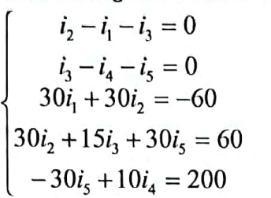
$$
\begin{cases}
i_2 - i_1 - i_3 = 0 \\
i_3 - i_4 - i_5 = 0 \\
30i_1 + 30i_2 = -60 \\
30i_2 + 15i_3 + 30i_5 = 60 \\
-30i_5 + 10i_4 = 200
\end{cases}
$$
Bepaal de stroomsterkten

```matlab
syms i1 i2 i3 i4 i5
eq1 = i2 -i1 -i3 == 0
eq2 = i3 -i4 -i5 == 0
eq3 = 30*i1 + 30*i2 == -60
eq4 = 30*i2 + 15*i3 + 30*i5 == 60
eq5 = -30*i5 + 10*i4 == 200

opl = solve([eq1, eq2, eq3, eq4, eq5], [i1, i2, i3, i4, i5])

opl.i1 %als je echt een neurt bent kan je ze allemaal nog apart uitschrijven

var2 = vpa(ans)

```


#### 1.55

Bepaal een orthonormaal stel eigenvectoren van de lineaire transformatie $g: (x,y,z) → (-x, -y, -z)$. Wat is de fysische interpretatie hiervan? Verklaar het resultaat.

```matlab
%TODO
```


### Week 7

#### 1.58

Maak een simulatie met 100 steekproefwaarden van een variabele met een F(7,5 df)-verdeling. Herhaal dit 400 keer. Maak passende tekeningen om hierin de centrale limietstelling te herkennen.

```matlab
simulatie=frnd(7,5,100,400);
xbar=mean(simulatie)
histogram(xbar,'Normalization','pdf')
hold on;
x=0:0.05:4;
plot(x,normpdf(x,5/3,sqrt(5/7)/3), 'r')
hold on;
plot(x,fpdf(x,7,5), 'g')
```

#### 1.63 

De resultaten (/100) behaald door een selectie van 10 studenten op het examen wiskunde en
economie worden gegeven in onderstaande tabel.

| Student        | 1    | 2    | 3    | 4    | 5    | 6    | 7    | 8    | 9    | 10   |
| -------------- | ---- | ---- | ---- | ---- | ---- | ---- | ---- | ---- | ---- | ---- |
| Score Wiskunde | 30   | 73   | 51   | 57   | 81   | 21   | 75   | 46   | 85   | 21   |
| Score Economie | 45   | 70   | 40   | 60   | 71   | 30   | 80   | 50   | 70   | 10   |

 (a) Wat is de gemiddelde score voor het examen wiskunde bij deze 10 studenten?
 (b) Schat de verwachte score voor het examen economie. Wat is daarbij de standaardfout?
 (c) Bij welk examen is de variantie het grootst voor deze groep studenten?
 (d) Maak een scatterplot waarbij je de score voor wiskunde uitzet ten opzichte van de score voor economie.

```matlab
wisk = [30 73 51 57 81 21 75 46 85 21]
eco = [45 70 40 60 71 30 80 50 70 10]
a = mean(wisk)
b = mean(eco) % gemiddelde is verwachte waarde
stdev_wisk = sqrt(var(wisk)/10)
stdev_eco = sqrt(var(eco)/10)
scatter(wisk, eco)
```

#### 1.64 

Genereer een steekproef met 200 waarnemingen van een variabele met als verdeling N(2,1).
Teken de histogram van deze steekproef.
Vind een interval waarin het steekproefgemiddelde van een dergelijke steekproef zal liggen met 80% betrouwbaarheid.

```matlab
steekproefgrootte = 200
steekproef = normrnd(2,1, 1, steekproefgrootte)
histogram(steekproef)
norminv([0.1 0.9], 2, 1/sqrt(steekproefgrootte))
```

#### 1.65

Als $x:F(5,12 d.f.)$, dan is$ P(x<2)= \cdots$
Als $y:t(10 d.f.)$, dan is $P(y>1)=\cdots$
Wat is a als $P(y<a)=0.15$?
Als $z:Bin(500, 0.02 d.f.)$, dan is $P(z<12)= \cdots$
(controleer dit laatste ook met de normale verdeling en geef commentaar)

```matlab
fcdf(2, 5, 12)
1 - tcdf(1, 10)
tinv(0.15,10)
binocdf(11, 500, 0.02)
% die andere heb ik geen zin in
```

#### 1.66

Genereer zelf een steekproef met 100 waarnemingen van lengtes van planken. De leverancier
stelt dat de lengtes normaal verdeeld zijn met gemiddelde $2 m$ en $\sigma=9 cm$. Onze zaagmachine
zaagt van elke plank een deel af met een lengte die normaal verdeeld verondersteld wordt met
gemiddelde $ 1.5 m$ en $\sigma=1 cm$. Simuleer dit. Welke verdeling verwacht je voor de lengtes van de
overblijvende stukken van de planken als je weet dat de werking van de machine onafhankelijk is
van de lengte van de plank. Controleer dit aan de hand van de grafieken van de cumulatieve
distributiefuncties (theoretische functie in het rood).

```matlab
% een lineaire combinatie van normaalverdelingen is een normaalverdeling
% de steekproefwaarden plotten
steekproefgrootte = 100;
lengte = normrnd(200,9, 1, steekproefgrootte);
afzaag = normrnd(150,1, 1, steekproefgrootte);
rest = lengte - afzaag;
ecdf(rest)
hold on 

% nu een normaalverdeling met de verwachte waarden plotten en over elkaar zetten voor swag
variantie = 9^2 + 1^2
gemiddelde = 200 - 150
x = 30:.1:80;
y = normcdf(x,gemiddelde, sqrt(variantie))
plot(x,y)
```


### Week 9

#### 1.59

Creëer een nieuwe data-file met volgende gegevens: 24, 19, 14, 10, 7, 5, 6, 8, 12, 16, 21, 27.
(a) Maak een boxplot.
(b) Ga na of de gegevens uit een normaal verdeelde populatie komen.
(c) Ga na of de gegevens uit een normaal verdeelde populatie met gemiddeld 7 komen.

```matlab
% a
vec = [24 19 14 10 7 5 6 8 12 16 21 27]
boxplot(vec) 

%nrml verdeeld?
normaal = kstest(vec)

% nrml verdeelde met gem = 7
test_cdf = makedist('Normal', 'mu',7, 'sigma',1);
normaal_7 = kstest(vec, 'CDF',test_cdf)
```

#### 1.67

De afdeling kwaliteitscontrole van een fabriek die microgolfovens maakt, meet bij 42 ovens wat de straling is van de oven met gesloten deuren.
(a) Ga na of we er kunnen vanuit gaan dat deze emissie normaal verdeeld is.
(b) Ga na of er uitschieters zijn. Welke zijn die?
(c) Test of $\mu = 0.10$ met $\alpha = 0.05$.
(d) Geef een 99% betrouwbaarheidsinterval voor $\mu$.
Data : **microgolf.dat**

```matlab
%a 
gem=mean(microgolf.emissie);
sig=std(microgolf.emissie);
test_cdf=makedist('Normal','mu',gem,'sigma',sig);
[h,p,D]=kstest(microgolf.emissie,'CDF',test_cdf)

% b
boxplot(microgolf.emissie)
percentiel_25 = prctile(microgolf.emissie, 25);
percentiel_75 = prctile(microgolf.emissie, 75);
interkwartiel = iqr(microgolf.emissie);
ondergrens = percentiel_25-1.5*interkwartiel
bovengrens = percentiel_75+1.5*interkwartiel

% c
[h,p,ci, stats]=ttest(microgolf.emissie,0.1);
h

%d
[h,p,ci]=ttest(microgolf.emissie, 0,'Alpha',0.01);
ci
```

#### 1.68

Een consumentenorganisatie evalueert de kwaliteit van zonnepanelen. Daarvoor werden op 15 daken panelen geplaatst, één van type A en één van type B. De geleverde stroom (in kWh) werd opgemeten gedurende 3 maanden. Kan op basis van deze gegevens worden geconcludeerd dat er een significant verschil is in opgewekte stroom tussen de twee soorten panelen?
Data : **zonnepaneel.txt**

```matlab
A=zonnepanelen(zonnepanelen.typePaneel == "A",1).stroom
B=zonnepanelen(zonnepanelen.typePaneel == "B",1).stroom
boxplot(zonnepanelen.stroom, 1)
[h,sig,ci,stats] = ttest2(A,B)
% h = 0, mu_a == mu_b met significantie 95%

% in de oplossing doen ze het anders:
x=A-B;
test_cdf=makedist('Normal','mu',mean(x),'sigma',std(x));
[h,p, D]=kstest(x,'CDF',test_cdf)
[h,p,ci,stats]=ttest(x,0)
```

#### 1.69

Een consumentenorganisatie evalueert de kwaliteit van zonnepanelen. Daarvoor wordt op 30 daken één type zonnepaneel gelegd: ofwel type A ofwel type B. De geleverde stroom (in kWh) werd opgemeten gedurende 3 maanden. Kan op basis van deze gegevens worden geconcludeerd dat er een significant verschil is in opgewekte stroom tussen de twee soorten panelen? Maak voor beide groepen een box-and-Whisker plot en becommentarieer.

```matlab

```

#### 1.71

Voor het vervaardigen van synthetisch diamant wordt winst geboekt als de karaat-waarde > 0.5. Een steekproef van 6 diamanten geeft:
                0.46 0.61 0.52 0.48 0.57 0.54

Is algemeen gesproken de productie de moeite waard? (test op 85% niveau)

```matlab

```

#### 1.73

De hartslag vóór en na het toedienen van een bepaalde medicatie bij zeven personen geeft volgende resultaten, waarbij 'hartslag sport' slaat op de resultaten van groep 1: personen die 2 uren sporten per week, en 'hartslag geen sport' slaat op de resultaten van groep 2: personen die geen sport doen.


```matlab

```

Kan op basis van deze steekproef gesteld worden dat de hartslag op populatieniveau hoger is voor de groep die geen sport doet$ (\alpha = 0.05)$? 

### Week 10

#### 1.60

(a) Geef de boxplot voor volgende data: 25, 50, 22, 10, 28, 95, 20, 14, 25, 30 Bepaal de uitschieter.
(b) Test of de gegevens normaalverdeeld zijn op 80%-niveau.
(c) Verwijder de uitschieter en test opnieuw.

```matlab

```

#### 1.61

Bij een fabriek die klinkers maakt, wil men de maatvastheid onderzoeken van de geproduceerde klinkers. Daarvoor werd een steekproef gedaan en de lengte gemeten.
          12, 13, 14, 16, 15, 18, 19, 10, 11, 12, 13, 14, 15, 13, 14, 12.
a) Presenteer een histogram van deze gegevens.
b) Kunnen we aannemen dat deze gegevens normaal verdeeld zijn?
c) Vind de mediaan, de interkwartielafstand, de modus, het gemiddelde, variantie, het 10% percentiel.

```matlab

```

#### 1.62

In onderstaande tabel staan de maandelijkse nettolonen van een KMO in de bouwsector.

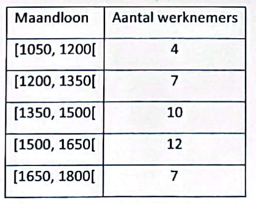


(a) Schat het gemiddelde loon binnen deze KMo. Wat is de standaardafwijking?
(b) Bereken zelf het 95% betrouwbaarheidsinterval voor het gemiddelde loon voor een KMO in de bouwsector op basis van deze gegevens.

```matlab

```

#### 1.75

Een onderzoek werd opgericht om na te gaan of de leeftijd van de autobestwurder invloed heeft op zijn rijgedrag, met name het aantal auto-ongevallen waarin hij betrokken geraakt gedurende een jaar.
Test met een betrouwbaarheid van 95% of de leeftijd van de bestuurder invloed heeft op het aantal ongevallen ?
Data : **rijgedrag.dat**

```matlab

```

#### 1.77

Men wenst te onderzoeken wie kiest voor het bouwen van passieve woningen. Daarvoor heeft men gepeild naar het opleidingsniveau van de mensen die een woning bouwen. Er wordt onderscheid gemaakt volgens drie klassen (groep1 = hoger opgeleiden, groep 2 = middengroep, groep 3 = laaggeschoolden). De aantallen staan genoteerd in volgende tabel.

                                     

(a) Ga je op basis van deze steekproef akkoord met de stelling dat er geen verschil is qua opleidingsniveau bij de keuze voor een passieve woning? (onbetrouwbaarheidsdrempel=5%)?
(b) Hoeveel procent van de passieve woningen worden gebouwd door laaggeschoolden?
(c) Hoeveel procent van de hoger opgeleiden kiest voor een passieve woning?

```matlab

```

### Week 11

#### 1.79 

Een onderzoeker is geïnteresseerd in de breeksterkte van verschillende gelamineerde balken gemaakt uit drie houtvariëteiten en drie verschillende soorten lijm. Om deze te vergelijken werden vijf balken van elk van de negen combinaties aangemaakt en daarna onderworpen aan een spanningstest. De data bestaat uit waarden voor de druk waarbij de balken braken. Maak een vergelijkend onderzoek en controleer eventuele assumpties.
Data : **balken.dat**

```matlab

```


#### 1.80

Men wenst onderzoek te doen rond verschilende samenstellingen om het wegdek van de snelweg mee te bouwen. Bij een proefproject worden de vier verschillende types wegdek (die verschillen qua samenstelling van de asfalt) gebruikt op de E17, de E40, de R4 en de E413, telkens met een strook van 1 km. Na vijf jaar wordt geëvalueerd hoeveel herstellingen dienden te
gebeuren (zie tabel). Maak een totale variantie-analyse voor wat betreft de types wegdek op de verschillende snelwegen.

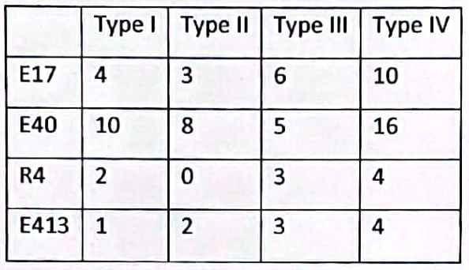

```matlab

```


#### 1.81

Op verschillende plaatsen worden watermonsters genomen en het zuurstofgehalte bepaald:
plaats 1: stroomopwaarts
plaats 2: nabij een fabriek
plaats 3: stroomafwaarts
Ga na of er een significant verschil is tussen de plaatsen.

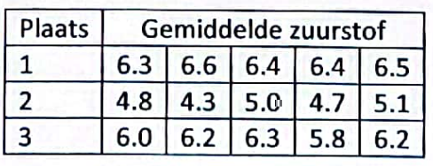

```matlab

```


#### 1.82

Er wordt een studie gedaan waarin de Fe-concentratie bepaald wordt in grondstalen. Op 3 verschillende plaatsen worden telkens zes stalen genomen en de metingen op elk staal worden uitgevoerd in 2 verschillende labo's, die elk een andere meettechniek gebruiken.
In de onderstande tabel worden de resultaten weergegeven.
Ga na in hoeverre het labo (factor A) en de plaats (factor B) effect hebben op de meting ($\alpha=0.1$).

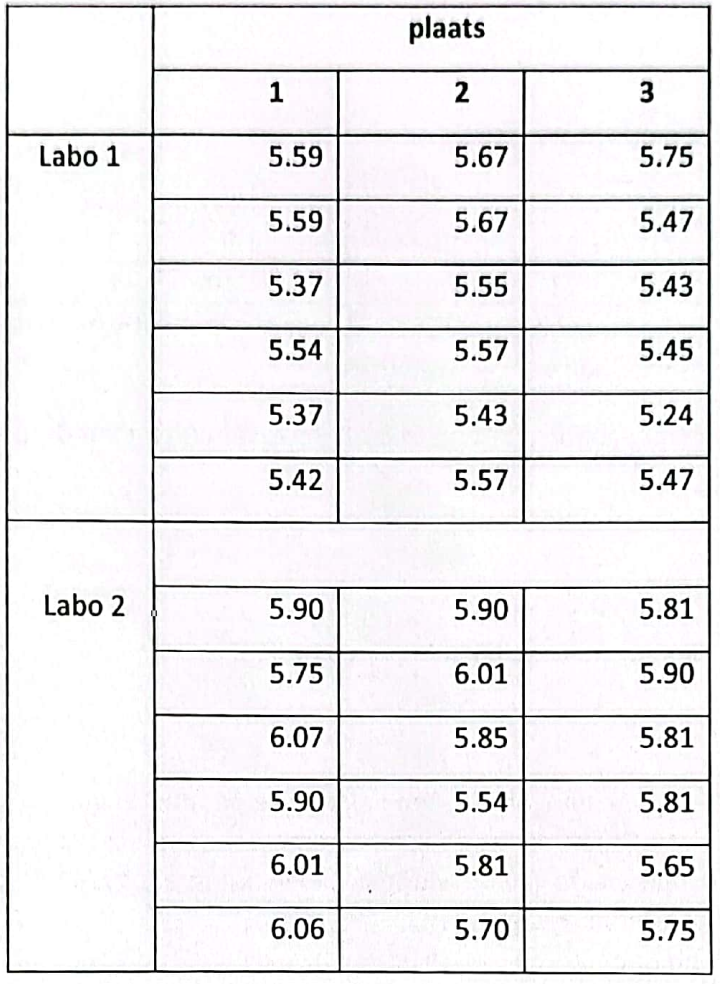

```matlab

```


### Week 12

#### 1.88

Gasmaatschappijen moeten voldoende gastoevoer voorzien om hun klanten het ganse jaar door te bevoorraden. Bij de planning wil men in staat zijn de benodigde hoeveelheid te voorspellen op basis van gegevens rond temperatuur van de dag zelf, van de voorbije dag, de windsnelheid, het feit of het weekend is of niet.

a.  Stel op basis van de data die voorhanden is, een lineair regressiemodel op dat ons in staat moet stellen om de nodige gashoeveelheid te modelleren.

b. Hoeveel procent van de variantie kan verklaard worden door het regressiemodel ? Interpreteer.

c. Wat is volgens het model de hoeveelheid gas die de maatschappij moet voorzien als de
   temperatuur van de dag (woensdag) gelijk is aan18 graden Celcius, de temperatuur van de
   dag ervoor 15 graden Celcius, de windsnelheid 10 bedraagt.

d. Wat is volgens het model het 95% betrouwbaarheidsinterval voor de coëfficiënt bij de
   temperatuur van de dag ?

Data : **gasbedrijf.dat**

```matlab

```


#### 1.89

Twee wijnproevers werd gevraagd een rangschikking te maken van 9 gegeven wijnen.
(a) Bereken de correlatiecoëfficiënt van de scores van beide wijnproevers en trek er je conclusies
   uit over de mening van de twee kenners.
(b) Maak een gepaste grafiek die het verband tussen de 2 beoordelingen weergeeft.
Data : **wijndegustatie.dat**

```matlab

```


#### 1.90

Het gewicht van personen wordt vergeleken met de systolische bloeddruk. Dit geeft:

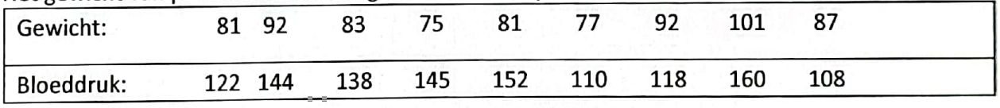

Bepaal het lineair verband dat algemeen de bloeddruk uitdrukt in termen van het gewicht.
Bespreek voor $\alpha = 0.05$.

```matlab

```


#### 1.91

Gegeven zijn volgende meetresultaten:

x: 1.5	 2	 3.1	 4.2	5  	 6.1 	6.9	 8.3	 9.5	 10.1 
y: 7 	20 	65 	 64 	187   430    600   1300  2000   3500

Bepaal op basis van deze gegevens het best passende lineair verband $y = \beta_0+ \beta_1x$. Kan je het  model verbeteren?

```matlab

```


#### 1.93

Men wil bestuderen hoe de weerstand van rubber tegen afschuren beïnvloed wordt door de hardheid en treksterkte van rubber. Twintig monsters rubber zijn getest op de hardheid (hoe hoger het getal des te sterker is het rubber) en treksterkte (in kg/cm?). Daarna is elk monster een uurlang afgeschuurd (elk monster op dezelfde manier) en is het afgeschuurde gewicht (in gram) aan rubber per uur (y) bepaald. Bepaal het meervoudige lineaire model $y = \beta_0 + \beta_1 x_1 + \beta_2 x_2$ en illustreer met een 3D tekening.

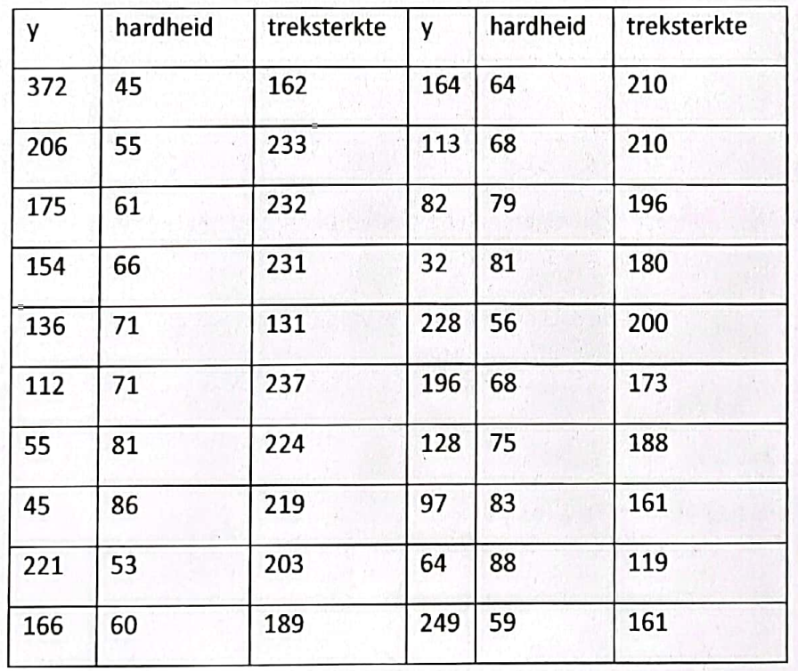

```matlab

```

