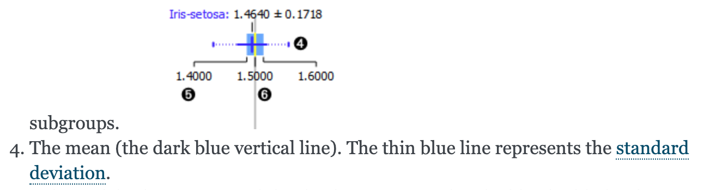
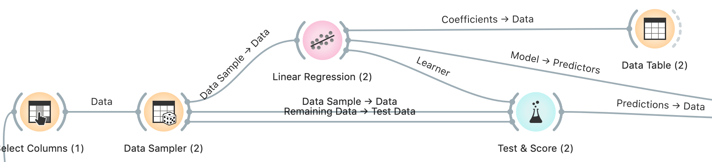

# KNN Regression

:warning: Zie onderaan de file wat ik juist had en wat niet, zodat je mijn foute redeneringen niet moet volgen.

Edit: Aimée heeft het verbeterd en ik heb 12/13. Noice.

## 1. Compare several models for predicting fat percentage. Which one do you think is the best?

Ik ben niet 100% zeker waarom het juist is, maar ik denk dat jullie de RMSE moeten vergelijken. Hoe kleiner het is hoe beter de methode volgens mijn bron.
Bron: https://stats.stackexchange.com/questions/56302/what-are-good-rmse-values

```
KNN regression (k=5) using only the same variables as with the statistically significant selected multiple linear regression. 
```

## 2. Daily Demand Forecasting. What is the average amount of orders?

Orange documentatie



```
309.147 volgens haar file
```


## 3. Build a multiple linear regression model and a KNN regression model with k=6 using all the variables. What is the RMSE for the KNN?

```
48.687
```


## 4. What is the RMSE for the multiple linear regression?

```
0.000
```


## 5. True or False: There is a noticeable difference between KNN with distance weighting and KNN with uniform weighting when looking at the training set.

```
True
```


## 6. Which predictor variables are predicting the target perfectly? Why might this be?

Question 3: I also checked the solution file from the repo, it also says 0.000, is this normal?

Question 4: I see a difference between the two, so I guess it's noticeable.

```
This question: Order type A, B, C, because they form the total orders together. Of course you can predict the total orders if you take all types of orders. I think the same goes for urgent and non-urgent orders
```



## 7. Build a linear regression model with urgent and non-urgent as the predictor variables. What is the intercept



Kijk in de data table.

```
20.1589
```


## 8. What is the coefficient for urgent?

```
1.00205
```


## 9. What is the coefficient for non-urgent?

```
0.940684
```


## 10. What is the RMSE for this model?

Klik op test and score man.

```
14.428
```


## 11. What is the relationship between the equation of the handmade model using the urgent/non-urgent feature and the residuals you calculated?

Dit is niet echt duidelijk, kijk misschien in exercises.pdf 

> *Why isn’t urgent combined with non_urgent a perfect match for the target?*
>
> *i. Try out a linear regression with just those 2 features, evaluate and look at the regression model.*
>
> *ii. U would expect that we could should combine them, but apperently the coefficients are slightly different from 1 with a constant in the model. Show the predictions on the test data set and build your own model handmade model without the intercept. What is the equation of this model?*
>
> *A. Calculate the predications according to this handmade model (feature constructor) on the test data set.*
>
> *B. Calculate the residual or error for each observation of the test data for this model.*
>
> *C. What is the average residual or error of our handmade model?*
>
> *D. Have you seen the value before? Where? What does this mean?*


```
I don't think that every single order falls in urgent or non-urgent. 

The residual error is there because there are also fiscal orders.
```

dit is waarschijnlijk fout

## 12. Are the coefficients for Day of the Week and Week of the Month variables statistically significant?

Run het python script op ieder van de twee variabelen.

kijk of de P-waarde < 0.05

```
Day of the week is significant
```


## 13. How would you interpret the significant coefficients for Day of the Week and Day of the Month?

```
With day of the week: p<0.05, this is not the case with week of the month. 

I seems pretty logical that the day of the week would be better to predict the total orders.

Maybe they get a lot of orders on friday, and not a lot of orders order on sunday, or something like this.

I don't see why there would be a different amount of orders on a different week of the month.
```


## Wat was er fout?

- ### Question 1

  1 out of 1 points

  |      |                                                              |
  | ---- | ------------------------------------------------------------ |
  |      | Compare several models for predicting fat percentage. Which one do you think is the best? |
  |      |                                                              |

- ### Question 2

  1 out of 1 points

  |      |                                                              |
  | ---- | ------------------------------------------------------------ |
  |      | Daily Demand Forecasting. What is the average amount of orders? |
  |      |                                                              |

- ### Question 3

  1 out of 1 points

  |      |                                                              |
  | ---- | ------------------------------------------------------------ |
  |      | Build a multiple linear regression model and a KNN regression model with k=6 using all the variables. What is the RMSE for the KNN? |
  |      |                                                              |

- ### Question 4

  1 out of 1 points

  |      |                                                      |
  | ---- | ---------------------------------------------------- |
  |      | What is the RMSE for the multiple linear regression? |
  |      |                                                      |

- ### Question 5

  1 out of 1 points

  |      |                                                              |
  | ---- | ------------------------------------------------------------ |
  |      | True or False: There is a noticeable difference between KNN with distance weighting and KNN with uniform weighting when looking at the training set. |
  |      |                                                              |

- ### Question 6

  Needs Grading

  |      |                                                              |
  | ---- | ------------------------------------------------------------ |
  |      | Which predictor variables are predicting the target perfectly? Why might this be? |
  |      |                                                              |

- ### Question 7

  1 out of 1 points

  |      |                                                              |
  | ---- | ------------------------------------------------------------ |
  |      | Build a linear regression model with urgent and non-urgent as the predictor variables. What is the intercept? |
  |      |                                                              |

- ### Question 8

  1 out of 1 points

  |      |                                     |
  | ---- | ----------------------------------- |
  |      | What is the coefficient for urgent? |
  |      |                                     |

- ### Question 9

  1 out of 1 points

  |      |                                         |
  | ---- | --------------------------------------- |
  |      | What is the coefficient for non-urgent? |
  |      |                                         |

- ### Question 10

  1 out of 1 points

  |      |                                  |
  | ---- | -------------------------------- |
  |      | What is the RMSE for this model? |
  |      |                                  |

- ### Question 11

  Needs Grading

  |      |                                                              |
  | ---- | ------------------------------------------------------------ |
  |      | What is the relationship between the equation of the handmade model using the urgent/non-urgent feature and the residuals you calculated? |
  |      |                                                              |

- ### Question 12

  1 out of 1 points

  |      |                                                              |
  | ---- | ------------------------------------------------------------ |
  |      | Are the coefficients for Day of the Week and Week of the Month variables statistically significant? |
  |      |                                                              |

- ### Question 13

  Needs Grading

  |      |                                                              |
  | ---- | ------------------------------------------------------------ |
  |      | How would you interpret the significant coefficients for Day of the Week and Day of the Month? |

