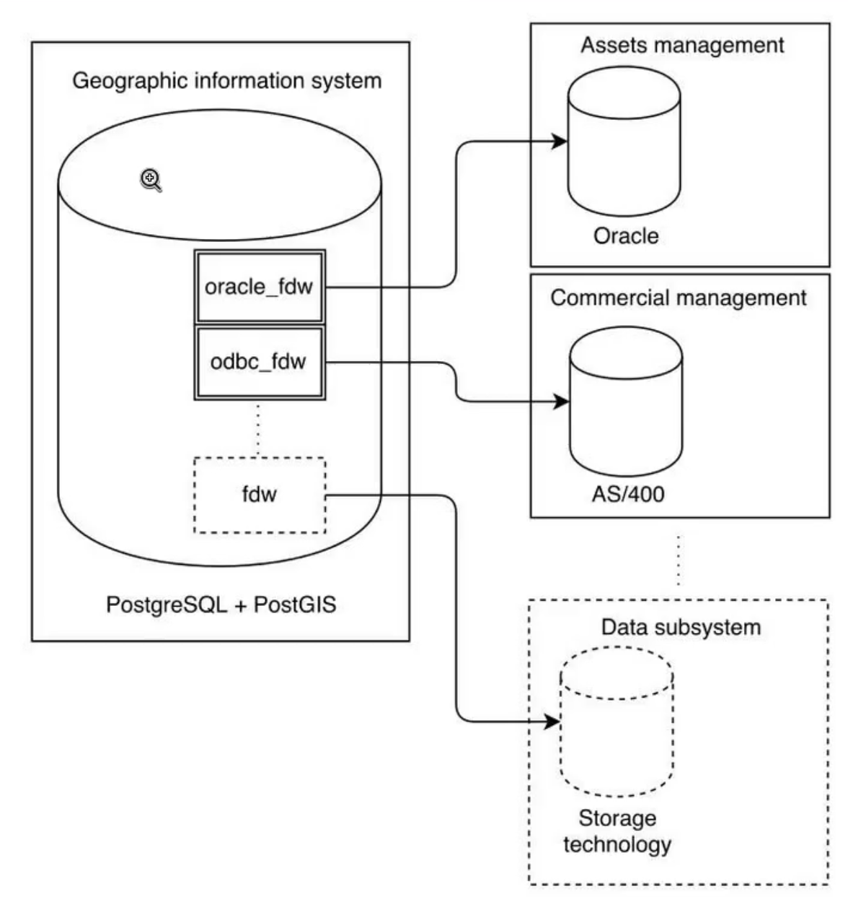

## GIS en MED

Voor deze opdracht wilt bertels dat je een GIS maakt:



Je gaat eigenlijk op je lokale databank een wrapper maken rond een andere. Bijvoorbeeld *basis_rdbms*.

Pruts een beetje met dit script

```
create database demo;
create extension postgres_fdw ;
create server ucll_54321 foreign data wrapper postgres_fdw  options (host 'databanken.ucll.be'
, dbname 'basis_rdbms', port '54321'); 
select current_user;
create user MAPPING FOR wim server ucll_54321 options (user 'test', password 'testpas');
create schema demo_ruimte;
import foreign schema ruimtereizen from server ucll_54321 into demo_ruimte;
```

Vervang `test` en `testpas` door de username en password die je op de databank van DB2 gebruikt.

Vervang `wim` door je gebruiker op je eigen lokale databank.

Bij mij deed het moeilijk dus ik heb de commandos 1 voor 1 uitgevoerd.

Zorg ook dat wanneer je de database `demo` hebt gemaakt, je de volgende commando's ook in deze database uitvoert. 


 