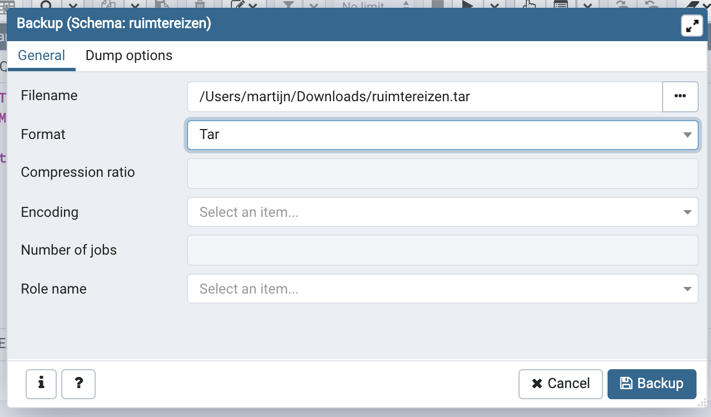
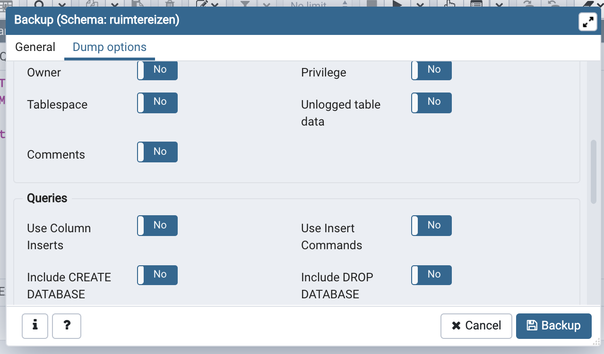
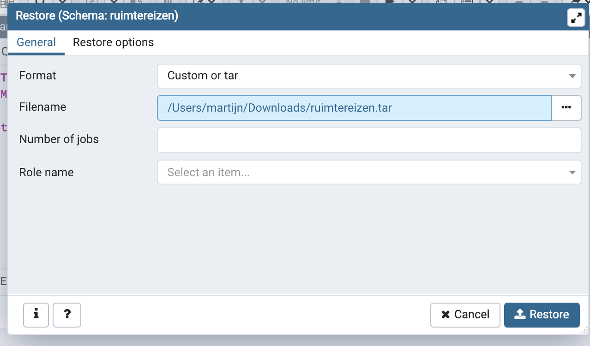

# Lokale databank

Bertels vraagt je waarschijnlijk vaak om dingen toe te voegen aan je lokale databank. Nu vraag je je waarschijnlijk af: Hoe moet dat nu precies? Wel

## Stap 1

Kies een schema naar keuze, right-click en selecteer backup.

## Stap 2

Selecteer 'tar' als formaat (dat werkte toch bij mij) en geef het bestand een naam. Ik denk dat je eender welk formaat kan nemen.

## Stap 3

Zorg dat je bij dump options alles van **owners en privileges uitzet**, anders is de admin van jouw lokale databank 'Wim' en dan is alles naar de klote. Zet ook alles van **data** aan. De rest kiest je zelf.

## Stap 4

Nu hoop ik dat je postgres op je pc geinstalleerd hebt en in PGadmin hebt gestoken. Anders vind je sowieso wel een leuke tutorial op www.google.com.

Maak een nieuw schema aan op je lokale databank.

Druk op **restore**

## Stap 5

Selecteer het bestand dat je hebt opgeslagen. De restore options zijn hetzelfde als de dump options bij stap 3. Je hoeft ze normaal gezien niet aan te passen, maar een kijkje nemen kan geen kwaad.

Druk op **restore**. Als alles goed is verlopen heb je nu je eigen kopie van de gekozen databank. Je kan er nu lekker zelf aan prutsen enzo. Geweldig!!!

This tutorial is:

