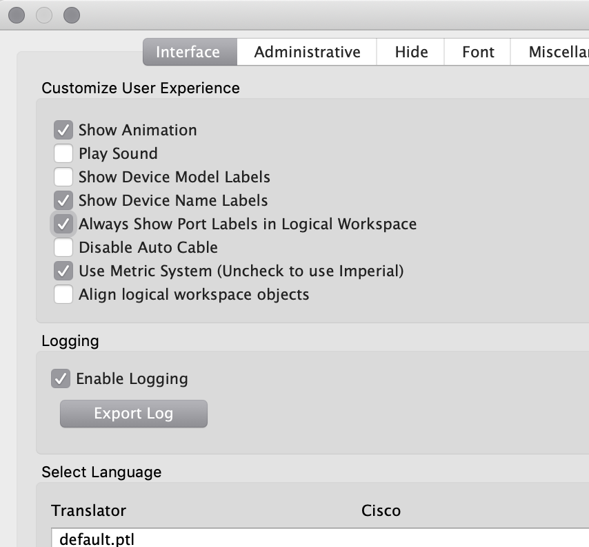
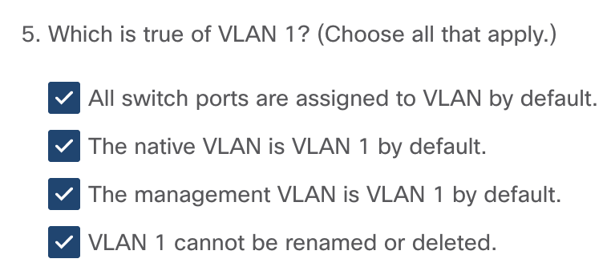
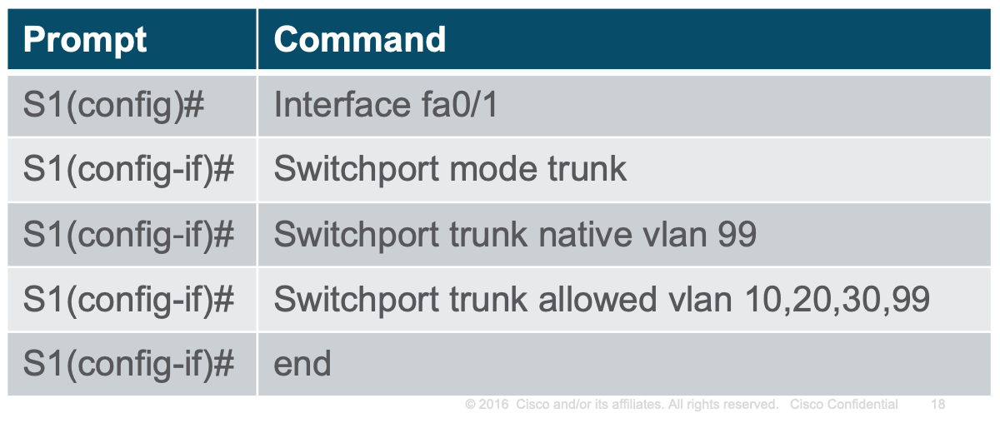
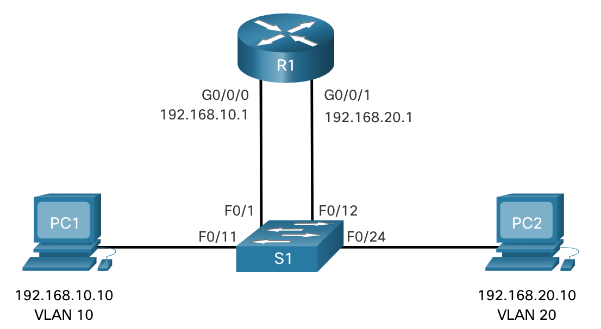
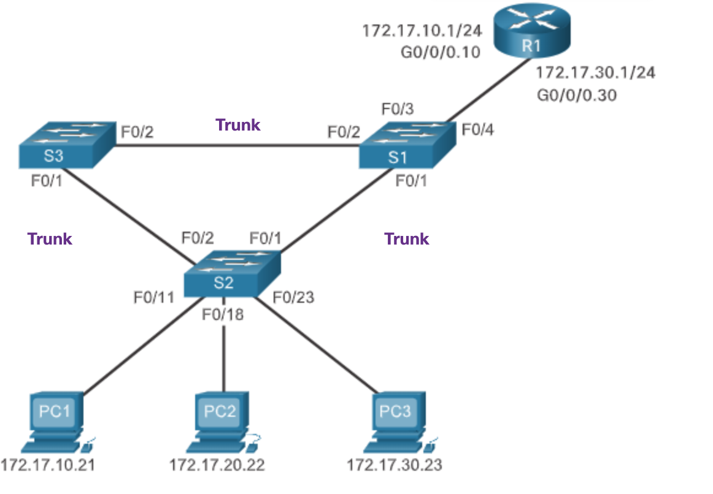
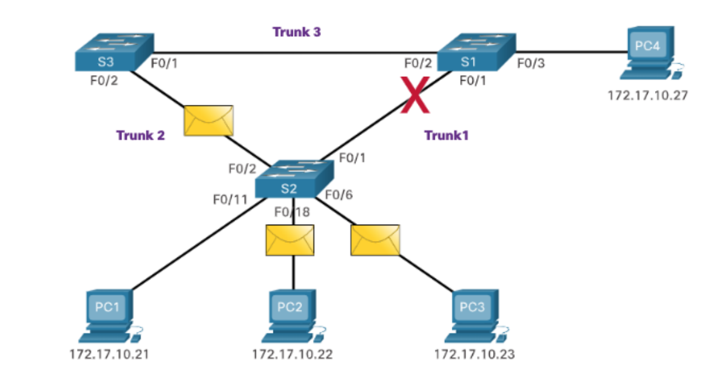
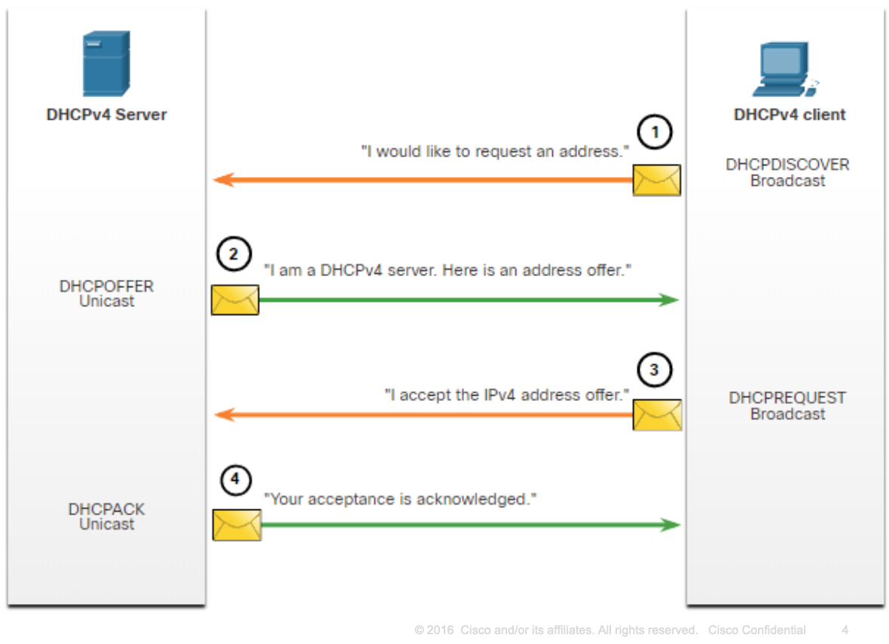
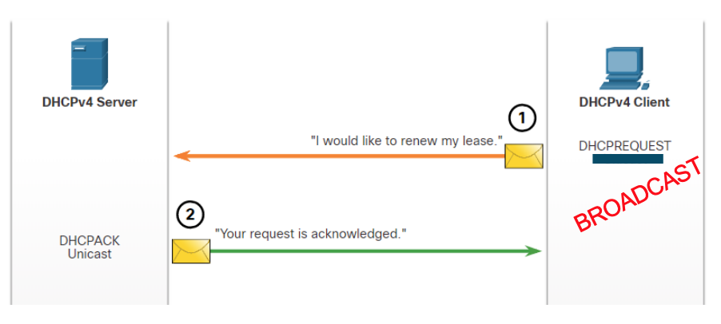
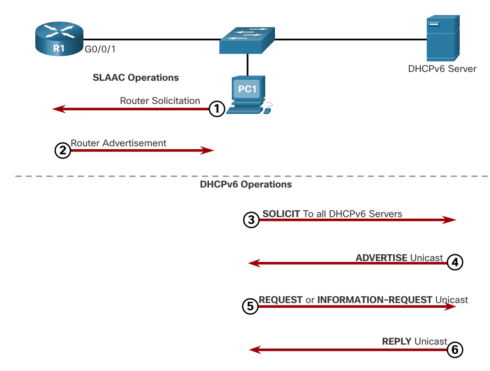

# Routing & Switching essentials

> :warning: LEGAL:  Je mag deze guide niet lezen of delen, hij bevat gecopyrighted materiaal van Cisco. Deze guide is mijn persoonlijke samenvatting en dient niet geherdistribueert te worden.

> :warning:  Ik maak dit voor mezelf. Het kan dat er erg onlogische dingen inzitten. 

[TOC]

(Die TOC zorgt ervoor dat je in *typora* een mooie table of contents krijgt. Github ondersteunt dit niet... Als ik zin heb zal ik als ik klaar ben met de samenvatting er eentje genereren.)


# Tips and Tricks

## My to-do list

* OSPF en *8.4.1.2 Packet Tracer - Skills Integration Challenge.pka*
* 

## Shortcuts

| Commando                           | Afkorting         |
| ---------------------------------- | ----------------- |
| configure terminal                 | conf t            |
| copy running-config startup-config | wr                |
| show ip route                      | sh ip ro          |
| show ip interface brief            | sh ip int brie    |
| show running-config [interface]    | sh ru [interface] |
| interface GigabitEthernet 0/0      | int G0/0          |
|                                    |                   |
|                                    |                   |
|                                    |                   |

## Translating domain server

Oke boys ik heb de superieure fix gevonden als je vas zit op `Translating "azerqdfgfdgq"...domain server (255.255.255.255)` 


Ram gewoon een paar keer op dit knopje (fast forward). Dan skip je die timeout van *translating...*

## Command Hierarchy

Dit vind ik altijd nuttig. Daarom zet ik het hier vanboven.


## Port labels



Doe in je preferences **always show port labels** aan.

da's handig


# Module 1: Basic Device configuration

**SVI**: Switch Virtual Interface


Checken of je shit werkt:


## SSH oefening 1.3.6

Op de switch:

**ip domain-name cisco.com**

**crypto key generate rsa**

**username admin secret ccna**

**line vty 0 15**

**transport input ssh**

**login local**

**no password**

**exit**


## Commando's

* Passwords instellen
* ssh configureren
* default gateway instellen
* ip adressen op interfaces zetten
* interfaces hernoemen
* apparatuur hernoemen
* motd instellen

Dit allemaal staat normaal in de volgende codefragmenten.

```
Router# configure terminal
Enter configuration commands, one per line.  End with CNTL/Z.
Router(config)# hostname R1
R1(config)# enable secret class
R1(config)# line console 0
R1(config-line)# password cisco
R1(config-line)# login
R1(config-line)# exit
R1(config)# line vty 0 4
R1(config-line)# password cisco
R1(config-line)# login
R1(config-line)# exit
R1(config)# service password-encryption
R1(config)#
```

```
banner motd $ Authorized Access Only! $
```

```
R1(config)# interface gigabitethernet 0/0/0
R1(config-if)# ip address 192.168.10.1 255.255.255.0 
R1(config-if)# ipv6 address 2001:db8:acad:1::1/64 
R1(config-if)# description Link to LAN 1
R1(config-if)# no shutdown
R1(config-if)# exit
R1(config)# interface gigabitethernet 0/0/1
R1(config-if)# ip address 192.168.11.1 255.255.255.0 
R1(config-if)# ipv6 address 2001:db8:acad:2::1/64 
R1(config-if)# description Link to LAN 2
R1(config-if)# no shutdown
R1(config-if)# exit
R1(config)# interface serial 0/0/0
R1(config-if)# ip address 209.165.200.225 255.255.255.252 
R1(config-if)# ipv6 address 2001:db8:acad:3::225/64 
R1(config-if)# description Link to R2
R1(config-if)# no shutdown
R1(config-if)# exit
R1(config)#
```

```
Router# configure terminal
Enter configuration commands, one per line.  End with CNTL/Z.
Router(config)# hostname R1
R1(config)# enable secret class
R1(config)# line console 0
R1(config-line)# password cisco
R1(config-line)# login
R1(config-line)# exit
R1(config)# line vty 0 4
R1(config-line)# password cisco
R1(config-line)# login
R1(config-line)# exit
R1(config)# service password-encryption
R1(config)#
```


## SVI configureren

| **Task**                                         | **IOS Commands**                                       |
| :----------------------------------------------- | :----------------------------------------------------- |
| Enter global configuration mode.                 | `S1# configure terminal`                               |
| Enter interface configuration mode for the SVI.  | `S1(config)# interface vlan 99`                        |
| Configure the management interface IPv4 address. | `S1(config-if)# ip address 172.17.99.11 255.255.255.0` |
| Configure the management interface IPv6 address  | `S1(config-if)# ipv6 address 2001:db8:acad:99::1/64`   |
| Enable the management interface.                 | `S1(config-if)# no shutdown`                           |
| Return to the privileged EXEC mode.              | `S1(config-if)# end`                                   |
| Save the running config to the startup config.   | `S1# copy running-config startup-config`               |

# Module 2: Switching concepts

Switch Forwarding Methods:

**Store-and-forward switching** - Receives the entire frame and ensures the frame is valid. Store-and-forward switching is Cisco’s preferred switching method. 

**Cut-through switching** – Forwards the frame immediately after determining the destination MAC address of an incoming frame and the egress port. 


Een switch scheidt **collision domains**

een router scheidt **broadcast domains**

een hub vergroot **collision domains**


# Module 3: VLAN's

**VLAN trunk**: A trunk is a point-to-point link between two network devices. Kan in meerdere VLAN's zitten.

**FCS**: frame check sequence

Hier nog wat feitjes van netacad:



**Een VLAN tag bevat het volgende** :

- **Type** - A 2-byte value called the tag protocol ID (TPID) value. For Ethernet, it is set to hexadecimal 0x8100.

- **User priority** - A 3-bit value that supports level or service implementation.

- **Canonical Format Identifier (CFI)** - A 1-bit identifier that enables Token Ring frames to be carried across Ethernet links.

- **VLAN ID (VID)** - A 12-bit VLAN identification number that supports up to 4096 VLAN IDs.

  

## Soorten VLANS

* **Native VLAN**: default is die VLAN 1, op de native vlan wordt *untagged* traffic gesmeten. Je kan best een ongebruikte vlan als native vlan configureren.
* **Management VLAN**: ook default op VLAN 1: deze vlan dient voor SHH, telnet enzo. Voor het beheer van je apparatuur.
* **Voice VLAN**: VLAN voor *VoIP* (voice over ip)


## VLAN commando's

### VLAN's

**Vlan aan poort assignen**


`no switchport access vlan` zet de poort terug op vlan 1.

**Vlan maken**


**Vlans tonen**

```
show vlan [brief | id vlan-id | name
vlan-name | summary]
```

**Vlans verwijderen**

```
S1(config-if)# no vlan [vlan-id]
```

**Voice VLAN maken**

```
S3(config)# vlan 20
S3(config-vlan)# name student
S3(config-vlan)# vlan 150
S3(config-vlan)# name VOICE
S3(config-vlan)# exit
S3(config)# interface fa0/18
S3(config-if)# switchport mode access
S3(config-if)# switchport access vlan 20
S3(config-if)# mls qos trust cos <!-dit zet quality of service aan-!>
S3(config-if)# switchport voice vlan 150
S3(config-if)# end
```

> The configuration in the example creates the two VLANs (i.e., VLAN 20 and VLAN 150) and then assigns the F0/18 interface of S3 as a switchport in VLAN 20. It also assigns voice traffic to VLAN 150 and enables QoS classification based on the class of service (CoS) assigned by the IP phone.


### Trunks

Trunk poort maken**



| **Task**                                                   | **IOS Command**                                              |
| :--------------------------------------------------------- | :----------------------------------------------------------- |
| Enter global configuration mode.                           | `Switch# configure terminal`                                 |
| Enter interface configuration mode.                        | `Switch(config)# interface interface-id`                     |
| Set the port to permanent trunking mode.                   | `Switch(config-if)# switchport mode trunk`                   |
| Sets the native VLAN to something other than VLAN 1.       | `Switch(config-if)# switchport trunk native vlan vlan-id`    |
| Specify the list of VLANs to be allowed on the trunk link. | `Switch(config-if)# switchport trunk allowed vlan vlan-list` |
| Return to the privileged EXEC mode.                        | `Switch(config-if)# end`                                     |

**Trunk verwijderen/resetten**


**Trunk verifiëren**

```
show interfaces fa0/1 switchport
```


## DTP

**dtp**: Dynamic trunking protocol

> Some Cisco switches have a proprietary protocol that lets them automatically negotiate trunking with a neighboring device. This protocol is called Dynamic Trunking Protocol (DTP). DTP can speed up the configuration process for a network administrator. Ethernet trunk interfaces support different trunking modes. An interface can be set to trunking or nontrunking, or to negotiate trunking with the neighbor interface. Trunk negotiation is managed by DTP, which operates on a point-to-point basis only, between network devices.

uitzetten:

```
S1(config-if)# switchport mode trunk
S1(config-if)# switchport nonegotiate
```

terug aanzetten:

```
S1(config-if)# switchport mode dynamic auto
```


# Module 4: Inter-VLAN Routing

## Legacy inter-vlan routing



zo ziet dat eruit.

> Legacy inter-VLAN routing using physical interfaces works, but it has a significant limitation. It is not reasonably scalable because routers have a limited number of physical interfaces. Requiring one physical router interface per VLAN quickly exhausts the physical interface capacity of a router.


## Router-on-a-Stick Inter-VLAN Routing



dat ziet er zo uit

Je moet de vlans op de switches configureren (dat lukt wel als je het vorige hoofdstuk hebt gedaan)

daarna moet je de router configureren:

```
R1(config)# interface G0/0/1.10 -- de .10 voor vlan 10 (dit is een conventie, geen verplichting)
R1(config-subif)# description Default Gateway for VLAN 10
R1(config-subif)# encapsulation dot1Q 10 -- lees hieronder (1)
R1(config-subif)# ip address 192.168.10.1 255.255.255.0
R1(config-subif)# exit
```

(1)

> **encapsulation dot1q** *vlan_id* **[native]** - This command configures the subinterface to respond to 802.1Q encapsulated traffic from the specified *vlan-id*. The **native** keyword option is only appended to set the native VLAN to something other than VLAN 1.

doe oefening 4.2.7

## Inter-VLAN Routing on a Layer 3 Switch


dat hebben we dan ook alweer gehad.

Hoe doe je dat?

**1. Create the VLANs.**

```
D1(config)# vlan 10
D1(config-vlan)# name LAN10
D1(config-vlan)# vlan 20
D1(config-vlan)# name LAN20
D1(config-vlan)# exit
```

**2. Create the SVI VLAN interfaces.**

```
D1(config)# interface vlan 10
D1(config-if)# description Default Gateway SVI for 192.168.10.0/24
D1(config-if)# ip add 192.168.10.1 255.255.255.0
D1(config-if)# no shut
D1(config-if)# exit
D1(config)#
D1(config)# int vlan 20
D1(config-if)# description Default Gateway SVI for 192.168.20.0/24
D1(config-if)# ip add 192.168.20.1 255.255.255.0
D1(config-if)# no shut
D1(config-if)# exit
```

**3. Configure access ports.**

```
D1(config)# interface GigabitEthernet1/0/6
D1(config-if)# description Access port to PC1
D1(config-if)# switchport mode access
D1(config-if)# switchport access vlan 10
D1(config-if)# exit
D1(config)#
D1(config)# interface GigabitEthernet1/0/18
D1(config-if)# description Access port to PC2
D1(config-if)# switchport mode access
D1(config-if)# switchport access vlan 20
D1(config-if)# exit
```

**4. Enable IP routing.**

> Finally, enable IPv4 routing with the **ip routing** global configuration command to allow traffic to be exchanged between VLANs 10 and 20. This command must be configured to enable inter-VAN routing on a Layer 3 switch for IPv4.

typo in netacad btw

```
D1(config)# ip routing
```

**Je moet ook routing configureren met volgens ospf**

**OSPF**: Open Shortest Path First (een routing protocol)

```
D1(config)# router ospf 10
D1(config-router)# network 192.168.10.0 0.0.0.255 area 0
D1(config-router)# network 192.168.20.0 0.0.0.255 area 0
D1(config-router)# network 10.10.10.0 0.0.0.3 area 0
```


### Troubleshooten

| **Issue Type**              | **How to Fix**                                               | **How to Verify**                                            |
| :-------------------------- | :----------------------------------------------------------- | :----------------------------------------------------------- |
| Missing VLANs               | Create (or re-create) the VLAN if it does not exist.Ensure host port is assigned to the correct VLAN. | `show vlan [brief] show interfaces switchport ping`          |
| Switch Trunk Port Issues    | Ensure trunks are configured correctly.Ensure port is a trunk port and enabled. | `show interfaces trunk show running-config`                  |
| Switch Access Port Issues   | Assign correct VLAN to access port.Ensure port is an access port and enabled.Host is incorrectly configured in the wrong subnet. | `show interfaces switchport show running-config interface ipconfig` |
| Router Configuration Issues | Router subinterface IPv4 address is incorrectly configured.Router subinterface is assigned to the VLAN ID. | `show ip interface brief show interfaces`                    |


# Module 5: STP Concepts

## Korte uitleg

**STP**: Spanning tree protocol

> Spanning Tree Protocol (STP) is a loop-prevention network protocol that allows for redundancy while creating a loop-free Layer 2 topology. 
>
> STP logically blocks physical loops in a Layer 2 network, preventing frames from circling the network forever



Je wilt in je netwerk graag **redundantie**, want als er ineens een apparaat ontploft, dan ligt niet heel je netwerk plat. Als je switches in een cirkel opstelt, kan het dat pakketjes oneindig lang blijven ronddraaien in die cirkel. **STP** voorkomt dit door poorten te **blokkeren** als ze niet echt nodig zijn. Als er nu een switch kapot gaat, dan worden de nodige geblokkeerde poorten open gezet opdat het netwerk terug operationeel is.


Ik ga het hele algoritme hier niet uitleggen, als je geïnteresserd bent kan je altijd de slides van module 4 op toledo lezen. 

Er zijn ook verschillende soorten STP. Ik weet niet echt of ze verwachten of we dit allemaal kennen. Nou ja, lees het maar op netacad als je extra tijd hebt (waarschijnlijk niet dus).


# Module 6: EtherChannel

> EtherChannel is a link aggregation technology that groups multiple physical Ethernet links together into one single logical link. It is used to provide fault-tolerance, load sharing, increased bandwidth, and redundancy between switches, routers, and servers.

Oke dus als we dat in minder vage woorden willen omschrijven.

*Je kan meerdere verbindingen tussen apparaten samensmelten tot één superverbinding. Dit heet EtherChannel.*

Thanks for coming to my Ted Talk.


zo ziet dat er dan uit.

Blijkbaar (volgens netacad) is EtherChannel ook nodig omdat normaal gezien **STP** (spanning tree) redundante poorten gaat blokkeren. Je kan dit dus voorkomen met EtherChannel.

Oh ja, nog een leuk feitje, je kan maximum 8 links in een EtherChannel stoppen.

## AutoNegotiation Protocols

Er zijn 2 protocollen die je hiervoor zou kunnen gebruiken (die doen wat werk in jouw plaats)

1. **Port Aggregation Protocol (PAgP)**

   ​	Heeft drie modes; 

   - **On** - This mode forces the interface to channel without PAgP. Interfaces configured in the on mode do not exchange PAgP packets.
   - **PAgP desirable** - This PAgP mode places an interface in an active negotiating state in which the interface initiates negotiations with other interfaces by sending PAgP packets.
   - **PAgP auto** - This PAgP mode places an interface in a passive negotiating state in which the interface responds to the PAgP packets that it receives but does not initiate PAgP negotiation.

2.  **Link Aggregation Control Protocol (LACP)**

   ​	Zelfde liedje

   - **On** - This mode forces the interface to channel without LACP. Interfaces configured in the on mode do not exchange LACP packets.
   - **LACP active** - This LACP mode places a port in an active negotiating state. In this state, the port initiates negotiations with other ports by sending LACP packets.
   - **LACP passive** - This LACP mode places a port in a passive negotiating state. In this state, the port responds to the LACP packets that it receives but does not initiate LACP packet negotiation.

Je kan EtherChannel ook configureren **zonder** deze protocollen.


## Wanneer werkt het?

* De speed en duplex configuratie van je poorten moet hetzelfde zijn

* De poorten moeten op dezelfde VLAN zitten, of het moeten trunk poorten zijn die dezelfde allowed vlans hebben.

  

Kort samengevat, je links moeten hetzelfde zijn. Je kan geen *ultra super mega link fusion* doen als je links verschillend zijn.


kan iemand deze naar rudi sturen?

## Hoe maak je het?

```
S1(config)# interface range FastEthernet 0/1 - 2
S1(config-if-range)# channel-group 1 mode active
Creating a port-channel interface Port-channel 1
S1(config-if-range)# exit
S1(config-if)# interface port-channel 1
S1(config-if)# switchport mode trunk
S1(config-if)# switchport trunk allowed vlan 1,2,20
```

Kies een range van interfaces en maak daarop een channel-group die je een nummer geeft. Nu kan je deze groep gewoon als interface gebruiken. Cool.


## Commando's

| Wat doet het                                                 | Hoe moet het                             |
| ------------------------------------------------------------ | ---------------------------------------- |
| Op een range van interfaces een channel group zetten en de EtherChannel modus instellen. | channel-mode [channel#] mode [mode]      |
| Kijken of het werkt                                          | show etherchannel summary                |
| De gemaakte channel aanspreken. (Om bv te gebruiken als trunk) | interface port-channel [channel#]        |
| Meer details                                                 | show run \| begin interface port-channel |

Zo mergen we twee switchpoorten tot 1 super trunk.

```
S1(config)# interface range g0/1 - 2
S1(config-if-range)# shutdown
S1(config-if-range)# channel-group 2 mode active --zie hieronder
S1(config-if-range)# no shutdown
S1(config-if-range)# interface port-channel 2
S1(config-if)# switchport mode trunk
```

**active **zorgt ervoor dat **LACP** wordt gebruikt.

**passive** gebruikt LACP alleen als een ander apparaat gedetecteerd wordt dat LACP gebruikt

**desirable** zorgt ervoor dat de switch een PAgP link gaat onderhandelen

als je op `?` drukt nadat je `channel-group 2 mode` hebt getypt krijg je dit

```
active     Enable LACP unconditionally
auto       Enable PAgP only if a PAgP device is detected
desirable  Enable PAgP unconditionally
on         Enable Etherchannel only
passive    Enable LACP only if a LACP device is detected
```

druk dus altijd op `?`

Je hoeft eigenlijk niks te weten over routers of switches. Druk gewoon op :question:

:question: :question:

:warning:

Soms gaan ports toch random in blocking mode. (door stp). Doe dit:

```
S1(config)# spanning-tree vlan 1 root primary
or
S1(config)# spanning-tree vlan 1 priority 24576
```

Oke ik heb weer iets bijgeleerd. Ze gaan niet zomaar in blocking mode. Ze gaan in blocking mode omdat er dan geen loop ontstaat (duh), maar waarom vroegen ze mij in die assignment dan om dat op te lossen? Het antwoord is simpel. STP blokkeerde de Gigabit Ethernet poorten van een switch, en gebruikte in de plaats daarvan de Fast Ethernet poorten. Dat is niet zo handig. Dus door dit commando te gebruiken op de switch met de GE poorten, blokkeerde spanning tree de FE poorten.


en dan kan je `show spanning-tree active` doen om te checken of alles oke is.


:warning: tip voor het packet tracer lab van dit hoofdstuk: gebruik de **volle zwarte** kabel, niet de autoconnect. Autoconnect geeft je de verkeerde kabel en dan rekent packet tracer de oefening fout. 


# Module 7: DHCPv4

## Korte uitleg

**DHCP**: Dynamic Host Configuration Protocol

**SOHO**: Small Offices/Home Offices (ik wist niet wat dit betekende in de cursus van netacad, nu is alles veel duidelijker)

Geeft dynamisch ip adressen en netwerkconfiguratie-info aan apparatuur.

De DHCP server heeft een tabel waaruit hij voor een bepaalde termijn ip adressen uitleent aan apparaten. (een **lease**)

**Hoe wordt een lease verkregen?**

1. DHCP Discover (DHCPDISCOVER)
2. DHCP Offer (DHCPOFFER)
3. DHCP Request (DHCPREQUEST)
4. DHCP Acknowledgment (DHCPACK)



**Hoe wordt een lease vernieuwd?**

Dit wordt dus meestal gestuurd wanneer de lease bijna gaat vervallen.

1. DHCP Request (DHCPREQUEST) 
2. DHCP Acknowledgment (DHCPACK)



## Configuratie (commando's)

**Stap 1**: sommige adressen mogen er niet in (bv je server met al je porno erop, die wil je zeker een statisch ip geven zodat je hem zeker kan bereiken)

```
Router(config)# ip dhcp excluded-address low-address [high-address]
```

**Stap 2**: maak een pool

```
Router(config)# ip dhcp pool pool-name
```

**Stap 3**: Pool configureren

| **Task**                               | **IOS Command**                                            |
| :------------------------------------- | :--------------------------------------------------------- |
| Define the address pool.               | **network** *network-number* [*mask* \| / *prefix-length*] |
| Define the default router or gateway.  | **default-router** address [ *address2….address8*]         |
| Define a DNS server.                   | **dns-server** *address* [ *address2…address8*]            |
| Define the domain name.                | **domain-name** *domain*                                   |
| Define the duration of the DHCP lease. | **lease** {*days* [*hours* [ *minutes*]] \| **infinite**}  |
| Define the NetBIOS WINS server.        | **netbios-name-server** *address* [ *address2…address8*]   |

> **Note**: Microsoft recommends not deploying WINS, instead configure DNS for Windows name resolution and decommission WINS.

geen idee waar dit over gaat


**Aan de router vertellen waar hij DHCP paketten moet doorgeven.**

```
R1(config)# interface g0/0/0
R1(config-if)# ip helper-address 192.168.11.6
R1(config-if)# end
```

**DHCP aan- en uitzetten**

```
R1(config)# no service dhcp
R1(config)# service dhcp
```

**Een DHCP client configureren** (een interface een adres laten krijgen via dhcp)

> To configure an Ethernet interface as a DHCP client, use the **ip address dhcp** interface configuration mode command, as shown in the example. This configuration assumes that the ISP has been configured to provide select customers with IPv4 addressing information.

```
SOHO(config)# interface G0/0/1
SOHO(config-if)# ip address dhcp
SOHO(config-if)# no shutdown
```

**Op pc dhcp aanzetten in command line**

```
C:\Users\Student> ipconfig /release --doet ipv4 configuratie weg
C:\Users\Student> ipconfig /renew --vraagt ip adres aan dhcp server
C:\Users\Student> ipconfig /all --toon ip adres van de pc en bijhorende info
```


## Verificatie (commando's)

| **Command**                             | **Description**                                              |
| :-------------------------------------- | :----------------------------------------------------------- |
| **show running-config \| section dhcp** | Displays the DHCPv4 commands configured on the router.       |
| **show ip dhcp binding**                | Displays a list of all IPv4 address to MAC address bindings provided by the DHCPv4 service. |
| **show ip dhcp server statistics**      | Displays count information regarding the number of DHCPv4 messages that have been sent and received. |

## Voorbeeld

In dit voorbeeld is de router de DHCP server:

```
R1(config)# ip dhcp excluded-address 192.168.10.1 192.168.10.9
R1(config)# ip dhcp excluded-address 192.168.10.254
R1(config)# ip dhcp pool LAN-POOL-1
R1(dhcp-config)# network 192.168.10.0 255.255.255.0
R1(dhcp-config)# default-router 192.168.10.1
R1(dhcp-config)# dns-server 192.168.11.5
R1(dhcp-config)# domain-name example.com
R1(dhcp-config)# end
```


# Module 8: SLAAC and DHCPv6

## Vocabulaire

<u>Eerst een paar afkortingen & termen</u> (netacad verwacht blijkbaar dat we die allemaal al kennen)

**GUA**: Global Unicast Address

**LLA**: Link Local Address

**SLAAC**: Stateless Address Auto-configuration

**RA**: Router Advertisement

**RS**: Router sollicitation

**Multicast adres**:

* Een apparaat kan in een multicast groep zitten. (Een beetje zoals een messenger groep). Deze groep heeft een **multicast adres**. Als je nu een bericht stuurt naar dat adres, zullen alle apparaten in de groep het bericht ontvangen. 

* Voorbeelden:

  * **ff02::1**, het all-nodes multicast adres.

  * **ff02::2**, all routers

  * ... je hebt het wel door hopelijk

    

ik heb ontdekt hoe je lijntjes kan maken in markdown yeey :dancer: je doet gewoon '---'

---

---

---

---

---

oke genoeg lijntjes, we gaan verder.


## Router advertisements

Een router stuurt **router advertisements** om de hosts duidelijk te maken hoe ze hun ipv6 adressen moeten verkrijgen.

> By default, an IPv6-enabled router periodically send ICMPv6 RAs (router advertisements) which simplifies how a host can dynamically create or acquire its IPv6 configuration.

---

Router advertisements kunnen deze flags bevatten:

**A flag** - The *Address Autoconfiguration flag* signifies to use Stateless Address Autoconfiguration (SLAAC) to create an IPv6 GUA 

> Zo kunnen hosts zelf een GUA maken, zonder dat er een DHCP server nodig is. De host gebruikt dan de prefix (subnet id) die voorzien is in de RA en kan dan random of met EUI-64 de rest van het adres genereren. (de rest van het adres heet by the way het *interface id*)

**O flag** - The *Other Configuration flag* signifies that additional information is available from a stateless DHCPv6 server. 

**M flag** - The *Managed Address Configuration flag* signifies to use a stateful DHCPv6 server to obtain an IPv6 GUA.


---

Mogelijke combinaties:

**A** (Autoconfiguration): Alleen SLAAC, zonder toeters en bellen (<u>stateless</u>)

**A+O **(Autoconfiguration + other configuration): SLAAC + DHCPv6, extra info komt van de DHCPv6 server (<u>stateless</u>)

**M **(Managed Configuration): DHCPv6 server die alles beheerd (<u>stateful</u>) 


## Duplicate address detection

Als je een random adres genereert kan het natuurlijk dat er iemand anders hetzelfde adres heeft. Weet maar gewoon dat het bestaat. Meer info vindt je [hier](https://lmgtfy.com/?q=duplicate+address+detection&iie=1)


## DHCPv6

1. The host sends an RS message.
2. The router responds with an RA message.
3. The host sends a DHCPv6 SOLICIT message.
4. The DHCPv6 server responds with an ADVERTISE message.
5. The host responds to the DHCPv6 server.
6. The DHCPv6 server sends a REPLY message.



## Configuratie (commando's)

**SLAAC aanzetten** (als je ipv6 unicast routing aanzet is SLAAC de default)

```
ipv6 unicast-routing
```

**Stateless DHCPv6 configureren**

Server (in dit geval een router):

```
R1(config)# ipv6 unicast-routing
R1(config)# ipv6 dhcp pool IPV6-STATELESS --dit maakt een pool, de conventie is om hem in ALL CAPS te schrijven
R1(config-dhcpv6)# dns-server 2001:db8:acad:1::254 --geeft dns server aan de pool
R1(config-dhcpv6)# domain-name example.com 
R1(config-dhcpv6)# exit
R1(config)# interface GigabitEthernet0/0/1
R1(config-if)# description Link to LAN
R1(config-if)# ipv6 address fe80::1 link-local
R1(config-if)# ipv6 address 2001:db8:acad:1::1/64
R1(config-if)# ipv6 nd other-config-flag --hier heb je de flag
R1(config-if)# ipv6 dhcp server IPV6-STATELESS
R1(config-if)# no shut
```

Client (in dit geval ook een router):

```
R3(config)# ipv6 unicast-routing
R3(config)# interface g0/0/1
R3(config-if)# ipv6 enable
R3(config-if)# ipv6 address autoconfig
R3(config-if)# end
```

**Stateful DHCPv6 configureren**

Server:

```
R1(config)# ipv6 unicast-routing
R1(config)# ipv6 dhcp pool IPV6-STATEFUL
R1(config-dhcpv6)# address prefix 2001:db8:acad:1::/64
R1(config-dhcpv6)# dns-server 2001:4860:4860::8888
R1(config-dhcpv6)# domain-name example.com
R1(config)# interface GigabitEthernet0/0/1
R1(config-if)# description Link to LAN
R1(config-if)# ipv6 address fe80::1 link-local
R1(config-if)# ipv6 address 2001:db8:acad:1::1/64
R1(config-if)# ipv6 nd managed-config-flag --m flag op 1 zetten
R1(config-if)# ipv6 nd prefix default no-autoconfig --a flag op 0 zetten
R1(config-if)# ipv6 dhcp server IPV6-STATEFUL
R1(config-if)# no shut
R1(config-if)# end
R1(config-if)# ipv6 nd other-config-flag
```

> **Note:** You can use the **no ipv6 nd managed-config-flag** to set the M flag back to its default of 0. The **no** **ipv6 nd prefix default no-autoconfig** command sets the A flag back its default of 1.

Client:

```
R3(config)# ipv6 unicast-routing
R3(config)# interface g0/0/1
R3(config-if)# ipv6 enable
R3(config-if)# ipv6 address dhcp
R3(config-if)# end
```


**Configure a DHCPv6 Relay Agent**

Syntax:

```
Router(config-if)# ipv6 dhcp relay destination ipv6-address [interface-type interface-number]
```

Voorbeeld:

```
R1(config)# interface gigabitethernet 0/0/1
R1(config-if)# ipv6 dhcp relay destination 2001:db8:acad:1::2 G0/0/0
R1(config-if)# exit
```


## Verificatie (commando's)

IPv6 pool en extra info tonen:

```
show ipv6 dhcp pool
```

Display the IPv6 link-local address of the client and the global unicast address assigned by the server.

```
show ipv6 dhcp binding
```

Toon DHCPv6 info van de interfaces 

```
show ipv6 dhcp interface
```

Op de client kijken of het werkt:

```
ipconfig /all
```

