# Les 1

Ik dacht om van de word documenten md's te maken, zodat je ze gemakkelijker op github kunt bekijken en doorzoeken, maar dat bleek meer werk dan verwacht. Als iemand zich geroepen voelt om deze samenvatting op te schonen, kunnen er zeker en vast martipoints :moneybag: aan verbonden worden.

## Windows server 2019

 

·   Server – client 

·   Client OS 

·   Server OS 

·   Een server OS verleent services of diensten aan 

o  gekoppelde apparaten 

o  verbonden gebruikers 

o  andere programma’s

·   Deze diensten moeten geïnstalleerd worden 

·   Deze diensten worden in Windows ook wel rollen of services genoemd

 

·   Clients kunnen ook services gaan aanbieden zoals webserver, mailserver of fileserver

o  indien er de nodige software (services) op geïnstalleerd is

o  De client wordt dan een server

·   Computers in een netwerk zijn 

o  client

o  server

o  beide

 

**Server versies** 

·   Essentials

o  Max. 25 gebruikers

·   Standard 

o  Max. 2 VMs 

·   Datacenter 

o  VMs onbeperkt

 

·   De functies die de server gaat uitvoeren bepalen welke versie 

o  Veel VMs => Datacenter 

o  Enkel DNS => Standard

 

·   Hoe bouw je flexibiliteit in? 

o  VMs 

o  Documentatietie

 

**De evidentie** 

·   In een Windowsnetwerk moet de naam van ieder netwerkobject uniek zijn. 

o  Elke pc, elke server, elke gebruiker moet een unieke naam krijgen 

o  Naming conven0on afankelijk van bedrijf 

·   Als administrator bent je god op de server (en als domeinbeheerder ben je god op het volledig domein en over alle netwerkapparaten binnen dat domein) 

o  Kies een goed paswoord => p@ssw0rd is dat NIET 

·   Rename de Administrator gebruiker naar root bijvoorbeeld 

·   Maak nieuwe gebruiker Administrator aan, geef deze alleen gebruikersrechten en geen administratorrechten

 

**Licenties** 

·   Een serverlicentie geeft recht om de server te installeren op één computer 

·   Deze licentie geeft je geen recht om via een client aan te melden op de server 

·   Daarom moet voor iedere gebruiker of elk apparat, die toegang heeft tot de Windows server (Client Access License) CAL’s aangekochten geïnstalleerd te worden

o  User CAL 

o  Device CAL

 

**Standalone server** 

·   Server zit niet in een domein 

·   Na installatie wordt de server voorzien van een willekeurige naam en opgenomen in de werkgroep Workgroup 

·   De tijd van de server wordt automatisch gesynchroniseerd met een server op het internet. 

o  Instellen via Selngs 

o  Time en Language 

o  Date & time 

 

**Werkgroep** 

·   Heeft tegenwoordig geen echt nut!

 

Active Directory 

·   Database die alle gegevens bevat van het domein met betrekking tot 

o  Users

o  Computers, Printers 

o  Policies

o  …. 

·   Maakt gebruik van DNS!

·   Voor de veiligheid meerdere domein controllers (DC) 

·   LDAP => Updates! • “last writer wins” policy 

·   Meerdere “master” rollen beschikbaar voor iedere DC 

·   Iedere DC kan een rol “doorschuiven” naar een andere 

·   Momenteel zijn er 5 FSMO rollen 

·   https://www.youtube.com/f-UR_tTakBU

 

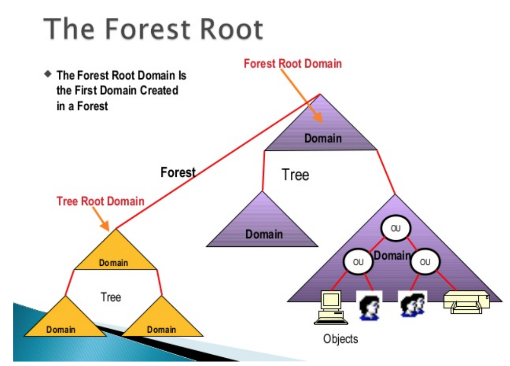

 

 

 

## Forest-tree

·   Een parent domain of root domain is het eerste domain 

·   Cosci.be is het root domain 

·   Cosci.be is ook het parent domain voor de child domains tokyo.cosci.be en madrid.cosci.be 

·   De users binnen de AD van tokyo.cosci.be kunnen ook inloggen bij cosci.be, ook zit deze account niet in de AD van cosci.be

 

 

 

#  

# Les 2

## Windows Server 2019

### Standalone server 

·   Ook al wordt het niet veel gebruikt … alles begint hier … 

·   Alvorens een server in een domein opgenomen wordt of zelf een domein controller wordt, is het en standalone server 

·   Op deze standalone server wordt gewerkt met lokale gebruikers en lokale groepen 

o  lokaal op de server 

o  Hoe aanmaken 

§ Tools => computer management

 

### Active Directory 

·   AD is een implementatie van LDAP, Kerberos en DNS in een Windowsomgeving 

·   Kerberos: authenticatieprotocol dat ervoor zorgt dat gebruikers van een netwerk zich op een veilige manier kunnen aanmelden en hun identiteit kunnen bewijzen, zonder zich telkens opnieuw te moeten aanmelden. Dit maakt “single sign-on” mogelijk. 

·   LDAP: ‘Lightweight Access Protocol’ is een netwerkprotocol dat beschrijft hoe gegevens uit een directoryservice benaderd moeten worden. Een directory is informatie die op een hiërarchische manier, gegroepeerd naar een bepaald attribuut, is opgeslagen. 

·   DNS

 

### ntds.dit 

·   Een domein is een groep netwerkobjecten zoals computers, printers, … die centraal beheerd worden 

o  ieder netwerkobject moet een unieke naam krijgen 

·   Gegevens over deze netwerkobjecten worden bewaard in een databank-bestand, nl. ntds.dit opgeslaan in %SystemRoot%\ntds\ 

o  New Technology Directory Services 

o  Data Information Table

 

·   Ntds.dit bevat drie tabellen 

o  Schema

§ Hierin staat welke soorten objecten in een active directory kunnen worden gemaakt/gebruikt. 

§ Hierin staat welke objecten “een relatie hebben” tot welke ander objecten 

§ Hierin staat welke “objectkenmerken” verplicht of facultatief zijn 

o  Link 

§ Hierin staat welke objecten “verbonden zijn” met welke andere objecten 

o  Gegevens

§ Bevat de gegevens van alle objecten

### Sites

·   Een domein is een logische eenheid van netwerkobjecten 

·   Een site is een fysiek geografische eenheid, nl. een locatie 

·   Het bedrijf Cosci.be kan een domein hebben waarbij de kantoren/gebouwen zich op verschillende geografisch verspreide locaties of sites bevinden 

·   Een site wordt gedefinieerd door een of meerdere IP-subnetten 

·   Zijn ontstaan om het replicatieverkeer over WAN-linken te verminderen

 

### Objectenklassen in AD

·   AD is een objectgeoriënteerde directoryservice 

·   Objecten zijn instanties van klassen 

·   Welke ingebouwde objectklassen heeft AD? 

o  Gebruikers 

o  Computers 

o  Groepen (container objecten) => verschil? De scope 

§ Universal Group

·   Bereik gehele forest 

·   Users/computers/… uit alle domeinen van het forest kunnen lid zijn 

§ Global Group 

·   Bereik gehele forest 

·   Users/computers/… uitsluitend uit het eigen domeinen kunnen lid zijn 

§ Domain Local Group: 

·   Bereik domein 

·   Users/computers uit alle domeinen van het forest kunnen lid zijn 

§ Organizational Unit

 

### Groepsbeleid

·   Beleid beschrijft regels (beperkingen) die gelden: 

o  User policies 

§ Uitgevoerd tijdens inloggen user 

§ Beperkingen gelden niet meer na uitloggen 

o  Computer policies 

§ Uitgevoerd tijdens opstart van computer 

§ Blijven gelden bij elke user die inlogt 

o  We spreken meestal niet van beleid maar van groepsbeleid 

o  Twee soorten groepsbeleid 

§ Lokaal => opgeslaan op de lokale computer, geldend voor een computer 

§ Niet lokaal => centraal opgeslaan, geldend voor een AD netwerk

 

 

 

·   Lokaal groepsbeleid 

o  Aanpasbaar als computer niet in een domein zit 

o  gpedit.msc

·   Niet lokaal groepsbeleid 

o  Het groepsbeleid wordt vastgelegd in een Group Policy Object in AD 

o  Groepsbeleidobjecten zijn van toepassing op objecten in AD van de site, domein of OU waaraan ze zijn gekoppeld 

o  GPO’s uitvoer volgorde 

§ Lokale 

§ Site 

§ Domein 

§ OU (en sub-OU …)

 

 

 

Group Policy Management 

·   GPO’s op sites worden standaard niet getoond => Show Sites 

·   GPO is altijd gekoppeld aan een site, domein of OU

 

# Les 3

## Powershell

### Basics

·   Objecten: instantie van iets 

o  Proces

o  Service

o  Get-member

·   Pipeline: output (object) van een commando wordt input van het volgende commando 

o  Get-process | Where {$_.CPU –gt 50} 

·   Data providers § Geven toegang tot data

·   Variabelen 

o  $Tofste_vak = BS2 

o  Niet hoofdlettergevoelig

·   cmdlet 

o  PowerShell script/commando 

o  Bestaat uit een combi werkwoord-zelfstandig naamwoord 

§ Get-Verb 

o  Get-command => alle cmdlet, aliases, functies

o  Get-Help 

o  Help 

 

### Hoe gebruiken?

·   PowerShell ISE => Visual Studio Code 

o  Update-Help

 

### Modules

·   Uitbreidingsset voor PowerShell 

o  Get-module 

o  Help get-module 

o  Import-Module ActiveDirectory 

o  Get-command -Module ActiveDirectory

### Data

·   Write-Host 

·   Write-File

### Scripting Logica

·   If 

·   ForEach-Object 

o  Get-process| get-member 

o  Get-process| ForEach-Object {$_.id} 

·   While 

o  $myint = 1 

DO { Write-Host "Starting loop number $myint" $myint $myint++ Write-Host "Now my integer is" $myint } While ($myint -le 5)

### Nuttig

·   Get-Process | Export-csv Path c:\test.csv 

·   $Processen = Import-csv –-Path c:\test.csv 

·   Get-Process | Sort-Object -Property CPU

 

### Hulp nodig?

·   PowerShell kan te veel om alles te kennen/kunnen 

·   Update-Help 

·   Help 

·   Get-Help [-detailed|-full] 

·   Get-help processes

 

## Script

·   Script 

o  Opeenvolging van commando’s die uitgevoerd worden 

o  Extentie .ps1 

o  PowerShell Gallery 

o  Gebruik ALTIJD commentaar, ja ALTIJD! 

·   Start je script in een PowerShell venster met .\script.ps1 

·   Uitvoer van scripts kan “disabled” zijn via de executionpolicy 

o  Get-executionpolicy 

o  Set-executionpolicy unrestircted

 

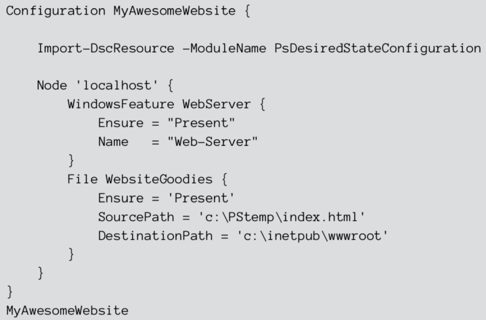

### Desired state configuration

·   Configureer machines a.d.h.v. code 

·   PS1-file met keyword configuration 

·   Alternatief 

o  Ansible 

o  Puppet

 

(check boek 6)

 

# Les 4

## Docker

 

### Wat is docker?

·   Een docker image is de kleinst mogelijke software nodig om net dat ene proces (jouw applicatie) te laten draaien. 

·   Een docker container is een instantie van een image. 

·   Micro-services

·   https://youtu.be/YFl2mCHdv24 (learn docker in 12 minutes)

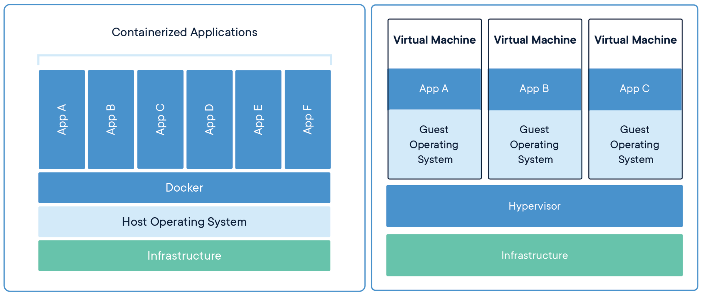

 

 

### It worked on my system 

·   Code on another system doesn’t work due to different computing environments 

·   If the computing environment is consistent => it worked on my system and should work on yours 

o  dev-test-qa-prod all have the same computing environment

### Container

·   A container is a software package that consists of the application and all the dependencies to run the application 

·   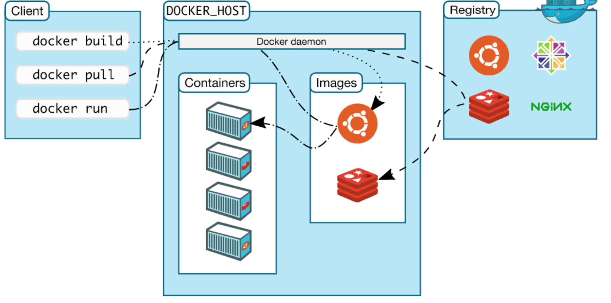Images are as small as possible 

·   Configure one image and copy them between systems 

·   Very easy to scale HORIZONTAL

 

 

 

 

 

### Images

·   Images can be pulled from the Registry 

·   Images can be created via a Dockerfile 

·   Images are templates, used to create containers 

o  Think of it as class and object

### Commands

·   docker 

o  version 

o  container 

o  pull 

o  run 

o  images 

o  attach 

o  stop 

o  start

### Docker pull

·   docker pull hello-world 

·   The pull command fetches the hello-world image from the Docker registry and saves it on your local disk.

### Docker run

·   docker run hello-world 

o  Usage: docker run [OPTIONS] IMAGE [COMMAND] [ARG...] 

o  docker run -it debian bash 

§ -i or -t or -it or -??? 

·   docker run --help 

§ Command can be "predefined" 

o  Docker container? 

§ a docker container is an image in run

·   $ docker run -it debian touch /root/test 

·   $ docker run -it debian ls /root/test 

·   Each ”docker run” creates an other separate container 

·   $ docker container ls -a 

o  ID: the corresponding unique identifier for that container 

o  NAMES

·   To detach from a running container: ^P + ^Q 

o  The container will continue to run 

o  docker container ls 

·   To attach to a container 

o  docker attach 

o  docker exec 

·   Typing exit in the container 

o  stops the container and exits back to the shell 

o  docker ps and docker ps -a

 

### Start and Stop

·   Containers are only created via docker run 

·   All created containers can be viewed 

o  docker container ls –a 

o  docker ps -a 

·   Remove stopped containers 

o  docker rm 

o  docker container prune

·   To view all downloaded images: docker images 

o  TAG: refers to a particular snapshot or version number of the image 

o  IMAGE ID: the corresponding unique identifier for that image 

·   Pull a specific version of ubuntu image 

o  docker pull ubuntu:12.04 

o  No version number => version latest 

·   To remove an image 

o  docker rmi hello-world

### Create an image

·   Write a Dockerfile 

·   Build the image 

·   Run and test the image

 

·   Build instruction located in a Dockerfile

o  text file that contains a list of commands for creating an image 

·   All user images start from a base image 

o  FROM debian:latest 

·   Run some commands with the RUN command 

o  RUN apt update && apt -y upgrade && apt install -y apache2 

·   Let's add a file student.html (don't forget to create it) 

o  ADD student.html /var/www/html 

·   Specify the port which needs to be exposed 

o  EXPOSE 80 

·   The last step, which command should run when it is started 

o  CMD ["service", "apache2", "start"]

### Build

·   Write Dockerfile => done 

·   docker build -t myfirst:1 . 

·   docker build --help 

·   An image is a template for 

o  base os 

o  software + libs 

o  application

### Run image

·   Docker run

 

### Dockerfile

**FROM** debian:latest 
 RUN apt update && apt -y upgrade && apt install -y apache2 
 EXPOSE 80 
 CMD ["apachectl" , "-DFOREGROUND"]

 

Keep in mind that the container stops if the command after the CMD keyword also exits or stops!

 

### Docker HUB

·   Log in on https://hub.docker.com/ 

·   Click on Create Repository 

·   Choose a name and a description for your repository and click Create. 

·   docker login --username=yourhubusername 

·   Check the image ID using docker images 

·   tag your image: § docker tag [hex-value] yourhubusername/repository:tag 

·   docker push yourhubusername/verse_gapminder

 

### Microservices – link

·   Cat /etc/hosts

 

## 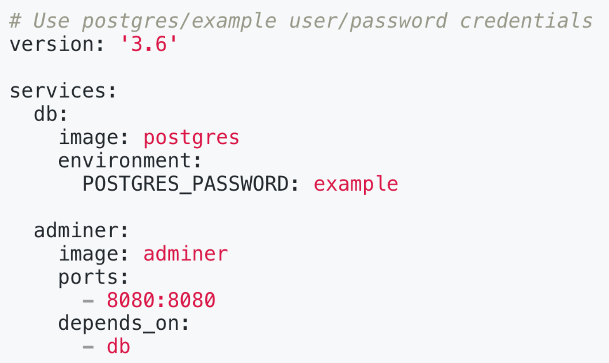Docker-compose

·   A tool for defining and running multi - container applications 

·   Configuration file docker -compose.yml 

·   https://docs.docker.co m/compose/install/ 

·   Run docker-compose config to check your config

 

### Reminder

·   One process or single service per container

·   https://www.katacoda.com/courses/docker

·   Docker is a tool used to automate the deployment of applications in a container so that the applications can work on different system. 

·   [https://ropenscilabs.github.io/r-docker-tutorial/04- Dockerhub.html](https://ropenscilabs.github.io/r-docker-tutorial/04- Dockerhub.html)

·   https://takacsmark.com/docker-compose-tutorialbeginners-by-example-basics

 

# Les 5

## SAMBA

Microsoft maakt voor het communiceren tussen computers en servers gebruik van het SMB protocol. Samba is een opensource implementatie van dit protocol. Met Samba is het mogelijk om bestanden (en printers) op je Linux server te delen met MS Windows computers.

 

### 1. Samba installeren 

In dit voorbeeld zal Samba geïnstalleerd worden op Debian. Samba installeer je als root via het commando’s:

\# apt-get update 
 \# apt-get upgrade 
 \# apt-get install samba smbclient

 

\2. Gebruiksbeheer 

Na de installatie van Samba vindt de configuratie ervan plaats. Als eerste stel je in welke Linux gebruikersnamen gebruik gaan maken van de Samba folders. Dit betekent dat die gebruikersnaam zowel als Linux gebruiker èn als Samba gebruiker moet bestaan.

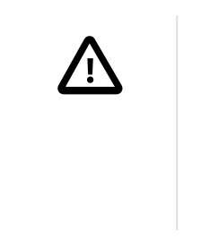

Als een Samba gebruiker Pieter alleen gebruik maakt van Samba en niets doet op de Linux server, dan zal er toch een Linux gebruikersnaam of account aangemaakt moeten worden. Andersom geldt dat niet. Als een Linux gebruiker Gerben niet gebruikt maakt van Samba dan hoeft er geen Sambagebruiker aangemaakt te worden. 

Stel dat de Linux gebruiker Marnix reeds is aangemaakt, dan maak je deze gebruiker ook aan onder Samaba als volgt:

 

\# smbpasswd -a marnix

 

Hierna wordt een wachtwoord gevraagd voor de Samba gebruiker. Dit wachtwoord hoeft niet gelijk te zijn aan het wachtwoord voor de het Linux gebruiker!

 

\3. Directory’s configureren 

In dit voorbeeld zullen drie verschillende samba shares of gedeelde mappen geconfigureerd worden: 

·   een map voor gedeelde data: data 

·   een map voor je muziekverzameling: muziek 

·   een deelmap waarbij iedereen in het netwerk, zonder login aan kan: deelmap 

 

Belangrijk om te weten is dat een Samba gebruiker alleen maar toegang tot de share krijgt als die de juiste Linux rechten hebt. De muziekfolder bijvoorbeeld is voor iedereen toegankelijk met leesrechten, de gebruiker marnix mag alleen kunnen schrijven in deze folder. 

Hieronder kan je de commando’s terugvinden om de directories voor de drie folders, Samaba shares aan te maken en om de Linux rechten correct in te stellen op deze folders. In dit voorbeeld maken we de drie folders onder de de srv directory in de root /:

\# groupadd data 
 \# usermod -a -G data marnix

 

\# mkdir -p /srv/samba/data 
 \# chown -R marnix:data /srv/samba/data 
 \# chmod -R ug=rwx,o-rwx /srv/samba/data

 

\# mkdir -p /srv/samba/muziek 
 \# chown -R marnix:nogroup /srv/samba/muziek

 

\# chmod -R u=rwx,g=rx,o-rwx /srv/samba/muziek

 

\# mkdir -p /srv/samba/deelmap 
 \# chown -R nobody:nogroup /srv/samba/deelmap 
 \# chmod -R ugo=rwx /srv/samba/deelmap

 

### 4. Samba configureren

 

\# === Global Settings === 
 [global] #Dit is geen share, maar is de config voor de globale SAMBA-server 
 workgroup = marnix 
 server string = samba 
 server role = standalone server 
 hosts allow = 192.168.127. 
 \#Deze IP-adressen mogen gebruik maken van de SAMBA-server 
 log file = /var/log/samba/%m.log 
 max log size = 50 
 passdb backend = tdbsam 
 dns proxy = no 
 client min protocol = SMB2 
 client max protocol = SMB3 
 map **to** guest = Bad User 
 \#Hiermee wordt het mogelijk om zonder gebruikersnaam in te loggen op shares die gastgebruik toestaan.

 

\# === Share Definitions === 
 [data] 
 \#De naam van de share staat altijd tussen vierkante haakjes 
 path = /srv/samba/data 
 \#Dit is de directory waar de bestanden van de Samba-share fysiek worden opgeslaan. 
 valid users = +data 
 \#De gebruikers die toegang hebben tot de share. Het plusteken gebruik je om een hele Linux gebruikersgroep toegang te geven. 
 writable = yes 
 \#Standaard hebben Samba-shares alleen leesrechten. 
 create mask = 0660 
 directory mask = 0750 
 force create mode = 0660 
 force directory mode = 0750 
 forcegroup = data

[muziek] 
 path = /srv/samba/muziek 
 \#Dit is de directory waar de bestanden van de Samba-share fysiek worden
 guest ok = yes valid users = nobody, marnix 
 \#De gebruikers die toegang hebben tot de share. 
 writable = yes 
 \#Standaard hebben Samba-shares alleen leesrechten. 
 create mask = 0740 
 directory mask = 0750 
 force create mode = 0740 
 force directory mode = 0750 
 forcegroup = nogroup

 

[deelmap] 
 path = /srv/samba/deelmap 
 \#Dit is de directory waar de bestanden van de Samba-share fysiek worden 
 guest only = yes 
 guest ok = yes 
 writable = yes 
 \#Standaard hebben Samba-shares alleen leesrechten. 
 create mask 0664 
 force user = nobody 
 \# Force user gebruik je om bestanden en directories altijd onder een bepaalde gebruikersnaam weg te schrijven. 
 force group = nogroup 
 \# Force group wordt een specifieke Linux group van een gebruiker geselecteerd. 
 directory mask = 2775 
 force create mode = 0664 
 force directory mode = 2755

 

\# De combinatie van **create** mask en **force** **create** mode zorgt ervoor dat je bestanden en directories die **via** Samba aangemaakt worden, de rechten krijgen zoals hier beschreven.

 

Sla dit configuratiebestand op in /etc/smb.conf. Test de configuratie met het commando **testparm** en herstart de Samba server om deze configuratie te gebruiken: **systemctl restart smbd**. 

Onder MS Windows type je in de adresbalk van de verkenner 2 backslashes met daarna de naam of ip-adres van de Samba-server. Daarna druk je op Enter. Als er een loginnaam en wachtwoord nodig is dan wordt erom gevraagd.

 

\5. Referenties 

·   https://vissesh.home.xs4all.nl/multiboot/ecs-os2/extra/ lan03ecs_in_smb_networks.pdf 

·   https://www.cyberciti.biz/faq/how-to-configure-samba-to-use-smbv2-anddisable-smbv1-on-linux-or-unix/

# Les 6

## Freenas

 

Hoe de iSCSI target-service gebruiken op FreeNAS?

 

Overzicht 

iSCSI is een protocol voor de verzending van SCSI-gebaseerde opslagopdrachten via aanwezige netwerkstructuren. Het gebruik van de iSCSI target-service geeft de illusie dat er daadwerkelijk een harde schijf op de computer is aangesloten en dat die door het lokale besturingssysteem wordt beheerd. In werkelijkheid is de toegevoegde nieuwe harde schijf een virtuele schijf op FreeNAS. 

 

Small Computer System Interface is een Client-servermodel. De client zal hier de term ‘initiator’ worden toegewezen en de server ‘target’. Een initiator zal een SCSI commando versturen naar een I/O-apparaat, logical unit(LU) genoemd, van een server om een service aan te vragen. Omdat een target meerdere LU’s kan hebben, zal naar elke LU verwezen worden via een logical unit number(LUN). SCSI-commando’s worden verstuurd in een command descriptor block (CDB) datastructuur

 

 

### Hoe een LUN en iSCSI Target maken op FreeNAS

https://thesolving.com/storage/how-to-create-an-iscsi-target-with-freenas

 

### Referenties

·   https://www.youtube.com/watch?v=z_P79jvJV-E (XCP-NG niet kennen/ kunnen)
 

·   https://www.youtube.com/watch?v=-3FEA_CEWBo

 

# Les 7

## PfSense

·   https://www.youtube.com/watch?v=2IdV4CgHo3w

·   https://www.youtube.com/watch?v=seScJty_VL8

·   https://www.youtube.com/watch?v=AlZhuuMh4oY

 

# Les 8

 

## PXE

 

https://www.youtube.com/watch?v=5qyTLfJrQM4

https://www.youtube.com/watch?v=zQ-TQhmjhuc

https://www.youtube.com/watch?v=OuhFbr6gt44

https://www.youtube.com/watch?v=zpzPuK6LNQ4 

 

## Clonezilla

Clonezilla is a partition and disk imaging/cloning program. It helps you to do system deployment, bare metal backup and recovery. Three types of Clonezilla are available: 

·   Clonezilla live 

·   Clonezilla lite server 

·   Clonezilla SE (server edition) 

Clonezilla live is suitable for single machine backup and restore. 

 

 

## FOG

FOG is a computer imaging solution for Windows, Linux and Mac OS X. 

FOG doesn't use any boot disks, or CDs; everything is done via TFTP and PXE. 

 

Your PCs boot via PXE and automatically downloads a small client doing all the hard work of imaging your machine 

 

## Demo

·   FreeBSD: DHCP-TFTP server 

·   Puppy Linux 

·   Debian Linux

 

# Les 9

## Kerberos

 

\1.   Gebruiker x wil resources op server a

\2.   Netwerk is niet te vertrouwen

\3.   Gebruiker x wil identiteit 1 keer bewijzen (single-sign-on)

Hoe kan x bewijzen aan a dat hij x is?

Hoe weet x dat hij met a praat

 

**Kerberos** **à** **Werkt met eenvoudige symmetrische sleutels**

\1.   KDC = key distibution center

AS = authentication service (server)

TGS = ticket granting service (server)

\2.   X = gebruiker x

\3.   A = server A

 

**Hoe komen we aan die symmetrische sleutels? (liefst lange sleutels)**

\1.   Gebruiker X

·   Password à H(password) = 

\2.   Server a

·   Key-file = random sleutel 

\3.   TGS 

·   Random key

\4.   AS heeft kopie van de 3 sleutels

|      |                               |      |                               |      |                               |
| ---- | ----------------------------- | ---- | ----------------------------- | ---- | ----------------------------- |
|      |  |      |  |      |  |

 

 

De kracht van Kerberos ligt in het feit dat de sleutels maar op 2 plaatsen in het netwerk te vinden zijn.

 

**
**

 

**User X wil toegang tot a**

X wil zich 1 keer authenticeren/identificeren (SSO)!

\1.   User X maakt een bericht

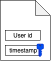

 

Alleen user X kan een timestamp sturen die versleuteld is met de hash van zijn password

 

\2.   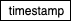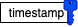AS ontvangt het bericht en leest welke User ID erin zit en neemt de sleutel van x erbij. Hiermee ontsleutelt hij        naar

\3.   De AS maakt 2 boodschappen en stuurt die naar X

 

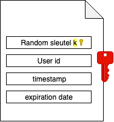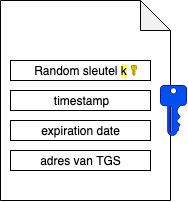

 

 

= ticket granting ticket

 

 

 

\4.   User x gebruikt de   sleutel om het eerste bericht te ontcijferen en   te krijgen. Doordat de timestamp dezelfde is als die die hij naar de AS heeft gestuurd, weet X dat enkel de AS met haar   -sleutel haar bericht in deel 1 kon lezen. X weet nu ook het adres van de TGS.

\5.   Gebruiker X maakt 2 nieuwe boodschappen

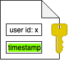

 

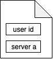         

 

 

 

à cleartext

 

 

En stuurt deze met de TGT naar de TGS 

\6.   De TGS neemt zijn   -sleutel en haalt uit TGT de sleutel   (k), die gebruikt hij om de User id: x en de timestamp te verkrijgen. De TGS vergelijkt de 2 ontsleutelde berichten. Enkel x zou die boodschappen kunnen gemaakt hebben nadat hij zich geauthenticeerd heeft bij een AS. De TGS gaat nu voldoen aan de vraag van X om toegang te krijgen tot A en haalt de   -sleutel van A op uit de AS.

 

**Oke nu heb ik geen zin meer kijk maar op toledo jongens** 

**Het is leuk geweest maar nu is het genoeg**

**Veel plezier met jullie examen**

# Les 10

## LDAP

LDAP = Lightweight Directory Access Protocol

 

### DIT 

·   Een directory is informatie die op een hiërarchische manier is opgeslagen. 

·   De hiërarchische boomstructuur die zo tot stand komt, wordt Directory Information Tree (DIT) genoemd. 

·   De top van de boom wordt de root, base of suffix genoemd.

 

### Entry

·   In een LDAP systeem wordt data opgeslagen in entries. 

·   Een entry is een instantie van 1 of meerdere objectklassen.

 

### Objectklasse

·   Een entry bevat attributen waar waarden aan toegekend kunnen worden. 

·   De objectklasse definieert welke attributen een entry kan bevatten. 

·   De attributen omvatten de “echte” data van de directory.

 

### Attributen

·   Elk attribuut wordt gedefiniëerd in een type.

·    De syntax specifieert wat voor waarde(n) aan het attribuut kunnen worden toegekend. 

o  cijfercode, nl. de OID (Object Identifier) 

o  cijfercode staat voor een bepaald datatype 

o  waarde tussen de accolades = maximum length van de string

 

attributetype ( 0.9.2342.19200300.100.1.52 
 NAME 'subtreeMaximumQuality' 
 DESC 'RFC1274: Subtree Maximun Quality' 
 SYNTAX 1.3.6.1.4.1.1466.115.121.1.13 SINGLE-VALUE )

 

attributetype ( 0.9.2342.19200300.100.1.48 
 NAME 'buildingName' 
 DESC 'RFC1274: name of building' 
 EQUALITY caseIgnoreMatch 
 SUBSTR caseIgnoreSubstringsMatch 
 SYNTAX 1.3.6.1.4.1.1466.115.121.1.15{256} )

 

·   Entries worden geordend in een boomstructuur (Directory Information Tree) a.d.h.v. hun Distinguished Name of DN. 

·   DN’s worden opgebouwd door een opeenvolging van relative distinguished names of RDN’s. 

·   Elke RDN in een DN komt overeen met een tak in de DIT. 

 

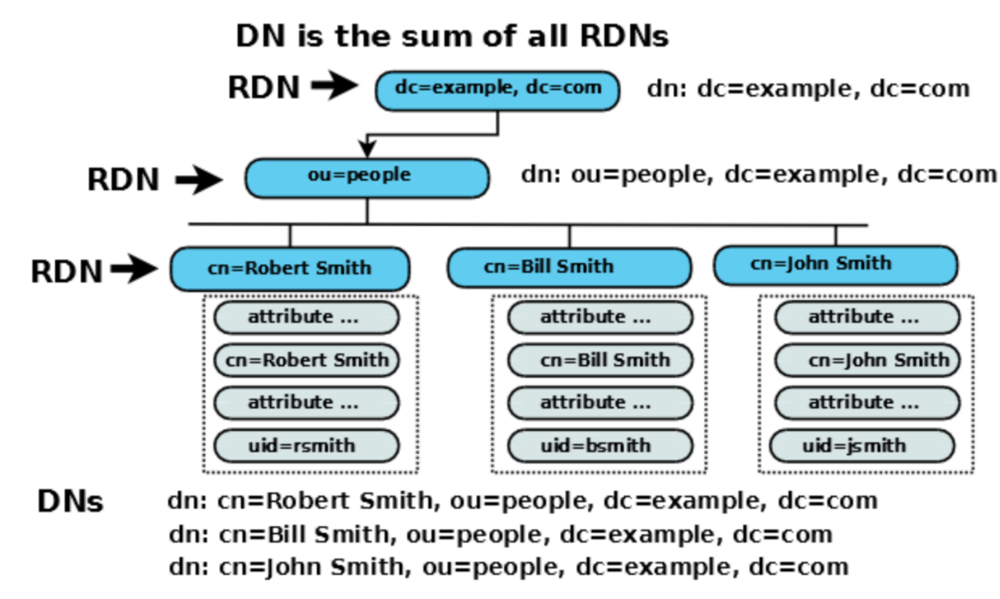

 

 

 

 

 

 

 

 

 

 

 

 

 

### Objectklasse

·   Een entry bevat attributen waar waarden aan toegekend kunnen worden. 

·   Een entry is een instantie van 1 of meerdere objectklassen. 

·   De objectklasse definieert welke attributen een entry kan bevatten. 

o  NAME 

o  Type 

o  MUST|MAY

objectclass ( 1.3.6.1.1.1.2.4 
 NAME 'ipProtocol' 
 DESC 'Abstraction of an IP protocol' 
 SUP top STRUCTURAL 
 MUST ( cn $ ipProtocolNumber $ description ) 
 MAY description )

 

 

### objectklastypes

·   **structural**: omvat attributen en enkel op basis van deze objectklasse kan er een entry gevormd in de DIT. 

·   **auxilliary**: omvat attributen en mag in combinatie met structural objectklasse gebruikt worden. 

·   abstract: omvat geen attributen maar beëindigt gewoonweg een boom of hiërarchie. 

 

Alle entries moeten één enkele structural objectklasse “hebben” en mogen nul of meerdere auxilliary objectklassen “hebben”

 

 

 

### Overerving

·   objectklasse kunnen overerven 

o  De objectklassen maken zodoende deel uit van een “hiërarchie” (child/parent objectklasse), waarbij een child objectklasse alle karakteristieken overerft van zijn parent objectklasse (alsook de bijhorende attributen) 

·   attributtype kunnen overerven 

o  De syntax van het parent attribuut wordt voor dit attribuut overgenomen 

·   SUP = superior of arent, erft daarvan over

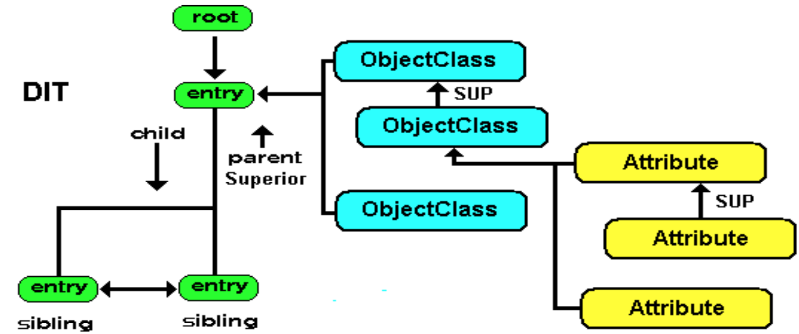

 

### Schema

= De bestanden die de objectklassen en attributen vastleggen.

 

### LDIF

= LDAP Data Interchange Format

·   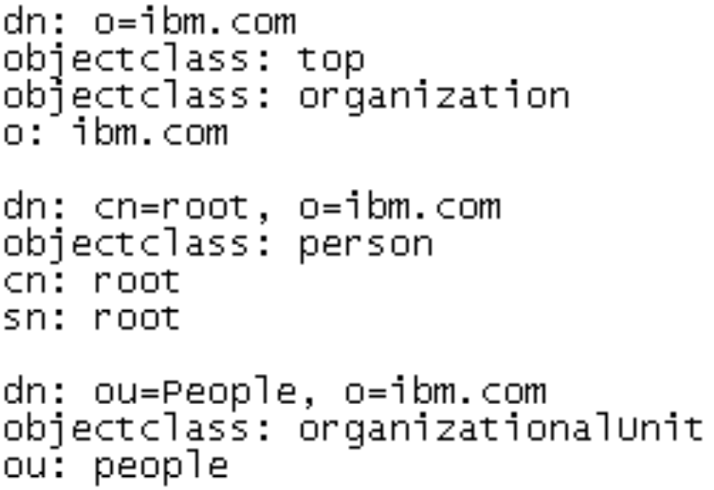bestands”formaat” dat gebruikt wordt om een LDAPDirectory aan te maken en/of aan te passen.

 

 

### Namespace and rootdn

Volgende twee objecten vormen de basis (moeten er altijd zijn) van de LDAP DIT: 

·   Namespace entry: bepaalt de basis van je LDAP DIT

·   rootdn: beheerder van de DIT

 

### Configuratie

·   Installeer OpenBSD 6.6 

o  Installatie geen X-onderdelen: -x* 

o  Allow ssh-server root login § Heeft default LDAP-server 

o  Voorbeeld config in /etc/examples 

o  cp /etc/examples/ldapd.conf /etc 

§ man ldapd.conf

·   Linux 

o  apt install ldap-utils 

o  ldapsearch –W –D “cn=admin,dc=cosci,dc=be” –H ldap://{IPadres-server} ”dn” 

§ Geen entries? 

§ Foutje ?! => andere tool eens proberen “phpldapadmin” => docker

 

 

 

 

 

 

 

### DIT-basis entries aanmaken

·   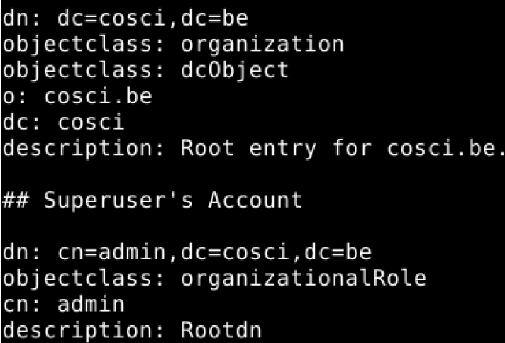LDIF: 

 

 

 

 

 

 

 

 

·   Ldapadd –W –D ….-H –f file.ldif 

·   Test: phpldapadmin ?! 

·   Verwijder de volledige LDAP tree 

o  ldapdelete –rW –H ldap://server-IP -D "cn=admin,dc=cosci,dc=be" "dc=cosci,dc=be” 

o  rcctl –f restart ldapd 

o  rcctl –f stop ldapd 

o  ldapd –nf /etc/ldapd.conf

 

### Admin password

·   salted SHA: 

o  USER_PASSWRD="passphrase” 

o  RND_SALT=$(openssl rand -base64 6) PASHASH=$(echo -n "$USER_PASSWRD$RND_SALT" | openssl dgst -sha1 -binary | openssl enc -base64 -A) 

o  LDAP_PASHASH=$({ echo -n "$PASHASH" | openssl base64 -d -A; echo -n "$RND_SALT"; } | openssl enc -base64 -A | awk '{print "{SSHA}"$0}’)

o  echo "$LDAP_PASHASH"

 

### 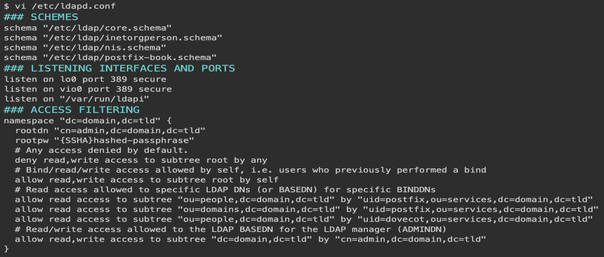Voorbeeld ldapd.conf

 

 

### Oefening

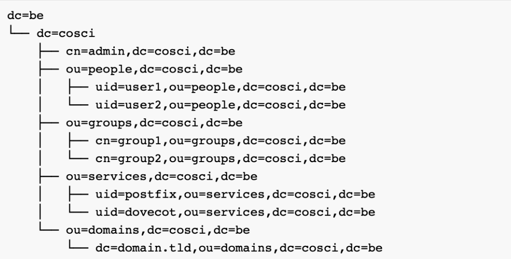

 

 

 

 

 

 

 

 

 

 

 

 

 

### Referenties

·   https://www.rohlix.eu/~matej/post/openbsd-ldap-user-management/

·   https://www.digitalocean.com/community/tutorials/understanding-the-ldap-protocol-data-hierarchy-and-entry-components

·   https://www.my-tiny.net/M20-x500.htm

 

# Labo’s

## Active Directory

### Diagrammen

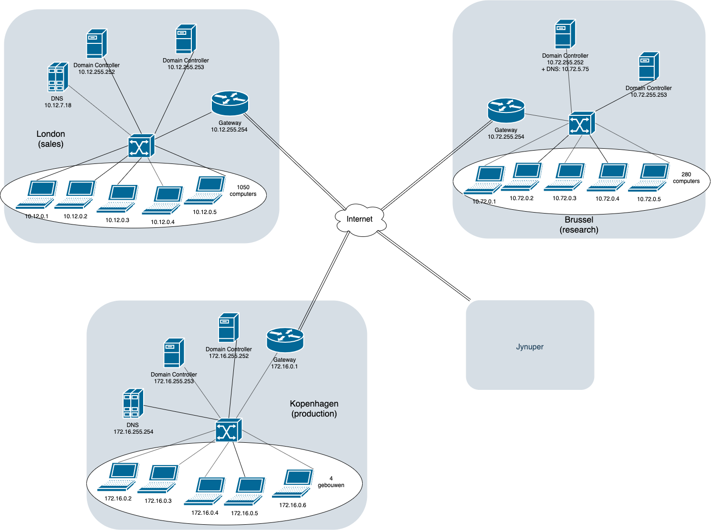

 

 

 

 

 

 

 

 

 

 

 

 

 

 

 

 

 

 

 

 

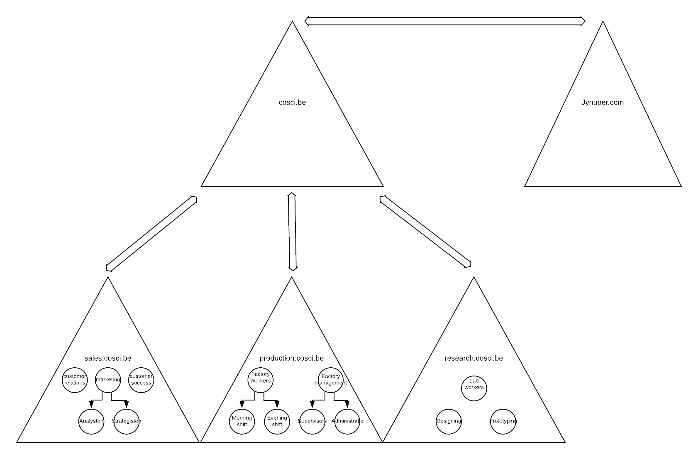

 

### Windows domein

Een Windows Domain is een logisch netwerk, waarin alle user-accounts, computers, printers, netwerkschijven, ... geregistreerd zijn op 1 centrale server, de Domain Controller. Doordat alles centraal geregistreerd is kunnen we het ook centraal beheren. Dit geeft ons een heleboel mogelijkheden:

 

\1. Gecentraliseerd User-beheer: Alle gebruikersaccounts worden bijgehouden op de server, niet op de client PC's 

\2. We kunnen op de server bepalen welke users aan welke resources (printers, netwerkshares) kunnen. 

\3. Gemakkelijk te schalen wanneer het netwerk groter wordt.

 

### Trees en forests

**Waarom trees?**

Als je een zeer grote organisaties hebt, trafiek verminderen naar de root, ...

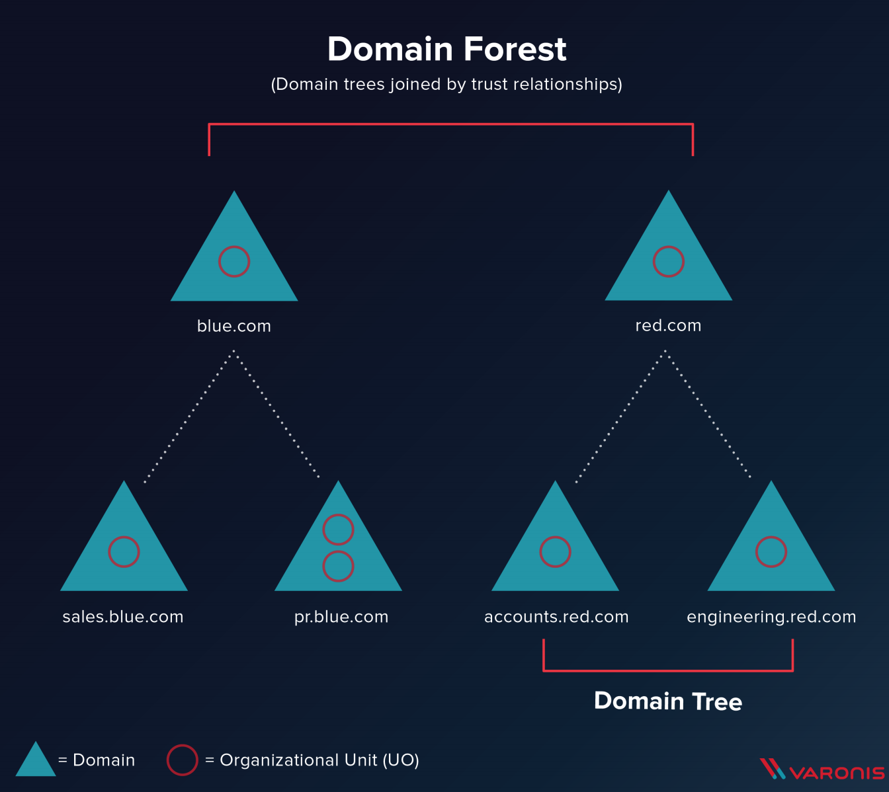

 

 

 

 

 

 

 

 

 

 

 

 

 

 

 

 

 

 

 

 

 

Tree = domein met subdomeinen

Verbinding tussen 2 trees = trust

à maakt samen een forest

**Waarom forests?**

Zo gaan gebruikers van blue.com zich zelfs in de gebouwen van red.com kunnen aanmelden op de PC's.

 

### Organizational units & groups

 

·   Organizational units

o  Reflecteren structuur van de organizatie

o  Van groot naar specifieker (omgekeerde hierarchie)

o  Erven rechten en configuratie van parent

o  Gebruikt voor group policies 

o  Gebruiker kan maar in 1 OU zitten

·   Groepen

o  Minder hierarchisch

o  Gebruiker kan in meerdere groepen zitten

o  Groepen kunnen lid zijn van andere groepen

o  Bijv voor gedeelde mailboxen of printers

 

 

 

## Powershell

 

### 1 user aanmaken

 

 

 

### 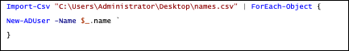Users aanmaken met csv

 

 

 

 

 

### User password resetten

 

 

 

 

 

## Docker

### Dockerfile

**FROM** openjdk:11
 **WORKDIR** / 
 **ADD** file.jar file.jar
 **cmd** ["java", "-jar", "file.jar"]
 **EXPOSE** 8080

 

**FROM** nginx
 **COPY** index.html /usr/share/nginx/html/

 

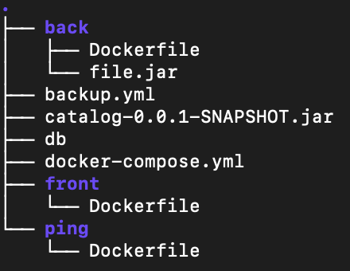taak

### Docker-compose

Ook van taak

version: "3.3"
 services:
  pdb:
   image: mysql:5.7
   hostname: pdb
   environment:
    \- MYSQL_ROOT_PASSWORD=pdb
    \- MYSQL_USER=pdb
    \- MYSQL_PASSWORD=pdbpass
    \- MYSQL_DATABASE=pdb
   restart: always
  back:
   image: martijntrein/back
   depends_on:
    \- pdb
   ports:
    \- "8000:8080"
   restart: on-failure
   environment:
    \- MYSQL_HOST=pdb
  front:
   image: coscicorp/catalog_frontend
   ports:
    \- "80:3000"
   depends_on:
    \- pdb

 

## PXE-boot

= boot image van een pc laden via het netwerk (hij krijgt die van de PXE-server)

 

## Docker swarm

Een Docker Swarm is een groep fysieke of virtuele machines die de Docker-applicatie draaien en die zijn geconfigureerd om samen te smelten tot een cluster. Als een groep machines eenmaal is geclusterd, kunt u nog steeds de Docker-commando's uitvoeren die u gewend bent, maar ze worden nu uitgevoerd door de machines in uw cluster. De activiteiten van het cluster worden aangestuurd door een ‘swarm manager’ en machines die zich bij het cluster hebben aangesloten worden ‘nodes’ genoemd.

 

 

# Examenvragen

·   *Wat is een schema bij LDAP?*

Het schema zijn de bestanden die de objectklassen en attributen vastleggen.

 

·   *Verklaar volgende LDAP schema: ...*

·   *Maak een PowerShell script dat …*

·   *Maak een Dockerfile voor …*

 

·   *Waarvoor wordt SAMBA gebruikt?* 

Met Samba is het mogelijk om bestanden (en printers) op je Linux server te delen met MS Windows computers. File sharing dus.