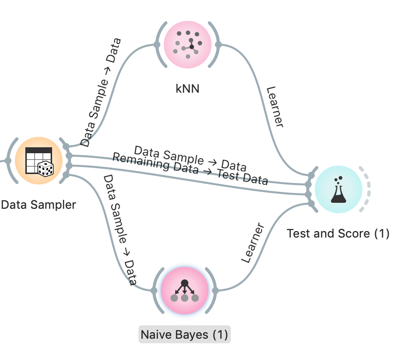

## 1. True or False: If a witness says that he saw a red car, the police should search for a red car.

Er zijn heel veel groene auto's en de kans dat de getuige het fout heeft op een groene auto is 30%. Meer hoef ik niet te zeggen denk ik.


## 2. Based on the Titanic dataset, how many different combinations can you make with the 4 variables?

- yes/no
- first/second/third/crew
- Adult/child
- Male/female

hoeveel dan?

komt goed, gewoon vermenigvuldigen

## 3. Which combinations are not present in the dataset?

Vanuit je "file / data table " een "select rows" aanmaken, hierin de combinatie inzetten die je wilt (child, crew, male, survived) , dan een data table connecten en je ziet de output.


```
All of the above
```

## 4. Can you explain why these categories might not be present?


Can you?

Kunnen kinderen crewleden zijn denk je?

## 5. What is the classification accuracy of the Naive Bayes learner on the training set?

zelfde als vorig labo, alleen zet ge er naive bayes op

## 6. What is the classification accuracy of the Naive Bayes learner on the test set?

nou

## 7. What is the probability of survival for a male adult in first class?

ik heb dit gedaan:


Je moet dus de select rows widget gebruiken, daarna kan je die shizzle in een boxplot gooien en de kans berekenen.


# 8. What would the hypothetical probability of surviving be for a female child crew member?

Maak een excel file aan:


Maak dan een prediction met naive bayes als classifier (met de excel file als data)

NOTE: als je de widget Nomogram gebruikt hoef je geen Excel file aan te maken, daar kan je zelf selecteren wat nodig is.

## 9. Comparing the Naive Bayes learner to the KNN with k=100, which model would you choose and why?



Vergelijk nu de uitkomsten van test and score.


False

32

All of the above

Crew members cannot be children. That seems pretty logical. Children also get rescued first, especially the children in the upper classes. So it's possible that all children from the first and second class survived.

0.771

0.789

0.32571428571

0.80 // fout

Laatste

