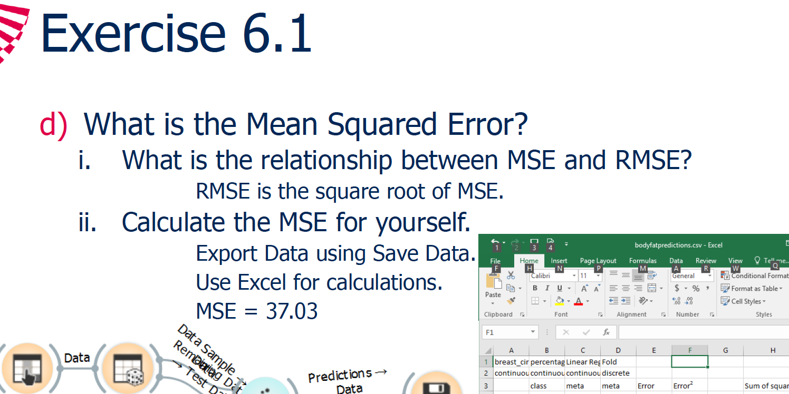
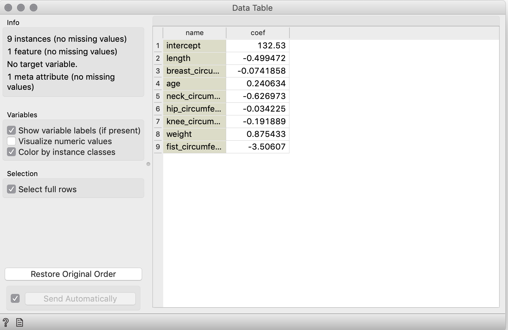

# Linear regression 

~~Veel~~ Enkele antwoorden van dit labo vind je in *05_4_Linear_regression.pdf* op het projektwerk ding van BA minor.

Ik heb ook de meeste antwoorden van dit labo fout. Aarzel niet om te zeggen waar het misloopt.

Edit: Aimee heeft het met de hand verbeterd en me 6.75/9 gegeven. Dus eigenlijk valt het best mee.

## 1. What is the simple linear regression equation, with breast circumference as the predictive variable and fat percentage as the target variable? (in the form y = b0 + b1x1)


bedankt lieve lectoren

*oke toledo heeft het wel fout gerekend*


## 2. What is the Root Mean Squared Error?


Nogmaals bedankt

## 3. What is the relationship between Root Mean Squared Error and Mean Squared Error?



Dankjewel

## 4. Build a Multiple Linear Regression model using all the variables. What is the intercept?

Frick :rage: , de pdf eindigde bij het vorige. Moet ik nu echt zelf nadenken?

Oke, in oefening 1 gebruikten ze maar 2 kolommen, selecteer ze nu gewoon allemaal in je *select columns* widget. Als je dan de workflow van oefening 1 na hebt gemaakt moet het wel lukken.

Dit kreeg ik:



Dit zou je ook normaal moeten helpen met de volgende 8 vragen.


## 13. What is the RSME for the multiple linear regression using all variables?

Ik verondestel dat ze RMSE bedoelt. (ik hoop dat ik niet iets heb gemist en er ook een RSME bestaat...)

Hier moet je denk ik het python script gebruiken dat ze in de slides tonen. Effe opzoeken...


Bedankt Thomas. Als iemand weet wie Thomas is en hem kan contacteren geef ik jou en Thomas een MartiPoint :moneybag:

Vergeet niet te restarten als je de addon hebt geïnstalleerd.


:rage: je hebt het script toch niet nodig zo te zien.


Doe gewoon dit, maar dan met alle culumns geselecteerd.


## 14. Which coefficients do you keep in your model after removing those with highest p-values?

Okeeej hier moeten we het python script gebruiken.


Thomas ftw

Anders geeft die een error voor de missing values.

```
Running script:
(ContinuousVariable(name='age', number_of_decimals=0), ContinuousVariable(name='neck_circumference', number_of_decimals=1), ContinuousVariable(name='breast_circumference', number_of_decimals=1), ContinuousVariable(name='hip_circumference', number_of_decimals=1), ContinuousVariable(name='knee_circumfernce', number_of_decimals=1), ContinuousVariable(name='fist_circumference', number_of_decimals=1), ContinuousVariable(name='weight', number_of_decimals=1), ContinuousVariable(name='length', number_of_decimals=1))
percentage_fat
[20.4 12.4 22.2 30.7 26.7 11.5  6.6  8.6  7.1 19.3 22.1 24.5  6.  30.4
 12.9 14.8 25.5 29.  27.3  3.7 29.3 19.1 20.1 24.3 29.9  5.6 28.   7.8
  5.7 14.7 28.7 32.3 23.3 14.6  7.9 21.3 16.5 17.7  9.9  9.4 27.9 17.8
 19.7 23.6 15.9 22.9 22.   8.8 25.3 34.5 24.4 12.5 13.6 25.3 18.3  6.3
 15.  31.2 16.5  9.4 18.6 10.  18.1 14.9 17.4 19.2 11.  28.  12.1 24.8
 18.5 25.2 13.9 22.2 29.9 27.  11.9 20.8 26.8  8.3 19.2 31.5 20.4 10.1
 18.7 13.8 23.6 27.2 19.5 25.2 11.8 21.2 24.2  8.8  7.7 12.4 17.7 17.4
  3.  22.3  6.3 11.3 10.3 12.2 21.5 32.  16.7 26.7 31.4  5.3 22.9 32.6
 22.5 35.  22.4  6.1 10.4 18.8 13.6 20.1 14.9 16.1 26.6  8.5 23.1 26.
 20.3 21.2 28.4 25.8 21.8  9.4 20.8 30.2  3.7 21.  20.9 13.8 21.3 14.2
 16.9 24.9 32.3 29.4 18.1 14.9 15.2  8.5 10.9 21.5]
                            OLS Regression Results                            
==============================================================================
Dep. Variable:                      y   R-squared:                       0.666
Model:                            OLS   Adj. R-squared:                  0.646
Method:                 Least Squares   F-statistic:                     34.34
Date:                Fri, 08 May 2020   Prob (F-statistic):           2.66e-29
Time:                        22:35:53   Log-Likelihood:                -430.36
No. Observations:                 147   AIC:                             878.7
Df Residuals:                     138   BIC:                             905.6
Df Model:                           8                                         
Covariance Type:            nonrobust                                         
==============================================================================
                 coef    std err          t      P>|t|      [0.025      0.975]
------------------------------------------------------------------------------
const        132.0822     34.496      3.829      0.000      63.873     200.292
x1             0.2446      0.037      6.664      0.000       0.172       0.317
x2            -0.6378      0.361     -1.765      0.080      -1.352       0.077
x3            -0.0641      0.164     -0.391      0.696      -0.388       0.260
x4            -0.0191      0.196     -0.097      0.923      -0.407       0.369
x5            -0.2843      0.331     -0.860      0.392      -0.938       0.370
x6            -3.5790      0.747     -4.791      0.000      -5.056      -2.102
x7             0.8799      0.202      4.352      0.000       0.480       1.280
x8            -0.4842      0.102     -4.767      0.000      -0.685      -0.283
==============================================================================
Omnibus:                        1.120   Durbin-Watson:                   1.997
Prob(Omnibus):                  0.571   Jarque-Bera (JB):                1.162
Skew:                           0.124   Prob(JB):                        0.559
Kurtosis:                       2.642   Cond. No.                     2.28e+04
==============================================================================

Warnings:
[1] Standard Errors assume that the covariance matrix of the errors is correctly specified.
[2] The condition number is large, 2.28e+04. This might indicate that there are
strong multicollinearity or other numerical problems.
```

x1 = age, P>|t| 0.000 

x2 = neck_circumference P>|t| 0.080 

x3 = breast_circumference P>|t| 0.696

x4 = hip_circumference P>|t|  0.923  

x5 = knee_circumfernce P>|t| 0.392

x6 = fist_circumference P>|t| 0.000

x7 = weight P>|t| 0.000

x8 = Length P>|t| 0.000

*klopt dit?*

We zullen alles groter dan 0 dan maar yeeten voor deze vraag.


## 15. What is the RMSE of the resulting multiple linear regression?


*Vorige vraag*

## 16. True or False: Fat percentage appears to follow a normal distribution.

Ik weet dat het true is. Ik weet niet waarom. Help. Me.


