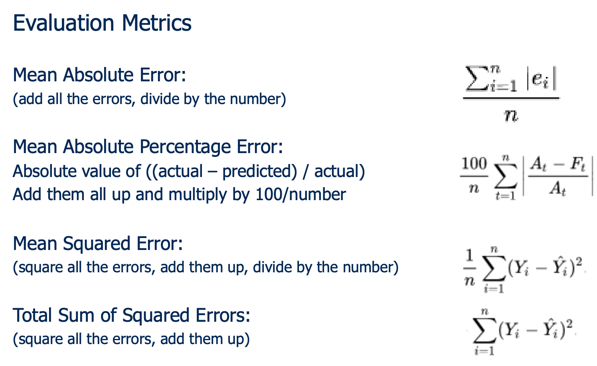

# Business Analytics Minor

[toc]

Nog even een korte intro.

[Ba minor anthem](https://youtu.be/_p6hDcPhhqo)

> :warning: In plaats van mij berichten te sturen als je een fout vindt of een verbetering wilt aanbrengen, kan je op github gewoon rechts boven op dit document op het potloodje drukken en het document bewerken. Druk op **create pull request** en ik krijg automatisch van github een bericht om de verandering goed te keuren. Ez martipoints.

Ik ga hier dus proberen om per les de besproken onderwerpen wat te verklaren.

## Week 1 - Intro

We hebben in deze tijden heel veel data. Met business analytics/data mining proberen we iets te doen met die data. Data mining is niet hetzelfde als statistiek. Bij statistiek heb je eerst een hypothese enzo, maar in data mining heb je dat niet. Je gaat data analyseren en er patronen in vinden. Je moet ook oppassen dat je geen nuttloze patronen in data gaat zitten zoeken. 

**Instance base learning**

Google zegt dit:

> In machine **learning**, **instance**-**based learning** (sometimes called memory-**based learning**) is a family of **learning** algorithms that, instead of performing explicit generalization, compares new problem **instances** with **instances** seen in training, which have been stored in memory.

Nog effe 1 afbeelding en dan zijn we klaar met deze les.

## Week 2 - Data Exploration

Man, dit zijn gewoon slides van KU Leuven. De fak. 

**What Should You Look For?**

Good to look at simple statistics of 

* Number of variables 
* Size of data 
* Missing values 
* Skew

**For each attribute, look at:** 

* Discrete: number of possible values, are they ordered, frequency of each value, etc. 
* Numeric: mean, min, max, etc.

**Waarom schrijf ik dit zelfs op:**

Mean: het gemiddelde

Mode: het meestvoorkomende

Median: het midden

Variance: kwadraat van de standaardafwijking

Quartile (mediaan van elke helft): Sort X 

​	Q1: Value at position 0.25n

​	Q3: Value at position 0.75n 

​	IQR: Q3 – Q1

## Week 3 - KNN

KNN classification = K Nearest-neighbor classification 

**KNN** zoekt voor een instantie in je die je wilt classificeren de dichtstbijzijnde instanties in een oefenset. Als k = 1, neemt hij alleen de dichtstbijzijnde. Als k = 2, neemt hij de 2 dichtstbijzijndsten, etc. Dan kijk je naar de classificatie van deze instanties en kan je de klasse van de instantie die je wilt classificeren afleiden.

Je hebt ook **Distance-weighted nearest neighbor** dat is KNN, maar hoe verder de gerelateerde instanties zich bevinden van de instantie waarvan je de klasse wilt bepalen, hoe minder ze doorwegen op het uiteindelijke resultaat.

Veel meer is er niet aan. De wiskunde erachter moeten we toch niet kennen.

Nog wat referentiemateriaal;

**Strengths of instance-based learning** 

* simple to implement 
* “training” is very efficient 
* adapts well to on-line learning 
* robust to noisy training data (when k > 1) 
* often works well in practice 

**Limitations of instance-based learning** 

* sensitive to range of feature values 
* sensitive to irrelevant and correlated features, although… 
* there are variants that learn weights for different features 
* later we’ll talk about feature selection methods 
* classification can be inefficient, although edited methods and k-d trees can help alleviate this weakness 
* doesn’t provide much insight into problem domain because there is no explicit model 

## Week 4 - Naive Bayes

Bayes' theorem
$$
P(A|B) = \frac{P(A) P(B|A)} {P(B)}
$$
Als je dollartekens rond wiskunde zet, ziet de wiskunde er cool uit.

Naive Bayes is naief omdat er verondersteld wordt dat de voorspellende variabelen onafhankelijk zijn. Wat niet altijd het geval is. Als je hebt opgelet bij statistiek, weet je ook dat de bovenstaande formule alleen geldt als A en B elkaar niet beïnvloeden. In de echte wereld zijn twee gebeurtenissen echter vaak (gedeeltelijk) afhankelijk van elkaar, maar we zullen maar veronderstellen dat dit niet zo is.

Voorbeeld ([bron]([https://www.analyticsvidhya.com/blog/2017/09/naive-bayes-explained/#:~:text=What%20is%20Naive%20Bayes%20algorithm%3F,presence%20of%20any%20other%20feature.](https://www.analyticsvidhya.com/blog/2017/09/naive-bayes-explained/#:~:text=What is Naive Bayes algorithm%3F,presence of any other feature.))):

> For example, a fruit may be considered to be an apple if it is red, round, and about 3 inches in diameter. Even if these features depend on each other or upon the existence of the other features, all of these properties independently contribute to the probability that this fruit is an apple and that is why it is known as ‘Naive’.

Naive Bayes is efficiënt bij grote datasets. Juist dankzij deze veronderstelling.

## Week 5 - Regression

### Simple Linear Regression

We gaan op basis van een voorspellende variabele `X`, de waarde van een continue variabele `Y` proberen te voorspellen. We trekken dus een lijn die kleinst gemiddelde afstand heeft van elke waarde. Als je nu `X = 30` neemt op de foto, zie je op de foto dat `Y` ongeveer gelijk zal zijn aan 10.

### Multiple Linear Legression

Als je op multiple linear regression zoekt op google images, vind je een foto van de slides die Bertels gebruikt.

Hetzelfde als het vorige, maar er zijn meerdere variabelen (**predictor variables**) die bijdragen tot het model om de **target variable** te proberen te voorspellen.

Als je te veel variabelen hebt, kan het dat je doet aan **overfitting**. Je moet dus maar een deel van de voorspellende variabelen gebruiken. Namelijk het deel dat 

**Methods to choose the best subset of predictor variables**

* first: reduce number of predictor variables by means of domain knowledge 
* then: use algorithms 
  * ’Exhaustive search’: try all predictor variables subsets 
  * ’Forward selection’: start with 1 predictor variable, add each time the most significant one 
  * ’Backward selection’: start with all predictor variables, remove each time the least significant one 

### Errors

:warning: Rule of thumb: number of observations n in training data equals at least 5(p+2)

## Week 6 - Evaluation

### Confusion matrix:

Accuracy:
$$
\frac {True Positive + True Negative} {Total}
$$
Precision/Positive Predictive Value:
$$
\frac {True Positive} {All Positive Predictions}
$$
Recall/Sensitivity/True Positive Rate:
$$
\frac {True Positive} {All Actual Positives}
$$

Specificity/True Negative Rate:
$$
\frac {True Negative} {All Actual Negatives}
$$

### **Cross Validation**

**K-Fold:**

 	Split data into training and test sets

 	Split training set into k subsets

 	Leave one subset for validation and train on all other sets

​	 Repeat k times, always using a different validation set

 	Choose the best model

 	Evaluate “best” model on original test set

**Leave One Out:**

 	k = number of instances

 	Leave one instance for validation and train on remaining training set

​	 Repeat for all instances

## Week 7 - Association rule

Stel je voor, je bent in een eigenaar van een winkel. Je merkt dat mensen vaak bier een nootjes tesamen kopen. Je wilt weten of er nog producten zijn die mensen vaak tegelijk kopen, zodat je misschien een promotie kan doen, of de prijs van een bepaald product verhogen. 

Ik zal ook een paar woordjes verklaren:

**Support count**: neem een set van spulletjes `I`. De support count van `I` is het aantal transacties dat exact deze set bevat. Bijvoorbeeld: support count `{appel, bier}` = 3

**Support**: 

