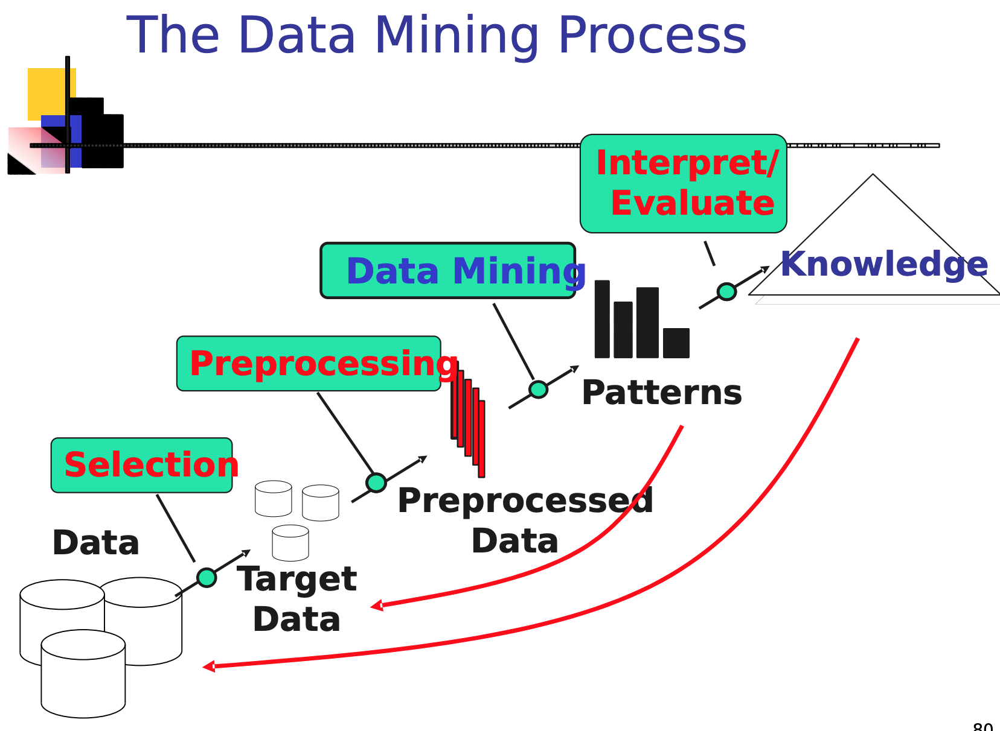

# Business Analytics Minor

Nog even een korte intro.

[Ba minor anthem](https://youtu.be/_p6hDcPhhqo)

> :warning: In plaats van mij berichten te sturen als je een fout vindt of een verbetering wilt aanbrengen, kan je op github gewoon rechts boven op dit document op het potloodje drukken en het document bewerken. Druk op **create pull request** en ik krijg automatisch van github een bericht om de verandering goed te keuren. Ez martipoints.

Ik ga hier dus proberen om per les de besproken onderwerpen wat te verklaren.

# Week 1 - Intro

We hebben in deze tijden heel veel data. Met business analytics/data mining proberen we iets te doen met die data. Data mining is niet hetzelfde als statistiek. Bij statistiek heb je eerst een hypothese enzo, maar in data mining heb je dat niet. Je gaat data analyseren en er patronen in vinden. Je moet ook oppassen dat je geen nuttloze patronen in data gaat zitten zoeken. 

**What Should You Look For?**

Good to look at simple statistics of 

* Number of variables 
* Size of data 
* Missing values 
* Skew

**For each attribute, look at:** 

* Discrete: number of possible values, are they ordered, frequency of each value, etc. 
* Numeric: mean, min, max, etc.

**Instance base learning**

> In machine **learning**, **instance**-**based learning** (sometimes called memory-**based learning**) is a family of **learning** algorithms that, instead of performing explicit generalization, compares new problem **instances** with **instances** seen in training, which have been stored in memory.

Nog effe 1 afbeelding en dan zijn we klaar met deze les.

