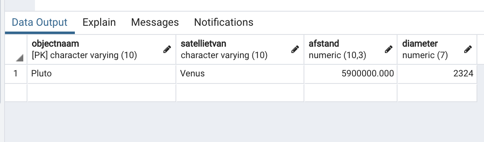

# CTEs oefeningen

Ya boii is back met nieuwe guides voor databanken. Yee Haw :horse: :cowboy_hat_face:

Dit labo van Bertels is wel een beetje wazig. Veel succes...

## Korte uitleg

Een CTE is een *Common table expression*. Met een CTE kan een tijdelijke resultaatset met een naam worden gedefinieerd die tijdelijk beschikbaar is in het kader van de uitvoering van een statement zoals `SELECT`, `INSERT`, `UPDATE`, `DELETE` of `MERGE`.

**Syntax**:

```sql
WITH cte_name (column_list) AS (
    CTE_query_definition
)
statement;
```

**Voorbeeld**:

```sql
WITH cte_film AS (
    SELECT
        film_id,
        title,
        (CASE
            WHEN length < 30 THEN 'Short'
            WHEN length < 90 THEN 'Medium'
            ELSE 'Long'
        END) length
    FROM
        film
)
SELECT
    film_id,
    title,
    length
FROM
    cte_film
WHERE
    length = 'Long'
ORDER BY
    title;
```


## 1. Kijk naar de structuur van de tabel hemelobjecten in het schema public en naar dezelfde tabel in het schema ruimtereizen. Wat merk je op?

**Public.hemelobjecten**:

```sql
-- Table: public.hemelobjecten

-- DROP TABLE public.hemelobjecten;

CREATE TABLE public.hemelobjecten
(
    objectnaam character varying(10) COLLATE pg_catalog."default" NOT NULL,
    satellietvan character varying(10) COLLATE pg_catalog."default",
    afstand numeric(10,3),
    diameter numeric(7,0),
    CONSTRAINT hemelobjecten_pkey PRIMARY KEY (objectnaam)
)

TABLESPACE pg_default;

ALTER TABLE public.hemelobjecten
    OWNER to u0082489;

GRANT SELECT ON TABLE public.hemelobjecten TO student;

GRANT ALL ON TABLE public.hemelobjecten TO u0082489;
```

**Ruimtereizen.hemelobjecten**:

```sql
-- Table: ruimtereizen.hemelobjecten

-- DROP TABLE ruimtereizen.hemelobjecten;

CREATE TABLE ruimtereizen.hemelobjecten
(
    objectnaam character varying(10) COLLATE pg_catalog."default" NOT NULL,
    satellietvan character varying(10) COLLATE pg_catalog."default",
    afstand numeric(10,3),
    diameter numeric(7,0),
    CONSTRAINT hemelobjecten_pkey PRIMARY KEY (objectnaam),
    CONSTRAINT hemelobjecten_satellietvan_fkey FOREIGN KEY (satellietvan)
        REFERENCES ruimtereizen.hemelobjecten (objectnaam) MATCH SIMPLE
        ON UPDATE NO ACTION
        ON DELETE NO ACTION
)

TABLESPACE pg_default;

ALTER TABLE ruimtereizen.hemelobjecten
    OWNER to wim;

GRANT SELECT ON TABLE ruimtereizen.hemelobjecten TO lector;

GRANT SELECT ON TABLE ruimtereizen.hemelobjecten TO student;

GRANT ALL ON TABLE ruimtereizen.hemelobjecten TO wim;
```

Wat merk je op?

## 2. Geef de gepaste code waarmee je de tabel hemelobjecten in ruimtereizen 'beter' kan maken.

In *08_1_CTEs_lus_controle.pdf* in de repo zie je voorbeeldcode.

Misschien wilt hij dat je iets schrijft dat als je een planeet verwijdert, dat ook zijn satellieten verwijderd worden?

Wat ook kan is dat hij wilt dat je ervoor zorgt dat hemelobjecten geen lussen kunnen vormen. Bijvoorbeeld `zon.satellietvan = zon`. Dan heb je grote hayek.

In de volgende vraag zegt onze lieve Bertels ook dat er 2 manieren zijn om dit te doen.

In de slides staat dit:

```sql
/*Optie 1, teller voor de maximum diepte*/
WITH RECURSIVE kind_van(bijnaam, vader, moeder, diepte) AS (
SELECT bijnaam, vader, moeder, 1
FROM familieboom
WHERE vader = 'vader'
 UNION ALL
SELECT f.bijnaam, f.vader, f.moeder, diepte + 1
FROM familieboom f, kind_van k
WHERE f.vader = k.bijnaam
AND k.diepte<7
)
SELECT *
FROM kind_van;
-- deze stop dus als diepte 7 is bereikt
```


```sql
/*Optie 2, lussen dedecteren*/
/*lus tabel maken*/
DROP TABLE IF EXISTS familieboom;
CREATE TABLE familieboom(
bijnaam varchar(16) NOT NULL,
vader varchar(16),
moeder varchar(16)
);
INSERT INTO familieboom VALUES ('kindje','vader','moeder');
INSERT INTO familieboom VALUES ('vader','kindje','moeder');

/*Variabele met het pad bijhouden*/
WITH RECURSIVE kind_van(bijnaam, vader, moeder, pad, lus) AS (
 SELECT bijnaam, vader, moeder, ARRAY[vader] as pad, false
 FROM familieboom
 WHERE vader = 'vader'
 UNION ALL
 SELECT f.bijnaam, f.vader, f.moeder,
 CAST(k.pad || ARRAY[f.vader] as varchar(16)[]) as pad,
 f.vader = ANY(pad)
 FROM familieboom f, kind_van k
 WHERE f.vader = k.bijnaam
 AND NOT lus
)
SELECT *
FROM kind_van;

-- deze geeft aan of er een lus is of niet en geeft het pad
```


Pas de code misschien een beetje aan ofzo.


## 3. Er zijn twee (of meer..) manieren om deze tabel 'beter' te maken, met hetzelfde eindresultaat. Welke van deze twee manieren zou jij kiezen en waarom?

Welke kies je? Waarom?


## 4. We werken vanaf nu binnen het schema ruimtereizen_voor_iedereen. Je kan gebruik maken van transacties.

1. ***Voeg 1 rij toe aan een tabel naar keuze uit dit schema.***

   Ik kijk effe en wtf kom ik hier tegen

   

   Ik ben razend. Wie heeft dit gedaan???????

   Aah oke ik had effe ni door dat iedereen daar dingen in kan veranderen.

   

   hihihihihi let's go

   Syntax:

   ```sql
   INSERT INTO table(column1, column2, …)
   VALUES
   	(value1, value2, …);
   ```


2. ***Verander 1 rij in een tabel naar keuze uit dit schema.***


   Syntax:

   ```sql
   UPDATE table_name
   SET column1 = value1, column2 = value2...., columnN = valueN
   WHERE [condition];
   ```


3. ***Verwijder 1 rij uit een tabel naar keuze uit dit schema.***

   Syntax:

   ```
   DELETE FROM table
   WHERE condition;
   ```

   *Ik krijg een permission denied als ik iets probeer te verwijderen.*

   Als iemand weet hoe dit komt mag deze persoon dat zeker aan mij vertellen.

4. ***Schrijf een querie die alle satellieten van een zelf gekozen hemelobject toont. (bv de zon indien aanwezig in de tabel). Zorg ervoor dat de hele hierarchie wordt getoond. (cf CTEs)***

   > *Voorbeeld op het schema ruimtereizen, alle satellieten van de zon en dieper:*

   ```
   (order by 1,2)
   "Aarde";"Zon"
   "Adrastea";"Jupiter"
   ..
   "Venus";"Zon"
   (70 rijen)
   ```

   Kijk naar de queries van vraag 2, gebruik bij de 2de varchar(10). Anders werkt het niet.

5. ***Toon de boomstructuur voor elk hemelobject uit de vorige querie.***

   Zelfde als vorige vraag

6. ***Probeer een stapsgewijze query naar te keuze te 'ontvlooien' gebruik makend van een tijdelijke tabel waar je tussenresultaten naar toe schrijft. Maak hiervoor gebruik van CTEs.***

   Soms vraag ik me af wat er zich afspeelt in het hoofd van Mr. Bertels. Ik heb echt geen enkel idee wat deze vraag zou moeten betekenen. :ant:

7. ***Werk binnen een transactie die je bij voorkeur niet bestendigd maar ongedaan maakt.***


   1. ***Voer eerste de querie oplossing van oefening 4.4 of 4.5 uit.***

      Doe maar he, ik hou je niet tegen.

   2. ***Verwijder nu alle afhankelijke hemelobjecten (in het voorbeeld van deze tekst is dat de zon; dit is afhankelijk van jouw vorige queries, namelijk van het wortel-element dat je hebt gekozen) van het wortel-element uit de vorige querie. Doe dit in 1 statement.***

      Vraag 4.3

      > *Ik krijg een permission denied als ik iets probeer te verwijderen.*

   3. ***Begrijp je wat onderstaande code betekent?***

      ```
      CONSTRAINT bezoeken_objectnaam_fkey FOREIGN KEY (objectnaam) REFERENCES ruimtereizen.hemelobjecten (objectnaam) MATCH SIMPLE ON UPDATE NO ACTION ON DELETE NO ACTION
      ```

      https://stackoverflow.com/questions/12096790/why-to-use-foreign-keys-with-no-action-on-delete-or-update

   4. ***Voeg eventueel hemelobjecten toe die niet .. (vul aan)***

      vraag 4.7.2?

   5. ***Keer terug op je stappen of (niet)***

      of niet

8. ***Je kan zelf experimenteren zelf met het ruimtereizen of tennis script in probeer.***

   Interessante zinsconstructie.

