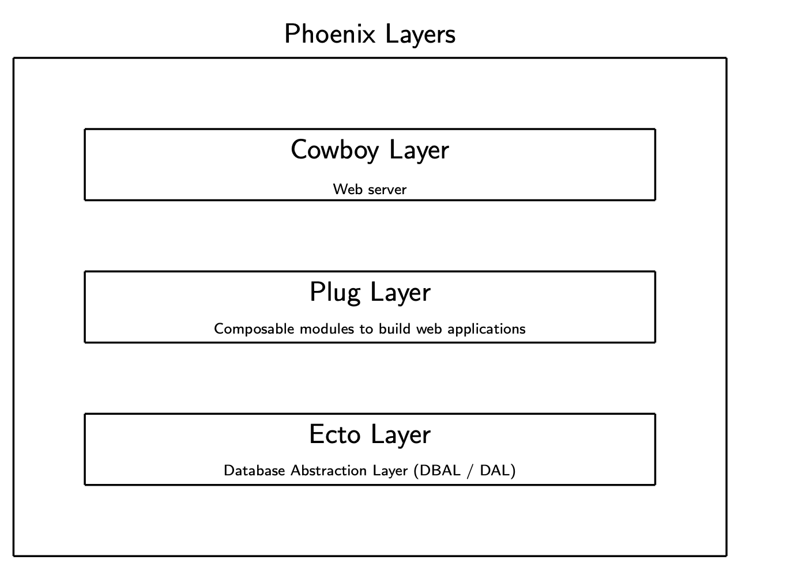
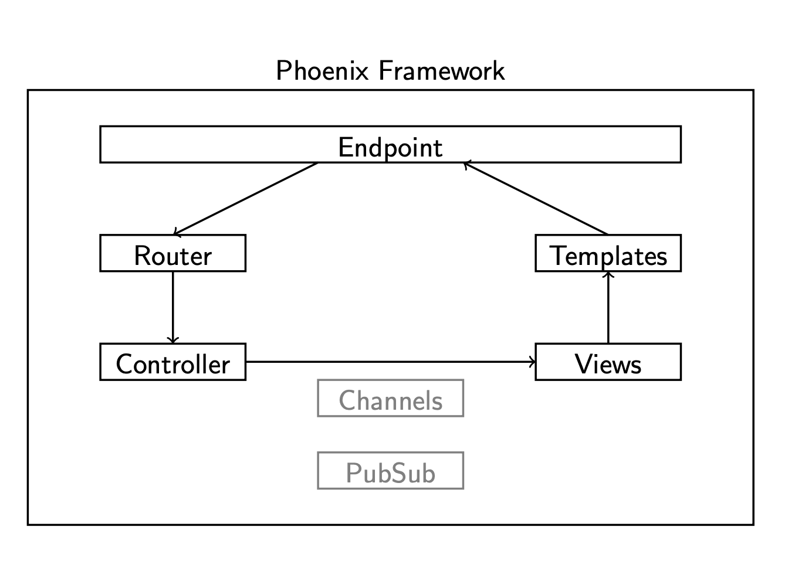
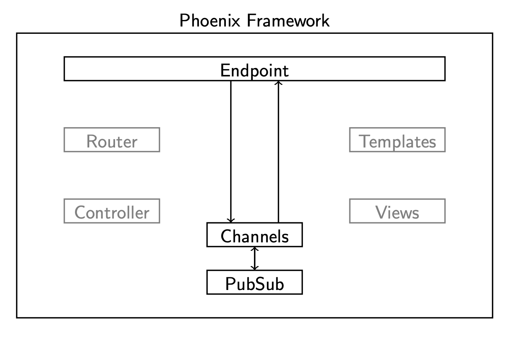

# IP Major

In deze samenvatting staat enkel theorie, ik ga me niet bezig houden met de inhoud van de labos hier uit te leggen. Daarvoor kan je de labos altijd nog is opnieuw doen.

## Elixir

De eerste paar lessen gaan over *Elixir*, een nieuwe programmeertaal. Ik veronderstel dat je al een beetje overweg kunt met elixir wanneer je dit leest, anders raad ik je sterk aan om de oefeningen van *distributed applications* te maken.

## Mix

Als jullie je project hebben gemaakt, zijn jullie zeker en vast al in contact gekomen met `mix`. Mix is een tool waarmee je je applicatie kan **genereren** en **builden**. Je kan er je code mee **compileren** of **testen**. Mix houdt ook oog op de **dependencies** van je project evenals de **configuratie**.

De commando's `mix phx.new application name (- - no-html, - - database)`, `mix run`,  `mix deps.get` en vele anderen komen je hopelijk al bekend voor (laat zeker iets weten als je extra uitleg wilt).

## Umbrella

Bij de les *IP Minor* hebben ze ons een **umbrella** project laten maken. Dit is niet de default in phoenix. Bij een normaal phoenix project heb je maar 1 'applicatie'. Waardoor als je code toevoegt, je app kan groeien tot een extreem grote, moeilijk te onderhouden **monolith**. Daarom leren ze ons direct hoe we **umbrella** moeten gebruiken. In plaats van één enkele, grote monoliet van een app te maken, kan je met umbrella je applicatie in kleinere **deelapplicaties** splitsen (meerdere opgesplitste **contexts**). Het is een skere **microservices** oplossing. **Dependencies** tussen de verschillende applicaties moet je ook expliciet aangeven.

<u>Conclusie</u>: umbrella zorgt voor een bepaald niveau van **separation**, maar de verschillende deelapplicaties staan toch niet helemaal los van elkaar.

Nog wat vuistregels van de slides:

> No domain code in controller 
>
> No direct usage of Repo in your web project  
>
> Controllers will use Contexts to communicate with your domain

## CI/CD

= continuous integration / continuous deployment

**Continuous integration**: 

> multiple developers pushing small, frequent changes to a shared repository

gaat vaak samen met **continuous deployment**. 

## Phoenix framework

Waarom is ~~phoenix~~ eender welk framework nuttig?

>  Avoid writing the same code over and over again 
>
> Higher interopability between your code & boilerplate code 
>
> Abstractions to e.g. sessions, security, databases, etc... 
>
> Other developers can focus on the important bits

Nu wat afbeeldingen waarvan ik niet zeker weet of we ze vanbuiten moeten kennen.

### Phoenix layers

Ik denk dat je die 3 lagen wel moet kunnen uitleggen.

### Request lifecycle

Phoenix [request lifecycle guide](https://hexdocs.pm/phoenix/request_lifecycle.html)

Ik zal de verschillende doosjes op de afbeeldingen kort uitleggen

**<u>Endpoint</u>**

Hier begint en eindigt elk request

> Overall, an endpoint has three responsibilities:
>
> - to provide a wrapper for starting and stopping the endpoint as part of a supervision tree
> - to define an initial plug pipeline for requests to pass through
> - to host web specific configuration for your application

**<u>Router</u>**

De router kijkt naar het request en stuurt het naar de juiste controller/actie. Hij heeft ook helpers om paden of urls naar resources te genereren. In de router kan je ook **pipelines** defineren. Een pipeline is eigenlijk een reeks transformaties die moeten uitgevoerd worden op het request (zogenaamde plugs). Daarna wordt het request doorgestuurd naar de juiste plaats. 

> Note that router pipelines are only invoked after a route is found. No plug is invoked in case no matches were found.

**<u>Controller</u>**

Normaal gezien weten jullie wel ongeveer wat een controller zoal doet. Een controller voorziet functies (zogenaamde **actions**) om requests af te handelen. Je controller kan bijvoorbeeld data voorbereiden om het daarna te tonen in een view. Of zeggen welke view geladen moet worden. Je kan er hopelijk zelf nog wel een aantal bedenken.

**<u>Views</u>**

[bron](https://hexdocs.pm/phoenix/request_lifecycle.html#a-new-view)

> Phoenix views act as the presentation layer. For example, we expect the output of rendering "index.html" to be a complete HTML page. To make our lives easier, we often use templates for creating those HTML pages.

De views zorgen ervoor dat je templates gerendered worden. Je kan er ook **helper functies** in steken om de data te decoreren. (in mijn project heb ik bijvoorbeeld een helper functie geschreven om de links te verbergen waarvoor de gebruiker toch niet geauthoriseerd is om te bezoeken). 

**<u>Templates</u>**

Templates bevatten de inhoud (typisch in HTML formaat) die getoond gaat worden in het **response**. Ze zien er meestal zo uit: `app.html.eex` de *eex* vanachter staat voor **embedded elixir**. Je kan `<%= expression %>` gebruiken om elixir expressions in je template te laten tonen. Templates worden op voorhand gecompileerd en zijn snel. 

> A template file has the following structure: `NAME.FORMAT.TEMPLATING_LANGUAGE`. In our case, we will create a "index.html.eex" file at "lib/hello_web/templates/hello/index.html.eex". ".eex" stands for [`EEx`](https://hexdocs.pm/eex/EEx.html), which is a library for embedding Elixir that ships as part of Elixir itself. Phoenix enhances EEx to include automatic escaping of values. This protects you from security vulnerabilities like Cross-Site-Scripting with no extra work on your part.

### Realtime communicatie

**<u>Channels</u>**

Channels zijn er om **realtime** communicatie (met sockets) toe te staan. Ze lijken een beetje op controllers, maar staan bi-directionele communicatie toe met een **persistente** verbinding (denk aan web 4). Een chatapplicatie zou bijvoorbeeld gebruik kunnen maken van channels.

**<u>PubSub</u>**

Dit is de laag onder de channels van phoenix. Zorgt ervoor dat clients zich kunnen subscriben aan topics (meer kan ik hier niet over vertellen, sorry)

### Ecto

**Repo module** - Via the repository kunnen we data aanmaken, updaten, verwijderen en opvragen (queryen).

**Schemas** - een schema beschrijft de relatie tussen de dingen in je database en je elixir code. 

**Changesets** - een manier om externe parameters te filteren en om te zetten. Je kan changesets ook gebruiken om veranderingen te valideren alvorens ze toe te passen.

**Query** - queries geschreven in Elixir syntax met specifieke DSL (Domain Specific Language). Queries zijn standaard veilig, ze vermijden veelvoorkomende problemen. Je kan ze stuk voor stuk opbouwen.
