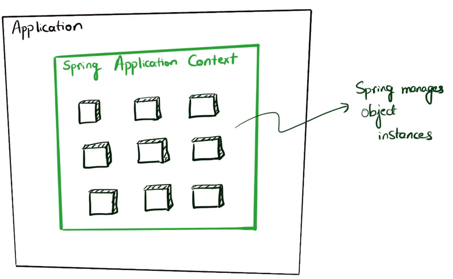
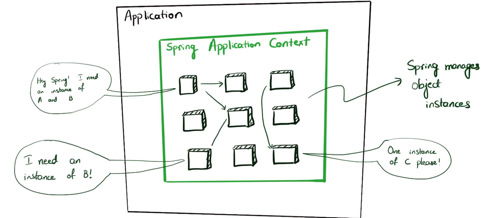
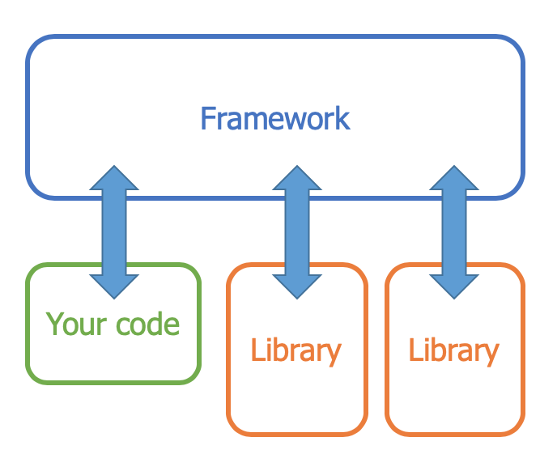
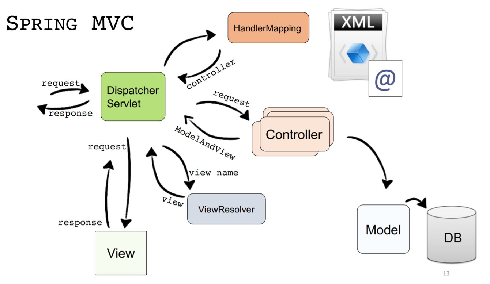
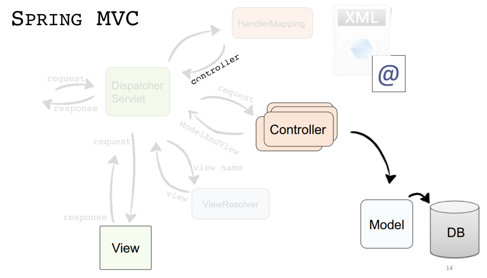

# IP Minor

Hier wat (hopelijk) nuttige info voor op het examen.

* [Waarom is Spring nuttig?](#waarom-is-spring-nuttig)
  * [Frameworks in het algemeen](#frameworks-in-het-algemeen)
  * [Spring boot](#spring-boot)
  * [Spring MVC](#spring-mvc)

* [CRUD](#crud)

* [Validatie](#validatie)

* [JPA](#jpa)
  * [DTO's](#dtos)

* [REST](#rest)

* [i18n](#i18n)

* [Security](#security)
  * [Authentication](#authentication)
  * [Authorization](#authorization)

## Waarom is Spring nuttig?

### Frameworks in het algemeen

**Frameworks** lossen een heleboel problemen op die je vaak hebt als je een applicatie ontwikkelt, ze zorgen ervoor dat je dingen die vaak terugkomen, niet telkens opnieuw hoeft te doen. Ze zorgen ook voor **patronen** en **structuur**. 

### Spring boot

In een normale java applicatie heb je allemaal klassen die van elkaar afhangen enzo. **Spring boot** steekt deze klassen in een doos: de **spring application context**. Dit is een soort wrapper volgens Mr. Creuwels.



**Dependency injection**

In de ondestaande figuur zie je hoe **spring** zogezegd omgaat met dependencies. Je moet gewoon weten dat spring alles gemakkelijker maakt en veel dingen regelt. 



> Handling interrelated dependencies among objects is a common task, and Spring tries to help with that. 
>
> You indicate what your business service classes are and you let Spring initialize them, then manage them. You can tell Spring to initialize one or more instances.
>
> Spring also connects these objects together in the way you want it, just like in the object graph picture. The way this works is that every class declares its dependencies. Spring looks at that and injects those dependencies to make sure every object has references to every instance they require. 



> The framework provides a way for classes to define what other classes they need (**dependencies**) and ensures that they can access those classes (**injection**)


### Spring MVC



> DispatcherServlet: ask HandlerMapping for controller, pass request to controller, ask ViewResolver for view, pass model to view
>
> HandlerMapping: retrieve controller for url based on configuration
>
> Controllers: written by developer! Returns model and view
>
> ViewResolver: retrieves view for view name
>
> View: written by developer! 

Alleen dit moeten we zelf doen:




## CRUD

Hoe doe je CRUD? Met data binding. Ik heb geen zin om dit uit te leggen (1:moneybag:)

Data binding:

```java
@PostMapping
public String postNewHead(@ModelAttribute Head head){
		service.addHead(head);
  	return "redirect:/head";
}
```

```html
<html>
    <body>
        <form action="#" th:action="@{/}" th:object="${personForm}" method="post">
            <table>
                <tr>
                    <td>Name:</td>
                    <td><input type="text" th:field="*{name}" /></td>
                    <td th:if="${#fields.hasErrors('name')}" th:errors="*{name}">Name Error</td>
                </tr>
                <tr>
                    <td>Age:</td>
                    <td><input type="text" th:field="*{age}" /></td>
                    <td th:if="${#fields.hasErrors('age')}" th:errors="*{age}">Age Error</td>
                </tr>
                <tr>
                    <td><button type="submit">Submit</button></td>
                </tr>
            </table>
        </form>
    </body>
</html>
```


## Validatie

> To ensure all input from a form is valid before it is further processed

Je moet **Bindingresult** gebruiken:

```java
@PostMapping("/")
	public String checkPersonInfo(@Valid PersonForm personForm, BindingResult bindingResult) {

		if (bindingResult.hasErrors()) {
			return "form";
		}

		return "redirect:/results";
	}
```

In de domeinklassen kan je dan annotaties gebruiken om aan spring te vertellen wat juist is en wat niet.

```java
@NotNull
@NotEmpty
@Size
@Min
@Max
```

## JPA

= java persistence api

Jullie kennen hopelijk **JDBC** al. Daar ga ik het nu niet over hebben.

**JPA** is een soort abstractielaag tussen je java applicatie en je database. Die maakt het beheren van data een stuk makkelijker. JPA is een API en geef geen speciefieke implementatie voor de effectieve vertaling van je OO gedoe naar het database gedoe. Daarvoor gebruik je **Eclipselink** of **Hibernate**. (Spring gebruikt default hibernate).

Je geeft dan met annotaties aan wat er in de database moet gedaan worden met je objecten.

```java
@Entity
@Table(name="EMPLOYEE")
public class EmployeeEntity 
{
    @Id
    @Column(name="ID")
    @GeneratedValue
    private Integer id;
 
    @Column(name="FIRSTNAME") //dit is optioneel
    private String firstname;
 
    @Column(name="LASTNAME")
    private String lastname;
 
    @Column(name="EMAIL")
    private String email;
 
    @Column(name="TELEPHONE")
    private String telephone;
 
    //Setters and getters
}
```

 

#### DTO's

Een object van een `@Entity` klasse vertegenwoordigt een rij in een databasetabel. Wijzigingen aan dit object kunnen worden doorgezet in de database. Als je deze klassen in je view of controller gebruikt, kan dat zorgen voor onvoorziene neveneffecten. 

Bijvoorbeeld... Input van een gebruiker kan rechtstreeks gemapt worden op een **Entity** object en opgeslagen worden in de database, zelfs voordat de validatie heeft plaatsgevonden.

Dan moet ge weer gaan zoeken naar workarounds om dat te voorkomen. Dat willen we niet he. Maak gewoon voor elk object een **data transfer object** dat alleen de nodige data bevat. Dit object is niet verbonden aan de database en vormt dus een minder groot beveiligingsrisico.

Niet iets. Als je bijvoorbeeld op een applicatie zoals facebook als je vrienden wilt tonen, hoeven niet alle wachtwoorden van die vrienden doorgestuurd te worden. Je hoeft dus niet alle info over een object in het DTO te steken.

Definitie van Wim:

> DTO: data transfer object
>
> An object containing the data needed for a view or controller, without direct links to the database


## REST

> REST stands for representational state transfer. It is a paradigm after which you can model a web service, usually in the form of an HTTP server.
>
> The most important property of a REST service is that it is **stateless**: each request to the service will be processed as if it was the only request that is ever executed. No context of the request is stored in the REST service. In contrast, a standard web application would usually store session data to keep track of it’s user and other relevant data.

Hoe dat moet in Spring boot moeten we hopelijk niet kennen.


## i18n

i + 18 letters + n

18 letters = nternationalizatio

vaag

---

i18n zit default ingebouwd in spring.

Je moet deze code in je app hebben:

```java
@Configuration
public class WebConfig implements WebMvcConfigurer {
 @Bean
 public LocaleResolver localeResolver() {
 CookieLocaleResolver clr = new CookieLocaleResolver();
 clr.setDefaultLocale(Locale.ENGLISH);
 return clr;
 }
 @Bean
 public LocaleChangeInterceptor localeChangeInterceptor() {
 LocaleChangeInterceptor lci = new LocaleChangeInterceptor();
 lci.setParamName("lang");
 return lci;
 }
 @Override
 public void addInterceptors(InterceptorRegistry registry) {
 registry.addInterceptor(localeChangeInterceptor());
 }
}
```

dan moet je properties files in (`src/main/resources`) steken volgens deze conventie:

```java
messages(_language).properties
```

en dit:

> The use of these translations depends on your templating library (Thymeleaf, JSP, …). In Thymeleaf you would use #{translationKey} in a th:text attribute.


## Security

### Authentication

> Authentication is the act of confirming a user is who he/she claims he/she is. To do that, an application will usually store some credentials of the user. In other words, logging in with a username and password is authentication.

### Authorization

> Authorization is dependent on authentication and is the act of checking that a user can perform whatever action he/she is trying to take. In other words, checking that a user has the authority to perform an action. Authorization is commonly implemented in a role based way, with for example ADMIN, MEMBER and GUEST roles, each with their own authority to determine what they are allowed to do.

Spring heeft hier een library voor: **Spring security**

Spring security zorgt er automatisch voor dat je moet ingelogd zijn om aan eender welke pagina te kunnen. Weliswaar met de naam **user** en een gegenereerd password. Je moet dus nog een paar dingen aanpassen.

Maak een klasse **SecurityConfig** met iets dat lijkt op dit erin:

```java
public class SecurityConfig extends WebSecurityConfigurerAdapter {
    private final UserService userService;
    private final PasswordEncoder passwordEncoder;

    public SecurityConfig(UserService userService, PasswordEncoder passwordEncoder) {
        this.userService = userService;
        this.passwordEncoder = passwordEncoder;
    }

    @Override
    protected void configure(HttpSecurity http) throws Exception {
        http.authorizeRequests()
                .mvcMatchers("signup").permitAll()
                .mvcMatchers("/tasks/new").hasAuthority("ADMIN")
                .anyRequest().authenticated()
                .and()
                .formLogin()
                .loginPage("/login").permitAll()
                .and()
                .logout().permitAll();
    }

    @Override
    protected void configure(AuthenticationManagerBuilder auth) throws Exception {
        auth.userDetailsService(userService)
                .passwordEncoder(passwordEncoder);
    }
}
```


Veel succes met je examen