# Routing & Switching essentials

> :warning: LEGAL:  Je mag deze guide niet lezen of delen, hij bevat gecopyrighted materiaal van Cisco. Deze guide is mijn persoonlijke samenvatting en dient niet geherdistribueert te worden. 

> :warning:  Ik maak dit voor mezelf. Het kan dat er erg onlogische dingen inzitten. 


<!--ts-->
   * [Routing &amp; Switching essentials](#routing--switching-essentials)
   * [Tips and Tricks](#tips-and-tricks)
      * [My to-do list](#my-to-do-list)
      * [Shortcuts](#shortcuts)
      * [More useful commands](#more-useful-commands)
      * [Initial Config­uration (Switches and Routers)](#initial-configuration-switches-and-routers)
      * [Router Commands](#router-commands)
      * [Keyboard Shortcuts](#keyboard-shortcuts)
      * [Translating domain server](#translating-domain-server)
      * [Command Hierarchy](#command-hierarchy)
      * [Port labels](#port-labels)
   * [Module 1: Basic Device configuration](#module-1-basic-device-configuration)
      * [SSH oefening 1.3.6](#ssh-oefening-136)
      * [Commando's](#commandos)
      * [SVI configureren](#svi-configureren)
   * [Module 2: Switching concepts](#module-2-switching-concepts)
   * [Module 3: VLAN's](#module-3-vlans)
      * [Soorten VLANS](#soorten-vlans)
      * [VLAN commando's](#vlan-commandos)
         * [VLAN's](#vlans)
         * [Trunks](#trunks)
      * [DTP](#dtp)
   * [Module 4: Inter-VLAN Routing](#module-4-inter-vlan-routing)
      * [Legacy inter-vlan routing](#legacy-inter-vlan-routing)
      * [Router-on-a-Stick Inter-VLAN Routing](#router-on-a-stick-inter-vlan-routing)
      * [Inter-VLAN Routing on a Layer 3 Switch](#inter-vlan-routing-on-a-layer-3-switch)
         * [Troubleshooten](#troubleshooten)
   * [Module 5: STP Concepts](#module-5-stp-concepts)
      * [Korte uitleg](#korte-uitleg)
   * [Module 6: EtherChannel](#module-6-etherchannel)
      * [AutoNegotiation Protocols](#autonegotiation-protocols)
      * [Wanneer werkt het?](#wanneer-werkt-het)
      * [Hoe maak je het?](#hoe-maak-je-het)
      * [Commando's](#commandos-1)
   * [Module 7: DHCPv4](#module-7-dhcpv4)
      * [Korte uitleg](#korte-uitleg-1)
      * [Configuratie (commando's)](#configuratie-commandos)
      * [Verificatie (commando's)](#verificatie-commandos)
      * [Voorbeeld](#voorbeeld)
   * [Module 8: SLAAC and DHCPv6](#module-8-slaac-and-dhcpv6)
      * [Vocabulaire](#vocabulaire)
      * [Router advertisements](#router-advertisements)
      * [Duplicate address detection](#duplicate-address-detection)
      * [DHCPv6](#dhcpv6)
      * [Configuratie (commando's)](#configuratie-commandos-1)
      * [Verificatie (commando's)](#verificatie-commandos-1)
   * [Module 9: FHRP Concepts](#module-9-fhrp-concepts)
      * [Essentie](#essentie)
         * [FHRP](#fhrp)
         * [HSRP](#hsrp)
      * [Commando's](#commandos-2)
   * [Module 10: LAN Security Concepts](#module-10-lan-security-concepts)
      * [Samenvatting](#samenvatting)
      * [Vocabulaire](#vocabulaire-1)
      * [SSH](#ssh)
      * [802.1X](#8021x)
      * [Layer 2 Vulnerabilities](#layer-2-vulnerabilities)
         * [Threats &amp; Solutions](#threats--solutions)
         * [MAC Address Table Flooding](#mac-address-table-flooding)
      * [LAN Attacks](#lan-attacks)
         * [VLAN Hopping Attacks](#vlan-hopping-attacks)
         * [VLAN Double-Tagging Attack](#vlan-double-tagging-attack)
         * [DHCP Attacks](#dhcp-attacks)
            * [DHCP Starvation Attack](#dhcp-starvation-attack)
            * [DHCP Spoofing Attack](#dhcp-spoofing-attack)
         * [ARP attacks](#arp-attacks)
         * [Address Spoofing Attack](#address-spoofing-attack)
         * [STP Attack](#stp-attack)
         * [CDP Reconnaissance](#cdp-reconnaissance)
   * [Module 11: Switch Security Configuration](#module-11-switch-security-configuration)
      * [Implement Port Security](#implement-port-security)
         * [MAC Address Table Attacks](#mac-address-table-attacks)
            * [<strong>Limit and Learn MAC Addresses</strong>](#limit-and-learn-mac-addresses)
         * [Port security aging](#port-security-aging)
         * [Port Security Violation Modes](#port-security-violation-modes)
         * [Ports in error-disabled State](#ports-in-error-disabled-state)
         * [Verificatie (commando's)](#verificatie-commandos-2)
      * [Vlan Attacks tegengaan](#vlan-attacks-tegengaan)
      * [DHCP Attacks tegengaan](#dhcp-attacks-tegengaan)
      * [ARP Attacks tegengaan](#arp-attacks-tegengaan)
      * [STP attacks tegengaan](#stp-attacks-tegengaan)
         * [PortFast](#portfast)
         * [BPDU Guard](#bpdu-guard)
      * [Commando's en tips](#commandos-en-tips)

<!-- Added by: martijn, at: Wed May 27 17:26:40 CEST 2020 -->

<!--te-->

Github ondersteunt geen Table of Contents, dus heb ik nu een script dat er eentje genereert

Epicccccccc


# Tips and Tricks

## My to-do list

* OSPF en *8.4.1.2 Packet Tracer - Skills Integration Challenge.pka*
* Oefening op SLAAC en DHCPv6
* Lijst maken van vragen en antwoorden van vorige examens + netacad examens (jullie mogen mij hier zeker mee helpen)

## Shortcuts

In Cisco iOS kan je elk commando zo kort maken als je wilt, zolang het niet dubbelzinnig is. Er zijn ook sommige speciale afkortingen voor veelgebruikte commando's. Hierbeneden vind je een combinatie van beide soorten.

| Commando                           | Afkorting         |
| ---------------------------------- | ----------------- |
| configure terminal                 | conf t            |
| copy running-config startup-config | wr                |
| show ip route                      | sh ip ro          |
| show ip interface brief            | sh ip int brie    |
| show running-config [interface]    | sh ru [interface] |
| interface GigabitEthernet 0/0      | int G0/0          |
| enable                             | en                |
| no ip domain-lookup                | no ip dom lo      |
| show running-config                | sh run            |


## More useful commands

| Commando           | Wat doet het?                                                |
| ------------------ | ------------------------------------------------------------ |
| tracert [ip-adres] | Trace the path from this device to the device on the other end |
|                    |                                                              |
|                    |                                                              |


## Initial Config­uration (Switches and Routers)

| **Comm­and**                      | **From Mode**    | **What It Does**                              |
| --------------------------------- | ---------------- | --------------------------------------------- |
| **`hostname xyz`**                | global config    | sets hostname to xyz                          |
| **`enable secret xyz`**           | global config    | sets encrypted password for priv. EXEC to xyz |
| **`service passwo­rd-­enc­rypt`** | global config    | encrypts all passwords                        |
| **`line console 0`**              | global config    | enters line config mode for console           |
| **`line vty 0 15`**               | global config    | enters line config mode for 16 vty lines      |
| **`pas­sword xyz`**               | line config      | sets line password to xyz                     |
| **`log­in`**                      | line config      | enables users to login                        |
| **`int vlan 1`**                  | global config    | enters interface config mode for vlan1        |
| **`ip address [IP] [subnet]`**    | interface config | sets IP address                               |
| **`no shut`**                     | interface config | turns on interface                            |
| **`banner motd #Text Here#`**     | global config    | sets motd banner                              |

## Router Commands

| **Comm­and**                              | **From Mode**    | **Func­tion**                                    |
| ----------------------------------------- | ---------------- | ------------------------------------------------ |
| **`int­erface g0/1`**                     | global config    | enters interface config for Gigabit Ethernet 0/1 |
| **`ip address *IP/prefix*`**              | interface config | sets interf­ace's IPv4 address                   |
| **`no shut`**                             | interface config | turns on the interface                           |
| **`des­cri­ption *descr­iption text*`**   | interface config | used to document info about the interface        |
| **`ipv6 address *IP prefix*`**            | interface config | sets interf­ace's IPv6 address                   |
| **`ipv6 address *IP/prefix* link-local`** | interface config | sets interf­ace's IPv6 link-local address        |
| **`ipv6 unicast-routing`**                | global config    | enables IPv6 routing                             |

## Keyboard Shortcuts

| Up Arrow     | Automa­tically re-types last command                   |
| ------------ | ------------------------------------------------------ |
| Ctrl+Shift+6 | Oh crap, stop! (Cancels whatever it's currently doing) |
| Ctrl+C       | Exits config mode                                      |
| Ctrl+Z       | Applies current command & returns to priv. EXEC mode   |
| Ctrl+U       | Erases anything on current prompt line                 |
| Tab          | Completes abbrev­iated command                         |

## Translating domain server

Oke boys ik heb de superieure fix gevonden als je vas zit op `Translating "azerqdfgfdgq"...domain server (255.255.255.255)` 


Ram gewoon een paar keer op dit knopje (fast forward). Dan skip je die timeout van *translating...*

## Command Hierarchy

Dit vind ik altijd nuttig. Daarom zet ik het hier vanboven.

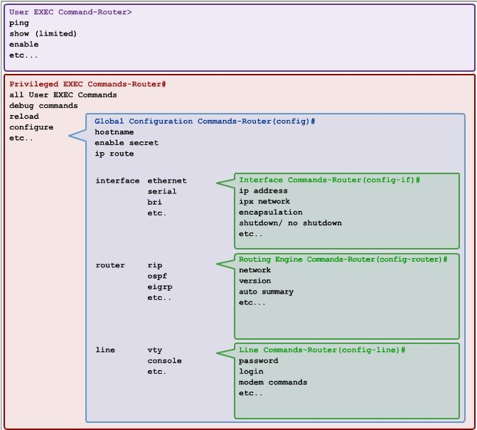


| **Level** | **Mode**         | **Prompt**             |
| --------- | ---------------- | ---------------------- |
| 1         | User EXEC        | Device>                |
| 2         | Privileged EXEC  | Device#                |
| 3         | Global Config    | Device­(co­nfig)#      |
| 4a        | Interface Config | Device­(co­nfi­g-if)#  |
| 4b        | Line Config      | Device­(co­nfi­g-line) |

## Port labels


Doe in je preferences **always show port labels** aan.

da's handig


# Module 1: Basic Device configuration

**SVI**: Switch Virtual Interface

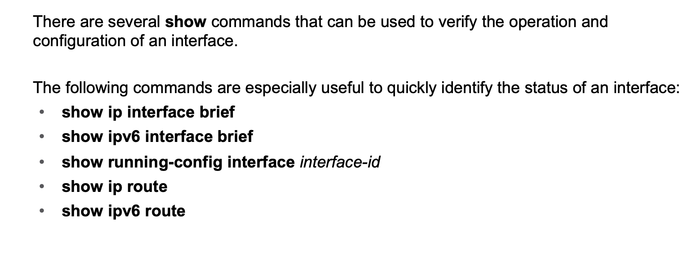

Checken of je shit werkt:

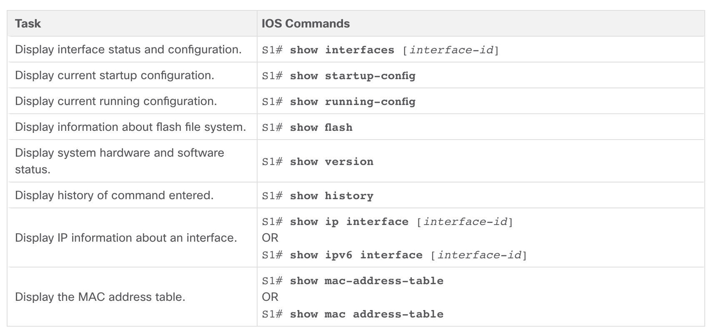


## SSH oefening 1.3.6

"Using the command prompt on PC1, Telnet to S1. The user EXEC and privileged EXEC password is cisco."

Ga naar Command Prompt op de pc en typ:

**telnet 10.10.10.2**

Daarna vraagt ie voor een password, dit is "cisco". You're in (de switch weliswaar).

Op de switch:

**ip domain-name cisco.com**

**crypto key generate rsa**

**username admin secret ccna**

**line vty 0 15**

**transport input ssh**

**login local**

**no password**

**exit**


## Commando's

* Passwords instellen
* ssh configureren
* default gateway instellen
* ip adressen op interfaces zetten
* interfaces hernoemen
* apparatuur hernoemen
* motd instellen

Dit allemaal staat normaal in de volgende codefragmenten.

```
Router# configure terminal
Enter configuration commands, one per line.  End with CNTL/Z.
Router(config)# hostname R1
R1(config)# enable secret class
R1(config)# line console 0
R1(config-line)# password cisco
R1(config-line)# login
R1(config-line)# exit
R1(config)# line vty 0 4
R1(config-line)# password cisco
R1(config-line)# login
R1(config-line)# exit
R1(config)# service password-encryption
R1(config)#
```

```
banner motd $ Authorized Access Only! $
```

```
R1(config)# interface gigabitethernet 0/0/0
R1(config-if)# ip address 192.168.10.1 255.255.255.0 
R1(config-if)# ipv6 address 2001:db8:acad:1::1/64 
R1(config-if)# description Link to LAN 1
R1(config-if)# no shutdown
R1(config-if)# exit
R1(config)# interface gigabitethernet 0/0/1
R1(config-if)# ip address 192.168.11.1 255.255.255.0 
R1(config-if)# ipv6 address 2001:db8:acad:2::1/64 
R1(config-if)# description Link to LAN 2
R1(config-if)# no shutdown
R1(config-if)# exit
R1(config)# interface serial 0/0/0
R1(config-if)# ip address 209.165.200.225 255.255.255.252 
R1(config-if)# ipv6 address 2001:db8:acad:3::225/64 
R1(config-if)# description Link to R2
R1(config-if)# no shutdown
R1(config-if)# exit
R1(config)#
```

```
Router# configure terminal
Enter configuration commands, one per line.  End with CNTL/Z.
Router(config)# hostname R1
R1(config)# enable secret class
R1(config)# line console 0
R1(config-line)# password cisco
R1(config-line)# login
R1(config-line)# exit
R1(config)# line vty 0 4
R1(config-line)# password cisco
R1(config-line)# login
R1(config-line)# exit
R1(config)# service password-encryption
R1(config)#
```


## SVI configureren

| **Task**                                         | **IOS Commands**                                       |
| :----------------------------------------------- | :----------------------------------------------------- |
| Enter global configuration mode.                 | `S1# configure terminal`                               |
| Enter interface configuration mode for the SVI.  | `S1(config)# interface vlan 99`                        |
| Configure the management interface IPv4 address. | `S1(config-if)# ip address 172.17.99.11 255.255.255.0` |
| Configure the management interface IPv6 address  | `S1(config-if)# ipv6 address 2001:db8:acad:99::1/64`   |
| Enable the management interface.                 | `S1(config-if)# no shutdown`                           |
| Return to the privileged EXEC mode.              | `S1(config-if)# end`                                   |
| Save the running config to the startup config.   | `S1# copy running-config startup-config`               |

# Module 2: Switching concepts

Switch Forwarding Methods:

**Store-and-forward switching** - Receives the entire frame and ensures the frame is valid. Store-and-forward switching is Cisco’s preferred switching method. 

**Cut-through switching** – Forwards the frame immediately after determining the destination MAC address of an incoming frame and the egress port. 


Een switch scheidt **collision domains**

een router scheidt **broadcast domains**

een hub vergroot **collision domains**


# Module 3: VLAN's

**VLAN trunk**: A trunk is a point-to-point link between two network devices. Kan in meerdere VLAN's zitten.

**FCS**: frame check sequence

Hier nog wat feitjes van netacad:


**Een VLAN tag bevat het volgende** :

- **Type** - A 2-byte value called the tag protocol ID (TPID) value. For Ethernet, it is set to hexadecimal 0x8100.

- **User priority** - A 3-bit value that supports level or service implementation.

- **Canonical Format Identifier (CFI)** - A 1-bit identifier that enables Token Ring frames to be carried across Ethernet links.

- **VLAN ID (VID)** - A 12-bit VLAN identification number that supports up to 4096 VLAN IDs.

  

## Soorten VLANS

* **Native VLAN**: default is die VLAN 1, op de native vlan wordt *untagged* traffic gesmeten. Je kan best een ongebruikte vlan als native vlan configureren.
* **Management VLAN**: ook default op VLAN 1: deze vlan dient voor SHH, telnet enzo. Voor het beheer van je apparatuur.
* **Voice VLAN**: VLAN voor *VoIP* (voice over ip)


## VLAN commando's

### VLAN's

**Vlan aan poort assignen**

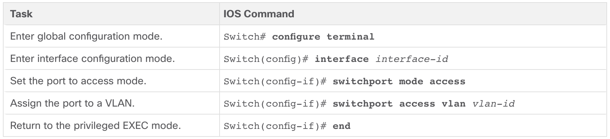

`no switchport access vlan` zet de poort terug op vlan 1.

**Vlan maken**

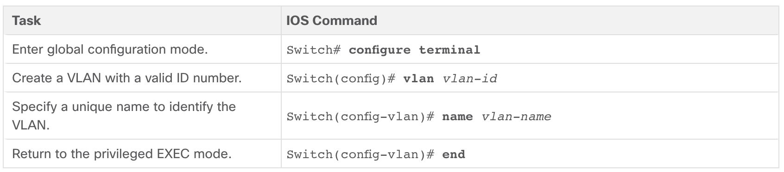

**Vlans tonen**

```
show vlan [brief | id vlan-id | name
vlan-name | summary]
```

**Vlans verwijderen**

```
S1(config-if)# no vlan [vlan-id]
```

**Voice VLAN maken**

```
S3(config)# vlan 20
S3(config-vlan)# name student
S3(config-vlan)# vlan 150
S3(config-vlan)# name VOICE
S3(config-vlan)# exit
S3(config)# interface fa0/18
S3(config-if)# switchport mode access
S3(config-if)# switchport access vlan 20
S3(config-if)# mls qos trust cos <!-dit zet quality of service aan-!>
S3(config-if)# switchport voice vlan 150
S3(config-if)# end
```

> The configuration in the example creates the two VLANs (i.e., VLAN 20 and VLAN 150) and then assigns the F0/18 interface of S3 as a switchport in VLAN 20. It also assigns voice traffic to VLAN 150 and enables QoS classification based on the class of service (CoS) assigned by the IP phone.


### Trunks

Trunk poort maken**


| **Task**                                                   | **IOS Command**                                              |
| :--------------------------------------------------------- | :----------------------------------------------------------- |
| Enter global configuration mode.                           | `Switch# configure terminal`                                 |
| Enter interface configuration mode.                        | `Switch(config)# interface interface-id`                     |
| Set the port to permanent trunking mode.                   | `Switch(config-if)# switchport mode trunk`                   |
| Sets the native VLAN to something other than VLAN 1.       | `Switch(config-if)# switchport trunk native vlan vlan-id`    |
| Specify the list of VLANs to be allowed on the trunk link. | `Switch(config-if)# switchport trunk allowed vlan vlan-list` |
| Return to the privileged EXEC mode.                        | `Switch(config-if)# end`                                     |

**Trunk verwijderen/resetten**

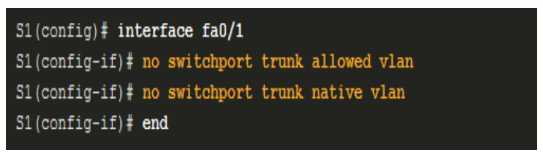

**Trunk verifiëren**

```
show interfaces fa0/1 switchport
```


## DTP

**dtp**: Dynamic trunking protocol

> Some Cisco switches have a proprietary protocol that lets them automatically negotiate trunking with a neighboring device. This protocol is called Dynamic Trunking Protocol (DTP). DTP can speed up the configuration process for a network administrator. Ethernet trunk interfaces support different trunking modes. An interface can be set to trunking or nontrunking, or to negotiate trunking with the neighbor interface. Trunk negotiation is managed by DTP, which operates on a point-to-point basis only, between network devices.

uitzetten:

```
S1(config-if)# switchport mode trunk
S1(config-if)# switchport nonegotiate
```

terug aanzetten:

```
S1(config-if)# switchport mode dynamic auto
```


# Module 4: Inter-VLAN Routing

## Legacy inter-vlan routing


zo ziet dat eruit.

> Legacy inter-VLAN routing using physical interfaces works, but it has a significant limitation. It is not reasonably scalable because routers have a limited number of physical interfaces. Requiring one physical router interface per VLAN quickly exhausts the physical interface capacity of a router.


## Router-on-a-Stick Inter-VLAN Routing


dat ziet er zo uit

Je moet de vlans op de switches configureren (dat lukt wel als je het vorige hoofdstuk hebt gedaan)

daarna moet je de router configureren:

```
R1(config)# interface G0/0/1.10 -- de .10 voor vlan 10 (dit is een conventie, geen verplichting)
R1(config-subif)# description Default Gateway for VLAN 10
R1(config-subif)# encapsulation dot1Q 10 -- lees hieronder (1)
R1(config-subif)# ip address 192.168.10.1 255.255.255.0
R1(config-subif)# exit
```

(1)

> **encapsulation dot1q** *vlan_id* **[native]** - This command configures the subinterface to respond to 802.1Q encapsulated traffic from the specified *vlan-id*. The **native** keyword option is only appended to set the native VLAN to something other than VLAN 1.

doe oefening 4.2.7

## Inter-VLAN Routing on a Layer 3 Switch

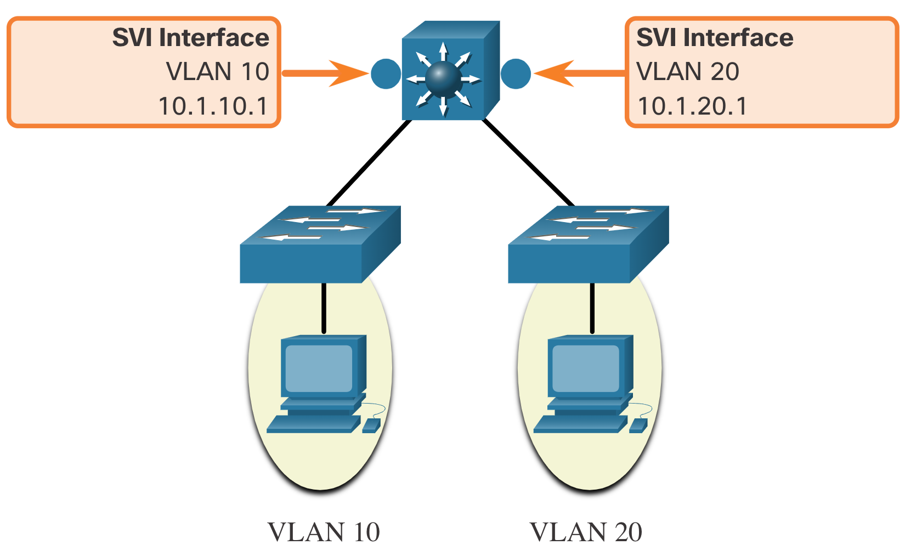

dat hebben we dan ook alweer gehad.

Hoe doe je dat?

**1. Create the VLANs.**

```
D1(config)# vlan 10
D1(config-vlan)# name LAN10
D1(config-vlan)# vlan 20
D1(config-vlan)# name LAN20
D1(config-vlan)# exit
```

**2. Create the SVI VLAN interfaces.**

```
D1(config)# interface vlan 10
D1(config-if)# description Default Gateway SVI for 192.168.10.0/24
D1(config-if)# ip add 192.168.10.1 255.255.255.0
D1(config-if)# no shut
D1(config-if)# exit
D1(config)#
D1(config)# int vlan 20
D1(config-if)# description Default Gateway SVI for 192.168.20.0/24
D1(config-if)# ip add 192.168.20.1 255.255.255.0
D1(config-if)# no shut
D1(config-if)# exit
```

**3. Configure access ports.**

```
D1(config)# interface GigabitEthernet1/0/6
D1(config-if)# description Access port to PC1
D1(config-if)# switchport mode access
D1(config-if)# switchport access vlan 10
D1(config-if)# exit
D1(config)#
D1(config)# interface GigabitEthernet1/0/18
D1(config-if)# description Access port to PC2
D1(config-if)# switchport mode access
D1(config-if)# switchport access vlan 20
D1(config-if)# exit
```

**4. Enable IP routing.**

> Finally, enable IPv4 routing with the **ip routing** global configuration command to allow traffic to be exchanged between VLANs 10 and 20. This command must be configured to enable inter-VAN routing on a Layer 3 switch for IPv4.

typo in netacad btw

```
D1(config)# ip routing
```

**Je moet ook routing configureren met volgens ospf**

**OSPF**: Open Shortest Path First (een routing protocol)

```
D1(config)# router ospf 10
D1(config-router)# network 192.168.10.0 0.0.0.255 area 0
D1(config-router)# network 192.168.20.0 0.0.0.255 area 0
D1(config-router)# network 10.10.10.0 0.0.0.3 area 0
```


### Troubleshooten

| **Issue Type**              | **How to Fix**                                               | **How to Verify**                                            |
| :-------------------------- | :----------------------------------------------------------- | :----------------------------------------------------------- |
| Missing VLANs               | Create (or re-create) the VLAN if it does not exist.Ensure host port is assigned to the correct VLAN. | `show vlan [brief] show interfaces switchport ping`          |
| Switch Trunk Port Issues    | Ensure trunks are configured correctly.Ensure port is a trunk port and enabled. | `show interfaces trunk show running-config`                  |
| Switch Access Port Issues   | Assign correct VLAN to access port.Ensure port is an access port and enabled.Host is incorrectly configured in the wrong subnet. | `show interfaces switchport show running-config interface ipconfig` |
| Router Configuration Issues | Router subinterface IPv4 address is incorrectly configured.Router subinterface is assigned to the VLAN ID. | `show ip interface brief show interfaces`                    |


# Module 5: STP Concepts

## Korte uitleg

**STP**: Spanning tree protocol

> Spanning Tree Protocol (STP) is a loop-prevention network protocol that allows for redundancy while creating a loop-free Layer 2 topology. 
>
> STP logically blocks physical loops in a Layer 2 network, preventing frames from circling the network forever


Je wilt in je netwerk graag **redundantie**, want als er ineens een apparaat ontploft, dan ligt niet heel je netwerk plat. Als je switches in een cirkel opstelt, kan het dat pakketjes oneindig lang blijven ronddraaien in die cirkel. **STP** voorkomt dit door poorten te **blokkeren** als ze niet echt nodig zijn. Als er nu een switch kapot gaat, dan worden de nodige geblokkeerde poorten open gezet opdat het netwerk terug operationeel is.


Ik ga het hele algoritme hier niet uitleggen, als je geïnteresserd bent kan je altijd de slides van module 4 op toledo lezen. 

Er zijn ook verschillende soorten STP. Ik weet niet echt of ze verwachten of we dit allemaal kennen. Nou ja, lees het maar op netacad als je extra tijd hebt (waarschijnlijk niet dus).


# Module 6: EtherChannel

> EtherChannel is a link aggregation technology that groups multiple physical Ethernet links together into one single logical link. It is used to provide fault-tolerance, load sharing, increased bandwidth, and redundancy between switches, routers, and servers.

Oke dus als we dat in minder vage woorden willen omschrijven.

*Je kan meerdere verbindingen tussen apparaten samensmelten tot één superverbinding. Dit heet EtherChannel.*

Thanks for coming to my Ted Talk.


zo ziet dat er dan uit.

Blijkbaar (volgens netacad) is EtherChannel ook nodig omdat normaal gezien **STP** (spanning tree) redundante poorten gaat blokkeren. Je kan dit dus voorkomen met EtherChannel.

Oh ja, nog een leuk feitje, je kan maximum 8 links in een EtherChannel stoppen.

## AutoNegotiation Protocols

Er zijn 2 protocollen die je hiervoor zou kunnen gebruiken (die doen wat werk in jouw plaats)

1. **Port Aggregation Protocol (PAgP)**

   ​	Heeft drie modes; 

   - **On** - This mode forces the interface to channel without PAgP. Interfaces configured in the on mode do not exchange PAgP packets.
   - **PAgP desirable** - This PAgP mode places an interface in an active negotiating state in which the interface initiates negotiations with other interfaces by sending PAgP packets.
   - **PAgP auto** - This PAgP mode places an interface in a passive negotiating state in which the interface responds to the PAgP packets that it receives but does not initiate PAgP negotiation.

2.  **Link Aggregation Control Protocol (LACP)**

   ​	Zelfde liedje

   - **On** - This mode forces the interface to channel without LACP. Interfaces configured in the on mode do not exchange LACP packets.
   - **LACP active** - This LACP mode places a port in an active negotiating state. In this state, the port initiates negotiations with other ports by sending LACP packets.
   - **LACP passive** - This LACP mode places a port in a passive negotiating state. In this state, the port responds to the LACP packets that it receives but does not initiate LACP packet negotiation.

Je kan EtherChannel ook configureren **zonder** deze protocollen.


## Wanneer werkt het?

* De speed en duplex configuratie van je poorten moet hetzelfde zijn

* De poorten moeten op dezelfde VLAN zitten, of het moeten trunk poorten zijn die dezelfde allowed vlans hebben.

  

Kort samengevat, je links moeten hetzelfde zijn. Je kan geen *ultra super mega link fusion* doen als je links verschillend zijn.


kan iemand deze naar rudi sturen?

## Hoe maak je het?

```
S1(config)# interface range FastEthernet 0/1 - 2
S1(config-if-range)# channel-group 1 mode active
Creating a port-channel interface Port-channel 1
S1(config-if-range)# exit
S1(config-if)# interface port-channel 1
S1(config-if)# switchport mode trunk
S1(config-if)# switchport trunk allowed vlan 1,2,20
```

Kies een range van interfaces en maak daarop een channel-group die je een nummer geeft. Nu kan je deze groep gewoon als interface gebruiken. Cool.


## Commando's

| Wat doet het                                                 | Hoe moet het                             |
| ------------------------------------------------------------ | ---------------------------------------- |
| Op een range van interfaces een channel group zetten en de EtherChannel modus instellen. | channel-mode [channel#] mode [mode]      |
| Kijken of het werkt                                          | show etherchannel summary                |
| De gemaakte channel aanspreken. (Om bv te gebruiken als trunk) | interface port-channel [channel#]        |
| Meer details                                                 | show run \| begin interface port-channel |

Zo mergen we twee switchpoorten tot 1 super trunk.

```
S1(config)# interface range g0/1 - 2
S1(config-if-range)# shutdown
S1(config-if-range)# channel-group 2 mode active --zie hieronder
S1(config-if-range)# no shutdown
S1(config-if-range)# interface port-channel 2
S1(config-if)# switchport mode trunk
```

**active **zorgt ervoor dat **LACP** wordt gebruikt.

**passive** gebruikt LACP alleen als een ander apparaat gedetecteerd wordt dat LACP gebruikt

**desirable** zorgt ervoor dat de switch een PAgP link gaat onderhandelen

als je op `?` drukt nadat je `channel-group 2 mode` hebt getypt krijg je dit

```
active     Enable LACP unconditionally
auto       Enable PAgP only if a PAgP device is detected
desirable  Enable PAgP unconditionally
on         Enable Etherchannel only
passive    Enable LACP only if a LACP device is detected
```

druk dus altijd op `?`

Je hoeft eigenlijk niks te weten over routers of switches. Druk gewoon op :question:

:question: :question:

:warning:

Soms gaan ports toch random in blocking mode. (door stp). Doe dit:

```
S1(config)# spanning-tree vlan 1 root primary
or
S1(config)# spanning-tree vlan 1 priority 24576
```

Oke ik heb weer iets bijgeleerd. Ze gaan niet zomaar in blocking mode. Ze gaan in blocking mode omdat er dan geen loop ontstaat (duh), maar waarom vroegen ze mij in die assignment dan om dat op te lossen? Het antwoord is simpel. STP blokkeerde de Gigabit Ethernet poorten van een switch, en gebruikte in de plaats daarvan de Fast Ethernet poorten. Dat is niet zo handig. Dus door dit commando te gebruiken op de switch met de GE poorten, blokkeerde spanning tree de FE poorten.


en dan kan je `show spanning-tree active` doen om te checken of alles oke is.


:warning: tip voor het packet tracer lab van dit hoofdstuk: gebruik de **volle zwarte** kabel, niet de autoconnect. Autoconnect geeft je de verkeerde kabel en dan rekent packet tracer de oefening fout. 


# Module 7: DHCPv4

## Korte uitleg

**DHCP**: Dynamic Host Configuration Protocol

**SOHO**: Small Offices/Home Offices (ik wist niet wat dit betekende in de cursus van netacad, nu is alles veel duidelijker)

Geeft dynamisch ip adressen en netwerkconfiguratie-info aan apparatuur.

De DHCP server heeft een tabel waaruit hij voor een bepaalde termijn ip adressen uitleent aan apparaten. (een **lease**)

**Hoe wordt een lease verkregen?**

1. DHCP Discover (DHCPDISCOVER)
2. DHCP Offer (DHCPOFFER)
3. DHCP Request (DHCPREQUEST)
4. DHCP Acknowledgment (DHCPACK)


**Hoe wordt een lease vernieuwd?**

Dit wordt dus meestal gestuurd wanneer de lease bijna gaat vervallen.

1. DHCP Request (DHCPREQUEST) 
2. DHCP Acknowledgment (DHCPACK)


## Configuratie (commando's)

**Stap 1**: sommige adressen mogen er niet in (bv je server met al je porno erop, die wil je zeker een statisch ip geven zodat je hem zeker kan bereiken)

```
Router(config)# ip dhcp excluded-address low-address [high-address]
```

**Stap 2**: maak een pool

```
Router(config)# ip dhcp pool pool-name
```

**Stap 3**: Pool configureren

| **Task**                               | **IOS Command**                                            |
| :------------------------------------- | :--------------------------------------------------------- |
| Define the address pool.               | **network** *network-number* [*mask* \| / *prefix-length*] |
| Define the default router or gateway.  | **default-router** address [ *address2….address8*]         |
| Define a DNS server.                   | **dns-server** *address* [ *address2…address8*]            |
| Define the domain name.                | **domain-name** *domain*                                   |
| Define the duration of the DHCP lease. | **lease** {*days* [*hours* [ *minutes*]] \| **infinite**}  |
| Define the NetBIOS WINS server.        | **netbios-name-server** *address* [ *address2…address8*]   |

> **Note**: Microsoft recommends not deploying WINS, instead configure DNS for Windows name resolution and decommission WINS.

geen idee waar dit over gaat


**Aan de router vertellen waar hij DHCP paketten moet doorgeven.**

```
R1(config)# interface g0/0/0
R1(config-if)# ip helper-address 192.168.11.6
R1(config-if)# end
```

**DHCP aan- en uitzetten**

```
R1(config)# no service dhcp
R1(config)# service dhcp
```

**Een DHCP client configureren** (een interface een adres laten krijgen via dhcp)

> To configure an Ethernet interface as a DHCP client, use the **ip address dhcp** interface configuration mode command, as shown in the example. This configuration assumes that the ISP has been configured to provide select customers with IPv4 addressing information.

```
SOHO(config)# interface G0/0/1
SOHO(config-if)# ip address dhcp
SOHO(config-if)# no shutdown
```

**Op pc dhcp aanzetten in command line**

```
C:\Users\Student> ipconfig /release --doet ipv4 configuratie weg
C:\Users\Student> ipconfig /renew --vraagt ip adres aan dhcp server
C:\Users\Student> ipconfig /all --toon ip adres van de pc en bijhorende info
```


## Verificatie (commando's)

| **Command**                             | **Description**                                              |
| :-------------------------------------- | :----------------------------------------------------------- |
| **show running-config \| section dhcp** | Displays the DHCPv4 commands configured on the router.       |
| **show ip dhcp binding**                | Displays a list of all IPv4 address to MAC address bindings provided by the DHCPv4 service. |
| **show ip dhcp server statistics**      | Displays count information regarding the number of DHCPv4 messages that have been sent and received. |

## Voorbeeld

In dit voorbeeld is de router de DHCP server:

```
R1(config)# ip dhcp excluded-address 192.168.10.1 192.168.10.9
R1(config)# ip dhcp excluded-address 192.168.10.254
R1(config)# ip dhcp pool LAN-POOL-1
R1(dhcp-config)# network 192.168.10.0 255.255.255.0
R1(dhcp-config)# default-router 192.168.10.1
R1(dhcp-config)# dns-server 192.168.11.5
R1(dhcp-config)# domain-name example.com
R1(dhcp-config)# end
```


# Module 8: SLAAC and DHCPv6

## Vocabulaire

<u>Eerst een paar afkortingen & termen</u> (netacad verwacht blijkbaar dat we die allemaal al kennen)

**GUA**: Global Unicast Address

**LLA**: Link Local Address

**SLAAC**: Stateless Address Auto-configuration

**RA**: Router Advertisement

**RS**: Router sollicitation

**Multicast adres**:

* Een apparaat kan in een multicast groep zitten. (Een beetje zoals een messenger groep). Deze groep heeft een **multicast adres**. Als je nu een bericht stuurt naar dat adres, zullen alle apparaten in de groep het bericht ontvangen. 

* Voorbeelden:

  * **ff02::1**, het all-nodes multicast adres.

  * **ff02::2**, all routers

  * ... je hebt het wel door hopelijk

    

ik heb ontdekt hoe je lijntjes kan maken in markdown yeey :dancer: je doet gewoon '---'

---

---

---

---

---

oke genoeg lijntjes, we gaan verder.


## Router advertisements

Een router stuurt **router advertisements** om de hosts duidelijk te maken hoe ze hun ipv6 adressen moeten verkrijgen.

> By default, an IPv6-enabled router periodically send ICMPv6 RAs (router advertisements) which simplifies how a host can dynamically create or acquire its IPv6 configuration.

---

Router advertisements kunnen deze flags bevatten:

**A flag** - The *Address Autoconfiguration flag* signifies to use Stateless Address Autoconfiguration (SLAAC) to create an IPv6 GUA 

> Zo kunnen hosts zelf een GUA maken, zonder dat er een DHCP server nodig is. De host gebruikt dan de prefix (subnet id) die voorzien is in de RA en kan dan random of met EUI-64 de rest van het adres genereren. (de rest van het adres heet by the way het *interface id*)

**O flag** - The *Other Configuration flag* signifies that additional information is available from a stateless DHCPv6 server. 

**M flag** - The *Managed Address Configuration flag* signifies to use a stateful DHCPv6 server to obtain an IPv6 GUA.

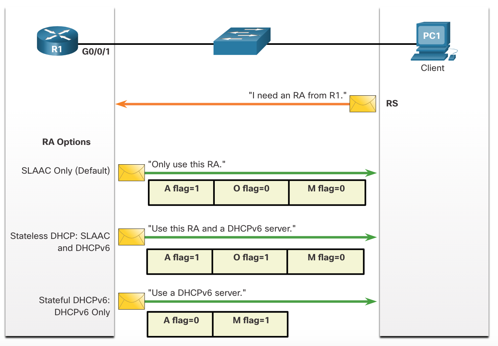

---

Mogelijke combinaties:

**A** (Autoconfiguration): Alleen SLAAC, zonder toeters en bellen (<u>stateless</u>)

**A+O **(Autoconfiguration + other configuration): SLAAC + DHCPv6, extra info komt van de DHCPv6 server (<u>stateless</u>)

**M **(Managed Configuration): DHCPv6 server die alles beheerd (<u>stateful</u>) 

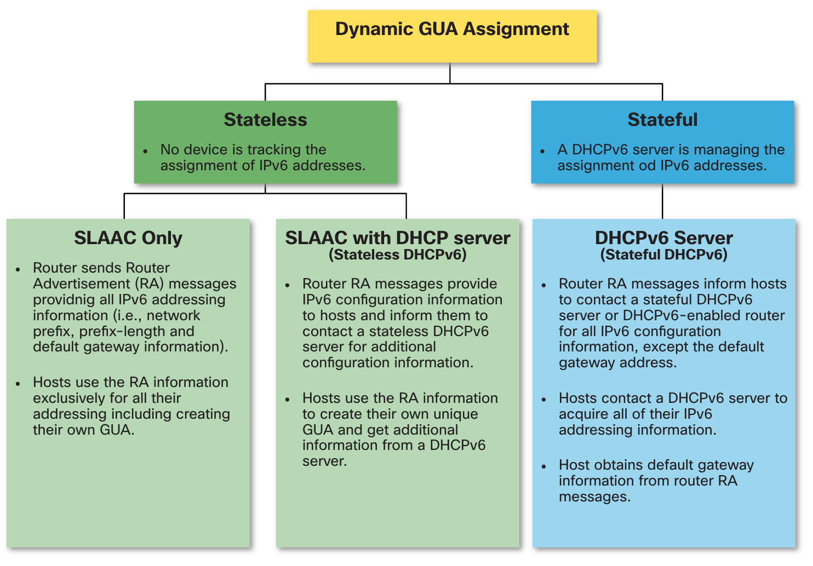

## Duplicate address detection

Als je een random adres genereert kan het natuurlijk dat er iemand anders hetzelfde adres heeft. Weet maar gewoon dat het bestaat. Meer info vindt je [hier](https://lmgtfy.com/?q=duplicate+address+detection&iie=1)


## DHCPv6

1. The host sends an RS message.
2. The router responds with an RA message.
3. The host sends a DHCPv6 SOLICIT message.
4. The DHCPv6 server responds with an ADVERTISE message.
5. The host responds to the DHCPv6 server.
6. The DHCPv6 server sends a REPLY message.


## Configuratie (commando's)

**SLAAC aanzetten** (als je ipv6 unicast routing aanzet is SLAAC de default)

```
ipv6 unicast-routing
```

**Stateless DHCPv6 configureren**

Server (in dit geval een router):

```
R1(config)# ipv6 unicast-routing
R1(config)# ipv6 dhcp pool IPV6-STATELESS --dit maakt een pool, de conventie is om hem in ALL CAPS te schrijven
R1(config-dhcpv6)# dns-server 2001:db8:acad:1::254 --geeft dns server aan de pool
R1(config-dhcpv6)# domain-name example.com 
R1(config-dhcpv6)# exit
R1(config)# interface GigabitEthernet0/0/1
R1(config-if)# description Link to LAN
R1(config-if)# ipv6 address fe80::1 link-local
R1(config-if)# ipv6 address 2001:db8:acad:1::1/64
R1(config-if)# ipv6 nd other-config-flag --hier heb je de flag
R1(config-if)# ipv6 dhcp server IPV6-STATELESS
R1(config-if)# no shut
```

Client (in dit geval ook een router):

```
R3(config)# ipv6 unicast-routing
R3(config)# interface g0/0/1
R3(config-if)# ipv6 enable
R3(config-if)# ipv6 address autoconfig
R3(config-if)# end
```

**Stateful DHCPv6 configureren**

Server:

```
R1(config)# ipv6 unicast-routing
R1(config)# ipv6 dhcp pool IPV6-STATEFUL
R1(config-dhcpv6)# address prefix 2001:db8:acad:1::/64
R1(config-dhcpv6)# dns-server 2001:4860:4860::8888
R1(config-dhcpv6)# domain-name example.com
R1(config)# interface GigabitEthernet0/0/1
R1(config-if)# description Link to LAN
R1(config-if)# ipv6 address fe80::1 link-local
R1(config-if)# ipv6 address 2001:db8:acad:1::1/64
R1(config-if)# ipv6 nd managed-config-flag --m flag op 1 zetten
R1(config-if)# ipv6 nd prefix default no-autoconfig --a flag op 0 zetten
R1(config-if)# ipv6 dhcp server IPV6-STATEFUL
R1(config-if)# no shut
R1(config-if)# end
R1(config-if)# ipv6 nd other-config-flag
```

> **Note:** You can use the **no ipv6 nd managed-config-flag** to set the M flag back to its default of 0. The **no** **ipv6 nd prefix default no-autoconfig** command sets the A flag back its default of 1.

Client:

```
R3(config)# ipv6 unicast-routing
R3(config)# interface g0/0/1
R3(config-if)# ipv6 enable
R3(config-if)# ipv6 address dhcp
R3(config-if)# end
```


**Configure a DHCPv6 Relay Agent**

Syntax:

```
Router(config-if)# ipv6 dhcp relay destination ipv6-address [interface-type interface-number]
```

Voorbeeld:

```
R1(config)# interface gigabitethernet 0/0/1
R1(config-if)# ipv6 dhcp relay destination 2001:db8:acad:1::2 G0/0/0
R1(config-if)# exit
```


## Verificatie (commando's)

IPv6 pool en extra info tonen:

```
show ipv6 dhcp pool
```

Display the IPv6 link-local address of the client and the global unicast address assigned by the server.

```
show ipv6 dhcp binding
```

Toon DHCPv6 info van de interfaces 

```
show ipv6 dhcp interface
```

Op de client kijken of het werkt:

```
ipconfig /all
```


# Module 9: FHRP Concepts

**FHRP**: First Hop Redundancy Protocols

**HSRP**: Hot Standby Router Protocol

> HSRP is a Cisco-proprietary FHRP that is designed to allow for transparent failover of a first-hop IP device.

Dus HSRP is een FHRP van Cisco.

In de test van Netacad van deze module wordt er van je verwacht dat je alle eigenschappen van verschillende FHR protocollen kent (GLBP, HSRP, VRRPv2, VRRPv3, IRDP, ...) Ik weet niet of dit super nuttig is, maar ik heb het gezegd.

**Default Gateway**: Dit apparaat routeert netwerkverkeer dat bestemd is voor de buitenwereld.
**Virtual Router**: Dit apparaat geeft de illusie dat er maar 1 router is. Maar is eigenlijk deel van een groep routers.
**Standby Router**: Deze router behoort tot de virtuele routergroep en heeft de rol van alternatieve gateway.
**Forwarding router**: De router behoort tot de virtuele routergroep en heeft de rol van standaard gateway.

## Essentie

### FHRP

Een end-device heeft, zoals wij het geleerd hebben altijd **één default gateway**. Dat is niet goed, want als die gateway kapot gaat is alles naar de klote (= single point of failure). Hoe lossen we dit op? Simpel. We geven de end-device een **virtual router** als default gateway. Als de router die jouw pakketjes aan het routeren is plotseling sterft. Dan kan een andere router (die in standby stond) gewoon alle info van de dode router overnemen en het lijkt gewoon alsof er niets gebeurd is.


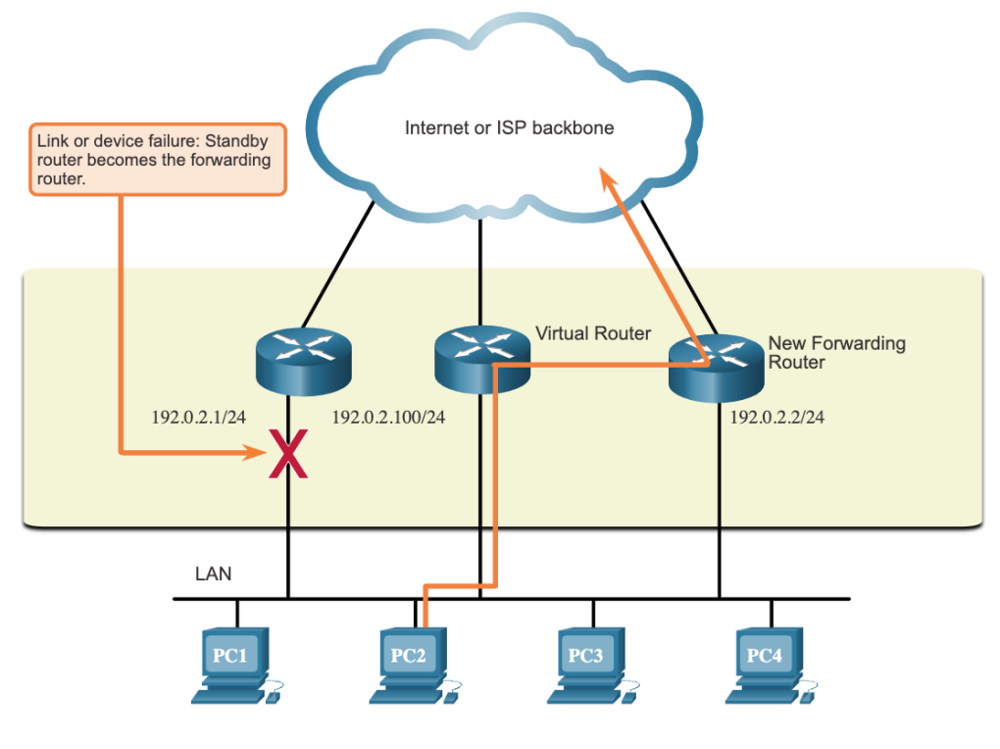

Stappen:

1. The standby router stops seeing Hello messages from the forwarding router.
2. The standby router assumes the role of the forwarding router.
3. Because the new forwarding router assumes both the IPv4 and MAC addresses of the virtual router, the host devices see no disruption in service.

---

### HSRP

HSRP geeft routers een **priority** (tussen 0 en 255, default 100). De router met de hoogste priority wordt de **active router**. Stel je het volgende scenario voor. Er komt ineens een nieuwe router in het netwerk met een hogere priority dan de huidige **active router**. Normaal gezien behoudt de huidige Alpha Chad router zijn positie. Je kan ook **preemption aanzetten** met het `standby preempt` commando. Dan wordt de huidige actieve router een Beta Cuck en de nieuwe router (met hogere prioriteit) wordt dan de nieuwe Alpha Chad router. 

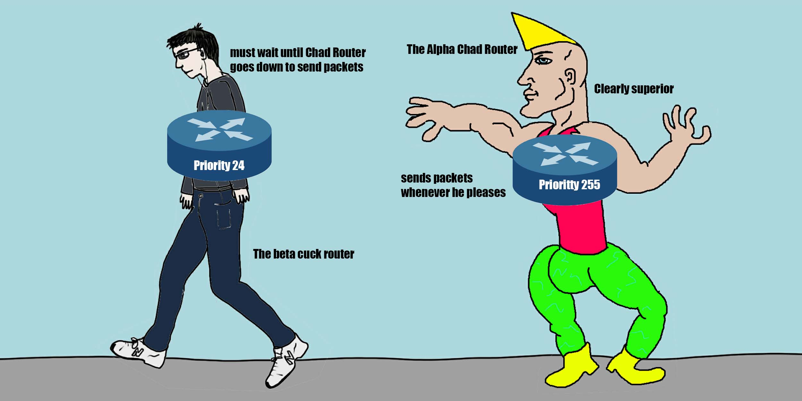

> **Note**: HSRP configuration is not a required skill for this module, course, or for the CCNA certification. However, we thought you might enjoy implementing HSRP in Packet Tracer. Completing this activity will help you better understand how FHRPs, and specifically HSRP, operates.

Moeten we het kunnen van Rudi? Bij de oefeningen staat dat je *9.3.3* moet maken dus allee dan.


## Commando's

**Voorbeeld**

HSRP op een router configureren (active router)

```
R1(config)# interface g0/1
R1(config-if)# standby version 2 --het hele gedoe activeren
R1(config-if)# standby 1 ip 192.168.1.254 --ip van virtuele router
R1(config-if)# standby 1 priority 150 --To configure a router to be the active router
R1(config-if)# standby 1 preempt --dit heb ik net uitgeledg met mijn geweldige analogie
```

standby router

```
standby version 2 --weet je nog wat de default priority was?
standby 1 ip 192.168.1.254
```

Nu moet je op de end-devices (en waarschijnlijk oo de switches) de default gateway veranderen naar `192.168.1.254`.


# Module 10: LAN Security Concepts

## Samenvatting

Er zijn een heleboel systemen die je kan gebruiken om je netwerk te beveiligen. Er zijn ook heel wat aanvallen. Ik zal er hier een paar kort samenvatten/uitleggen (als ik ze interessant of noemenswaardig vind). Je kan misschien best even Module 10 op Netacad lezen als het je interesseert. Er zijn geen oefeningen voor deze module, gewoon veel info. Je kan misschien de quiz op Netacad maken als je je verveelt.

## Vocabulaire

**AAA**:  Authentication, Authorization, and Accounting

> control who is permitted to access a network (authenticate) 
>
> what they can do while they are there (authorize) 
>
> audit what actions they performed while accessing the network (accounting)

**AMP**: advanced malware protection

**NGIPS**: next-generation intrusion prevention system

**NAC**: Network Access Control

**WLC**: wireless LAN controller

**AP**: access point

**BYODs**: bring your own devices

**WSA**: web security appliance

**HIPS**: host-based intrusion prevention system

**ESA**: email security appliance

**DAI**: Dynamic ARP Inspection

**IPSG**: IP Source Guard

**(D)DOS** attack: (Distributed) Denial of service attack

**CDP**: Cisco Discovery Protocol

(Ziek veel afkortingen hier. Misschien niet super nuttig, maar wie weet komt er een vraag waar één van deze afkortingen in voor komt...)


## SSH

Conclusie; Gebruik ssh. Het is veilig.


## 802.1X

> The IEEE 802.1X standard is a port-based access control and authentication protocol. This protocol restricts unauthorized workstations from connecting to a LAN through publicly accessible switch ports. The authentication server authenticates each workstation that is connected to a switch port before making available any services offered by the switch or the LAN.

Met dit protocol mag je, zelfs als je een ethernet kabel rechtstreeks in je pc steekt niet zomaar op het netwerk.


## Layer 2 Vulnerabilities

Laag 2 is heel kwetsbaar. Als er een kwetsbaarheid is in laag 2, vallen alle veiligheidoverwegingen in de bovenliggende lagen aan diggelen.

### Threats & Solutions

Een paar voorbeelden van laag 2 aanvallen van Netacad:

| **Category**                 | **Examples**                                                 |
| :--------------------------- | :----------------------------------------------------------- |
| **MAC Table Attacks**        | Includes MAC address flooding attacks.                       |
| **VLAN Attacks**             | Includes VLAN hopping and VLAN double-tagging attacks. It also includes attacks between devices on a common VLAN. |
| **DHCP Attacks**             | Includes DHCP starvation and DHCP spoofing attacks.          |
| **ARP Attacks**              | Includes ARP spoofing and ARP poisoning attacks.             |
| **Address Spoofing Attacks** | Includes MAC address and IP address spoofing attacks.        |
| **STP Attacks**              | Includes Spanning Tree Protocol manipulation attacks.        |

En een paar oplossingen:

| **Solution**                     | **Description**                                              |
| :------------------------------- | :----------------------------------------------------------- |
| **Port Security**                | Prevents many types of attacks including MAC address flooding attacks and DHCP starvation attacks. |
| **DHCP Snooping**                | Prevents DHCP starvation and DHCP spoofing attacks.          |
| **Dynamic ARP Inspection (DAI)** | Prevents ARP spoofing and ARP poisoning attacks.             |
| **IP Source Guard (IPSG)**       | Prevents MAC and IP address spoofing attacks.                |


### MAC Address Table Flooding

Een aanvaller gaat heel veel verschillende pakketjes met verschillende **source mac adressen** sturen. Na een tijd is de **mac address table** van de switch vol. Dus gaat de switch binnenkomend verkeerd (binnen de vlan/lan) naar alle poorten sturen. Ook naar de poort van de aanvaller. De aanvaller kan nu alle pakketjes binnen deze LAN of VLAN bekijken.

**Oplossing**

Port security:

> Port security will only allow a specified number of source MAC addresses to be learned on the port.


## LAN Attacks

### VLAN Hopping Attacks

Een aanvaller doet alsof zijn pc een switch is met een trunk poort. Als hij zich aansluit aan een poort van een switch op het netwerk, dan gaat de switch deze poort vaak automatisch in trunk mode zetten. Dit komt omdat switches vaak zijn geconfigureerd met Dynamic Trunking Protocol (DTP). Nu kan de aanvaller verkeer ontvangen en versturen in eender welke VLAN.


### VLAN Double-Tagging Attack

Een frame inpakken in een ander frame. In de buitenste zet je dat het frame bedoeld is voor de native vlan (bv VLAN 10). In de binnenste steek je de VLAN (bv VLAN 20) waarnaar je het frame wilt sturen. De switch die het pakketje krijgt denkt dat alles oke is, pakt het pakketje uit en stuurt het door op zijn trunk. Wanneer het aankomt bij de volgende switch, ziet die ineens een pakketje voor VLAN 20. Hij stuurt het dan door naar VLAN 20.

Dit werk alleen als de aanvaller aangesloten is aan een poort die in dezelfde VLAN zit als de native VLAN van de trunk poort van de switch.

**Je kan de vorige twee aanvallen zo voorkomen:**

- Disable trunking on all access ports.

- Disable auto trunking on trunk links so that trunks must be manually enabled.

- Be sure that the native VLAN is only used for trunk links.

  

### DHCP Attacks

> DHCP Attack: DHCP servers dynamically provide IP configuration information including IP address, subnet mask, default gateway, DNS servers, and more to clients. Two types of DHCP attacks are DHCP starvation and DHCP spoofing. Both attacks are mitigated by implementing DHCP snooping.

#### DHCP Starvation Attack

Alle adressen in de DHCP pool te claimen (d.m.v. een programma zoals Gobbler). Nu kan niemand nog een adres krijgen. 

#### DHCP Spoofing Attack

Zelf een DHCP server op het netwerk aansluiten die verkeerde informatie doorstuurt (ip adressen, default gateway, dns). Waardoor je dus DOS of een man-in-the-middle attack kunt doen. Je kan bijvoorbeeld gebruikers naar jouw eigen dns server wijzen. Als ze dan naar google gaan, kan je ze een fake website of iets dergelijks voorschotelen.


### ARP attacks

Een aanvaller stuurt fake ARP replies om pc's bv. een andere default gateway te geven. Nu de pc's zijn apparaat als default gateway hebben, kan hij man-in-the-middle aanvallen doen.

> ARP Attack: A threat actor sends a gratuitous ARP message containing a spoofed MAC address to a switch, and the switch updates its MAC table accordingly. Now the threat actor sends unsolicited ARP Replies to other hosts on the subnet with the MAC Address of the threat actor and the IP address of the default gateway. ARP spoofing and ARP poisoning are mitigated by implementing DAI.


### Address Spoofing Attack

Jouw adres hetzelfde maken als een ander adres op het netwerk (ip of mac). Dan krijg jij de pakketjes van iemand anders.

> Address Spoofing Attack: IP address spoofing is when a threat actor hijacks a valid IP address of another device on the subnet or uses a random IP address. MAC address spoofing attacks occur when the threat actors alter the MAC address of their host to match another known MAC address of a target host. IP and MAC address spoofing can be mitigated by implementing IPSG.


### STP Attack

Hier probeert een anvaller de root bridge te worden. ([als je niet weet wat een root bridge is klik hier](#module-5:-stp-concepts)) Hij stuurt BPDU's uit met een hele lage priority, waardoor de switches in het netwerk hem verkiezen als root bridge. Nu kan hij aan al het verkeer in het domein.

> STP Attack: Threat actors manipulate STP to conduct an attack by spoofing the root bridge and changing the topology of a network. Threat actors make their hosts appear as root bridges; therefore, capturing all traffic for the immediate switched domain. This STP attack is mitigated by implementing BPDU Guard on all access ports


### CDP Reconnaissance

> The Cisco Discovery Protocol (CDP) is a proprietary Layer 2 link discovery protocol. It is enabled on all Cisco devices by default. CDP can automatically discover other CDP-enabled devices and help auto-configure their connection. Network administrators also use CDP to help configure and troubleshoot network devices.

CDP stuurt veel info om apparaten automatisch te configureren. Je kan misbruik maken van deze info.

Om dit te voorkomen kan je CDP volledig of op sommige poorten uitzetten. Bijvoorbeeld op poorten waar vreemde apparaten zich aan kunnen verbinden.

> CDP Reconnaissance: CDP information is sent out CDP-enabled ports in periodic, unencrypted broadcasts. CDP information includes the IP address of the device, IOS software version, platform, capabilities, and the native VLAN. The device receiving the CDP message updates its CDP database. the information provided by CDP can also be used by a threat actor to discover network infrastructure vulnerabilities. To mitigate the exploitation of CDP, limit the use of CDP on devices or ports.


# Module 11: Switch Security Configuration

Okeeej. Na een heel hoofdstuk tekst gaan we nu leren hoe we al deze shit echt moeten toepassen.


## Implement Port Security

Best practice: Zet alle ongebruikte poorten uit met `shutdown`.

### MAC Address Table Attacks

Je kan ze gemakkelijk voorkomen door port-security aan te zetten. Dan wordt er in dit geval maar 1 mac-adres per poort toegelaten. Dan kan de aanvaller geen [Mac Address Table attack](#mac-address-table-flooding) doen

```
S1(config)# interface f0/1
S1(config-if)# switchport port-security
Command rejected: FastEthernet0/1 is a dynamic port.
S1(config-if)# switchport mode access
S1(config-if)# switchport port-security
S1(config-if)# end
```

#### **Limit and Learn MAC Addresses**

Je kan een maximum aantal mac adresses toelaten per poort:

```
Switch(config-if)# switchport port-security maximum [aantal] 
```

Je kan een vast mac adres toelaten op een poort:

```
Switch(config-if)# switchport port-security mac-address mac-address
```

En je kan de switch een mac adres dynamisch laten leren en dat adres dan in de running-config (RAM) "plakt" (vandaar sticky):

> Als je dan de running-config opslaat, wordt het adres ook echt opgeslagen in de NVRAM.

```
Switch(config-if)# switchport port-security mac-address sticky
```

Je kan ze dus alledrie tesamen gebruiken.


### Port security aging

- **Absolute** - The secure addresses on the port are deleted after the specified aging time.
- **Inactivity** - The secure addresses on the port are deleted only if they are inactive for the specified aging time.

Syntax:

```
Switch(config-if)# switchport port-security aging { static | time time | type {absolute | inactivity}}
```

Voorbeeld:

```
S1(config)# interface fa0/1
S1(config-if)# switchport port-security aging time 10 
S1(config-if)# switchport port-security aging type inactivity 
```

> The example shows an administrator configuring the aging type to 10 minutes of inactivity and by using the **show port-security interface** command to verify the configuration.


### Port Security Violation Modes

Wat moet er gebeuren als er dan toch iemand afkomt met een mac adres dat niet toegelaten is volgens de regels die we hebben ingesteld?

Syntax: 

```
Switch(config-if)# switchport port-security violation { protect | restrict | shutdown} 
```

| Mode                 | Description                                                  |
| :------------------- | :----------------------------------------------------------- |
| `shutdown` (default) | The port transitions to the error-disabled state immediately, turns off the port LED, and sends a syslog message. It increments the violation counter. When a secure port is in the error-disabled state, an administrator must re-enable it by entering the **shutdown** and **no shutdown** commands. |
| `restrict`           | The port drops packets with unknown source addresses until you remove a sufficient number of secure MAC addresses to drop below the maximum value or increase the maximum value. This mode causes the Security Violation counter to increment and generates a syslog message. |
| `protect`            | This is the least secure of the security violation modes. The port drops packets with unknown MAC source addresses until you remove a sufficient number of secure MAC addresses to drop below the maximum value or increase the maximum value. No syslog message is sent. |

Voorbeeld:

```
S1(config)# interface f0/1
S1(config-if)# switchport port-security violation restrict
S1(config-if)# end
```

> The following example shows an administrator changing the security violation to “restrict”. The output of the **show port-security interface** command confirms that the change has been made.


### Ports in error-disabled State

Als er een *violation* is gebeurd, dan krijg je mogelijk dit te zien:

```
*Sep 20 06:44:54.966: %PM-4-ERR_DISABLE: psecure-violation error detected on Fa0/18, putting Fa0/18 in err-disable state
*Sep 20 06:44:54.966: %PORT_SECURITY-2-PSECURE_VIOLATION: Security violation occurred, caused by MAC address 000c.292b.4c75 on port FastEthernet0/18.
*Sep 20 06:44:55.973: %LINEPROTO-5-PPDOWN: Line protocol on Interface FastEthernet0/18, changed state to down
*Sep 20 06:44:56.971: %LINK-3-UPDOWN: Interface FastEthernet0/18, changed state to down
```

Als dat gebeurt zorg je eerst dat je zeker bent dat je de *threat* geëlimineerd hebt. Dan doe je `shutdown` en daarna `no shutdown` op de poort waar je dit kreeg.


### Verificatie (commando's)

| Wat doet het                                          | Hoe moet het?                              |
| ----------------------------------------------------- | ------------------------------------------ |
| Port security tonen                                   | `show port-security`                       |
| Port security per interface tonen                     | `show port-security interface [interface]` |
| Sticky mac-adressen van een interface zien            | `show run | begin interface [interface]`   |
| Handmatig geconfigureerde mac-adressen per poort zien | `show port-security address`               |


## Vlan Attacks tegengaan

Je moet ervoor zorgen dat als iemand zijn pc verbind aan een poort, dat die poort niet automatisch een trunk wordt. (DTP disablen.) Zet ook ongebruikte poorten uit. Zet de native vlan op een ongebruikte vlan. Lees [hier](#lan-attacks) voor meer info 

> For example, assume the following:
>
> - FastEthernet ports 0/1 through fa0/16 are active access ports
> - FastEthernet ports 0/17 through 0/24 are not currently in use
> - FastEthernet ports 0/21 through 0/24 are trunk ports.
>
> VLAN hopping can be mitigated by implementing the following configuration.

Zo kunnen die poorten niet ineens trunks worden:

```
S1(config)# interface range fa0/1 - 16
S1(config-if-range)# switchport mode access
```

Op een ongebruikte VLAN zetten, want deze poorten zijn momenteel niet in gebruik:

```
S1(config)# interface range fa0/17 - 20
S1(config-if-range)# switchport mode access
S1(config-if-range)# switchport access vlan 1000
```

Manueel op trunk zetten en er voor zorgen dat de native vlan een ongebruikte vlan is.

```
S1(config)# interface range fa0/21 - 24
S1(config-if-range)# switchport mode trunk
S1(config-if-range)# switchport nonegotiate 
S1(config-if-range)# switchport trunk native vlan 999
```

##  DHCP Attacks tegengaan

Je moet DHCP snooping aanzetten. DHCP snooping zet standaard poorten op **untrusted**. 

> It then filters DHCP messages and rate-limits DHCP traffic from und sources.

Dan zou je de trunk poorten op trusted kunnen zetten en alle access poorten op untrusted laten staan.

> Use the following steps to enable DHCP snooping:
>
> **Step 1**. Enable DHCP snooping by using the **ip dhcp snooping** global configuration command.
>
> **Step 2**. On trusted ports, use the **ip dhcp snooping trust** interface configuration command.
>
> **Step 3**. Limit the number of DHCP discovery messages that can be received per second on untrusted ports by using the **ip dhcp snooping limit rate** interface configuration command.
>
> **Step 4**. Enable DHCP snooping by VLAN, or by a range of VLANs, by using the **ip dhcp snooping** *vlan* global configuration command.

Voorbeeld:


```
S1(config)# ip dhcp snooping
S1(config)# interface f0/1
S1(config-if)# ip dhcp snooping trust
S1(config-if)# exit
S1(config)# interface range f0/5 - 24
S1(config-if-range)# ip dhcp snooping limit rate 6  
S1(config-if)# exit
S1(config)# ip dhcp snooping vlan 5,10,50-52
S1(config)# end
```

dan kan je `show ip dhcp snooping ` doen om het te verifiëren. En `show ip dhcp snooping binding` om te zien welke ip's aan welke mac-adressen zijn gelinkt.


## ARP Attacks tegengaan

Lees [dit](#arp-attacks) als je niet weet wat een ARP attack is. 

Je moet DAI gebruiken, dit is wat het doet:

> Dynamic ARP inspection (DAI) requires DHCP snooping and helps prevent ARP attacks by:
>
> - Not relaying invalid or gratuitous ARP Replies out to other ports in the same VLAN.
> - Intercepting all ARP Requests and Replies on untrusted ports.
> - Verifying each intercepted packet for a valid IP-to-MAC binding.
> - Dropping and logging ARP Replies coming from invalid to prevent ARP poisoning.
> - Error-disabling the interface if the configured DAI number of ARP packets is exceeded.

Dit moet je doen om het aan te zetten:

> - Enable DHCP snooping globally.
> - Enable DHCP snooping on selected VLANs.
> - Enable DAI on selected VLANs.
> - Configure trusted interfaces for DHCP snooping and ARP inspection.

Zo doe je dat:

```
S1(config)# ip dhcp snooping
S1(config)# ip dhcp snooping vlan 10
S1(config)# ip arp inspection vlan 10
S1(config)# interface fa0/24
S1(config-if)# ip dhcp snooping trust
S1(config-if)# ip arp inspection trust
```


```
ip arp inspection validate {[src-mac] [dst-mac] [ip]}
```

> is used to configure DAI to drop ARP packets when the IP addresses are invalid. It can be used when the MAC addresses in the body of the ARP packets do not match the addresses that are specified in the Ethernet header.

Je kan *src-mac*, *dst-mac* en *ip* tegelijk aanzetten


## STP attacks tegengaan

Als je niet meer precies weet wat een STP attack precies is, klik [hier](#stp-attack)

### PortFast

Je moet op alle access ports **PortFast** zetten. 

> PortFast immediately brings an interface configured as an access or trunk port to the forwarding state from a blocking state, bypassing the listening and learning states. Apply to all end-user ports. PortFast should only be configured on ports attached to end devices.

Een poort op PortFast zetten:

```
S1(config)# interface fa0/1
S1(config-if)# switchport mode access
S1(config-if)# spanning-tree portfast
```

Op alle poorten PortFast zetten:

```
S1(config)# spanning-tree portfast default
%Warning: this command enables portfast by default on all interfaces. You
 should now disable portfast explicitly on switched ports leading to hubs,
 switches and bridges as they may create temporary bridging loops.
```

Verifieren:

`show running-config | begin span` of `show spanning-tree summary` om te zien of PortFast global aanstaat. 

`show running-config interface [interface]` om te kijken of portfast op een interface aanstaat. 

`show spanning-tree interface [type/number] detail` voor verificatie.


### BPDU Guard

> Even though PortFast is enabled, the interface will still listen for BPDUs. Unexpected BPDUs might be accidental, or part of an unauthorized attempt to add a switch to the network.

Zo zet je BPDU guard aan

```
S1(config)# interface fa0/1
S1(config-if)# spanning-tree bpduguard enable -- zet bpdu guard aan
S1(config-if)# exit
S1(config)# spanning-tree portfast bpduguard default --zet bpdu guard op alle PortFast poorten
S1(config)# end
S1# show spanning-tree summary --verificatie
```


## Commando's en tips

Als je `switchport port-security mac-address sticky `gebruikt en perongeluk eerst een verkeerd apparaat laat pingen, kan je het sticky adres resetten met

```
no switchport port-security mac-address [mac-adres]
```


# Module 12: WLAN Concepts

We beginnen weer met een paar leuke afkortingen:

**WPAN**: Wireless Personal-Area Networks bv. Bluetooth

**WLAN**: Wireless LAN

**WMAN**: Wireless MAN (Metropolitan area network) bv. WiMax (zoek maar op)

**WWAN**: Wireless WAN (Wide Area Network)

Je modem thuis is 3 apparaten tegelijk.

> - **Access point** - This provides 802.11a/b/g/n/ac wireless access.
> - **Switch** - This provides a four-port, full-duplex, 10/100/1000 Ethernet switch to interconnect wired devices.
> - **Router** - This provides a default gateway for connecting to other network infrastructures, such as the internet.


## WLAN Components

Hier staat niet super veel in dat jullie nog niet weten. Je mag het altijd lezen als je zeker wilt zijn, maar verspil je tijd best niet. 

#### Access Points

**Autonomous Access Points**:

Die moet je zelf configureren, nuttig in een klein netwerk

**Controller based access points**: 
